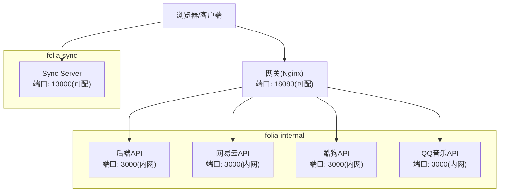
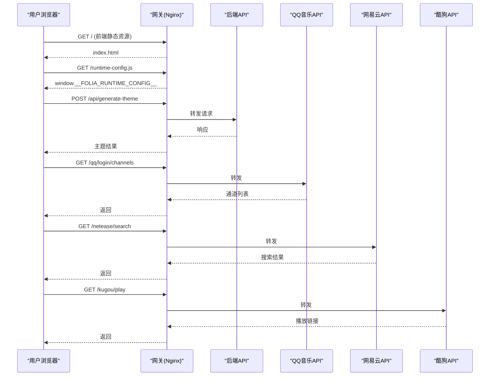
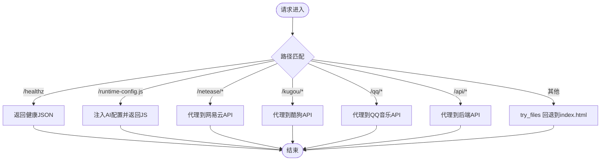
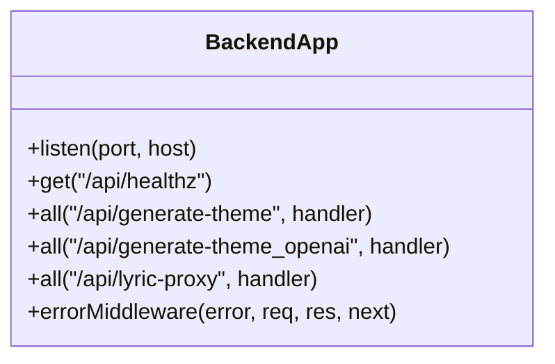
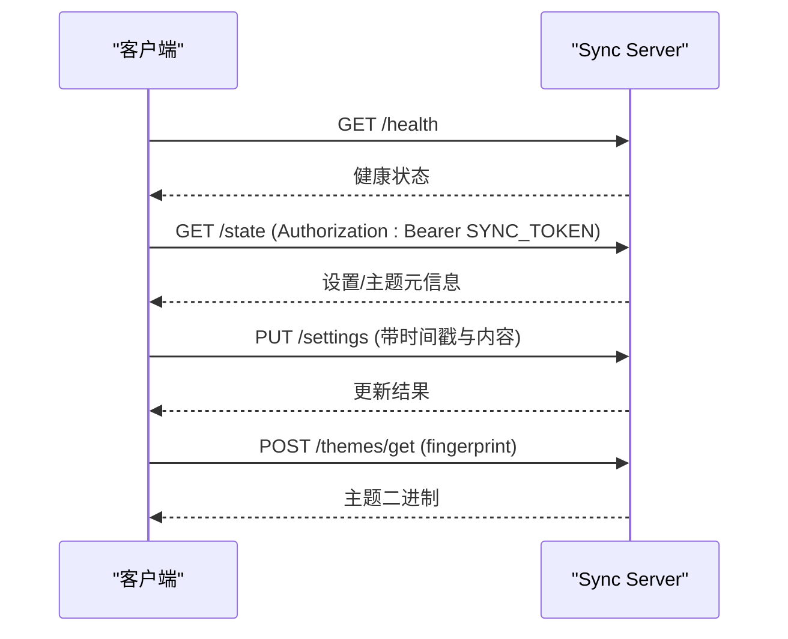
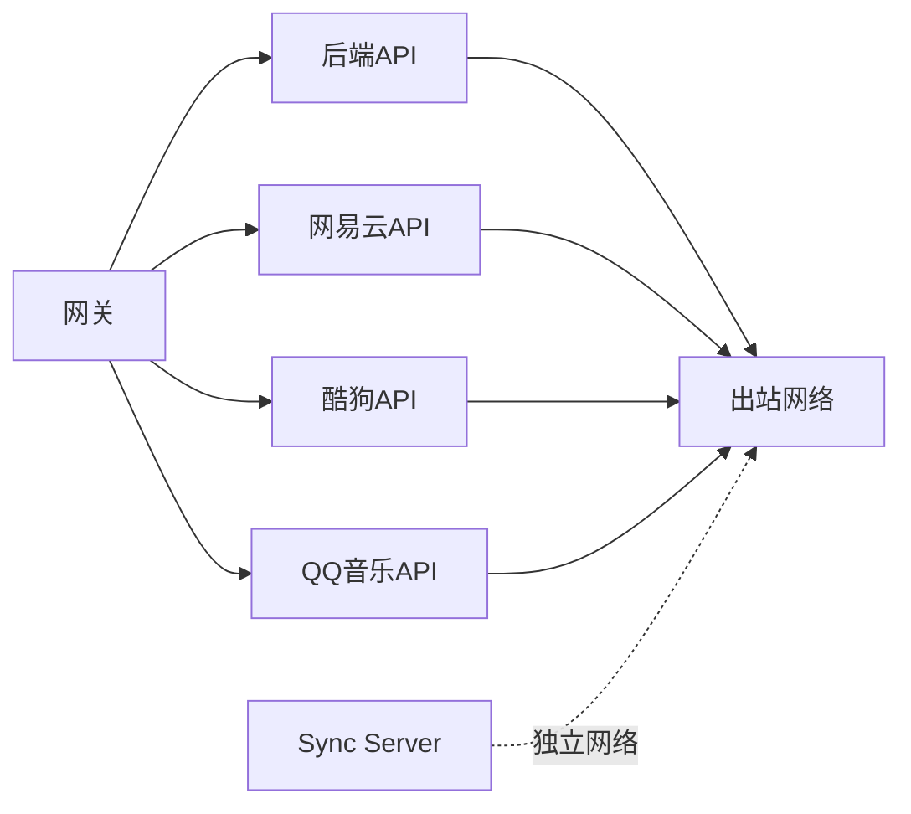

# Docker部署

<cite>
**本文引用的文件**
- [deploy/docker/compose.yaml](file://deploy/docker/compose.yaml)
- [deploy/docker/README.md](file://deploy/docker/README.md)
- [deploy/docker/gateway/nginx.conf.template](file://deploy/docker/gateway/nginx.conf.template)
- [deploy/docker/backend/server.mjs](file://deploy/docker/backend/server.mjs)
- [deploy/docker/images/gateway.Dockerfile](file://deploy/docker/images/gateway.Dockerfile)
- [deploy/docker/images/backend.Dockerfile](file://deploy/docker/images/backend.Dockerfile)
- [deploy/docker/images/sync-server.Dockerfile](file://deploy/docker/images/sync-server.Dockerfile)
- [deploy/docker/compose.sync.yaml](file://deploy/docker/compose.sync.yaml)
- [deploy/docker/compose.build.yaml](file://deploy/docker/compose.build.yaml)
- [docs/qq-music-deployment.md](file://docs/qq-music-deployment.md)
- [deploy/docker/qq-api/README.md](file://deploy/docker/qq-api/README.md)
- [sync-server/README.md](file://sync-server/README.md)
</cite>

## 目录
1. [简介](#简介)
2. [项目结构](#项目结构)
3. [核心组件](#核心组件)
4. [架构总览](#架构总览)
5. [详细组件分析](#详细组件分析)
6. [依赖关系分析](#依赖关系分析)
7. [性能与容量规划](#性能与容量规划)
8. [生产环境最佳实践](#生产环境最佳实践)
9. [QQ音乐服务专项配置](#qq音乐服务专项配置)
10. [健康检查、监控与告警](#健康检查监控与告警)
11. [故障诊断指南](#故障诊断指南)
12. [结论](#结论)

## 简介
本文档面向Folia Player的Docker全栈部署，覆盖网关、后端API、网易云/酷狗/QQ音乐提供商接口、同步服务器（Sync Server）的网络拓扑、数据流、环境变量配置、HTTPS与反向代理、数据持久化、日志收集、健康检查、监控告警、备份恢复、故障诊断与性能调优。读者可据此在生产环境中稳定运行并维护该堆栈。

## 项目结构
- 编排入口：compose.yaml 定义 Web 网关、后端API、三个音乐平台API、Sync Server 以及网络与卷。
- 网关：Nginx 静态资源 + 反向代理到后端与音乐API；通过模板注入运行时配置。
- 后端API：Express 服务，提供主题生成、歌词代理与健康检查。
- 音乐API：网易云、酷狗、QQ音乐各自独立容器，仅内部网络互通。
- Sync Server：独立服务，负责跨端设置与主题同步，使用SQLite持久化。
- 构建与镜像：images 目录下各服务的Dockerfile；compose.build.yaml 用于本地构建验证；compose.sync.yaml 仅启动Sync Server。

图表来源
- [deploy/docker/compose.yaml:4-163](file://deploy/docker/compose.yaml#L4-L163)
- [deploy/docker/gateway/nginx.conf.template:24-83](file://deploy/docker/gateway/nginx.conf.template#L24-L83)

章节来源
- [deploy/docker/compose.yaml:1-179](file://deploy/docker/compose.yaml#L1-L179)
- [deploy/docker/README.md:1-184](file://deploy/docker/README.md#L1-L184)

## 核心组件
- 网关（Gateway）
  - 职责：对外暴露Web前端与统一路由；将 /api/ 转发至后端；将 /netease/、/kugou/、/qq/ 转发至对应API；提供 /healthz 健康检查；动态注入运行时AI配置。
  - 关键配置：监听8080；隐藏Set-Cookie；传递X-Forwarded-*头；只读文件系统；tmpfs缓存。
- 后端API（Backend）
  - 职责：提供主题生成、歌词代理、健康检查；读取AI密钥环境变量。
  - 关键配置：端口3000；信任代理；JSON/Text体大小限制；错误处理中间件。
- 音乐API（Netease/Kugou/QQ）
  - 职责：对接上游音乐平台；提供搜索、播放、登录等能力；仅内部网络访问。
  - 关键配置：端口3000；可选转发客户端IP；健康检查路径；只读文件系统。
- 同步服务器（Sync Server）
  - 职责：跨端同步设置与主题；提供REST API与隐藏看板；SQLite持久化。
  - 关键配置：端口3000；DB_PATH；SYNC_TOKEN鉴权；DASHBOARD_TOKEN看板；数据卷持久化。

章节来源
- [deploy/docker/gateway/nginx.conf.template:24-83](file://deploy/docker/gateway/nginx.conf.template#L24-L83)
- [deploy/docker/backend/server.mjs:1-31](file://deploy/docker/backend/server.mjs#L1-L31)
- [deploy/docker/compose.yaml:36-163](file://deploy/docker/compose.yaml#L36-L163)
- [sync-server/README.md:287-323](file://sync-server/README.md#L287-L323)

## 架构总览
- 网络隔离
  - folia-edge：网关对外暴露。
  - folia-internal：内部服务互访（backend/netease/kugou/qq）。
  - folia-egress：允许出站访问上游平台。
  - folia-sync：Sync Server独立网络，不与Web内部服务互通。
- 数据流
  - 前端请求经网关路由到后端或音乐API。
  - 客户端直接连接Sync Server进行设置/主题同步，不经过网关。
  - 所有外部流量建议由NAS/边缘反向代理终止HTTPS并透传X-Forwarded-*。

图表来源
- [deploy/docker/gateway/nginx.conf.template:42-79](file://deploy/docker/gateway/nginx.conf.template#L42-L79)
- [deploy/docker/backend/server.mjs:16-21](file://deploy/docker/backend/server.mjs#L16-L21)

章节来源
- [deploy/docker/compose.yaml:169-179](file://deploy/docker/compose.yaml#L169-L179)
- [deploy/docker/README.md:55-62](file://deploy/docker/README.md#L55-L62)

## 详细组件分析

### 网关（Gateway）
- 功能要点
  - 静态资源根目录为 /usr/share/nginx/html。
  - /healthz 返回健康状态。
  - /runtime-config.js 动态注入 AI 提供者（google/gemini/openai）。
  - /netease/、/kugou/、/qq/ 反向代理到内部API，隐藏Set-Cookie并透传X-Forwarded-*。
  - /api/ 转发到后端API。
  - 其余路径回退到SPA路由 try_files。
- 安全与性能
  - 只读文件系统、tmpfs缓存、关闭不必要的调试信息。
  - 合理缓冲大小以应对大Set-Cookie场景（如网易云扫码）。

图表来源
- [deploy/docker/gateway/nginx.conf.template:29-83](file://deploy/docker/gateway/nginx.conf.template#L29-L83)

章节来源
- [deploy/docker/gateway/nginx.conf.template:1-86](file://deploy/docker/gateway/nginx.conf.template#L1-L86)
- [deploy/docker/images/gateway.Dockerfile:1-37](file://deploy/docker/images/gateway.Dockerfile#L1-L37)

### 后端API（Backend）
- 功能要点
  - Express应用，启用trust proxy，限制请求体大小。
  - 提供 /api/healthz、/api/generate-theme、/api/generate-theme_openai、/api/lyric-proxy。
  - 全局错误处理中间件输出未捕获异常并返回500。
- 环境变量
  - PORT、GEMINI_API_KEY、OPENAI_* 系列变量控制AI能力。

图表来源
- [deploy/docker/backend/server.mjs:1-31](file://deploy/docker/backend/server.mjs#L1-L31)

章节来源
- [deploy/docker/backend/server.mjs:1-31](file://deploy/docker/backend/server.mjs#L1-L31)
- [deploy/docker/images/backend.Dockerfile:1-28](file://deploy/docker/images/backend.Dockerfile#L1-L28)

### 网易云/酷狗/QQ音乐API
- 网易云/酷狗
  - 端口3000，仅内部网络；可选转发客户端IP；健康检查根路径。
- QQ音乐
  - 端口3000，仅内部网络；支持扫码登录；设备标识与可选加密会话持久化到具名卷；健康检查 /login/status。
  - 多实例注意：二维码会话与设备状态不可共享；需单实例或会话亲和。

章节来源
- [deploy/docker/compose.yaml:63-137](file://deploy/docker/compose.yaml#L63-L137)
- [deploy/docker/qq-api/README.md:23-83](file://deploy/docker/qq-api/README.md#L23-L83)
- [deploy/docker/qq-api/README.md:100-123](file://deploy/docker/qq-api/README.md#L100-L123)

### 同步服务器（Sync Server）
- 功能要点
  - REST API：/health、/state、/settings、/themes/*。
  - 鉴权：除 /health 外均需Bearer Token（SYNC_TOKEN）。
  - 看板：/?token=DASHBOARD_TOKEN 只读展示。
  - 持久化：SQLite文件位于 /app/data/folia-sync.db，映射到宿主机目录。
- 环境变量
  - PORT、DB_PATH、SYNC_TOKEN、DASHBOARD_TOKEN。

图表来源
- [sync-server/README.md:287-323](file://sync-server/README.md#L287-L323)
- [deploy/docker/compose.yaml:139-163](file://deploy/docker/compose.yaml#L139-L163)

章节来源
- [sync-server/README.md:10-47](file://sync-server/README.md#L10-L47)
- [sync-server/README.md:287-323](file://sync-server/README.md#L287-L323)
- [deploy/docker/compose.yaml:139-163](file://deploy/docker/compose.yaml#L139-L163)

## 依赖关系分析
- 服务间依赖
  - 网关依赖 backend、netease-api、kugou-api、qq-api 健康检查通过后启动。
  - 各音乐API与后端仅通过 folia-internal 网络通信。
  - Sync Server 独立网络，不依赖Web内部服务。
- 外部依赖
  - 音乐API需要访问上游平台网络（folia-egress）。
  - 网关与后端可能调用AI服务（OpenAI/Gemini/Google），需出站网络。

图表来源
- [deploy/docker/compose.yaml:21-35](file://deploy/docker/compose.yaml#L21-L35)
- [deploy/docker/compose.yaml:57-61](file://deploy/docker/compose.yaml#L57-L61)
- [deploy/docker/compose.yaml:82-86](file://deploy/docker/compose.yaml#L82-L86)
- [deploy/docker/compose.yaml:106-110](file://deploy/docker/compose.yaml#L106-L110)
- [deploy/docker/compose.yaml:133-137](file://deploy/docker/compose.yaml#L133-L137)
- [deploy/docker/compose.yaml:160-163](file://deploy/docker/compose.yaml#L160-L163)

章节来源
- [deploy/docker/compose.yaml:1-179](file://deploy/docker/compose.yaml#L1-L179)

## 性能与容量规划
- 网关
  - 合理设置proxy_buffers与client_max_body_size以适配大Cookie与大请求体。
  - 使用只读文件系统与tmpfs提升安全性与I/O性能。
- 后端API
  - 限制请求体大小避免滥用；启用trust proxy以便正确获取客户端IP。
- 音乐API
  - 默认不转发客户端IP以避免登录地点误判；仅在兼容旧部署时开启。
- Sync Server
  - SQLite适合中小规模；高并发场景考虑限流与连接池；定期备份数据库。
- 网络
  - 最小化暴露端口：仅网关与Sync Server对外；其余服务仅内部网络。

[本节为通用指导，无需特定文件引用]

## 生产环境最佳实践
- HTTPS与反向代理
  - 在NAS/边缘代理终止HTTPS，并将HTTP重定向到HTTPS。
  - 透传Host、X-Forwarded-Host、X-Forwarded-Proto、X-Forwarded-For。
  - 证书需完整链且受浏览器信任；不建议挂载子路径。
- 数据持久化
  - Sync Server数据目录映射到宿主机；定期备份。
  - QQ音乐设备状态与可选会话文件使用具名卷；不要多实例共享。
- 日志收集
  - 网关日志输出到stdout/stderr；集中采集到日志系统。
  - 各服务健康检查与日志便于快速定位问题。
- 版本管理
  - 固定FOLIA_STACK_VERSION与FOLIA_SYNC_VERSION确保可复现部署。
  - 更新前执行pull与up -d；回滚时修改.env并重复流程。
- 安全加固
  - 所有容器read_only、no-new-privileges。
  - 仅暴露必要端口；内部服务不暴露到宿主机。

章节来源
- [deploy/docker/README.md:105-137](file://deploy/docker/README.md#L105-L137)
- [deploy/docker/README.md:139-167](file://deploy/docker/README.md#L139-L167)
- [deploy/docker/compose.yaml:6-13](file://deploy/docker/compose.yaml#L6-L13)
- [deploy/docker/compose.yaml:38-51](file://deploy/docker/compose.yaml#L38-L51)
- [deploy/docker/compose.yaml:66-75](file://deploy/docker/compose.yaml#L66-L75)
- [deploy/docker/compose.yaml:91-99](file://deploy/docker/compose.yaml#L91-L99)
- [deploy/docker/compose.yaml:115-126](file://deploy/docker/compose.yaml#L115-L126)
- [deploy/docker/compose.yaml:141-153](file://deploy/docker/compose.yaml#L141-L153)

## QQ音乐服务专项配置
- 登录方式
  - 微信扫码：所有部署方式均支持。
  - QQ扫码：Docker/Node.js常驻服务支持；Cloudflare需启用Durable Object；Vercel不支持QQ扫码长连接。
- 环境变量
  - QQ_AUTH_STATE_PATH：设备标识持久化路径（默认相对工作目录）。
  - QQ_AUTH_SESSION_PATH：加密登录态文件路径（需与QQ_SESSION_SECRET同时设置）。
  - QQ_SESSION_SECRET：加密密钥（至少32字节随机值），不得提交到仓库或镜像。
- 会话与设备
  - 设备标识跨重启复用；正常更新无需重新注册装置。
  - 更换设备身份需删除具名卷后重启。
  - 同一时间仅允许一个活跃扫码会话；冲突返回409。
  - 上游失败时返回502并附Retry-After，随后429退避。
- 接入Folia
  - 通过网关 /qq/ 访问；或在独立部署时将VITE_QQ_API_BASE指向实例地址。
  - 登录后验证歌单、收藏专辑、我喜欢与播放功能。

章节来源
- [docs/qq-music-deployment.md:7-30](file://docs/qq-music-deployment.md#L7-L30)
- [docs/qq-music-deployment.md:210-227](file://docs/qq-music-deployment.md#L210-L227)
- [docs/qq-music-deployment.md:268-284](file://docs/qq-music-deployment.md#L268-L284)
- [deploy/docker/qq-api/README.md:23-83](file://deploy/docker/qq-api/README.md#L23-L83)
- [deploy/docker/qq-api/README.md:100-123](file://deploy/docker/qq-api/README.md#L100-L123)
- [deploy/docker/qq-api/README.md:179-194](file://deploy/docker/qq-api/README.md#L179-L194)

## 健康检查、监控与告警
- 健康检查
  - 网关：/healthz
  - 后端：/api/healthz
  - 网易云/酷狗：根路径 /
  - QQ音乐：/login/status
  - Sync Server：/health
- 监控建议
  - 基于Compose healthcheck与docker compose ps观察服务状态。
  - 结合日志聚合系统采集stdout/stderr。
  - 对关键接口（/healthz、/health）进行外部探针监控。
- 告警策略
  - 服务连续多次健康检查失败触发告警。
  - 日志中出现大量错误或上游超时告警。
  - Sync Server数据库增长异常或写入失败告警。

章节来源
- [deploy/docker/compose.yaml:15-20](file://deploy/docker/compose.yaml#L15-L20)
- [deploy/docker/compose.yaml:51-56](file://deploy/docker/compose.yaml#L51-L56)
- [deploy/docker/compose.yaml:76-81](file://deploy/docker/compose.yaml#L76-L81)
- [deploy/docker/compose.yaml:100-105](file://deploy/docker/compose.yaml#L100-L105)
- [deploy/docker/compose.yaml:127-132](file://deploy/docker/compose.yaml#L127-L132)
- [deploy/docker/compose.yaml:154-159](file://deploy/docker/compose.yaml#L154-L159)
- [deploy/docker/README.md:62-63](file://deploy/docker/README.md#L62-L63)

## 故障诊断指南
- 常见问题
  - 页面显示Login Error：检查 /api/qq/login/channels 是否返回JSON而非HTML。
  - 501错误：QQ_SESSION_SECRET未设置或未重新部署。
  - Vercel只有微信扫码：正常行为，平台限制。
  - Cloudflare只有微信：检查Durable Object绑定与类名。
  - 正式域名1042：等待域名传播，勿频繁重建。
  - 扫码后上游20279：清理QQ音乐账号中的旧设备再重试。
  - 修改VITE_QQ_API_BASE后仍请求旧地址：需重新构建前端。
- 诊断命令
  - docker compose ps
  - docker compose logs --tail=200 gateway backend netease-api kugou-api qq-api sync-server
  - curl http://127.0.0.1:18080/healthz
  - curl http://127.0.0.1:18080/api/healthz
  - curl http://127.0.0.1:18080/qq/login/status
  - curl http://127.0.0.1:13000/health
- 备份恢复
  - 停止Sync Server后打包data/sync目录；恢复时解压并重启服务。

章节来源
- [docs/qq-music-deployment.md:286-298](file://docs/qq-music-deployment.md#L286-L298)
- [deploy/docker/README.md:158-167](file://deploy/docker/README.md#L158-L167)
- [deploy/docker/README.md:150-156](file://deploy/docker/README.md#L150-L156)

## 结论
本部署方案通过网关统一入口、内部网络隔离、独立Sync Server实现了安全、可扩展的Folia Player全栈部署。遵循HTTPS、最小权限、只读文件系统、健康检查与日志收集等生产最佳实践，可保障服务稳定性与可维护性。QQ音乐服务提供了灵活的登录与会话管理方案，适配多种部署场景。建议在生产环境中固定版本、完善监控告警与备份恢复流程，持续优化性能与安全性。