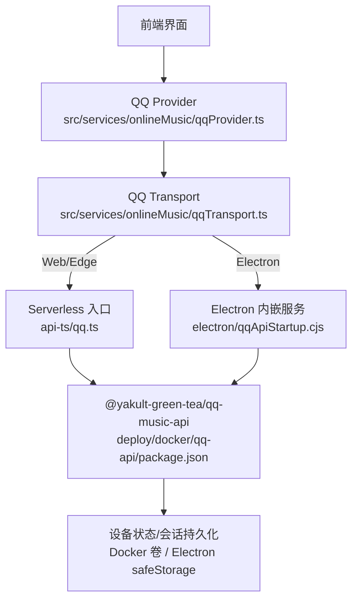
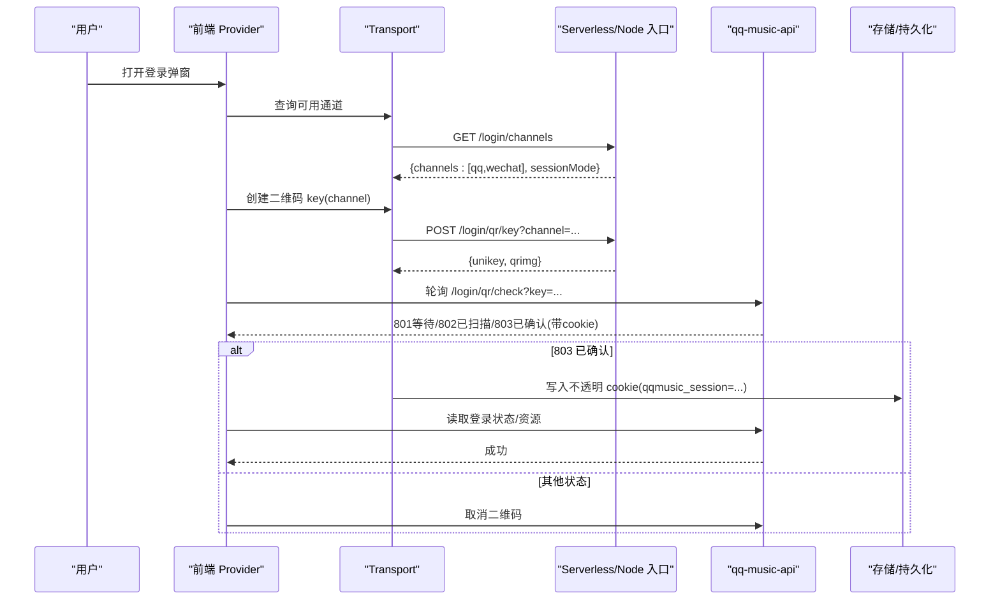
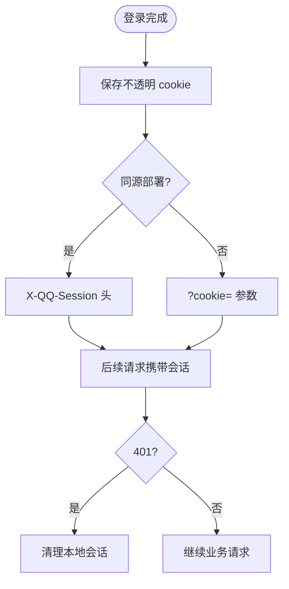
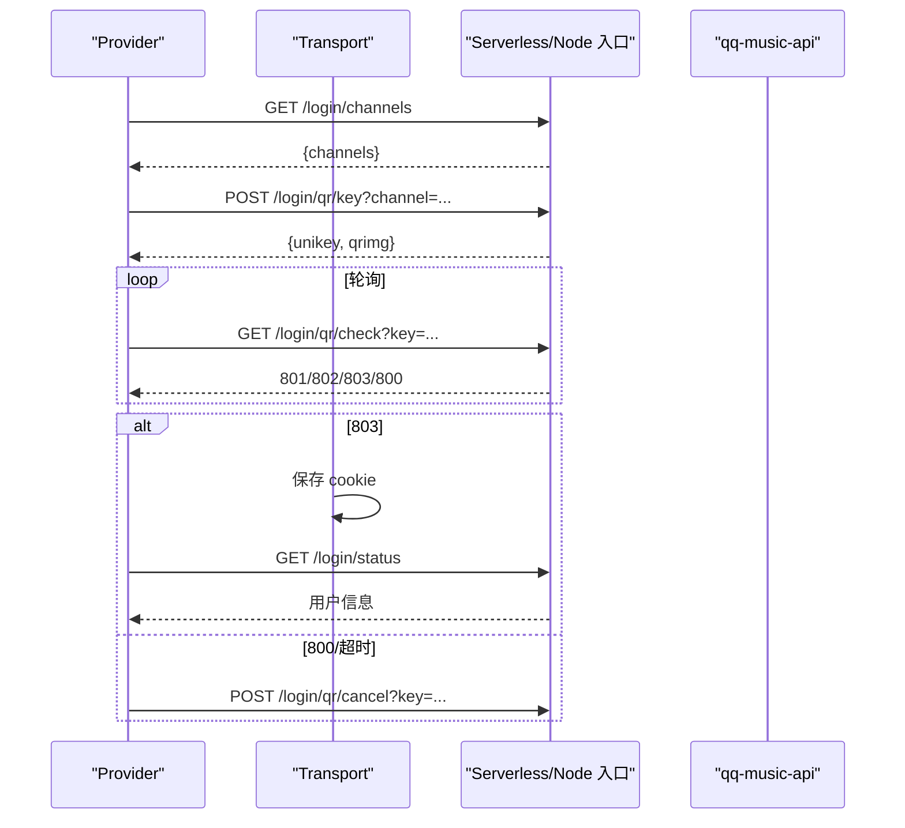
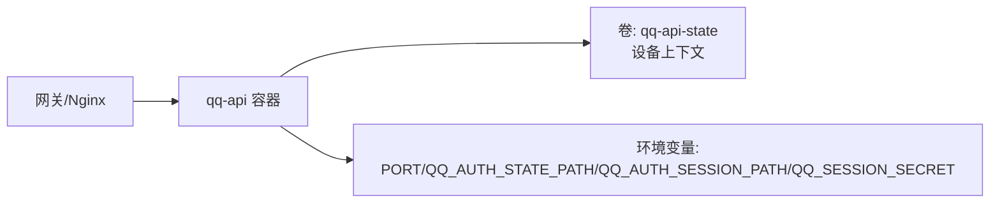
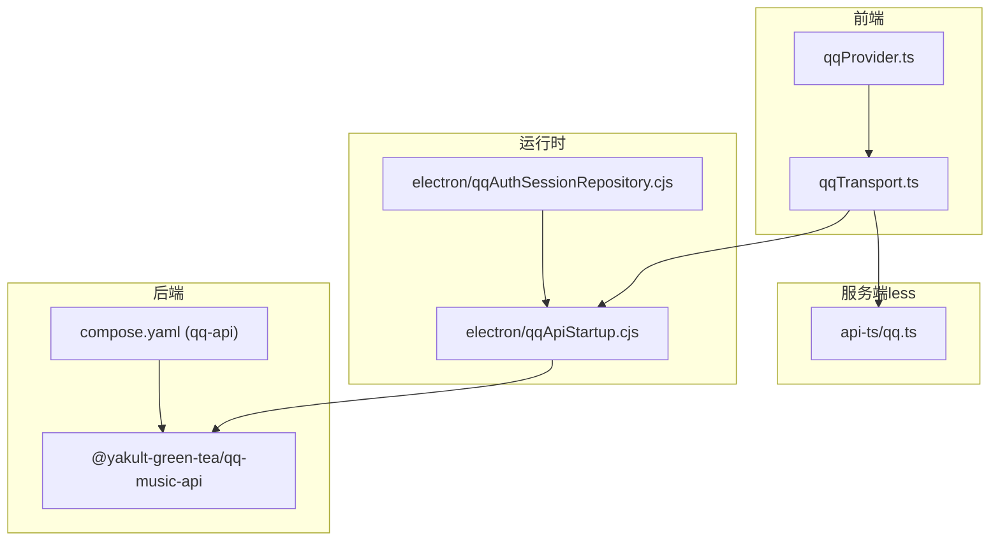

# QQ音乐配置

<cite>
**本文引用的文件**
- [docs/qq-music-deployment.md](file://docs/qq-music-deployment.md)
- [api-ts/qq.ts](file://api-ts/qq.ts)
- [src/services/onlineMusic/qqTransport.ts](file://src/services/onlineMusic/qqTransport.ts)
- [src/services/onlineMusic/qqProvider.ts](file://src/services/onlineMusic/qqProvider.ts)
- [electron/qqApiStartup.cjs](file://electron/qqApiStartup.cjs)
- [electron/qqAuthSessionRepository.cjs](file://electron/qqAuthSessionRepository.cjs)
- [deploy/docker/compose.yaml](file://deploy/docker/compose.yaml)
- [deploy/docker/qq-api/package.json](file://deploy/docker/qq-api/package.json)
- [test/unit/onlineMusic/qqLoginMethod.test.ts](file://test/unit/onlineMusic/qqLoginMethod.test.ts)
</cite>

## 目录
1. [简介](#简介)
2. [项目结构](#项目结构)
3. [核心组件](#核心组件)
4. [架构总览](#架构总览)
5. [详细组件分析](#详细组件分析)
6. [依赖关系分析](#依赖关系分析)
7. [性能与稳定性建议](#性能与稳定性建议)
8. [故障排查指南](#故障排查指南)
9. [结论](#结论)
10. [附录：与其他提供商的差异与迁移](#附录与其他提供商的差异与迁移)

## 简介
本文件面向在 Web、Docker、Electron 等环境中集成 QQ 音乐的用户与运维人员，系统性说明以下要点：
- QQ 音乐 API 的基础路径与认证机制
- 扫码登录完整流程（二维码生成、手机确认、令牌获取与会话持久化）
- Docker 环境中的设备注册、会话持久化与跨容器共享
- 常见问题定位与解决
- 性能优化建议（连接、缓存、限流）
- 与网易云、酷狗等其他提供商的配置差异与迁移方法

## 项目结构
QQ 音乐集成由“前端 Provider/Transport”、“服务端less入口”、“Electron 内嵌服务”以及“Docker 部署”四部分组成：
- 前端通过 qqProvider 暴露统一能力，并通过 qqTransport 将请求路由到后端或 Electron 内嵌服务
- api-ts/qq.ts 是 Vercel/Cloudflare Edge 的扁平入口，负责把平台 rewrite 的路径还原为后端路径并透传会话
- Electron 通过 qqApiStartup.cjs 启动内嵌 qq-music-api，并使用 qqAuthSessionRepository.cjs 安全持久化加密后的会话
- Docker Compose 提供 qq-api 服务，使用卷持久化设备上下文，环境变量注入密钥与会话路径

图表来源
- [src/services/onlineMusic/qqProvider.ts:593-664](file://src/services/onlineMusic/qqProvider.ts#L593-L664)
- [src/services/onlineMusic/qqTransport.ts:16-37](file://src/services/onlineMusic/qqTransport.ts#L16-L37)
- [api-ts/qq.ts:20-37](file://api-ts/qq.ts#L20-L37)
- [electron/qqApiStartup.cjs:67-157](file://electron/qqApiStartup.cjs#L67-L157)
- [deploy/docker/qq-api/package.json:1-8](file://deploy/docker/qq-api/package.json#L1-L8)

章节来源
- [docs/qq-music-deployment.md:44-62](file://docs/qq-music-deployment.md#L44-L62)
- [deploy/docker/compose.yaml:112-137](file://deploy/docker/compose.yaml#L112-L137)

## 核心组件
- 基础路径与可用性检测
  - 前端通过环境变量 VITE_QQ_API_BASE 指定 QQ 音乐 API 基础地址；Electron 运行时通过 IPC 动态解析内嵌端口
  - Transport 层会判断是否已配置，未配置时返回不可用状态
- 认证与会话
  - 扫码确认后，Transport 自动保存后端返回的不透明 cookie（qqmusic_session=...），后续请求按同源走 X-QQ-Session 头，跨源走 ?cookie= 参数
  - 401 响应会清理本地会话并抛出需登录错误
- 扫码登录通道发现
  - Provider 会调用 /login/channels 探测后端支持的扫码方式（qq/wechat），UI 据此显示选择器或直接进入单步流程
- 播放音质降级策略
  - 根据用户期望质量尝试 flac/320/128，若上游拒绝或无直链则降级并记录日志

章节来源
- [src/services/onlineMusic/qqTransport.ts:42-83](file://src/services/onlineMusic/qqTransport.ts#L42-L83)
- [src/services/onlineMusic/qqTransport.ts:85-109](file://src/services/onlineMusic/qqTransport.ts#L85-L109)
- [src/services/onlineMusic/qqTransport.ts:200-244](file://src/services/onlineMusic/qqTransport.ts#L200-L244)
- [src/services/onlineMusic/qqProvider.ts:278-358](file://src/services/onlineMusic/qqProvider.ts#L278-L358)
- [src/services/onlineMusic/qqProvider.ts:171-222](file://src/services/onlineMusic/qqProvider.ts#L171-L222)

## 架构总览
下图展示从前端发起扫码登录到最终获得可播放资源的端到端流程。

图表来源
- [src/services/onlineMusic/qqProvider.ts:624-650](file://src/services/onlineMusic/qqProvider.ts#L624-L650)
- [src/services/onlineMusic/qqTransport.ts:16-37](file://src/services/onlineMusic/qqTransport.ts#L16-L37)
- [api-ts/qq.ts:20-37](file://api-ts/qq.ts#L20-L37)

## 详细组件分析

### 基础路径与环境变量
- 关键变量
  - VITE_QQ_API_BASE：构建期注入的前端访问地址；Electron 下会被 Transport 动态覆盖为内嵌端口
  - QQ_SESSION_SECRET：用于加密 serverless 登录态；常驻 Node/Docker 下用于加密会话文件
  - QQ_SESSION_SECRET_PREVIOUS：轮换旧密钥时的兼容验证
- 行为要点
  - 未设置 VITE_QQ_API_BASE 且非 Electron 环境时，Transport 报告不可用
  - Serverless 入口会将平台 rewrite 的 path 还原为后端路径，并透传 X-QQ-Session 等头部

章节来源
- [docs/qq-music-deployment.md:44-62](file://docs/qq-music-deployment.md#L44-L62)
- [src/services/onlineMusic/qqTransport.ts:42-83](file://src/services/onlineMusic/qqTransport.ts#L42-L83)
- [api-ts/qq.ts:20-37](file://api-ts/qq.ts#L20-L37)

### 认证机制与会话管理
- 会话载体
  - 不透明的 qqmusic_session cookie；同源请求以 X-QQ-Session 头传递，跨源以 ?cookie= 传递
  - 401 时自动清理本地会话
- 持久化
  - Web：保存在 provider storage（浏览器侧）
  - Electron：通过 electron-store + safeStorage 加密后落盘，Linux 上拒绝明文 backend
  - Docker/Node：可选将加密会话写入文件路径（QQ_AUTH_SESSION_PATH），设备标识写入 QQ_AUTH_STATE_PATH

图表来源
- [src/services/onlineMusic/qqTransport.ts:85-109](file://src/services/onlineMusic/qqTransport.ts#L85-L109)
- [src/services/onlineMusic/qqTransport.ts:200-244](file://src/services/onlineMusic/qqTransport.ts#L200-L244)
- [electron/qqAuthSessionRepository.cjs:28-77](file://electron/qqAuthSessionRepository.cjs#L28-L77)

章节来源
- [src/services/onlineMusic/qqTransport.ts:85-109](file://src/services/onlineMusic/qqTransport.ts#L85-L109)
- [electron/qqAuthSessionRepository.cjs:28-77](file://electron/qqAuthSessionRepository.cjs#L28-L77)

### 扫码登录完整流程
- 通道发现：/login/channels 返回支持的方式（qq/wechat）
- 生成二维码：/login/qr/key?channel=...
- 展示二维码：/login/qr/create?key=...
- 轮询确认：/login/qr/check?key=... 返回 801/802/803/800
- 成功后：Transport 自动保存 cookie；Provider 可立即读取登录状态
- 关闭弹窗：调用 /login/qr/cancel 释放 MQTT WebSocket（Cloudflare Durable Object 场景）

图表来源
- [src/services/onlineMusic/qqProvider.ts:624-650](file://src/services/onlineMusic/qqProvider.ts#L624-L650)
- [src/services/onlineMusic/qqTransport.ts:16-37](file://src/services/onlineMusic/qqTransport.ts#L16-L37)
- [docs/qq-music-deployment.md:162-208](file://docs/qq-music-deployment.md#L162-L208)

章节来源
- [src/services/onlineMusic/qqProvider.ts:278-358](file://src/services/onlineMusic/qqProvider.ts#L278-L358)
- [src/services/onlineMusic/qqProvider.ts:624-650](file://src/services/onlineMusic/qqProvider.ts#L624-L650)
- [docs/qq-music-deployment.md:162-208](file://docs/qq-music-deployment.md#L162-L208)

### Docker 环境特殊配置
- 服务编排
  - compose.yaml 中定义 qq-api 服务，暴露内部端口，挂载卷 qq-api-state 持久化设备上下文
  - 健康检查调用 /login/status 判定服务就绪
- 环境变量
  - PORT：服务监听端口
  - QQ_AUTH_STATE_PATH：设备标识文件路径（仅设备上下文，不含凭证）
  - QQ_AUTH_SESSION_PATH：可选的加密会话文件路径
  - QQ_SESSION_SECRET：加密 serverless 登录态或会话文件的密钥
- 版本与依赖
  - Docker 镜像基于 @yakult-green-tea/qq-music-api 3.1.0

图表来源
- [deploy/docker/compose.yaml:112-137](file://deploy/docker/compose.yaml#L112-L137)
- [deploy/docker/qq-api/package.json:1-8](file://deploy/docker/qq-api/package.json#L1-L8)

章节来源
- [deploy/docker/compose.yaml:112-137](file://deploy/docker/compose.yaml#L112-L137)
- [docs/qq-music-deployment.md:210-266](file://docs/qq-music-deployment.md#L210-L266)

### Electron 内嵌服务与安全存储
- 启动流程
  - 设置必要环境变量（PORT、AUTO_OPEN_EXPLORER、QQ_DISABLE_UPDATE_CHECK、可选 QQ_AUTH_STATE_PATH）
  - require 模块并等待 HTTP 服务监听成功
  - 若提供 authSessionRepository，则在首次状态探测前注入加密会话
- 安全存储
  - 使用 electron-store + safeStorage 加密保存会话
  - Linux 上检测到 basic_text 明文后端直接拒绝，避免明文落盘

章节来源
- [electron/qqApiStartup.cjs:67-157](file://electron/qqApiStartup.cjs#L67-L157)
- [electron/qqAuthSessionRepository.cjs:28-77](file://electron/qqAuthSessionRepository.cjs#L28-L77)

### 播放与音质降级
- 质量回退顺序
  - standard: 128
  - high: 320 -> 128
  - lossless/hires: flac -> 320 -> 128
- 失败处理
  - 上游返回空 url 或报错时记录日志并降级
  - 若上游明确拒绝（如会员/区域限制），提示不可播放而非重试

章节来源
- [src/services/onlineMusic/qqProvider.ts:35-55](file://src/services/onlineMusic/qqProvider.ts#L35-L55)
- [src/services/onlineMusic/qqProvider.ts:171-222](file://src/services/onlineMusic/qqProvider.ts#L171-L222)

## 依赖关系分析
- 前端 Provider 依赖 Transport 进行网络与鉴权封装
- Transport 依赖环境变量或 Electron IPC 确定后端地址
- Serverless 入口依赖平台 rewrite 规则与 qq-music-api 的 Edge 兼容闭包
- Docker 编排将 qq-api 作为独立服务，通过卷与环境变量管理状态与密钥
- Electron 将 qq-music-api 作为进程内模块加载，并通过安全存储持久化会话

图表来源
- [src/services/onlineMusic/qqProvider.ts:593-664](file://src/services/onlineMusic/qqProvider.ts#L593-L664)
- [src/services/onlineMusic/qqTransport.ts:16-37](file://src/services/onlineMusic/qqTransport.ts#L16-L37)
- [api-ts/qq.ts:20-37](file://api-ts/qq.ts#L20-L37)
- [electron/qqApiStartup.cjs:67-157](file://electron/qqApiStartup.cjs#L67-L157)
- [electron/qqAuthSessionRepository.cjs:28-77](file://electron/qqAuthSessionRepository.cjs#L28-L77)
- [deploy/docker/compose.yaml:112-137](file://deploy/docker/compose.yaml#L112-L137)

## 性能与稳定性建议
- 连接与网络
  - 同源部署优先使用 X-QQ-Session 头，避免跨源预检与凭据限制
  - 合理设置轮询间隔，避免频繁 /login/qr/check 造成无效请求
- 缓存策略
  - 对专辑/歌手详情等低频接口可在上层做短期内存缓存（例如同一 songmid 的详情去重）
  - 歌词匹配复用已有搜索链路，减少重复请求
- 限流与容错
  - 上游拒收仍返回 200 的曲库接口需检查响应体 code/subcode，避免误判为空数据
  - 播放失败时按质量降级重试，避免无限重试导致雪崩
- 部署与扩展
  - Docker 环境下使用卷持久化设备上下文，避免重启丢失
  - 多实例部署时不要共享同一份会话文件，防止并发写冲突

[本节为通用指导，无需特定文件引用]

## 故障排查指南
- 页面显示 Login Error
  - 检查 /api/qq/login/channels 是否返回 JSON，而不是 HTML 或平台登录页
- 返回 501
  - 检查 QQ_SESSION_SECRET 是否设置，并在部署后重新构建/部署
- Vercel 只有微信扫码
  - 正常行为；Vercel 不支持需要长连接的 QQ 扫码
- Cloudflare 只有微信
  - 检查 QQ_QR_CHANNEL binding、类名与 migration
- Cloudflare QQ 二维码打不开
  - 确认依赖版本 >= 3.1.0，查看 Worker 日志中的 WebSocket 错误
- 正式域名返回 1042，Preview 正常
  - 等待域名传播，勿修改 Static Assets 或 MQTT 代码
- 扫码后上游返回 20279
  - 先在 QQ 音乐账号中清理旧登录设备，再重新扫码
- 修改 VITE_QQ_API_BASE 后仍请求旧地址
  - 该变量在构建时写入前端，必须重新构建；检查 .env.local 是否覆盖平台配置
- 关闭二维码后仍担心计费
  - 查看日志是否出现取消请求，以及 Durable Object 的 /open、/close 是否成对出现

章节来源
- [docs/qq-music-deployment.md:286-299](file://docs/qq-music-deployment.md#L286-L299)

## 结论
本项目对 QQ 音乐的集成提供了从前端到后端、从 Web 到 Electron/Docker 的完整方案。通过统一的 Provider/Transport 抽象、灵活的通道发现、安全的会话持久化与完善的降级策略，能够在多种部署形态下稳定工作。结合本文档的配置指引与排错清单，可快速落地并持续优化体验。

[本节为总结性内容，无需特定文件引用]

## 附录：与其他提供商的差异与迁移
- 网易云
  - 认证与会话：通常通过自有 transport 与 cookie/token 管理；Provider 层会调用 neteaseApi 并处理云端歌词等特殊逻辑
  - 音质映射：provider 内部有 quality 映射策略
  - 迁移要点：替换 transport 与 provider 实现，保持统一接口契约（search/playback/lyrics/auth/library/catalog）
- 酷狗
  - 认证与会话：transport 层对 Electron IPC 与 Web 模式分别处理，避免敏感信息泄露到渲染进程
  - 迁移要点：遵循统一 Provider 契约，注意不同平台的会话持久化差异
- 通用迁移步骤
  - 新增/替换 provider 与 transport
  - 确保环境变量与后端地址正确配置
  - 复用统一的登录状态、播放、歌词与库能力接口
  - 在测试中验证扫码登录、播放、音质降级与错误处理

章节来源
- [src/services/onlineMusic/neteaseProvider.ts:1-200](file://src/services/onlineMusic/neteaseProvider.ts#L1-L200)
- [test/unit/onlineMusic/kugouTransport.test.ts:25-46](file://test/unit/onlineMusic/kugouTransport.test.ts#L25-L46)
- [test/unit/onlineMusic/qqLoginMethod.test.ts:1-122](file://test/unit/onlineMusic/qqLoginMethod.test.ts#L1-L122)