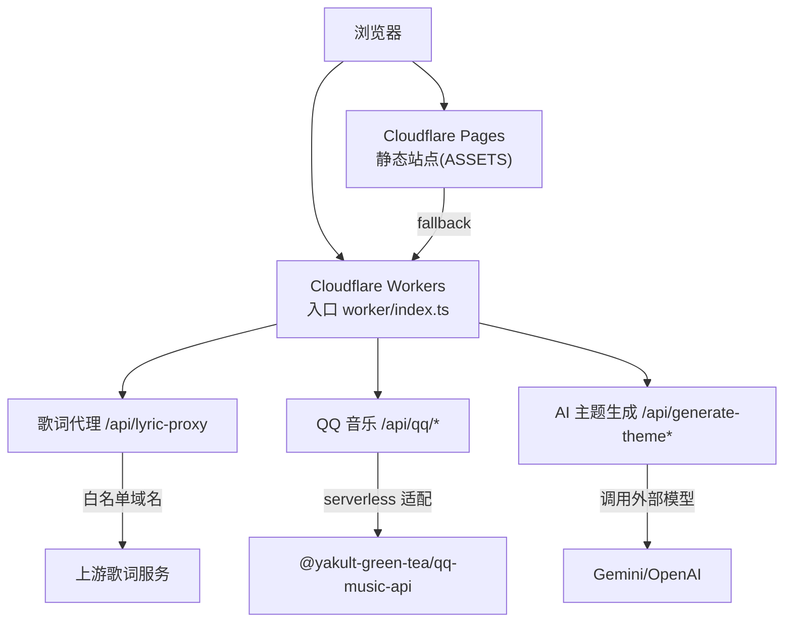
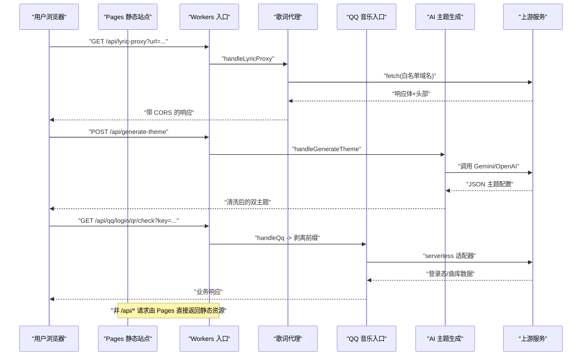
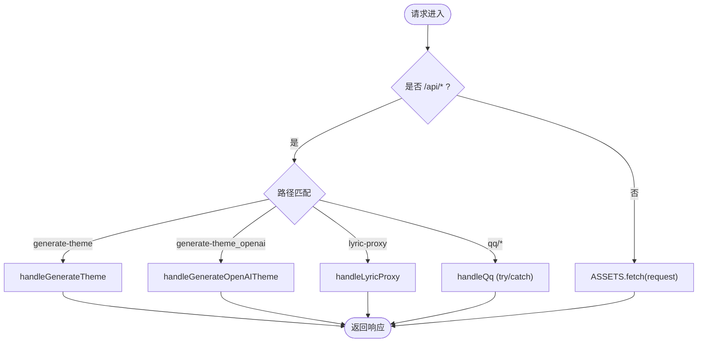
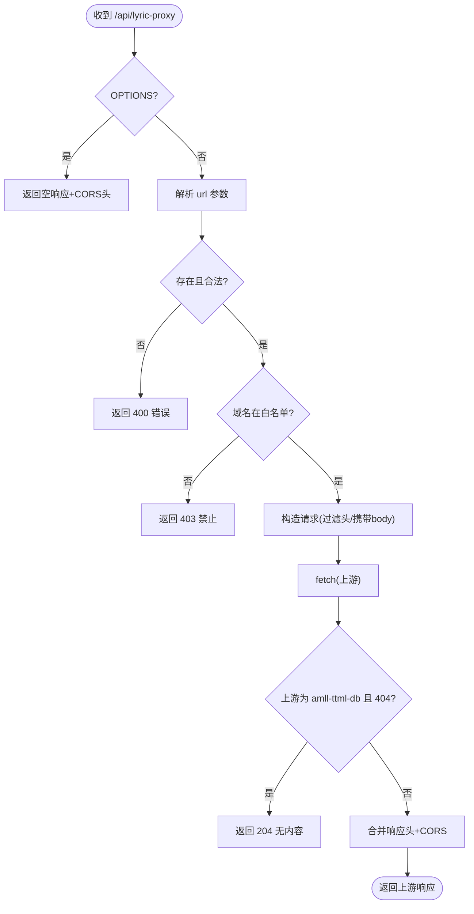
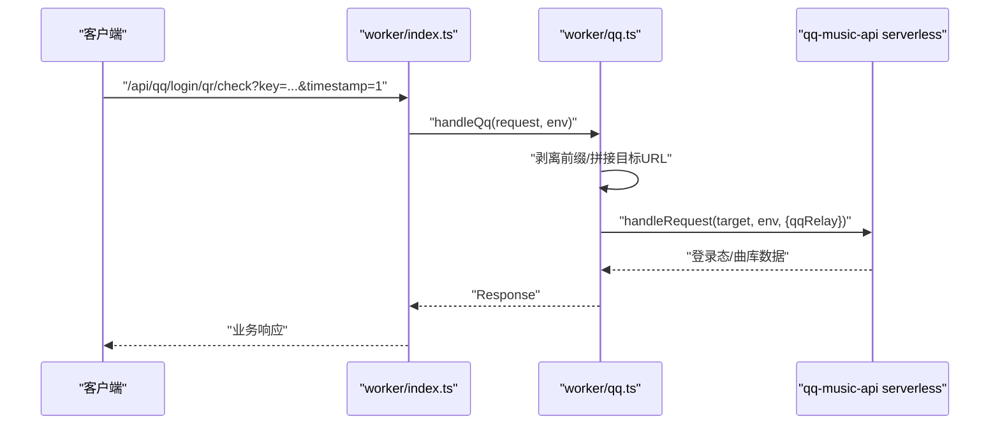
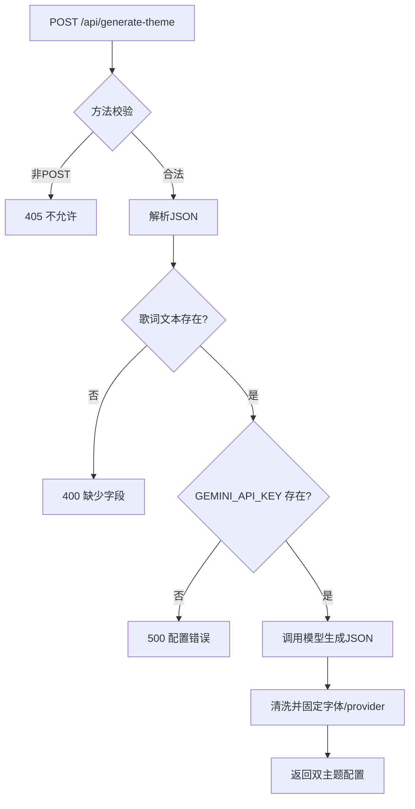
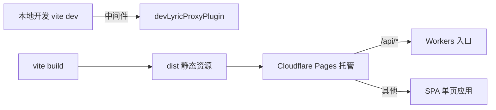
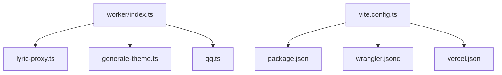

# Cloudflare部署

<cite>
**本文引用的文件**
- [wrangler.jsonc](file://wrangler.jsonc)
- [worker/index.ts](file://worker/index.ts)
- [worker/lyric-proxy.ts](file://worker/lyric-proxy.ts)
- [worker/qq.ts](file://worker/qq.ts)
- [worker/generate-theme.ts](file://worker/generate-theme.ts)
- [vite.config.ts](file://vite.config.ts)
- [package.json](file://package.json)
- [vercel.json](file://vercel.json)
- [sync-server/wrangler.toml](file://sync-server/wrangler.toml)
- [sync-server/src/cloudflare.ts](file://sync-server/src/cloudflare.ts)
- [src/services/runtimeConfig.ts](file://src/services/runtimeConfig.ts)
- [docs/technical.md](file://docs/technical.md)
</cite>

## 目录
1. [简介](#简介)
2. [项目结构](#项目结构)
3. [核心组件](#核心组件)
4. [架构总览](#架构总览)
5. [详细组件分析](#详细组件分析)
6. [依赖关系分析](#依赖关系分析)
7. [性能与容量规划](#性能与容量规划)
8. [故障排查指南](#故障排查指南)
9. [结论](#结论)
10. [附录：生产环境最佳实践清单](#附录生产环境最佳实践清单)

## 简介
本文件面向在 Cloudflare 平台部署 Folia Player 的工程团队，聚焦以下目标：
- 使用 Cloudflare Pages + Workers 组合部署静态站点与函数（API）
- 配置 Wrangler、环境变量、KV/D1/R2 等高级能力
- 部署并安全运行 Lyric Proxy API（CORS、白名单、请求转发）
- 集成 QQ 音乐 Serverless 入口、AI 主题生成接口
- 提供 HTTPS、域名绑定、监控告警、错误处理、版本管理等生产运维建议

## 项目结构
仓库采用“前端静态资源 + Worker 函数”的解耦模式：
- 前端构建产物输出到 dist，由 Pages 托管并通过 Assets 暴露
- Worker 作为统一入口，拦截 /api/* 路由，其余请求回退到静态资源
- 同步服务 sync-server 可独立部署为 Cloudflare Worker（D1 数据库）

图示来源
- [wrangler.jsonc:1-20](file://wrangler.jsonc#L1-L20)
- [worker/index.ts:31-63](file://worker/index.ts#L31-L63)
- [worker/lyric-proxy.ts:8-111](file://worker/lyric-proxy.ts#L8-L111)
- [worker/qq.ts:109-134](file://worker/qq.ts#L109-L134)
- [worker/generate-theme.ts:66-196](file://worker/generate-theme.ts#L66-L196)

章节来源
- [wrangler.jsonc:1-20](file://wrangler.jsonc#L1-L20)
- [worker/index.ts:1-64](file://worker/index.ts#L1-L64)
- [vite.config.ts:193-214](file://vite.config.ts#L193-L214)

## 核心组件
- 入口路由：worker/index.ts 负责将 /api/* 路由分发到具体处理器，未命中则回退到 ASSETS.fetch(request)
- 歌词代理：worker/lyric-proxy.ts 实现跨域转发、请求头过滤、域名白名单、特殊 404 转 204
- QQ 音乐 Serverless：worker/qq.ts 将宿主前缀剥离后交给后端 serverless 适配器，可选接入 Durable Object 二维码通道
- AI 主题生成：worker/generate-theme.ts 调用 Gemini/OpenAI 生成双主题配置，并进行清洗与固定字段注入
- 构建与运行时：vite.config.ts 定义多入口、PWA、开发代理；package.json 提供脚本；wrangler.jsonc 声明 Workers 与 Assets 行为

章节来源
- [worker/index.ts:31-63](file://worker/index.ts#L31-L63)
- [worker/lyric-proxy.ts:8-111](file://worker/lyric-proxy.ts#L8-L111)
- [worker/qq.ts:15-134](file://worker/qq.ts#L15-L134)
- [worker/generate-theme.ts:66-196](file://worker/generate-theme.ts#L66-L196)
- [vite.config.ts:193-214](file://vite.config.ts#L193-L214)
- [package.json:17-21](file://package.json#L17-L21)
- [wrangler.jsonc:1-20](file://wrangler.jsonc#L1-L20)

## 架构总览
下图展示 Cloudflare Pages + Workers 的组合部署方式与数据流。

图示来源
- [worker/index.ts:31-63](file://worker/index.ts#L31-L63)
- [worker/lyric-proxy.ts:8-111](file://worker/lyric-proxy.ts#L8-L111)
- [worker/qq.ts:109-134](file://worker/qq.ts#L109-L134)
- [worker/generate-theme.ts:66-196](file://worker/generate-theme.ts#L66-L196)

## 详细组件分析

### Cloudflare Workers 入口与路由
- 路由策略：匹配 /api/generate-theme、/api/generate-theme_openai、/api/lyric-proxy、/api/qq/*，否则回退到 ASSETS.fetch
- 异常隔离：QQ 路由内部 try/catch，失败降级为 502，避免影响静态站点
- 全局 Buffer 兼容：模块作用域内注入 Buffer，满足 qq-music-api 的 Node 兼容需求

图示来源
- [worker/index.ts:31-63](file://worker/index.ts#L31-L63)
- [worker/index.ts:7-10](file://worker/index.ts#L7-L10)

章节来源
- [worker/index.ts:1-64](file://worker/index.ts#L1-L64)

### Lyric Proxy API（歌词代理）
- 功能：按 url 参数转发到上游歌词服务，自动添加 CORS 响应头
- 安全限制：仅允许 qq.com/*.qq.com、kugou.com/*.kugou.com、amll-ttml-db.stevexmh.net
- 请求头过滤：忽略 host/connection/content-length/origin/referer 等敏感或冗余头
- 特殊处理：对 amll-ttml-db.stevexmh.net 的 404 转为 204，避免前端报错
- 错误处理：网络异常或非法域名返回 400/403/500，并附带 JSON 错误信息

图示来源
- [worker/lyric-proxy.ts:8-111](file://worker/lyric-proxy.ts#L8-L111)

章节来源
- [worker/lyric-proxy.ts:1-111](file://worker/lyric-proxy.ts#L1-L111)

### QQ 音乐 Serverless 入口
- 前缀剥离：从 /api/qq 开始的路径被剥离后交给后端 serverless 适配器
- 查询串透传：search 原样保留，确保 key/timestamp 等参数不丢失
- 可选 DO 通道：当存在 QQ_QR_CHANNEL binding 与 QQ_SESSION_SECRET 时启用二维码通道
- 异常降级：入口层捕获异常并返回 502，保护静态站点可用性

图示来源
- [worker/index.ts:47-59](file://worker/index.ts#L47-L59)
- [worker/qq.ts:109-134](file://worker/qq.ts#L109-L134)

章节来源
- [worker/qq.ts:1-135](file://worker/qq.ts#L1-L135)
- [worker/index.ts:47-59](file://worker/index.ts#L47-L59)

### AI 主题生成接口
- 输入：歌词片段/纯音乐标题、是否纯音乐
- 模型：默认 Gemini，也可切换 OpenAI 兼容接口
- 输出：light/dark 双主题配置，包含名称、颜色、图标、描述等
- 安全与校验：服务端校验必填字段，缺失返回 400；未配置密钥返回 500；最终进行主题清洗与固定字段注入

图示来源
- [worker/generate-theme.ts:66-196](file://worker/generate-theme.ts#L66-L196)

章节来源
- [worker/generate-theme.ts:1-196](file://worker/generate-theme.ts#L1-L196)

### Pages + Workers 组合部署
- 静态站点：dist 目录通过 Pages 托管，开启 single-page-application 模式
- 函数优先：run_worker_first 指定 /api/* 由 Workers 先处理，再回退到静态资源
- 构建产物：Vite 构建多入口（main、stageClient、modExport），并配置 PWA 与 navigateFallbackDenylist 排除 /api/*

图示来源
- [wrangler.jsonc:11-18](file://wrangler.jsonc#L11-L18)
- [vite.config.ts:193-214](file://vite.config.ts#L193-L214)
- [vite.config.ts:227-242](file://vite.config.ts#L227-L242)

章节来源
- [wrangler.jsonc:1-20](file://wrangler.jsonc#L1-L20)
- [vite.config.ts:193-242](file://vite.config.ts#L193-L242)

### 同步服务（可选）
- 入口：src/cloudflare.ts 导出 app，供 Cloudflare Worker 使用
- 配置：wrangler.toml 声明 name/main/compatibility_date 及 D1 数据库绑定
- 用途：用于外观设置与 AI 主题的同步（可通过 UI 开关启用）

章节来源
- [sync-server/src/cloudflare.ts:1-3](file://sync-server/src/cloudflare.ts#L1-L3)
- [sync-server/wrangler.toml:1-13](file://sync-server/wrangler.toml#L1-L13)

## 依赖关系分析
- 入口依赖：worker/index.ts 依赖 lyric-proxy、generate-theme、qq 三个处理器
- 运行时依赖：vite.config.ts 注入构建变量与 PWA；package.json 提供脚本与依赖
- 平台差异：vercel.json 用于 Vercel 重写规则；Cloudflare 通过 wrangler.jsonc 控制 run_worker_first
- 环境变量：文档说明 VITE_* 与平台 secret 的使用边界

图示来源
- [worker/index.ts:1-64](file://worker/index.ts#L1-L64)
- [vite.config.ts:193-214](file://vite.config.ts#L193-L214)
- [wrangler.jsonc:1-20](file://wrangler.jsonc#L1-L20)
- [vercel.json:1-6](file://vercel.json#L1-L6)

章节来源
- [worker/index.ts:1-64](file://worker/index.ts#L1-L64)
- [vite.config.ts:193-242](file://vite.config.ts#L193-L242)
- [package.json:17-21](file://package.json#L17-L21)
- [wrangler.jsonc:1-20](file://wrangler.jsonc#L1-L20)
- [vercel.json:1-6](file://vercel.json#L1-L6)

## 性能与容量规划
- 构建优化：Vite 将 three.js 拆分为独立 chunk，避免超过 PWA 预缓存大小限制
- 请求转发：歌词代理仅转发必要头部，减少带宽与延迟；对特定上游 404 直接返回 204 降低重试压力
- 异常隔离：QQ 路由内部 try/catch，避免级联失败影响静态站点
- 运行时配置：通过 runtimeConfig 读取 AI 提供商，便于在不同环境切换
- 容量建议：
  - 合理设置 KV/D1/R2 配额与读写频率，避免热点键
  - 对高频接口增加缓存（如 KV 缓存热门歌词或主题结果）
  - 使用 Cloudflare Analytics 与 Logs 观察延迟与错误率

章节来源
- [vite.config.ts:198-214](file://vite.config.ts#L198-L214)
- [worker/lyric-proxy.ts:65-102](file://worker/lyric-proxy.ts#L65-L102)
- [worker/index.ts:47-59](file://worker/index.ts#L47-L59)
- [src/services/runtimeConfig.ts:1-16](file://src/services/runtimeConfig.ts#L1-L16)

## 故障排查指南
- 常见问题定位
  - 400：歌词代理缺少 url 参数
  - 403：歌词代理目标域名不在白名单
  - 500：歌词代理上游错误或网络异常
  - 502：QQ 路由内部异常，已降级返回
  - 501：未配置 QQ_SESSION_SECRET 导致登录路由不可用
- 日志与调试
  - 查看 Workers 控制台日志，关注 proxy 与 qq 路由的错误堆栈
  - 检查环境变量是否正确注入（GEMINI_API_KEY、OPENAI_*、QQ_SESSION_SECRET 等）
- 回滚与版本管理
  - 使用 Pages/Workers 的版本发布与回滚能力
  - 结合 package.json 脚本与 CI/CD 流程管理构建产物与部署

章节来源
- [worker/lyric-proxy.ts:44-109](file://worker/lyric-proxy.ts#L44-L109)
- [worker/index.ts:47-59](file://worker/index.ts#L47-L59)
- [docs/technical.md:143-168](file://docs/technical.md#L143-L168)

## 结论
本项目在 Cloudflare 上采用 Pages + Workers 的组合部署，实现了静态站点与函数的清晰分离与高效协作。通过严格的域名白名单、CORS 配置与异常隔离，保障了歌词代理与 QQ 音乐入口的安全性与稳定性。配合 AI 主题生成接口与可选同步服务，形成了完整的云端播放体验。生产环境建议结合 KV/D1/R2、Analytics、Logs 与版本管理，持续优化性能与可靠性。

## 附录：生产环境最佳实践清单
- 环境与密钥
  - 在 Cloudflare 中配置环境变量：GEMINI_API_KEY、OPENAI_API_KEY/URL/MODEL/TEMPERATURE、QQ_SESSION_SECRET/QQ_SESSION_SECRET_PREVIOUS
  - 如需启用 QQ 二维码通道，配置 QQ_QR_CHANNEL 绑定
- 域名与HTTPS
  - 绑定自定义域名，启用强制 HTTPS
  - 配置 Pages/Workers 的缓存策略与边缘规则
- 存储与缓存
  - 使用 KV 缓存热门歌词或主题结果，降低上游压力
  - 使用 D1 存储用户偏好与同步数据（可选）
  - 使用 R2 存储大文件或媒体资源（可选）
- 监控与告警
  - 启用 Cloudflare Analytics 与 Logs，设置错误率与延迟阈值告警
  - 对关键接口（/api/lyric-proxy、/api/qq、/api/generate-theme）设置健康检查
- 版本与发布
  - 使用 Pages/Workers 的版本发布与回滚机制
  - 结合 CI/CD 自动化构建与部署，确保一致性
- 安全加固
  - 严格域名白名单与请求头过滤
  - 最小权限原则配置 KV/D1/R2 访问
  - 定期轮换 QQ_SESSION_SECRET，并使用 PREVIOUS 支持平滑过渡

章节来源
- [docs/technical.md:143-168](file://docs/technical.md#L143-L168)
- [wrangler.jsonc:1-20](file://wrangler.jsonc#L1-L20)
- [worker/qq.ts:17-29](file://worker/qq.ts#L17-L29)
- [worker/lyric-proxy.ts:30-63](file://worker/lyric-proxy.ts#L30-L63)