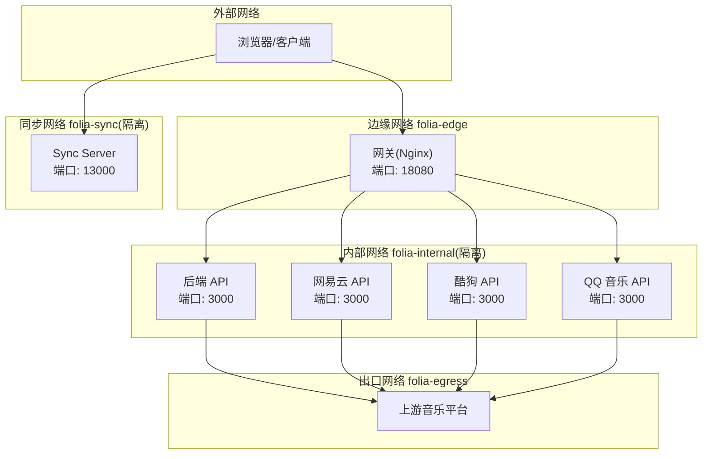
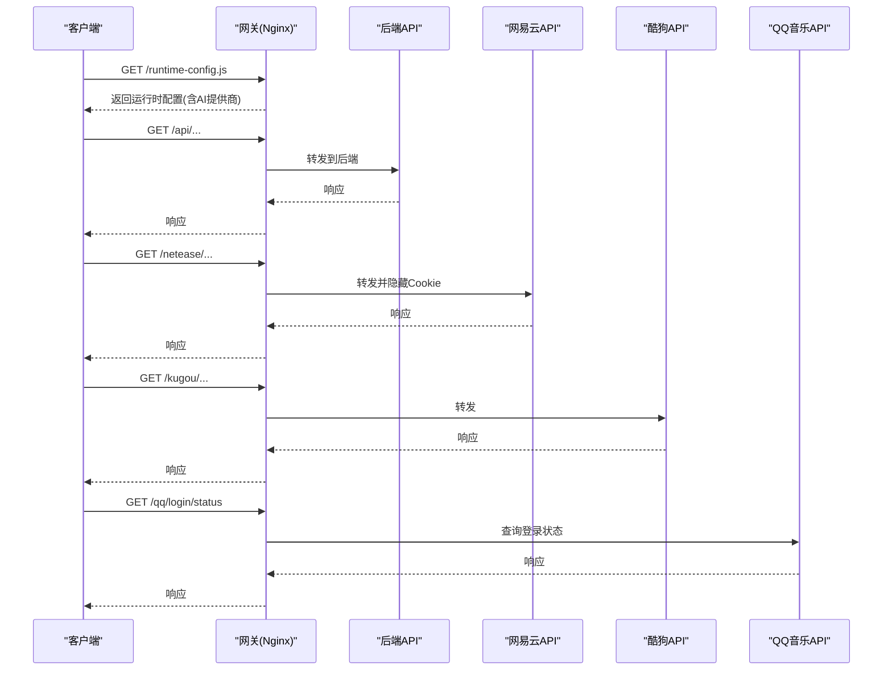
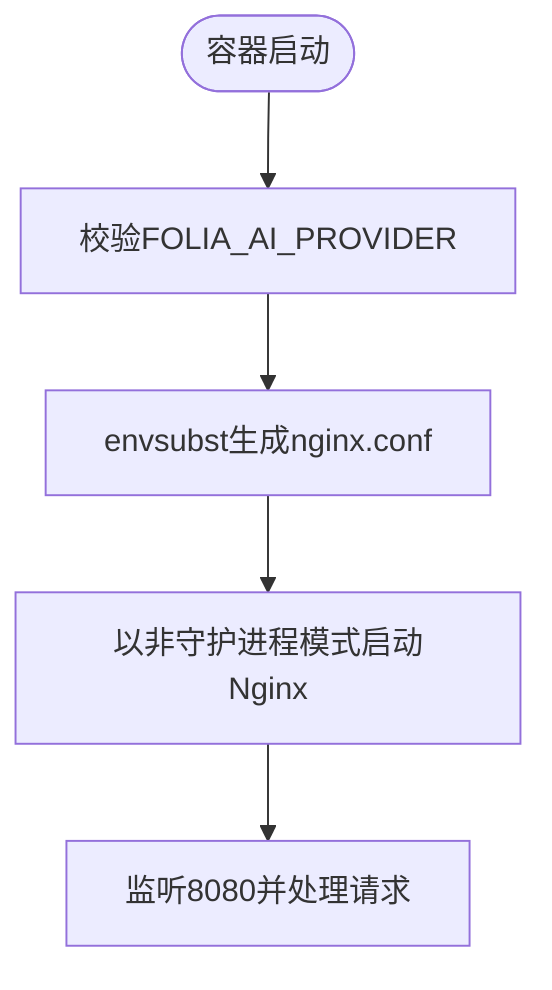

# Docker部署

<cite>
**本文引用的文件**
- [deploy/docker/README.md](file://deploy/docker/README.md)
- [deploy/docker/compose.yaml](file://deploy/docker/compose.yaml)
- [deploy/docker/compose.build.yaml](file://deploy/docker/compose.build.yaml)
- [deploy/docker/compose.sync.yaml](file://deploy/docker/compose.sync.yaml)
- [deploy/docker/images/gateway.Dockerfile](file://deploy/docker/images/gateway.Dockerfile)
- [deploy/docker/images/backend.Dockerfile](file://deploy/docker/images/backend.Dockerfile)
- [deploy/docker/images/sync-server.Dockerfile](file://deploy/docker/images/sync-server.Dockerfile)
- [deploy/docker/images/netease-api.Dockerfile](file://deploy/docker/images/netease-api.Dockerfile)
- [deploy/docker/images/kugou-api.Dockerfile](file://deploy/docker/images/kugou-api.Dockerfile)
- [deploy/docker/images/qq-api.Dockerfile](file://deploy/docker/images/qq-api.Dockerfile)
- [deploy/docker/gateway/nginx.conf.template](file://deploy/docker/gateway/nginx.conf.template)
- [deploy/docker/gateway/entrypoint.sh](file://deploy/docker/gateway/entrypoint.sh)
- [deploy/docker/sync-server/entrypoint.sh](file://deploy/docker/sync-server/entrypoint.sh)
- [deploy/docker/scripts/smoke-test.sh](file://deploy/docker/scripts/smoke-test.sh)
- [deploy/docker/scripts/patch-music-api-client-ip.mjs](file://deploy/docker/scripts/patch-music-api-client-ip.mjs)
</cite>

## 目录
1. [简介](#简介)
2. [项目结构](#项目结构)
3. [核心组件](#核心组件)
4. [架构总览](#架构总览)
5. [详细组件分析](#详细组件分析)
6. [依赖关系分析](#依赖关系分析)
7. [性能与体积优化](#性能与体积优化)
8. [故障排除指南](#故障排除指南)
9. [结论](#结论)
10. [附录](#附录)

## 简介
本指南面向在生产环境中容器化部署 Folia Player Web 栈，覆盖镜像构建、Docker Compose 编排、Nginx 反向代理、HTTPS 与安全上下文、数据持久化、版本管理与滚动更新、以及日志监控与排障等完整流程。仓库已提供多阶段构建的镜像定义、按服务拆分的 Compose 配置、网关模板与入口脚本，以及本地验证与健康检查脚本，便于快速落地与持续集成。

## 项目结构
- 编排层：compose.yaml 为发布版完整栈；compose.build.yaml 将各服务切换到本地构建；compose.sync.yaml 仅运行 Sync Server。
- 镜像层：images 目录下每个服务对应一个 Dockerfile，采用多阶段构建，分离构建期与运行期依赖，控制镜像体积。
- 网关层：gateway 目录包含 Nginx 模板与入口脚本，负责静态资源托管、API 转发与运行时配置注入。
- 脚本层：scripts 提供健康检查、客户端 IP 转发补丁与冒烟测试。
- 数据层：Sync Server 使用 SQLite 持久化到挂载卷；QQ API 使用具名卷保存设备状态。



图表来源
- [deploy/docker/compose.yaml:1-179](file://deploy/docker/compose.yaml#L1-L179)
- [deploy/docker/gateway/nginx.conf.template:1-86](file://deploy/docker/gateway/nginx.conf.template#L1-L86)

章节来源
- [deploy/docker/README.md:1-184](file://deploy/docker/README.md#L1-L184)
- [deploy/docker/compose.yaml:1-179](file://deploy/docker/compose.yaml#L1-L179)

## 核心组件
- 网关（Gateway）：基于 Nginx 提供静态页面、健康检查、运行时配置注入，并将 /netease、/kugou、/qq、/api 请求反向代理至对应后端服务。
- 后端（Backend）：Node.js 服务，暴露 /api/healthz 健康端点，承载 Folia Web API。
- 音乐平台适配层：网易云、酷狗、QQ 三个独立 Node 服务，分别封装第三方音乐平台接口。
- 同步服务（Sync Server）：独立服务，提供设置与元数据同步能力，使用 SQLite 持久化。

章节来源
- [deploy/docker/compose.yaml:1-179](file://deploy/docker/compose.yaml#L1-L179)
- [deploy/docker/gateway/nginx.conf.template:1-86](file://deploy/docker/gateway/nginx.conf.template#L1-L86)

## 架构总览
网关作为唯一对外入口，通过 Docker 网络将流量路由到内部服务；所有内部服务默认不暴露宿主机端口，仅通过 compose 网络互通。Sync Server 位于独立网络，避免与 Web 内部服务互通，降低攻击面。



图表来源
- [deploy/docker/gateway/nginx.conf.template:29-79](file://deploy/docker/gateway/nginx.conf.template#L29-L79)
- [deploy/docker/compose.yaml:1-179](file://deploy/docker/compose.yaml#L1-L179)

## 详细组件分析

### 网关（Gateway）
- 多阶段构建：第一阶段使用 Node 构建前端静态资源；第二阶段使用 Nginx 托管静态文件并加载模板配置。
- 运行时配置注入：入口脚本校验 AI 提供商，并通过 envsubst 生成 Nginx 配置，动态输出 runtime-config.js。
- 反向代理：将 /netease、/kugou、/qq、/api 转发到对应服务，统一设置 Host、X-Forwarded-* 头，并隐藏 Set-Cookie。
- 健康检查：/healthz 返回固定 JSON，供编排器探测。



图表来源
- [deploy/docker/gateway/entrypoint.sh:1-21](file://deploy/docker/gateway/entrypoint.sh#L1-L21)
- [deploy/docker/gateway/nginx.conf.template:1-86](file://deploy/docker/gateway/nginx.conf.template#L1-L86)
- [deploy/docker/images/gateway.Dockerfile:1-37](file://deploy/docker/images/gateway.Dockerfile#L1-L37)

章节来源
- [deploy/docker/images/gateway.Dockerfile:1-37](file://deploy/docker/images/gateway.Dockerfile#L1-L37)
- [deploy/docker/gateway/entrypoint.sh:1-21](file://deploy/docker/gateway/entrypoint.sh#L1-L21)
- [deploy/docker/gateway/nginx.conf.template:1-86](file://deploy/docker/gateway/nginx.conf.template#L1-L86)

### 后端（Backend）
- 多阶段构建：构建期编译 TypeScript/JS 产物；运行期仅安装生产依赖并拷贝产物。
- 健康检查：/api/healthz 由编排器探测，确保服务就绪。
- 安全策略：只读文件系统、tmpfs 临时目录、最小权限用户。

章节来源
- [deploy/docker/images/backend.Dockerfile:1-28](file://deploy/docker/images/backend.Dockerfile#L1-L28)
- [deploy/docker/compose.yaml:36-61](file://deploy/docker/compose.yaml#L36-L61)

### 网易云 API
- 镜像直接运行第三方增强包，通过脚本在构建时打补丁，禁用隐式客户端 IP 转发，避免将容器私网地址暴露给上游。
- 环境变量控制是否启用通用解锁与是否转发客户端 IP。

章节来源
- [deploy/docker/images/netease-api.Dockerfile:1-18](file://deploy/docker/images/netease-api.Dockerfile#L1-L18)
- [deploy/docker/scripts/patch-music-api-client-ip.mjs:1-39](file://deploy/docker/scripts/patch-music-api-client-ip.mjs#L1-L39)
- [deploy/docker/compose.yaml:63-86](file://deploy/docker/compose.yaml#L63-L86)

### 酷狗 API
- 与网易云类似，构建时应用补丁，默认不转发客户端 IP。
- 通过环境变量控制行为。

章节来源
- [deploy/docker/images/kugou-api.Dockerfile:1-17](file://deploy/docker/images/kugou-api.Dockerfile#L1-L17)
- [deploy/docker/scripts/patch-music-api-client-ip.mjs:1-39](file://deploy/docker/scripts/patch-music-api-client-ip.mjs#L1-L39)
- [deploy/docker/compose.yaml:88-110](file://deploy/docker/compose.yaml#L88-L110)

### QQ 音乐 API
- 使用 npm 包提供服务，设备状态保存在具名卷中，支持可选的加密会话持久化。
- 登录状态通过 /login/status 暴露，便于健康检查与诊断。

章节来源
- [deploy/docker/images/qq-api.Dockerfile:1-19](file://deploy/docker/images/qq-api.Dockerfile#L1-L19)
- [deploy/docker/compose.yaml:112-137](file://deploy/docker/compose.yaml#L112-L137)
- [deploy/docker/README.md:89-103](file://deploy/docker/README.md#L89-L103)

### 同步服务（Sync Server）
- 多阶段构建：构建期安装编译工具链并编译 TS；运行期删除构建依赖，仅保留运行所需内容。
- 数据持久化：SQLite 数据库路径通过环境变量指定，默认挂载到宿主目录或具名卷。
- 入口脚本：准备数据目录权限并以非 root 用户运行。

章节来源
- [deploy/docker/images/sync-server.Dockerfile:1-36](file://deploy/docker/images/sync-server.Dockerfile#L1-L36)
- [deploy/docker/sync-server/entrypoint.sh:1-7](file://deploy/docker/sync-server/entrypoint.sh#L1-L7)
- [deploy/docker/compose.yaml:139-163](file://deploy/docker/compose.yaml#L139-L163)

## 依赖关系分析
- 网关依赖后端与三个音乐 API 的健康状态，通过 depends_on 与 healthcheck 保证启动顺序。
- 音乐 API 与后端需要访问外网（folia-egress），网关仅连接边缘与内部网络。
- Sync Server 处于独立网络，不与 Web 内部服务互通，避免越权访问。

```mermaid
graph LR
GW["网关"] --> BE["后端"]
GW --> NE["网易云API"]
GW --> KG["酷狗API"]
GW --> QQ["QQ音乐API"]
BE --> EXT["上游网络"]
NE --> EXT
KG --> EXT
QQ --> EXT
SYNC["Sync Server"] -. 独立网络 .-|不互通| GW
```

图表来源
- [deploy/docker/compose.yaml:1-179](file://deploy/docker/compose.yaml#L1-L179)

章节来源
- [deploy/docker/compose.yaml:1-179](file://deploy/docker/compose.yaml#L1-L179)

## 性能与体积优化
- 多阶段构建：构建期与运行期分离，运行镜像仅包含必要依赖，显著减小体积。
- 只读根文件系统与 tmpfs：提升安全性与可预测性，减少磁盘写入。
- 最小权限：以非 root 用户运行，限制特权。
- 缓存与缓冲：网关针对大 Cookie 场景调整 proxy_buffer 参数，避免阻塞。
- 网络隔离：内部服务不暴露端口，减少攻击面与不必要的网络开销。

章节来源
- [deploy/docker/images/gateway.Dockerfile:1-37](file://deploy/docker/images/gateway.Dockerfile#L1-L37)
- [deploy/docker/images/backend.Dockerfile:1-28](file://deploy/docker/images/backend.Dockerfile#L1-L28)
- [deploy/docker/images/sync-server.Dockerfile:1-36](file://deploy/docker/images/sync-server.Dockerfile#L1-L36)
- [deploy/docker/gateway/nginx.conf.template:42-71](file://deploy/docker/gateway/nginx.conf.template#L42-L71)
- [deploy/docker/compose.yaml:1-179](file://deploy/docker/compose.yaml#L1-L179)

## 故障排除指南
- 健康检查
  - 网关：/healthz、/api/healthz、/runtime-config.js
  - 音乐 API：各自根路径或 /login/status
  - Sync Server：/health
- 常用命令
  - 查看服务状态：docker compose ps
  - 查看日志：docker compose logs --tail=200 gateway backend netease-api kugou-api qq-api sync-server
  - 本地冒烟测试：执行脚本自动拉起堆栈并验证公开入口与网络隔离
- 常见问题
  - HTTPS 安全上下文：HTTP 下部分浏览器能力受限，建议使用反向代理终止 HTTPS 并传递 X-Forwarded-* 头。
  - 客户端 IP 转发：默认关闭，避免上游记录容器私网地址；如需兼容旧部署，开启相应开关。
  - QQ 登录态：设备状态保存在具名卷，更换设备需清理卷；多实例不要共享同一卷。
  - 数据库备份：停止 Sync Server 后打包数据目录，再恢复服务。

章节来源
- [deploy/docker/README.md:55-167](file://deploy/docker/README.md#L55-L167)
- [deploy/docker/scripts/smoke-test.sh:1-57](file://deploy/docker/scripts/smoke-test.sh#L1-L57)
- [deploy/docker/gateway/nginx.conf.template:29-79](file://deploy/docker/gateway/nginx.conf.template#L29-L79)
- [deploy/docker/compose.yaml:1-179](file://deploy/docker/compose.yaml#L1-L179)

## 结论
该部署方案通过多阶段构建、严格网络隔离、只读文件系统与非 root 运行，提供了安全、可维护且易于扩展的容器化部署模型。网关集中管理路由与运行时配置，配合 Compose 编排与健康检查，适合在 NAS 或云服务器上稳定运行。结合反向代理实现 HTTPS 与证书管理，可满足生产环境的安全与合规要求。

## 附录

### 快速启动与变量
- 下载 compose.yaml 与 .env 模板，设置镜像命名空间与同步令牌后启动。
- 关键环境变量包括镜像命名空间、版本、绑定地址与端口、AI 提供商、客户端 IP 转发开关、同步服务数据目录与令牌等。

章节来源
- [deploy/docker/README.md:7-87](file://deploy/docker/README.md#L7-L87)
- [deploy/docker/compose.yaml:1-179](file://deploy/docker/compose.yaml#L1-L179)

### 本地构建与验证
- 使用 compose.build.yaml 将服务切换为本地构建，便于调试与定制。
- 执行冒烟测试脚本，自动拉起堆栈并验证健康端点与网络隔离。

章节来源
- [deploy/docker/compose.build.yaml:1-40](file://deploy/docker/compose.build.yaml#L1-L40)
- [deploy/docker/scripts/smoke-test.sh:1-57](file://deploy/docker/scripts/smoke-test.sh#L1-L57)

### 仅运行 Sync Server
- 使用 compose.sync.yaml 单独构建与运行 Sync Server，适用于仅需要同步能力的场景。

章节来源
- [deploy/docker/compose.sync.yaml:1-31](file://deploy/docker/compose.sync.yaml#L1-L31)

### 反向代理与 HTTPS
- 推荐由 NAS 或外部反向代理终止 HTTPS，并将请求转发到网关与 Sync Server 的本地端口。
- 必须传递 Host、X-Forwarded-Host、X-Forwarded-Proto、X-Forwarded-For，并将 HTTP 重定向到 HTTPS。
- 不支持将应用挂载在子路径，应使用独立域名或子域。

章节来源
- [deploy/docker/README.md:105-137](file://deploy/docker/README.md#L105-L137)

### 版本管理与滚动更新
- 通过 .env 中的镜像版本变量控制版本；更新时先拉取镜像再重启服务。
- 回滚时将版本变量设置为先前标签并重复更新流程。
- 数据库位于指定数据目录，建议停机备份后再升级。

章节来源
- [deploy/docker/README.md:139-167](file://deploy/docker/README.md#L139-L167)

### 日志与监控
- 网关日志输出到标准输出/错误，便于容器日志收集系统采集。
- 编排器健康检查用于服务就绪判定，可结合外部监控系统对健康端点进行轮询。

章节来源
- [deploy/docker/gateway/nginx.conf.template:10-13](file://deploy/docker/gateway/nginx.conf.template#L10-L13)
- [deploy/docker/compose.yaml:15-20](file://deploy/docker/compose.yaml#L15-L20)
- [deploy/docker/compose.yaml:51-56](file://deploy/docker/compose.yaml#L51-L56)
- [deploy/docker/compose.yaml:154-159](file://deploy/docker/compose.yaml#L154-L159)