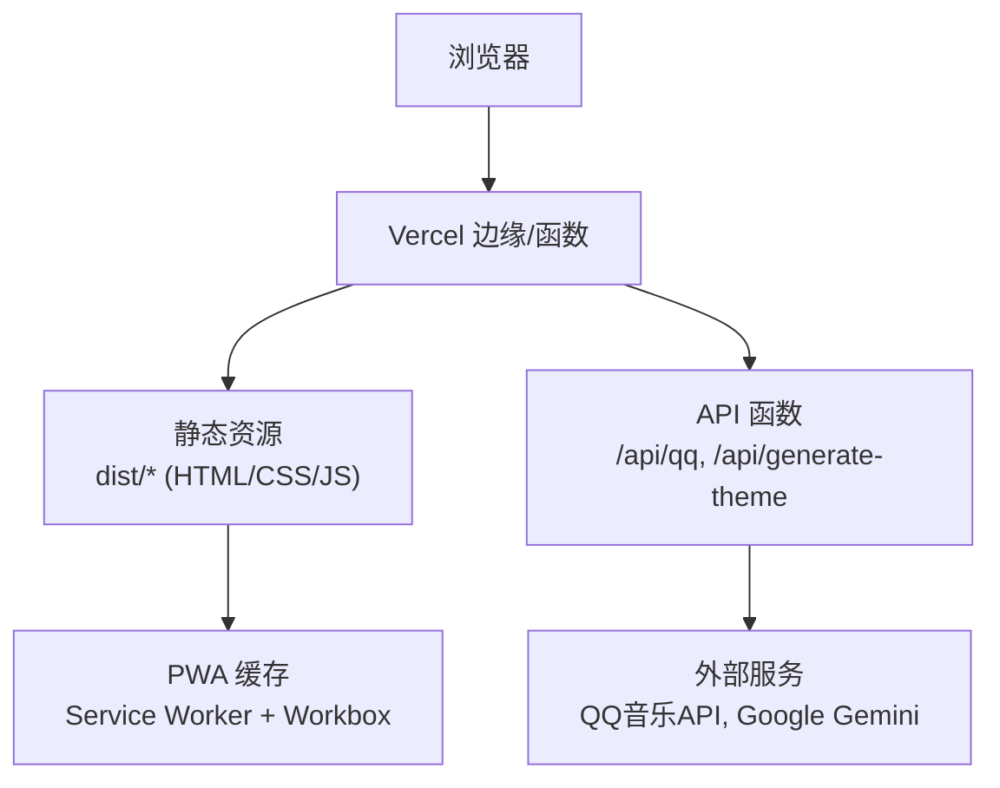
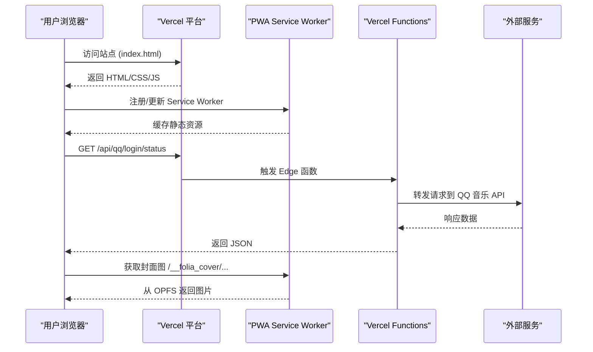
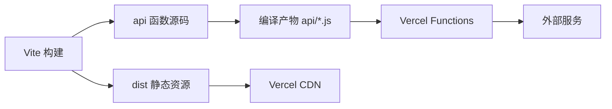

# Vercel部署

<cite>
**本文引用的文件**
- [vercel.json](file://vercel.json)
- [package.json](file://package.json)
- [vite.config.ts](file://vite.config.ts)
- [public/folia-cover-sw.js](file://public/folia-cover-sw.js)
- [api-ts/qq.ts](file://api-ts/qq.ts)
- [api-ts/generate-theme.ts](file://api-ts/generate-theme.ts)
- [api-ts/tsconfig.json](file://api-ts/tsconfig.json)
- [public/runtime-config.js](file://public/runtime-config.js)
</cite>

## 目录
1. [简介](#简介)
2. [项目结构](#项目结构)
3. [核心组件](#核心组件)
4. [架构总览](#架构总览)
5. [详细组件分析](#详细组件分析)
6. [依赖关系分析](#依赖关系分析)
7. [性能与缓存策略](#性能与缓存策略)
8. [常见问题排查](#常见问题排查)
9. [结论](#结论)
10. [附录：环境变量清单](#附录环境变量清单)

## 简介
本指南面向在 Vercel 上部署 Folia Player Web 端，覆盖一键部署、项目配置、环境变量设置、域名绑定、Git 集成、分支预览、生产发布等完整工作流。重点说明 vercel.json 的作用与自定义选项，以及 PWA 支持、静态资源优化、构建缓存策略等关键配置。文档同时给出常见问题的定位方法与性能优化建议。

## 项目结构
Folia Player 使用 Vite 构建前端产物，并通过 VitePWA 插件生成 Service Worker 与 Manifest；后端 API（如 QQ 音乐代理、主题生成）以 TypeScript 编写，编译到 api 目录供 Vercel Functions 使用。根目录的 vercel.json 用于路由重写，确保 /api/qq/* 正确转发至函数入口。

**图表来源**
- [vite.config.ts:193-260](file://vite.config.ts#L193-L260)
- [vercel.json:1-6](file://vercel.json#L1-L6)
- [api-ts/qq.ts:1-38](file://api-ts/qq.ts#L1-L38)
- [api-ts/generate-theme.ts:63-189](file://api-ts/generate-theme.ts#L63-L189)

**章节来源**
- [package.json:17-22](file://package.json#L17-L22)
- [vite.config.ts:193-260](file://vite.config.ts#L193-L260)
- [vercel.json:1-6](file://vercel.json#L1-L6)

## 核心组件
- 构建与打包：Vite 负责多入口构建（主应用、stage-client、mod-export），并按需拆分 large chunk（如 three.js）以避免超过 PWA 预缓存大小限制。
- PWA：通过 vite-plugin-pwa 启用自动更新模式，配置最大可缓存文件大小、忽略动态运行时脚本、排除 API 导航回退。
- API 函数：
  - /api/qq：Edge Runtime 函数，将 Vercel 重写后的路径还原为后端期望的路径并透传请求头与 Body。
  - /api/generate-theme：调用 Google Gemini 生成双主题配置。
- 运行时配置：public/runtime-config.js 提供空壳对象，实际值由 Vite 注入或 Docker 注入的 window.__FOLIA_RUNTIME_CONFIG__ 决定。

**章节来源**
- [vite.config.ts:193-260](file://vite.config.ts#L193-L260)
- [api-ts/qq.ts:1-38](file://api-ts/qq.ts#L1-L38)
- [api-ts/generate-theme.ts:63-189](file://api-ts/generate-theme.ts#L63-L189)
- [public/runtime-config.js:1-3](file://public/runtime-config.js#L1-L3)

## 架构总览
下图展示 Vercel 部署下的请求流转：前端静态资源由 Vercel CDN 分发，API 请求命中函数；PWA 缓存策略由 Workbox 控制，避免拦截 API 请求；封面图通过专用 Service Worker 从 OPFS 读取并返回。

**图表来源**
- [vite.config.ts:230-260](file://vite.config.ts#L230-L260)
- [vercel.json:1-6](file://vercel.json#L1-L6)
- [api-ts/qq.ts:20-37](file://api-ts/qq.ts#L20-L37)
- [public/folia-cover-sw.js:1-142](file://public/folia-cover-sw.js#L1-L142)

## 详细组件分析

### vercel.json 路由重写
- 作用：将 /api/qq/:path* 重写为 /api/qq?path=:path*，使扁平化的函数入口能还原出后端期望的嵌套路径。
- 影响：前端统一使用 VITE_QQ_API_BASE=/api/qq，无需感知平台差异。

**章节来源**
- [vercel.json:1-6](file://vercel.json#L1-L6)
- [api-ts/qq.ts:5-16](file://api-ts/qq.ts#L5-L16)

### API 函数：QQ 音乐代理
- 运行环境：Edge Runtime，零 node:* 依赖，保证在 Vercel Edge 上稳定执行。
- 行为：解析 path 查询参数，拼接目标 URL，保留原请求方法、头部与 Body，透传给后端。
- 环境变量：需要 QQ_SESSION_SECRET、QQ_SESSION_SECRET_PREVIOUS。

**章节来源**
- [api-ts/qq.ts:1-38](file://api-ts/qq.ts#L1-L38)

### API 函数：AI 主题生成
- 功能：根据歌词片段生成明暗两套主题配置，输出结构化 JSON。
- 依赖：Google GenAI SDK，需要 GEMINI_API_KEY。
- 安全：对输入进行长度截断，并对输出做清洗校验。

**章节来源**
- [api-ts/generate-theme.ts:63-189](file://api-ts/generate-theme.ts#L63-L189)

### PWA 与 Service Worker
- 自动更新：registerType 设置为 autoUpdate，提升更新体验。
- 缓存策略：
  - maximumFileSizeToCacheInBytes：限制单个文件缓存大小，避免过大资源无法离线缓存。
  - globIgnores：排除 runtime-config.js，防止被预缓存导致热更新失效。
  - navigateFallbackDenylist：排除 /api 开头的导航请求，确保 API 直达平台而非 SPA Shell。
- 自定义封面 Service Worker：public/folia-cover-sw.js 提供 /__folia_cover/* 路径处理，从 OPFS 读取内容地址化封面，按需生成缩略图并设置强缓存头。

**章节来源**
- [vite.config.ts:230-260](file://vite.config.ts#L230-L260)
- [public/folia-cover-sw.js:1-142](file://public/folia-cover-sw.js#L1-L142)

### 构建与多入口
- 多入口：main、stageClient、modExport，便于不同场景独立部署与调试。
- 代码分割：three.js 单独拆包，避免超过 PWA 预缓存上限。
- 版本信息：构建时注入 __COMMIT_HASH__、__GIT_BRANCH__、__APP_VERSION__ 等常量，便于追踪版本与分支。

**章节来源**
- [vite.config.ts:193-214](file://vite.config.ts#L193-L214)
- [vite.config.ts:261-268](file://vite.config.ts#L261-L268)

### 运行时配置
- public/runtime-config.js 提供空壳对象，实际 AI Provider 等运行时配置优先读取 window.__FOLIA_RUNTIME_CONFIG__，其次回退到 Vite 构建变量。
- 非 Docker 部署时，继续由 Vite 环境变量注入。

**章节来源**
- [public/runtime-config.js:1-3](file://public/runtime-config.js#L1-L3)
- [src/services/runtimeConfig.ts:9-16](file://src/services/runtimeConfig.ts#L9-L16)

## 依赖关系分析
- 构建期依赖：Vite、React 插件、PWA 插件、Tailwind、PostCSS、TypeScript。
- 运行期依赖：大量 UI/可视化库（Pixi.js、Three.js）、状态管理（Zustand）、网络请求（Axios）、音频处理等。
- API 依赖：Google GenAI、QQ 音乐 API 客户端。

**图表来源**
- [package.json:17-22](file://package.json#L17-L22)
- [api-ts/tsconfig.json:1-15](file://api-ts/tsconfig.json#L1-L15)

**章节来源**
- [package.json:181-247](file://package.json#L181-L247)
- [api-ts/tsconfig.json:1-15](file://api-ts/tsconfig.json#L1-L15)

## 性能与缓存策略
- 静态资源优化
  - 代码分割：large dependency（如 three.js）单独分包，减少首屏体积。
  - 资源压缩：Vite 默认开启压缩，配合 CDN 缓存头可显著提升加载速度。
- PWA 缓存
  - 最大单文件缓存限制：避免超大资源无法进入预缓存。
  - 忽略动态脚本：runtime-config.js 不被预缓存，避免热更新问题。
  - API 导航排除：/api 请求不走 SPA 回退，确保接口可达。
- 封面图缓存
  - 专用 Service Worker 提供 /__folia_cover/* 路径，从 OPFS 读取内容地址化资源，设置 immutable 强缓存头，降低重复请求。
- 构建缓存
  - Vercel 基于 Git 提交哈希增量构建，合理拆分模块可提升缓存命中率。
  - 保持依赖锁定（package-lock.json）有助于缓存复用。

**章节来源**
- [vite.config.ts:205-214](file://vite.config.ts#L205-L214)
- [vite.config.ts:230-260](file://vite.config.ts#L230-L260)
- [public/folia-cover-sw.js:115-130](file://public/folia-cover-sw.js#L115-L130)

## 常见问题排查
- API 404 或路径错误
  - 检查 vercel.json 是否包含 /api/qq 的重写规则。
  - 确认 VITE_QQ_API_BASE 指向 /api/qq。
- PWA 不生效或更新失败
  - 检查 VitePWA 配置中的 maximumFileSizeToCacheInBytes 与 globIgnores。
  - 确认 navigateFallbackDenylist 已排除 /api。
- 运行时配置未生效
  - 确认 public/runtime-config.js 存在且未被预缓存。
  - 检查 window.__FOLIA_RUNTIME_CONFIG__ 是否正确注入。
- 环境变量缺失
  - 在 Vercel 项目设置中配置必要的环境变量（见附录）。
  - 对于 Edge 函数，确保 secrets 与 variables 均已设置。

**章节来源**
- [vercel.json:1-6](file://vercel.json#L1-L6)
- [vite.config.ts:230-260](file://vite.config.ts#L230-L260)
- [public/runtime-config.js:1-3](file://public/runtime-config.js#L1-L3)

## 结论
通过在 Vercel 上启用 PWA、合理配置路由重写与 API 函数，并结合 Vite 的代码分割与缓存策略，Folia Player 可在云端获得高性能、可离线的 Web 播放体验。遵循本文的环境变量与部署流程，可实现从开发到生产的无缝迭代。

## 附录：环境变量清单
- 前端构建变量（Vite define）
  - APP_VERSION_LABEL：应用版本标签
  - APP_RELEASE_CHANNEL：发布渠道
  - DOCKER_STACK_VERSION：Docker 栈版本
  - VITE_AI_PROVIDER：AI 提供商（gemini/openai）
  - VITE_NETEASE_API_BASE：网易云 API 基址
  - VITE_KUGOU_API_BASE：酷狗 API 基址
  - VITE_QQ_API_BASE：QQ 音乐 API 基址
- 函数环境变量（Vercel Secrets/Variables）
  - GEMINI_API_KEY：Google Gemini API Key
  - OPENAI_API_KEY：OpenAI 兼容 API Key（可选）
  - OPENAI_API_URL：OpenAI 兼容 API 地址（可选）
  - OPENAI_API_MODEL：模型名称（可选）
  - OPENAI_API_TEMPERATURE：温度参数（可选）
  - QQ_SESSION_SECRET：QQ 会话密钥
  - QQ_SESSION_SECRET_PREVIOUS：旧版会话密钥（可选）

**章节来源**
- [vite.config.ts:189-191](file://vite.config.ts#L189-L191)
- [vite.config.ts:261-268](file://vite.config.ts#L261-L268)
- [api-ts/generate-theme.ts:75-80](file://api-ts/generate-theme.ts#L75-L80)
- [api-ts/qq.ts:34-36](file://api-ts/qq.ts#L34-L36)