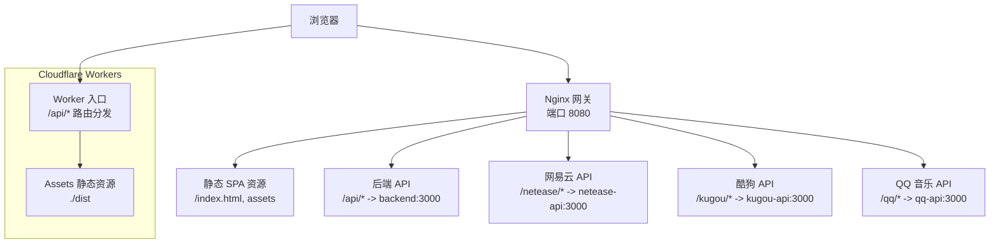
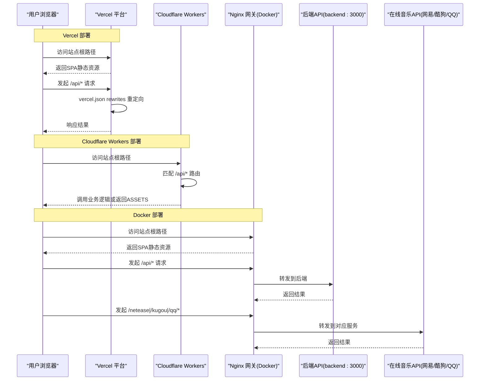
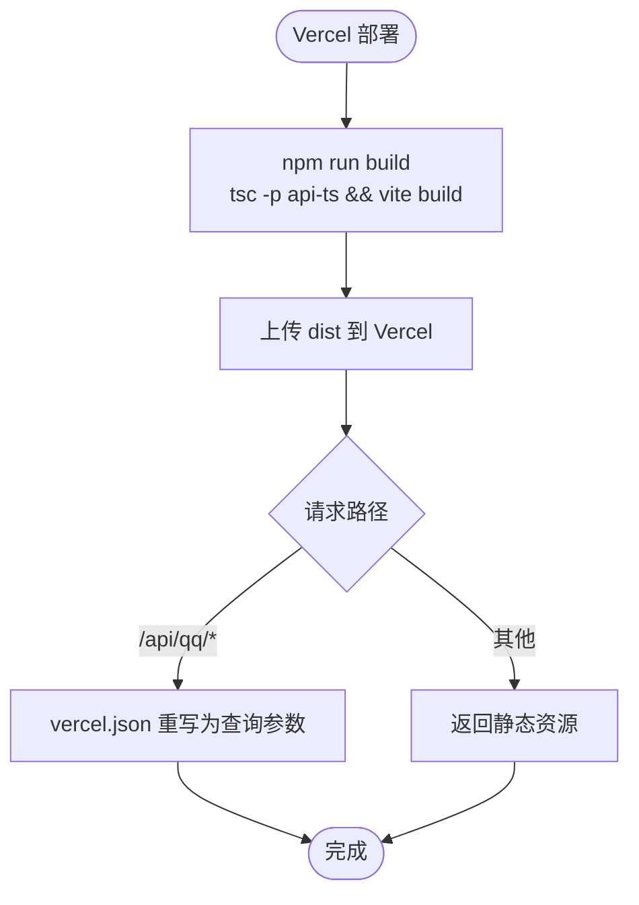
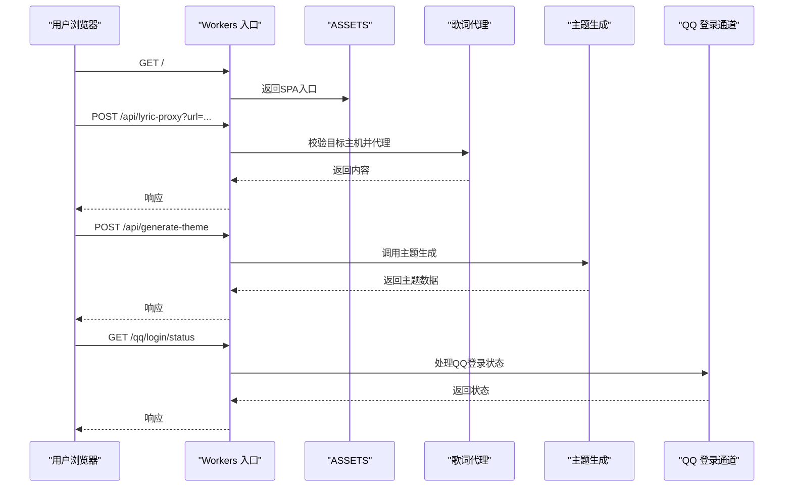
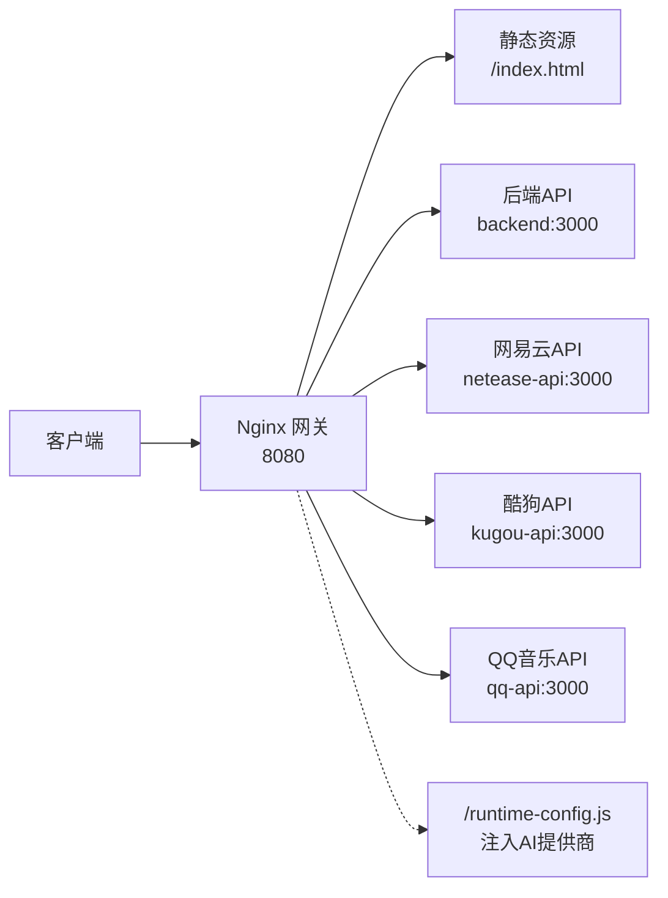
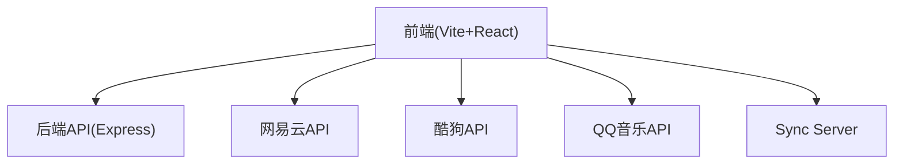

# Web版部署

<cite>
**本文引用的文件**
- [vercel.json](file://vercel.json)
- [wrangler.jsonc](file://wrangler.jsonc)
- [worker/index.ts](file://worker/index.ts)
- [package.json](file://package.json)
- [vite.config.ts](file://vite.config.ts)
- [deploy/docker/compose.yaml](file://deploy/docker/compose.yaml)
- [deploy/docker/gateway/nginx.conf.template](file://deploy/docker/gateway/nginx.conf.template)
- [deploy/docker/images/backend.Dockerfile](file://deploy/docker/images/backend.Dockerfile)
- [deploy/docker/images/gateway.Dockerfile](file://deploy/docker/images/gateway.Dockerfile)
- [sync-server/wrangler.toml](file://sync-server/wrangler.toml)
- [src/services/runtimeConfig.ts](file://src/services/runtimeConfig.ts)
- [deploy/docker/README.md](file://deploy/docker/README.md)
</cite>

## 目录
1. [简介](#简介)
2. [项目结构](#项目结构)
3. [核心组件](#核心组件)
4. [架构总览](#架构总览)
5. [详细组件分析](#详细组件分析)
6. [依赖关系分析](#依赖关系分析)
7. [性能与优化](#性能与优化)
8. [故障排除指南](#故障排除指南)
9. [结论](#结论)
10. [附录](#附录)

## 简介
本部署文档面向 Folia Player Web 版本，覆盖三种主流部署方案：Vercel 一键部署、Cloudflare Workers（含 KV/Durable Objects 等高级能力）、以及 Docker 容器化生产部署。文档重点说明 HTTPS 与安全上下文要求、浏览器兼容性、环境变量配置、域名绑定、反向代理、监控与排障等关键运维事项，帮助你在不同平台稳定上线并持续优化体验。

## 项目结构
Folia Web 采用 Vite + React 构建前端静态资源，并通过 Cloudflare Assets 或传统 Web 服务器托管；同时提供 Worker 路由处理 /api/* 接口（主题生成、歌词代理、QQ 登录通道等）。Docker 方案通过 Nginx 网关统一对外暴露，内部服务通过私有网络互通。

**图表来源**
- [deploy/docker/gateway/nginx.conf.template:24-83](file://deploy/docker/gateway/nginx.conf.template#L24-L83)
- [wrangler.jsonc:11-18](file://wrangler.jsonc#L11-L18)
- [worker/index.ts:31-62](file://worker/index.ts#L31-L62)

**章节来源**
- [package.json:17-21](file://package.json#L17-L21)
- [vite.config.ts:193-214](file://vite.config.ts#L193-L214)
- [wrangler.jsonc:1-18](file://wrangler.jsonc#L1-L18)
- [deploy/docker/gateway/nginx.conf.template:24-83](file://deploy/docker/gateway/nginx.conf.template#L24-L83)

## 核心组件
- 前端构建与 PWA：使用 Vite 构建多入口页面，启用 PWA 缓存策略，拆分 large chunk（如 three.js）避免预缓存超限。
- Worker 路由：统一处理 /api/generate-theme、/api/generate-theme_openai、/api/lyric-proxy、/qq/* 登录通道，并将其余请求转发给 ASSETS。
- Docker 网关：Nginx 作为对外入口，将 /api/* 转发到后端，/netease/*、/kugou/*、/qq/* 转发到对应服务，静态资源走 try_files 回退到 index.html。
- 运行时配置：通过 runtime-config.js 注入 AI 提供商选择，前端优先读取运行时配置，其次回退到构建期变量。

**章节来源**
- [vite.config.ts:193-214](file://vite.config.ts#L193-L214)
- [vite.config.ts:230-259](file://vite.config.ts#L230-L259)
- [worker/index.ts:31-62](file://worker/index.ts#L31-L62)
- [deploy/docker/gateway/nginx.conf.template:35-40](file://deploy/docker/gateway/nginx.conf.template#L35-L40)
- [src/services/runtimeConfig.ts:9-16](file://src/services/runtimeConfig.ts#L9-L16)

## 架构总览
下图展示 Web 端在三种部署环境中的访问路径与关键配置点。

**图表来源**
- [vercel.json:1-5](file://vercel.json#L1-L5)
- [wrangler.jsonc:11-18](file://wrangler.jsonc#L11-L18)
- [worker/index.ts:31-62](file://worker/index.ts#L31-L62)
- [deploy/docker/gateway/nginx.conf.template:42-79](file://deploy/docker/gateway/nginx.conf.template#L42-L79)

## 详细组件分析

### Vercel 一键部署
- 构建产物：运行 npm run build 会先编译 api-ts 再执行 vite build，输出至 dist。
- 重写规则：通过 vercel.json 将 /api/qq/:path* 重写为 /api/qq?path=:path*，以适配平台路由限制。
- 环境变量：可在 Vercel 控制台设置构建时与环境变量（如 VITE_*），并在构建期注入到前端。
- 域名绑定：在 Vercel 项目设置中绑定自定义域名，开启强制 HTTPS。
- PWA 与缓存：VitePWA 已配置 navigateFallbackDenylist 排除 /api/*，确保 API 导航不被 SPA 壳拦截。

**图表来源**
- [package.json:17-21](file://package.json#L17-L21)
- [vercel.json:1-5](file://vercel.json#L1-L5)
- [vite.config.ts:230-259](file://vite.config.ts#L230-L259)

**章节来源**
- [package.json:17-21](file://package.json#L17-L21)
- [vercel.json:1-5](file://vercel.json#L1-L5)
- [vite.config.ts:230-259](file://vite.config.ts#L230-L259)

### Cloudflare Workers 部署
- 入口与路由：worker/index.ts 根据路径分发到主题生成、歌词代理、QQ 登录通道，未命中则交由 ASSETS 返回静态资源。
- 静态资源：wrangler.jsonc 配置 assets.directory 指向 ./dist，not_found_handling 为 single-page-application，run_worker_first 包含 /api/*，确保 API 优先由 Worker 处理。
- 环境变量：支持在 Wrangler 中配置 GEMINI_API_KEY、OPENAI_API_KEY、OPENAI_API_URL、OPENAI_API_MODEL、OPENAI_API_TEMPERATURE 等。
- KV/Durable Objects：如需持久化或状态隔离，可在 wrangler.jsonc 中添加 kv_namespaces 或 durable_objects 绑定；当前仓库导出 QqQrChannel DO，可按需启用。
- 构建与发布：npm run build 产出 dist，然后使用 wrangler deploy 发布。

**图表来源**
- [worker/index.ts:31-62](file://worker/index.ts#L31-L62)
- [wrangler.jsonc:11-18](file://wrangler.jsonc#L11-L18)

**章节来源**
- [wrangler.jsonc:1-18](file://wrangler.jsonc#L1-L18)
- [worker/index.ts:31-62](file://worker/index.ts#L31-L62)

### Docker 容器化部署
- 镜像与编排：compose.yaml 定义 gateway、backend、netease-api、kugou-api、qq-api、sync-server 六个服务，仅对外暴露 gateway 与 sync-server 端口。
- 网关配置：nginx.conf.template 将 /api/* 转发到 backend:3000，/netease/*、/kugou/*、/qq/* 转发到对应服务，静态资源 try_files 回退到 index.html。
- 运行时配置：gateway 动态生成 /runtime-config.js，注入 FOLIA_AI_PROVIDER；前端优先读取 window.__FOLIA_RUNTIME_CONFIG__，其次回退到构建期 VITE_AI_PROVIDER。
- 健康检查：各服务均配置 healthcheck，便于编排器检测就绪状态。
- 安全与网络：服务间通过 folia-internal 私有网络通信，外部不直接暴露后端与音乐API端口。

**图表来源**
- [deploy/docker/gateway/nginx.conf.template:24-83](file://deploy/docker/gateway/nginx.conf.template#L24-L83)
- [deploy/docker/compose.yaml:4-35](file://deploy/docker/compose.yaml#L4-L35)
- [src/services/runtimeConfig.ts:9-16](file://src/services/runtimeConfig.ts#L9-L16)

**章节来源**
- [deploy/docker/compose.yaml:4-179](file://deploy/docker/compose.yaml#L4-L179)
- [deploy/docker/gateway/nginx.conf.template:24-83](file://deploy/docker/gateway/nginx.conf.template#L24-L83)
- [deploy/docker/images/gateway.Dockerfile:11-22](file://deploy/docker/images/gateway.Dockerfile#L11-L22)
- [deploy/docker/images/backend.Dockerfile:1-28](file://deploy/docker/images/backend.Dockerfile#L1-L28)
- [src/services/runtimeConfig.ts:9-16](file://src/services/runtimeConfig.ts#L9-L16)

### HTTPS 与安全上下文
- 推荐通过反向代理终止 HTTPS，并将 Host、X-Forwarded-Host、X-Forwarded-Proto、X-Forwarded-For 传递给后端。
- HTTP 非安全上下文会导致 File System Access API、Service Worker/PWA、OPFS、音频设备枚举、标准 Clipboard API 等功能不可用或降级。
- 证书链必须可信，建议使用独立根域/子域，不支持挂载在 /folia/ 子路径。

**章节来源**
- [deploy/docker/README.md:105-137](file://deploy/docker/README.md#L105-L137)

## 依赖关系分析
- 前端依赖：React、Three.js（按需拆分）、VitePWA、TailwindCSS 等。
- 后端依赖：Express、@google/genai 等用于主题生成。
- 在线音乐API：网易云、酷狗、QQ 音乐各自独立服务，通过网关转发。
- 同步服务：Sync Server 独立部署，使用 SQLite 或 Cloudflare D1（可选）。

**图表来源**
- [package.json:181-220](file://package.json#L181-L220)
- [deploy/docker/compose.yaml:36-163](file://deploy/docker/compose.yaml#L36-L163)

**章节来源**
- [package.json:181-220](file://package.json#L181-L220)
- [deploy/docker/compose.yaml:36-163](file://deploy/docker/compose.yaml#L36-L163)

## 性能与优化
- 大依赖拆分：three.js 单独拆分为 chunk，避免超过 PWA 预缓存单文件大小限制。
- PWA 缓存策略：exclude /api/* 导航，避免 API 被 SPA 壳拦截；忽略 runtime-config.js 防止动态配置被缓存。
- 构建优化：手动 chunks 与 rollupOptions 控制打包体积；生产环境关闭不必要的调试信息。
- 网关优化：Nginx 合理设置 buffer、keepalive、client_max_body_size，提升代理稳定性。
- 资源加载：CDN 加速静态资源，启用压缩与缓存头。

**章节来源**
- [vite.config.ts:198-214](file://vite.config.ts#L198-L214)
- [vite.config.ts:230-259](file://vite.config.ts#L230-L259)
- [deploy/docker/gateway/nginx.conf.template:20-23](file://deploy/docker/gateway/nginx.conf.template#L20-L23)

## 故障排除指南
- 健康检查：
  - Gateway：/healthz
  - Backend：/api/healthz
  - Runtime Config：/runtime-config.js
  - 网易云/酷狗/QQ：/netease/、/kugou/、/qq/login/status
  - Sync Server：/health
- 常见问题：
  - 无法访问 API：检查网关转发规则与后端服务是否健康。
  - 歌词代理失败：确认目标主机在白名单内，且跨域头正确设置。
  - QQ 登录异常：查看日志与上游返回码，注意装置状态卷与重试退避。
  - PWA 安装失败：确保 HTTPS 与可信证书，避免 HTTP 非安全上下文。
- 诊断命令：
  - docker compose ps/logs
  - curl 各健康检查端点
  - 检查 .env 与运行时配置注入是否正确

**章节来源**
- [deploy/docker/README.md:55-63](file://deploy/docker/README.md#L55-L63)
- [deploy/docker/README.md:158-167](file://deploy/docker/README.md#L158-L167)
- [vite.config.ts:11-32](file://vite.config.ts#L11-L32)

## 结论
Folia Web 提供了灵活的部署选项：Vercel 适合快速上线与简单场景；Cloudflare Workers 适合边缘计算与高性能 API；Docker 方案适合生产环境的完整栈管理与安全隔离。无论选择哪种方案，都应重视 HTTPS、安全上下文、PWA 与缓存策略，并结合网关与监控手段保障稳定性与可维护性。

## 附录
- 环境变量参考：
  - Vite 构建期：VITE_NETEASE_API_BASE、VITE_KUGOU_API_BASE、VITE_QQ_API_BASE、VITE_AI_PROVIDER
  - Docker 运行时：FOLIA_IMAGE_NAMESPACE、FOLIA_STACK_VERSION、FOLIA_HTTP_BIND、FOLIA_HTTP_PORT、FOLIA_AI_PROVIDER、SYNC_TOKEN、FOLIA_SYNC_DATA_DIR
  - Workers：GEMINI_API_KEY、OPENAI_API_KEY、OPENAI_API_URL、OPENAI_API_MODEL、OPENAI_API_TEMPERATURE
- 相关脚本与镜像：
  - 构建脚本：npm run build、npm run build:vercel-api
  - 镜像：gateway.Dockerfile、backend.Dockerfile
  - 编排：compose.yaml、compose.sync.yaml

**章节来源**
- [deploy/docker/images/gateway.Dockerfile:11-22](file://deploy/docker/images/gateway.Dockerfile#L11-L22)
- [deploy/docker/images/backend.Dockerfile:1-28](file://deploy/docker/images/backend.Dockerfile#L1-L28)
- [deploy/docker/compose.yaml:8-179](file://deploy/docker/compose.yaml#L8-L179)
- [package.json:17-21](file://package.json#L17-L21)