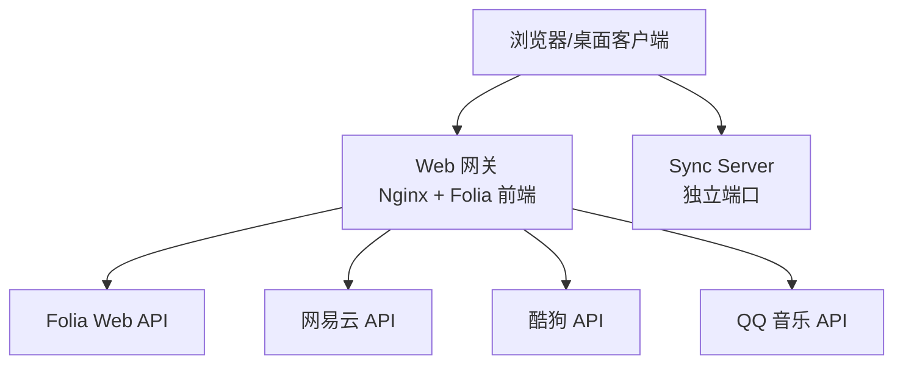
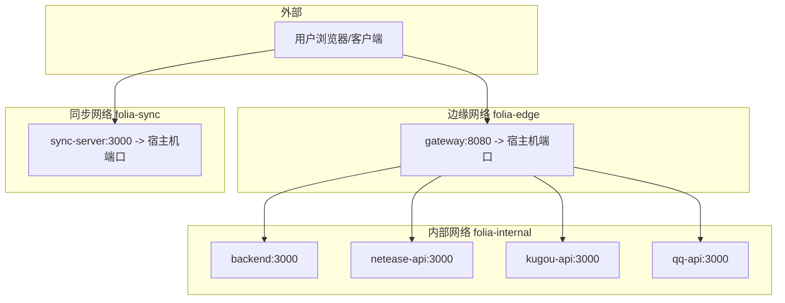

# 安装与部署

<cite>
**本文引用的文件**
- [README.md](file://README.md)
- [docs/qq-music-deployment.md](file://docs/qq-music-deployment.md)
- [deploy/docker/README.md](file://deploy/docker/README.md)
- [deploy/docker/compose.yaml](file://deploy/docker/compose.yaml)
- [deploy/docker/.env.example](file://deploy/docker/.env.example)
- [vercel.json](file://vercel.json)
- [wrangler.jsonc](file://wrangler.jsonc)
- [package.json](file://package.json)
- [packaging/aur/folia-major-bin/.SRCINFO](file://packaging/aur/folia-major-bin/.SRCINFO)
- [packaging/linux/folia-major.desktop](file://packaging/linux/folia-major.desktop)
</cite>

## 目录
1. [简介](#简介)
2. [项目结构](#项目结构)
3. [核心组件](#核心组件)
4. [架构总览](#架构总览)
5. [详细组件分析](#详细组件分析)
6. [依赖关系分析](#依赖关系分析)
7. [性能注意事项](#性能注意事项)
8. [故障排查指南](#故障排查指南)
9. [结论](#结论)
10. [附录](#附录)

## 简介
本指南面向不同技术水平的用户，提供从“一键部署”到“生产级容器化”的完整安装与部署方案。覆盖：
- 桌面版（Windows/macOS/Linux）：直接从 Releases 下载安装包、Arch Linux AUR、Flatpak 等
- Web 版：Vercel 一键部署、Cloudflare Workers 部署、Docker Compose 全栈部署
- QQ 音乐集成：API 基础路径、会话密钥、扫码登录（微信/QQ）
- 生产环境：反向代理、HTTPS、本地音乐目录访问、安全上下文要求

## 项目结构
Folia 同时提供 Electron 桌面端与 Node.js Web 端。Web 端支持在 Vercel/Cloudflare 等平台运行，也可通过 Docker Compose 在本地或 NAS 上以网关+后端+各音源 API 的形式发布。同步服务（Sync Server）独立部署，用于跨设备同步外观设置与 AI 主题库。

图表来源
- [deploy/docker/compose.yaml:4-163](file://deploy/docker/compose.yaml#L4-L163)
- [deploy/docker/README.md:55-63](file://deploy/docker/README.md#L55-L63)

章节来源
- [README.md:153-185](file://README.md#L153-L185)
- [deploy/docker/README.md:1-63](file://deploy/docker/README.md#L1-L63)

## 核心组件
- 桌面端（Electron）：内置前后端运行环境，适合即装即用；支持 Windows、macOS、Linux 安装包与便携版
- Web 网关：对外暴露 HTTP/HTTPS，转发至内部服务
- 后端 API：处理业务逻辑、AI 主题生成等
- 在线音源 API：网易云、酷狗、QQ 音乐
- Sync Server：可选的跨设备同步服务

章节来源
- [README.md:153-185](file://README.md#L153-L185)
- [deploy/docker/README.md:1-63](file://deploy/docker/README.md#L1-L63)

## 架构总览
下图展示 Docker Compose 全栈部署的服务边界与网络隔离：
- gateway 仅暴露对外端口（默认 18080）
- backend/netease-api/kugou-api/qq-api 仅内部互通
- sync-server 独立网络，不经过 gateway

图表来源
- [deploy/docker/compose.yaml:4-163](file://deploy/docker/compose.yaml#L4-L163)
- [deploy/docker/compose.yaml:169-179](file://deploy/docker/compose.yaml#L169-L179)

## 详细组件分析

### 桌面版安装（Windows/macOS/Linux）
- 直接下载：前往 Releases 页面下载最新安装包（Windows/macOS/Linux）
- Arch Linux：通过 AUR 获取预编译包
- Flatpak：社区提供的第三方包

说明要点
- 桌面端内置前后端运行环境，无需额外部署
- 构建产物包含 NSIS 安装包与 Portable 版本（Windows），以及 deb/rpm/tar.gz（Linux）

章节来源
- [README.md:177-185](file://README.md#L177-L185)
- [package.json:131-179](file://package.json#L131-L179)
- [packaging/aur/folia-major-bin/.SRCINFO:1-23](file://packaging/aur/folia-major-bin/.SRCINFO#L1-L23)
- [packaging/linux/folia-major.desktop:1-10](file://packaging/linux/folia-major.desktop#L1-L10)

### Web 版：Vercel 一键部署
- 使用官方按钮一键导入仓库并部署
- 环境变量中配置 QQ 音乐相关项：
  - VITE_QQ_API_BASE=/api/qq
  - QQ_SESSION_SECRET（服务端密钥，不带 VITE_ 前缀）
- Vercel 路由重写将 /api/qq/* 转发给内置 serverless 入口

章节来源
- [README.md:157-169](file://README.md#L157-L169)
- [vercel.json:1-6](file://vercel.json#L1-L6)
- [docs/qq-music-deployment.md:64-101](file://docs/qq-music-deployment.md#L64-L101)

### Web 版：Cloudflare Workers 部署
- 支持一键部署到 Cloudflare，或通过 Wrangler 手动部署
- 环境变量：
  - VITE_QQ_API_BASE=/api/qq
  - QQ_SESSION_SECRET（Secret）
- 如需 QQ 扫码登录，需在 wrangler.jsonc 中启用 Durable Object 绑定与迁移

章节来源
- [README.md:163-169](file://README.md#L163-L169)
- [wrangler.jsonc:1-20](file://wrangler.jsonc#L1-L20)
- [docs/qq-music-deployment.md:103-209](file://docs/qq-music-deployment.md#L103-L209)

### Web 版：Docker Compose 全栈部署
- 仅需 compose.yaml 与 .env 即可启动完整堆栈
- 默认对外端口：
  - Web：18080
  - Sync Server：13000
- 健康检查：/healthz、/api/healthz、/runtime-config.js、/netease/、/kugou/、/qq/login/status、/health

章节来源
- [deploy/docker/README.md:7-63](file://deploy/docker/README.md#L7-L63)
- [deploy/docker/compose.yaml:4-163](file://deploy/docker/compose.yaml#L4-L163)

### QQ 音乐部署配置（关键步骤）
- API 基础路径：
  - 使用内置 serverless：VITE_QQ_API_BASE=/api/qq
  - 自托管常驻服务：填写完整地址（如 https://qq-api.example.com）
- 会话密钥：
  - QQ_SESSION_SECRET：加密登录态或服务端会话密钥（不要加 VITE_ 前缀）
  - 可选 QQ_SESSION_SECRET_PREVIOUS：轮换旧密钥时临时验证
- 扫码登录：
  - Vercel/Cloudflare 默认仅支持微信扫码
  - Cloudflare 启用 Durable Object 后可支持 QQ 扫码
  - Docker/Node 常驻服务同时支持 QQ 扫码与微信扫码
- 部署后接入：
  - 切换音源为 QQ 音乐，点击连接账号，选择扫码方式
  - 验证接口：/api/qq/login/channels、/api/qq/login/status、/api/qq/getSongInfo/<id>

章节来源
- [docs/qq-music-deployment.md:7-63](file://docs/qq-music-deployment.md#L7-L63)
- [docs/qq-music-deployment.md:268-284](file://docs/qq-music-deployment.md#L268-L284)
- [deploy/docker/README.md:89-104](file://deploy/docker/README.md#L89-L104)

### Docker Compose 生产环境注意事项
- HTTPS 与安全上下文：
  - 局域网 IP 上的普通 HTTP 不属于浏览器安全上下文，部分能力不可用或降级
  - 推荐由 NAS 现有反向代理终止 HTTPS，并传递 Host/X-Forwarded-* 头
  - 证书需具备可信完整链；不支持挂载在 /folia/ 子路径
- 反向代理示例：
  - https://folia.example.com/ -> http://127.0.0.1:18080
  - https://sync.example.com/ -> http://127.0.0.1:13000
- 本地音乐目录访问：
  - File System Access API 需要 HTTPS 安全上下文与支持的浏览器
  - Service Worker/PWA、OPFS、音频设备枚举等在 HTTP 下受限
- 更新与维护：
  - 通过 .env 指定镜像版本进行更新/回滚
  - 备份 Sync Server 数据库目录

章节来源
- [deploy/docker/README.md:105-138](file://deploy/docker/README.md#L105-L138)
- [deploy/docker/README.md:139-167](file://deploy/docker/README.md#L139-L167)

## 依赖关系分析
- 构建与运行时：
  - Node.js >= 24（见 engines）
  - Electron（桌面端）
  - Vite（前端构建）
  - TypeScript（类型检查与构建）
- 在线音源：
  - @yakult-green-tea/qq-music-api（QQ 音乐）
  - neteasecloudmusicapienhanced/api（网易云）
  - kugoumusicapi（酷狗）
- 可视化与 UI：
  - Pixi.js、Three.js、React、TailwindCSS 等

章节来源
- [package.json:14-16](file://package.json#L14-L16)
- [package.json:181-221](file://package.json#L181-L221)

## 性能注意事项
- 资源体积与加载：
  - 合理拆分静态资源，利用 CDN 加速
  - 开启 Gzip/Brotli 压缩
- 缓存策略：
  - 对静态资源设置长期缓存与版本号
  - 合理使用 Service Worker 缓存
- 并发与限流：
  - 对上游音源 API 请求做合理重试与退避
  - 避免频繁轮询，采用事件驱动
- 内存与 CPU：
  - 控制可视化渲染复杂度
  - 按需加载大型模型与资源

[本节为通用指导，不直接分析具体文件]

## 故障排查指南
常见现象与优先检查项：
- 页面显示 Login Error：确认 /api/qq/login/channels 返回 JSON 而非 HTML
- 返回 501：检查是否设置 QQ_SESSION_SECRET 且已重新部署
- Vercel 只有微信扫码：平台限制，属正常行为
- Cloudflare 只有微信：检查 Durable Object 绑定、类名与迁移
- Cloudflare QQ 二维码打不开：检查依赖版本与 Worker 日志中的 WebSocket 错误
- 正式 workers.dev 返回 1042，Preview 正常：等待域名传播
- 扫码后上游返回特定错误码：清理旧登录设备后重试
- 修改 VITE_QQ_API_BASE 后仍请求旧地址：该变量在构建时写入前端，必须重新构建

章节来源
- [docs/qq-music-deployment.md:286-299](file://docs/qq-music-deployment.md#L286-L299)

## 结论
- 新手用户：推荐使用 Vercel/Cloudflare 一键部署，快速上线 Web 版
- 进阶用户：使用 Docker Compose 在本地/NAS 部署全栈，便于扩展与定制
- 企业/生产环境：通过反向代理终止 HTTPS，严格遵循安全上下文与证书要求
- QQ 音乐集成：根据平台能力选择合适的扫码登录方式，并正确配置 API 基础路径与会话密钥

[本节为总结性内容，不直接分析具体文件]

## 附录

### 环境变量速查
- Web 网关与 AI：
  - FOLIA_IMAGE_NAMESPACE、FOLIA_STACK_VERSION、FOLIA_HTTP_BIND、FOLIA_HTTP_PORT
  - FOLIA_AI_PROVIDER、GEMINI_API_KEY、OPENAI_*
- 在线音源：
  - FOLIA_FORWARD_CLIENT_IP、ENABLE_GENERAL_UNBLOCK
- QQ 音乐：
  - QQ_AUTH_SESSION_PATH、QQ_SESSION_SECRET
- Sync Server：
  - FOLIA_SYNC_BIND、FOLIA_SYNC_PORT、FOLIA_SYNC_DATA_DIR、SYNC_TOKEN、DASHBOARD_TOKEN

章节来源
- [deploy/docker/.env.example:1-25](file://deploy/docker/.env.example#L1-L25)
- [deploy/docker/README.md:64-88](file://deploy/docker/README.md#L64-L88)

### 常用命令
- 启动与验证：
  - docker compose up -d --wait
  - curl http://localhost:18080/healthz
  - curl http://localhost:18080/api/healthz
  - curl http://localhost:18080/qq/login/status
  - curl http://localhost:13000/health
- 更新与回滚：
  - docker compose pull && docker compose up -d
  - 在 .env 中固定版本标签后重复上述命令

章节来源
- [deploy/docker/README.md:46-63](file://deploy/docker/README.md#L46-L63)
- [deploy/docker/README.md:139-167](file://deploy/docker/README.md#L139-L167)