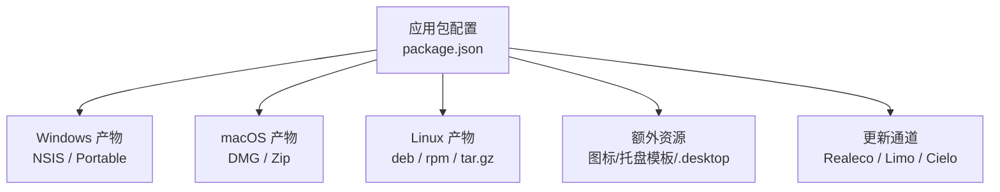
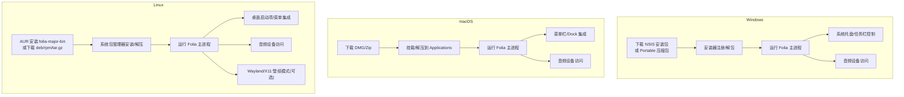
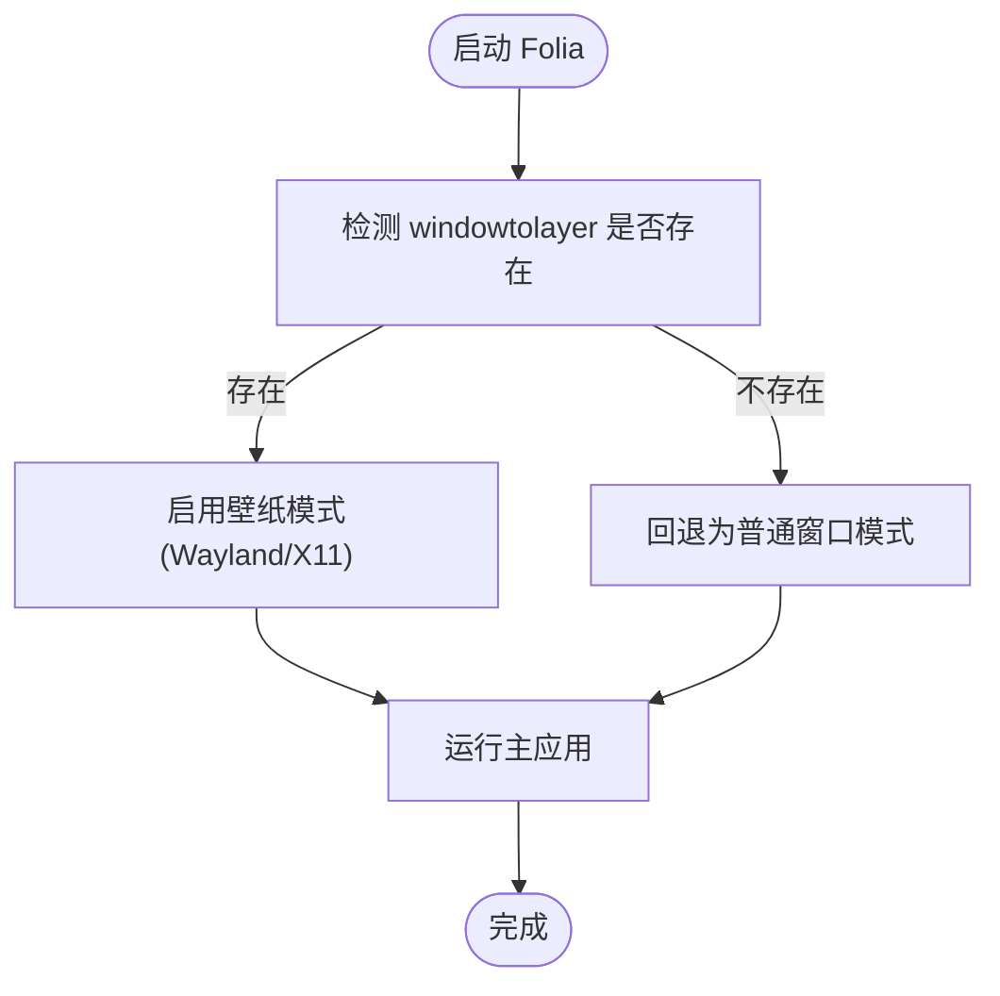
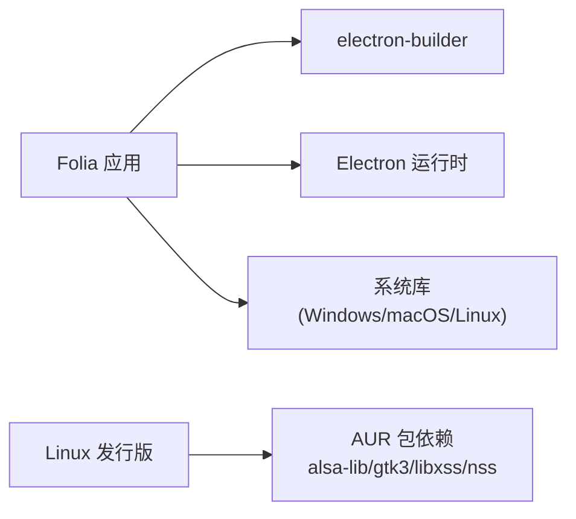

# 桌面版安装

<cite>
**本文引用的文件**
- [README.md](file://README.md)
- [package.json](file://package.json)
- [docs/technical.md](file://docs/technical.md)
- [packaging/linux/folia-major.desktop](file://packaging/linux/folia-major.desktop)
- [packaging/aur/folia-major-bin/.SRCINFO](file://packaging/aur/folia-major-bin/.SRCINFO)
- [electron/wallpaperWatchdog.cjs](file://electron/wallpaperWatchdog.cjs)
- [src/hooks/useElectronDisplaySleepBlocker.ts](file://src/hooks/useElectronDisplaySleepBlocker.ts)
- [src/hooks/useElectronPlaybackBridge.ts](file://src/hooks/useElectronPlaybackBridge.ts)
- [src/components/app/AppShell.tsx](file://src/components/app/AppShell.tsx)
</cite>

## 目录
1. [简介](#简介)
2. [项目结构](#项目结构)
3. [核心组件](#核心组件)
4. [架构总览](#架构总览)
5. [详细组件分析](#详细组件分析)
6. [依赖关系分析](#依赖关系分析)
7. [性能注意事项](#性能注意事项)
8. [故障排查指南](#故障排查指南)
9. [结论](#结论)
10. [附录](#附录)

## 简介
本指南面向首次或多次使用 Folia Player 桌面版的用户，覆盖 Windows、macOS、Linux 三大平台的安装方法（从官方 Releases 下载、Arch Linux AUR 安装、通用 tar.gz 解压运行），并说明系统要求、依赖项、权限配置与首次启动设置。同时提供常见问题的解决方案（权限问题、音频设备访问、文件协议处理等）以及桌面集成功能说明（系统托盘、窗口管理、文件关联等）。文档内容基于仓库中的构建配置、打包目标、技术说明与桌面端行为实现整理而成。

## 项目结构
Folia 桌面版基于 Electron 构建，通过 electron-builder 生成各平台安装包与可执行文件。主要与安装相关的信息包括：
- 应用标识与产物命名规则
- 各平台打包目标（Windows NSIS/Portable，macOS DMG/Zip，Linux deb/rpm/tar.gz）
- 额外资源（图标、托盘模板、Linux .desktop 模板、Linux 壁纸模式辅助工具）
- 更新通道与发布策略（Realeco/Limo/Cielo）

图表来源
- [package.json:52-179](file://package.json#L52-L179)

章节来源
- [package.json:52-179](file://package.json#L52-L179)
- [docs/technical.md:12-23](file://docs/technical.md#L12-L23)

## 核心组件
- 应用入口与主进程：Electron 主进程负责窗口、托盘、系统能力桥接与本地资源加载。
- 构建与打包：electron-builder 根据 package.json 的 build 配置生成多平台安装包。
- 桌面集成：Linux 提供 .desktop 模板；Windows/macOS 分别由 NSIS/Installer 与系统框架处理。
- 更新机制：内置更新通道，支持正式版与预览通道。

章节来源
- [package.json:13-179](file://package.json#L13-L179)
- [docs/technical.md:12-23](file://docs/technical.md#L12-L23)

## 架构总览
下图展示桌面版在三大平台上的安装与运行路径，以及与系统能力的交互点。

图表来源
- [package.json:111-179](file://package.json#L111-L179)
- [docs/technical.md:24-36](file://docs/technical.md#L24-L36)
- [electron/wallpaperWatchdog.cjs:1-31](file://electron/wallpaperWatchdog.cjs#L1-L31)

## 详细组件分析

### Windows 安装与首次启动
- 获取方式
  - 前往 Releases 页面下载最新安装包（NSIS 安装器）或 Portable 压缩包。
  - 若在企业代理环境遇到 SSL 证书验证问题，可使用仓库提供的绕过脚本进行构建或分发（参考 README 中关于 Windows 构建配置的说明）。
- 系统要求
  - 基于 Electron 43.x，建议现代 Windows 版本（x64）。
- 依赖项
  - 运行时依赖由 Electron 与 Node.js 运行时提供；无需额外安装 Node.js。
- 权限配置
  - 首次运行可能请求麦克风/摄像头/媒体设备访问权限，请在系统弹窗中允许。
  - 如需将 Folia 设为默认打开某些媒体文件的程序，可在“设置”或系统“默认应用”中配置。
- 首次启动设置
  - 进入“连接与集成”，按需启用歌词接口（仅本机回环地址可用）。
  - 如需 AI 主题生成，配置 AI 提供商与密钥（Gemini/OpenAI 兼容）。
  - 导入本地音乐库时，选择文件夹并等待扫描完成。

章节来源
- [README.md:177-181](file://README.md#L177-L181)
- [README.md:48-58](file://README.md#L48-L58)
- [docs/technical.md:99-107](file://docs/technical.md#L99-L107)
- [package.json:131-164](file://package.json#L131-L164)

### macOS 安装与首次启动
- 获取方式
  - 前往 Releases 页面下载 DMG 或 Zip 包。
- 系统要求
  - 基于 Electron 43.x，支持 x64 与 arm64。
- 依赖项
  - 运行时依赖由 Electron 提供；无需额外安装 Node.js。
- 权限配置
  - 首次运行可能请求麦克风/摄像头/媒体设备访问权限，请在系统弹窗中允许。
  - 如遇到“应用已损坏”提示，按仓库内相关说明进行修复（例如安全设置或签名校验）。
- 首次启动设置
  - 进入“连接与集成”，启用歌词接口（仅本机回环地址可用）。
  - 如需 AI 主题生成，配置 AI 提供商与密钥。
  - 导入本地音乐库，选择文件夹并等待扫描完成。

章节来源
- [README.md:177-181](file://README.md#L177-L181)
- [package.json:111-130](file://package.json#L111-L130)
- [docs/desktop/macos-app-damaged.md](file://docs/desktop/macos-app-damaged.md)

### Linux 安装与首次启动
- 获取方式
  - Arch Linux/Manjaro：通过 AUR 安装 folia-major-bin。
  - Debian/Ubuntu/Linux Mint：下载 .deb。
  - Fedora/RHEL/openSUSE：下载 .rpm。
  - 其他发行版：下载 tar.gz，解压后直接运行。
- 系统要求
  - 需要 GTK3、ALSA 库、NSS、libXSS 等基础库（AUR 包声明了这些依赖）。
- 依赖项
  - AUR 包依赖 alsa-lib、gtk3、libxss、nss；可选依赖 xdg-utils 用于桌面集成。
- 权限配置
  - 音频设备访问：确保 ALSA/PulseAudio/PipeWire 服务正常运行。
  - Wayland/X11 壁纸模式：需要 windowtolayer 辅助工具；缺失时会回退关闭该模式。
- 首次启动设置
  - 进入“连接与集成”，启用歌词接口（仅本机回环地址可用）。
  - 如需 AI 主题生成，配置 AI 提供商与密钥。
  - 导入本地音乐库，选择文件夹并等待扫描完成。

图表来源
- [electron/wallpaperWatchdog.cjs:1-31](file://electron/wallpaperWatchdog.cjs#L1-L31)

章节来源
- [docs/technical.md:24-36](file://docs/technical.md#L24-L36)
- [packaging/aur/folia-major-bin/.SRCINFO:1-23](file://packaging/aur/folia-major-bin/.SRCINFO#L1-L23)
- [package.json:165-179](file://package.json#L165-L179)

### 桌面集成功能
- 系统托盘与任务栏控制
  - 通过 Electron 主进程与播放同步桥接，实现任务栏播放控制与媒体会话同步。
  - 播放时可阻止屏幕休眠（需启用相应选项）。
- 窗口管理
  - 自定义标题栏显示、点击穿透、最大化状态同步等。
- 文件关联
  - 可通过系统“默认应用”设置将 Folia 设为特定媒体文件的默认打开程序。
- Linux 桌面启动项
  - 提供 .desktop 模板，包含名称、类别、启动类名等信息，便于桌面环境识别。

章节来源
- [src/hooks/useElectronPlaybackBridge.ts:26-710](file://src/hooks/useElectronPlaybackBridge.ts#L26-L710)
- [src/hooks/useElectronDisplaySleepBlocker.ts:1-14](file://src/hooks/useElectronDisplaySleepBlocker.ts#L1-L14)
- [src/components/app/AppShell.tsx:37-76](file://src/components/app/AppShell.tsx#L37-L76)
- [packaging/linux/folia-major.desktop:1-10](file://packaging/linux/folia-major.desktop#L1-L10)

## 依赖关系分析
- 运行时依赖
  - Electron 43.x 提供跨平台桌面运行时。
  - Node.js 版本要求 >=24（开发环境与部分脚本）。
- 构建与打包依赖
  - electron-builder 负责生成多平台安装包。
  - 额外资源包括图标、托盘模板、Linux .desktop 模板与辅助工具。
- 系统级依赖（Linux）
  - AUR 包声明了 alsa-lib、gtk3、libxss、nss 等依赖；可选 xdg-utils 用于桌面集成。

图表来源
- [package.json:181-255](file://package.json#L181-L255)
- [packaging/aur/folia-major-bin/.SRCINFO:1-23](file://packaging/aur/folia-major-bin/.SRCINFO#L1-L23)

章节来源
- [package.json:181-255](file://package.json#L181-L255)
- [packaging/aur/folia-major-bin/.SRCINFO:1-23](file://packaging/aur/folia-major-bin/.SRCINFO#L1-L23)

## 性能注意事项
- 图形渲染
  - Linux 下可选择软件渲染或 SwiftShader 模式以适配不同显卡驱动。
- 壁纸模式
  - Wayland/X11 壁纸模式依赖 windowtolayer；缺失时自动回退。
- 内存与模型
  - 分析模型文件（如 beat_this、htdemucs）按需加载，避免不必要的资源占用。

章节来源
- [package.json:43-47](file://package.json#L43-L47)
- [electron/wallpaperWatchdog.cjs:1-31](file://electron/wallpaperWatchdog.cjs#L1-L31)
- [electron/analysis/modelPaths.cjs:1-28](file://electron/analysis/modelPaths.cjs#L1-L28)

## 故障排查指南
- 权限问题
  - 浏览器或操作系统可能在重启后收回目录读取权限，出现“需要恢复本地音乐访问权限”时，按界面提示重新授权。
  - 如果原目录移动或改名，请重新导入对应目录。
- 音频设备访问
  - 确保系统音频服务正常（PulseAudio/PipeWire/ALSA），并在系统弹窗中允许 Folia 访问麦克风/扬声器。
- 文件协议处理
  - 通过系统“默认应用”设置将 Folia 设为媒体文件的默认打开程序；或在应用内导入本地文件夹。
- Linux 壁纸模式异常
  - 检查 windowtolayer 是否已构建并位于预期路径；缺失时将回退关闭该模式。
- macOS 应用损坏提示
  - 参考仓库内 macOS 应用损坏说明进行修复（安全设置或签名校验）。

章节来源
- [docs/local-library-management.md:94-110](file://docs/local-library-management.md#L94-L110)
- [electron/wallpaperWatchdog.cjs:1-31](file://electron/wallpaperWatchdog.cjs#L1-L31)
- [docs/desktop/macos-app-damaged.md](file://docs/desktop/macos-app-damaged.md)

## 结论
Folia Player 桌面版提供跨平台的一键安装包与多种安装方式，适合不同技术水平的用户。通过合理的系统依赖、权限配置与首次启动设置，用户可以快速获得沉浸式歌词播放体验。遇到问题时，可依据本指南逐步排查，必要时参考仓库内的技术说明与社区资源。

## 附录
- 更新通道
  - Realeco（正式版）、Limo（Nightly）、Cielo（Canary）；客户端可从对应通道获取更新。
- 歌词接口
  - 启用后可在本机回环地址获取当前歌词精简 JSON，供外部工具集成。
- 本地音乐库
  - 支持多种音频格式与歌词文件类型；导入后建立本地索引，不上传音频内容。

章节来源
- [docs/technical.md:12-23](file://docs/technical.md#L12-L23)
- [docs/technical.md:99-107](file://docs/technical.md#L99-L107)
- [docs/local-library-management.md:1-57](file://docs/local-library-management.md#L1-L57)