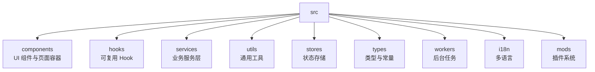
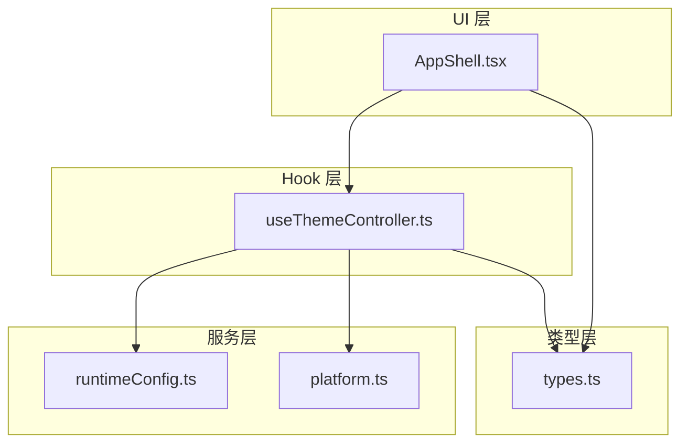
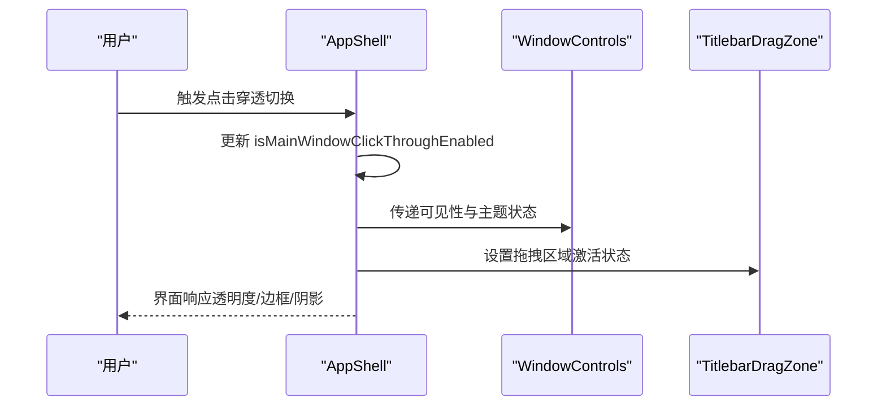
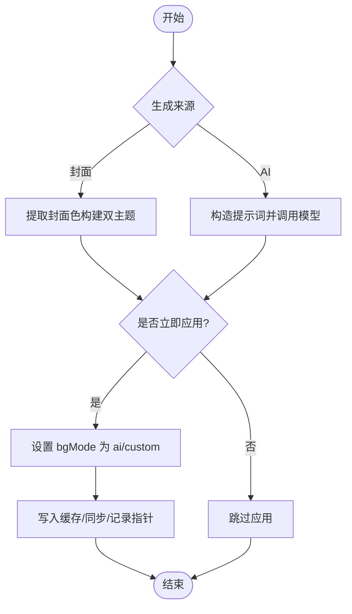
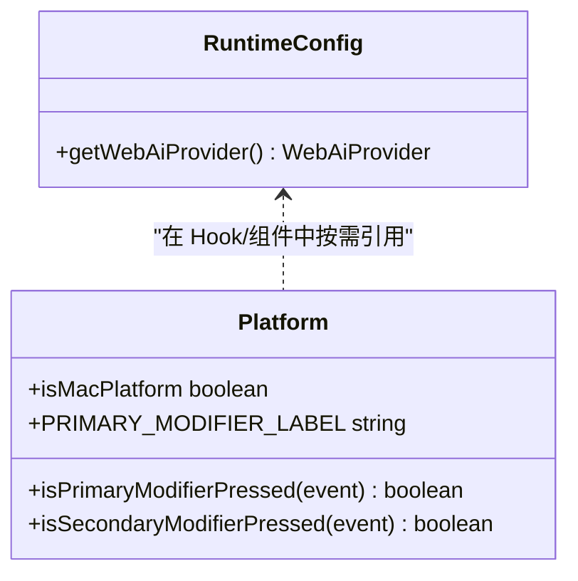
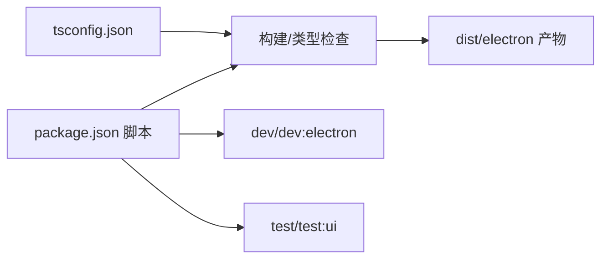

# 代码规范与风格

<cite>
**本文引用的文件**
- [package.json](file://package.json)
- [tsconfig.json](file://tsconfig.json)
- [.editorconfig](file://.editorconfig)
- [AppShell.tsx](file://src/components/app/AppShell.tsx)
- [useThemeController.ts](file://src/hooks/useThemeController.ts)
- [runtimeConfig.ts](file://src/services/runtimeConfig.ts)
- [platform.ts](file://src/utils/platform.ts)
- [types.ts](file://src/types.ts)
</cite>

## 目录
1. [简介](#简介)
2. [项目结构](#项目结构)
3. [核心组件](#核心组件)
4. [架构总览](#架构总览)
5. [详细组件分析](#详细组件分析)
6. [依赖分析](#依赖分析)
7. [性能考虑](#性能考虑)
8. [故障排查指南](#故障排查指南)
9. [结论](#结论)
10. [附录](#附录)

## 简介
本规范面向 Folia Player 前端工程，目标是统一模块组织、命名约定、TypeScript 编码、React 组件开发、注释标准以及工具链配置，确保团队协作一致性与长期可维护性。文档基于仓库现有实现提炼最佳实践，并给出可视化图示与示例路径，便于快速落地。

## 项目结构
src 目录采用“按职责分层 + 领域子域”的组织方式：
- components：UI 组件与页面容器，按功能域进一步细分（如 app、visualizer、modal、panelTab、command-palette 等）。
- hooks：可复用的 React Hooks，封装状态、副作用与平台差异。
- services：业务服务层，包含在线音乐、自动混音、同步、本地库、主题、音频效果等。
- utils：纯函数与通用工具，包括歌词处理、颜色、播放辅助、平台适配等。
- stores：轻量状态管理（Zustand），用于跨组件共享状态。
- types：全局类型定义与常量默认值。
- workers：Web Worker 脚本，用于离线分析与解析任务。
- i18n：国际化资源与配置。
- mods：插件/模组渲染与集成。

章节来源
- [package.json:17-50](file://package.json#L17-L50)

## 核心组件
本节聚焦三个体现规范的典型实现：
- AppShell：应用外壳组件，展示 Props 定义、条件渲染与事件处理模式。
- useThemeController：复杂状态与副作用的 Hook 范式，体现类型化参数、错误回退与持久化策略。
- runtimeConfig/platform：运行时配置与平台检测的工具函数，体现类型安全与单一事实源。

章节来源
- [AppShell.tsx:9-24](file://src/components/app/AppShell.tsx#L9-L24)
- [useThemeController.ts:128-144](file://src/hooks/useThemeController.ts#L128-L144)
- [runtimeConfig.ts:9-16](file://src/services/runtimeConfig.ts#L9-L16)
- [platform.ts:6-24](file://src/utils/platform.ts#L6-L24)

## 架构总览
下图展示 UI 层、Hook 层、服务层与类型层的交互关系，体现“组件调用 Hook，Hook 协调服务与类型”的分层原则。

图表来源
- [AppShell.tsx:9-24](file://src/components/app/AppShell.tsx#L9-L24)
- [useThemeController.ts:128-144](file://src/hooks/useThemeController.ts#L128-L144)
- [runtimeConfig.ts:9-16](file://src/services/runtimeConfig.ts#L9-L16)
- [platform.ts:6-24](file://src/utils/platform.ts#L6-L24)
- [types.ts:83-118](file://src/types.ts#L83-L118)

## 详细组件分析

### 组件：AppShell（外壳容器）
- 职责：提供应用外壳、窗口控制区、透明边框与点击穿透开关，承载音频元素与子树。
- 设计要点：
  - Props 使用显式接口定义，避免 any；布尔与回调参数语义清晰。
  - 条件渲染结合 Tailwind 类名与内联样式，保证 Electron 与 Web 环境一致性。
  - 副作用通过 useEffect 监听窗口尺寸变化，清理函数防止内存泄漏。
  - 无障碍属性 aria-label 与标题提示提升可访问性。

图表来源
- [AppShell.tsx:9-24](file://src/components/app/AppShell.tsx#L9-L24)
- [AppShell.tsx:45-73](file://src/components/app/AppShell.tsx#L45-L73)
- [AppShell.tsx:97-145](file://src/components/app/AppShell.tsx#L97-L145)

章节来源
- [AppShell.tsx:9-24](file://src/components/app/AppShell.tsx#L9-L24)
- [AppShell.tsx:45-73](file://src/components/app/AppShell.tsx#L45-L73)
- [AppShell.tsx:97-145](file://src/components/app/AppShell.tsx#L97-L145)

### Hook：useThemeController（主题控制器）
- 职责：统一管理默认/自定义/AI 主题，处理生成、缓存、同步与回退逻辑。
- 设计要点：
  - 输入参数与返回值均使用强类型接口，避免隐式类型推断带来的漂移。
  - 使用 ref 保存互斥的状态组合，避免并发更新导致的竞态。
  - 异步流程（AI 生成、缓存读取、同步上传）采用 try/catch 与明确的状态机返回。
  - 持久化与降级：localStorage、IndexedDB、最后应用指针与 AI Key 缺失时的封面回退。

图表来源
- [useThemeController.ts:567-606](file://src/hooks/useThemeController.ts#L567-L606)
- [useThemeController.ts:608-690](file://src/hooks/useThemeController.ts#L608-L690)
- [useThemeController.ts:221-256](file://src/hooks/useThemeController.ts#L221-L256)

章节来源
- [useThemeController.ts:128-144](file://src/hooks/useThemeController.ts#L128-L144)
- [useThemeController.ts:221-256](file://src/hooks/useThemeController.ts#L221-L256)
- [useThemeController.ts:567-690](file://src/hooks/useThemeController.ts#L567-L690)

### 工具：运行时配置与平台检测
- runtimeConfig：从运行时注入或编译期变量获取 AI 提供商，提供类型安全的归一化结果。
- platform：统一平台判断与快捷键修饰符翻译，保证键盘行为在多环境一致。

图表来源
- [runtimeConfig.ts:9-16](file://src/services/runtimeConfig.ts#L9-L16)
- [platform.ts:6-24](file://src/utils/platform.ts#L6-L24)

章节来源
- [runtimeConfig.ts:9-16](file://src/services/runtimeConfig.ts#L9-L16)
- [platform.ts:6-24](file://src/utils/platform.ts#L6-L24)

## 依赖分析
- TypeScript 严格模式开启，目标 ES2022，模块解析为 bundler，启用 isolatedModules 与 moduleDetection force，利于增量构建与类型安全。
- 路径别名 @/* 指向 src/*，统一导入根路径。
- 包管理与脚本：Vite 构建、Electron 打包、Playwright UI 测试、Vitest 单元测试。

图表来源
- [tsconfig.json:1-38](file://tsconfig.json#L1-L38)
- [package.json:17-50](file://package.json#L17-L50)

章节来源
- [tsconfig.json:1-38](file://tsconfig.json#L1-L38)
- [package.json:17-50](file://package.json#L17-L50)

## 性能考虑
- 将重计算与渲染分离：视觉相关逻辑尽量放入 hooks 或 worker，避免阻塞主线程。
- 合理使用 useMemo/useCallback 缓存昂贵计算与稳定引用，减少重渲染。
- 大列表与可视化场景使用虚拟滚动与增量更新策略。
- 网络请求与 AI 调用需具备超时、重试与降级策略，避免 UI 长时间阻塞。

## 故障排查指南
- 主题生成失败：检查 AI Key 是否存在，查看日志输出与回退逻辑是否正确触发。
- 平台快捷键不一致：确认 platform.ts 的检测逻辑与快捷键绑定是否使用了统一的修饰符判定。
- 运行时配置未生效：确认 window.__FOLIA_RUNTIME_CONFIG__ 或编译期环境变量是否被正确注入。

章节来源
- [useThemeController.ts:672-690](file://src/hooks/useThemeController.ts#L672-L690)
- [platform.ts:6-24](file://src/utils/platform.ts#L6-L24)
- [runtimeConfig.ts:9-16](file://src/services/runtimeConfig.ts#L9-L16)

## 结论
本项目已具备清晰的模块划分与严格的类型约束。遵循本文的命名、结构与编码规范，可进一步提升可读性与协作效率。建议在新增功能时优先复用已有 hooks/services/utils，并通过 tests 覆盖关键路径。

## 附录

### 模块组织结构与职责
- components
  - 按功能域组织（app、visualizer、modal、panelTab、command-palette 等），每个子目录聚焦一个能力域。
  - 组件文件建议以功能名命名，如 AppShell.tsx、SettingsModal.tsx。
- hooks
  - 以 use 前缀命名，单一职责，组合多个小 Hook 形成复合 Hook。
- services
  - 按领域划分（onlineMusic、automix、sync、repositories 等），对外暴露稳定的 API。
- utils
  - 纯函数为主，按主题划分（lyrics、color、playback 等），避免副作用。
- stores
  - 使用 Zustand 管理跨组件状态，保持最小状态集与派生数据。
- types
  - 集中定义领域类型与默认常量，供全仓引用。
- workers
  - 将耗时任务（解析、分析）迁移至 Worker，降低主线程压力。
- i18n
  - 文案集中管理，组件通过 i18next 获取文本。

章节来源
- [package.json:17-50](file://package.json#L17-L50)

### 文件命名约定
- 组件文件：PascalCase，如 AppShell.tsx、SettingsModal.tsx。
- Hook 文件：camelCase，以 use 开头，如 useThemeController.ts。
- 服务文件：camelCase，描述领域，如 runtimeConfig.ts、localLibraryCatalogService.ts。
- 工具文件：camelCase，描述用途，如 platform.ts、colorExtractor.ts。
- 类型文件：camelCase，如 types.ts、dbTypes.ts。
- 测试文件：与源码同名的 .test.ts 或 .spec.ts。

章节来源
- [AppShell.tsx:1-10](file://src/components/app/AppShell.tsx#L1-L10)
- [useThemeController.ts:1-5](file://src/hooks/useThemeController.ts#L1-L5)
- [runtimeConfig.ts:1-16](file://src/services/runtimeConfig.ts#L1-L16)
- [platform.ts:1-24](file://src/utils/platform.ts#L1-L24)

### TypeScript 编码规范
- 开启严格模式与模块隔离，目标 ES2022，使用 bundler 解析。
- 使用路径别名 @/* 指向 src/*，统一导入。
- 所有外部输入与内部状态使用接口/类型定义，禁止 any。
- 泛型使用于可复用函数与数据结构，提高类型表达力。
- 对可选字段使用 ?，对枚举/字面量联合类型使用 union type。

章节来源
- [tsconfig.json:1-38](file://tsconfig.json#L1-L38)
- [types.ts:83-118](file://src/types.ts#L83-L118)

### React 组件开发规范
- 组件函数签名使用 props 接口，避免隐式类型推断。
- 使用 React.FC 或函数声明均可，但需保持一致。
- 副作用使用 useEffect，并在清理函数中释放资源。
- 状态拆分到合适的 Hook，避免单文件巨型状态。
- 样式建议使用 Tailwind 原子类，必要时配合内联样式。

章节来源
- [AppShell.tsx:9-24](file://src/components/app/AppShell.tsx#L9-L24)
- [AppShell.tsx:45-73](file://src/components/app/AppShell.tsx#L45-L73)

### 代码注释标准
- 公共接口与复杂逻辑使用 JSDoc 注释，说明参数、返回值与边界条件。
- 对业务规则与算法步骤添加行级注释，解释“为什么”而非“是什么”。
- 对临时方案或已知限制添加 TODO/FIXME 标记，便于后续清理。

章节来源
- [types.ts:577-581](file://src/types.ts#L577-L581)
- [platform.ts:1-24](file://src/utils/platform.ts#L1-L24)

### ESLint 与 Prettier 配置说明
- 当前仓库未包含独立的 ESLint/Prettier 配置文件，建议：
  - 引入 ESLint + TypeScript 解析器，启用 strict 规则集。
  - 引入 Prettier 进行格式化，并与编辑器集成。
  - 在 package.json scripts 中添加 lint/format 命令，纳入 CI。
- 若团队已有统一配置，可在根目录添加 .eslintrc.js/.prettierrc 并配置忽略规则。

章节来源
- [package.json:17-50](file://package.json#L17-L50)

### 编辑器与格式约定
- 使用 .editorconfig 统一换行与末尾新行。
- 推荐编辑器开启保存时格式化，保持团队一致。

章节来源
- [.editorconfig:1-5](file://.editorconfig#L1-L5)