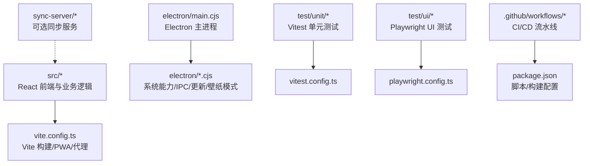
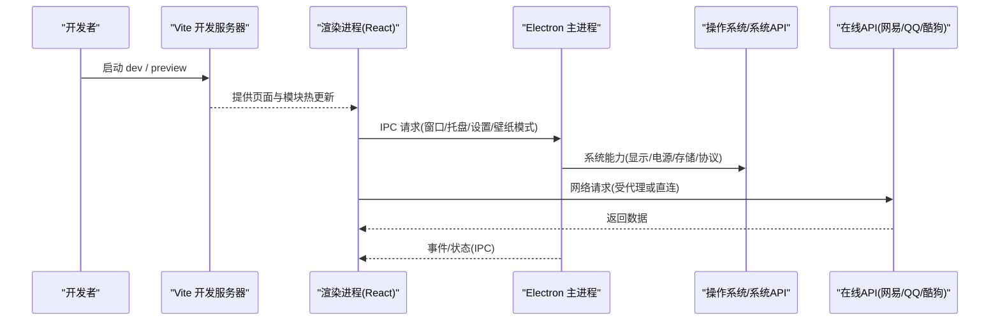
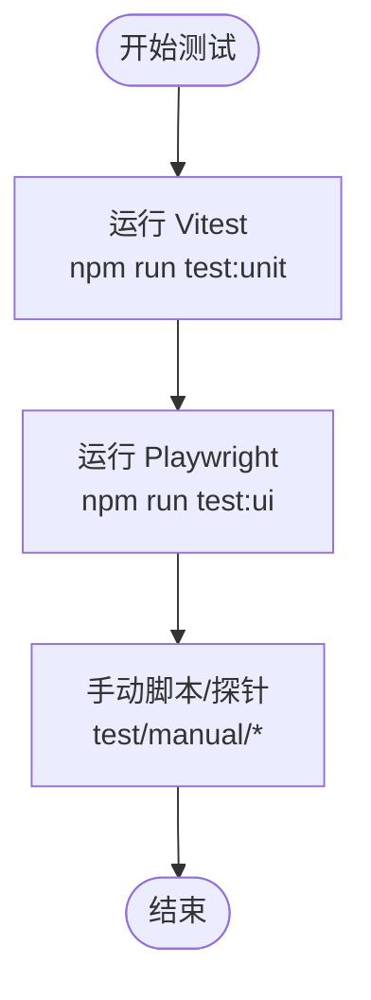
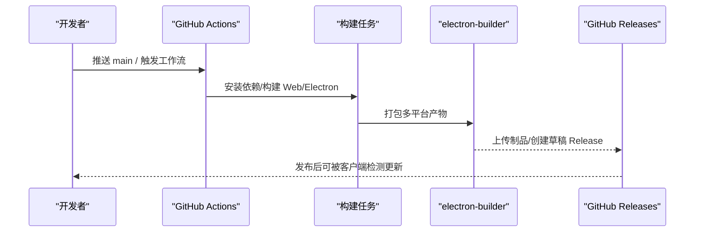
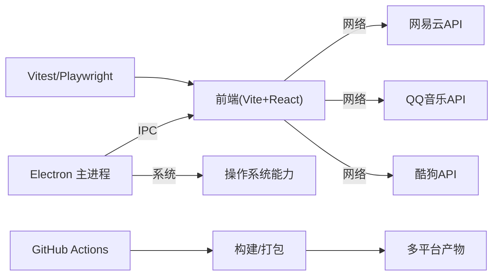

# 开发指南

<cite>
**本文引用的文件**
- [package.json](file://package.json)
- [README.md](file://README.md)
- [vite.config.ts](file://vite.config.ts)
- [playwright.config.ts](file://playwright.config.ts)
- [vitest.config.ts](file://vitest.config.ts)
- [tsconfig.json](file://tsconfig.json)
- [electron/main.cjs](file://electron/main.cjs)
- [.github/workflows/electron-release.yml](file://.github/workflows/electron-release.yml)
- [.github/workflows/pr-unit-tests.yml](file://.github/workflows/pr-unit-tests.yml)
- [docs/technical.md](file://docs/technical.md)
</cite>

## 目录
1. [简介](#简介)
2. [项目结构](#项目结构)
3. [核心组件](#核心组件)
4. [架构总览](#架构总览)
5. [详细组件分析](#详细组件分析)
6. [依赖关系分析](#依赖关系分析)
7. [性能考量](#性能考量)
8. [故障排查指南](#故障排查指南)
9. [结论](#结论)
10. [附录](#附录)

## 简介
本指南面向希望参与 Folia Player（桌面端与 Web 端）开发的工程师，覆盖环境搭建、代码结构与命名规范、测试策略（单元测试、UI 测试、集成测试）、构建与发布流程、调试技巧以及贡献流程。Folia 是一个以全屏沉浸式歌词播放为核心的音乐播放器，提供基于 Electron 的跨平台桌面应用与基于 Vite 的 Web 版本，支持在线音源、本地库、AI 主题生成与多端部署。

## 项目结构
仓库采用前后端分离的工程化组织：前端 React + Vite，桌面端通过 Electron 主进程封装；测试按类型分层（unit/ui/manual），构建与发布由 GitHub Actions 驱动，打包使用 electron-builder，PWA 能力由 vite-plugin-pwa 提供。

**图表来源**
- [vite.config.ts:139-276](file://vite.config.ts#L139-L276)
- [electron/main.cjs:1-120](file://electron/main.cjs#L1-L120)
- [vitest.config.ts:1-18](file://vitest.config.ts#L1-L18)
- [playwright.config.ts:1-52](file://playwright.config.ts#L1-L52)
- [package.json:17-50](file://package.json#L17-L50)

**章节来源**
- [package.json:1-50](file://package.json#L1-L50)
- [vite.config.ts:139-276](file://vite.config.ts#L139-L276)
- [electron/main.cjs:1-120](file://electron/main.cjs#L1-L120)
- [vitest.config.ts:1-18](file://vitest.config.ts#L1-L18)
- [playwright.config.ts:1-52](file://playwright.config.ts#L1-L52)

## 核心组件
- 前端运行时：React + Vite + Tailwind + PWA，提供 Web 与 Stage 客户端入口。
- 桌面端主进程：Electron main.cjs，负责窗口、托盘、更新、壁纸模式、IPC、系统能力桥接等。
- 测试体系：Vitest 单元测试、Playwright UI 测试、手动测试脚本。
- 构建与发布：npm scripts + electron-builder + GitHub Actions，支持多平台打包与自动发布。
- 可选后端：网易云 API、QQ 音乐 API、酷狗 API、Sync Server。

**章节来源**
- [docs/technical.md:74-98](file://docs/technical.md#L74-L98)
- [docs/technical.md:117-244](file://docs/technical.md#L117-L244)
- [package.json:17-50](file://package.json#L17-L50)

## 架构总览
下图展示从用户操作到渲染与系统能力的端到端调用链，包括 Web 开发服务器、Electron 主进程、系统资源与外部 API。

**图表来源**
- [vite.config.ts:139-276](file://vite.config.ts#L139-L276)
- [electron/main.cjs:1-120](file://electron/main.cjs#L1-L120)

## 详细组件分析

### 环境与工具链
- Node.js 版本要求：>= 24（见 engines）。
- 包管理器：npm（CI 使用 npm ci）。
- TypeScript：严格模式，ES2022 目标，bundler 解析，路径别名 @/* -> src/*。
- 构建工具：Vite 6，PWA 插件，多入口（main/stageClient/modExport）。
- 桌面端：Electron 43，electron-builder 打包，额外资源与平台特定目标。

**章节来源**
- [package.json:14-16](file://package.json#L14-L16)
- [package.json:17-50](file://package.json#L17-L50)
- [tsconfig.json:1-38](file://tsconfig.json#L1-L38)
- [vite.config.ts:193-214](file://vite.config.ts#L193-L214)

### 开发环境搭建
- 安装依赖：npm install（或 CI 中的 npm ci）。
- 环境变量：在根目录创建 .env.local，参考 docs/technical.md 中变量表（如 VITE_NETEASE_API_BASE、VITE_QQ_API_BASE、AI 相关变量等）。
- 启动方式：
  - Web 开发：npm run dev 或 vercel dev（推荐，贴近线上行为）。
  - Electron 开发：npm run dev:electron（会同时启动 Vite 并等待端口后运行 Electron）。
  - 预览构建产物：npm run preview。
- 常用脚本：见 package.json scripts 与 docs/technical.md 常用脚本表。

**章节来源**
- [docs/technical.md:117-244](file://docs/technical.md#L117-L244)
- [package.json:17-50](file://package.json#L17-L50)

### 代码结构与命名规范
- 模块组织：
  - src/components：UI 组件（app、command-palette、visualizer、panelTab 等）。
  - src/services：业务服务（automix、onlineMusic、repositories、sync 等）。
  - src/hooks：React Hooks。
  - src/utils：通用工具（lyrics、audio、theme 等）。
  - src/stores：状态管理（Zustand）。
  - electron：主进程与系统桥接。
  - test：unit/ui/manual。
- 命名约定：
  - 组件与 Hook 使用 PascalCase/CamelCase。
  - 服务与工具函数使用 camelCase。
  - 常量使用 UPPER_SNAKE_CASE。
  - 测试文件统一 *.test.ts 或 *.spec.ts。
- 注释标准：
  - 关键算法与复杂逻辑建议添加行内说明与复杂度说明。
  - 对外暴露的接口需有清晰描述。

**章节来源**
- [docs/technical.md:245-261](file://docs/technical.md#L245-L261)

### 测试策略与框架
- 单元测试（Vitest）：
  - 配置文件：vitest.config.ts（Node 环境，包含 test/unit/**/*.test.ts）。
  - 执行命令：npm run test:unit 或 npm run test。
  - 典型用例：automix、lyrics、services、utils 等纯逻辑模块。
- UI 测试（Playwright）：
  - 配置文件：playwright.config.ts（浏览器 Chromium，截图对比容差、超时、webServer 启动）。
  - 执行命令：npm run test:ui；更新快照：npm run test:ui:update。
  - 特点：启动 Vite 作为 webServer，固定视口与基线对比。
- 集成/手动测试：
  - test/manual 下提供各类探针与基准脚本，用于联调与回归验证。

**图表来源**
- [vitest.config.ts:1-18](file://vitest.config.ts#L1-L18)
- [playwright.config.ts:16-52](file://playwright.config.ts#L16-L52)
- [package.json:24-28](file://package.json#L24-L28)

**章节来源**
- [vitest.config.ts:1-18](file://vitest.config.ts#L1-L18)
- [playwright.config.ts:1-52](file://playwright.config.ts#L1-L52)
- [package.json:24-28](file://package.json#L24-L28)

### 构建与发布流程
- 构建目标：
  - Web：npm run build（含 Vercel API 编译）。
  - Electron：npm run build:electron（构建 Web、构建辅助二进制、electron-builder 打包）。
  - 多平台：macOS(dmg/zip)、Windows(nsis/portable)、Linux(tar.gz/deb/rpm)。
- 环境变量注入：
  - Vite define 注入 __COMMIT_HASH__、__GIT_BRANCH__、__APP_VERSION__、__APP_VERSION_LABEL__、__APP_RELEASE_CHANNEL__、__DOCKER_STACK_VERSION__。
- CI/CD：
  - PR 检查：.github/workflows/pr-unit-tests.yml（typecheck + unit tests）。
  - Realeco 发布：.github/workflows/electron-release.yml（校验版本、构建三平台、上传制品、发布草稿 Release、AUR 推送）。
- 版本管理：
  - package.json version 与 realeco-release 文件内容、提交信息需一致（Realeco 通道）。
  - 发布通道：Realeco/Limo/Cielo，对应不同更新来源。

**图表来源**
- [.github/workflows/electron-release.yml:110-223](file://.github/workflows/electron-release.yml#L110-L223)
- [package.json:52-180](file://package.json#L52-L180)
- [vite.config.ts:261-268](file://vite.config.ts#L261-L268)

**章节来源**
- [.github/workflows/electron-release.yml:1-313](file://.github/workflows/electron-release.yml#L1-L313)
- [.github/workflows/pr-unit-tests.yml:1-50](file://.github/workflows/pr-unit-tests.yml#L1-L50)
- [package.json:52-180](file://package.json#L52-L180)
- [vite.config.ts:261-268](file://vite.config.ts#L261-L268)

### 调试技巧与工具
- 浏览器调试：
  - 使用 Vite 开发服务器（端口 3000），配合浏览器开发者工具进行断点与性能分析。
  - PWA 调试：启用 devOptions.enabled，注意 navigateFallbackDenylist 对 /api 路由的影响。
- Electron 调试：
  - 使用 npm run dev:electron 启动，可结合 VS Code 调试配置。
  - 日志与崩溃：关注主进程控制台输出与系统日志；Linux Wayland/Vulkan 问题可通过开关调整。
- 性能分析：
  - 使用浏览器 Performance 面板与内存面板定位瓶颈。
  - 针对大依赖（如 three.js）已拆分 chunk，避免 PWA 预缓存超限。
- 其他：
  - 歌词代理：开发时通过 vite 中间件转发至白名单域名，便于本地联调。
  - 壁纸模式：Linux 需要 windowtolayer，Windows 需要 wallpaper-helper，缺失将自动降级。

**章节来源**
- [vite.config.ts:68-137](file://vite.config.ts#L68-L137)
- [vite.config.ts:215-242](file://vite.config.ts#L215-L242)
- [electron/main.cjs:78-105](file://electron/main.cjs#L78-L105)
- [electron/main.cjs:183-226](file://electron/main.cjs#L183-L226)

### 贡献代码指南
- 分支与提交：
  - 遵循常规 Git Flow，PR 前确保 typecheck 与单元测试通过（CI 会自动运行）。
- Pull Request 流程：
  - 提交 PR 后，pr-unit-tests 工作流会执行类型检查与单元测试。
  - 合并至 main 后，若存在 realeco-release 且满足一致性规则，将触发 Realeco 发布流水线。
- 代码审查：
  - 关注变更影响面（UI/服务/构建/测试），补充必要测试用例。
- 社区协作：
  - 通过 Discord 社群交流，Issue 模板用于功能建议与问题报告。

**章节来源**
- [.github/workflows/pr-unit-tests.yml:1-50](file://.github/workflows/pr-unit-tests.yml#L1-L50)
- [.github/workflows/electron-release.yml:24-88](file://.github/workflows/electron-release.yml#L24-L88)
- [README.md:212-222](file://README.md#L212-L222)

## 依赖关系分析
- 前端依赖：React、Tailwind、Framer Motion、i18next、Pixi/Three 等可视化库。
- 桌面端依赖：Electron、electron-store、electron-updater、ws 等。
- 构建与测试：Vite、TypeScript、Vitest、Playwright、electron-builder。
- 外部服务：网易云 API、QQ 音乐 API、酷狗 API、Sync Server（可选）。

**图表来源**
- [package.json:181-248](file://package.json#L181-L248)
- [vite.config.ts:139-276](file://vite.config.ts#L139-L276)
- [electron/main.cjs:1-120](file://electron/main.cjs#L1-L120)

**章节来源**
- [package.json:181-248](file://package.json#L181-L248)

## 性能考量
- 大依赖拆分：three.js 单独分包，避免 PWA 预缓存大小限制。
- 资源忽略：构建时忽略 release/models 目录，防止 watch 句柄导致打包失败。
- 图形加速：Linux Wayland/Vulkan 兼容性与 SwiftShader 回退；macOS Intel + AMD 独显优化。
- 音频与可视化：Worker 与 Offscreen 处理（如 automix 分析、歌词解析），减少主线程阻塞。

**章节来源**
- [vite.config.ts:198-225](file://vite.config.ts#L198-L225)
- [electron/main.cjs:78-105](file://electron/main.cjs#L78-L105)

## 故障排查指南
- 开发服务器无法启动：
  - 检查端口占用（默认 3000），确认 .env.local 配置正确。
  - 查看 Vite 控制台错误与代理日志。
- Electron 启动异常：
  - Linux Wayland/Vulkan 问题：尝试软件渲染或 SwiftShader。
  - 壁纸模式二进制缺失：自动降级为普通窗口。
- 测试失败：
  - 单元测试：确认 vitest 环境为 node，路径别名生效。
  - UI 测试：确认 webServer 启动成功，截图容差合理。
- 构建失败：
  - Rust 工具链缺失（Linux/Windows 构建 native 依赖）。
  - 环境变量未设置（如 APP_VERSION_LABEL、RELEASE_CHANNEL）。

**章节来源**
- [electron/main.cjs:78-105](file://electron/main.cjs#L78-L105)
- [electron/main.cjs:183-226](file://electron/main.cjs#L183-L226)
- [playwright.config.ts:45-52](file://playwright.config.ts#L45-L52)
- [.github/workflows/electron-release.yml:133-166](file://.github/workflows/electron-release.yml#L133-L166)

## 结论
Folia Player 提供了完善的工程化体系：清晰的模块划分、严格的类型检查、完整的测试矩阵、稳定的构建与发布流程，以及丰富的调试手段。遵循本指南可以快速搭建开发环境、理解代码结构、编写高质量测试、完成多平台构建与发布，并高效参与社区贡献。

## 附录
- 常用命令速查：
  - 开发：npm run dev / npm run dev:electron
  - 构建：npm run build / npm run build:electron
  - 测试：npm run test:unit / npm run test:ui
  - 预览：npm run preview
- 环境变量参考：见 docs/technical.md 的环境变量表。
- 技术栈概览：React 19、Vite 6、TypeScript、Tailwind CSS 4、Electron、i18next。

**章节来源**
- [docs/technical.md:225-273](file://docs/technical.md#L225-L273)
- [package.json:17-50](file://package.json#L17-L50)