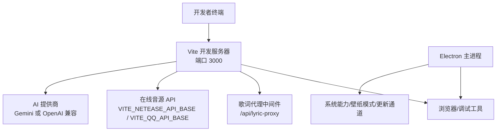
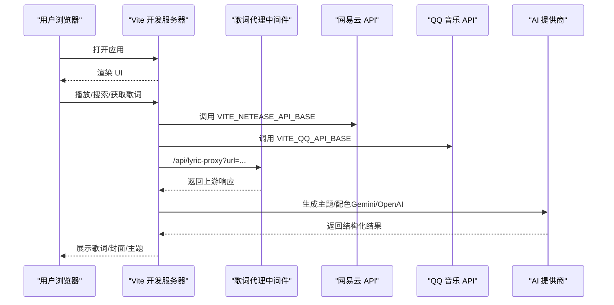
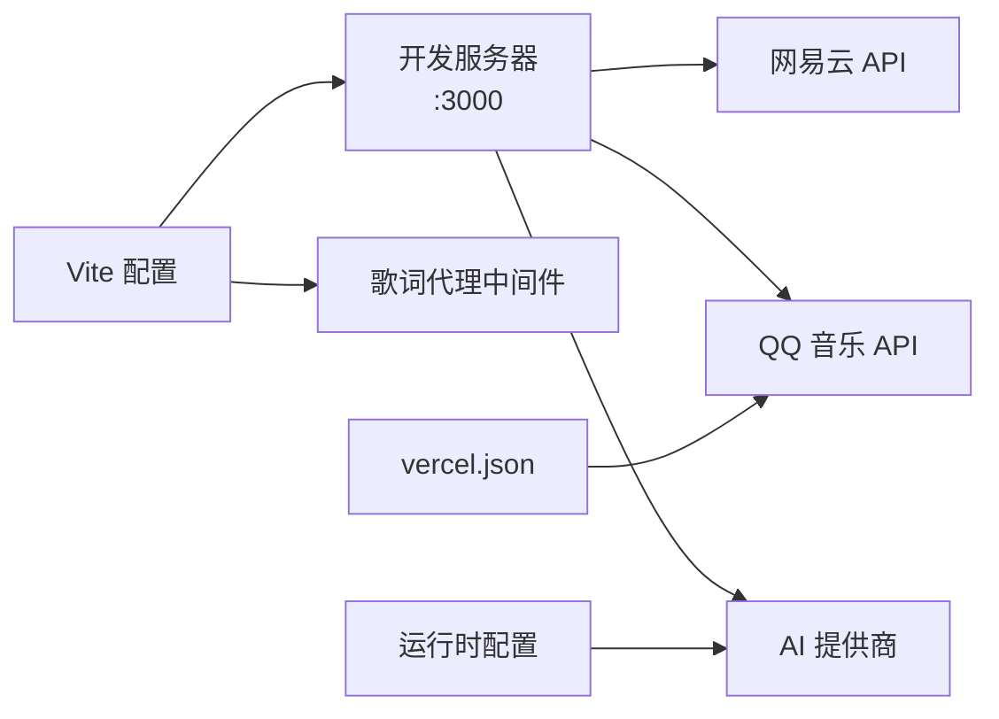

# 开发环境搭建

<cite>
**本文引用的文件**
- [package.json](file://package.json)
- [vite.config.ts](file://vite.config.ts)
- [vercel.json](file://vercel.json)
- [README.md](file://README.md)
- [docs/technical.md](file://docs/technical.md)
- [docs/qq-music-deployment.md](file://docs/qq-music-deployment.md)
- [src/services/runtimeConfig.ts](file://src/services/runtimeConfig.ts)
- [electron/main.cjs](file://electron/main.cjs)
</cite>

## 目录
1. [简介](#简介)
2. [项目结构](#项目结构)
3. [核心组件](#核心组件)
4. [架构总览](#架构总览)
5. [详细组件分析](#详细组件分析)
6. [依赖关系分析](#依赖关系分析)
7. [性能注意事项](#性能注意事项)
8. [故障排查指南](#故障排查指南)
9. [结论](#结论)
10. [附录](#附录)

## 简介
本指南面向希望在本地搭建 Folia Player 开发环境的开发者，覆盖 Node.js 版本要求、依赖安装、环境变量配置、开发服务器启动（含 Vercel 本地模式）、常见问题定位与解决，以及 Electron 桌面端开发与调试要点。目标是让你快速跑起前端开发服务，并顺利联调在线音源与 AI 能力。

## 项目结构
- 前端构建与开发：基于 Vite，默认监听 3000 端口，支持 PWA、多入口页面与开发期歌词代理中间件。
- 后端 API：依赖网易云增强 API；QQ 音乐可选，支持常驻进程或 Serverless（Vercel/Cloudflare）形态。
- 桌面端：Electron 主进程负责窗口、系统能力、壁纸模式、更新通道等。
- 部署配置：根目录 vercel.json 提供 /api/qq 路由重写，便于在 Vercel/Cloudflare 使用内置 serverless 入口。

图表来源
- [vite.config.ts:215-226](file://vite.config.ts#L215-L226)
- [vercel.json:1-6](file://vercel.json#L1-L6)

章节来源
- [vite.config.ts:1-276](file://vite.config.ts#L1-L276)
- [vercel.json:1-6](file://vercel.json#L1-L6)

## 核心组件
- 开发服务器与插件：Vite 开发服务器、React 插件、PWA、歌词代理中间件、构建时变量注入。
- 环境变量与运行时配置：通过 .env.local 注入构建期变量；运行时可通过 window.__FOLIA_RUNTIME_CONFIG__ 覆盖 AI 提供商选择。
- 在线音源：网易云、QQ 音乐、酷狗（Web 版需额外部署）。
- AI 主题生成：支持 Google Gemini 与 OpenAI 兼容接口。
- Electron 桌面端：主进程集成系统能力、壁纸模式、更新通道、歌词接口等。

章节来源
- [vite.config.ts:139-276](file://vite.config.ts#L139-L276)
- [src/services/runtimeConfig.ts:1-16](file://src/services/runtimeConfig.ts#L1-L16)
- [docs/technical.md:74-98](file://docs/technical.md#L74-L98)
- [docs/technical.md:117-224](file://docs/technical.md#L117-L224)

## 架构总览
下图展示本地开发时的请求路径：浏览器访问 Vite 开发服务器，必要时通过歌词代理转发到上游域名；在线音源与 AI 调用由环境变量决定目标地址。

图表来源
- [vite.config.ts:68-137](file://vite.config.ts#L68-L137)
- [docs/technical.md:143-159](file://docs/technical.md#L143-L159)

## 详细组件分析

### 环境与依赖准备
- Node.js 版本：要求 24 或更高版本。
- 依赖安装：在项目根目录执行 npm install。
- 推荐包管理器：npm（与仓库 scripts 一致）。

章节来源
- [package.json:14-16](file://package.json#L14-L16)
- [docs/technical.md:117-127](file://docs/technical.md#L117-L127)

### 环境变量配置
- 创建 .env.local：复制示例或直接新建，用于本地开发。
- 必需变量：
  - VITE_NETEASE_API_BASE：网易云 API 实例地址（必填）。
  - VITE_AI_PROVIDER：AI 提供商，google 或 openai（必填）。
- 可选变量：
  - VITE_KUGOU_API_BASE：Web 版酷狗 API 地址（Electron 不使用）。
  - VITE_QQ_API_BASE：QQ 音乐 API 地址；Serverless 可填 /api/qq。
  - QQ_SESSION_SECRET：Serverless 登录态加密密钥（不加 VITE_ 前缀）。
  - OPENAI_*：OpenAI 兼容接口的 Key、URL、Model、Temperature 等。
  - GEMINI_API_KEY：Gemini API Key。
- 运行时覆盖：可在运行时通过 window.__FOLIA_RUNTIME_CONFIG__.aiProvider 覆盖 AI 提供商选择。

章节来源
- [docs/technical.md:129-217](file://docs/technical.md#L129-L217)
- [docs/qq-music-deployment.md:44-62](file://docs/qq-music-deployment.md#L44-L62)
- [src/services/runtimeConfig.ts:1-16](file://src/services/runtimeConfig.ts#L1-L16)

### 启动开发服务器
- 推荐方式：vercel dev（更贴近线上行为）。
- 备用方式：npm run dev（直接启动 Vite）。
- 端口：默认 3000，如需修改可在 vite.config.ts 中调整。
- 注意：修改 .env.local 后需重启开发服务器。

章节来源
- [docs/technical.md:219-224](file://docs/technical.md#L219-L224)
- [vite.config.ts:215-226](file://vite.config.ts#L215-L226)

### 在线音源与歌词代理
- 网易云：通过 VITE_NETEASE_API_BASE 指向你的实例。
- QQ 音乐：
  - Web 版可部署常驻服务或使用内置 serverless（Vercel/Cloudflare），将 VITE_QQ_API_BASE 设为 /api/qq，并配置 QQ_SESSION_SECRET。
  - vercel.json 提供 /api/qq/:path* 的重写规则。
- 歌词代理：开发期通过 /api/lyric-proxy 转发到允许的上游域名（如 qq.com、kugou.com 等），并设置 CORS 头。

章节来源
- [docs/technical.md:74-83](file://docs/technical.md#L74-L83)
- [docs/qq-music-deployment.md:44-62](file://docs/qq-music-deployment.md#L44-L62)
- [vercel.json:1-6](file://vercel.json#L1-L6)
- [vite.config.ts:11-40](file://vite.config.ts#L11-L40)
- [vite.config.ts:68-137](file://vite.config.ts#L68-L137)

### AI 提供商配置
- 选择提供商：VITE_AI_PROVIDER 为 google 或 openai。
- Gemini：需要 GEMINI_API_KEY。
- OpenAI 兼容：需要 OPENAI_API_KEY、OPENAI_API_URL、OPENAI_API_MODEL，可选 OPENAI_API_TEMPERATURE。
- 运行时覆盖：可通过 window.__FOLIA_RUNTIME_CONFIG__.aiProvider 动态切换。

章节来源
- [docs/technical.md:84-91](file://docs/technical.md#L84-L91)
- [docs/technical.md:143-159](file://docs/technical.md#L143-L159)
- [src/services/runtimeConfig.ts:1-16](file://src/services/runtimeConfig.ts#L1-L16)

### Electron 开发模式与调试
- 启动命令：
  - npm run dev:electron：并行启动 Vite 与 Electron，等待 3000 端口就绪后加载。
  - npm run dev:electron:update-preview：模拟显示版本更新提示。
  - npm run dev:electron:wallpaper：先构建 windowtolayer 再启动 Electron（Linux 壁纸模式联调）。
- 关键环境变量：
  - ELECTRON_DEV=true：启用 Electron 开发模式。
  - FOLIA_WINDOWTOLAYER_PATH：开发期指定 windowtolayer 二进制路径。
  - FOLIA_WALLPAPER_HELPER_PATH：Windows 壁纸辅助程序路径。
  - FOLIA_DEV_UPDATE_PREVIEW=true：模拟更新预览。
- 调试技巧：
  - 使用浏览器 DevTools 调试前端。
  - 检查 Electron 主进程日志与窗口控制台。
  - Linux 下可通过图形模式开关（swiftshader/software/system）排查渲染问题。
  - 壁纸模式缺失二进制会自动回退关闭。

章节来源
- [package.json:37-43](file://package.json#L37-L43)
- [electron/main.cjs:183-194](file://electron/main.cjs#L183-L194)
- [electron/main.cjs:28-36](file://electron/main.cjs#L28-L36)
- [docs/technical.md:225-243](file://docs/technical.md#L225-L243)

## 依赖关系分析
- 构建与运行：
  - Vite 作为开发服务器与构建工具，默认端口 3000。
  - React 与 PWA 插件用于界面与离线能力。
  - 歌词代理中间件在 serve 阶段拦截 /api/lyric-proxy。
- 在线音源：
  - 网易云通过外部 API 地址接入。
  - QQ 音乐支持常驻或 Serverless，Serverless 通过 vercel.json 重写路由。
- AI 能力：
  - 通过环境变量选择提供商，并在运行时可覆盖。

图表来源
- [vite.config.ts:139-276](file://vite.config.ts#L139-L276)
- [vercel.json:1-6](file://vercel.json#L1-L6)
- [src/services/runtimeConfig.ts:1-16](file://src/services/runtimeConfig.ts#L1-L16)

章节来源
- [vite.config.ts:139-276](file://vite.config.ts#L139-L276)
- [vercel.json:1-6](file://vercel.json#L1-L6)
- [src/services/runtimeConfig.ts:1-16](file://src/services/runtimeConfig.ts#L1-L16)

## 性能注意事项
- 开发服务器监听端口固定为 3000，避免与其他服务冲突。
- 构建产物拆分 large dependency（如 three.js）以避免 PWA 预缓存大小限制。
- 忽略 release 与 models 目录的监听，防止打包时句柄占用导致失败。
- 壁纸模式依赖外部二进制，缺失时自动回退，不影响基础功能。

章节来源
- [vite.config.ts:198-226](file://vite.config.ts#L198-L226)
- [electron/main.cjs:183-194](file://electron/main.cjs#L183-L194)

## 故障排查指南
- API 服务连接问题
  - 确认 VITE_NETEASE_API_BASE 指向可达的实例。
  - 若同时运行多个服务，确保端口不冲突（例如网易云改用 3300，QQ 用 3200）。
  - 检查网络与代理设置，必要时在命令行或系统层配置代理。
- QQ 音乐登录与播放
  - Serverless 形态必须设置 QQ_SESSION_SECRET，并将 VITE_QQ_API_BASE 设置为 /api/qq。
  - 验证 /api/qq/login/channels 是否返回 JSON（而非 HTML）。
  - Vercel 仅支持微信扫码；Cloudflare 如需 QQ 扫码需绑定 Durable Object。
- AI 提供商错误
  - 未设置对应 API Key 会返回服务端配置错误。
  - Temperature 超出范围会被归一化；某些模型有特殊温度要求。
  - 可通过运行时配置覆盖 AI 提供商以快速验证。
- 歌词代理失败
  - 确认目标域名在白名单内（如 qq.com、kugou.com 等）。
  - 检查 CORS 头是否正确设置。
  - 查看开发服务器控制台中的代理错误信息。
- Electron 启动或渲染异常
  - 检查 ELECTRON_DEV 与 FOLIA_WINDOWTOLAYER_PATH 等环境变量。
  - Linux 下尝试 swiftshader 或 software 图形模式。
  - 壁纸模式缺失二进制会自动关闭，不影响其他功能。

章节来源
- [docs/technical.md:171-195](file://docs/technical.md#L171-L195)
- [docs/qq-music-deployment.md:286-298](file://docs/qq-music-deployment.md#L286-L298)
- [vite.config.ts:68-137](file://vite.config.ts#L68-L137)
- [electron/main.cjs:28-36](file://electron/main.cjs#L28-L36)

## 结论
按照本指南完成 Node.js 版本准备、依赖安装与环境变量配置后，即可通过 vercel dev 或 npm run dev 启动开发服务器，并基于 VITE_NETEASE_API_BASE、VITE_QQ_API_BASE 与 VITE_AI_PROVIDER 联调在线音源与 AI 能力。Electron 开发模式提供了完整的桌面端调试体验，配合图形模式与壁纸模式开关，可高效定位平台相关问题。

## 附录
- 常用脚本速查
  - npm run dev：启动 Vite 开发服务器。
  - npm run build：构建 Web 版本。
  - npm run preview：预览构建结果。
  - npm run dev:electron：启动 Electron 开发模式。
  - npm run stage:client：打开 Stage API 联调台。
- 参考文档
  - 技术与开发说明：包含部署、环境变量、本地开发、Stage API 与技术栈。
  - QQ 音乐部署指南：涵盖 Serverless 与常驻服务的配置与排错。

章节来源
- [docs/technical.md:225-243](file://docs/technical.md#L225-L243)
- [docs/technical.md:74-98](file://docs/technical.md#L74-L98)
- [docs/qq-music-deployment.md:1-30](file://docs/qq-music-deployment.md#L1-L30)