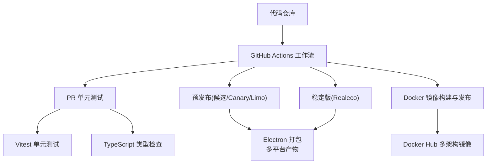
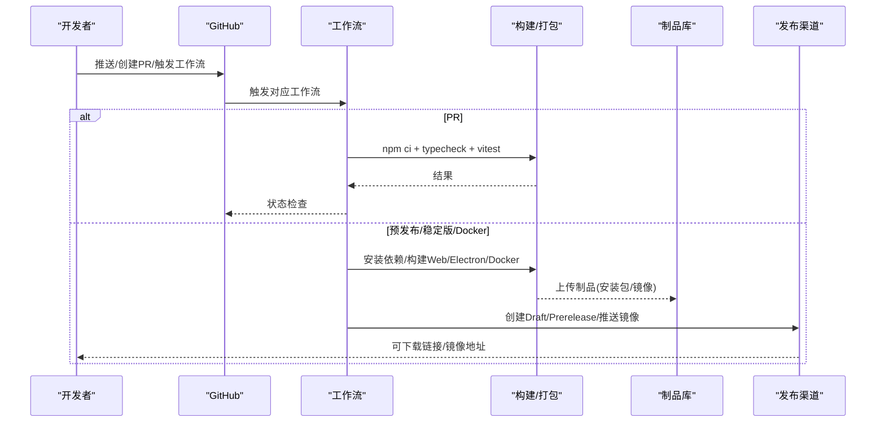
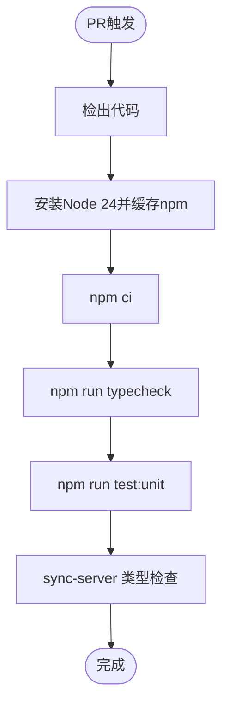
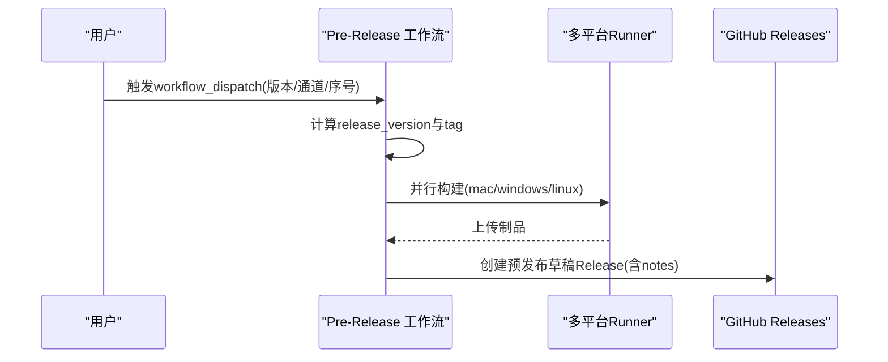
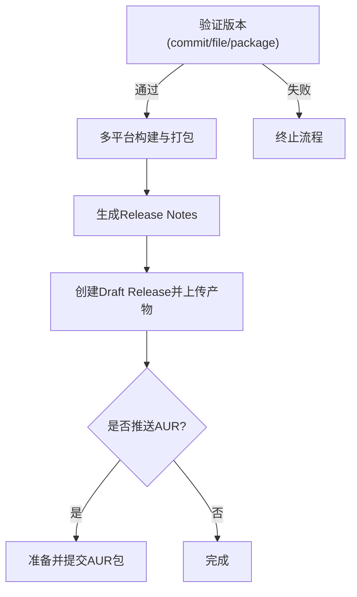
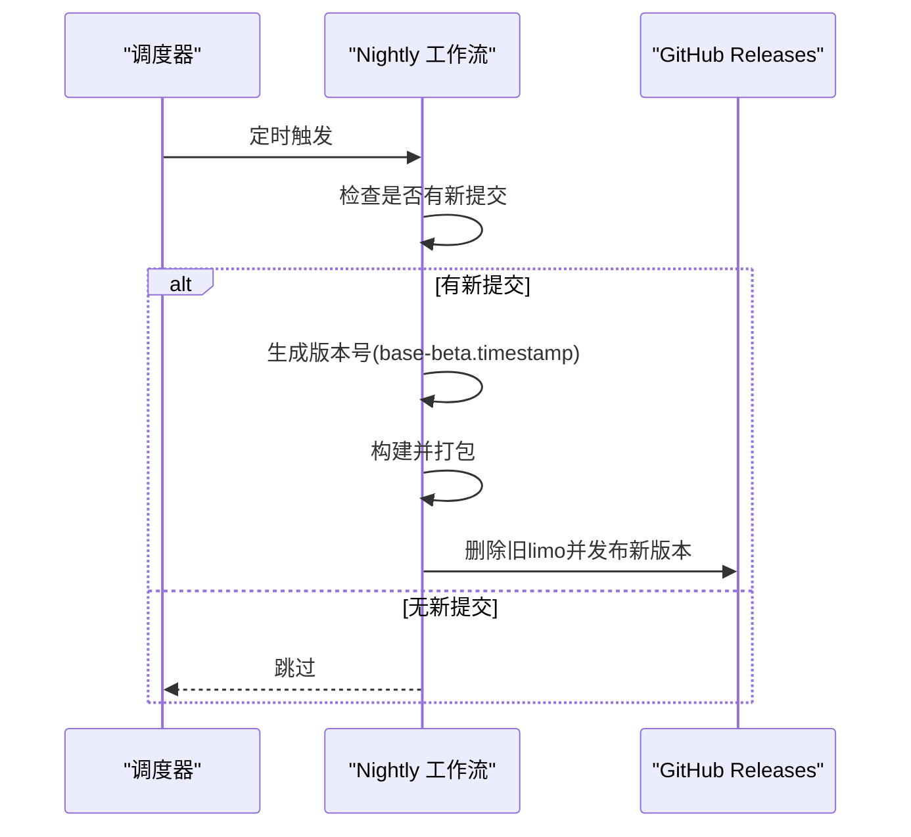
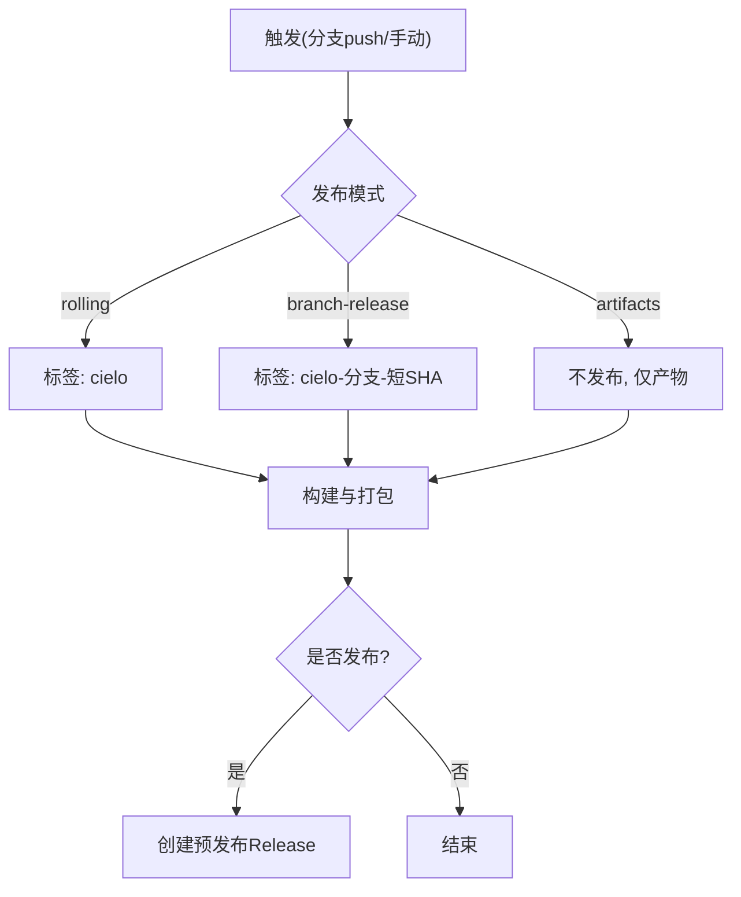
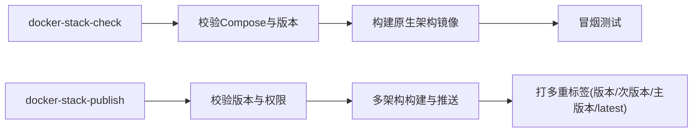
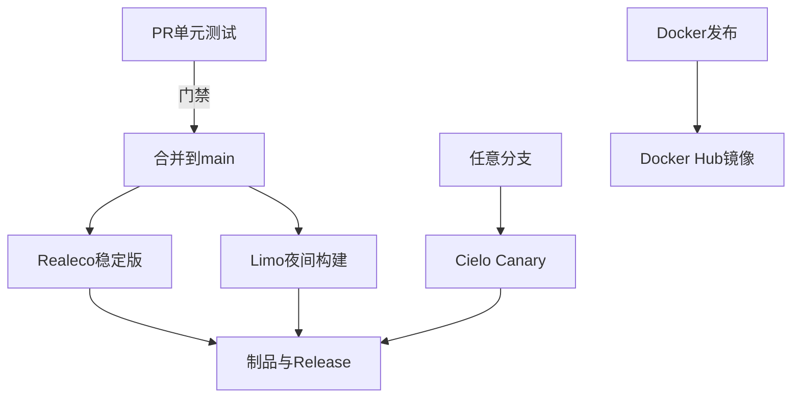

# CI/CD流水线

<cite>
**本文引用的文件**
- [package.json](file://package.json)
- [vitest.config.ts](file://vitest.config.ts)
- [playwright.config.ts](file://playwright.config.ts)
- [.github/workflows/pr-unit-tests.yml](file://.github/workflows/pr-unit-tests.yml)
- [.github/workflows/electron-release.yml](file://.github/workflows/electron-release.yml)
- [.github/workflows/release-candidate.yml](file://.github/workflows/release-candidate.yml)
- [.github/workflows/nightly-pre-release.yml](file://.github/workflows/nightly-pre-release.yml)
- [.github/workflows/canary-pre-release.yml](file://.github/workflows/canary-pre-release.yml)
- [.github/workflows/docker-stack-check.yml](file://.github/workflows/docker-stack-check.yml)
- [.github/workflows/docker-stack-publish.yml](file://.github/workflows/docker-stack-publish.yml)
- [.github/workflows/sync-server-docker-publish.yml](file://.github/workflows/sync-server-docker-publish.yml)
- [shared/realecoReleaseMetadata.cjs](file://shared/realecoReleaseMetadata.cjs)
- [.github/release-draft-template.md](file://.github/release-draft-template.md)
</cite>

## 目录
1. [简介](#简介)
2. [项目结构](#项目结构)
3. [核心组件](#核心组件)
4. [架构总览](#架构总览)
5. [详细组件分析](#详细组件分析)
6. [依赖分析](#依赖分析)
7. [性能考虑](#性能考虑)
8. [故障排除指南](#故障排除指南)
9. [结论](#结论)
10. [附录](#附录)

## 简介
本文件面向Folia Player的持续集成与持续部署（CI/CD）流水线，系统化说明GitHub Actions工作流如何覆盖代码检查、单元测试、UI测试、构建打包、多通道发布与Docker镜像发布。文档同时解释依赖管理策略（npm锁定与安全审计）、自动化测试流程（单元与UI测试、覆盖率与用例管理）、发布流程（版本标签、Changelog生成、Release发布、更新通道配置），并提供本地模拟CI的方法与常见问题的排障建议。

## 项目结构
仓库采用“前端Electron应用 + 同步服务 + Docker化后端栈”的多模块组织方式：
- 根级Node工程负责Web应用构建、Electron打包与测试脚本。
- GitHub Actions位于.github/workflows，按职责拆分为PR校验、预发布、稳定版发布、夜间构建、Docker镜像构建与发布等。
- 测试框架：Vitest用于单元测试，Playwright用于UI截图测试。
- 发布工具链：electron-builder负责桌面端打包；Docker Buildx负责多架构镜像构建与推送。

图表来源
- [.github/workflows/pr-unit-tests.yml:1-50](file://.github/workflows/pr-unit-tests.yml#L1-L50)
- [.github/workflows/release-candidate.yml:1-228](file://.github/workflows/release-candidate.yml#L1-L228)
- [.github/workflows/electron-release.yml:1-313](file://.github/workflows/electron-release.yml#L1-L313)
- [.github/workflows/docker-stack-publish.yml:1-200](file://.github/workflows/docker-stack-publish.yml#L1-L200)

章节来源
- [package.json:17-50](file://package.json#L17-L50)
- [.github/workflows/pr-unit-tests.yml:1-50](file://.github/workflows/pr-unit-tests.yml#L1-L50)

## 核心组件
- 测试与质量门禁
  - 单元测试：Vitest执行test/unit/**/*.test.ts，运行环境为node，支持别名@指向src。
  - UI测试：Playwright启动开发服务器并执行test/ui下的截图断言，启用trace与容差以缓解并发导致的像素抖动。
  - 类型检查：通过npm run typecheck在PR中强制通过。
- 构建与打包
  - Web构建：vite build，配合环境变量注入版本与更新通道。
  - Electron打包：electron-builder输出macOS(.dmg/.zip)、Windows(.exe/.portable)、Linux(.deb/.rpm/.tar.gz)。
- 发布通道
  - Realeco：稳定版，基于commit信息与realeco-release文件三重校验，生成Draft Release并上传产物。
  - Pre-Release：beta/rc候选，支持手动触发与版本号计算。
  - Limo Nightly：定时任务生成滚动预览版。
  - Cielo Canary：分支或滚动构建，支持仅产物模式。
- Docker镜像
  - docker-stack-check：校验Compose与构建原生架构镜像并执行冒烟测试。
  - docker-stack-publish：从main分支发布多架构镜像至Docker Hub，并打多重标签。
  - sync-server-docker-publish：独立同步服务的镜像发布。

章节来源
- [vitest.config.ts:1-18](file://vitest.config.ts#L1-L18)
- [playwright.config.ts:1-52](file://playwright.config.ts#L1-L52)
- [package.json:17-50](file://package.json#L17-L50)
- [.github/workflows/pr-unit-tests.yml:1-50](file://.github/workflows/pr-unit-tests.yml#L1-L50)
- [.github/workflows/electron-release.yml:1-313](file://.github/workflows/electron-release.yml#L1-L313)
- [.github/workflows/release-candidate.yml:1-228](file://.github/workflows/release-candidate.yml#L1-L228)
- [.github/workflows/nightly-pre-release.yml:1-132](file://.github/workflows/nightly-pre-release.yml#L1-L132)
- [.github/workflows/canary-pre-release.yml:1-177](file://.github/workflows/canary-pre-release.yml#L1-L177)
- [.github/workflows/docker-stack-check.yml:1-58](file://.github/workflows/docker-stack-check.yml#L1-L58)
- [.github/workflows/docker-stack-publish.yml:1-200](file://.github/workflows/docker-stack-publish.yml#L1-L200)
- [.github/workflows/sync-server-docker-publish.yml:1-138](file://.github/workflows/sync-server-docker-publish.yml#L1-L138)

## 架构总览
下图展示从代码提交到产物发布的端到端流程，包括PR门禁、多通道构建、产物归档与发布。

图表来源
- [.github/workflows/pr-unit-tests.yml:1-50](file://.github/workflows/pr-unit-tests.yml#L1-L50)
- [.github/workflows/release-candidate.yml:1-228](file://.github/workflows/release-candidate.yml#L1-L228)
- [.github/workflows/electron-release.yml:1-313](file://.github/workflows/electron-release.yml#L1-L313)
- [.github/workflows/docker-stack-publish.yml:1-200](file://.github/workflows/docker-stack-publish.yml#L1-L200)

## 详细组件分析

### PR单元测试工作流
- 触发条件：Pull Request事件（打开、同步、重新打开、就绪）。
- 关键步骤：检出代码、安装Node 24、缓存npm、安装依赖、类型检查、运行单元测试、同步服务类型检查。
- 并发控制：按PR号分组，取消进行中任务。

图表来源
- [.github/workflows/pr-unit-tests.yml:1-50](file://.github/workflows/pr-unit-tests.yml#L1-L50)

章节来源
- [.github/workflows/pr-unit-tests.yml:1-50](file://.github/workflows/pr-unit-tests.yml#L1-L50)

### 预发布（候选）工作流
- 触发：手动触发，输入基础版本、通道(beta/rc)、预发布序号。
- 版本计算：将基础版本与通道+序号组合为完整版本，生成tag与标题。
- 构建与发布：三平台并行构建，生成预发布草稿Release并上传产物。

图表来源
- [.github/workflows/release-candidate.yml:1-228](file://.github/workflows/release-candidate.yml#L1-L228)

章节来源
- [.github/workflows/release-candidate.yml:1-228](file://.github/workflows/release-candidate.yml#L1-L228)

### 稳定版（Realeco）发布工作流
- 版本校验：commit message、realeco-release文件、package.json三者必须一致且为稳定A.B.C。
- 构建与打包：三平台并行构建，注入版本与更新通道，生成Release Notes模板。
- 发布：创建Draft Release并上传产物；可选推送AUR包。

图表来源
- [.github/workflows/electron-release.yml:1-313](file://.github/workflows/electron-release.yml#L1-L313)
- [shared/realecoReleaseMetadata.cjs:1-32](file://shared/realecoReleaseMetadata.cjs#L1-L32)
- [.github/release-draft-template.md:1-26](file://.github/release-draft-template.md#L1-L26)

章节来源
- [.github/workflows/electron-release.yml:1-313](file://.github/workflows/electron-release.yml#L1-L313)
- [shared/realecoReleaseMetadata.cjs:1-32](file://shared/realecoReleaseMetadata.cjs#L1-L32)
- [.github/release-draft-template.md:1-26](file://.github/release-draft-template.md#L1-L26)

### 夜间构建（Limo）工作流
- 触发：每日定时或手动触发。
- 增量判断：若存在limo标签且无新提交则跳过。
- 构建与发布：生成带时间戳的beta版本，上传制品并替换滚动limo标签。

图表来源
- [.github/workflows/nightly-pre-release.yml:1-132](file://.github/workflows/nightly-pre-release.yml#L1-L132)

章节来源
- [.github/workflows/nightly-pre-release.yml:1-132](file://.github/workflows/nightly-pre-release.yml#L1-L132)

### Canary（Cielo）工作流
- 触发：任意分支push或手动触发，支持rolling/branch-release/artifacts三种模式。
- 版本与标签：rolling使用固定cielo标签；branch-release使用分支名+短SHA。
- 发布：根据模式选择仅产物或创建预发布Release。

图表来源
- [.github/workflows/canary-pre-release.yml:1-177](file://.github/workflows/canary-pre-release.yml#L1-L177)

章节来源
- [.github/workflows/canary-pre-release.yml:1-177](file://.github/workflows/canary-pre-release.yml#L1-L177)

### Docker镜像构建与发布
- 校验工作流：校验Compose配置、构建原生架构镜像并执行冒烟测试。
- 发布工作流：从main分支发布多架构镜像，打major/minor/latest标签，并推送到Docker Hub。
- 同步服务：独立工作流发布sync-server镜像，包含版本递增校验与重复发布保护。

图表来源
- [.github/workflows/docker-stack-check.yml:1-58](file://.github/workflows/docker-stack-check.yml#L1-L58)
- [.github/workflows/docker-stack-publish.yml:1-200](file://.github/workflows/docker-stack-publish.yml#L1-L200)
- [.github/workflows/sync-server-docker-publish.yml:1-138](file://.github/workflows/sync-server-docker-publish.yml#L1-L138)

章节来源
- [.github/workflows/docker-stack-check.yml:1-58](file://.github/workflows/docker-stack-check.yml#L1-L58)
- [.github/workflows/docker-stack-publish.yml:1-200](file://.github/workflows/docker-stack-publish.yml#L1-L200)
- [.github/workflows/sync-server-docker-publish.yml:1-138](file://.github/workflows/sync-server-docker-publish.yml#L1-L138)

### 测试体系与覆盖率
- 单元测试：Vitest在node环境下执行，路径匹配test/unit/**/*.test.ts，可通过watch模式迭代。
- UI测试：Playwright启动本地开发服务器，设置视口与超时，启用trace并在首次重试时记录，截图断言允许一定像素容差。
- 覆盖率：当前未显式配置覆盖率收集，可在vitest配置中扩展以生成覆盖率报告。

章节来源
- [vitest.config.ts:1-18](file://vitest.config.ts#L1-L18)
- [playwright.config.ts:1-52](file://playwright.config.ts#L1-L52)

### 依赖管理与安全
- 依赖锁定：使用npm ci与package-lock.json确保可重现构建。
- Node版本：统一使用Node 24，保证构建一致性。
- 安全审计：建议在PR工作流中加入npm audit或第三方扫描（如Dependabot/Snyk），当前仓库未在工作流中直接执行审计命令。
- 覆盖范围：根工程与sync-server均进行依赖安装与类型检查，降低依赖冲突风险。

章节来源
- [.github/workflows/pr-unit-tests.yml:1-50](file://.github/workflows/pr-unit-tests.yml#L1-L50)
- [package.json:17-50](file://package.json#L17-L50)

### 发布流程与更新通道
- 版本标签：
  - Realeco：严格校验commit/message/file三者一致，生成vA.B.C标签。
  - Pre-Release：beta/rc.x格式，生成vA.B.Z-channel.number。
  - Limo：base-beta.timestamp滚动标签。
  - Cielo：cielo或cielo-branch-sha。
- Changelog生成：
  - Realeco使用.release-draft-template.md模板生成发布说明。
  - 其他通道在各自工作流中生成notes文件。
- 更新通道：
  - electron-builder通过config.publish.channel指定latest/beta/alpha等通道。
  - 环境变量APP_RELEASE_CHANNEL与foliaReleaseChannel注入不同通道标识。

章节来源
- [.github/workflows/electron-release.yml:1-313](file://.github/workflows/electron-release.yml#L1-L313)
- [.github/workflows/release-candidate.yml:1-228](file://.github/workflows/release-candidate.yml#L1-L228)
- [.github/workflows/nightly-pre-release.yml:1-132](file://.github/workflows/nightly-pre-release.yml#L1-L132)
- [.github/workflows/canary-pre-release.yml:1-177](file://.github/workflows/canary-pre-release.yml#L1-L177)
- [.github/release-draft-template.md:1-26](file://.github/release-draft-template.md#L1-L26)

## 依赖分析
- 工作流耦合关系
  - PR单元测试：独立门禁，不依赖其他工作流。
  - 预发布/稳定版/夜间/Canary：相互独立，分别由不同触发条件驱动。
  - Docker发布：与前端构建解耦，仅依赖deploy/docker与相关源码变更。
- 外部依赖
  - GitHub Actions官方Action（checkout/setup-node/upload-artifact等）。
  - Docker Hub作为镜像仓库。
  - electron-builder作为桌面端打包工具。
- 潜在循环依赖
  - 各工作流之间无循环依赖，通过产物与标签进行松耦合协作。

图表来源
- [.github/workflows/pr-unit-tests.yml:1-50](file://.github/workflows/pr-unit-tests.yml#L1-L50)
- [.github/workflows/electron-release.yml:1-313](file://.github/workflows/electron-release.yml#L1-L313)
- [.github/workflows/nightly-pre-release.yml:1-132](file://.github/workflows/nightly-pre-release.yml#L1-L132)
- [.github/workflows/canary-pre-release.yml:1-177](file://.github/workflows/canary-pre-release.yml#L1-L177)
- [.github/workflows/docker-stack-publish.yml:1-200](file://.github/workflows/docker-stack-publish.yml#L1-L200)

章节来源
- [.github/workflows/pr-unit-tests.yml:1-50](file://.github/workflows/pr-unit-tests.yml#L1-L50)
- [.github/workflows/electron-release.yml:1-313](file://.github/workflows/electron-release.yml#L1-L313)
- [.github/workflows/nightly-pre-release.yml:1-132](file://.github/workflows/nightly-pre-release.yml#L1-L132)
- [.github/workflows/canary-pre-release.yml:1-177](file://.github/workflows/canary-pre-release.yml#L1-L177)
- [.github/workflows/docker-stack-publish.yml:1-200](file://.github/workflows/docker-stack-publish.yml#L1-L200)

## 性能考虑
- 并行构建：预发布/稳定版/Canary在多平台并行构建，缩短整体耗时。
- 缓存策略：
  - npm缓存：setup-node启用npm缓存。
  - Rust缓存：Linux/Windows下对Rust工件进行缓存，加速windowtolayer与wallpaper-helper构建。
  - Docker缓存：使用GHA缓存提升Docker构建速度。
- 超时与重试：
  - Playwright设置合理超时与期望超时，减少误报。
  - 并发组避免重复任务抢占资源。

[本节提供通用指导，无需特定文件引用]

## 故障排除指南
- 构建失败
  - 现象：npm ci或vite build失败。
  - 排查：确认Node版本为24；检查依赖是否被锁定；查看日志中的缺失文件或网络问题。
  - 参考：工作流中的安装依赖与构建步骤。
- 测试超时
  - 现象：UI测试或单元测试超时。
  - 排查：调整Playwright超时与期望超时；减少并发；检查浏览器可执行路径与沙箱参数。
  - 参考：playwright.config.ts中的超时与launchOptions配置。
- 依赖冲突
  - 现象：类型错误或运行时异常。
  - 排查：使用npm ci而非npm install；检查overrides与peerDependencies；在sync-server子工程中单独安装与检查。
  - 参考：PR工作流中对根工程与sync-server的分别处理。
- 发布失败
  - 现象：Realeco版本校验失败或标签冲突。
  - 排查：确保commit message、realeco-release与package.json版本一致；清理孤立标签；避免重复发布。
  - 参考：realecoReleaseMetadata校验逻辑与清理步骤。
- Docker镜像发布失败
  - 现象：镜像已存在或多架构构建失败。
  - 排查：使用force_republish恢复；检查Docker Hub凭据；确认版本递增与标签唯一性。
  - 参考：docker-stack-publish与sync-server-docker-publish的版本校验与重复发布保护。

章节来源
- [.github/workflows/pr-unit-tests.yml:1-50](file://.github/workflows/pr-unit-tests.yml#L1-L50)
- [playwright.config.ts:1-52](file://playwright.config.ts#L1-L52)
- [shared/realecoReleaseMetadata.cjs:1-32](file://shared/realecoReleaseMetadata.cjs#L1-L32)
- [.github/workflows/docker-stack-publish.yml:1-200](file://.github/workflows/docker-stack-publish.yml#L1-L200)
- [.github/workflows/sync-server-docker-publish.yml:1-138](file://.github/workflows/sync-server-docker-publish.yml#L1-L138)

## 结论
本项目的CI/CD体系通过模块化工作流实现了从PR门禁到多通道发布的全链路自动化。单元测试与类型检查保障代码质量，Playwright截图测试覆盖UI稳定性；多平台并行构建与缓存策略提升效率；严格的版本校验与模板化的发布说明确保发布过程可控与可追溯；Docker镜像发布满足服务端部署需求。建议后续补充安全审计与覆盖率报告，进一步完善质量门禁。

[本节总结性内容，无需特定文件引用]

## 附录
- 本地模拟CI流程
  - 安装Node 24并执行npm ci。
  - 运行类型检查：npm run typecheck。
  - 运行单元测试：npm run test:unit。
  - 运行UI测试：npm run test:ui（需确保开发服务器可用）。
  - 构建Electron：npm run build:electron（需要相应平台工具链）。
  - 构建Docker镜像：进入deploy/docker目录，使用docker compose构建并执行冒烟测试。
- 自定义与扩展流水线
  - 新增测试：在test/unit或test/ui添加用例，并在对应工作流中保持默认发现规则。
  - 新增发布通道：复制现有工作流模板，定义版本计算、标签策略与发布目标。
  - 增强安全：在PR工作流中添加npm audit或引入第三方扫描Action。
  - 优化缓存：为新增构建步骤配置合适的缓存键与作用域。

[本节提供操作指引，无需特定文件引用]