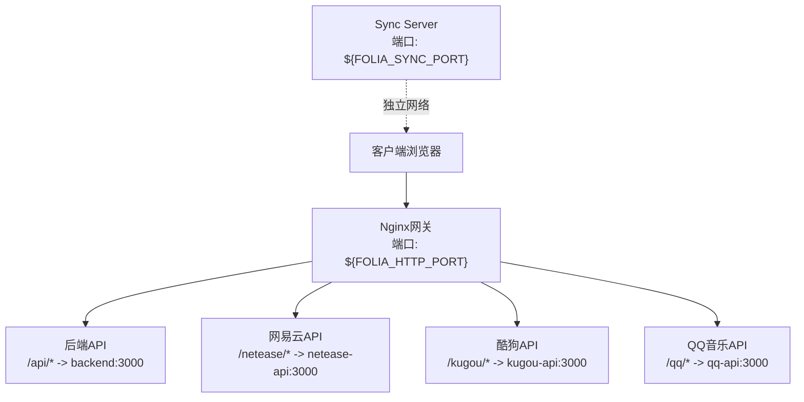
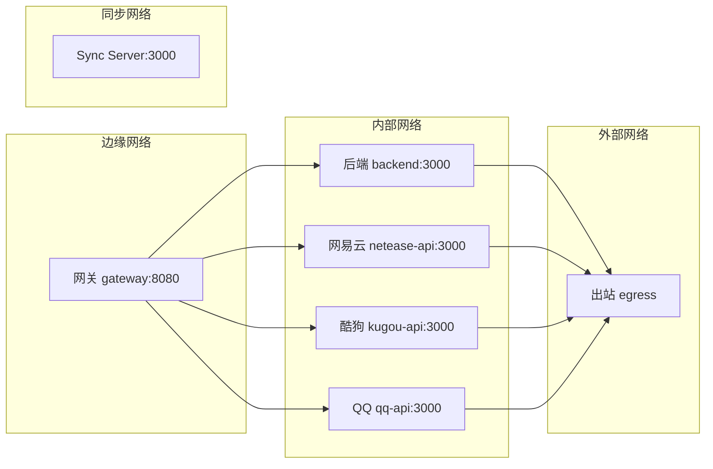
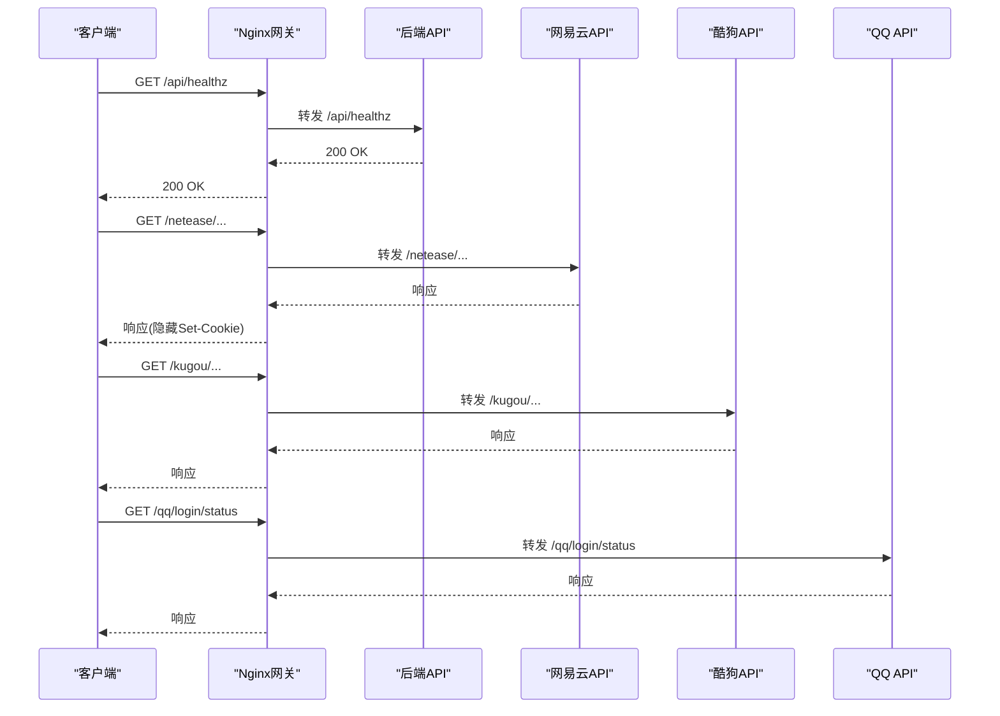
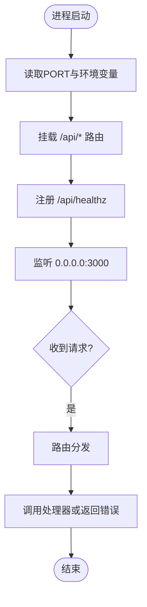
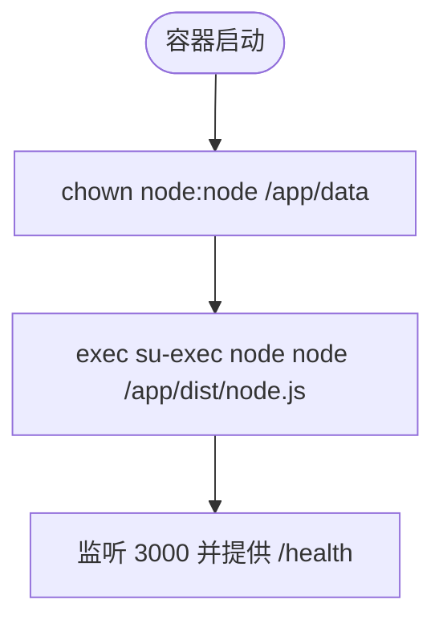
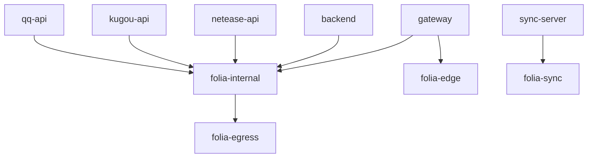

# Docker容器化部署

<cite>
**本文引用的文件**
- [deploy/docker/README.md](file://deploy/docker/README.md)
- [deploy/docker/compose.yaml](file://deploy/docker/compose.yaml)
- [deploy/docker/compose.build.yaml](file://deploy/docker/compose.build.yaml)
- [deploy/docker/compose.sync.yaml](file://deploy/docker/compose.sync.yaml)
- [deploy/docker/images/gateway.Dockerfile](file://deploy/docker/images/gateway.Dockerfile)
- [deploy/docker/images/backend.Dockerfile](file://deploy/docker/images/backend.Dockerfile)
- [deploy/docker/images/netease-api.Dockerfile](file://deploy/docker/images/netease-api.Dockerfile)
- [deploy/docker/images/kugou-api.Dockerfile](file://deploy/docker/images/kugou-api.Dockerfile)
- [deploy/docker/images/qq-api.Dockerfile](file://deploy/docker/images/qq-api.Dockerfile)
- [deploy/docker/images/sync-server.Dockerfile](file://deploy/docker/images/sync-server.Dockerfile)
- [deploy/docker/gateway/nginx.conf.template](file://deploy/docker/gateway/nginx.conf.template)
- [deploy/docker/gateway/entrypoint.sh](file://deploy/docker/gateway/entrypoint.sh)
- [deploy/docker/sync-server/entrypoint.sh](file://deploy/docker/sync-server/entrypoint.sh)
- [deploy/docker/scripts/smoke-test.sh](file://deploy/docker/scripts/smoke-test.sh)
- [deploy/docker/scripts/validate-version.sh](file://deploy/docker/scripts/validate-version.sh)
- [deploy/docker/backend/server.mjs](file://deploy/docker/backend/server.mjs)
</cite>

## 目录
1. [简介](#简介)
2. [项目结构](#项目结构)
3. [核心组件](#核心组件)
4. [架构总览](#架构总览)
5. [详细组件分析](#详细组件分析)
6. [依赖关系分析](#依赖关系分析)
7. [性能与生产优化](#性能与生产优化)
8. [故障排查指南](#故障排查指南)
9. [结论](#结论)
10. [附录](#附录)

## 简介
本指南面向Folia Player的Docker容器化部署，覆盖镜像构建、Compose编排、Nginx网关配置、服务间通信、完整部署流程以及生产环境优化建议。文档基于仓库中deploy/docker目录下的配置文件与脚本进行说明，确保可操作性和可追溯性。

## 项目结构
- 发布型Compose：compose.yaml定义Web网关、后端API、网易云/酷狗/QQ音乐接口、独立Sync Server及网络与卷。
- 本地构建叠加：compose.build.yaml将各服务切换为从源码构建镜像，便于开发与验证。
- 仅Sync Server：compose.sync.yaml用于单独运行同步服务。
- 镜像定义：images目录下包含gateway、backend、netease-api、kugou-api、qq-api、sync-server的Dockerfile。
- Nginx网关：gateway目录提供nginx模板与入口脚本，动态生成运行时配置并启动Nginx。
- 辅助脚本：scripts目录提供冒烟测试与版本校验脚本。

图表来源
- [deploy/docker/compose.yaml:4-163](file://deploy/docker/compose.yaml#L4-L163)
- [deploy/docker/gateway/nginx.conf.template:24-83](file://deploy/docker/gateway/nginx.conf.template#L24-L83)

章节来源
- [deploy/docker/README.md:1-63](file://deploy/docker/README.md#L1-L63)
- [deploy/docker/compose.yaml:1-179](file://deploy/docker/compose.yaml#L1-L179)

## 核心组件
- Web网关（Nginx）：对外暴露静态前端与反向代理；通过环境变量注入AI提供商；健康检查端点与健康探针。
- 后端API（Express）：提供主题生成、歌词代理等能力；健康检查端点/api/healthz。
- 在线音乐接口：网易云、酷狗、QQ音乐三个独立Node服务，分别处理对应平台请求。
- Sync Server：独立的同步服务，持久化SQLite数据库到数据卷，对外暴露健康端点。

章节来源
- [deploy/docker/images/gateway.Dockerfile:1-37](file://deploy/docker/images/gateway.Dockerfile#L1-L37)
- [deploy/docker/gateway/nginx.conf.template:24-83](file://deploy/docker/gateway/nginx.conf.template#L24-L83)
- [deploy/docker/images/backend.Dockerfile:1-28](file://deploy/docker/images/backend.Dockerfile#L1-L28)
- [deploy/docker/backend/server.mjs:1-31](file://deploy/docker/backend/server.mjs#L1-L31)
- [deploy/docker/images/netease-api.Dockerfile:1-18](file://deploy/docker/images/netease-api.Dockerfile#L1-L18)
- [deploy/docker/images/kugou-api.Dockerfile:1-17](file://deploy/docker/images/kugou-api.Dockerfile#L1-L17)
- [deploy/docker/images/qq-api.Dockerfile:1-19](file://deploy/docker/images/qq-api.Dockerfile#L1-L19)
- [deploy/docker/images/sync-server.Dockerfile:1-36](file://deploy/docker/images/sync-server.Dockerfile#L1-L36)

## 架构总览
系统由四层组成：
- 边缘层：Nginx网关，负责静态资源、路由转发、安全头与跨域相关头设置。
- 应用层：后端API与各音乐平台API服务，仅内部网络互通。
- 数据层：Sync Server使用SQLite持久化到数据卷；其他服务无状态或临时文件写入tmpfs。
- 网络层：多网络隔离，edge/egress/内部网络与独立sync网络，保证最小权限访问。

图表来源
- [deploy/docker/compose.yaml:30-163](file://deploy/docker/compose.yaml#L30-L163)
- [deploy/docker/gateway/nginx.conf.template:42-79](file://deploy/docker/gateway/nginx.conf.template#L42-L79)

## 详细组件分析

### Nginx网关
- 构建阶段：使用Node镜像构建前端静态资源，拷贝至Nginx根目录；安装gettext以支持envsubst。
- 运行阶段：入口脚本校验并标准化AI提供商，将模板渲染为/tmp/nginx.conf后启动Nginx。
- 路由策略：
  - /healthz：网关健康检查。
  - /runtime-config.js：动态输出AI提供商配置给前端。
  - /netease/*、/kugou/*、/qq/*：反向代理到对应服务，隐藏Set-Cookie并传递Host/X-Forwarded-*。
  - /api/*：反向代理到后端API。
  - /：SPA回退到index.html。

图表来源
- [deploy/docker/gateway/nginx.conf.template:24-83](file://deploy/docker/gateway/nginx.conf.template#L24-L83)
- [deploy/docker/gateway/entrypoint.sh:1-21](file://deploy/docker/gateway/entrypoint.sh#L1-L21)

章节来源
- [deploy/docker/images/gateway.Dockerfile:1-37](file://deploy/docker/images/gateway.Dockerfile#L1-L37)
- [deploy/docker/gateway/nginx.conf.template:1-86](file://deploy/docker/gateway/nginx.conf.template#L1-L86)
- [deploy/docker/gateway/entrypoint.sh:1-21](file://deploy/docker/gateway/entrypoint.sh#L1-L21)

### 后端API服务
- 构建阶段：在builder阶段安装依赖并构建Vercel风格处理器，runner阶段仅安装生产依赖并复制产物。
- 运行阶段：Express监听3000端口，挂载/api路由，提供健康检查与错误处理中间件。

图表来源
- [deploy/docker/backend/server.mjs:8-31](file://deploy/docker/backend/server.mjs#L8-L31)

章节来源
- [deploy/docker/images/backend.Dockerfile:1-28](file://deploy/docker/images/backend.Dockerfile#L1-L28)
- [deploy/docker/backend/server.mjs:1-31](file://deploy/docker/backend/server.mjs#L1-L31)

### 在线音乐接口（网易云/酷狗/QQ）
- 网易云/酷狗：基于第三方包，构建时执行补丁脚本以控制客户端IP转发行为；默认不转发浏览器IP，避免登录地点泄露。
- QQ音乐：提供扫码与微信登录态管理，设备上下文持久化到具名卷；支持可选的加密会话存储。

章节来源
- [deploy/docker/images/netease-api.Dockerfile:1-18](file://deploy/docker/images/netease-api.Dockerfile#L1-L18)
- [deploy/docker/images/kugou-api.Dockerfile:1-17](file://deploy/docker/images/kugou-api.Dockerfile#L1-L17)
- [deploy/docker/images/qq-api.Dockerfile:1-19](file://deploy/docker/images/qq-api.Dockerfile#L1-L19)
- [deploy/docker/README.md:89-103](file://deploy/docker/README.md#L89-L103)

### Sync Server
- 构建阶段：安装编译依赖，构建TypeScript产物，清理构建工具链以减少镜像体积。
- 运行阶段：入口脚本准备数据目录权限并以非root用户运行；数据持久化到/app/data。

图表来源
- [deploy/docker/sync-server/entrypoint.sh:1-7](file://deploy/docker/sync-server/entrypoint.sh#L1-L7)
- [deploy/docker/images/sync-server.Dockerfile:14-36](file://deploy/docker/images/sync-server.Dockerfile#L14-L36)

章节来源
- [deploy/docker/images/sync-server.Dockerfile:1-36](file://deploy/docker/images/sync-server.Dockerfile#L1-L36)
- [deploy/docker/sync-server/entrypoint.sh:1-7](file://deploy/docker/sync-server/entrypoint.sh#L1-L7)

## 依赖关系分析
- 服务依赖：
  - gateway依赖backend、netease-api、kugou-api、qq-api的健康状态。
  - 各API服务通过内部网络互访，不直接暴露宿主机端口。
  - sync-server独立网络，不与Web内部网络互通。
- 网络划分：
  - folia-edge：网关对外暴露的网络。
  - folia-internal：内部服务通信网络，设为internal禁止出站。
  - folia-egress：允许出站访问上游平台的网络。
  - folia-sync：sync-server独立网络。
- 卷与数据：
  - qq-api-state：持久化QQ设备上下文。
  - FOLIA_SYNC_DATA_DIR：持久化SQLite数据库。

图表来源
- [deploy/docker/compose.yaml:30-179](file://deploy/docker/compose.yaml#L30-L179)

章节来源
- [deploy/docker/compose.yaml:1-179](file://deploy/docker/compose.yaml#L1-L179)

## 性能与生产优化
- 只读文件系统：所有服务启用read_only:true，减少写攻击面。
- 临时目录：使用tmpfs挂载/tmp与必要缓存目录，避免持久化脏数据。
- 健康检查：每个服务均配置healthcheck，保障编排稳定性。
- 最小权限：security_opt禁用新增特权；非root用户运行。
- 资源限制：建议在编排层增加CPU/内存限制（例如cpus、mem_limit），根据实际负载调整。
- 自动重启：restart: unless-stopped保证异常退出后自动恢复。
- HTTPS与安全上下文：推荐在NAS宿主机或前置反向代理终止TLS，并正确传递X-Forwarded-*头；浏览器安全上下文对PWA、文件系统访问、音频设备枚举等有影响。
- 日志与监控：Nginx访问日志输出到stdout/stderr；可通过容器日志收集系统进行集中管理。

章节来源
- [deploy/docker/compose.yaml:6-163](file://deploy/docker/compose.yaml#L6-L163)
- [deploy/docker/README.md:105-137](file://deploy/docker/README.md#L105-L137)

## 故障排查指南
- 快速验证：
  - 使用冒烟测试脚本启动本地构建堆栈并检查公开入口与网络隔离。
  - 检查健康端点：/healthz、/api/healthz、/runtime-config.js、/netease/、/kugou/、/qq/login/status、/health。
- 常见问题：
  - 未设置SYNC_TOKEN或FOLIA_IMAGE_NAMESPACE会导致启动失败。
  - QQ音乐设备状态卷损坏需删除后重建。
  - HTTP下部分浏览器能力不可用，应改用HTTPS。
- 诊断命令：
  - docker compose ps/logs查看服务状态与日志。
  - curl探测健康端点确认服务可用性。
  - 检查容器网络绑定，确保内部服务未意外暴露宿主机端口。

章节来源
- [deploy/docker/scripts/smoke-test.sh:1-57](file://deploy/docker/scripts/smoke-test.sh#L1-L57)
- [deploy/docker/README.md:46-63](file://deploy/docker/README.md#L46-L63)
- [deploy/docker/README.md:139-167](file://deploy/docker/README.md#L139-L167)

## 结论
该容器化方案通过多网络隔离、只读文件系统、健康检查与最小权限原则，提供了稳定、安全的Folia Player部署基线。Nginx网关统一对外暴露，内部服务通过Docker网络通信；Sync Server独立部署便于扩展与维护。结合前置反向代理与HTTPS，可满足生产环境的可用性与安全性要求。

## 附录

### 环境变量与配置要点
- FOLIA_IMAGE_NAMESPACE：镜像命名空间，必填。
- FOLIA_STACK_VERSION/FOLIA_SYNC_VERSION：镜像版本标签。
- FOLIA_HTTP_BIND/FOLIA_HTTP_PORT：网关监听地址与端口。
- FOLIA_AI_PROVIDER：AI提供商（google/gemini/openai）。
- FOLIA_FORWARD_CLIENT_IP：是否转发客户端IP到上游音乐平台。
- ENABLE_GENERAL_UNBLOCK：网易云通用解锁开关。
- QQ_AUTH_SESSION_PATH/QQ_SESSION_SECRET：可选的加密会话存储路径与密钥。
- FOLIA_SYNC_BIND/FOLIA_SYNC_PORT：Sync Server监听地址与端口。
- FOLIA_SYNC_DATA_DIR：SQLite数据目录。
- SYNC_TOKEN：Sync客户端认证令牌，至少八位。
- DASHBOARD_TOKEN：Sync Server看板访问令牌。

章节来源
- [deploy/docker/README.md:64-88](file://deploy/docker/README.md#L64-L88)
- [deploy/docker/compose.yaml:8-163](file://deploy/docker/compose.yaml#L8-L163)

### 完整部署流程
- 准备.env文件，填写必要环境变量（如FOLIA_IMAGE_NAMESPACE、SYNC_TOKEN）。
- 拉取镜像并启动：docker compose pull && docker compose up -d --wait。
- 验证服务：访问网关与Sync Server健康端点。
- 更新与回滚：修改.env中的版本标签，重新pull并up。
- 备份数据：停止Sync Server后打包数据目录。

章节来源
- [deploy/docker/README.md:7-63](file://deploy/docker/README.md#L7-L63)
- [deploy/docker/README.md:139-167](file://deploy/docker/README.md#L139-L167)

### 扩展与定制
- 替换镜像源：修改FOLIA_IMAGE_NAMESPACE指向私有仓库。
- 自定义网关：编辑nginx.conf.template添加新路由或安全策略。
- 扩展API：在backend中新增Express路由并在网关中配置转发。
- 独立Sync Server：使用compose.sync.yaml单独部署与调试。
- 本地开发：叠加compose.build.yaml构建本地镜像并进行冒烟测试。

章节来源
- [deploy/docker/compose.build.yaml:1-40](file://deploy/docker/compose.build.yaml#L1-L40)
- [deploy/docker/compose.sync.yaml:1-31](file://deploy/docker/compose.sync.yaml#L1-L31)
- [deploy/docker/gateway/nginx.conf.template:24-83](file://deploy/docker/gateway/nginx.conf.template#L24-L83)