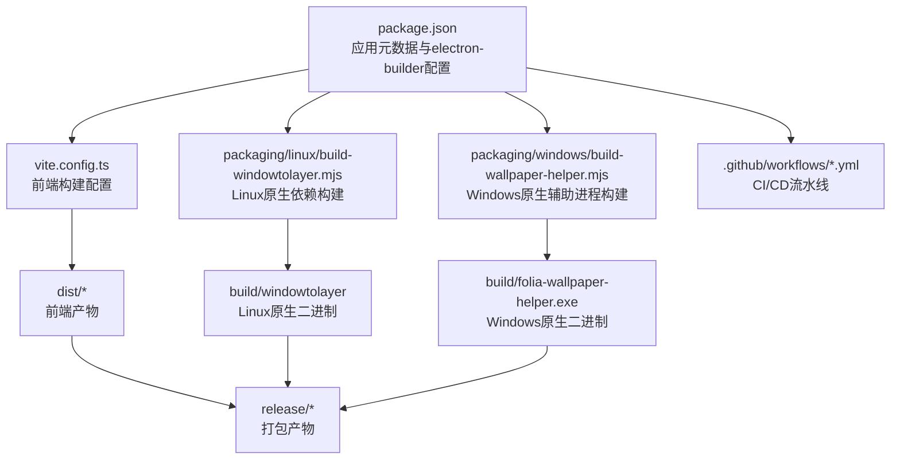
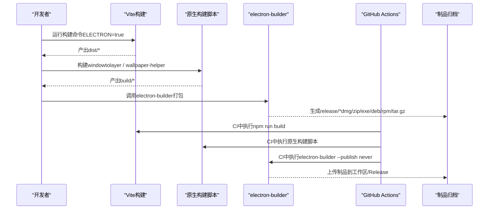
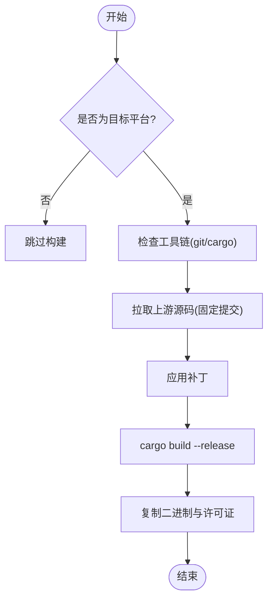
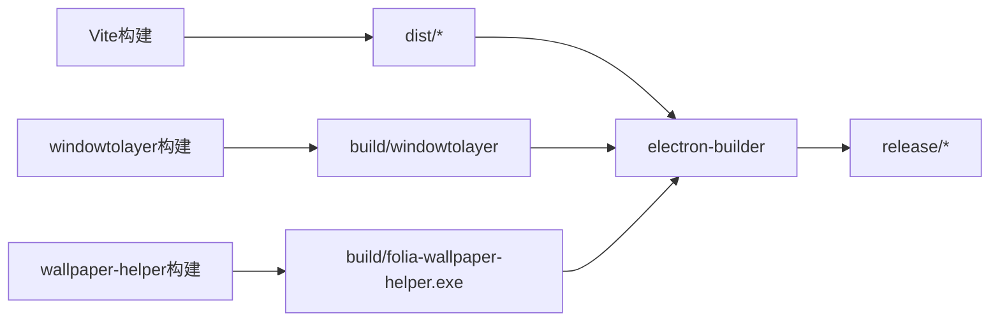

# Electron应用打包

<cite>
**本文引用的文件**
- [package.json](file://package.json)
- [build-electron.cjs](file://build-electron.cjs)
- [vite.config.ts](file://vite.config.ts)
- [packaging/linux/build-windowtolayer.mjs](file://packaging/linux/build-windowtolayer.mjs)
- [packaging/windows/build-wallpaper-helper.mjs](file://packaging/windows/build-wallpaper-helper.mjs)
- [packaging/windows/wallpaper-helper/Cargo.toml](file://packaging/windows/wallpaper-helper/Cargo.toml)
- [electron/wallpaperWatchdog.cjs](file://electron/wallpaperWatchdog.cjs)
- [.github/workflows/electron-release.yml](file:.github/workflows/electron-release.yml)
- [.github/workflows/canary-pre-release.yml](file:.github/workflows/canary-pre-release.yml)
</cite>

## 目录
1. [简介](#简介)
2. [项目结构](#项目结构)
3. [核心组件](#核心组件)
4. [架构总览](#架构总览)
5. [详细组件分析](#详细组件分析)
6. [依赖关系分析](#依赖关系分析)
7. [性能考量](#性能考量)
8. [故障排查指南](#故障排查指南)
9. [结论](#结论)
10. [附录](#附录)

## 简介
本文件面向Folia Player的Electron桌面端打包与发布，聚焦于electron-builder配置、多平台构建流程、原生模块（windowtolayer与wallpaper-helper）编译与打包、签名与认证、构建脚本与环境变量、以及跨平台注意事项与常见问题。文档基于仓库中的实际配置与脚本进行说明，确保可操作性和可追溯性。

## 项目结构
本项目采用Vite构建前端资源，使用electron-builder进行桌面端打包。关键目录与职责：
- packaging/linux: Linux平台原生依赖windowtolayer的构建脚本与补丁
- packaging/windows: Windows平台原生辅助进程wallpaper-helper的Rust源码与构建脚本
- electron: Electron主进程与相关逻辑（包含壁纸模式看门狗等）
- .github/workflows: CI/CD流水线，负责多平台构建与发布
- package.json: 定义应用元数据、electron-builder配置、构建脚本与产物输出路径

图表来源
- [package.json:52-179](file://package.json#L52-L179)
- [vite.config.ts:193-214](file://vite.config.ts#L193-L214)
- [packaging/linux/build-windowtolayer.mjs:15-95](file://packaging/linux/build-windowtolayer.mjs#L15-L95)
- [packaging/windows/build-wallpaper-helper.mjs:16-33](file://packaging/windows/build-wallpaper-helper.mjs#L16-L33)
- [.github/workflows/electron-release.yml:110-223](file:.github/workflows/electron-release.yml#L110-L223)

章节来源
- [package.json:1-256](file://package.json#L1-L256)
- [vite.config.ts:1-276](file://vite.config.ts#L1-L276)

## 核心组件
- 应用标识与名称
  - appId: top.izuna.foliamajor
  - productName: Folia
  - 这些值用于生成安装包与应用标识，影响更新通道与系统注册表/包管理器集成。
- 图标与额外资源
  - 通过extraResources将图标、托盘模板、Linux桌面入口与README等复制到应用包内，供运行时加载。
- 文件过滤与asar
  - files指定打包范围；asarUnpack保留特定文件不被压缩，便于外部工具或脚本直接访问。
- 多平台目标
  - macOS: dmg与zip，支持x64与arm64
  - Windows: nsis安装包与portable便携版，仅x64
  - Linux: tar.gz、deb、rpm，并设置类别与可执行名
- 更新与发布
  - publish配置GitHub作为更新源；generateUpdatesFilesForAllChannels开启全通道更新文件生成

章节来源
- [package.json:52-179](file://package.json#L52-L179)

## 架构总览
下图展示从开发到打包发布的整体流程，包括前端构建、原生模块构建、electron-builder打包与CI流水线协作。

图表来源
- [vite.config.ts:193-214](file://vite.config.ts#L193-L214)
- [packaging/linux/build-windowtolayer.mjs:53-95](file://packaging/linux/build-windowtolayer.mjs#L53-L95)
- [packaging/windows/build-wallpaper-helper.mjs:25-33](file://packaging/windows/build-wallpaper-helper.mjs#L25-L33)
- [.github/workflows/electron-release.yml:194-223](file:.github/workflows/electron-release.yml#L194-L223)

## 详细组件分析

### electron-builder配置详解
- 应用标识与名称
  - appId与productName在package.json中定义，影响安装器标题、更新通道识别与系统级标识。
- 输出目录
  - directories.output设置为release，所有打包产物统一输出至该目录。
- 文件过滤
  - files包含dist、electron、shared、package.json及必要的构建资源（如miao.png、thumbar/*.png）。
- asarUnpack
  - 将htdemucs_runner.py排除出asar压缩，便于Python脚本在运行时以文件系统方式访问。
- extraResources
  - 将图标、托盘模板、Linux桌面入口与README等复制到应用包内；同时复制windowtolayer与COPYING文件。
- 平台特定配置
  - macOS: 目标dmg与zip，双架构x64/arm64，artifactName包含版本与架构信息
  - Windows: 目标nsis与portable，仅x64；额外资源包含folia-wallpaper-helper.exe
  - Linux: 目标tar.gz、deb、rpm；设置category为AudioVideo，executableName为folia-major
- 更新与发布
  - publish配置GitHub仓库；generateUpdatesFilesForAllChannels启用全通道更新文件生成

章节来源
- [package.json:52-179](file://package.json#L52-L179)

### 多平台构建流程
- Windows
  - 构建wallpaper-helper（Rust），输出至build/folia-wallpaper-helper.exe
  - 通过NSIS生成安装包，允许自定义安装目录；同时生成便携版
  - 额外资源中包含wallpaper-helper.exe，供主进程在壁纸模式下启动
- macOS
  - 构建dmg与zip，支持x64与arm64；artifactName包含版本与架构
  - 当前未配置代码签名与公证，需在本地或CI中配置CSC_*环境变量以启用签名
- Linux
  - 构建windowtolayer（Rust），拉取上游固定版本并应用补丁，输出至build/windowtolayer
  - 生成tar.gz、deb、rpm；设置可执行名与类别；提供desktop入口与README

章节来源
- [packaging/windows/build-wallpaper-helper.mjs:16-33](file://packaging/windows/build-wallpaper-helper.mjs#L16-L33)
- [packaging/linux/build-windowtolayer.mjs:15-95](file://packaging/linux/build-windowtolayer.mjs#L15-L95)
- [package.json:111-179](file://package.json#L111-L179)

### 原生模块编译与打包
- windowtolayer（Linux）
  - 脚本会检查git与cargo工具链，拉取上游固定提交，应用两个补丁，构建release二进制，并复制COPYING文件
  - 非Linux主机跳过构建；可通过--force强制重建
  - 产物被extraResources纳入打包，并在运行时由主进程解析路径
- wallpaper-helper（Windows）
  - Rust crate在Windows上构建release，启用strip、lto与单codegen单元优化体积与性能
  - 产物被win.extraResources纳入打包，供主进程在壁纸模式下启动
  - 非Windows主机跳过构建，避免在非目标平台引入不必要的工具链依赖

图表来源
- [packaging/linux/build-windowtolayer.mjs:53-95](file://packaging/linux/build-windowtolayer.mjs#L53-L95)
- [packaging/windows/wallpaper-helper/Cargo.toml:22-26](file://packaging/windows/wallpaper-helper/Cargo.toml#L22-L26)

章节来源
- [packaging/linux/build-windowtolayer.mjs:1-95](file://packaging/linux/build-windowtolayer.mjs#L1-L95)
- [packaging/windows/build-wallpaper-helper.mjs:1-34](file://packaging/windows/build-wallpaper-helper.mjs#L1-L34)
- [packaging/windows/wallpaper-helper/Cargo.toml:1-26](file://packaging/windows/wallpaper-helper/Cargo.toml#L1-L26)

### 签名与认证配置
- 当前CI与本地构建默认禁用自动签名
  - build-electron.cjs设置CSC_IDENTITY_AUTO_DISCOVERY=false，并显式关闭signExecutable
  - CI流水线也设置CSC_IDENTITY_AUTO_DISCOVERY=false
- 如需启用签名与公证（macOS）
  - 在CI或本地环境中配置CSC_LINK、CSC_KEY_PASSWORD、CSC_IDENTITY等环境变量
  - macOS目标需配置entitlements与provisioning profile（若需要）
  - 公证流程通常通过notarytool或xcrun altool完成，可在CI步骤中追加
- Windows签名
  - 可配置signCode与证书路径，或在NSIS中启用签名；当前未启用

章节来源
- [build-electron.cjs:1-27](file://build-electron.cjs#L1-L27)
- [.github/workflows/electron-release.yml:201-204](file:.github/workflows/electron-release.yml#L201-L204)
- [.github/workflows/canary-pre-release.yml:118-121](file:.github/workflows/canary-pre-release.yml#L118-L121)

### 构建脚本使用方法
- 常用脚本
  - npm run build:electron:dir: 仅打包Linux dir格式，便于快速验证
  - npm run build:electron: 完整构建前端、原生模块并打包所有平台
  - npm run build:windowtolayer: 单独构建Linux原生依赖
  - npm run build:wallpaper-helper: 单独构建Windows原生辅助进程
- 环境变量
  - ELECTRON=true: 指示Vite按Electron模式构建（base路径调整）
  - ELECTRON_DEV: 控制开发模式行为
  - FOLIA_WINDOWTOLAYER_PATH: 开发时覆盖windowtolayer路径
  - FOLIA_WALLPAPER_HELPER_PATH: 开发时覆盖wallpaper-helper路径
  - CSC_IDENTITY_AUTO_DISCOVERY: 控制代码签名自动发现
- 错误排查
  - 缺少工具链（git/cargo）会导致原生构建失败
  - 非目标平台构建会被跳过，确认当前平台与目标匹配
  - 端口占用或watcher干扰可能导致打包失败（Vite忽略release与models目录以避免此问题）

章节来源
- [package.json:17-50](file://package.json#L17-L50)
- [vite.config.ts:215-225](file://vite.config.ts#L215-L225)
- [electron/wallpaperWatchdog.cjs:12-31](file://electron/wallpaperWatchdog.cjs#L12-L31)

### 跨平台构建注意事项
- Linux
  - 需要Rust工具链与git；上游源码固定提交，补丁必须可应用
  - 图形后端可通过ELECTRON_LINUX_PACKAGED_GRAPHICS与FOLIA_LINUX_GRAPHICS_MODE切换
- Windows
  - 需要Rust工具链；仅在Windows主机构建wallpaper-helper
  - NSIS安装包允许自定义安装目录；便携版适合无管理员权限场景
- macOS
  - 双架构构建；如需签名与公证，需配置相应证书与工具
  - 未签名应用在首次打开可能被系统阻止，需提供用户引导

章节来源
- [packaging/linux/build-windowtolayer.mjs:44-65](file://packaging/linux/build-windowtolayer.mjs#L44-L65)
- [packaging/windows/build-wallpaper-helper.mjs:25-33](file://packaging/windows/build-wallpaper-helper.mjs#L25-L33)
- [package.json:111-179](file://package.json#L111-L179)

## 依赖关系分析
- 前端构建依赖Vite与React插件，产物输出至dist
- 原生模块依赖Rust工具链，分别针对Linux与Windows构建
- electron-builder依赖上述产物与配置，生成各平台安装包
- CI流水线协调Node.js、Rust工具链缓存与打包步骤

图表来源
- [vite.config.ts:193-214](file://vite.config.ts#L193-L214)
- [packaging/linux/build-windowtolayer.mjs:53-95](file://packaging/linux/build-windowtolayer.mjs#L53-L95)
- [packaging/windows/build-wallpaper-helper.mjs:25-33](file://packaging/windows/build-wallpaper-helper.mjs#L25-L33)
- [package.json:52-179](file://package.json#L52-L179)

章节来源
- [package.json:52-179](file://package.json#L52-L179)
- [.github/workflows/electron-release.yml:120-165](file:.github/workflows/electron-release.yml#L120-L165)

## 性能考量
- 前端构建
  - three.js被拆分为独立chunk，避免主包过大影响PWA预缓存大小限制
  - Vite忽略release与models目录，防止watcher导致打包失败
- 原生构建
  - Rust release配置启用strip、lto与单codegen单元，减小体积并提升性能
- 打包产物
  - asarUnpack保留Python脚本，避免压缩导致的运行时访问问题
  - extraResources按需复制必要资源，减少不必要文件体积

章节来源
- [vite.config.ts:206-214](file://vite.config.ts#L206-L214)
- [vite.config.ts:215-225](file://vite.config.ts#L215-L225)
- [packaging/windows/wallpaper-helper/Cargo.toml:22-26](file://packaging/windows/wallpaper-helper/Cargo.toml#L22-L26)
- [package.json:74-110](file://package.json#L74-L110)

## 故障排查指南
- 原生构建失败
  - 检查是否安装了git与cargo；Linux构建需要Rust工具链
  - 确认上游提交与补丁可应用；若漂移会导致git apply失败
- 打包失败
  - 确认端口未被占用；Vite忽略release与models目录以避免EPERM错误
  - 检查环境变量是否正确设置（ELECTRON、ELECTRON_DEV、FOLIA_*_PATH）
- 签名与公证
  - 若需启用签名，配置CSC_*环境变量；macOS需准备证书与工具
  - CI中默认禁用自动签名，避免泄露私钥
- 运行时问题
  - 壁纸模式依赖windowtolayer或wallpaper-helper；确认二进制存在且路径正确
  - 看门狗逻辑会在主进程退出时恢复窗口状态，避免异常循环

章节来源
- [packaging/linux/build-windowtolayer.mjs:44-65](file://packaging/linux/build-windowtolayer.mjs#L44-L65)
- [vite.config.ts:215-225](file://vite.config.ts#L215-L225)
- [electron/wallpaperWatchdog.cjs:12-31](file://electron/wallpaperWatchdog.cjs#L12-L31)
- [build-electron.cjs:1-27](file://build-electron.cjs#L1-L27)

## 结论
本项目通过Vite与electron-builder实现了跨平台桌面应用的构建与打包，结合原生模块（windowtolayer与wallpaper-helper）扩展了壁纸模式能力。CI流水线自动化了多平台构建与发布流程，当前默认禁用签名以提升安全性与可移植性。开发者可根据需求启用签名与公证，并依据环境变量与脚本灵活调整构建行为。

## 附录
- 常用命令参考
  - 构建前端与打包: npm run build:electron
  - 仅Linux dir打包: npm run build:electron:dir
  - 构建原生模块: npm run build:windowtolayer / npm run build:wallpaper-helper
- 环境变量参考
  - ELECTRON: 控制Vite构建模式
  - ELECTRON_DEV: 控制开发模式行为
  - FOLIA_WINDOWTOLAYER_PATH: 开发时覆盖windowtolayer路径
  - FOLIA_WALLPAPER_HELPER_PATH: 开发时覆盖wallpaper-helper路径
  - CSC_IDENTITY_AUTO_DISCOVERY: 控制代码签名自动发现

章节来源
- [package.json:17-50](file://package.json#L17-L50)
- [vite.config.ts:193-214](file://vite.config.ts#L193-L214)
- [electron/wallpaperWatchdog.cjs:12-31](file://electron/wallpaperWatchdog.cjs#L12-L31)