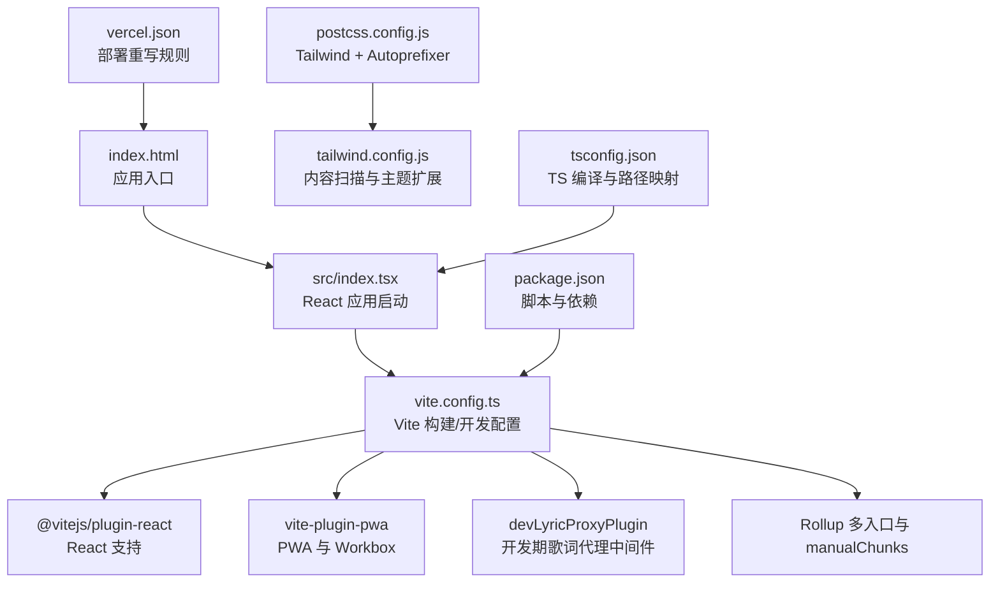
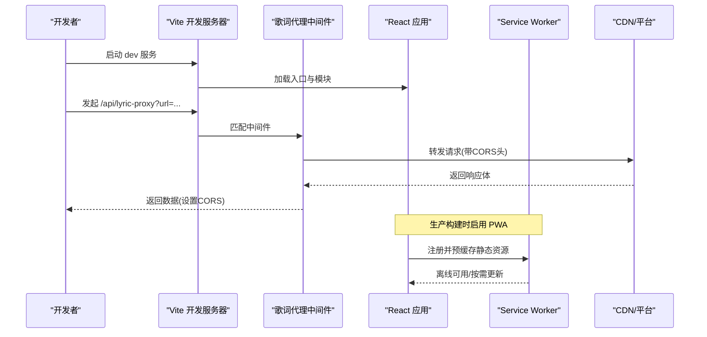
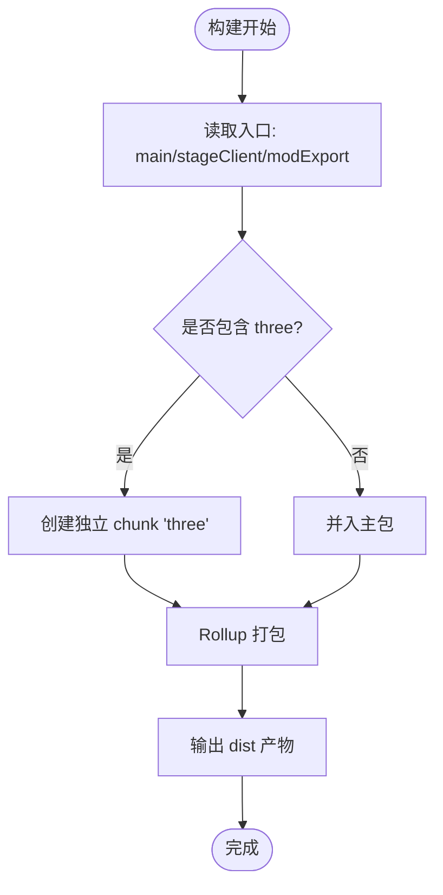
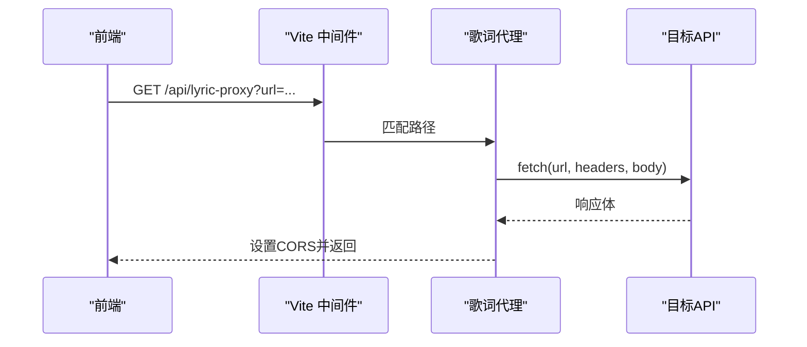
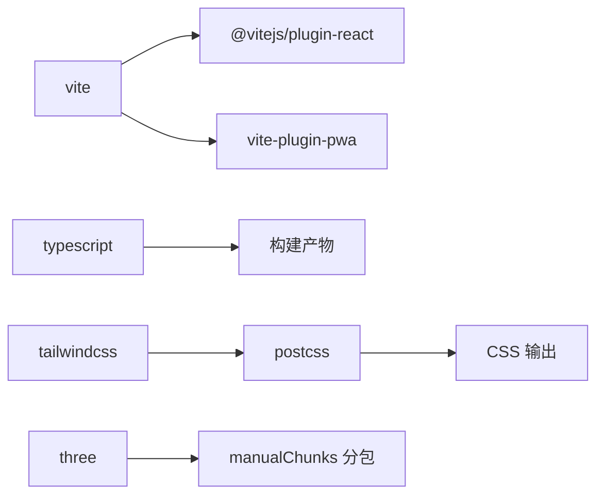

# Web版本构建

<cite>
**本文引用的文件**
- [vite.config.ts](file://vite.config.ts)
- [package.json](file://package.json)
- [tsconfig.json](file://tsconfig.json)
- [postcss.config.js](file://postcss.config.js)
- [tailwind.config.js](file://tailwind.config.js)
- [index.html](file://index.html)
- [vercel.json](file://vercel.json)
- [vitest.config.ts](file://vitest.config.ts)
- [playwright.config.ts](file://playwright.config.ts)
</cite>

## 目录
1. [简介](#简介)
2. [项目结构](#项目结构)
3. [核心组件](#核心组件)
4. [架构总览](#架构总览)
5. [详细组件分析](#详细组件分析)
6. [依赖分析](#依赖分析)
7. [性能考虑](#性能考虑)
8. [故障排查指南](#故障排查指南)
9. [结论](#结论)
10. [附录](#附录)

## 简介
本文件面向 Folia Player Web 版本的构建与发布，系统性说明基于 Vite 的构建配置、TypeScript 编译策略、CSS 处理流程（PostCSS + Tailwind CSS）、资源优化与缓存策略，以及常用构建脚本与自定义选项。同时给出懒加载、预加载、代码分割等性能优化建议，帮助在开发与生产环境获得稳定、高效的构建体验。

## 项目结构
Web 前端以 Vite 为核心构建工具，入口 HTML 位于根目录，通过 importmap 引入部分运行时依赖；Vite 插件链包含 React 支持与 PWA 能力；样式由 Tailwind CSS 驱动并通过 PostCSS 管线处理；TypeScript 使用 bundler 模块解析并启用严格模式；测试与 UI 自动化分别由 Vitest 与 Playwright 管理。

图表来源
- [vite.config.ts:139-275](file://vite.config.ts#L139-L275)
- [postcss.config.js:1-7](file://postcss.config.js#L1-L7)
- [tailwind.config.js:1-14](file://tailwind.config.js#L1-L14)
- [tsconfig.json:1-38](file://tsconfig.json#L1-L38)
- [package.json:17-50](file://package.json#L17-L50)
- [vercel.json:1-6](file://vercel.json#L1-L6)

章节来源
- [vite.config.ts:139-275](file://vite.config.ts#L139-L275)
- [package.json:17-50](file://package.json#L17-L50)

## 核心组件
- 构建与开发服务器：Vite 提供热更新、HMR、开发代理与多入口打包；通过环境变量切换 base 路径以适配 Electron 与 Web 部署。
- PWA：集成 vite-plugin-pwa，生成 Service Worker 与 Manifest，配置 precache 大小限制、忽略动态文件与 API 路由回退白名单。
- TypeScript：采用 ESNext 目标与 bundler 模块解析，启用严格类型检查与路径别名 @/*。
- CSS 处理：Tailwind CSS v4 通过 @tailwindcss/postcss 接入，Autoprefixer 自动补全；全局样式在 index.css 中导入 Tailwind。
- 多入口与分包：构建输出 main、stageClient、modExport 三个入口；将大型依赖 three 单独拆分以避免超出 PWA 单文件缓存限制。
- 环境变量注入：通过 define 注入提交哈希、分支、应用版本、发行渠道与 Docker 堆栈版本等信息。
- 测试与自动化：Vitest 用于单元测试，Playwright 用于 UI 截图测试，统一端口与浏览器参数。

章节来源
- [vite.config.ts:193-275](file://vite.config.ts#L193-L275)
- [postcss.config.js:1-7](file://postcss.config.js#L1-L7)
- [tailwind.config.js:1-14](file://tailwind.config.js#L1-L14)
- [tsconfig.json:1-38](file://tsconfig.json#L1-L38)
- [package.json:17-50](file://package.json#L17-L50)

## 架构总览
下图展示了从源码到产物再到部署的关键链路，包括开发期代理、PWA 缓存策略与多入口构建。

图表来源
- [vite.config.ts:68-137](file://vite.config.ts#L68-L137)
- [vite.config.ts:230-259](file://vite.config.ts#L230-L259)
- [index.html:16-31](file://index.html#L16-L31)

## 详细组件分析

### Vite 构建与开发服务器
- 多入口：main、stageClient、modExport，便于独立页面与导出功能打包。
- 手动分包：将 three 拆为独立 chunk，避免超过 PWA 单文件缓存上限。
- 开发服务器：监听 3000 端口，绑定 0.0.0.0；忽略 release 与 models 目录以避免文件句柄冲突影响 Electron 打包。
- 环境变量注入：__COMMIT_HASH__、__GIT_BRANCH__、__APP_VERSION__、__APP_VERSION_LABEL__、__APP_RELEASE_CHANNEL__、__DOCKER_STACK_VERSION__。
- 路径别名：@ 指向 src，简化导入。
- base 切换：Electron 环境下使用相对路径，Web 环境使用根路径。

图表来源
- [vite.config.ts:198-213](file://vite.config.ts#L198-L213)

章节来源
- [vite.config.ts:193-275](file://vite.config.ts#L193-L275)

### PWA 与缓存策略
- 自动更新：registerType 设置为 autoUpdate，提升用户体验。
- 资源包含：icon.svg 纳入静态资源。
- Workbox 配置：
  - maximumFileSizeToCacheInBytes 限制单文件大小，确保可被预缓存。
  - globIgnores 排除 runtime-config.js，避免动态配置被缓存。
  - navigateFallbackDenylist 排除 /api 路由，保证导航命中平台路由而非 SPA shell。
- Manifest：定义名称、主题色、背景色、显示模式与图标。

章节来源
- [vite.config.ts:230-259](file://vite.config.ts#L230-L259)

### 开发期歌词代理中间件
- 触发路径：/api/lyric-proxy，仅 serve 阶段生效。
- CORS：设置允许的来源、方法与头部，兼容跨域需求。
- 域名白名单：仅允许 qq.com、y.gtimg.cn、kugou.com、kgimg.com、amll-ttml-db.stevexmh.net。
- 请求转发：保留除 host/connection/content-length/origin/referer 外的请求头；POST/PUT/PATCH 携带 body。
- 特殊处理：对 amll-ttml-db.stevexmh.net 的 404 返回 204 空响应。
- 错误处理：捕获异常并返回 JSON 错误信息。

图表来源
- [vite.config.ts:68-137](file://vite.config.ts#L68-L137)

章节来源
- [vite.config.ts:68-137](file://vite.config.ts#L68-L137)

### TypeScript 编译配置
- 目标与库：ES2022 目标，DOM/DOM.Iterable 类型支持。
- 模块系统：ESNext 模块，bundler 解析模式，适合现代构建器。
- 严格模式：strict 开启，isolatedModules 与 moduleDetection force 提高一致性。
- JSX：react-jsx，配合 Vite React 插件。
- 路径映射：@/* -> ./src/*，与 Vite resolve.alias 保持一致。
- 不输出：noEmit true，仅做类型检查，构建由 Vite 负责。

章节来源
- [tsconfig.json:1-38](file://tsconfig.json#L1-L38)

### CSS 处理流程（PostCSS + Tailwind）
- 入口样式：index.css 通过 @import "tailwindcss" 引入 Tailwind v4。
- PostCSS 插件：@tailwindcss/postcss 与 autoprefixer。
- Tailwind 内容扫描：覆盖 index.html 与 src、api 下的 JS/TS/JSX/TSX，确保只生成使用的类名。
- 全局样式：字体、滚动条、动画、主题变量等在 index.css 中定义。

章节来源
- [postcss.config.js:1-7](file://postcss.config.js#L1-L7)
- [tailwind.config.js:1-14](file://tailwind.config.js#L1-L14)
- [index.css:1-217](file://index.css#L1-L217)

### 资源优化与缓存
- 图片与图标：icon.svg 作为 PWA 图标与 favicon，可通过构建工具或外部工具进行压缩与多尺寸生成（当前未内置压缩步骤）。
- 字体：使用 woff2 格式并通过 CDN 加载，font-display: swap 改善首屏体验。
- 静态资源缓存：
  - PWA 预缓存静态资源，受 maximumFileSizeToCacheInBytes 限制。
  - 动态配置 runtime-config.js 被忽略预缓存，避免过期。
  - API 路由不被 SPA shell 拦截，确保后端路由正确。
- 分包与体积控制：three 独立分包，降低主包体积与缓存压力。

章节来源
- [vite.config.ts:206-213](file://vite.config.ts#L206-L213)
- [vite.config.ts:230-259](file://vite.config.ts#L230-L259)
- [index.html:16-31](file://index.html#L16-L31)

### 构建脚本与自定义选项
- 常用脚本：
  - npm run dev：启动开发服务器。
  - npm run build：先构建 api-ts，再执行 Vite 构建。
  - npm run preview：预览构建产物。
  - npm run typecheck：仅类型检查。
  - npm run test / test:unit：运行单元测试。
  - npm run stage:client：打开 stage-client.html。
  - Electron 相关脚本：dev:electron、build:electron 等，结合环境变量控制构建行为。
- 关键环境变量：
  - ELECTRON：切换 base 路径与构建行为。
  - VERCEL_GIT_COMMIT_SHA / VERCEL_GIT_COMMIT_REF：注入提交信息与分支。
  - APP_VERSION_LABEL / APP_RELEASE_CHANNEL / DOCKER_STACK_VERSION：注入应用元信息。
  - REQUIRE_COMMIT_NAME：强制要求解析提交名称，否则构建失败。

章节来源
- [package.json:17-50](file://package.json#L17-L50)
- [vite.config.ts:139-188](file://vite.config.ts#L139-L188)

### 部署与平台适配
- Vercel：通过 vercel.json 将 /api/qq/:path* 重写为 /api/qq?path=:path*，适配服务端路由。
- Docker：runtime-config.js 动态生成，需排除预缓存；PWA 配置已考虑此场景。

章节来源
- [vercel.json:1-6](file://vercel.json#L1-L6)
- [vite.config.ts:236-242](file://vite.config.ts#L236-L242)

## 依赖分析
- 构建依赖：vite、@vitejs/plugin-react、vite-plugin-pwa、typescript、tailwindcss、@tailwindcss/postcss、autoprefixer、postcss。
- 运行时依赖：react、pixi.js、three（大依赖，已分包）、onnxruntime-node（Electron 侧）、各类音乐 API 客户端。
- 测试依赖：vitest、@playwright/test。

图表来源
- [package.json:222-247](file://package.json#L222-L247)
- [vite.config.ts:198-213](file://vite.config.ts#L198-L213)

章节来源
- [package.json:181-247](file://package.json#L181-L247)
- [vite.config.ts:198-213](file://vite.config.ts#L198-L213)

## 性能考虑
- 代码分割：
  - 将 three 独立分包，避免主包过大与 PWA 单文件缓存超限。
  - 可按需拆分可视化器、命令面板、设置页等重型模块，进一步降低首屏体积。
- 懒加载：
  - 对非首屏组件与重型库使用动态 import()，减少初始加载时间。
  - 对长列表与复杂视图使用虚拟滚动与增量渲染（项目中已有渐进式网格与增量光栅化实践）。
- 预加载与预取：
  - 对高频访问的资源使用 <link rel="modulepreload"> 或 navigator.serviceWorker 预取策略。
  - 对字体与关键样式进行预加载，缩短首次绘制时间。
- 缓存策略：
  - 利用 PWA 预缓存静态资源，合理设置最大文件大小与忽略动态文件。
  - 对 API 路由禁用 SPA 回退，确保平台路由正常工作。
- 构建优化：
  - 保持依赖最小化，定期审计第三方库体积。
  - 使用 Tree Shaking 与 Side Effects 标记，减少无用代码。
  - 在生产构建开启 sourcemap（调试需要时），注意体积与隐私权衡。

[本节为通用性能建议，不直接分析具体文件]

## 故障排查指南
- 构建失败：
  - 若启用 REQUIRE_COMMIT_NAME=true 且无法解析提交名称，构建会抛出错误。检查网络与 Git 环境。
  - Electron 打包时 watch 忽略 release 与 models，避免文件句柄占用导致重命名失败。
- 代理问题：
  - 确认目标域名在白名单内；检查 CORS 头是否正确设置。
  - 对于 amll-ttml-db.stevexmh.net 的 404，代理会返回 204，符合预期。
- PWA 缓存：
  - 若动态配置未更新，确认 runtime-config.js 未被预缓存；必要时清除浏览器缓存或更新版本号。
- 样式问题：
  - 确认 Tailwind 内容扫描路径包含所有模板与组件；检查 postcss 插件顺序。
- 测试与 UI：
  - Playwright 默认使用本地 4173 端口启动 dev 服务，确保端口未被占用；可调整 chromium 可执行路径。

章节来源
- [vite.config.ts:185-187](file://vite.config.ts#L185-L187)
- [vite.config.ts:218-225](file://vite.config.ts#L218-L225)
- [vite.config.ts:93-133](file://vite.config.ts#L93-L133)
- [vite.config.ts:236-242](file://vite.config.ts#L236-L242)
- [playwright.config.ts:16-51](file://playwright.config.ts#L16-L51)

## 结论
本项目基于 Vite 构建了现代化、可扩展的 Web 前端工程，结合 PWA、Tailwind CSS、TypeScript 与完善的测试体系，实现了高效开发与稳定发布。通过合理的分包策略、缓存配置与代理机制，兼顾了性能与可维护性。建议在后续迭代中继续推进按需加载、资源预取与依赖瘦身，以获得更优的首屏与交互体验。

## 附录
- 常用命令速查：
  - 开发：npm run dev
  - 构建：npm run build
  - 预览：npm run preview
  - 类型检查：npm run typecheck
  - 测试：npm run test
  - UI 测试：npm run test:ui
- 环境变量参考：
  - ELECTRON、VERCEL_GIT_COMMIT_SHA、VERCEL_GIT_COMMIT_REF、APP_VERSION_LABEL、APP_RELEASE_CHANNEL、DOCKER_STACK_VERSION、REQUIRE_COMMIT_NAME

[本节为补充信息，不直接分析具体文件]