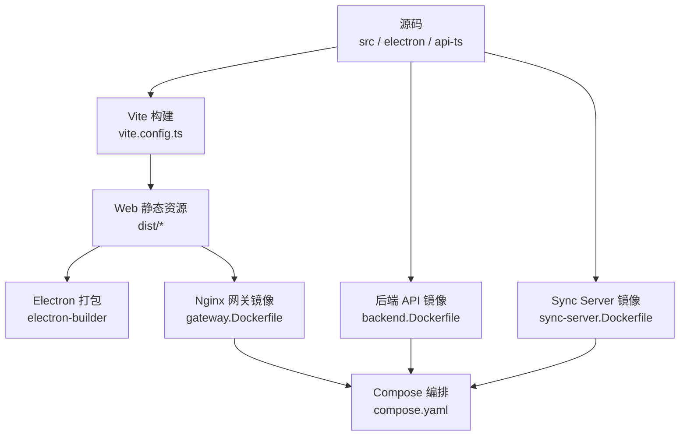
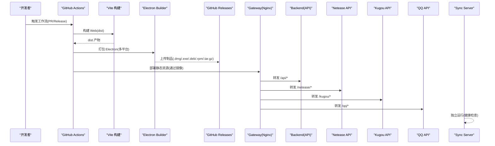
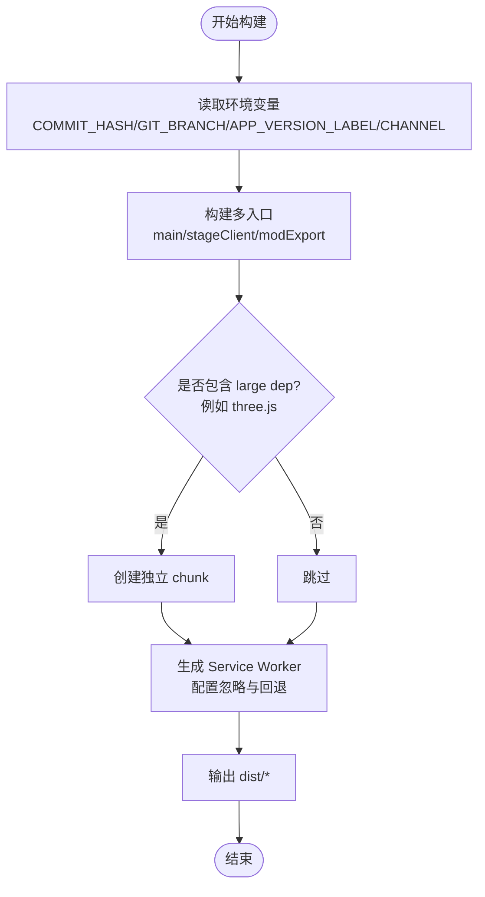
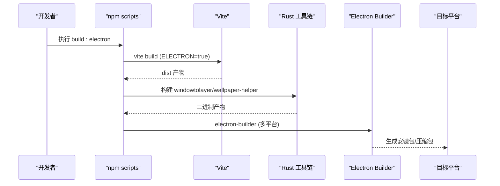
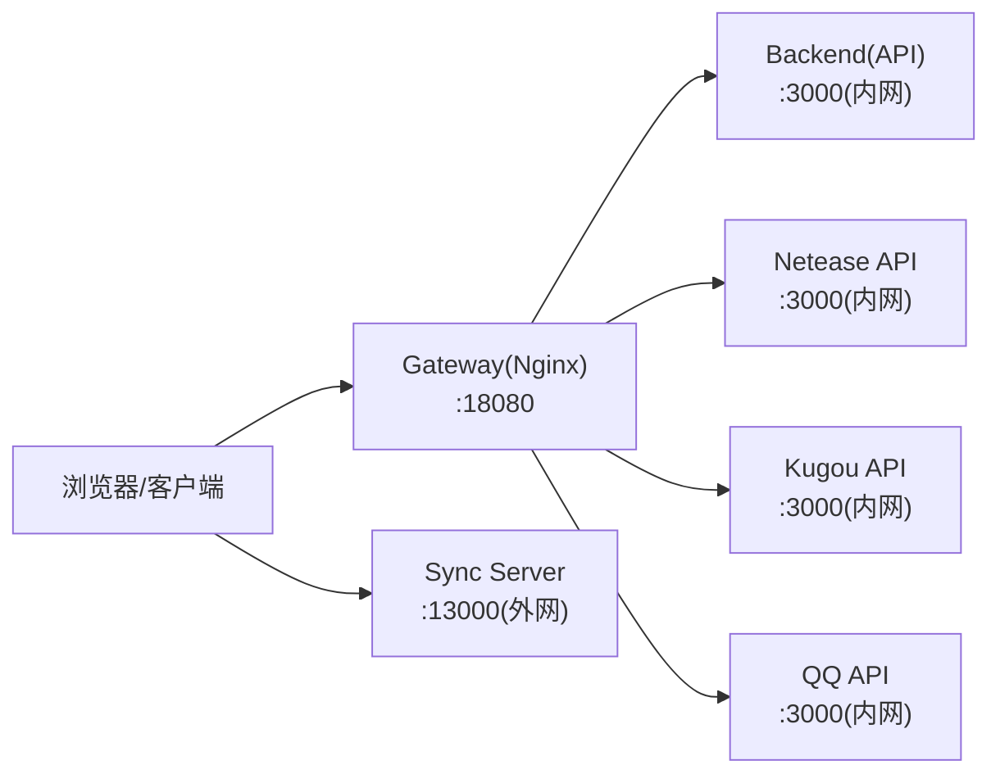
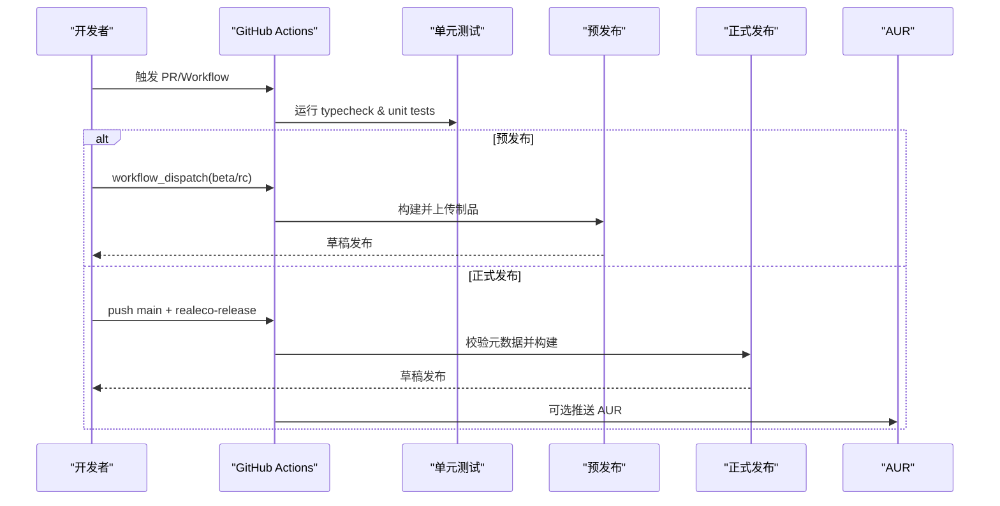
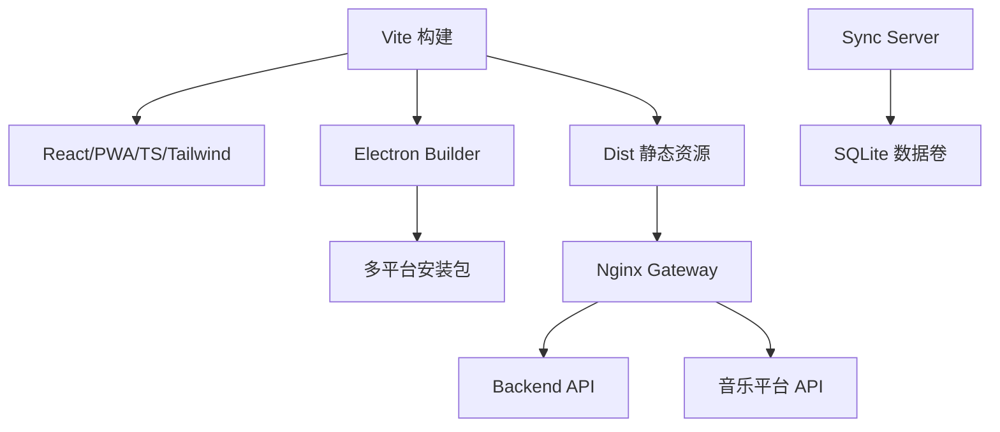

# 构建与部署

<cite>
**本文引用的文件**
- [package.json](file://package.json)
- [vite.config.ts](file://vite.config.ts)
- [build-electron.cjs](file://build-electron.cjs)
- [.github/workflows/electron-release.yml](file://.github/workflows/electron-release.yml)
- [.github/workflows/release-candidate.yml](file://.github/workflows/release-candidate.yml)
- [.github/workflows/pr-unit-tests.yml](file://.github/workflows/pr-unit-tests.yml)
- [deploy/docker/README.md](file://deploy/docker/README.md)
- [deploy/docker/compose.yaml](file://deploy/docker/compose.yaml)
- [deploy/docker/images/gateway.Dockerfile](file://deploy/docker/images/gateway.Dockerfile)
- [deploy/docker/images/backend.Dockerfile](file://deploy/docker/images/backend.Dockerfile)
- [deploy/docker/images/sync-server.Dockerfile](file://deploy/docker/images/sync-server.Dockerfile)
- [vercel.json](file://vercel.json)
</cite>

## 目录
1. [简介](#简介)
2. [项目结构](#项目结构)
3. [核心组件](#核心组件)
4. [架构总览](#架构总览)
5. [详细组件分析](#详细组件分析)
6. [依赖关系分析](#依赖关系分析)
7. [性能考虑](#性能考虑)
8. [故障排查指南](#故障排查指南)
9. [结论](#结论)
10. [附录](#附录)

## 简介
本指南面向 Folia Player 的构建与部署，覆盖以下目标：
- Web 版本的生产构建优化、资源压缩与代码分割配置。
- Electron 桌面应用的打包流程（Windows、macOS、Linux），包括签名与安装包生成。
- Docker 容器化部署方案（镜像构建、编排、健康检查）。
- CI/CD 流水线（GitHub Actions）：自动化测试、预发布与正式发布。
- 版本管理策略：语义化版本、发布分支与热更新机制。
- 部署后监控与维护：日志收集、错误追踪、性能监控。

## 项目结构
Folia Player 采用多产物构建：Web 前端通过 Vite 构建并支持 PWA；Electron 应用基于同一份前端产物进行打包；后端 API 与网关服务以 Docker 镜像形式提供；同步服务独立运行并通过 Compose 编排。

图表来源
- [vite.config.ts:139-276](file://vite.config.ts#L139-L276)
- [deploy/docker/images/gateway.Dockerfile:1-37](file://deploy/docker/images/gateway.Dockerfile#L1-L37)
- [deploy/docker/images/backend.Dockerfile:1-28](file://deploy/docker/images/backend.Dockerfile#L1-L28)
- [deploy/docker/images/sync-server.Dockerfile:1-36](file://deploy/docker/images/sync-server.Dockerfile#L1-L36)
- [deploy/docker/compose.yaml:1-179](file://deploy/docker/compose.yaml#L1-L179)

章节来源
- [package.json:17-50](file://package.json#L17-L50)
- [vite.config.ts:139-276](file://vite.config.ts#L139-L276)

## 核心组件
- Web 构建与优化
  - 入口与多页面：主应用、舞台客户端、导出页。
  - 代码分割：将大型依赖（如 three.js）拆分为独立 chunk，避免超过 PWA 缓存限制。
  - PWA：启用自动更新、资源忽略规则、导航回退白名单。
  - 环境变量注入：提交哈希、分支、应用版本、发布渠道、Docker 堆栈版本等。
- Electron 打包
  - 通过 package.json 中的 build 字段配置多平台目标、产物命名、额外资源与asar解包。
  - 提供专用脚本绕过证书校验与禁用自动签名，便于企业代理环境构建。
- Docker 部署
  - Gateway 使用 Nginx 提供静态资源与反向代理，内置健康检查。
  - Backend 提供 AI 相关 API，仅内部网络暴露。
  - 音乐平台 API（网易云、酷狗、QQ）作为独立服务，受网关统一转发。
  - Sync Server 独立端口持久化 SQLite，安全隔离的网络。
- CI/CD
  - PR 单元测试与类型检查。
  - 预发布（beta/rc）与正式 Realeco 发布工作流，跨三平台构建与制品上传。
  - AUR 包自动推送（可选）。

章节来源
- [vite.config.ts:198-268](file://vite.config.ts#L198-L268)
- [package.json:52-180](file://package.json#L52-L180)
- [build-electron.cjs:1-27](file://build-electron.cjs#L1-L27)
- [deploy/docker/README.md:1-184](file://deploy/docker/README.md#L1-L184)
- [.github/workflows/pr-unit-tests.yml:1-50](file://.github/workflows/pr-unit-tests.yml#L1-L50)
- [.github/workflows/release-candidate.yml:1-228](file://.github/workflows/release-candidate.yml#L1-L228)
- [.github/workflows/electron-release.yml:1-313](file://.github/workflows/electron-release.yml#L1-L313)

## 架构总览
下图展示了从源码到各产物的构建与部署路径，以及运行时服务间的调用关系。

图表来源
- [.github/workflows/electron-release.yml:110-223](file://.github/workflows/electron-release.yml#L110-L223)
- [deploy/docker/compose.yaml:1-179](file://deploy/docker/compose.yaml#L1-L179)
- [deploy/docker/images/gateway.Dockerfile:1-37](file://deploy/docker/images/gateway.Dockerfile#L1-L37)

## 详细组件分析

### Web 构建与生产优化
- 多入口与代码分割
  - 入口包含主应用、stage-client、mod-export。
  - 针对 large dependency（three.js）手动拆分，确保每个缓存文件不超过 PWA 限制。
- PWA 配置
  - 自动更新注册、资源忽略 runtime-config.js、API 导航不走 SPA 回退。
  - 最大缓存文件大小限制，保障离线能力与体积控制。
- 构建时变量注入
  - 注入提交哈希、分支、应用版本、发布渠道、Docker 堆栈版本，用于诊断与灰度。
- 开发代理
  - 歌词代理中间件在开发环境下转发至允许域名，设置 CORS 头，处理 OPTIONS 与 404 特殊逻辑。

图表来源
- [vite.config.ts:198-268](file://vite.config.ts#L198-L268)

章节来源
- [vite.config.ts:139-276](file://vite.config.ts#L139-L276)

### Electron 桌面应用打包
- 多平台目标
  - macOS：dmg、zip（x64/arm64）。
  - Windows：nsis 安装器、portable 便携版（x64）。
  - Linux：tar.gz、deb、rpm。
- 产物与资源
  - 产物命名包含版本与架构信息。
  - 额外资源包含图标、托盘模板、Linux 桌面项与 windowtolayer 二进制。
  - asarUnpack 保留 Python 分析脚本以便外部执行。
- 签名与证书
  - 提供脚本关闭自动签名与证书验证，适配企业代理或无证书环境。
- 构建命令
  - 通过 npm scripts 组合 vite build、原生工具构建与 electron-builder 打包。

图表来源
- [package.json:44-47](file://package.json#L44-L47)
- [package.json:52-180](file://package.json#L52-L180)
- [build-electron.cjs:1-27](file://build-electron.cjs#L1-L27)

章节来源
- [package.json:52-180](file://package.json#L52-L180)
- [build-electron.cjs:1-27](file://build-electron.cjs#L1-L27)

### Docker 容器化部署
- 服务组成
  - gateway：对外暴露 HTTP，反向代理到 backend/netease-api/kugou-api/qq-api。
  - backend：AI 相关 API，仅内部网络。
  - netease-api/kugou-api/qq-api：音乐平台接口，内部网络访问。
  - sync-server：独立端口，SQLite 数据卷持久化。
- 健康检查与安全
  - 各服务均定义 healthcheck，gateway 依赖其他服务就绪。
  - 只读文件系统、最小权限、网络隔离（edge/internal/egress/sync）。
- 环境变量与配置
  - 通过 .env 控制镜像命名空间、版本、绑定地址与端口、AI 提供商、同步 Token 等。
  - 支持 HTTPS 反向代理，需正确传递 Host/X-Forwarded-* 头。
- 快速启动
  - 下载 compose.yaml 与 .env 模板，生成 SYNC_TOKEN，启动并验证健康端点。

图表来源
- [deploy/docker/compose.yaml:1-179](file://deploy/docker/compose.yaml#L1-L179)
- [deploy/docker/README.md:1-184](file://deploy/docker/README.md#L1-L184)

章节来源
- [deploy/docker/README.md:1-184](file://deploy/docker/README.md#L1-L184)
- [deploy/docker/compose.yaml:1-179](file://deploy/docker/compose.yaml#L1-L179)
- [deploy/docker/images/gateway.Dockerfile:1-37](file://deploy/docker/images/gateway.Dockerfile#L1-L37)
- [deploy/docker/images/backend.Dockerfile:1-28](file://deploy/docker/images/backend.Dockerfile#L1-L28)
- [deploy/docker/images/sync-server.Dockerfile:1-36](file://deploy/docker/images/sync-server.Dockerfile#L1-L36)

### CI/CD 流水线
- 单元测试与类型检查
  - PR 触发：安装依赖、运行 typecheck 与 unit tests，同时检查 sync-server。
- 预发布（Pre-Release）
  - 输入基础版本、渠道（beta/rc）、预发布编号，生成带标签的草稿发布。
  - 三平台构建，上传制品，生成预发布说明。
- 正式发布（Realeco）
  - 校验 commit 信息与 realeco-release 元数据，防止重复与降级发布。
  - 三平台构建，生成发布说明，上传制品并发布 GitHub Draft Release。
  - 可选推送 AUR 包。

图表来源
- [.github/workflows/pr-unit-tests.yml:1-50](file://.github/workflows/pr-unit-tests.yml#L1-L50)
- [.github/workflows/release-candidate.yml:1-228](file://.github/workflows/release-candidate.yml#L1-L228)
- [.github/workflows/electron-release.yml:1-313](file://.github/workflows/electron-release.yml#L1-L313)

章节来源
- [.github/workflows/pr-unit-tests.yml:1-50](file://.github/workflows/pr-unit-tests.yml#L1-L50)
- [.github/workflows/release-candidate.yml:1-228](file://.github/workflows/release-candidate.yml#L1-L228)
- [.github/workflows/electron-release.yml:1-313](file://.github/workflows/electron-release.yml#L1-L313)

### 版本管理与热更新
- 语义化版本
  - package.json 维护稳定版本；预发布工作流根据输入生成 vX.Y.Z-beta.N 或 rc.N。
  - 正式发布要求版本高于已发布的稳定版本，且不能重复。
- 发布分支与渠道
  - Realeco 渠道：稳定发布，自动生成 release notes 并上传制品。
  - Internal/Beta/RC 渠道：预发布草稿，便于内测与回归。
- 热更新机制
  - Electron：通过 electron-updater 与 GitHub Releases 提供的 latest*.yml 实现增量更新。
  - Web/PWA：Service Worker 自动更新，runtime-config.js 动态配置不被缓存。
  - Docker：通过 compose pull 拉取新镜像并重启服务实现滚动更新。

章节来源
- [.github/workflows/release-candidate.yml:32-95](file://.github/workflows/release-candidate.yml#L32-L95)
- [.github/workflows/electron-release.yml:24-88](file://.github/workflows/electron-release.yml#L24-L88)
- [deploy/docker/README.md:139-148](file://deploy/docker/README.md#L139-L148)

### 部署后的监控与维护
- 健康检查
  - Gateway：/healthz、/api/healthz、/runtime-config.js、/netease/、/kugou/、/qq/login/status。
  - Sync Server：/health。
- 日志收集
  - 使用 docker compose logs 查看各服务日志；结合宿主机日志系统集中采集。
- 错误追踪
  - Web：利用注入的 __COMMIT_HASH__、__GIT_BRANCH__、__APP_VERSION__ 等标识定位问题。
  - Electron：通过 electron-updater 的更新日志与崩溃报告（如需集成第三方上报）。
- 性能监控
  - 关注 PWA 缓存大小与 chunk 体积；监控 Gateway 与后端 API 的响应时间与错误率。
  - 对 heavy 模块（如 three.js）进行按需加载与懒加载评估。

章节来源
- [deploy/docker/README.md:62-63](file://deploy/docker/README.md#L62-L63)
- [deploy/docker/README.md:158-167](file://deploy/docker/README.md#L158-L167)
- [vite.config.ts:261-268](file://vite.config.ts#L261-L268)

## 依赖关系分析
- 构建依赖
  - Vite、React 插件、PWA 插件、TypeScript、Tailwind、PostCSS。
  - Electron 与 electron-builder 用于桌面打包。
  - Rust 工具链用于构建 windowtolayer 与 wallpaper-helper。
- 运行时依赖
  - Nginx（Gateway）、Node.js（Backend/Sync Server）、各音乐平台 API 服务。
- 外部集成
  - GitHub Releases 用于制品分发与 Electron 更新源。
  - AUR 仓库用于 Arch Linux 用户安装。

图表来源
- [package.json:181-248](file://package.json#L181-L248)
- [deploy/docker/compose.yaml:1-179](file://deploy/docker/compose.yaml#L1-L179)

章节来源
- [package.json:181-248](file://package.json#L181-L248)
- [deploy/docker/compose.yaml:1-179](file://deploy/docker/compose.yaml#L1-L179)

## 性能考虑
- 代码分割与缓存
  - 将 three.js 等大依赖拆分为独立 chunk，避免超过 PWA 单文件缓存限制。
  - 合理设置 maximumFileSizeToCacheInBytes，平衡离线能力与体积。
- 构建优化
  - 使用 npm ci 锁定依赖，减少安装时间。
  - 缓存 Cargo 构建结果，加速原生模块编译。
- 运行时优化
  - Gateway 与后端服务启用健康检查，避免流量进入未就绪实例。
  - 使用只读文件系统与最小权限提升安全性与稳定性。
- 网络优化
  - 通过反向代理统一 HTTPS 终止，减少 TLS 开销。
  - 合理配置上游请求头，避免泄露客户端 IP 导致登录地点异常。

[本节为通用指导，不直接分析具体文件]

## 故障排查指南
- 构建失败
  - 检查 Node 版本与依赖安装是否成功。
  - 确认 Rust 工具链安装与缓存命中情况。
  - 企业代理下使用专用脚本禁用证书校验。
- 打包失败
  - 检查 extraResources 与 asarUnpack 配置是否正确。
  - 确认 windowtolayer 与 wallpaper-helper 构建产物存在。
- 部署问题
  - 验证健康端点返回状态码。
  - 检查环境变量（SYNC_TOKEN、AI 密钥等）是否注入。
  - 确认网络隔离与端口映射是否符合预期。
- 日志与诊断
  - 使用 docker compose logs 查看服务日志。
  - 通过注入的版本与分支信息定位问题版本。

章节来源
- [build-electron.cjs:1-27](file://build-electron.cjs#L1-L27)
- [deploy/docker/README.md:158-167](file://deploy/docker/README.md#L158-L167)
- [vite.config.ts:261-268](file://vite.config.ts#L261-L268)

## 结论
Folia Player 提供了完善的构建与部署体系：Web 端通过 Vite 与 PWA 实现高效构建与离线能力；Electron 端支持多平台打包与自动更新；Docker 编排提供可移植的服务化部署；CI/CD 流水线覆盖测试、预发布与正式发布；版本管理遵循语义化规范，支持多渠道灰度。建议在生产环境中启用 HTTPS、集中日志与错误追踪，并结合性能监控持续优化。

[本节为总结性内容，不直接分析具体文件]

## 附录
- 常用命令
  - Web 构建：npm run build
  - Electron 构建：npm run build:electron
  - Docker 启动：docker compose up -d --wait
  - 健康检查：curl http://localhost:18080/healthz
- 参考配置
  - Vite 构建配置：[vite.config.ts:139-276](file://vite.config.ts#L139-L276)
  - Electron 打包配置：[package.json:52-180](file://package.json#L52-L180)
  - Docker Compose：[deploy/docker/compose.yaml:1-179](file://deploy/docker/compose.yaml#L1-L179)
  - CI 工作流：[.github/workflows/electron-release.yml:1-313](file://.github/workflows/electron-release.yml#L1-L313)、[.github/workflows/release-candidate.yml:1-228](file://.github/workflows/release-candidate.yml#L1-L228)