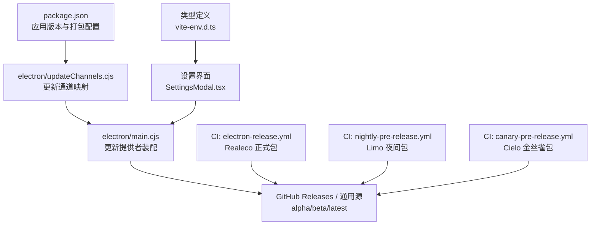
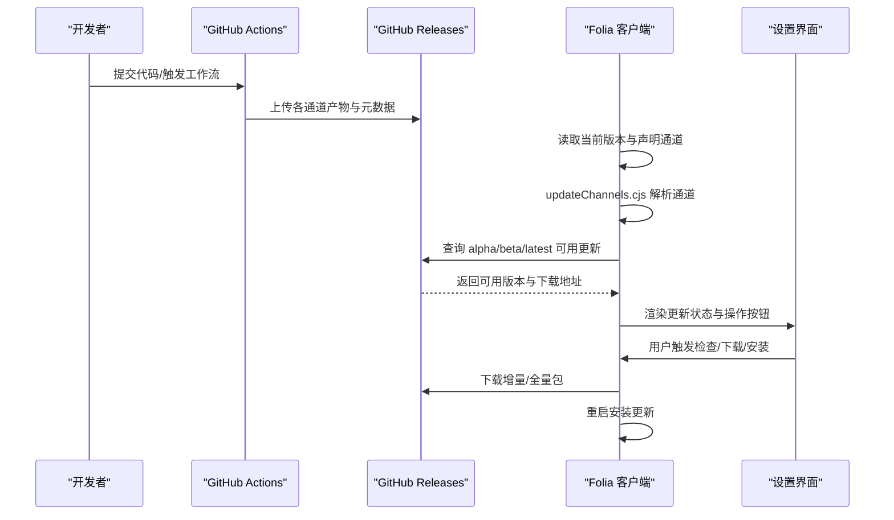
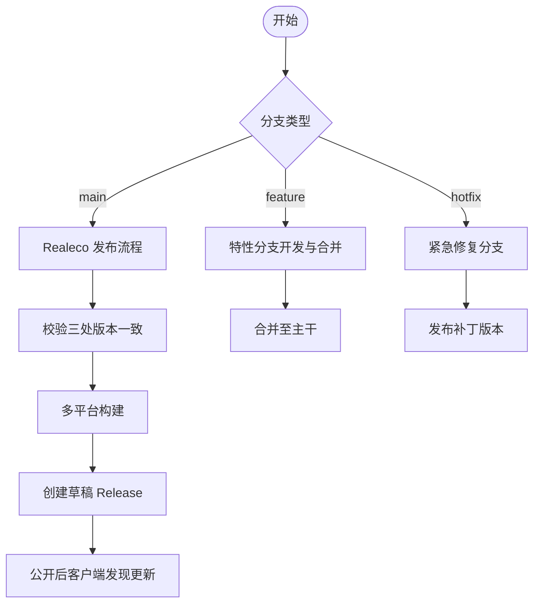
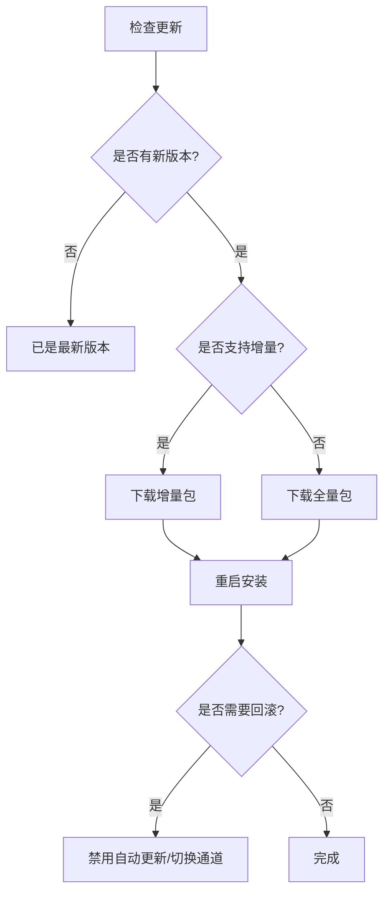
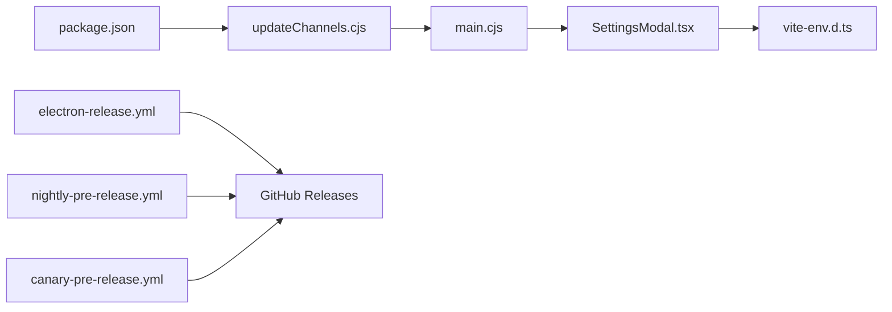

# 版本管理策略

<cite>
**本文引用的文件**
- [package.json](file://package.json)
- [metadata.json](file://metadata.json)
- [electron/updateChannels.cjs](file://electron/updateChannels.cjs)
- [electron/main.cjs](file://electron/main.cjs)
- [src/vite-env.d.ts](file://src/vite-env.d.ts)
- [src/components/modal/SettingsModal.tsx](file://src/components/modal/SettingsModal.tsx)
- [src/components/modal/settings/DesktopSettingsSubview.tsx](file://src/components/modal/settings/DesktopSettingsSubview.tsx)
- [.github/workflows/electron-release.yml](file://.github/workflows/electron-release.yml)
- [.github/workflows/canary-pre-release.yml](file://.github/workflows/canary-pre-release.yml)
- [.github/workflows/nightly-pre-release.yml](file://.github/workflows/nightly-pre-release.yml)
- [shared/realecoReleaseMetadata.cjs](file://shared/realecoReleaseMetadata.cjs)
- [docs/technical.md](file://docs/technical.md)
</cite>

## 目录
1. [简介](#简介)
2. [项目结构](#项目结构)
3. [核心组件](#核心组件)
4. [架构总览](#架构总览)
5. [详细组件分析](#详细组件分析)
6. [依赖关系分析](#依赖关系分析)
7. [性能考虑](#性能考虑)
8. [故障排查指南](#故障排查指南)
9. [结论](#结论)
10. [附录](#附录)

## 简介
本文件为 Folia Player 的版本管理策略文档，覆盖语义化版本控制规范、分支与发布流程、更新通道与热更新机制、元数据管理、向后兼容与破坏性变更处理、回滚与紧急修复等。内容基于仓库中的构建与发布工作流、Electron 更新配置、设置界面与类型定义进行归纳说明，便于研发、测试与运维协同执行一致的版本治理。

## 项目结构
围绕版本管理的代码与配置主要分布在以下位置：
- 应用元信息与版本号：package.json、metadata.json
- 更新通道与提供者配置：electron/updateChannels.cjs、electron/main.cjs
- 客户端设置与更新交互：src/components/modal/SettingsModal.tsx、DesktopSettingsSubview.tsx、src/vite-env.d.ts
- CI/CD 发布流水线：.github/workflows/*.yml
- Realeco 发布校验逻辑：shared/realecoReleaseMetadata.cjs
- 发布通道说明：docs/technical.md

**图示来源**
- [package.json:52-179](file://package.json#L52-L179)
- [electron/updateChannels.cjs:4-97](file://electron/updateChannels.cjs#L4-L97)
- [electron/main.cjs:21-2118](file://electron/main.cjs#L21-L2118)
- [.github/workflows/electron-release.yml:1-313](file://.github/workflows/electron-release.yml#L1-L313)
- [.github/workflows/nightly-pre-release.yml:1-132](file://.github/workflows/nightly-pre-release.yml#L1-L132)
- [.github/workflows/canary-pre-release.yml:1-177](file://.github/workflows/canary-pre-release.yml#L1-L177)

**章节来源**
- [package.json:1-256](file://package.json#L1-L256)
- [metadata.json:1-5](file://metadata.json#L1-L5)
- [docs/technical.md:12-23](file://docs/technical.md#L12-L23)

## 核心组件
- 语义化版本与通道
  - package.json 的 version 字段作为基础版本（A.B.C），用于所有通道的基线；预发布后缀由 CI 注入（如 -alpha.x、-beta.x）。
  - 更新通道分为 Realeco（latest）、Limo（beta）、Cielo（alpha），分别对应稳定版、夜间版与金丝雀版。
- 更新通道解析与提供者
  - updateChannels.cjs 将用户可见通道映射到 electron-updater 的 channel，并支持滚动标签（limo、cielo）与 GitHub Release 源。
  - main.cjs 在运行时根据当前版本与声明通道选择更新提供者配置。
- 设置界面与状态
  - SettingsModal.tsx 暴露检查更新、下载更新、安装更新、切换通道等操作入口。
  - DesktopSettingsSubview.tsx 展示平台差异提示与手动下载入口。
  - vite-env.d.ts 定义了 ElectronUpdateStatus 的状态枚举与字段，统一前端对更新状态的认知。
- CI/CD 发布流水线
  - electron-release.yml：触发条件为修改 realeco-release 或手动触发；校验三处版本一致后构建并发布草稿 Release。
  - nightly-pre-release.yml：定时构建 Limo 夜间包，覆盖 limo 滚动标签。
  - canary-pre-release.yml：支持 rolling、branch-release、artifacts 三种模式，生成 alpha 通道产物。
- Realeco 发布校验
  - shared/realecoReleaseMetadata.cjs 强制 commit message、realeco-release 文件、package.json version 三者严格一致。

**章节来源**
- [package.json:10-10](file://package.json#L10-L10)
- [electron/updateChannels.cjs:4-97](file://electron/updateChannels.cjs#L4-L97)
- [electron/main.cjs:21-2118](file://electron/main.cjs#L21-L2118)
- [src/components/modal/SettingsModal.tsx:600-644](file://src/components/modal/SettingsModal.tsx#L600-L644)
- [src/components/modal/settings/DesktopSettingsSubview.tsx:385-405](file://src/components/modal/settings/DesktopSettingsSubview.tsx#L385-L405)
- [src/vite-env.d.ts:218-249](file://src/vite-env.d.ts#L218-L249)
- [.github/workflows/electron-release.yml:24-88](file://.github/workflows/electron-release.yml#L24-L88)
- [.github/workflows/nightly-pre-release.yml:16-44](file://.github/workflows/nightly-pre-release.yml#L16-L44)
- [.github/workflows/canary-pre-release.yml:27-80](file://.github/workflows/canary-pre-release.yml#L27-L80)
- [shared/realecoReleaseMetadata.cjs:1-31](file://shared/realecoReleaseMetadata.cjs#L1-L31)

## 架构总览
Folia 的版本与更新体系由“CI 构建 + 发布源 + 客户端通道解析 + 设置界面”构成闭环。CI 负责按通道产出不同版本的安装包与增量信息；客户端通过 updateChannels.cjs 解析通道并选择更新源；设置界面提供用户可操作的更新入口与状态反馈。

**图示来源**
- [.github/workflows/electron-release.yml:110-220](file://.github/workflows/electron-release.yml#L110-L220)
- [.github/workflows/nightly-pre-release.yml:45-132](file://.github/workflows/nightly-pre-release.yml#L45-L132)
- [.github/workflows/canary-pre-release.yml:82-177](file://.github/workflows/canary-pre-release.yml#L82-L177)
- [electron/updateChannels.cjs:43-97](file://electron/updateChannels.cjs#L43-L97)
- [src/components/modal/SettingsModal.tsx:600-644](file://src/components/modal/SettingsModal.tsx#L600-L644)

## 详细组件分析

### 语义化版本控制规范
- 主版本（Major）
  - 表示破坏性变更或重大架构调整。建议通过独立分支与严格的回归测试后再合并至主干。
- 次版本（Minor）
  - 新增功能且保持向后兼容。可在开发分支累积后合入主干，配合自动化测试验证。
- 补丁版本（Patch）
  - Bug 修复与微小改进。可通过热修复分支快速发布。
- 预发布与通道
  - Cielo（alpha）：实验性功能，允许破坏性变更风险，适合早期验证。
  - Limo（beta）：相对稳定，面向尝鲜用户，可作为升级跳板。
  - Realeco（latest）：正式版，需通过严格一致性校验与多平台构建。

**章节来源**
- [package.json:10-10](file://package.json#L10-L10)
- [docs/technical.md:12-23](file://docs/technical.md#L12-L23)
- [.github/workflows/canary-pre-release.yml:47-80](file://.github/workflows/canary-pre-release.yml#L47-L80)
- [.github/workflows/nightly-pre-release.yml:29-44](file://.github/workflows/nightly-pre-release.yml#L29-L44)
- [.github/workflows/electron-release.yml:24-88](file://.github/workflows/electron-release.yml#L24-L88)

### 分支管理与发布流程
- 主干分支（main）
  - 仅接受经过评审与测试的变更；发布 Realeco 时要求提交信息与 realeco-release 文件、package.json 版本一致。
- 特性分支
  - 新功能在独立分支开发，完成后合并至主干；必要时创建候选分支进行回归。
- 发布分支
  - 针对紧急修复可创建 hotfix 分支，走快速通道发布补丁版本。
- 发布流水线
  - Realeco：校验通过后构建多平台产物并发布草稿 Release，维护者公开后客户端发现更新。
  - Limo：定时任务构建夜间包，覆盖 limo 滚动标签。
  - Cielo：支持滚动金丝雀、分支独立发布与仅保留工件三种模式。

**图示来源**
- [.github/workflows/electron-release.yml:24-88](file://.github/workflows/electron-release.yml#L24-L88)
- [.github/workflows/electron-release.yml:110-220](file://.github/workflows/electron-release.yml#L110-L220)
- [.github/workflows/nightly-pre-release.yml:45-132](file://.github/workflows/nightly-pre-release.yml#L45-L132)
- [.github/workflows/canary-pre-release.yml:82-177](file://.github/workflows/canary-pre-release.yml#L82-L177)
- [shared/realecoReleaseMetadata.cjs:7-26](file://shared/realecoReleaseMetadata.cjs#L7-L26)

**章节来源**
- [.github/workflows/electron-release.yml:1-313](file://.github/workflows/electron-release.yml#L1-L313)
- [.github/workflows/nightly-pre-release.yml:1-132](file://.github/workflows/nightly-pre-release.yml#L1-L132)
- [.github/workflows/canary-pre-release.yml:1-177](file://.github/workflows/canary-pre-release.yml#L1-L177)
- [shared/realecoReleaseMetadata.cjs:1-31](file://shared/realecoReleaseMetadata.cjs#L1-L31)

### 热更新机制（增量/全量/回滚）
- 增量更新
  - 使用 electron-updater 的 blockmap/yml 元数据实现差分下载，减少带宽与时间成本。
- 全量更新
  - 当增量不可用或平台限制时，回退到全量包下载。
- 通道与源
  - Cielo/Limo 使用滚动标签（cielo/limo）指向最新预发布产物；Realeco 使用 GitHub Release 的 latest/beta/alpha 通道。
- 回滚策略
  - 通过禁用自动更新、切换到更旧通道或引导用户手动下载历史版本实现回滚；对于滚动标签，可通过删除或替换标签影响后续获取。

**图示来源**
- [electron/updateChannels.cjs:59-97](file://electron/updateChannels.cjs#L59-L97)
- [src/vite-env.d.ts:218-249](file://src/vite-env.d.ts#L218-L249)
- [src/components/modal/SettingsModal.tsx:600-644](file://src/components/modal/SettingsModal.tsx#L600-L644)

**章节来源**
- [electron/updateChannels.cjs:4-97](file://electron/updateChannels.cjs#L4-L97)
- [src/vite-env.d.ts:218-249](file://src/vite-env.d.ts#L218-L249)
- [src/components/modal/SettingsModal.tsx:600-644](file://src/components/modal/SettingsModal.tsx#L600-L644)

### 元数据管理（版本同步、更新信息、渠道）
- 版本同步
  - Realeco 发布要求 commit message、realeco-release 文件、package.json version 三者一致；CI 会校验并拒绝不一致的发布。
- 更新信息配置
  - 设置界面显示当前版本、可用版本、下载进度、错误信息等；支持切换更新通道。
- 渠道管理
  - 客户端通过 updateChannels.cjs 将用户可见通道映射到 electron-updater 的 channel；支持滚动标签与 GitHub Release 源。

**章节来源**
- [shared/realecoReleaseMetadata.cjs:7-26](file://shared/realecoReleaseMetadata.cjs#L7-L26)
- [src/components/modal/SettingsModal.tsx:600-644](file://src/components/modal/SettingsModal.tsx#L600-L644)
- [electron/updateChannels.cjs:43-97](file://electron/updateChannels.cjs#L43-L97)

### 向后兼容性与破坏性变更
- 兼容性原则
  - Minor 与 Patch 应保证向后兼容；Major 引入破坏性变更时需明确升级路径与风险提示。
- 通道隔离
  - Cielo（alpha）允许高风险变更用于早期验证；Limo（beta）用于稳定性收敛；Realeco（latest）仅包含已验证的稳定变更。
- 迁移与降级
  - 提供回滚策略与手动下载入口，确保在出现不兼容问题时用户可快速恢复。

**章节来源**
- [docs/technical.md:12-23](file://docs/technical.md#L12-L23)
- [electron/updateChannels.cjs:4-37](file://electron/updateChannels.cjs#L4-L37)
- [src/components/modal/settings/DesktopSettingsSubview.tsx:385-405](file://src/components/modal/settings/DesktopSettingsSubview.tsx#L385-L405)

### 版本回滚与紧急修复
- 回滚流程
  - 禁用自动更新或切换至更稳定的通道；必要时引导用户手动下载历史版本。
- 紧急修复
  - 通过 hotfix 分支快速构建补丁版本，遵循最小改动原则并通过自动化测试验证。
- 发布前冻结
  - Realeco 发布前进行代码冻结，确保无额外变更进入主干；CI 校验通过后构建并发布草稿 Release。

**章节来源**
- [.github/workflows/electron-release.yml:24-88](file://.github/workflows/electron-release.yml#L24-L88)
- [.github/workflows/electron-release.yml:110-220](file://.github/workflows/electron-release.yml#L110-L220)
- [src/components/modal/SettingsModal.tsx:600-644](file://src/components/modal/SettingsModal.tsx#L600-L644)

## 依赖关系分析

**图示来源**
- [package.json:52-179](file://package.json#L52-L179)
- [electron/updateChannels.cjs:4-97](file://electron/updateChannels.cjs#L4-L97)
- [electron/main.cjs:21-2118](file://electron/main.cjs#L21-L2118)
- [src/components/modal/SettingsModal.tsx:600-644](file://src/components/modal/SettingsModal.tsx#L600-L644)
- [src/vite-env.d.ts:218-249](file://src/vite-env.d.ts#L218-L249)
- [.github/workflows/electron-release.yml:110-220](file://.github/workflows/electron-release.yml#L110-L220)
- [.github/workflows/nightly-pre-release.yml:45-132](file://.github/workflows/nightly-pre-release.yml#L45-L132)
- [.github/workflows/canary-pre-release.yml:82-177](file://.github/workflows/canary-pre-release.yml#L82-L177)

**章节来源**
- [electron/updateChannels.cjs:4-97](file://electron/updateChannels.cjs#L4-L97)
- [electron/main.cjs:21-2118](file://electron/main.cjs#L21-L2118)
- [src/components/modal/SettingsModal.tsx:600-644](file://src/components/modal/SettingsModal.tsx#L600-L644)
- [src/vite-env.d.ts:218-249](file://src/vite-env.d.ts#L218-L249)

## 性能考虑
- 增量更新优先：利用 blockmap/yml 实现差分下载，降低带宽与耗时。
- 通道分流：预发布通道与正式版分离，避免不稳定版本影响生产环境。
- 构建缓存：CI 中使用缓存加速依赖安装与原生模块编译，缩短构建时间。
- 资源优化：按需打包与 extraResources 控制，减少安装包体积。

[本节为通用指导，无需特定文件引用]

## 故障排查指南
- 更新检查失败
  - 检查网络与通道配置；确认 electron-updater 支持的渠道与平台能力。
- 无法下载更新
  - 查看下载进度与错误信息；必要时切换通道或手动下载。
- 平台不支持自动更新
  - 某些平台可能不支持自动更新，需引导用户手动下载安装包。
- 版本不一致导致发布失败
  - 确保 commit message、realeco-release 文件、package.json version 三者一致；参考校验逻辑定位问题。

**章节来源**
- [src/vite-env.d.ts:218-249](file://src/vite-env.d.ts#L218-L249)
- [src/components/modal/SettingsModal.tsx:1119-1149](file://src/components/modal/SettingsModal.tsx#L1119-L1149)
- [shared/realecoReleaseMetadata.cjs:7-26](file://shared/realecoReleaseMetadata.cjs#L7-L26)

## 结论
Folia Player 的版本管理以语义化版本为基础，结合多通道发布与严格的 Realeco 校验，形成从开发到上线的完整闭环。通过 CI/CD 自动化构建与客户端通道解析，实现了稳定、可控且可回滚的更新机制。建议在实践中坚持向后兼容原则，合理划分通道，并在发布前进行代码冻结与充分测试，以确保用户体验与系统稳定性。

[本节为总结性内容，无需特定文件引用]

## 附录
- 术语
  - 语义化版本：主版本.次版本.补丁版本
  - 通道：Realeco（正式）、Limo（夜间）、Cielo（金丝雀）
  - 增量更新：基于差分的更新方式
  - 全量更新：完整安装包下载
- 最佳实践
  - 小步快跑、频繁集成；预发布通道先行验证；正式版严格校验与回归测试。
  - 及时记录变更日志与更新说明，提升用户透明度。
  - 建立回滚预案与监控指标，快速响应异常。

[本节为补充信息，无需特定文件引用]