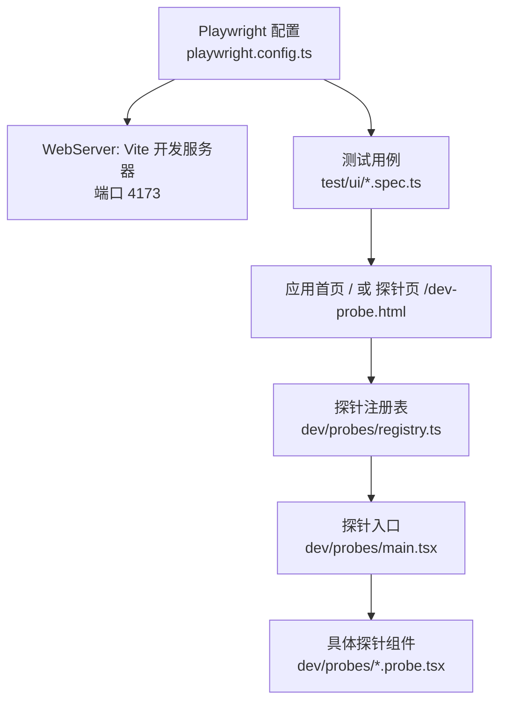
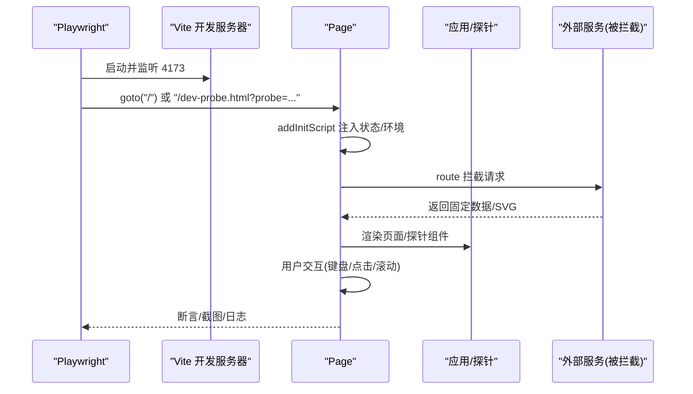
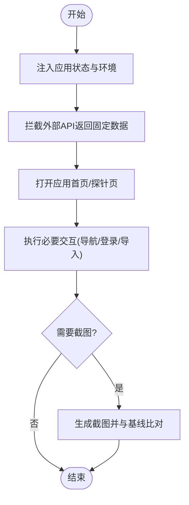
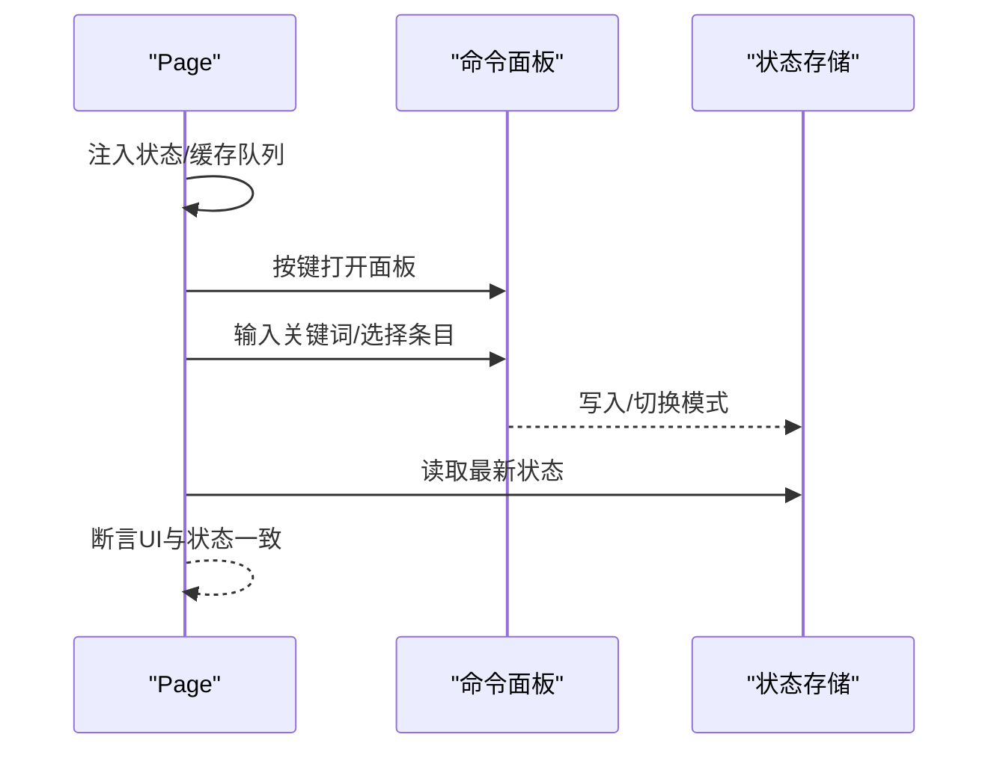
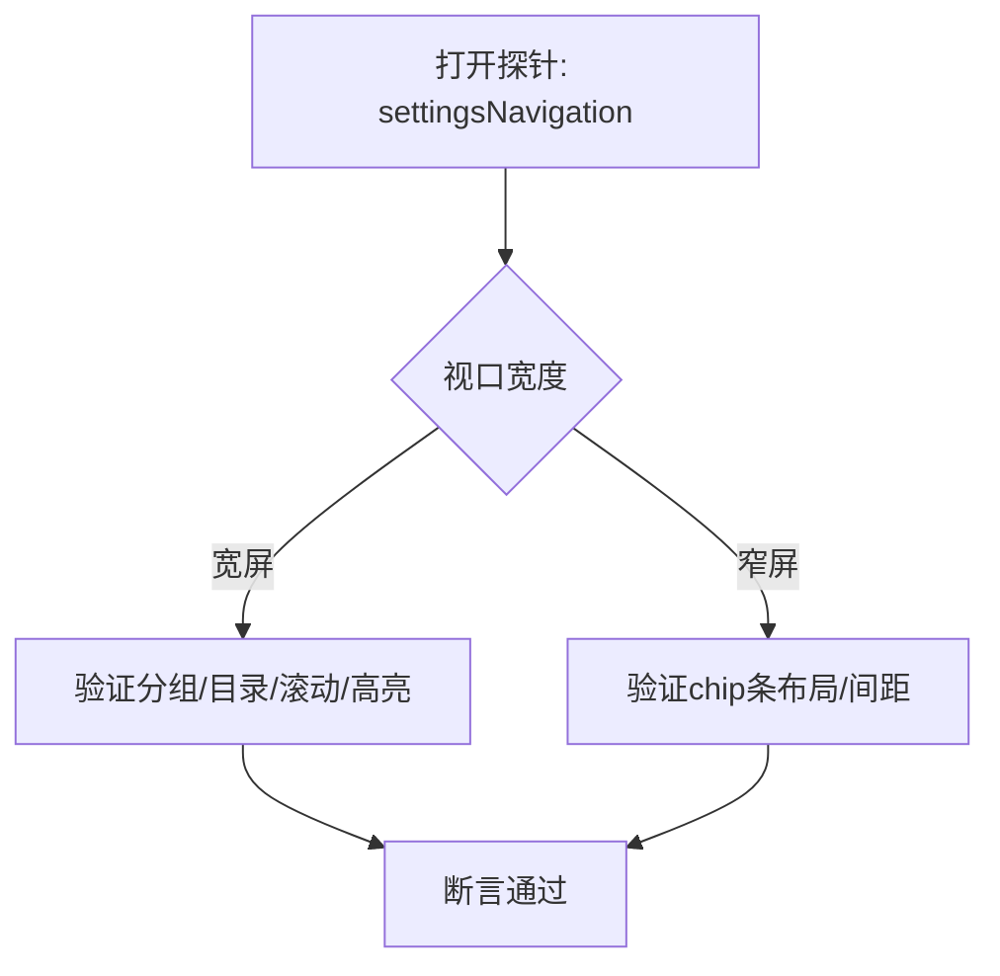
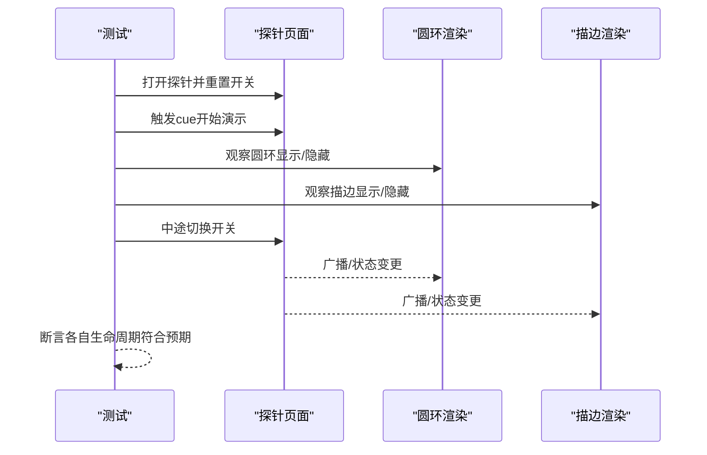
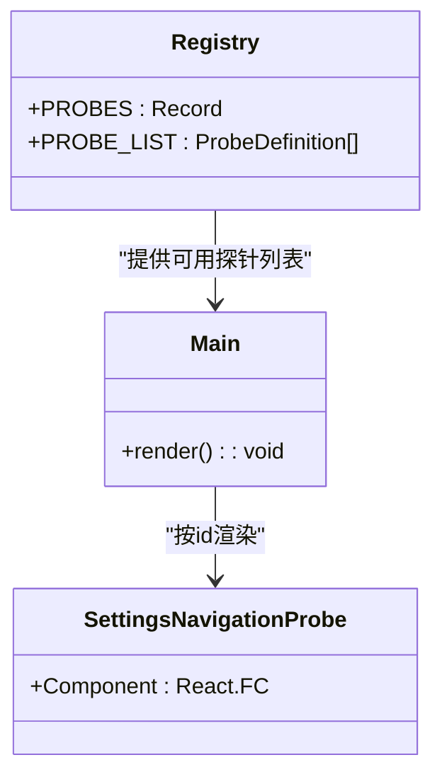
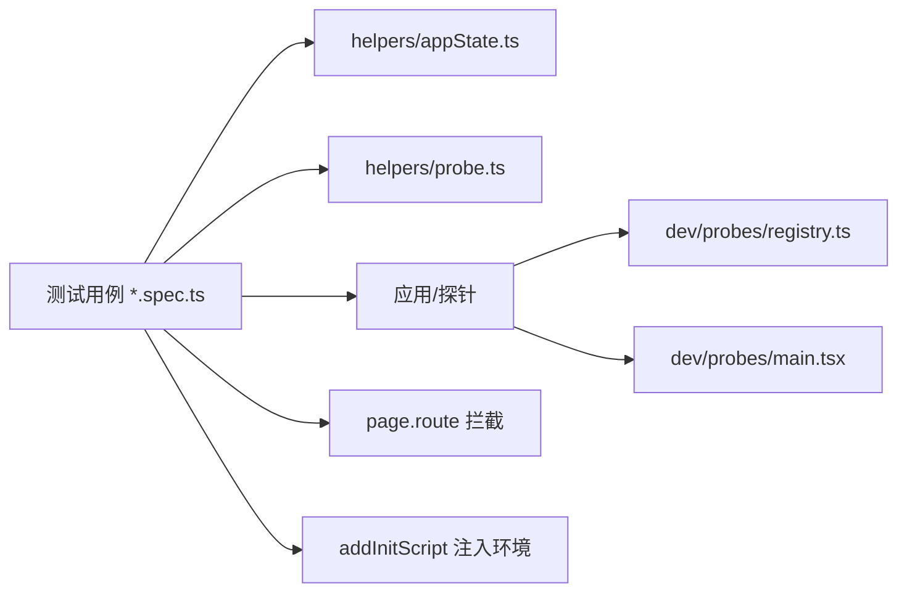

# UI测试

<cite>
**本文引用的文件**
- [playwright.config.ts](file://playwright.config.ts)
- [package.json](file://package.json)
- [test/ui/app.screenshot.spec.ts](file://test/ui/app.screenshot.spec.ts)
- [test/ui/commandPalette.spec.ts](file://test/ui/commandPalette.spec.ts)
- [test/ui/settingsNavigation.spec.ts](file://test/ui/settingsNavigation.spec.ts)
- [test/ui/devProbe.spec.ts](file://test/ui/devProbe.spec.ts)
- [test/ui/helpers/appState.ts](file://test/ui/helpers/appState.ts)
- [test/ui/helpers/probe.ts](file://test/ui/helpers/probe.ts)
- [dev/probes/registry.ts](file://dev/probes/registry.ts)
- [dev/probes/main.tsx](file://dev/probes/main.tsx)
- [dev/probes/settingsNavigation.probe.tsx](file://dev/probes/settingsNavigation.probe.tsx)
- [test/ui/fmTab.spec.ts](file://test/ui/fmTab.spec.ts)
- [test/ui/automixTransitionSwitches.spec.ts](file://test/ui/automixTransitionSwitches.spec.ts)
</cite>

## 目录
1. [简介](#简介)
2. [项目结构](#项目结构)
3. [核心组件](#核心组件)
4. [架构总览](#架构总览)
5. [详细组件分析](#详细组件分析)
6. [依赖关系分析](#依赖关系分析)
7. [性能考虑](#性能考虑)
8. [故障排查指南](#故障排查指南)
9. [结论](#结论)
10. [附录](#附录)

## 简介
本指南面向Folia Player的UI测试，聚焦Playwright端到端与组件级探针测试。内容涵盖：
- Playwright环境配置、浏览器启动参数、视口与超时策略
- 页面交互模拟（键盘、鼠标、路由拦截、本地存储注入）
- 用户界面测试用例编写方法（组件渲染、交互流程、响应式布局）
- 截图对比测试（基准图片管理、差异阈值、跨平台一致性）
- 测试辅助工具（应用状态模拟、探针系统）
- 复杂UI组件测试示例（可视化效果、设置面板、命令面板）
- 跨浏览器兼容性与移动端测试思路
- 测试执行优化与并行化建议

## 项目结构
UI测试位于 test/ui 目录，配合 dev/probes 提供的“组件探针”能力，可在真实浏览器环境中快速挂载单个组件进行回归验证。Playwright通过根配置启动开发服务器并指向固定端口，统一基线视口与截图容差。

图表来源
- [playwright.config.ts:16-50](file://playwright.config.ts#L16-L50)
- [dev/probes/registry.ts:1-24](file://dev/probes/registry.ts#L1-L24)
- [dev/probes/main.tsx:1-54](file://dev/probes/main.tsx#L1-L54)

章节来源
- [playwright.config.ts:16-50](file://playwright.config.ts#L16-L50)
- [package.json:17-28](file://package.json#L17-L28)

## 核心组件
- Playwright 配置与运行
  - 测试目录、报告器、全局超时、期望断言超时、截图差异容忍度
  - 浏览器启动参数（沙箱禁用、共享内存禁用）、可执行路径选择
  - WebServer 启动Vite开发服务器，复用已有进程，避免重复启动开销
- 应用状态注入与外部依赖模拟
  - 通过 addInitScript 在页面加载前注入 localStorage、matchMedia、electron API、Worker/Audio 等
  - 使用 page.route 拦截网络请求，返回固定JSON或SVG资源，确保截图稳定
- 探针系统
  - 自动发现 dev/probes/*.probe.tsx 并构建注册表
  - 通过 URL 查询参数 ?probe=xxx 挂载单一组件，隔离主应用副作用
  - 测试辅助函数 openProbe 清理本地存储、设置语言与静态模式、等待探针节点可见

章节来源
- [playwright.config.ts:16-50](file://playwright.config.ts#L16-L50)
- [test/ui/helpers/appState.ts:1-19](file://test/ui/helpers/appState.ts#L1-L19)
- [test/ui/helpers/probe.ts:1-24](file://test/ui/helpers/probe.ts#L1-L24)
- [dev/probes/registry.ts:1-24](file://dev/probes/registry.ts#L1-L24)
- [dev/probes/main.tsx:1-54](file://dev/probes/main.tsx#L1-L54)

## 架构总览
下图展示一次典型UI测试的执行流：Playwright启动WebServer，打开目标页面，注入应用状态，拦截外部API，执行交互并断言或截图。

图表来源
- [playwright.config.ts:16-50](file://playwright.config.ts#L16-L50)
- [test/ui/app.screenshot.spec.ts:177-397](file://test/ui/app.screenshot.spec.ts#L177-L397)
- [test/ui/app.screenshot.spec.ts:399-585](file://test/ui/app.screenshot.spec.ts#L399-L585)
- [test/ui/helpers/probe.ts:13-23](file://test/ui/helpers/probe.ts#L13-L23)

## 详细组件分析

### 截图对比测试（全量首页与功能视图）
- 目标：覆盖网易云歌单首页、Navidrome库视图、本地库导入后的列表等关键视图
- 关键点：
  - 通过 installBaseState 注入语言、主题、引导版本、静态模式等，避免弹窗遮挡
  - 使用 mockNeteaseApi 与 mockNavidromeApi 拦截所有相关接口，返回确定性数据
  - 隐藏 canvas 以避免shader纹理导致的像素抖动；设置 reducedMotion 与 colorScheme 保证渲染一致
  - 使用 toHaveScreenshot 指定动画禁用、CSS缩放、整页截图，并维护快照集
- 基准图片管理：
  - 更新基线使用 npm run test:ui:update
  - 截图差异阈值已在配置中放宽至合理范围，避免抗锯齿/过渡带来的微小差异导致误报

图表来源
- [test/ui/app.screenshot.spec.ts:177-397](file://test/ui/app.screenshot.spec.ts#L177-L397)
- [test/ui/app.screenshot.spec.ts:399-585](file://test/ui/app.screenshot.spec.ts#L399-L585)
- [test/ui/app.screenshot.spec.ts:587-673](file://test/ui/app.screenshot.spec.ts#L587-L673)
- [playwright.config.ts:21-28](file://playwright.config.ts#L21-L28)

章节来源
- [test/ui/app.screenshot.spec.ts:587-673](file://test/ui/app.screenshot.spec.ts#L587-L673)
- [playwright.config.ts:21-28](file://playwright.config.ts#L21-L28)

### 命令面板交互测试
- 覆盖三类入口：默认匹配列表、surface接管（音量条/队列/模式选择器）、执行模式（单键立即执行）
- 要点：
  - 通过 openPlayerPage 初始化播放态与队列缓存，确保面板有上下文
  - 使用 getByTestId('command-palette-panel') 定位面板，断言输入框类型变化、滑块出现、列表项可见性
  - 对防抖场景采用显式等待，避免命中未刷新列表
  - 通过 evaluate 动态读取Zustand store值，验证状态变更

图表来源
- [test/ui/commandPalette.spec.ts:21-44](file://test/ui/commandPalette.spec.ts#L21-L44)
- [test/ui/commandPalette.spec.ts:49-173](file://test/ui/commandPalette.spec.ts#L49-L173)
- [test/ui/commandPalette.spec.ts:175-248](file://test/ui/commandPalette.spec.ts#L175-L248)

章节来源
- [test/ui/commandPalette.spec.ts:49-173](file://test/ui/commandPalette.spec.ts#L49-L173)
- [test/ui/commandPalette.spec.ts:175-248](file://test/ui/commandPalette.spec.ts#L175-L248)

### 设置导航与响应式布局测试
- 使用探针 settingsNavigation 单独挂载侧栏分组、二级锚点目录与scrollspy逻辑
- 宽屏断言：分组标题、目录展开、延迟插入的锚点位置、点击跳转与高亮保持、滚动到底部时选中最后一节
- 窄屏断言：无分组、无目录、chip间距为8px（Tailwind v4 space-x行为）
- 通过自定义evaluate计算activeTocLabel与scrollTop，验证滚动与高亮联动

图表来源
- [test/ui/settingsNavigation.spec.ts:24-80](file://test/ui/settingsNavigation.spec.ts#L24-L80)
- [test/ui/settingsNavigation.spec.ts:82-107](file://test/ui/settingsNavigation.spec.ts#L82-L107)
- [dev/probes/settingsNavigation.probe.tsx:22-154](file://dev/probes/settingsNavigation.probe.tsx#L22-L154)

章节来源
- [test/ui/settingsNavigation.spec.ts:24-80](file://test/ui/settingsNavigation.spec.ts#L24-L80)
- [test/ui/settingsNavigation.spec.ts:82-107](file://test/ui/settingsNavigation.spec.ts#L82-L107)
- [dev/probes/settingsNavigation.probe.tsx:22-154](file://dev/probes/settingsNavigation.probe.tsx#L22-L154)

### 自动化混音过渡开关测试
- 针对两个独立画法（圆环与卡片描边）的开关互不干扰、中途关闭立即停止、从当前进度继续绘制等行为
- 通过探针 automixTransitionSwitches 暴露 cue 与开关动作，结合等待与断言确认生命周期
- 覆盖边界情况：演示期间关闭另一路、演示期间开启另一路不应打断正在进行的绘制

图表来源
- [test/ui/automixTransitionSwitches.spec.ts:11-127](file://test/ui/automixTransitionSwitches.spec.ts#L11-L127)

章节来源
- [test/ui/automixTransitionSwitches.spec.ts:11-127](file://test/ui/automixTransitionSwitches.spec.ts#L11-L127)

### 私人FM标签页与可用性控制
- 通过探针 fmTab 验证模式入口可见性、点击后计数标记、provider不支持时入口隐藏
- 使用 openProbe 快速进入探针页，减少主应用初始化成本

章节来源
- [test/ui/fmTab.spec.ts:1-20](file://test/ui/fmTab.spec.ts#L1-L20)
- [test/ui/helpers/probe.ts:13-23](file://test/ui/helpers/probe.ts#L13-L23)

### 探针系统概览
- 探针清单由 import.meta.glob 自动收集，按id去重并排序
- 探针入口根据URL参数选择渲染对应组件，提供StrictMode以暴露潜在问题
- 测试辅助 openProbe 清理本地存储、设置语言与静态模式，并等待探针节点可见

图表来源
- [dev/probes/registry.ts:1-24](file://dev/probes/registry.ts#L1-L24)
- [dev/probes/main.tsx:1-54](file://dev/probes/main.tsx#L1-L54)
- [dev/probes/settingsNavigation.probe.tsx:146-154](file://dev/probes/settingsNavigation.probe.tsx#L146-L154)

章节来源
- [dev/probes/registry.ts:1-24](file://dev/probes/registry.ts#L1-L24)
- [dev/probes/main.tsx:1-54](file://dev/probes/main.tsx#L1-L54)

## 依赖关系分析
- 测试用例依赖：
  - helpers/appState：读取package.json中的版本号，避免硬编码导致发版后静默失效
  - helpers/probe：封装探针打开流程，统一清理本地存储与语言设置
- 探针依赖：
  - registry：自动发现并构建探针映射
  - main：根据URL参数渲染探针组件
- 外部依赖模拟：
  - 网易云API、Navidrome Subsonic API通过page.route拦截，返回固定JSON/SVG
  - Electron API、Worker、Audio通过addInitScript替换为轻量实现

图表来源
- [test/ui/helpers/appState.ts:1-19](file://test/ui/helpers/appState.ts#L1-L19)
- [test/ui/helpers/probe.ts:1-24](file://test/ui/helpers/probe.ts#L1-L24)
- [dev/probes/registry.ts:1-24](file://dev/probes/registry.ts#L1-L24)
- [dev/probes/main.tsx:1-54](file://dev/probes/main.tsx#L1-L54)
- [test/ui/app.screenshot.spec.ts:399-585](file://test/ui/app.screenshot.spec.ts#L399-L585)

章节来源
- [test/ui/helpers/appState.ts:1-19](file://test/ui/helpers/appState.ts#L1-L19)
- [test/ui/helpers/probe.ts:1-24](file://test/ui/helpers/probe.ts#L1-L24)
- [test/ui/app.screenshot.spec.ts:399-585](file://test/ui/app.screenshot.spec.ts#L399-L585)

## 性能考虑
- 截图稳定性
  - 使用 animations: 'disabled'、scale: 'css'、fullPage: true 提升一致性
  - 隐藏canvas避免shader纹理导致的像素抖动
  - 设置 reducedMotion 与 colorScheme 降低渲染差异
- 差异阈值
  - maxDiffPixels 设置为合理值，容忍抗锯齿/过渡引起的微小差异，避免误报
- 执行效率
  - webServer.reuseExistingServer 复用已启动的开发服务器，减少启动时间
  - 探针测试仅挂载单一组件，避免主应用完整初始化开销
  - 使用 waitForTimeout/poll 处理防抖与异步渲染，避免竞态失败

[本节为通用指导，不直接分析具体文件]

## 故障排查指南
- 常见问题
  - 用户指引弹窗遮挡：确保注入当前版本到引导版本存储键，避免弹窗弹出
  - 截图不一致：检查是否隐藏了canvas、是否设置了静态模式与颜色方案
  - 探针未找到：确认URL参数probe id存在且注册表中包含该id
  - 网络请求不稳定：确保route拦截覆盖了所有相关域名与路径
- 调试技巧
  - 使用 trace: 'on-first-retry' 获取重试时的追踪信息
  - 通过 page.evaluate 读取DOM状态或store值，辅助定位问题
  - 逐步缩小范围：先跑探针用例，再扩展到全量截图用例

章节来源
- [test/ui/helpers/appState.ts:6-18](file://test/ui/helpers/appState.ts#L6-L18)
- [test/ui/app.screenshot.spec.ts:177-397](file://test/ui/app.screenshot.spec.ts#L177-L397)
- [playwright.config.ts:30-43](file://playwright.config.ts#L30-L43)

## 结论
本项目采用“全量截图+组件探针”的双层UI测试策略：
- 全量截图覆盖关键业务视图，确保整体视觉与交互正确
- 探针测试聚焦复杂组件与边界场景，提高回归效率与稳定性
- 通过严格的网络拦截与环境注入，保证测试的可重复性与跨平台一致性
- 合理的差异阈值与截图策略有效降低误报率，同时保留对真实回归的敏感度

[本节为总结，不直接分析具体文件]

## 附录

### Playwright 配置要点
- 测试目录与报告器
- 全局与期望断言超时
- 截图差异容忍度
- 浏览器启动参数与可执行路径
- WebServer 启动与复用

章节来源
- [playwright.config.ts:16-50](file://playwright.config.ts#L16-L50)

### 脚本命令
- 运行UI测试：npm run test:ui
- 更新截图基线：npm run test:ui:update

章节来源
- [package.json:17-28](file://package.json#L17-L28)

### 跨浏览器与移动端测试建议
- 多浏览器
  - 可通过配置多个browser实例（chromium/firefox/webkit）并在CI中并行执行
  - 注意字体与抗锯齿差异，必要时调整截图阈值或锁定字体
- 移动端
  - 使用 viewport 模拟常见手机尺寸
  - 通过 emulateMedia 设置 prefers-reduced-motion、colorScheme
  - 使用触摸事件与手势模拟（如双击、长按）验证交互

[本节为通用指导，不直接分析具体文件]

### 并行测试与执行优化
- fullyParallel: false 用于当前UI测试，避免并发导致的CPU争用影响截图稳定性
- 若需并行，可将不同探针用例拆分到不同worker，并确保资源隔离
- 使用 page.waitForTimeout/poll 处理防抖与异步渲染，减少竞态失败

章节来源
- [playwright.config.ts:18-28](file://playwright.config.ts#L18-L28)