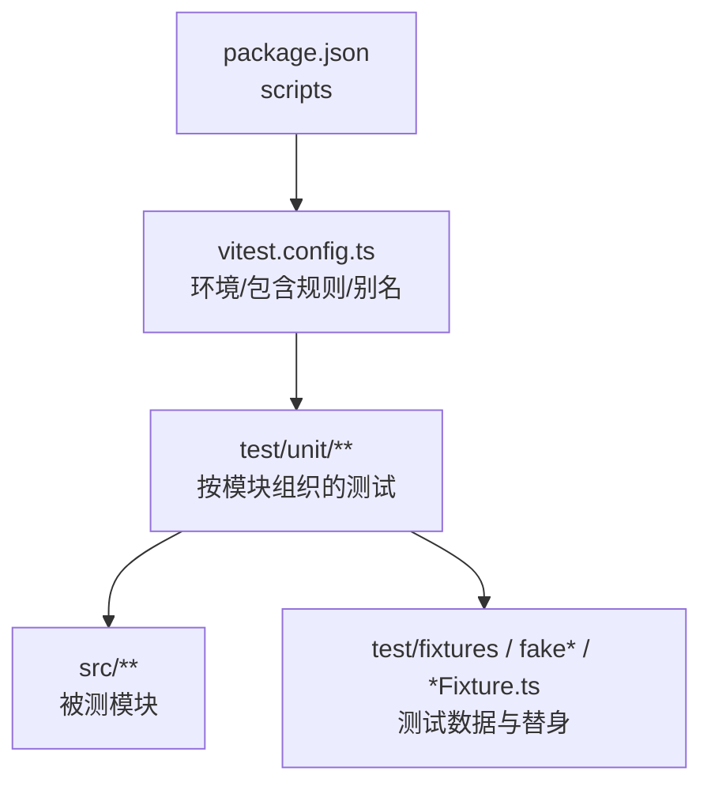
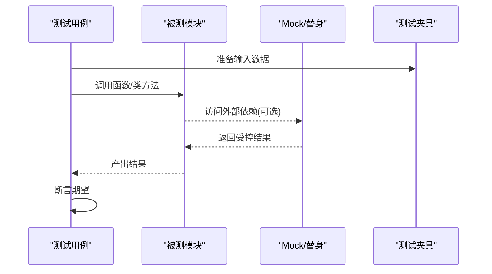
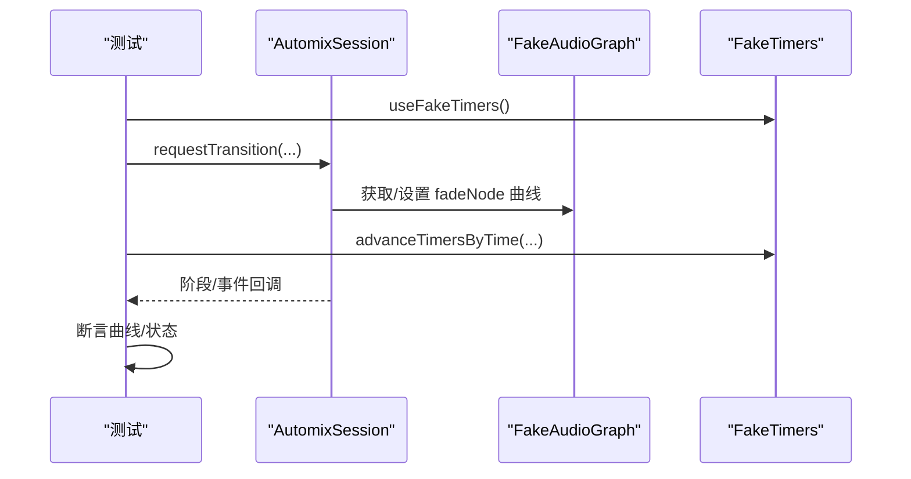
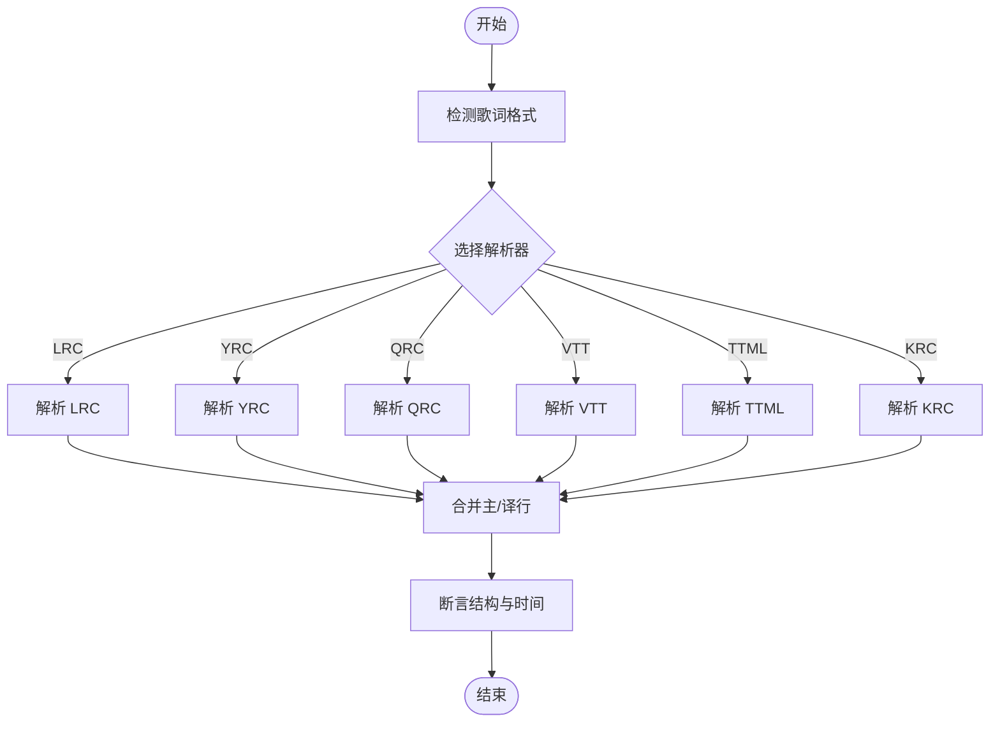
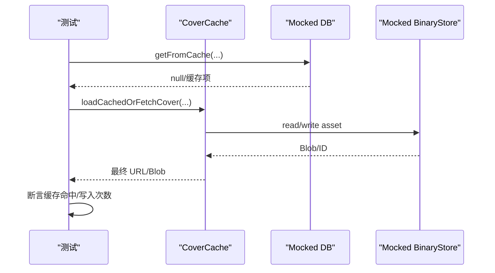
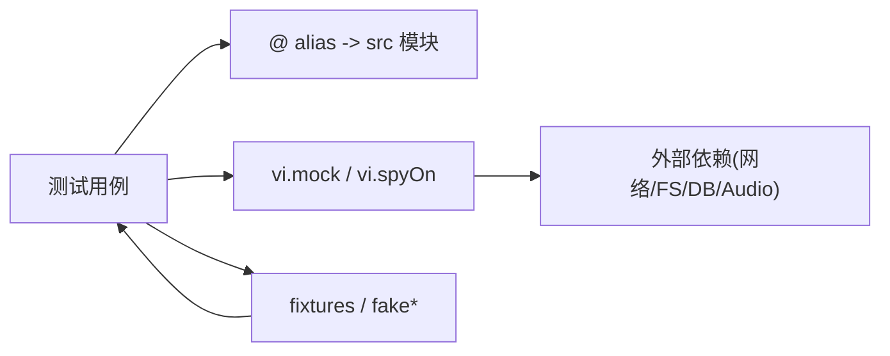

# 单元测试

<cite>
**本文引用的文件**
- [vitest.config.ts](file://vitest.config.ts)
- [package.json](file://package.json)
- [test/unit/automix/automixSession.test.ts](file://test/unit/automix/automixSession.test.ts)
- [test/unit/lyrics/parserCore.test.ts](file://test/unit/lyrics/parserCore.test.ts)
- [test/unit/automix/fakeAudioGraph.ts](file://test/unit/automix/fakeAudioGraph.ts)
- [test/unit/automix/trackProfileFixture.ts](file://test/unit/automix/trackProfileFixture.ts)
- [test/unit/theme/themePreferences.test.ts](file://test/unit/theme/themePreferences.test.ts)
- [test/unit/services/coverCache.test.ts](file://test/unit/services/coverCache.test.ts)
- [test/unit/electron/debugModule.test.ts](file://test/unit/electron/debugModule.test.ts)
- [test/manual/lyrics_benchmark.ts](file://test/manual/lyrics_benchmark.ts)
</cite>

## 目录
1. [简介](#简介)
2. [项目结构](#项目结构)
3. [核心组件](#核心组件)
4. [架构总览](#架构总览)
5. [详细组件分析](#详细组件分析)
6. [依赖关系分析](#依赖关系分析)
7. [性能考虑](#性能考虑)
8. [故障排查指南](#故障排查指南)
9. [结论](#结论)
10. [附录](#附录)

## 简介
本指南面向 Folia Player 的单元测试实践，围绕 Vitest 测试框架在项目中的配置与使用，系统说明测试组织、命名规范、高质量用例设计、断言库用法、Mock 策略、异步测试处理、测试数据管理（fixtures）、覆盖率配置与报告生成，以及性能/基准测试编写方法。文档以仓库现有实现为依据，结合自动化混音、歌词解析器与服务层逻辑等核心模块的具体测试样例进行讲解。

## 项目结构
- 测试根目录：test
  - unit：单元与集成测试，按功能域分目录组织，匹配 src 下的模块结构
  - ui：Playwright UI 测试（截图与交互）
  - manual：手动脚本与基准测试
- 测试入口与命令：通过 package.json scripts 暴露 test/test:unit/test:unit:watch 等命令
- 运行环境：Vitest 配置为 node 环境，仅包含 test/unit/**/*.test.ts

**图表来源**
- [package.json:17-35](file://package.json#L17-L35)
- [vitest.config.ts:7-16](file://vitest.config.ts#L7-L16)

**章节来源**
- [package.json:17-35](file://package.json#L17-L35)
- [vitest.config.ts:7-16](file://vitest.config.ts#L7-L16)

## 核心组件
- 测试框架与命令
  - 使用 Vitest 作为测试运行时，统一在 vitest.config.ts 中定义别名与环境
  - 通过 npm scripts 提供 run/watch 模式，便于开发与 CI
- 测试组织与命名
  - 测试文件位于 test/unit，按 src 模块划分目录，文件名以 .test.ts 结尾
  - 每个测试文件聚焦一个模块或一组相关能力，保持高内聚
- 断言与工具
  - 使用 Vitest 内置 expect、describe、it、beforeEach/afterEach、vi 等
  - 借助 vi.mock/vi.spyOn/vi.useFakeTimers 等进行依赖替换与时钟控制

**章节来源**
- [vitest.config.ts:7-16](file://vitest.config.ts#L7-L16)
- [package.json:17-35](file://package.json#L17-L35)

## 架构总览
下图展示测试执行时各角色之间的关系：测试驱动调用被测模块，必要时通过 Mock 替代外部依赖（网络、文件系统、IndexedDB、Web Audio），并使用 fixtures 构造稳定输入。

[无图表来源；该图为概念性流程示意]

## 详细组件分析

### 自动化混音会话测试（automixSession）
- 目标：验证自动混音从“预启”到“淡入淡出”再到“收尾”的完整状态机，包括节拍对齐、音量均衡、过渡取消与恢复等路径
- 关键要点
  - 使用 vi.useFakeTimers 精确推进时间，避免真实计时带来的不确定性
  - 通过 fakeAudioGraph 模拟 Web Audio 节点与媒体元素，记录自动化事件并断言曲线形状
  - 通过 trackProfileFixture 复用轨道特征数据，减少重复样板
  - 使用 vi.spyOn/console.log 屏蔽日志输出，聚焦行为断言
- 典型断言
  - 阶段切换、活跃 Deck 切换、自动播放暂停标志
  - 淡入淡出曲线时长、起止值、节拍对齐
  - 异常路径：队列变更、尾轨提前结束、取消/中止等

**图表来源**
- [test/unit/automix/automixSession.test.ts:1-120](file://test/unit/automix/automixSession.test.ts#L1-L120)
- [test/unit/automix/fakeAudioGraph.ts:1-191](file://test/unit/automix/fakeAudioGraph.ts#L1-L191)

**章节来源**
- [test/unit/automix/automixSession.test.ts:1-800](file://test/unit/automix/automixSession.test.ts#L1-L800)
- [test/unit/automix/fakeAudioGraph.ts:1-191](file://test/unit/automix/fakeAudioGraph.ts#L1-L191)
- [test/unit/automix/trackProfileFixture.ts:1-39](file://test/unit/automix/trackProfileFixture.ts#L1-L39)

### 歌词解析器测试（parserCore）
- 目标：覆盖多种歌词格式（LRC/YRC/QRC/VTT/TTML/KRC）的解析正确性与边界情况
- 关键要点
  - 使用内联 fixture（字符串片段）构造输入，保证可复现
  - 断言行级时间、词级时间单调递增、翻译/罗马音/背景人声等字段
  - 通过 parseLyricsByFormat 分发不同格式的解析器，验证路由逻辑
- 典型断言
  - 格式识别、元数据提取、重叠 TTML 行合并策略
  - 多语言交替行的拆分与合并
  - 词级时间精度与顺序约束

**图表来源**
- [test/unit/lyrics/parserCore.test.ts:1-396](file://test/unit/lyrics/parserCore.test.ts#L1-L396)

**章节来源**
- [test/unit/lyrics/parserCore.test.ts:1-396](file://test/unit/lyrics/parserCore.test.ts#L1-L396)

### 服务层与存储测试（coverCache、themePreferences）
- coverCache
  - 使用 vi.mock 对数据库与二进制资产存储进行替换，验证缓存命中/失效与迁移逻辑
  - 使用 vi.stubGlobal('fetch') 与 URL.createObjectURL mock 隔离网络与对象 URL
- themePreferences
  - 通过自定义 Storage mock 模拟 localStorage，验证主题偏好持久化与互斥规则
  - 清理全局 window 与本地存储，确保用例间隔离

**图表来源**
- [test/unit/services/coverCache.test.ts:1-38](file://test/unit/services/coverCache.test.ts#L1-L38)
- [test/unit/theme/themePreferences.test.ts:1-43](file://test/unit/theme/themePreferences.test.ts#L1-L43)

**章节来源**
- [test/unit/services/coverCache.test.ts:1-38](file://test/unit/services/coverCache.test.ts#L1-L38)
- [test/unit/theme/themePreferences.test.ts:1-43](file://test/unit/theme/themePreferences.test.ts#L1-L43)

### Electron 调试模块测试（debugModule）
- 目标：验证内存监控与日志写入等 Node/Electron 侧逻辑
- 关键要点
  - 通过 require 引入 CJS 模块，构造符合 Electron 指标结构的样本数据
  - 断言峰值、均值、进程维度统计与平台差异处理
  - 使用 vi.restoreAllMocks 清理 spy/mocks

**章节来源**
- [test/unit/electron/debugModule.test.ts:1-149](file://test/unit/electron/debugModule.test.ts#L1-L149)

## 依赖关系分析
- 测试与源码
  - 测试通过 @ 别名直接导入 src 模块，保持与生产代码一致的模块解析
- 测试与外部依赖
  - 通过 vi.mock 将网络、文件系统、IndexedDB、Web Audio 等替换为可控替身
  - 通过 vi.useFakeTimers 控制时间，使时序敏感逻辑可测
- 测试内部协作
  - 共享 fixtures（如 trackProfileFixture）与 fake 模块（fakeAudioGraph）提升复用度与一致性

**图表来源**
- [vitest.config.ts:7-16](file://vitest.config.ts#L7-L16)
- [test/unit/automix/fakeAudioGraph.ts:1-191](file://test/unit/automix/fakeAudioGraph.ts#L1-L191)
- [test/unit/automix/trackProfileFixture.ts:1-39](file://test/unit/automix/trackProfileFixture.ts#L1-L39)

**章节来源**
- [vitest.config.ts:7-16](file://vitest.config.ts#L7-L16)

## 性能考虑
- 测试执行效率
  - 使用 vi.useFakeTimers 避免真实等待，缩短用例执行时间
  - 合理拆分 describe/it，减少不必要的 setup/teardown
- 资源占用
  - 通过 Mock 避免真实 I/O 与音频渲染，降低 CPU/内存开销
  - 复用 fixtures，减少重复计算
- 基准测试
  - 项目提供 lyrics 基准脚本，用于评估歌词解析性能
  - 建议在持续集成中定期运行，跟踪回归

**章节来源**
- [package.json:29-35](file://package.json#L29-L35)
- [test/manual/lyrics_benchmark.ts:1-200](file://test/manual/lyrics_benchmark.ts#L1-L200)

## 故障排查指南
- 常见问题
  - 异步未等待：确保 await Promise 或使用 done 回调（本项目主要使用 async/await）
  - 定时器未推进：确认是否调用 advanceTimersByTime 或 flushPromises
  - Mock 未生效：检查 vi.mock 的路径与 hoisted 位置，必要时使用 vi.hoisted
  - 全局污染：在 afterEach 中恢复 vi.restoreAllMocks、unstubAllGlobals 与删除全局变量
- 定位技巧
  - 缩小范围：将复杂用例拆分为最小可复现场景
  - 打印中间态：临时启用 console.log 或断言中间变量
  - 对比预期：利用快照或结构化断言快速发现偏差

**章节来源**
- [test/unit/automix/automixSession.test.ts:108-117](file://test/unit/automix/automixSession.test.ts#L108-L117)
- [test/unit/theme/themePreferences.test.ts:27-31](file://test/unit/theme/themePreferences.test.ts#L27-L31)
- [test/unit/services/coverCache.test.ts:29-36](file://test/unit/services/coverCache.test.ts#L29-L36)

## 结论
本项目采用 Vitest + Node 环境的单元测试体系，测试组织清晰、Mock 策略完善、fixtures 复用度高，能够高效覆盖自动化混音、歌词解析与服务层等核心模块。建议继续遵循现有约定，补充覆盖率阈值与报告，并在 CI 中集成基准测试，保障质量与性能双闭环。

## 附录

### 测试配置与运行
- 配置文件
  - 环境：node
  - 包含：test/unit/**/*.test.ts
  - 别名：@ -> src
- 常用命令
  - 运行测试：npm run test / npm run test:unit
  - 监听模式：npm run test:unit:watch
  - UI 测试：npm run test:ui / test:ui:update

**章节来源**
- [vitest.config.ts:7-16](file://vitest.config.ts#L7-L16)
- [package.json:17-35](file://package.json#L17-L35)

### 测试组织与命名规范
- 目录：test/unit 下按 src 模块划分子目录
- 文件：*.test.ts，与源文件同名或语义对应
- 分组：describe 描述模块/能力，it 描述具体用例
- 数据：集中放在 fixtures 或 fake* 文件中，避免散落

**章节来源**
- [test/unit/automix/automixSession.test.ts:1-120](file://test/unit/automix/automixSession.test.ts#L1-L120)
- [test/unit/lyrics/parserCore.test.ts:1-60](file://test/unit/lyrics/parserCore.test.ts#L1-L60)

### 高质量用例设计要点
- 单一职责：每个 it 只验证一个行为或一条路径
- 明确前置条件：beforeEach 中完成初始化与 Mock 设置
- 强断言：不仅断言返回值，还断言副作用（如事件、状态、调用次数）
- 边界与异常：覆盖空值、NaN、Infinity、越界、并发等场景

**章节来源**
- [test/unit/automix/automixSession.test.ts:126-174](file://test/unit/automix/automixSession.test.ts#L126-L174)
- [test/unit/lyrics/parserCore.test.ts:264-395](file://test/unit/lyrics/parserCore.test.ts#L264-L395)

### 断言库与常用 API
- 断言：expect(...).toBe / toEqual / toBeCloseTo / toHaveBeenCalledWith / toThrow 等
- 生命周期：describe / it / beforeEach / afterEach
- 时钟：vi.useFakeTimers / vi.advanceTimersByTime / vi.runOnlyPendingTimers
- Mock：vi.mock / vi.spyOn / vi.fn / vi.hoisted / vi.unstubAllGlobals

**章节来源**
- [test/unit/automix/automixSession.test.ts:1-120](file://test/unit/automix/automixSession.test.ts#L1-L120)
- [test/unit/services/coverCache.test.ts:1-38](file://test/unit/services/coverCache.test.ts#L1-L38)

### Mock 策略
- 外部依赖：网络 fetch、IndexedDB、文件系统、Electron API、Web Audio
- 浏览器环境：window/localStorage/globalThis 等全局对象
- 注意事项：hoist 到顶部、在 afterEach 恢复、避免跨用例污染

**章节来源**
- [test/unit/services/coverCache.test.ts:7-36](file://test/unit/services/coverCache.test.ts#L7-L36)
- [test/unit/theme/themePreferences.test.ts:6-31](file://test/unit/theme/themePreferences.test.ts#L6-L31)

### 异步测试处理
- Promise：使用 async/await 包裹 it，确保 await 完成后再断言
- 定时器：配合 vi.useFakeTimers 与 advanceTimersByTime 推进时间
- 事件循环：必要时 flushPromises 或等待微任务

**章节来源**
- [test/unit/automix/automixSession.test.ts:108-174](file://test/unit/automix/automixSession.test.ts#L108-L174)

### 测试数据管理（fixtures）
- 集中存放：如 trackProfileFixture.ts、内联字符串 fixture
- 复用与扩展：通过 partial 覆盖默认值，减少重复
- 稳定性：固定种子/常量，避免随机性影响断言

**章节来源**
- [test/unit/automix/trackProfileFixture.ts:1-39](file://test/unit/automix/trackProfileFixture.ts#L1-L39)
- [test/unit/lyrics/parserCore.test.ts:21-58](file://test/unit/lyrics/parserCore.test.ts#L21-L58)

### 覆盖率配置与报告
- 当前配置：vitest.config.ts 未显式开启覆盖率
- 建议做法
  - 在 vitest.config.ts 的 test 选项中添加 coverage 配置（如 provider、reporter、thresholds）
  - 在 scripts 中添加 test:coverage 命令，生成 HTML/LCOV 报告
  - 在 CI 中收集并上传覆盖率报告，设置最低阈值

[本节为通用建议，不直接引用具体文件]

### 性能测试与基准测试
- 项目已有基准脚本：test/manual/lyrics_benchmark.ts
- 建议
  - 将关键路径封装为可测量函数
  - 使用多次采样与统计（均值、P95/P99）评估稳定性
  - 在 CI 中定期运行，比较基线变化

**章节来源**
- [package.json:29-35](file://package.json#L29-L35)
- [test/manual/lyrics_benchmark.ts:1-200](file://test/manual/lyrics_benchmark.ts#L1-L200)