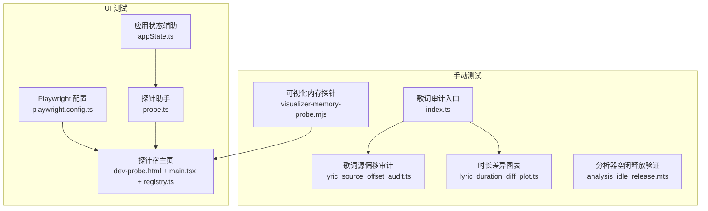
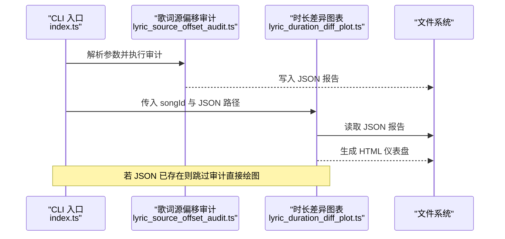
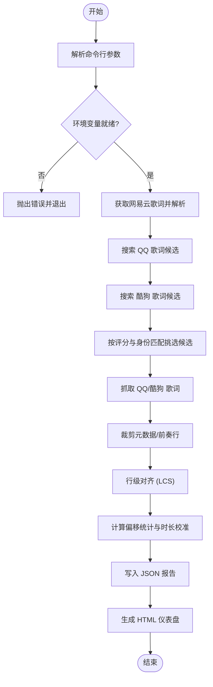
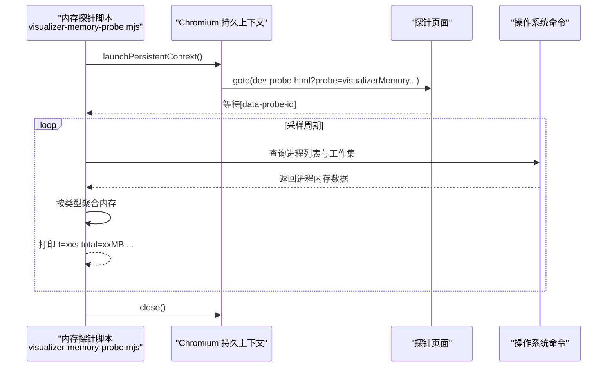
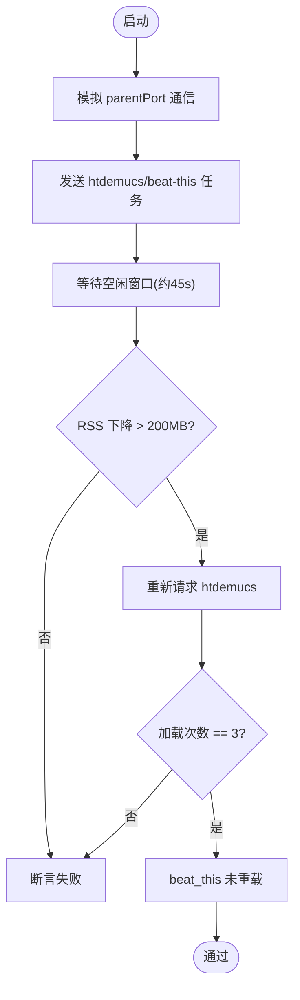
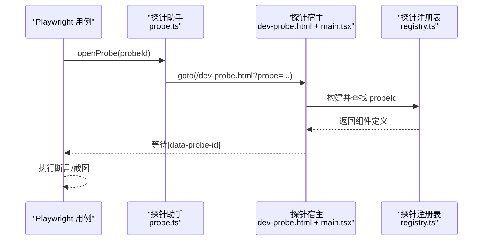
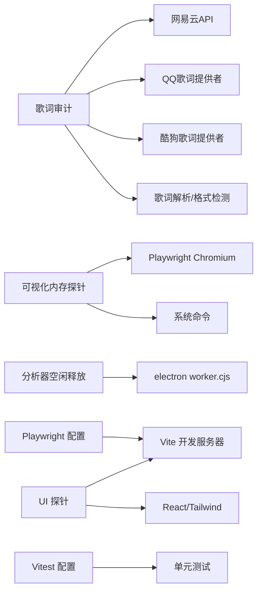

# 测试工具与辅助

<cite>
**本文引用的文件**
- [test/manual/lyric-audit/index.ts](file://test/manual/lyric-audit/index.ts)
- [test/manual/lyric-audit/lyric_source_offset_audit.ts](file://test/manual/lyric-audit/lyric_source_offset_audit.ts)
- [test/manual/lyric-audit/lyric_duration_diff_plot.ts](file://test/manual/lyric-audit/lyric_duration_diff_plot.ts)
- [test/manual/visualizer-memory-probe.mjs](file://test/manual/visualizer-memory-probe.mjs)
- [test/manual/analysis_idle_release.mts](file://test/manual/analysis_idle_release.mts)
- [test/ui/helpers/appState.ts](file://test/ui/helpers/appState.ts)
- [test/ui/helpers/probe.ts](file://test/ui/helpers/probe.ts)
- [dev-probe.html](file://dev-probe.html)
- [dev/probes/main.tsx](file://dev/probes/main.tsx)
- [dev/probes/registry.ts](file://dev/probes/registry.ts)
- [playwright.config.ts](file://playwright.config.ts)
- [vitest.config.ts](file://vitest.config.ts)
</cite>

## 目录
1. [简介](#简介)
2. [项目结构](#项目结构)
3. [核心组件](#核心组件)
4. [架构总览](#架构总览)
5. [详细组件分析](#详细组件分析)
6. [依赖关系分析](#依赖关系分析)
7. [性能考量](#性能考量)
8. [故障排查指南](#故障排查指南)
9. [结论](#结论)
10. [附录](#附录)

## 简介
本指南面向 Folia Player 的测试工具与辅助设施，聚焦以下目标：
- 手动测试与调试工具的使用说明：歌词审计、可视化内存探针、分析器空闲释放验证等。
- 测试数据准备与管理策略：环境隔离、Mock 服务注入、报告输出与复用。
- 日志记录与错误追踪在测试中的应用：控制台捕获、堆栈分析与交互式报告。
- 测试性能分析与内存泄漏检测：进程级采样、GPU/合成层资源观察。
- 自定义测试工具开发示例：波形生成、网络请求拦截、探针扩展等。
- 测试环境配置管理与 CI/CD 集成：Playwright/Vitest 配置、WebServer 启动、并行与超时策略。
- 测试报告生成与结果分析方法：HTML 仪表盘、截图基线对比、Trace 回放。

## 项目结构
测试相关代码主要分布在以下位置：
- test/manual：手动脚本与诊断工具（Node/TS/MJS），用于离线或半在线的数据采集、比对与可视化。
- test/ui：基于 Playwright 的 UI 自动化测试与探针挂载辅助。
- dev/probes：组件级探针注册与最小化宿主页面，便于真实浏览器环境下快速定位问题。
- playwright.config.ts / vitest.config.ts：UI 与单元/集成测试的运行配置。

**图示来源**
- [test/manual/lyric-audit/index.ts:1-103](file://test/manual/lyric-audit/index.ts#L1-L103)
- [test/manual/lyric-audit/lyric_source_offset_audit.ts:1-800](file://test/manual/lyric-audit/lyric_source_offset_audit.ts#L1-L800)
- [test/manual/lyric-audit/lyric_duration_diff_plot.ts:1-499](file://test/manual/lyric-audit/lyric_duration_diff_plot.ts#L1-L499)
- [test/manual/visualizer-memory-probe.mjs:1-158](file://test/manual/visualizer-memory-probe.mjs#L1-L158)
- [test/manual/analysis_idle_release.mts:1-80](file://test/manual/analysis_idle_release.mts#L1-L80)
- [playwright.config.ts:1-52](file://playwright.config.ts#L1-L52)
- [test/ui/helpers/probe.ts:1-24](file://test/ui/helpers/probe.ts#L1-L24)
- [test/ui/helpers/appState.ts:1-19](file://test/ui/helpers/appState.ts#L1-L19)
- [dev-probe.html:1-19](file://dev-probe.html#L1-L19)
- [dev/probes/main.tsx:1-54](file://dev/probes/main.tsx#L1-L54)
- [dev/probes/registry.ts:1-24](file://dev/probes/registry.ts#L1-L24)

**章节来源**
- [test/manual/lyric-audit/index.ts:1-103](file://test/manual/lyric-audit/index.ts#L1-L103)
- [playwright.config.ts:1-52](file://playwright.config.ts#L1-L52)
- [vitest.config.ts:1-18](file://vitest.config.ts#L1-L18)

## 核心组件
- 歌词审计工具链
  - 入口 CLI：解析参数、调用审计与分析、生成 HTML 仪表盘。
  - 歌词源偏移审计：拉取网易云/QQ/酷狗歌词，对齐行并计算时间偏移统计，输出 JSON。
  - 时长差异图表：读取 JSON 报告，生成终端 Markdown 表格与 ECharts 交互 HTML。
- 可视化内存探针
  - 通过 Playwright 启动 Chromium，访问探针页面，按固定间隔采样进程工作集内存，区分 renderer/gpu-process/browser 三类，评估长时间运行的视觉渲染是否存在内存增长。
- 分析器空闲释放验证
  - 模拟 electron worker 通信，触发 htdemucs 与 beat-this 模型加载，等待空闲窗口后断言模型是否被释放且可重新加载，同时监控 RSS 变化。
- UI 探针与自动化
  - 探针宿主页提供最小运行环境，支持 ?probe= 选择单个组件；Playwright 用例通过 helper 打开探针并等待挂载完成。
  - 应用状态辅助从 package.json 读取版本，避免硬编码导致弹窗干扰。

**章节来源**
- [test/manual/lyric-audit/index.ts:1-103](file://test/manual/lyric-audit/index.ts#L1-L103)
- [test/manual/lyric-audit/lyric_source_offset_audit.ts:1-800](file://test/manual/lyric-audit/lyric_source_offset_audit.ts#L1-L800)
- [test/manual/lyric-audit/lyric_duration_diff_plot.ts:1-499](file://test/manual/lyric-audit/lyric_duration_diff_plot.ts#L1-L499)
- [test/manual/visualizer-memory-probe.mjs:1-158](file://test/manual/visualizer-memory-probe.mjs#L1-L158)
- [test/manual/analysis_idle_release.mts:1-80](file://test/manual/analysis_idle_release.mts#L1-L80)
- [test/ui/helpers/probe.ts:1-24](file://test/ui/helpers/probe.ts#L1-L24)
- [test/ui/helpers/appState.ts:1-19](file://test/ui/helpers/appState.ts#L1-L19)
- [dev/probes/main.tsx:1-54](file://dev/probes/main.tsx#L1-L54)
- [dev/probes/registry.ts:1-24](file://dev/probes/registry.ts#L1-L24)

## 架构总览
歌词审计工具链的端到端流程如下：

**图示来源**
- [test/manual/lyric-audit/index.ts:1-103](file://test/manual/lyric-audit/index.ts#L1-L103)
- [test/manual/lyric-audit/lyric_source_offset_audit.ts:1-800](file://test/manual/lyric-audit/lyric_source_offset_audit.ts#L1-L800)
- [test/manual/lyric-audit/lyric_duration_diff_plot.ts:1-499](file://test/manual/lyric-audit/lyric_duration_diff_plot.ts#L1-L499)

## 详细组件分析

### 歌词审计工具链
- 功能要点
  - 命令行参数解析：支持 --out 指定输出路径，默认输出到 lyric-audit-output 目录。
  - 环境加载：从 .env.local 加载环境变量（如 VITE_NETEASE_API_BASE）。
  - 歌词获取与处理：网易云歌词解析、QQ/酷狗搜索与抓取、元数据裁剪与对齐。
  - 对齐算法：基于最长公共子序列（LCS）的行级对齐，阈值过滤。
  - 统计输出：JSON 包含歌曲信息、各源摘要、成对偏移统计、时长校准评估、逐行匹配详情。
  - 可视化：终端 Markdown 表格 + ECharts 交互 HTML（K线图展示起止时间差、柱状图展示时长差）。
- 使用方式
  - 通过 CLI 入口执行，传入 songId 与可选 --out。
  - 若不存在 JSON 报告，先运行审计再绘图；否则直接生成图表。
- 关键实现点
  - 对齐函数：构建 keyedLines，使用 LCS 相似度矩阵与回溯得到匹配映射。
  - 统计函数：均值、中位数、百分位、极值、首尾差值等。
  - 时长校准：比较候选歌曲时长差与歌词时间轴跨度差，判断是否能解释偏移。

**图示来源**
- [test/manual/lyric-audit/index.ts:1-103](file://test/manual/lyric-audit/index.ts#L1-L103)
- [test/manual/lyric-audit/lyric_source_offset_audit.ts:1-800](file://test/manual/lyric-audit/lyric_source_offset_audit.ts#L1-L800)
- [test/manual/lyric-audit/lyric_duration_diff_plot.ts:1-499](file://test/manual/lyric-audit/lyric_duration_diff_plot.ts#L1-L499)

**章节来源**
- [test/manual/lyric-audit/index.ts:1-103](file://test/manual/lyric-audit/index.ts#L1-L103)
- [test/manual/lyric-audit/lyric_source_offset_audit.ts:1-800](file://test/manual/lyric-audit/lyric_source_offset_audit.ts#L1-L800)
- [test/manual/lyric-audit/lyric_duration_diff_plot.ts:1-499](file://test/manual/lyric-audit/lyric_duration_diff_plot.ts#L1-L499)

### 可视化内存探针
- 功能要点
  - 启动 Chromium 持久上下文，访问 dev-probe.html?probe=visualizerMemory&vis=...。
  - 预热阶段：等待着色器编译、字体加载与纹理预热。
  - 采样策略：按平台执行系统命令收集进程树，按 --type= 分类累加内存（renderer/gpu-process/browser）。
  - 输出：每 interval 秒打印一次 total 与各类型内存，结束时汇总区间变化。
- 使用方式
  - 先启动本地开发服务器（端口 4173）。
  - 运行探针脚本，传入 vis、seconds、interval、dpr、query 等参数。
- 注意事项
  - headless 模式无真实 GPU 合成，gpu-process 指标参考意义有限；需 headed 对比 GPU 内存。
  - 通过 user-data-dir 唯一标记圈定本次进程树，避免污染其他 Chrome 实例。

**图示来源**
- [test/manual/visualizer-memory-probe.mjs:1-158](file://test/manual/visualizer-memory-probe.mjs#L1-L158)
- [dev-probe.html:1-19](file://dev-probe.html#L1-L19)

**章节来源**
- [test/manual/visualizer-memory-probe.mjs:1-158](file://test/manual/visualizer-memory-probe.mjs#L1-L158)

### 分析器空闲释放验证
- 功能要点
  - 模拟 electron worker 的 parentPort 通信，向 worker 发送 htdemucs 与 beat-this 任务。
  - 监听“weights loaded”日志，记录模型加载次数。
  - 等待空闲扫描窗口（约 45 秒），断言 RSS 下降（模型释放）并可重新加载。
  - 确保带截止时间的模型（beat-this）未被意外重载。
- 使用方式
  - 通过 npm run manual:analysis-idle 执行。
  - 需要真实模型权重（gitignored），因此不适合常规测试套件。

**图示来源**
- [test/manual/analysis_idle_release.mts:1-80](file://test/manual/analysis_idle_release.mts#L1-L80)

**章节来源**
- [test/manual/analysis_idle_release.mts:1-80](file://test/manual/analysis_idle_release.mts#L1-L80)

### UI 探针与自动化
- 探针宿主
  - dev-probe.html 引入 /dev/probes/main.tsx，根据 URL 参数 ?probe= 动态挂载对应组件。
  - registry.ts 自动发现 *.probe.tsx 并构建注册表，禁止重复 id。
  - main.tsx 在 React.StrictMode 下渲染，便于复现 StrictMode 双调用问题。
- Playwright 辅助
  - probe.ts 打开探针页，预先清理 localStorage 并设置 i18n、static_mode 与引导版本键，避免弹窗干扰。
  - appState.ts 从 package.json 读取版本号，避免硬编码导致弹窗拦截点击。
- 用例示例
  - devProbe.spec.ts 验证探针页面滚动行为，确保内容超出视口时可滚动。

**图示来源**
- [test/ui/helpers/probe.ts:1-24](file://test/ui/helpers/probe.ts#L1-L24)
- [dev-probe.html:1-19](file://dev-probe.html#L1-L19)
- [dev/probes/main.tsx:1-54](file://dev/probes/main.tsx#L1-L54)
- [dev/probes/registry.ts:1-24](file://dev/probes/registry.ts#L1-L24)

**章节来源**
- [test/ui/helpers/probe.ts:1-24](file://test/ui/helpers/probe.ts#L1-L24)
- [test/ui/helpers/appState.ts:1-19](file://test/ui/helpers/appState.ts#L1-L19)
- [dev/probes/main.tsx:1-54](file://dev/probes/main.tsx#L1-L54)
- [dev/probes/registry.ts:1-24](file://dev/probes/registry.ts#L1-L24)
- [test/ui/devProbe.spec.ts:1-16](file://test/ui/devProbe.spec.ts#L1-L16)

## 依赖关系分析
- 运行时依赖
  - 歌词审计：依赖网易云 API Base、QQ/酷狗歌词提供者、歌词解析与格式检测模块。
  - 可视化内存探针：依赖 Playwright Chromium、系统命令（PowerShell/ps）。
  - 分析器空闲释放：依赖 electron worker.cjs 的通信契约与模型权重。
  - UI 探针：依赖 Vite 开发服务器、React、Tailwind 样式。
- 测试框架与配置
  - Playwright：webServer 启动 dev 服务，注入 __mock_netease__，设置视口、超时、截图容差、Trace 策略。
  - Vitest：Node 环境，别名 @ -> src，包含 test/unit/**/*.test.ts。

**图示来源**
- [test/manual/lyric-audit/lyric_source_offset_audit.ts:1-800](file://test/manual/lyric-audit/lyric_source_offset_audit.ts#L1-L800)
- [test/manual/visualizer-memory-probe.mjs:1-158](file://test/manual/visualizer-memory-probe.mjs#L1-L158)
- [test/manual/analysis_idle_release.mts:1-80](file://test/manual/analysis_idle_release.mts#L1-L80)
- [playwright.config.ts:1-52](file://playwright.config.ts#L1-L52)
- [vitest.config.ts:1-18](file://vitest.config.ts#L1-L18)

**章节来源**
- [playwright.config.ts:1-52](file://playwright.config.ts#L1-L52)
- [vitest.config.ts:1-18](file://vitest.config.ts#L1-L18)

## 性能考量
- 歌词审计
  - LCS 对齐复杂度 O(mn)，适合中等规模歌词；可通过归一化文本减少噪声。
  - 批量抓取与异步导入降低冷启动开销。
- 可视化内存探针
  - 采样频率与持续时间影响准确性与耗时；建议预热后采样，避免初始波动。
  - headed 模式更贴近真实 GPU 合成场景；headless 仅适用于 CPU/JS 堆趋势。
- 分析器空闲释放
  - 等待空闲窗口需覆盖调度周期；RSS 断言阈值应保守以避免误判。
- UI 测试
  - 截图容差 maxDiffPixels 缓解抗锯齿/过渡抖动；trace on-first-retry 便于失败回放。
  - webServer reuseExistingServer 提升多次运行效率。

[本节为通用指导，不直接分析具体文件]

## 故障排查指南
- 歌词审计
  - 缺少环境变量：确保 .env.local 或导出 VITE_NETEASE_API_BASE。
  - 无可用候选：检查 QQ/酷狗搜索结果与身份匹配逻辑，调整阈值或搜索词。
  - 对齐失败：确认归一化文本策略与前奏/元数据裁剪是否正确。
- 可视化内存探针
  - 无法连接 dev 服务：确认本地端口 4173 已启动且可访问。
  - GPU 指标异常：使用 headed 模式；注意 headless 无真实 GPU 合成。
  - 进程树污染：确保 user-data-dir 唯一，避免与其他 Chrome 实例混淆。
- 分析器空闲释放
  - 模型权重缺失：需准备 models 目录；该脚本不适合频繁运行。
  - RSS 未下降：检查空闲扫描周期与模型释放条件；必要时延长等待时间。
- UI 探针
  - 探针未挂载：检查 URL 参数与 registry 是否包含对应 id。
  - 弹窗干扰：确保 localStorage 已清理并设置引导版本键。

**章节来源**
- [test/manual/lyric-audit/lyric_source_offset_audit.ts:1-800](file://test/manual/lyric-audit/lyric_source_offset_audit.ts#L1-L800)
- [test/manual/visualizer-memory-probe.mjs:1-158](file://test/manual/visualizer-memory-probe.mjs#L1-L158)
- [test/manual/analysis_idle_release.mts:1-80](file://test/manual/analysis_idle_release.mts#L1-L80)
- [test/ui/helpers/probe.ts:1-24](file://test/ui/helpers/probe.ts#L1-L24)

## 结论
Folia Player 的测试工具与辅助设施覆盖了从歌词质量审计、可视化内存诊断到 UI 回归的全链路需求。通过 CLI 驱动的歌词审计与交互式 HTML 报告，开发者可快速定位多源歌词的时间偏差与时长不一致问题；可视化内存探针帮助识别长时渲染中的内存增长风险；分析器空闲释放验证确保重型模型在空闲时被正确释放与按需重载；UI 探针与 Playwright 配置提供了稳定高效的组件级回归能力。结合合理的测试环境与报告策略，可在保证质量的同时提升迭代效率。

[本节为总结性内容，不直接分析具体文件]

## 附录
- 常用命令与用法
  - 歌词审计：npm run audit:lyrics-sources -- <songId> [--out <path>]
  - 可视化内存探针：npm run manual:visualizer-memory -- --vis <name> [--seconds <s>] [--headed|--headless]
  - 分析器空闲释放：npm run manual:analysis-idle
  - UI 测试：playwright test（自动启动 webServer 并注入 Mock）
  - 单元测试：vitest（Node 环境，别名 @ -> src）
- 报告与产物
  - 歌词审计 JSON：test/manual/lyric-audit-output/<songId>.json
  - 歌词审计 HTML：test/manual/lyric-audit-output/lyric_duration_chart_<songId>.html
  - Playwright Trace：on-first-retry 自动生成，便于失败回放
  - 截图基线：test/ui/app.screenshot.spec.ts-snapshots/*

[本节为补充信息，不直接分析具体文件]