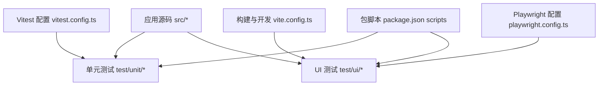
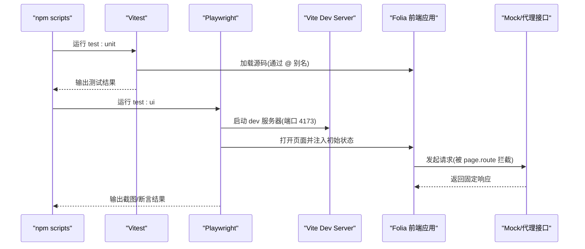
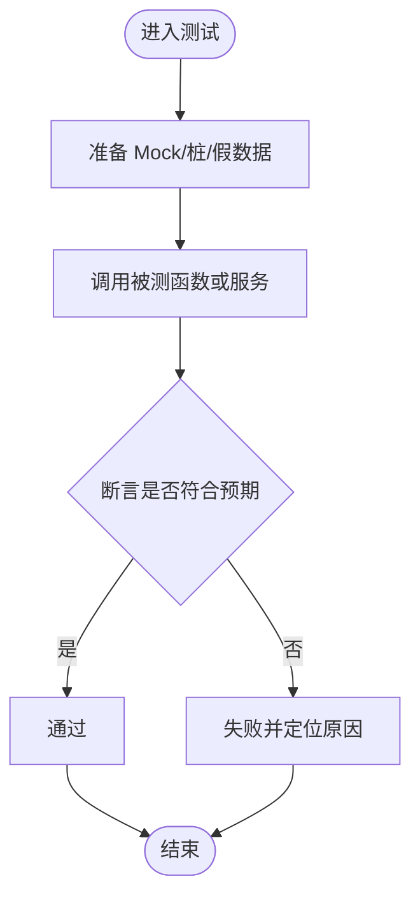
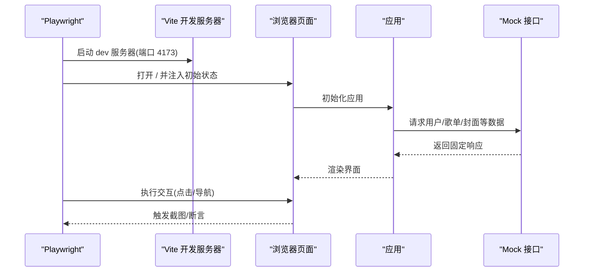
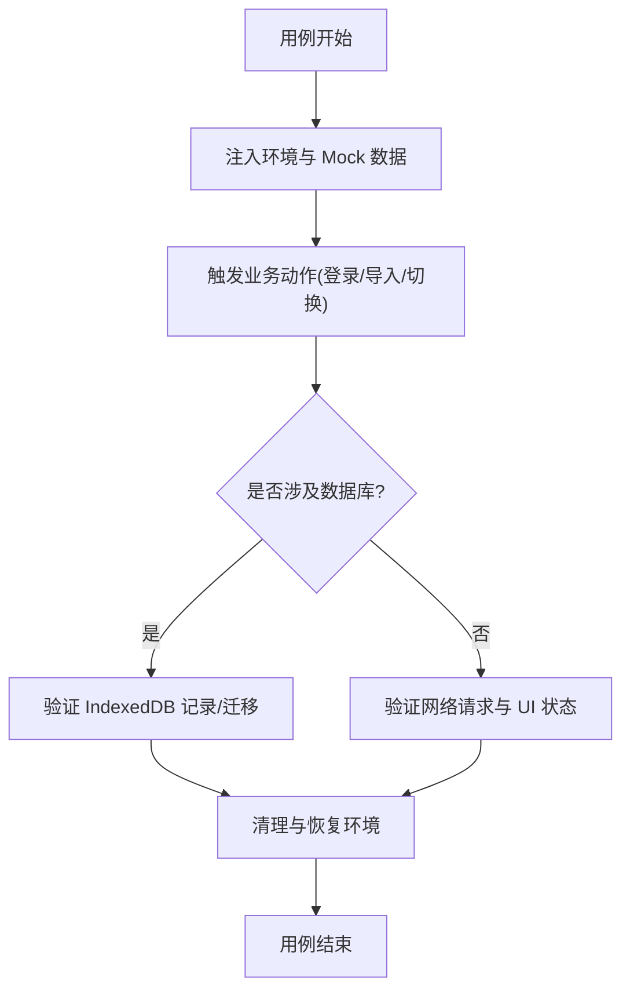
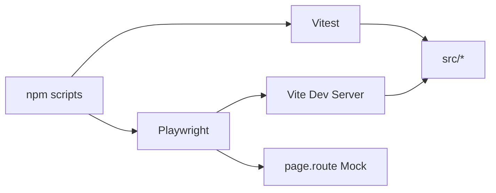

# 测试策略与实践

<cite>
**本文引用的文件**
- [vitest.config.ts](file://vitest.config.ts)
- [playwright.config.ts](file://playwright.config.ts)
- [package.json](file://package.json)
- [vite.config.ts](file://vite.config.ts)
- [test/ui/app.screenshot.spec.ts](file://test/ui/app.screenshot.spec.ts)
- [test/ui/helpers/appState.ts](file://test/ui/helpers/appState.ts)
- [test/ui/helpers/probe.ts](file://test/ui/helpers/probe.ts)
- [test/unit/automix/automixSession.test.ts](file://test/unit/automix/automixSession.test.ts)
- [test/unit/services/coverCache.test.ts](file://test/unit/services/coverCache.test.ts)
- [test/unit/services/localCoverAssetService.test.ts](file://test/unit/services/localCoverAssetService.test.ts)
- [test/unit/hooks/themeControllerState.test.ts](file://test/unit/hooks/themeControllerState.test.ts)
- [test/unit/sync/syncSchema.test.ts](file://test/unit/sync/syncSchema.test.ts)
- [test/unit/onlineMusic/neteaseProvider.test.ts](file://test/unit/onlineMusic/neteaseProvider.test.ts)
- [.github/workflows/pr-unit-tests.yml](file://.github/workflows/pr-unit-tests.yml)
</cite>

## 目录
1. [简介](#简介)
2. [项目结构](#项目结构)
3. [核心组件](#核心组件)
4. [架构总览](#架构总览)
5. [详细组件分析](#详细组件分析)
6. [依赖关系分析](#依赖关系分析)
7. [性能考虑](#性能考虑)
8. [故障排查指南](#故障排查指南)
9. [结论](#结论)
10. [附录](#附录)

## 简介
本指南面向 Folia Player 的测试策略与工程实践，覆盖单元测试（Vitest）、UI 测试（Playwright）与集成测试的编写方法、数据管理、覆盖率要求与报告生成，以及持续集成中的执行流程。文档基于仓库现有配置与用例进行提炼，帮助团队在复杂音频与 UI 场景中稳定地验证功能与回归问题。

## 项目结构
Folia Player 将测试代码按类型分层组织：
- 单元测试：位于 test/unit，使用 Vitest，聚焦业务逻辑、服务层与工具函数。
- UI 测试：位于 test/ui，使用 Playwright，覆盖页面交互与截图对比。
- 手动脚本：位于 test/manual，用于人工验证或基准测试。

**图表来源**
- [vite.config.ts:193-275](file://vite.config.ts#L193-L275)
- [vitest.config.ts:7-17](file://vitest.config.ts#L7-L17)
- [playwright.config.ts:16-51](file://playwright.config.ts#L16-L51)
- [package.json:17-35](file://package.json#L17-L35)

**章节来源**
- [vitest.config.ts:7-17](file://vitest.config.ts#L7-L17)
- [playwright.config.ts:16-51](file://playwright.config.ts#L16-L51)
- [package.json:17-35](file://package.json#L17-L35)
- [vite.config.ts:193-275](file://vite.config.ts#L193-L275)

## 核心组件
- 单元测试框架（Vitest）
  - 环境：node 环境运行，便于隔离外部依赖。
  - 匹配规则：仅扫描 test/unit/**/*.test.ts。
  - 别名：@ 指向 src，方便导入源码模块。
- UI 测试框架（Playwright）
  - 测试目录：test/ui。
  - 浏览器：Chromium，支持自定义可执行路径与启动参数。
  - 基线容差：toHaveScreenshot 允许一定像素差异以缓解渲染抖动。
  - WebServer：通过 Vite 启动本地开发服务器并复用端口，注入 NetEase 代理地址。
- 构建与运行时注入
  - Vite define 注入 __APP_VERSION__ 等常量，供测试读取与应用内版本判断。
  - 探针页 /dev-probe.html 提供轻量级组件挂载点，便于快速回归特定 UI 行为。

**章节来源**
- [vitest.config.ts:7-17](file://vitest.config.ts#L7-L17)
- [playwright.config.ts:16-51](file://playwright.config.ts#L16-L51)
- [vite.config.ts:261-268](file://vite.config.ts#L261-L268)
- [test/ui/helpers/appState.ts:6-19](file://test/ui/helpers/appState.ts#L6-L19)
- [test/ui/helpers/probe.ts:6-23](file://test/ui/helpers/probe.ts#L6-L23)

## 架构总览
下图展示从测试入口到被测应用的调用链与关键依赖：

**图表来源**
- [package.json:17-35](file://package.json#L17-L35)
- [vitest.config.ts:7-17](file://vitest.config.ts#L7-L17)
- [playwright.config.ts:16-51](file://playwright.config.ts#L16-L51)
- [vite.config.ts:193-275](file://vite.config.ts#L193-L275)

## 详细组件分析

### 单元测试（Vitest）
- 配置要点
  - 环境为 node，适合纯逻辑与服务层测试。
  - include 限定 test/unit/**/*.test.ts，避免误测其他目录。
  - 使用 @ 别名简化 import。
- Mock 策略
  - 使用 vi.mock/vi.hoisted/vi.spyOn 对模块与全局进行替换。
  - 针对 IndexedDB、Worker、localStorage 等环境能力进行模拟或桩化。
- 异步测试处理
  - 使用 Promise 与 async/await；必要时配合 vi.useFakeTimers 控制时间推进。
- 典型场景示例
  - 歌词设置器过滤与合唱检测：见 [createLyricsSetter 测试](file://test/unit/lyrics/createLyricsSetter.test.ts)。
  - Automix 会话状态机：见 [automixSession 测试](file://test/unit/automix/automixSession.test.ts)，覆盖预取、过渡、节拍对齐、音量均衡等路径。
  - 封面缓存降级与迁移：见 [coverCache 测试](file://test/unit/services/coverCache.test.ts)。
  - 本地封面资产去重与持久化：见 [localCoverAssetService 测试](file://test/unit/services/localCoverAssetService.test.ts)。
  - 主题控制器状态构建：见 [themeControllerState 测试](file://test/unit/hooks/themeControllerState.test.ts)。
  - 同步 Schema 解析健壮性：见 [syncSchema 测试](file://test/unit/sync/syncSchema.test.ts)。
  - 在线音乐 Provider 映射与增益处理：见 [neteaseProvider 测试](file://test/unit/onlineMusic/neteaseProvider.test.ts)。

**图表来源**
- [test/unit/automix/automixSession.test.ts:108-117](file://test/unit/automix/automixSession.test.ts#L108-L117)
- [test/unit/services/coverCache.test.ts:29-36](file://test/unit/services/coverCache.test.ts#L29-L36)
- [test/unit/services/localCoverAssetService.test.ts:1-31](file://test/unit/services/localCoverAssetService.test.ts#L1-L31)

**章节来源**
- [vitest.config.ts:7-17](file://vitest.config.ts#L7-L17)
- [test/unit/automix/automixSession.test.ts:108-117](file://test/unit/automix/automixSession.test.ts#L108-L117)
- [test/unit/services/coverCache.test.ts:29-36](file://test/unit/services/coverCache.test.ts#L29-L36)
- [test/unit/services/localCoverAssetService.test.ts:1-31](file://test/unit/services/localCoverAssetService.test.ts#L1-L31)
- [test/unit/hooks/themeControllerState.test.ts:27-41](file://test/unit/hooks/themeControllerState.test.ts#L27-L41)
- [test/unit/sync/syncSchema.test.ts:15-34](file://test/unit/sync/syncSchema.test.ts#L15-L34)
- [test/unit/onlineMusic/neteaseProvider.test.ts:39-69](file://test/unit/onlineMusic/neteaseProvider.test.ts#L39-L69)

### UI 测试（Playwright）
- 配置要点
  - 测试目录 test/ui，禁用并行，统一 reporter 与超时。
  - toHaveScreenshot 设置 maxDiffPixels 容忍渲染抖动。
  - webServer 启动 Vite 并注入环境变量，复用已有服务器实例。
- 页面交互测试
  - 通过 page.route 拦截网络请求，返回固定 JSON/SVG 等响应，确保稳定性。
  - 使用 addInitScript 注入 localStorage、matchMedia、electron 等环境，保证一致状态。
- 截图对比测试
  - 使用 toHaveScreenshot 捕获全页截图，关闭动画、CSS 缩放，隐藏 canvas 以避免随机纹理影响基线。
- 探针页辅助
  - 通过 helpers/probe.ts 打开 /dev-probe.html?probe=...，快速挂载单一组件进行回归。

**图表来源**
- [playwright.config.ts:16-51](file://playwright.config.ts#L16-L51)
- [test/ui/app.screenshot.spec.ts:177-397](file://test/ui/app.screenshot.spec.ts#L177-L397)
- [test/ui/app.screenshot.spec.ts:399-585](file://test/ui/app.screenshot.spec.ts#L399-L585)
- [test/ui/app.screenshot.spec.ts:587-673](file://test/ui/app.screenshot.spec.ts#L587-L673)
- [test/ui/helpers/probe.ts:6-23](file://test/ui/helpers/probe.ts#L6-L23)

**章节来源**
- [playwright.config.ts:16-51](file://playwright.config.ts#L16-L51)
- [test/ui/app.screenshot.spec.ts:177-397](file://test/ui/app.screenshot.spec.ts#L177-L397)
- [test/ui/app.screenshot.spec.ts:399-585](file://test/ui/app.screenshot.spec.ts#L399-L585)
- [test/ui/app.screenshot.spec.ts:587-673](file://test/ui/app.screenshot.spec.ts#L587-L673)
- [test/ui/helpers/appState.ts:6-19](file://test/ui/helpers/appState.ts#L6-L19)
- [test/ui/helpers/probe.ts:6-23](file://test/ui/helpers/probe.ts#L6-L23)

### 集成测试（服务间通信与数据库操作）
- 服务间通信测试
  - 通过 page.route 拦截第三方 API（如 NetEase、Navidrome），构造完整链路响应，验证前端对多源数据的整合与渲染。
  - 示例：登录流程、二维码登录、歌单与云盘数据加载、Navi 库视图切换等。
- 数据库操作测试
  - 使用 fake-indexeddb 在 Node 环境下模拟 IndexedDB，验证本地封面资产的去重、写入与迁移。
  - 结合 appDatabase.delete() 清理，确保用例隔离。

**图表来源**
- [test/ui/app.screenshot.spec.ts:177-397](file://test/ui/app.screenshot.spec.ts#L177-L397)
- [test/ui/app.screenshot.spec.ts:399-585](file://test/ui/app.screenshot.spec.ts#L399-L585)
- [test/unit/services/localCoverAssetService.test.ts:1-31](file://test/unit/services/localCoverAssetService.test.ts#L1-L31)

**章节来源**
- [test/ui/app.screenshot.spec.ts:177-397](file://test/ui/app.screenshot.spec.ts#L177-L397)
- [test/ui/app.screenshot.spec.ts:399-585](file://test/ui/app.screenshot.spec.ts#L399-L585)
- [test/unit/services/localCoverAssetService.test.ts:1-31](file://test/unit/services/localCoverAssetService.test.ts#L1-L31)

### 测试数据管理策略
- 准备
  - 使用 fixtures 定义稳定的用户、歌单、专辑、艺术家、随机歌曲等数据结构。
  - 通过 page.route 返回固定 JSON/SVG，避免真实网络波动。
- 清理
  - 每个用例开始前 clear localStorage，设置必要键值（语言、引导版本、静态模式等）。
  - 在 UI 测试中隐藏 canvas 并禁用动画，减少渲染差异。
- 隔离
  - 使用 addInitScript 在页面加载前注入环境，避免跨用例污染。
  - 在单元层面使用 vi.restoreAllMocks、vi.clearAllMocks、appDatabase.delete() 确保干净状态。

**章节来源**
- [test/ui/app.screenshot.spec.ts:177-397](file://test/ui/app.screenshot.spec.ts#L177-L397)
- [test/ui/app.screenshot.spec.ts:399-585](file://test/ui/app.screenshot.spec.ts#L399-L585)
- [test/unit/services/localCoverAssetService.test.ts:73-77](file://test/unit/services/localCoverAssetService.test.ts#L73-L77)

### 覆盖率要求与报告生成
- 当前仓库未包含 Vitest 覆盖率配置与报告命令。建议后续在 vitest.config.ts 中启用 coverage 并提供 npm script，以便在 CI 中生成覆盖率报告。
- 若需截图基线管理，可在 Playwright 中使用 --update-snapshots 更新基线图片。

[本节为通用指导，不直接分析具体文件]

### 常见测试场景示例
- 组件渲染测试
  - 使用探针页快速挂载单一组件，验证渲染与交互。参考 [openProbe:13-23](file://test/ui/helpers/probe.ts#L13-L23)。
- API 调用测试
  - 通过 page.route 拦截并返回固定响应，验证前端处理逻辑。参考 [mockNeteaseApi:399-468](file://test/ui/app.screenshot.spec.ts#L399-L468)、[mockNavidromeApi:470-585](file://test/ui/app.screenshot.spec.ts#L470-L585)。
- 状态管理测试
  - 使用 vi.mock 与 vi.spyOn 验证 store 行为与副作用。参考 [automixSession 测试:108-117](file://test/unit/automix/automixSession.test.ts#L108-L117)。

**章节来源**
- [test/ui/helpers/probe.ts:13-23](file://test/ui/helpers/probe.ts#L13-L23)
- [test/ui/app.screenshot.spec.ts:399-468](file://test/ui/app.screenshot.spec.ts#L399-L468)
- [test/ui/app.screenshot.spec.ts:470-585](file://test/ui/app.screenshot.spec.ts#L470-L585)
- [test/unit/automix/automixSession.test.ts:108-117](file://test/unit/automix/automixSession.test.ts#L108-L117)

## 依赖关系分析
- 测试与构建依赖
  - package.json 提供 test/test:unit/test:ui 等脚本，串联 Vitest 与 Playwright。
  - Vite 注入 __APP_VERSION__ 等常量，供测试读取与应用内版本判断。
- 测试与外部服务
  - Playwright 通过 webServer 启动 Vite，并在测试中拦截第三方 API，形成“前端 + 本地 Mock”的集成闭环。
- 潜在循环依赖
  - 测试文件仅依赖源码与测试工具，未见循环引用；注意在 mock 时避免引入被测模块自身导致循环。

**图表来源**
- [package.json:17-35](file://package.json#L17-L35)
- [vite.config.ts:261-268](file://vite.config.ts#L261-L268)
- [playwright.config.ts:16-51](file://playwright.config.ts#L16-L51)

**章节来源**
- [package.json:17-35](file://package.json#L17-L35)
- [vite.config.ts:261-268](file://vite.config.ts#L261-L268)
- [playwright.config.ts:16-51](file://playwright.config.ts#L16-L51)

## 性能考虑
- 单元测试
  - 使用 vi.useFakeTimers 控制时间，避免真实等待；合理拆分 describe/it，提升并行度。
  - 对 I/O 与网络进行 Mock，减少外部依赖带来的不确定性。
- UI 测试
  - 禁用动画、隐藏 canvas，降低截图差异；设置合理的 maxDiffPixels 容忍渲染抖动。
  - 复用 webServer 实例，减少启动开销。
- 资源与内存
  - 在自动化混音等重型逻辑测试中，谨慎创建大对象；必要时限制并发与计时推进步长。

[本节为通用指导，不直接分析具体文件]

## 故障排查指南
- 截图不一致
  - 检查是否启用了动画或存在随机纹理；确认已隐藏 canvas 并禁用动画。
  - 调整 maxDiffPixels 或更新基线图片。
- 网络请求不稳定
  - 确保 page.route 正确拦截目标 URL；核对 endpoint 与响应体结构。
- 环境差异
  - 使用 addInitScript 注入 localStorage、matchMedia、electron 等；确保语言与引导版本一致。
- 数据库状态污染
  - 在 afterEach 中调用 appDatabase.delete() 或清除相关存储；确保用例隔离。

**章节来源**
- [playwright.config.ts:21-28](file://playwright.config.ts#L21-L28)
- [test/ui/app.screenshot.spec.ts:587-603](file://test/ui/app.screenshot.spec.ts#L587-L603)
- [test/unit/services/localCoverAssetService.test.ts:73-77](file://test/unit/services/localCoverAssetService.test.ts#L73-L77)

## 结论
本项目已形成清晰的测试分层：Vitest 负责单元与逻辑验证，Playwright 负责端到端交互与视觉回归，辅以探针页与丰富的 Mock 策略，能够在复杂音频与 UI 场景中稳定保障质量。建议在后续迭代中补充覆盖率配置与报告，完善 CI 中的测试门禁，进一步提升交付可靠性。

[本节为总结，不直接分析具体文件]

## 附录
- 持续集成中的测试执行流程
  - PR 阶段通常执行单元测试，确保核心逻辑不受破坏。
  - UI 测试可在独立任务中运行，关注截图基线与交互稳定性。
  - 建议在 PR 工作流中增加覆盖率阈值与截图基线校验。

**章节来源**
- [.github/workflows/pr-unit-tests.yml](file://.github/workflows/pr-unit-tests.yml)