# 集成测试

<cite>
**本文引用的文件**
- [playwright.config.ts](file://playwright.config.ts)
- [vitest.config.ts](file://vitest.config.ts)
- [app.screenshot.spec.ts](file://test/ui/app.screenshot.spec.ts)
- [lyricApi.test.ts](file://test/unit/electron/lyricApi.test.ts)
- [stageApi.test.ts](file://test/unit/stage/stageApi.test.ts)
- [appDatabaseMigration.test.ts](file://test/unit/services/appDatabaseMigration.test.ts)
- [dbDexieCompatibility.test.ts](file://test/unit/services/dbDexieCompatibility.test.ts)
- [localCoverAssetService.test.ts](file://test/unit/services/localCoverAssetService.test.ts)
- [localLibraryDirectoryTree.test.ts](file://test/unit/services/localLibraryDirectoryTree.test.ts)
- [omni.test.ts](file://test/unit/onlineMusic/omni.test.ts)
- [onlineProviderAccountView.test.ts](file://test/unit/onlineMusic/onlineProviderAccountView.test.ts)
- [localSongMetadataMatchService.test.ts](file://test/unit/localLibrary/localSongMetadataMatchService.test.ts)
- [IntegrationSettingsSubview.tsx](file://src/components/modal/settings/IntegrationSettingsSubview.tsx)
- [StorageSettingsSection.tsx](file://src/components/modal/settings/StorageSettingsSection.tsx)
- [localMusicService.ts](file://src/services/localMusicService.ts)
- [themeSyncRegistry.ts](file://src/services/sync/themeSyncRegistry.ts)
- [db.ts](file://src/services/db.ts)
- [vite-env.d.ts](file://src/vite-env.d.ts)
</cite>

## 目录
1. [简介](#简介)
2. [项目结构](#项目结构)
3. [核心组件](#核心组件)
4. [架构总览](#架构总览)
5. [详细组件分析](#详细组件分析)
6. [依赖关系分析](#依赖关系分析)
7. [性能考量](#性能考量)
8. [故障排查指南](#故障排查指南)
9. [结论](#结论)
10. [附录](#附录)

## 简介
本指南面向Folia Player的集成测试，覆盖服务间通信、数据库操作、外部API调用、Electron主进程与渲染进程通信、在线音乐提供商集成、本地文件系统操作、复杂业务流程（搜索播放、歌词匹配、主题切换）、数据库迁移与一致性验证，以及分布式系统与微服务接口测试策略。文档基于仓库现有测试配置与用例进行归纳，提供可操作的实践方法与可视化流程说明。

## 项目结构
Folia Player采用分层与按功能域组织代码的方式：
- 前端UI与业务逻辑位于 src/
- Electron主进程相关能力位于 electron/
- 测试分为三类：
  - UI端到端测试：test/ui（Playwright）
  - 单元与集成测试：test/unit（Vitest）
  - 手工/探索性脚本：test/manual
- 测试配置：
  - Playwright：playwright.config.ts
  - Vitest：vitest.config.ts

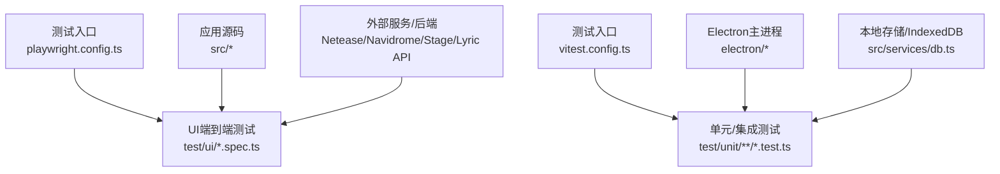

图表来源
- [playwright.config.ts:1-52](file://playwright.config.ts#L1-L52)
- [vitest.config.ts:1-18](file://vitest.config.ts#L1-L18)

章节来源
- [playwright.config.ts:1-52](file://playwright.config.ts#L1-L52)
- [vitest.config.ts:1-18](file://vitest.config.ts#L1-L18)

## 核心组件
- 测试框架与运行环境
  - Playwright：启动开发服务器、拦截网络请求、截图断言、注入初始状态
  - Vitest：Node环境执行单元测试，支持模块mock与IndexedDB模拟
- 关键被测对象
  - 在线音乐提供商聚合层（omni）
  - 本地库目录树构建
  - 封面资产迁移与去重
  - 桌面歌词API与Stage API
  - 应用数据库迁移与兼容层
  - 设置页集成测试入口（连接测试、同步配置）

章节来源
- [app.screenshot.spec.ts:1-673](file://test/ui/app.screenshot.spec.ts#L1-L673)
- [lyricApi.test.ts:1-111](file://test/unit/electron/lyricApi.test.ts#L1-L111)
- [stageApi.test.ts:1-43](file://test/unit/stage/stageApi.test.ts#L1-L43)
- [appDatabaseMigration.test.ts:1-130](file://test/unit/services/appDatabaseMigration.test.ts#L1-L130)
- [dbDexieCompatibility.test.ts:1-37](file://test/unit/services/dbDexieCompatibility.test.ts#L1-L37)
- [localCoverAssetService.test.ts:1-31](file://test/unit/services/localCoverAssetService.test.ts#L1-L31)
- [localLibraryDirectoryTree.test.ts:1-30](file://test/unit/services/localLibraryDirectoryTree.test.ts#L1-L30)
- [omni.test.ts:1-32](file://test/unit/onlineMusic/omni.test.ts#L1-L32)
- [onlineProviderAccountView.test.ts:1-41](file://test/unit/onlineMusic/onlineProviderAccountView.test.ts#L1-L41)

## 架构总览
下图展示集成测试在应用中的交互边界：UI通过Playwright驱动浏览器访问开发服务器；Vitest在Node中直接调用服务层并模拟底层依赖；Electron侧API通过HTTP/WebSocket暴露给测试客户端。

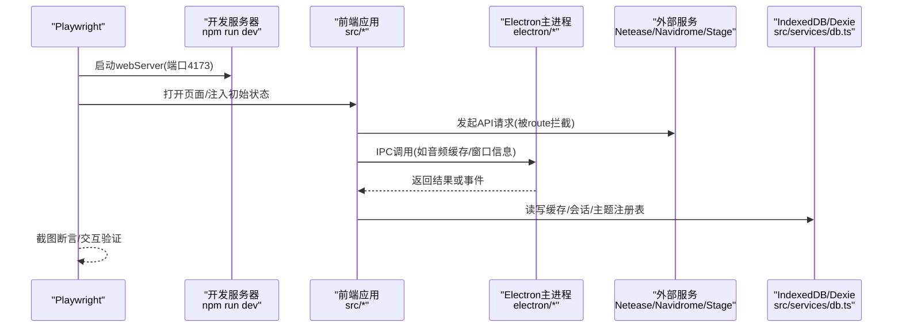

图表来源
- [playwright.config.ts:16-50](file://playwright.config.ts#L16-L50)
- [app.screenshot.spec.ts:177-397](file://test/ui/app.screenshot.spec.ts#L177-L397)
- [vite-env.d.ts:661-683](file://src/vite-env.d.ts#L661-L683)
- [db.ts:77-118](file://src/services/db.ts#L77-L118)

## 详细组件分析

### 服务间通信测试（Lyric API与Stage API）
- 目标
  - 验证桌面歌词API对外暴露的JSON契约、跨域头、发布后数据可见性
  - 验证Stage API的HTTP级行为（无需真实Electron窗口）
- 方法
  - 使用Node http/net创建临时服务器监听随机端口
  - 启动被测API，发布数据后通过HTTP GET校验响应体与头部
  - 清理资源确保测试隔离

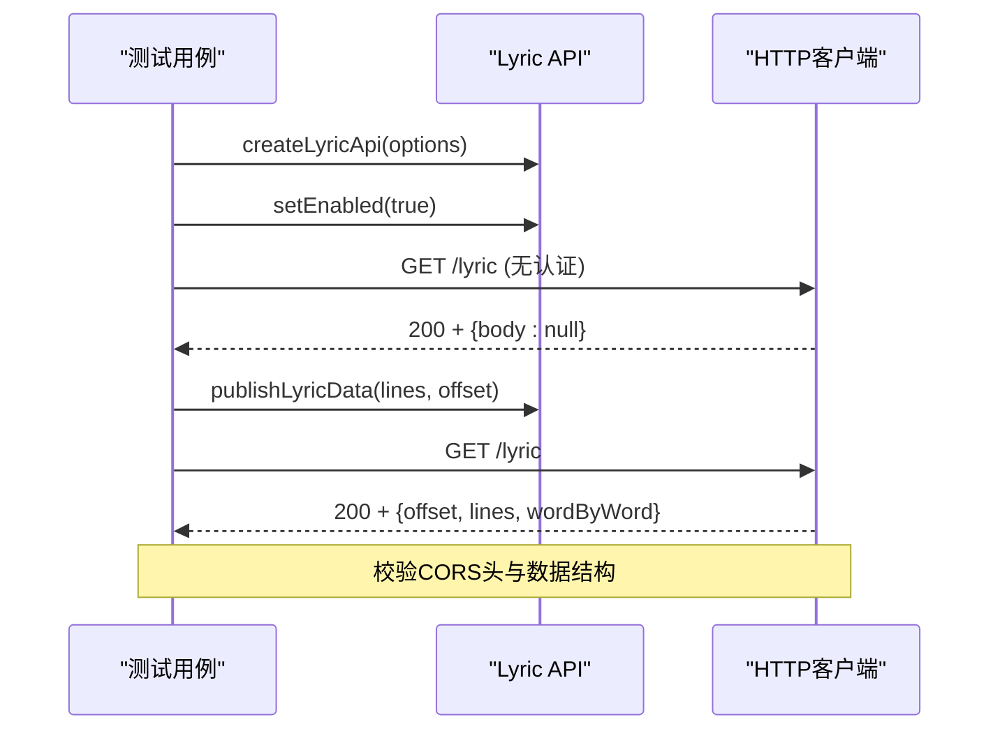

图表来源
- [lyricApi.test.ts:54-110](file://test/unit/electron/lyricApi.test.ts#L54-L110)

章节来源
- [lyricApi.test.ts:1-111](file://test/unit/electron/lyricApi.test.ts#L1-L111)
- [stageApi.test.ts:1-43](file://test/unit/stage/stageApi.test.ts#L1-L43)

### 数据库操作测试（迁移与兼容性）
- 目标
  - 验证旧版原生IndexedDB在Dexie打开后可读并可升级到当前版本
  - 验证缓存路由、前缀扫描与选择性清理
- 方法
  - 使用fake-indexeddb构造历史版本数据库
  - 打开appDatabase并断言版本号、表结构与数据迁移结果
  - 对缓存API进行put/get/scan/remove断言

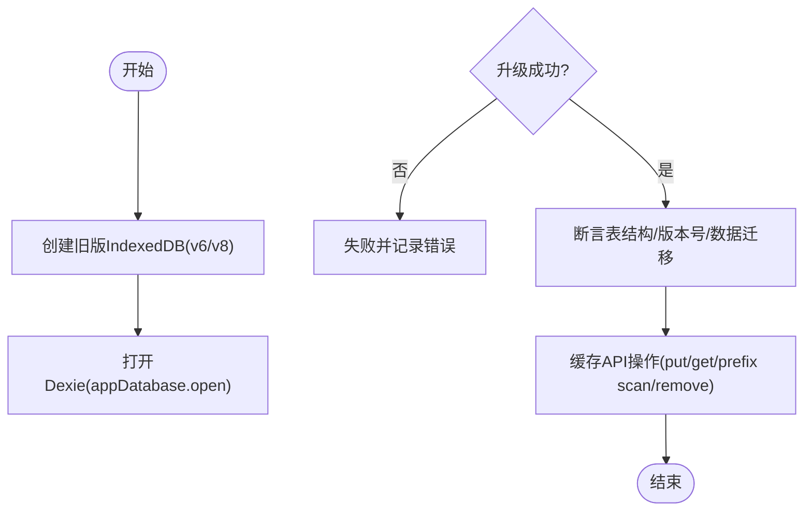

图表来源
- [appDatabaseMigration.test.ts:49-127](file://test/unit/services/appDatabaseMigration.test.ts#L49-L127)
- [dbDexieCompatibility.test.ts:20-37](file://test/unit/services/dbDexieCompatibility.test.ts#L20-L37)
- [db.ts:77-118](file://src/services/db.ts#L77-L118)

章节来源
- [appDatabaseMigration.test.ts:1-130](file://test/unit/services/appDatabaseMigration.test.ts#L1-L130)
- [dbDexieCompatibility.test.ts:1-37](file://test/unit/services/dbDexieCompatibility.test.ts#L1-L37)
- [db.ts:77-118](file://src/services/db.ts#L77-L118)

### 外部API调用测试（网易云与Navidrome）
- 目标
  - 验证登录态、歌单、云盘、收藏等页面的渲染与交互
  - 验证Navidrome Subsonic接口的专辑、歌单、艺术家、随机歌曲等
- 方法
  - 使用page.route拦截特定路径，返回固定fixture数据
  - 通过addInitScript注入localStorage、window.electron、matchMedia等环境
  - 使用截图断言与元素可见性断言组合验证

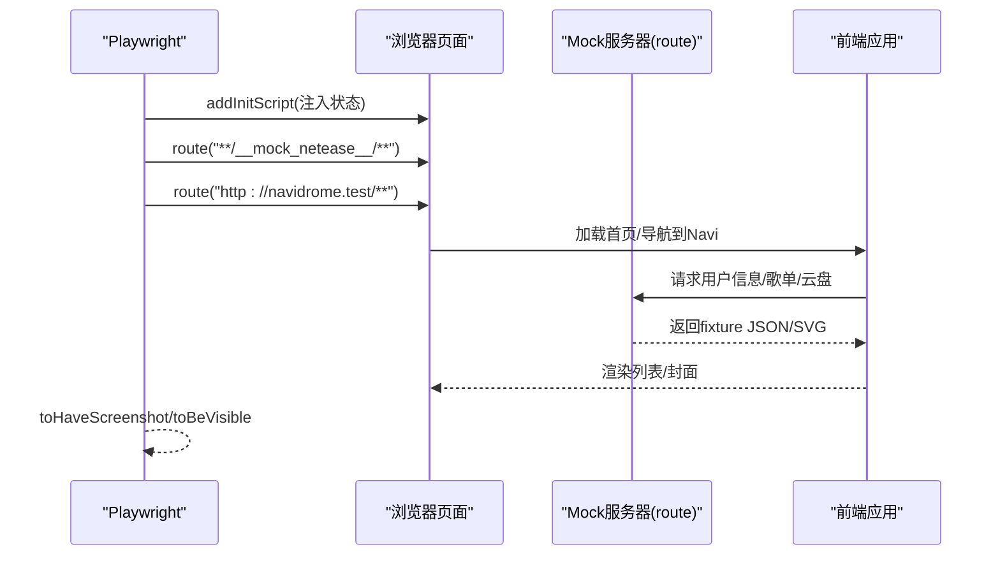

图表来源
- [app.screenshot.spec.ts:177-397](file://test/ui/app.screenshot.spec.ts#L177-L397)
- [app.screenshot.spec.ts:399-585](file://test/ui/app.screenshot.spec.ts#L399-L585)
- [app.screenshot.spec.ts:605-672](file://test/ui/app.screenshot.spec.ts#L605-L672)

章节来源
- [app.screenshot.spec.ts:1-673](file://test/ui/app.screenshot.spec.ts#L1-L673)

### Electron主进程与渲染进程通信测试
- 目标
  - 验证渲染进程通过window.electron调用主进程能力（如音频缓存统计、窗口最大化状态）
  - 验证IPC消息传递（如语音输入状态变更）
- 方法
  - 在测试中mock window.electron并提供异步方法
  - 在主进程中通过webContents.send向渲染进程广播状态
  - 在渲染侧监听事件并断言UI变化

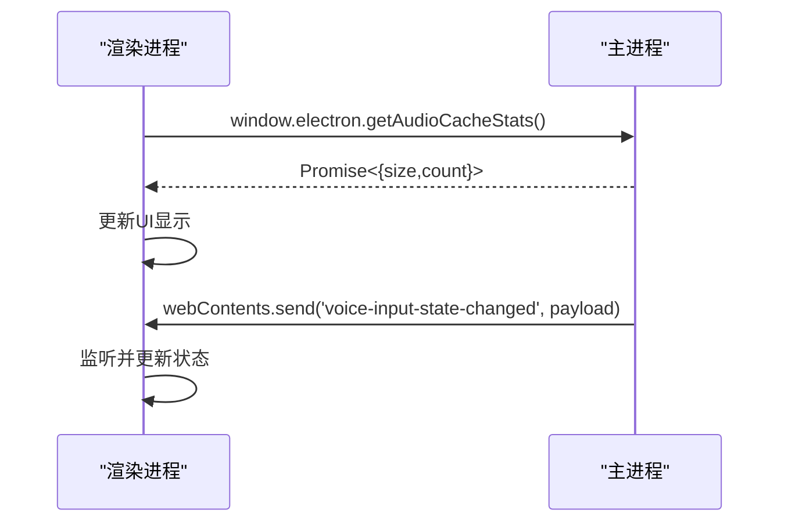

图表来源
- [app.screenshot.spec.ts:237-245](file://test/ui/app.screenshot.spec.ts#L237-L245)
- [vite-env.d.ts:661-683](file://src/vite-env.d.ts#L661-L683)
- [voiceInputPause.cjs:120-151](file://electron/voiceInputPause.cjs#L120-L151)

章节来源
- [app.screenshot.spec.ts:237-245](file://test/ui/app.screenshot.spec.ts#L237-L245)
- [vite-env.d.ts:661-683](file://src/vite-env.d.ts#L661-L683)
- [voiceInputPause.cjs:112-160](file://electron/voiceInputPause.cjs#L112-L160)

### 在线音乐提供商集成测试（认证、数据同步、错误处理）
- 目标
  - 验证多提供商聚合层（omni）的注册/注销与搜索/播放能力
  - 验证账户视图在不同状态下的展示（解析中、访客、已认证）
- 方法
  - 使用Vitest mock provider registry与account store
  - 构造最小化provider实现，断言omni路由行为
  - 针对账户状态机断言不同场景的视图选择

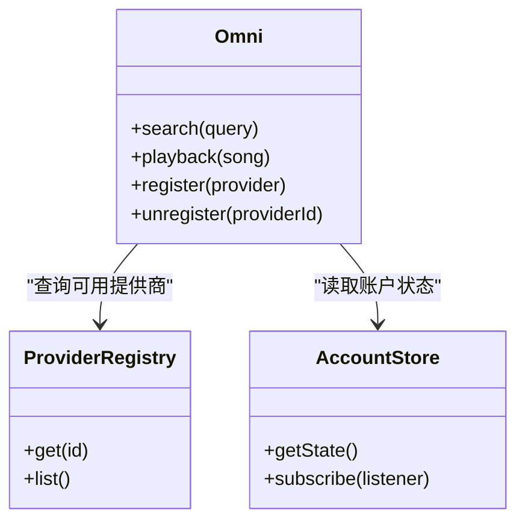

图表来源
- [omni.test.ts:1-32](file://test/unit/onlineMusic/omni.test.ts#L1-L32)
- [onlineProviderAccountView.test.ts:1-41](file://test/unit/onlineMusic/onlineProviderAccountView.test.ts#L1-L41)

章节来源
- [omni.test.ts:1-32](file://test/unit/onlineMusic/omni.test.ts#L1-L32)
- [onlineProviderAccountView.test.ts:1-41](file://test/unit/onlineMusic/onlineProviderAccountView.test.ts#L1-L41)

### 本地文件系统操作测试（扫描、元数据处理、缓存管理）
- 目标
  - 验证本地库目录树构建与空文件夹保留、曲目计数聚合
  - 验证导入流程中歌词、翻译歌词、封面文件的读取与缓存
  - 验证封面资产的一次性哈希、外部去重与轻量描述符
- 方法
  - 构造LocalLibrarySnapshot与LocalSong集合，断言树节点与计数
  - 在UI测试中mock showDirectoryPicker与Worker，模拟文件读取与元数据解析
  - 使用vi.mock封送hash与二进制存储接口，验证迁移与重试安全

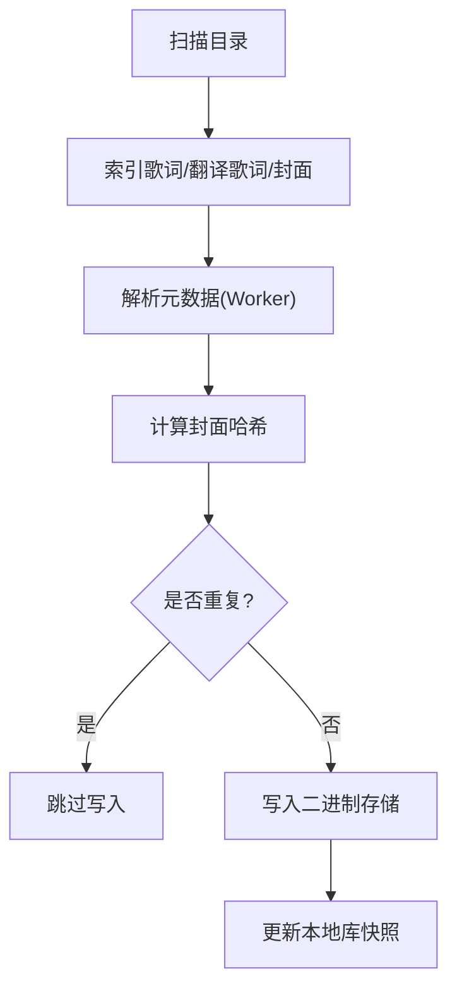

图表来源
- [localLibraryDirectoryTree.test.ts:7-28](file://test/unit/services/localLibraryDirectoryTree.test.ts#L7-L28)
- [localMusicService.ts:755-789](file://src/services/localMusicService.ts#L755-L789)
- [localCoverAssetService.test.ts:1-31](file://test/unit/services/localCoverAssetService.test.ts#L1-L31)
- [app.screenshot.spec.ts:270-387](file://test/ui/app.screenshot.spec.ts#L270-L387)

章节来源
- [localLibraryDirectoryTree.test.ts:1-30](file://test/unit/services/localLibraryDirectoryTree.test.ts#L1-L30)
- [localMusicService.ts:755-789](file://src/services/localMusicService.ts#L755-L789)
- [localCoverAssetService.test.ts:1-31](file://test/unit/services/localCoverAssetService.test.ts#L1-L31)
- [app.screenshot.spec.ts:270-387](file://test/ui/app.screenshot.spec.ts#L270-L387)

### 复杂业务流程测试（搜索播放、歌词匹配、主题切换）
- 搜索播放
  - 通过UI测试模拟登录态与外部API，断言歌单首页渲染与二维码登录流程
- 歌词匹配
  - 使用本地库元数据匹配服务，验证手动/自动匹配路由、封面策略、取消与并发限制
- 主题切换
  - 通过主题同步注册表迁移与持久化，验证旧格式迁移与新表写入

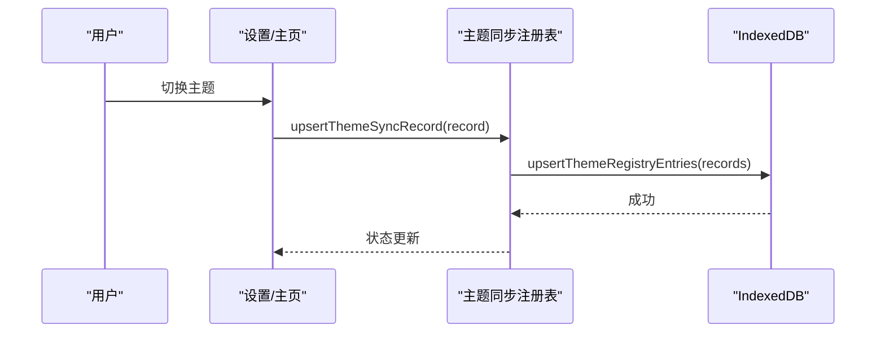

图表来源
- [localSongMetadataMatchService.test.ts:51-77](file://test/unit/localLibrary/localSongMetadataMatchService.test.ts#L51-L77)
- [themeSyncRegistry.ts:73-147](file://src/services/sync/themeSyncRegistry.ts#L73-L147)
- [app.screenshot.spec.ts:605-672](file://test/ui/app.screenshot.spec.ts#L605-L672)

章节来源
- [localSongMetadataMatchService.test.ts:1-77](file://test/unit/localLibrary/localSongMetadataMatchService.test.ts#L1-L77)
- [themeSyncRegistry.ts:73-147](file://src/services/sync/themeSyncRegistry.ts#L73-L147)
- [app.screenshot.spec.ts:605-672](file://test/ui/app.screenshot.spec.ts#L605-L672)

### 数据库迁移测试与数据一致性验证
- 迁移测试
  - 构造历史版本数据库，打开Dexie后断言版本号、表结构、数据可读性与迁移完整性
- 一致性验证
  - 缓存路由与旧user_cache条目迁移至新表
  - 前缀扫描与选择性删除在多表间正确生效

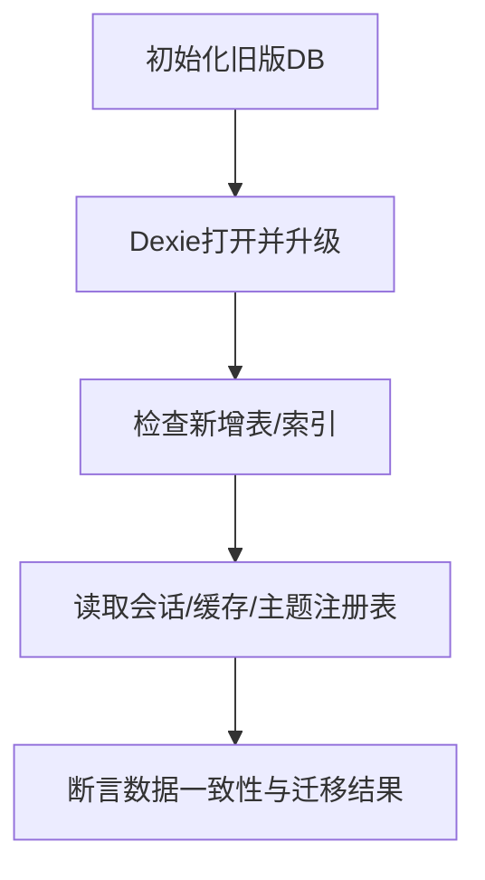

图表来源
- [appDatabaseMigration.test.ts:49-127](file://test/unit/services/appDatabaseMigration.test.ts#L49-L127)
- [dbDexieCompatibility.test.ts:20-37](file://test/unit/services/dbDexieCompatibility.test.ts#L20-L37)

章节来源
- [appDatabaseMigration.test.ts:1-130](file://test/unit/services/appDatabaseMigration.test.ts#L1-L130)
- [dbDexieCompatibility.test.ts:1-37](file://test/unit/services/dbDexieCompatibility.test.ts#L1-L37)

### 分布式系统与微服务接口测试
- 目标
  - 验证与Navidrome、Stage、Lyric API等微服务的HTTP/WS契约
- 方法
  - 使用page.route或Node HTTP客户端对接测试服务器
  - 断言响应结构、状态码、CORS头、WebSocket连接与消息
  - 结合UI截图与交互断言验证端到端链路

章节来源
- [app.screenshot.spec.ts:399-585](file://test/ui/app.screenshot.spec.ts#L399-L585)
- [lyricApi.test.ts:54-110](file://test/unit/electron/lyricApi.test.ts#L54-L110)
- [stageApi.test.ts:1-43](file://test/unit/stage/stageApi.test.ts#L1-L43)

## 依赖关系分析
- 测试框架依赖
  - Playwright负责启动dev server、拦截网络、截图断言
  - Vitest负责Node环境下的服务层测试与mock
- 被测系统依赖
  - 前端应用依赖外部服务（网易云、Navidrome）与Electron主进程能力
  - 数据存储依赖IndexedDB与Dexie封装
- 耦合点
  - UI与外部API强耦合，需通过route稳定化
  - 主进程与渲染进程通过IPC通信，需mock或真实启动
  - 数据库迁移与兼容层影响所有读写路径

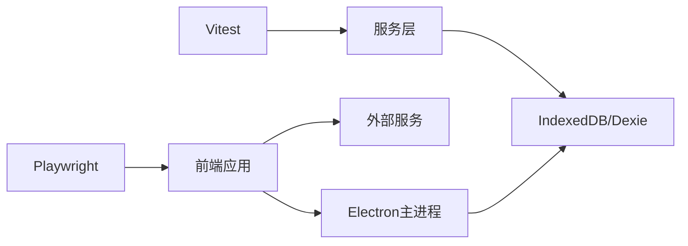

图表来源
- [playwright.config.ts:16-50](file://playwright.config.ts#L16-L50)
- [vitest.config.ts:7-16](file://vitest.config.ts#L7-L16)
- [db.ts:77-118](file://src/services/db.ts#L77-L118)

章节来源
- [playwright.config.ts:16-50](file://playwright.config.ts#L16-L50)
- [vitest.config.ts:7-16](file://vitest.config.ts#L7-L16)
- [db.ts:77-118](file://src/services/db.ts#L77-L118)

## 性能考量
- 并行与超时
  - Playwright关闭fullyParallel以避免CPU争用导致的截图抖动
  - 合理设置expect与webServer超时，避免误报
- 资源占用
  - 使用fake-indexeddb减少真实DB干扰
  - 使用vi.mock隔离外部依赖，降低IO开销
- 稳定性
  - 通过route与addInitScript固化环境与数据，提升可重复性
  - 截图断言启用动画禁用与CSS缩放，减少渲染差异

章节来源
- [playwright.config.ts:17-29](file://playwright.config.ts#L17-L29)
- [app.screenshot.spec.ts:587-603](file://test/ui/app.screenshot.spec.ts#L587-L603)

## 故障排查指南
- 常见问题
  - 外部服务不可达：确认route是否正确拦截对应域名与路径
  - 数据库迁移失败：检查旧版DB结构是否与测试构造一致
  - IPC调用未触发：确认window.electron是否被正确mock或主进程已启动
- 定位方法
  - 使用Playwright Trace（on-first-retry）回放失败用例
  - 在Vitest中打印mock调用次数与参数，验证调用链
  - 在UI测试中增加元素可见性断言，逐步缩小问题范围

章节来源
- [playwright.config.ts:30-44](file://playwright.config.ts#L30-L44)
- [lyricApi.test.ts:20-22](file://test/unit/electron/lyricApi.test.ts#L20-L22)
- [app.screenshot.spec.ts:659-672](file://test/ui/app.screenshot.spec.ts#L659-L672)

## 结论
本指南基于仓库现有测试配置与用例，系统化梳理了Folia Player的集成测试策略与实践方法。通过Playwright与Vitest的组合，覆盖了从UI端到端、服务层集成、Electron IPC到数据库迁移的全链路验证。建议在新功能开发时优先补充相应用例，遵循“稳定环境、明确断言、最小依赖”的原则，持续提升测试覆盖率与稳定性。

## 附录
- 设置页集成测试入口
  - 集成设置子视图提供连接测试按钮与状态反馈
  - 存储设置部分提供同步配置测试与保存流程
- 参考路径
  - [IntegrationSettingsSubview.tsx:20-858](file://src/components/modal/settings/IntegrationSettingsSubview.tsx#L20-L858)
  - [StorageSettingsSection.tsx:131-164](file://src/components/modal/settings/StorageSettingsSection.tsx#L131-L164)

章节来源
- [IntegrationSettingsSubview.tsx:20-858](file://src/components/modal/settings/IntegrationSettingsSubview.tsx#L20-L858)
- [StorageSettingsSection.tsx:131-164](file://src/components/modal/settings/StorageSettingsSection.tsx#L131-L164)