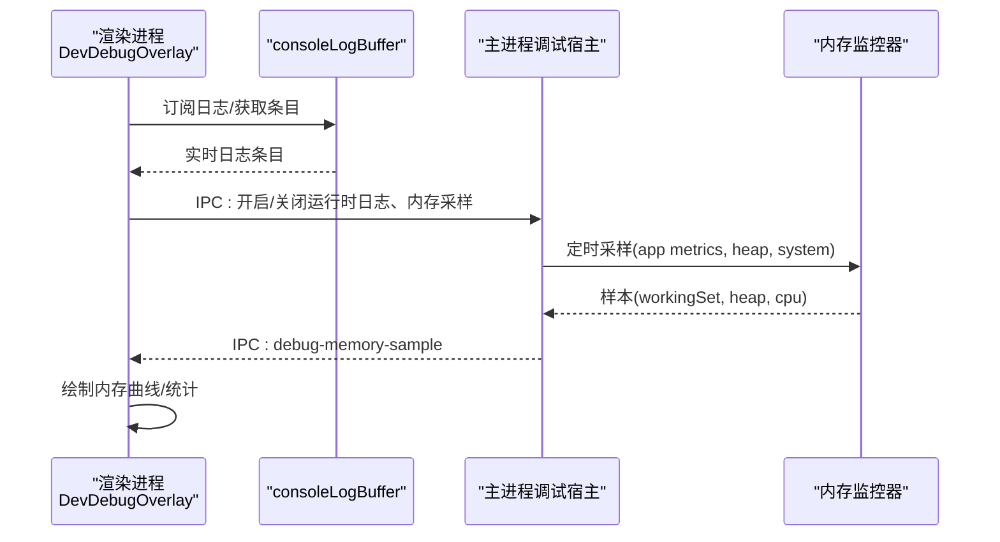
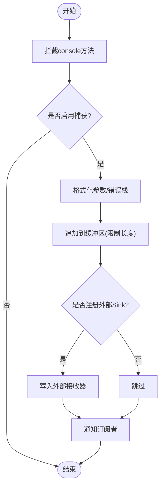
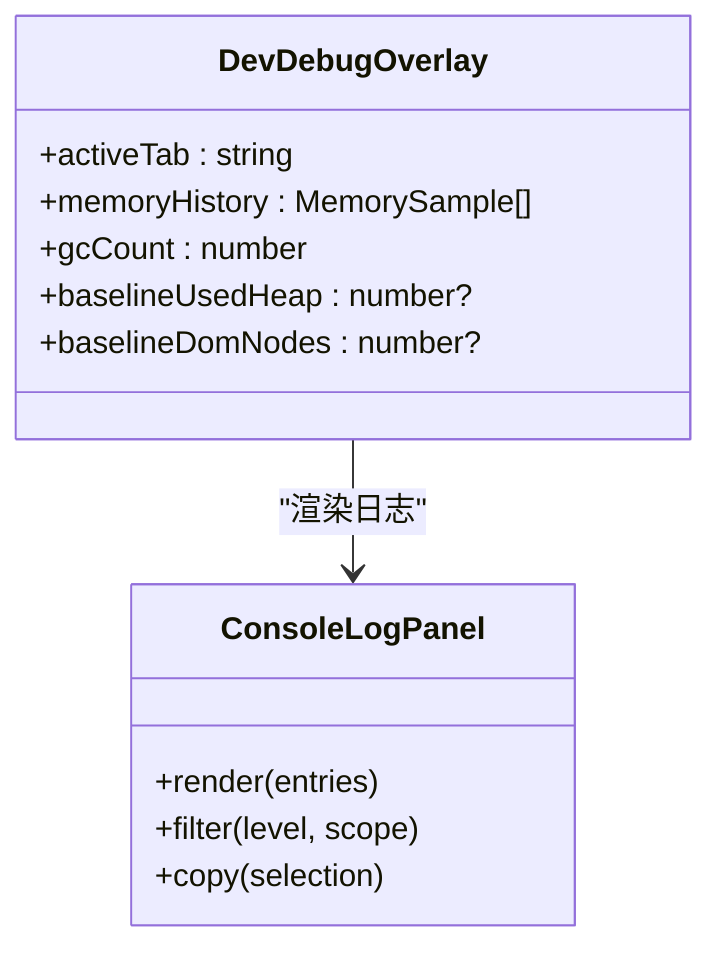
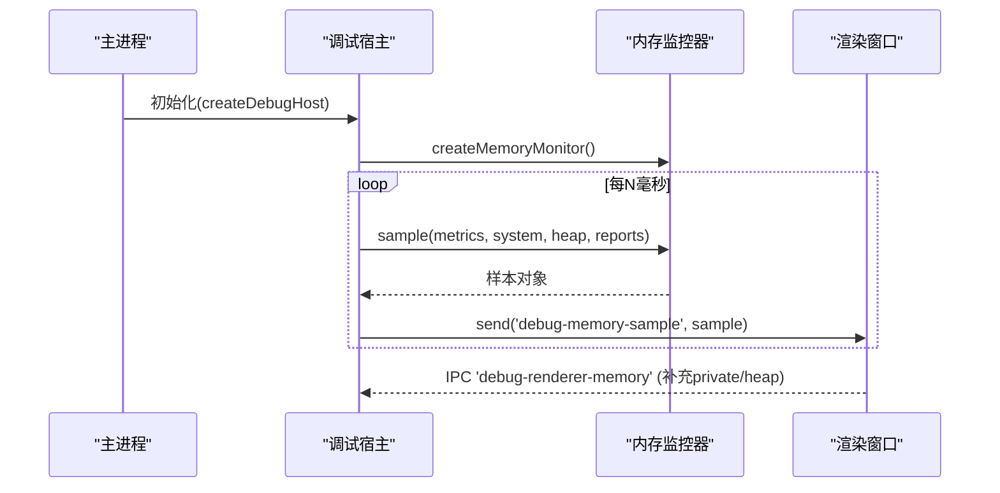
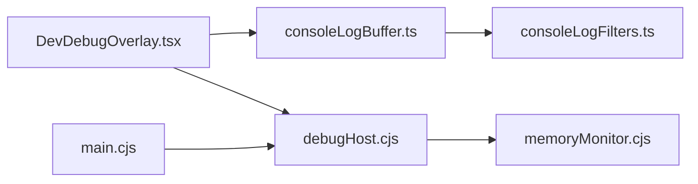

# 调试工具与技巧

<cite>
**本文引用的文件**
- [electron/main.cjs](file://electron/main.cjs)
- [electron/debug/debugHost.cjs](file://electron/debug/debugHost.cjs)
- [electron/debug/memoryMonitor.cjs](file://electron/debug/memoryMonitor.cjs)
- [src/utils/consoleLogBuffer.ts](file://src/utils/consoleLogBuffer.ts)
- [src/utils/consoleLogFilters.ts](file://src/utils/consoleLogFilters.ts)
- [src/components/DevDebugOverlay.tsx](file://src/components/DevDebugOverlay.tsx)
- [docs/client-logging.md](file://docs/client-logging.md)
- [package.json](file://package.json)
- [src/hooks/useElectronPlaybackBridge.ts](file://src/hooks/useElectronPlaybackBridge.ts)
- [src/App.tsx](file://src/App.tsx)
</cite>

## 目录
1. [简介](#简介)
2. [项目结构](#项目结构)
3. [核心组件](#核心组件)
4. [架构总览](#架构总览)
5. [详细组件分析](#详细组件分析)
6. [依赖关系分析](#依赖关系分析)
7. [性能注意事项](#性能注意事项)
8. [故障排查指南](#故障排查指南)
9. [结论](#结论)
10. [附录](#附录)

## 简介
本指南面向Folia Player的开发者与维护者，系统化说明在浏览器与Electron环境下的调试方法与技巧。内容覆盖：
- 浏览器开发者工具使用（React DevTools、网络请求、性能分析）
- Electron主进程与渲染进程调试、IPC通信调试
- 控制台日志系统（级别、过滤、持久化）
- 性能分析与优化（内存泄漏检测、CPU性能、渲染性能）
- 常见问题定位（音频播放、网络失败、界面卡顿）
- 远程调试与日志收集配置
- 最佳实践与排障流程

## 项目结构
本项目采用“前端React + Electron”的双进程架构：
- 渲染进程：React应用、可视化、播放器UI、在线/本地音乐服务、歌词与自动混音等
- 主进程：窗口管理、平台特性、IPC桥接、调试宿主、内存监控、壁纸模式等

```mermaid
graph TB
subgraph "渲染进程"
R_App["App.tsx"]
R_DebugOverlay["DevDebugOverlay.tsx"]
R_LogBuffer["consoleLogBuffer.ts"]
R_LogFilters["consoleLogFilters.ts"]
R_Bridge["useElectronPlaybackBridge.ts"]
end
subgraph "主进程"
M_Main["main.cjs"]
M_DebugHost["debug/debugHost.cjs"]
M_MemMon["debug/memoryMonitor.cjs"]
end
R_App --> R_DebugOverlay
R_DebugOverlay --> R_LogBuffer
R_LogBuffer --> R_LogFilters
R_App --> R_Bridge
R_Bridge < --> M_Main
M_Main --> M_DebugHost
M_DebugHost --> M_MemMon
```

图表来源
- [src/App.tsx:123-160](file://src/App.tsx#L123-L160)
- [src/components/DevDebugOverlay.tsx:603-770](file://src/components/DevDebugOverlay.tsx#L603-L770)
- [src/utils/consoleLogBuffer.ts:1-178](file://src/utils/consoleLogBuffer.ts#L1-L178)
- [src/utils/consoleLogFilters.ts:1-60](file://src/utils/consoleLogFilters.ts#L1-L60)
- [src/hooks/useElectronPlaybackBridge.ts:518-543](file://src/hooks/useElectronPlaybackBridge.ts#L518-L543)
- [electron/main.cjs:1-30](file://electron/main.cjs#L1-L30)
- [electron/debug/debugHost.cjs:1-30](file://electron/debug/debugHost.cjs#L1-L30)
- [electron/debug/memoryMonitor.cjs:1-20](file://electron/debug/memoryMonitor.cjs#L1-L20)

章节来源
- [package.json:35-42](file://package.json#L35-L42)
- [electron/main.cjs:1-30](file://electron/main.cjs#L1-L30)

## 核心组件
- 控制台日志缓冲与过滤：统一捕获console输出与未处理异常，支持按模块与作用域过滤并持久化
- 开发调试面板：可拖拽的调试浮窗，提供Console、Memory、Playback、Lyrics、Theme、Sonnet等视图
- 主进程调试宿主：集中控制运行时日志与内存采样，支持写入文件、打开日志目录、向渲染进程推送内存样本
- 内存监控器：聚合各进程指标，计算峰值/均值/基线，区分工作集与堆内存，识别渲染进程增长
- IPC桥接：渲染进程与主进程交互（如发布状态、读取设置、触发调试开关）

章节来源
- [src/utils/consoleLogBuffer.ts:1-178](file://src/utils/consoleLogBuffer.ts#L1-L178)
- [src/utils/consoleLogFilters.ts:1-60](file://src/utils/consoleLogFilters.ts#L1-L60)
- [src/components/DevDebugOverlay.tsx:603-800](file://src/components/DevDebugOverlay.tsx#L603-L800)
- [electron/debug/debugHost.cjs:21-38](file://electron/debug/debugHost.cjs#L21-L38)
- [electron/debug/memoryMonitor.cjs:16-47](file://electron/debug/memoryMonitor.cjs#L16-L47)

## 架构总览
下图展示从渲染进程到主进程的调试数据流：渲染侧记录日志与内存快照，通过IPC或事件推送到主进程；主进程负责落盘与汇总，并可反向通知渲染进程刷新UI。



图表来源
- [src/components/DevDebugOverlay.tsx:603-770](file://src/components/DevDebugOverlay.tsx#L603-L770)
- [src/utils/consoleLogBuffer.ts:107-132](file://src/utils/consoleLogBuffer.ts#L107-L132)
- [electron/debug/debugHost.cjs:117-221](file://electron/debug/debugHost.cjs#L117-L221)
- [electron/debug/memoryMonitor.cjs:79-150](file://electron/debug/memoryMonitor.cjs#L79-L150)

## 详细组件分析

### 控制台日志系统（渲染进程）
- 功能要点
  - 拦截console.log/info/warn/error/debug，解析[模块]前缀作为scope
  - 捕获window error与unhandledrejection
  - 维护最近N条日志（默认1000），支持按级别/模块过滤，过滤项持久化
  - 提供复制、清空、搜索能力
- 关键路径
  - 安装与注入：尽早调用安装函数以捕获早期日志
  - 写入与存储：格式化参数、去环引用、追加至数组、触发监听
  - 过滤与持久化：隐藏列表策略，跨会话保留
- 使用建议
  - 所有日志以[子系统]开头，便于分组与屏蔽
  - 避免高频重复打印，必要时用集合去重
  - 优先记录决策与结果，而非进入/退出过程



图表来源
- [src/utils/consoleLogBuffer.ts:107-132](file://src/utils/consoleLogBuffer.ts#L107-L132)
- [src/utils/consoleLogBuffer.ts:157-178](file://src/utils/consoleLogBuffer.ts#L157-L178)
- [src/utils/consoleLogFilters.ts:32-59](file://src/utils/consoleLogFilters.ts#L32-L59)

章节来源
- [docs/client-logging.md:1-83](file://docs/client-logging.md#L1-L83)
- [src/utils/consoleLogBuffer.ts:1-178](file://src/utils/consoleLogBuffer.ts#L1-L178)
- [src/utils/consoleLogFilters.ts:1-60](file://src/utils/consoleLogFilters.ts#L1-L60)

### 开发调试面板（渲染进程）
- 功能要点
  - 可拖拽浮窗，多标签页：Console、Memory、Playback、Lyrics、Theme、Sonnet
  - Memory标签：周期采样performance.memory，显示usedHeap/totalHeap/limit/DOM节点/GC次数
  - Playback/Lyrics标签：展示当前播放状态、歌词时间轴、渲染时序等
- 使用建议
  - 快捷键打开后优先查看Console定位问题
  - 切换歌曲时重置内存基线，观察增量变化
  - 结合网络面板与性能面板交叉验证



图表来源
- [src/components/DevDebugOverlay.tsx:603-800](file://src/components/DevDebugOverlay.tsx#L603-L800)

章节来源
- [src/components/DevDebugOverlay.tsx:603-800](file://src/components/DevDebugOverlay.tsx#L603-L800)

### 主进程调试宿主与内存监控
- 功能要点
  - 运行时日志：将主进程console输出与渲染进程批量行写入logs/runtime/*.log
  - 内存监控：定时采集app.getAppMetrics/process.getSystemMemoryInfo/process.getHeapStatistics，合并各进程报告
  - 渲染进程上报：通过IPC接收渲染进程自身内存信息，补齐缺失字段
  - 日志目录：一键打开logs目录，便于导出
- 关键行为
  - 默认关闭磁盘写入，需显式开启
  - 内存采样间隔可配置，最小1s、最大60s
  - 对崩溃/退出进行清理，避免残留定时器



图表来源
- [electron/debug/debugHost.cjs:82-221](file://electron/debug/debugHost.cjs#L82-L221)
- [electron/debug/memoryMonitor.cjs:79-150](file://electron/debug/memoryMonitor.cjs#L79-L150)

章节来源
- [electron/debug/debugHost.cjs:21-38](file://electron/debug/debugHost.cjs#L21-L38)
- [electron/debug/debugHost.cjs:117-221](file://electron/debug/debugHost.cjs#L117-L221)
- [electron/debug/memoryMonitor.cjs:16-47](file://electron/debug/memoryMonitor.cjs#L16-L47)
- [electron/debug/memoryMonitor.cjs:79-150](file://electron/debug/memoryMonitor.cjs#L79-L150)

### IPC通信调试（主进程与渲染进程）
- 常见通道
  - 调试状态查询/设置：debug-get-state / debug-set-state
  - 运行时日志批量写入：debug-runtime-lines
  - 渲染进程内存上报：debug-renderer-memory
  - 打开日志目录：debug-open-logs
- 调试建议
  - 在Electron DevTools中查看IPC消息收发
  - 结合主进程日志与渲染进程日志对齐时间戳
  - 通过设置项控制采样频率与日志写入模式

章节来源
- [electron/debug/debugHost.cjs:251-276](file://electron/debug/debugHost.cjs#L251-L276)
- [src/hooks/useElectronPlaybackBridge.ts:518-543](file://src/hooks/useElectronPlaybackBridge.ts#L518-L543)

### 浏览器开发者工具使用
- React DevTools
  - 检查组件树、props/state变更、Hooks调用
  - 配合Performance面板观察重渲染热点
- 网络请求
  - 关注在线音乐API、封面、歌词资源加载耗时与错误码
  - 结合缓存策略与重试逻辑定位问题
- 性能分析
  - Performance录制：聚焦长任务、布局抖动、JS执行
  - Memory快照：对比GC前后堆大小，定位泄漏点
  - 与内置Memory标签互相印证

章节来源
- [docs/client-logging.md:47-69](file://docs/client-logging.md#L47-L69)

### 启动与运行模式
- 开发模式
  - 环境变量ELECTRON_DEV=true时自动打开DevTools
  - 脚本命令支持直接启动Vite与Electron
- 打包与图形模式
  - Linux下可通过环境变量选择SwiftShader/软件渲染
  - 支持源码映射以便断点调试

章节来源
- [package.json:35-42](file://package.json#L35-L42)
- [electron/main.cjs:78-105](file://electron/main.cjs#L78-L105)

## 依赖关系分析
- 低耦合设计
  - consoleLogBuffer不依赖任何业务模块，仅通过sink扩展输出
  - memoryMonitor纯函数式采样，输入metrics，输出样本，无副作用
- 明确边界
  - 渲染进程专注UI与用户交互，主进程负责系统级能力与持久化
  - 调试宿主集中管理日志与采样开关，避免散落在各处
- 潜在风险
  - 高频日志可能影响性能，应合理使用过滤与节流
  - 内存采样过频会增加主进程开销，需平衡精度与成本



图表来源
- [src/utils/consoleLogBuffer.ts:1-178](file://src/utils/consoleLogBuffer.ts#L1-L178)
- [src/utils/consoleLogFilters.ts:1-60](file://src/utils/consoleLogFilters.ts#L1-L60)
- [src/components/DevDebugOverlay.tsx:603-770](file://src/components/DevDebugOverlay.tsx#L603-L770)
- [electron/debug/debugHost.cjs:117-221](file://electron/debug/debugHost.cjs#L117-L221)
- [electron/debug/memoryMonitor.cjs:79-150](file://electron/debug/memoryMonitor.cjs#L79-L150)
- [electron/main.cjs:1-30](file://electron/main.cjs#L1-L30)

## 性能注意事项
- 日志性能
  - 默认仅保留最近1000条，避免无限增长
  - 过滤与搜索在渲染层完成，减少重绘
- 内存采样
  - 默认关闭磁盘写入，按需开启
  - 采样间隔建议2-10秒，兼顾趋势与开销
- 渲染性能
  - 使用React DevTools Profiler定位重渲染
  - 结合浏览器Performance面板分析长任务与合成层
- 音频与可视化
  - 注意WebAudio节点生命周期，及时释放
  - 可视化资源（纹理/模型）按需加载与复用

章节来源
- [src/utils/consoleLogBuffer.ts:33-35](file://src/utils/consoleLogBuffer.ts#L33-L35)
- [electron/debug/debugHost.cjs:21-38](file://electron/debug/debugHost.cjs#L21-L38)
- [electron/debug/memoryMonitor.cjs:16-47](file://electron/debug/memoryMonitor.cjs#L16-L47)

## 故障排查指南
- 音频播放问题
  - 检查设备选择与权限，确认setSinkId成功
  - 查看控制台是否有音频相关错误与警告
  - 使用Performance面板观察解码与播放延迟
- 网络请求失败
  - 在网络面板查看请求URL、状态码、响应体
  - 检查代理、证书与跨域策略
  - 结合客户端日志中的模块前缀快速定位来源
- 界面卡顿
  - 使用Performance录制，查找长任务与布局抖动
  - 检查大量DOM节点与频繁重绘
  - 结合Memory标签观察堆增长与GC行为
- 内存泄漏
  - 对比GC前后堆大小，关注持续上升
  - 使用浏览器“Allocation instrumentation on timeline”定位分配热点
  - 结合主进程内存曲线判断是否为渲染进程泄漏

章节来源
- [src/components/DevDebugOverlay.tsx:641-713](file://src/components/DevDebugOverlay.tsx#L641-L713)
- [electron/debug/memoryMonitor.cjs:100-150](file://electron/debug/memoryMonitor.cjs#L100-L150)
- [docs/client-logging.md:31-46](file://docs/client-logging.md#L31-L46)

## 结论
Folia Player提供了完善的调试基础设施：统一的日志缓冲与过滤、可视化的调试面板、主进程集中化的运行时日志与内存监控、以及清晰的IPC通道。借助这些能力，可以高效定位音频、网络与渲染相关问题，并通过合理的采样与过滤策略控制调试开销。建议在开发中养成“先日志、再性能、后内存”的排障习惯，并结合浏览器与Electron工具链形成闭环。

## 附录
- 常用快捷键与环境变量
  - Alt+Shift+D：打开调试面板（Console/Memory等）
  - ELECTRON_DEV=true：开发模式下自动打开DevTools
  - FOLIA_LINUX_GRAPHICS_MODE：Linux图形后端选择（system/swiftshader/software）
- 日志位置
  - logs/runtime/*.log：运行时日志
  - logs/memory/*.jsonl：内存采样数据（需开启）
- 最佳实践
  - 日志以[模块]开头，保持命名一致
  - 避免在热路径高频打印
  - 使用过滤与搜索快速隔离问题
  - 开启内存采样仅在复现问题时

章节来源
- [package.json:35-42](file://package.json#L35-L42)
- [electron/debug/debugHost.cjs:21-38](file://electron/debug/debugHost.cjs#L21-L38)
- [docs/client-logging.md:47-69](file://docs/client-logging.md#L47-L69)