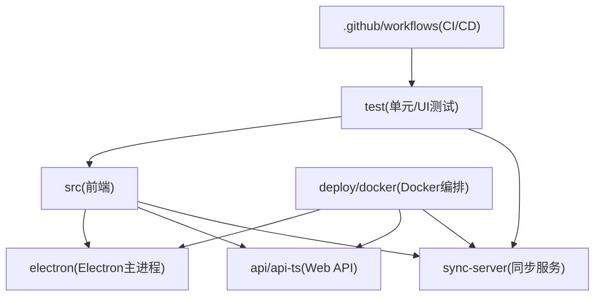
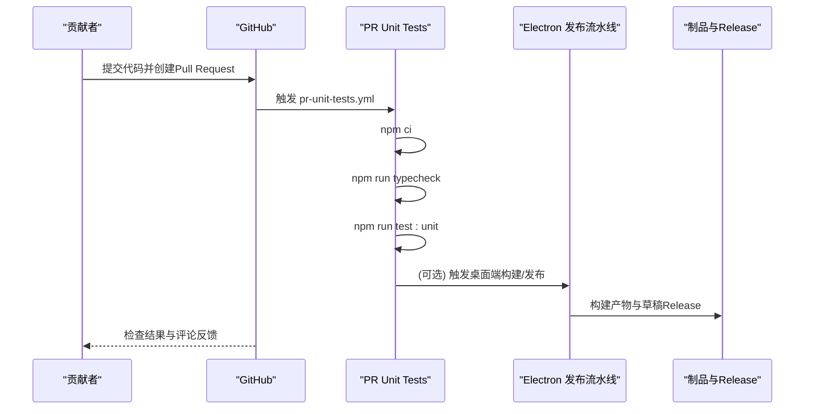
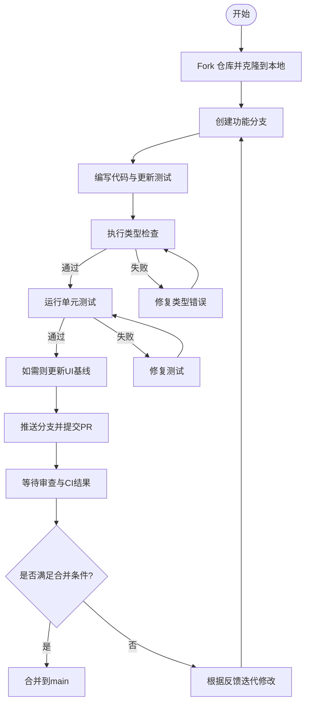
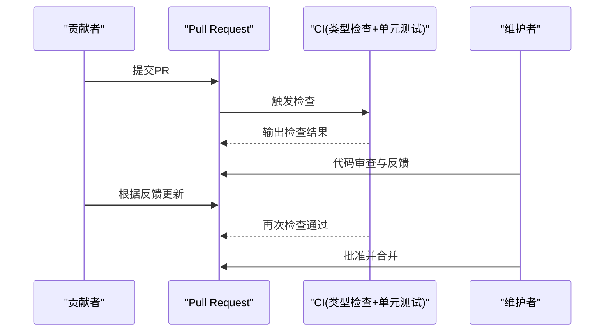
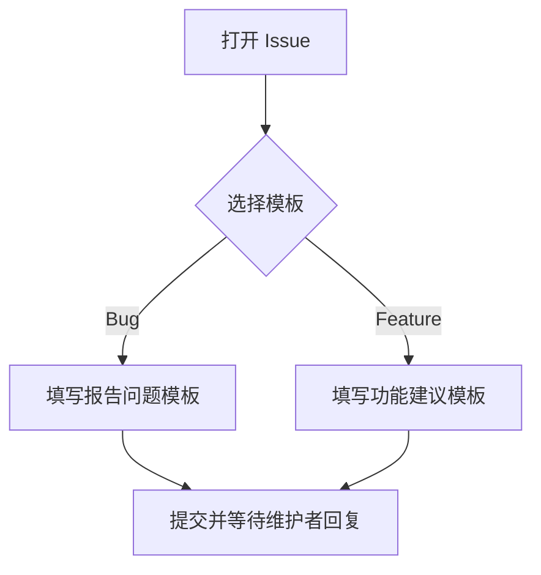
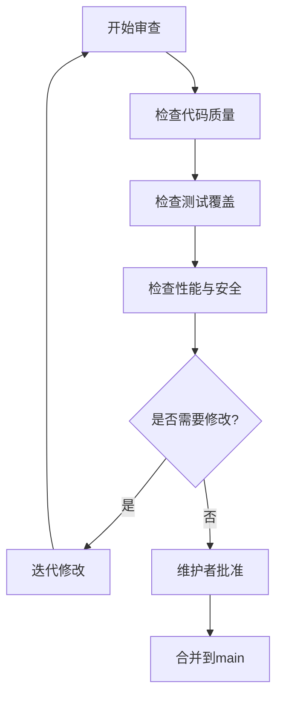
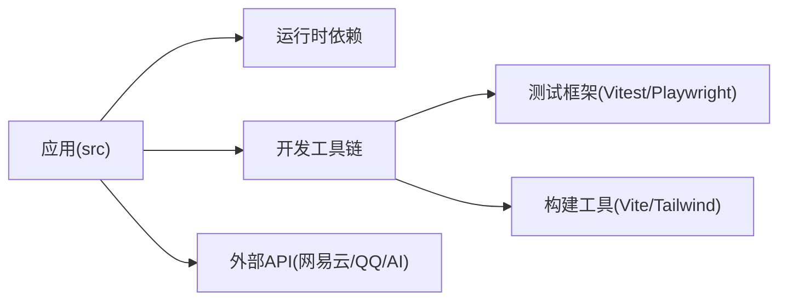

# 贡献指南

<cite>
**本文引用的文件**
- [README.md](file://README.md)
- [CONTRIBUTORS.md](file://CONTRIBUTORS.md)
- [.github/ISSUE_TEMPLATE/报告问题.md](file://.github/ISSUE_TEMPLATE/报告问题.md)
- [.github/ISSUE_TEMPLATE/功能建议.md](file://.github/ISSUE_TEMPLATE/功能建议.md)
- [.github/workflows/pr-unit-tests.yml](file://.github/workflows/pr-unit-tests.yml)
- [.github/workflows/electron-release.yml](file://.github/workflows/electron-release.yml)
- [package.json](file://package.json)
- [vitest.config.ts](file://vitest.config.ts)
- [playwright.config.ts](file://playwright.config.ts)
- [docs/technical.md](file://docs/technical.md)
</cite>

## 目录
1. [简介](#简介)
2. [项目结构](#项目结构)
3. [核心组件](#核心组件)
4. [架构总览](#架构总览)
5. [详细组件分析](#详细组件分析)
6. [依赖分析](#依赖分析)
7. [性能考虑](#性能考虑)
8. [故障排查指南](#故障排查指南)
9. [结论](#结论)
10. [附录](#附录)

## 简介
本贡献指南面向希望参与 Folia Player 开发的贡献者，涵盖从 Fork、创建分支、提交代码到 Pull Request 的完整流程；Issue 报告规范（Bug 与功能建议）；代码审查标准与合并条件；项目治理结构与社区协作方式；以及新贡献者的入门指导（开发环境搭建、第一个贡献任务、沟通渠道）。

Folia 是一个以全屏沉浸式歌词播放为核心的在线音乐播放器，提供 Electron 桌面端与 Web 版本，支持多平台部署。仓库包含前端、Electron 主进程、同步服务端、测试与文档等模块。

**章节来源**
- [README.md:66-191](file://README.md#L66-L191)

## 项目结构
仓库采用按功能与层次混合的组织方式：
- src：前端应用与业务逻辑（React + TypeScript）
- electron：Electron 主进程与桥接脚本
- api / api-ts：Web API 相关实现与类型定义
- sync-server：可选的跨设备同步服务端
- test：单元测试（Vitest）、UI 端到端测试（Playwright）
- docs：技术说明与使用文档
- deploy/docker：Docker Compose 全栈部署
- packaging：桌面端打包配置与平台补丁
- .github：CI/CD 工作流与 Issue 模板

**图表来源**
- [package.json:17-50](file://package.json#L17-L50)
- [.github/workflows/pr-unit-tests.yml:18-50](file://.github/workflows/pr-unit-tests.yml#L18-L50)
- [playwright.config.ts:16-51](file://playwright.config.ts#L16-L51)

**章节来源**
- [package.json:17-50](file://package.json#L17-L50)
- [docs/technical.md:225-243](file://docs/technical.md#L225-L243)

## 核心组件
- 开发与构建脚本：通过 package.json 中的 scripts 暴露 dev/build/test 等命令，统一本地与 CI 行为。
- 测试框架：
  - 单元测试：Vitest，配置文件 vitest.config.ts，测试位于 test/unit。
  - UI 测试：Playwright，配置文件 playwright.config.ts，测试位于 test/ui。
- 持续集成：GitHub Actions 在 PR 上运行类型检查与单元测试，并校验同步服务端构建。
- 发布流水线：Realeco 发布工作流负责多平台构建、生成发布说明、创建草稿 Release 与推送 AUR 包。

**章节来源**
- [package.json:17-50](file://package.json#L17-L50)
- [vitest.config.ts:7-17](file://vitest.config.ts#L7-L17)
- [playwright.config.ts:16-51](file://playwright.config.ts#L16-L51)
- [.github/workflows/pr-unit-tests.yml:18-50](file://.github/workflows/pr-unit-tests.yml#L18-L50)
- [.github/workflows/electron-release.yml:23-250](file://.github/workflows/electron-release.yml#L23-L250)

## 架构总览
下图展示贡献者在本地完成改动后，PR 触发 CI 的端到端流程，包括类型检查、单元测试、同步服务端构建验证，以及桌面端发布流水线的关键阶段。

**图表来源**
- [.github/workflows/pr-unit-tests.yml:18-50](file://.github/workflows/pr-unit-tests.yml#L18-L50)
- [.github/workflows/electron-release.yml:110-250](file://.github/workflows/electron-release.yml#L110-L250)

## 详细组件分析

### 贡献流程（Fork、分支、提交、PR）
- Fork 仓库并在本地克隆。
- 基于 main 创建功能分支，命名清晰（如 feature/xxx、fix/yyy）。
- 提交前确保：
  - 通过类型检查：npm run typecheck
  - 通过单元测试：npm run test:unit
  - 如有 UI 变更，更新或新增 Playwright 截图基线：npm run test:ui:update
- 推送分支并提交 Pull Request，描述变更动机、影响范围与验证方式。

**图表来源**
- [package.json:17-50](file://package.json#L17-L50)
- [.github/workflows/pr-unit-tests.yml:18-50](file://.github/workflows/pr-unit-tests.yml#L18-L50)
- [playwright.config.ts:16-51](file://playwright.config.ts#L16-L51)

**章节来源**
- [package.json:17-50](file://package.json#L17-L50)
- [.github/workflows/pr-unit-tests.yml:18-50](file://.github/workflows/pr-unit-tests.yml#L18-L50)

### Pull Request 提交流程与要求
- 自动检查：
  - 类型检查：npm run typecheck
  - 单元测试：npm run test:unit
  - 同步服务端构建：npm run build:node（在 sync-server 目录）
- 建议补充：
  - 必要的测试用例覆盖
  - 文档更新（如涉及新功能或环境变量变化）
  - 清晰的变更说明与影响评估

**图表来源**
- [.github/workflows/pr-unit-tests.yml:18-50](file://.github/workflows/pr-unit-tests.yml#L18-L50)

**章节来源**
- [.github/workflows/pr-unit-tests.yml:18-50](file://.github/workflows/pr-unit-tests.yml#L18-L50)

### Issue 报告规范
- Bug 报告：使用“报告问题”模板，包含问题描述、重现步骤、报错信息、预期行为、截图与环境信息。
- 功能建议：使用“功能建议”模板，包含需求描述、建议方案与可替代方案。

**图表来源**
- [.github/ISSUE_TEMPLATE/报告问题.md:1-42](file://.github/ISSUE_TEMPLATE/报告问题.md#L1-L42)
- [.github/ISSUE_TEMPLATE/功能建议.md:1-18](file://.github/ISSUE_TEMPLATE/功能建议.md#L1-L18)

**章节来源**
- [.github/ISSUE_TEMPLATE/报告问题.md:1-42](file://.github/ISSUE_TEMPLATE/报告问题.md#L1-L42)
- [.github/ISSUE_TEMPLATE/功能建议.md:1-18](file://.github/ISSUE_TEMPLATE/功能建议.md#L1-L18)

### 代码审查标准与流程
- 审查要点：
  - 正确性：逻辑与边界处理是否正确
  - 可维护性：命名、模块化、注释是否清晰
  - 测试覆盖：新增/修改逻辑是否有对应测试
  - 性能与安全：避免不必要的重渲染、内存泄漏与敏感信息泄露
- 反馈处理：
  - 针对评论逐条回复与修改
  - 保持提交粒度合理，便于审阅
- 合并条件：
  - CI 全部通过
  - 至少一名维护者批准
  - 无遗留的高风险问题

[本节为通用流程说明，不直接分析具体文件]

### 项目治理结构
- 维护者职责：
  - 制定与更新贡献流程与规范
  - 审核 PR、管理发布流程与版本策略
  - 协调社区讨论与决策
- 决策流程：
  - 重大变更通过 Issue/PR 公开讨论
  - 由维护者综合反馈做出最终决定
- 社区协作：
  - 通过 Discord 社群进行日常交流与答疑
  - 使用 GitHub Issues 与 PR 跟踪问题与改进

**章节来源**
- [README.md:212-216](file://README.md#L212-L216)
- [CONTRIBUTORS.md:1-4](file://CONTRIBUTORS.md#L1-L4)

### 新贡献者入门指导
- 开发环境搭建：
  - 安装 Node.js 24+（见 engines.engines.node）
  - 安装依赖：npm install
  - 配置环境变量：参考 docs/technical.md 的环境变量表
  - 启动开发服务器：npm run dev 或 vercel dev
- 第一个贡献任务：
  - 选择一个简单 issue（如文档修正、小 bug 修复）
  - 遵循贡献流程提交 PR
- 社区沟通渠道：
  - Discord 加入社群获取帮助与交流

**章节来源**
- [package.json:14-16](file://package.json#L14-L16)
- [docs/technical.md:117-195](file://docs/technical.md#L117-L195)
- [README.md:212-216](file://README.md#L212-L216)

## 依赖分析
- 运行时依赖：Node.js 24+，Electron（桌面端），第三方库（如 React、PixiJS、i18next 等）
- 开发依赖：Vite、TypeScript、Vitest、Playwright、Tailwind CSS 等
- 外部服务：网易云音乐 API、QQ 音乐 API（可选）、AI 提供商（Gemini/OpenAI 兼容）

**图表来源**
- [package.json:181-248](file://package.json#L181-L248)
- [docs/technical.md:74-97](file://docs/technical.md#L74-L97)

**章节来源**
- [package.json:181-248](file://package.json#L181-L248)
- [docs/technical.md:74-97](file://docs/technical.md#L74-L97)

## 性能考虑
- 前端渲染：避免不必要的重渲染，合理使用虚拟列表与懒加载
- 音频与可视化：控制资源占用，避免长时间阻塞主线程
- 测试稳定性：UI 测试设置合理的容差，减少因抗锯齿导致的微小差异
- 构建优化：按需引入依赖，启用缓存与增量构建

[本节提供通用指导，不直接分析具体文件]

## 故障排查指南
- 常见问题定位：
  - 控制台报错：在浏览器 DevTools 中查看 Console 日志
  - 网络请求：检查 API 地址与鉴权参数
  - 环境问题：确认 Node 版本与依赖安装
- 调试技巧：
  - 使用 Vite 开发模式快速热重载
  - 使用 Playwright Trace 分析 UI 测试失败原因
  - 使用 Electron 开发模式联调桌面端特性

**章节来源**
- [.github/ISSUE_TEMPLATE/报告问题.md:20-27](file://.github/ISSUE_TEMPLATE/报告问题.md#L20-L27)
- [playwright.config.ts:16-51](file://playwright.config.ts#L16-L51)
- [docs/technical.md:225-243](file://docs/technical.md#L225-L243)

## 结论
通过遵循本贡献指南，贡献者可以高效地参与 Folia Player 的开发与维护。建议在每次提交前执行类型检查与单元测试，确保代码质量；在 PR 中提供清晰的变更说明与验证方式；积极参与社区讨论，共同推动项目发展。

[本节为总结，不直接分析具体文件]

## 附录
- 常用命令速查：
  - 开发：npm run dev
  - 构建：npm run build
  - 预览：npm run preview
  - 类型检查：npm run typecheck
  - 单元测试：npm run test:unit
  - UI 测试：npm run test:ui
  - Electron 开发：npm run dev:electron
  - 打包桌面端：npm run build:electron
- 环境变量参考：详见 docs/technical.md 的环境变量表

**章节来源**
- [docs/technical.md:225-243](file://docs/technical.md#L225-L243)