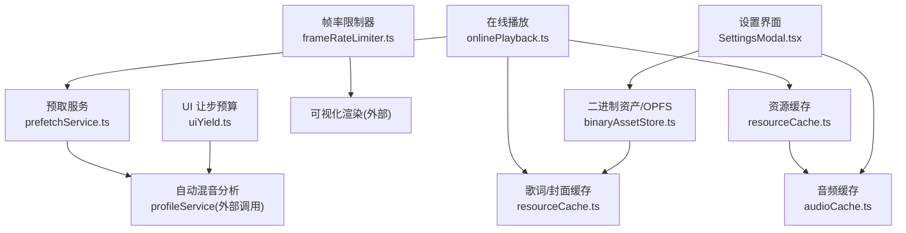
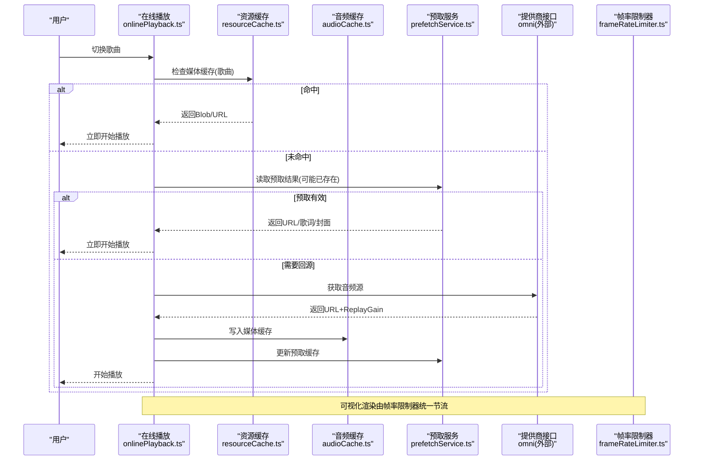
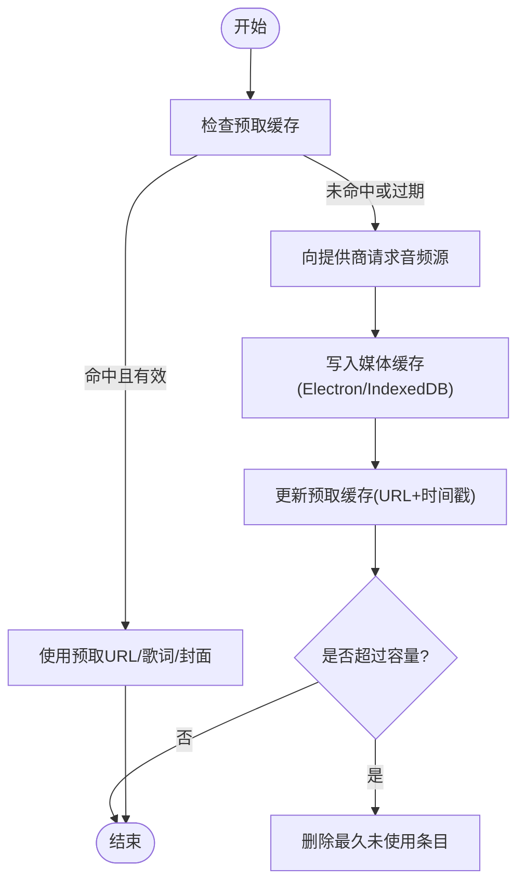
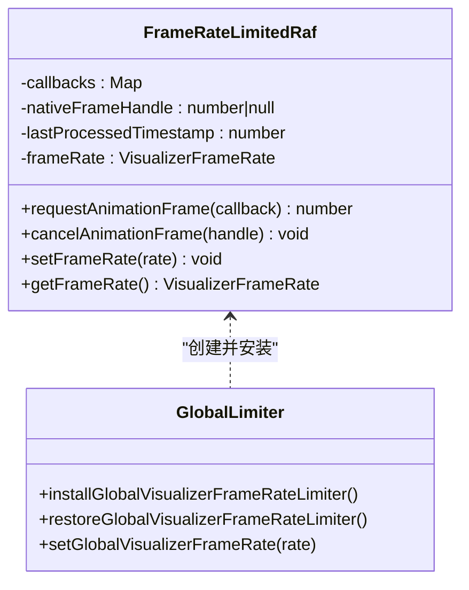
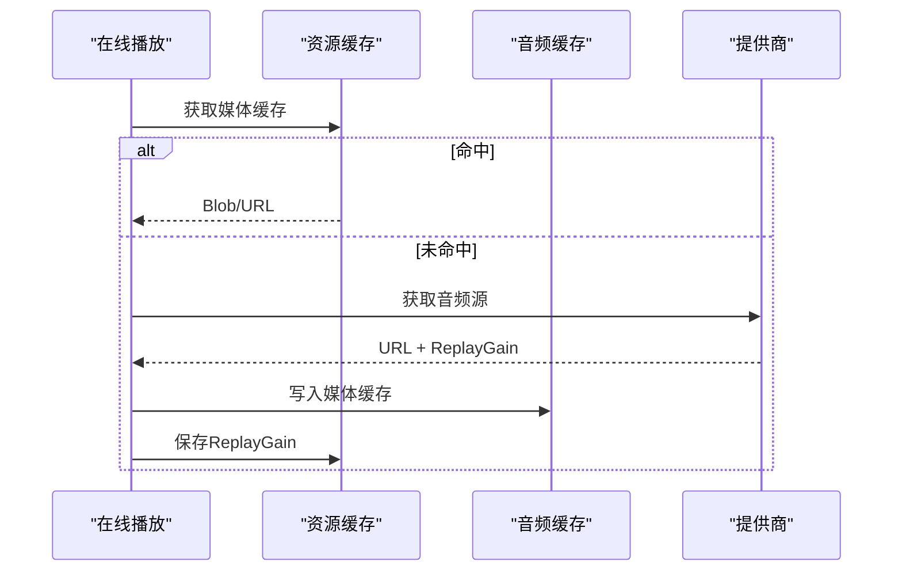
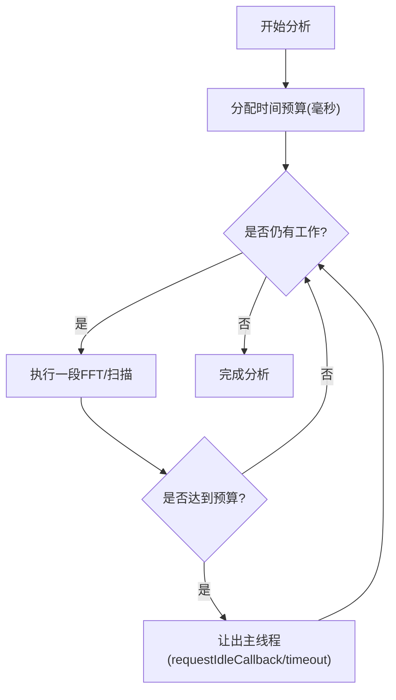
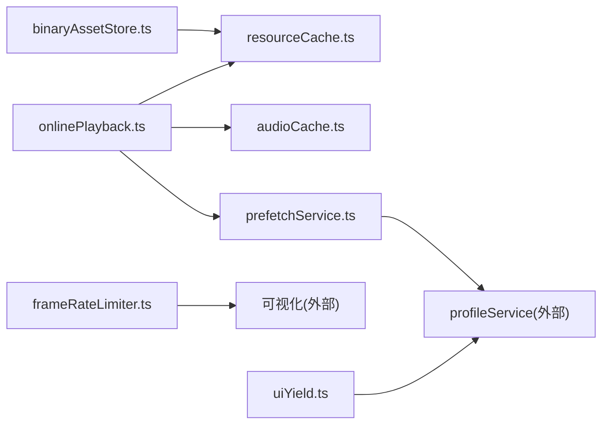

# 性能优化

<cite>
**本文引用的文件**
- [audioCache.ts](file://src/services/audioCache.ts)
- [frameRateLimiter.ts](file://src/utils/frameRateLimiter.ts)
- [prefetchService.ts](file://src/services/prefetchService.ts)
- [onlinePlayback.ts](file://src/services/onlinePlayback.ts)
- [resourceCache.ts](file://src/services/onlineMusic/resourceCache.ts)
- [binaryAssetStore.ts](file://src/services/binaryAssetStore.ts)
- [SettingsModal.tsx](file://src/components/modal/SettingsModal.tsx)
- [uiYield.ts](file://src/services/automix/uiYield.ts)
- [musicalTime.ts](file://src/services/automix/musicalTime.ts)
- [deckClock.test.ts](file://test/unit/automix/deckClock.test.ts)
- [coverCache.test.ts](file://test/unit/services/coverCache.test.ts)
- [benchmark_chorus.js](file://benchmark_chorus.js)
</cite>

## 目录
1. [简介](#简介)
2. [项目结构](#项目结构)
3. [核心组件](#核心组件)
4. [架构总览](#架构总览)
5. [详细组件分析](#详细组件分析)
6. [依赖关系分析](#依赖关系分析)
7. [性能考量](#性能考量)
8. [故障排查指南](#故障排查指南)
9. [结论](#结论)
10. [附录](#附录)

## 简介
本技术文档聚焦 Folia Player 播放系统的性能优化，围绕以下目标展开：
- 音频缓存策略：预加载机制、缓存淘汰算法、内存使用优化。
- 帧率限制器：实现原理与在流畅性与资源消耗间的平衡。
- 解码与网络优化：在线播放路径的缓存命中、URL 时效控制、歌词与封面缓存。
- DOM 与主线程优化：可视化渲染节流、长任务分片与 UI 让步。
- 性能监控与分析：指标收集、瓶颈识别、测试方法与案例研究。

## 项目结构
与播放性能相关的关键模块分布在服务层（缓存、预取、在线播放）、工具层（帧率限制、UI 让步）以及设置与存储层（二进制资产、缓存用量）。下图给出与播放链路相关的模块关系概览。

图表来源
- [onlinePlayback.ts:17-63](file://src/services/onlinePlayback.ts#L17-L63)
- [resourceCache.ts:13-94](file://src/services/onlineMusic/resourceCache.ts#L13-L94)
- [audioCache.ts:39-120](file://src/services/audioCache.ts#L39-L120)
- [prefetchService.ts:24-39](file://src/services/prefetchService.ts#L24-L39)
- [frameRateLimiter.ts:42-129](file://src/utils/frameRateLimiter.ts#L42-L129)
- [uiYield.ts:7-18](file://src/services/automix/uiYield.ts#L7-L18)
- [binaryAssetStore.ts:140-173](file://src/services/binaryAssetStore.ts#L140-L173)
- [SettingsModal.tsx:742-786](file://src/components/modal/SettingsModal.tsx#L742-L786)

章节来源
- [onlinePlayback.ts:17-63](file://src/services/onlinePlayback.ts#L17-L63)
- [prefetchService.ts:24-39](file://src/services/prefetchService.ts#L24-L39)
- [frameRateLimiter.ts:42-129](file://src/utils/frameRateLimiter.ts#L42-L129)
- [resourceCache.ts:13-94](file://src/services/onlineMusic/resourceCache.ts#L13-L94)
- [audioCache.ts:39-120](file://src/services/audioCache.ts#L39-L120)
- [binaryAssetStore.ts:140-173](file://src/services/binaryAssetStore.ts#L140-L173)
- [SettingsModal.tsx:742-786](file://src/components/modal/SettingsModal.tsx#L742-L786)
- [uiYield.ts:7-18](file://src/services/automix/uiYield.ts#L7-L18)

## 核心组件
- 音频缓存与迁移：统一从 Electron 文件缓存或 IndexedDB 读取/写入音频 Blob，支持旧数据迁移与写后事件通知。
- 预取服务：按队列前后窗口预取“轻量资源”（URL、歌词、封面），带 URL TTL、质量匹配、LRU 淘汰与空闲回调调度。
- 在线播放路径：优先命中媒体缓存与预取结果，必要时走提供商获取并回填预取缓存；同时处理 ReplayGain 恢复。
- 帧率限制器：全局拦截 requestAnimationFrame，按配置帧率聚合执行，避免过度渲染。
- 自动混音分析预算：在主线程上以毫秒级预算进行长任务分片，避免卡顿。
- 二进制资产与 OPFS：封面等二进制资源的持久化与用量统计，支持清理与容量查询。

章节来源
- [audioCache.ts:39-120](file://src/services/audioCache.ts#L39-L120)
- [prefetchService.ts:24-39](file://src/services/prefetchService.ts#L24-L39)
- [onlinePlayback.ts:17-63](file://src/services/onlinePlayback.ts#L17-L63)
- [frameRateLimiter.ts:42-129](file://src/utils/frameRateLimiter.ts#L42-L129)
- [uiYield.ts:7-18](file://src/services/automix/uiYield.ts#L7-L18)
- [binaryAssetStore.ts:140-173](file://src/services/binaryAssetStore.ts#L140-L173)

## 架构总览
下图展示一次“切歌”过程中的关键性能路径：预取、缓存命中、在线回源、分析与渲染节流。

图表来源
- [onlinePlayback.ts:17-63](file://src/services/onlinePlayback.ts#L17-L63)
- [resourceCache.ts:36-58](file://src/services/onlineMusic/resourceCache.ts#L36-L58)
- [audioCache.ts:39-120](file://src/services/audioCache.ts#L39-L120)
- [prefetchService.ts:117-154](file://src/services/prefetchService.ts#L117-L154)
- [frameRateLimiter.ts:42-129](file://src/utils/frameRateLimiter.ts#L42-L129)

## 详细组件分析

### 音频缓存策略（预加载、淘汰、内存优化）
- 预加载机制
  - 预取服务维护一个内存 Map，按当前曲目的前后窗口（前1首、后2首）预取“轻量资源”：可播放 URL、歌词与封面 URL。
  - URL 带有 TTL（默认 20 分钟），过期则失效；若指定音质不匹配也会丢弃 URL 但保留其他元数据。
  - 预取通过 requestIdleCallback 或超时降级，避免阻塞主线程。
- 缓存淘汰算法
  - 预取缓存采用 LRU 风格：每次访问将条目移动到末尾；超过最大容量时删除最久未使用的条目。
  - 媒体缓存（Electron 文件缓存/IndexedDB）由设置项控制上限，并在写入后进行修剪到阈值。
- 内存使用优化
  - 预取仅缓存 URL 与文本类资源，不下载封面图片，减少内存占用。
  - 媒体缓存优先使用 Electron 文件缓存，浏览器环境回退到 IndexedDB；迁移完成后释放旧数据。
  - 歌词与封面通过资源缓存键统一管理，支持历史键迁移，避免重复存储。

图表来源
- [prefetchService.ts:24-39](file://src/services/prefetchService.ts#L24-L39)
- [prefetchService.ts:117-154](file://src/services/prefetchService.ts#L117-L154)
- [prefetchService.ts:355-367](file://src/services/prefetchService.ts#L355-L367)
- [audioCache.ts:39-120](file://src/services/audioCache.ts#L39-L120)

章节来源
- [prefetchService.ts:24-39](file://src/services/prefetchService.ts#L24-L39)
- [prefetchService.ts:117-154](file://src/services/prefetchService.ts#L117-L154)
- [prefetchService.ts:355-367](file://src/services/prefetchService.ts#L355-L367)
- [audioCache.ts:39-120](file://src/services/audioCache.ts#L39-L120)

### 帧率限制器的实现原理与平衡
- 实现要点
  - 全局拦截 window.requestAnimationFrame/cancelAnimationFrame，将多个回调合并到同一帧内批量执行。
  - 根据配置的帧率计算最小间隔，结合时间戳判断是否应处理当前帧。
  - 支持动态调整帧率，并在关闭限制时恢复原生方法。
- 平衡策略
  - 高帧率（如 120fps）带来更顺滑的视觉反馈，但增加 GPU/CPU 压力；低帧率降低功耗但可能感知到抖动。
  - 提供“关闭”选项以禁用限制，适用于对延迟敏感的场景。

图表来源
- [frameRateLimiter.ts:42-129](file://src/utils/frameRateLimiter.ts#L42-L129)
- [frameRateLimiter.ts:131-197](file://src/utils/frameRateLimiter.ts#L131-L197)

章节来源
- [frameRateLimiter.ts:42-129](file://src/utils/frameRateLimiter.ts#L42-L129)
- [frameRateLimiter.ts:131-197](file://src/utils/frameRateLimiter.ts#L131-L197)

### 在线播放路径与网络请求优化
- 缓存优先：先查媒体缓存（Blob），再查预取 URL，最后才回源。
- URL 时效与质量匹配：预取 URL 有 TTL，且可按音质过滤，避免无效回源。
- ReplayGain 恢复：从缓存中恢复音量增益信息，保证连续播放的一致性。
- 歌词与封面：通过资源缓存键管理，支持历史迁移与独立清理。

图表来源
- [onlinePlayback.ts:17-63](file://src/services/onlinePlayback.ts#L17-L63)
- [resourceCache.ts:36-94](file://src/services/onlineMusic/resourceCache.ts#L36-L94)
- [audioCache.ts:39-120](file://src/services/audioCache.ts#L39-L120)

章节来源
- [onlinePlayback.ts:17-63](file://src/services/onlinePlayback.ts#L17-L63)
- [resourceCache.ts:36-94](file://src/services/onlineMusic/resourceCache.ts#L36-L94)
- [audioCache.ts:39-120](file://src/services/audioCache.ts#L39-L120)

### 自动混音分析的线程与时间模型
- 主线程让步：长任务（如频谱分析）按毫秒预算分片，避免阻塞 UI。
- 音乐时间单位：以小节/乐句为单位进行节拍对齐与过渡规划，确保跨曲平滑。
- 时钟拟合：通过对媒体元素位置采样拟合出更精确的时钟，提高双轨对齐精度。

图表来源
- [uiYield.ts:7-18](file://src/services/automix/uiYield.ts#L7-L18)
- [musicalTime.ts:10-23](file://src/services/automix/musicalTime.ts#L10-L23)
- [deckClock.test.ts:18-49](file://test/unit/automix/deckClock.test.ts#L18-L49)

章节来源
- [uiYield.ts:7-18](file://src/services/automix/uiYield.ts#L7-L18)
- [musicalTime.ts:10-23](file://src/services/automix/musicalTime.ts#L10-L23)
- [deckClock.test.ts:18-49](file://test/unit/automix/deckClock.test.ts#L18-L49)

### 二进制资产与缓存用量管理
- 封面等资源通过二进制资产存储（OPFS/Electron 桥接），支持用量统计与清理。
- 设置界面提供查看与清理入口，便于用户控制磁盘占用。

章节来源
- [binaryAssetStore.ts:140-173](file://src/services/binaryAssetStore.ts#L140-L173)
- [SettingsModal.tsx:742-786](file://src/components/modal/SettingsModal.tsx#L742-L786)

## 依赖关系分析
- 在线播放依赖资源缓存与音频缓存，形成“缓存优先、回源兜底”的路径。
- 预取服务与在线播放解耦：预取只负责准备轻量资源，实际播放时再决定是否需要回源。
- 帧率限制器与可视化渲染解耦：通过全局替换 RAF 的方式影响所有渲染循环。
- 自动混音分析依赖 UI 让步与音乐时间模型，确保长时间计算不阻塞交互。

图表来源
- [onlinePlayback.ts:17-63](file://src/services/onlinePlayback.ts#L17-L63)
- [prefetchService.ts:24-39](file://src/services/prefetchService.ts#L24-L39)
- [frameRateLimiter.ts:42-129](file://src/utils/frameRateLimiter.ts#L42-L129)
- [uiYield.ts:7-18](file://src/services/automix/uiYield.ts#L7-L18)
- [binaryAssetStore.ts:140-173](file://src/services/binaryAssetStore.ts#L140-L173)

章节来源
- [onlinePlayback.ts:17-63](file://src/services/onlinePlayback.ts#L17-L63)
- [prefetchService.ts:24-39](file://src/services/prefetchService.ts#L24-L39)
- [frameRateLimiter.ts:42-129](file://src/utils/frameRateLimiter.ts#L42-L129)
- [uiYield.ts:7-18](file://src/services/automix/uiYield.ts#L7-L18)
- [binaryAssetStore.ts:140-173](file://src/services/binaryAssetStore.ts#L140-L173)

## 性能考量
- 预取窗口大小：前后窗口越大，内存与网络开销越高；当前默认“前1后2”，兼顾响应速度与资源占用。
- URL TTL：过短导致频繁回源，过长可能导致链接失效；当前默认 20 分钟，适合大多数场景。
- 帧率限制：在高刷新率设备上建议开启限制，避免不必要的渲染；在低性能设备上可降低帧率以降低功耗。
- 分析预算：长任务按毫秒预算分片，避免主线程阻塞；在弱机上可适当降低预算或关闭非必需分析。
- 缓存命中率：提升媒体缓存命中率可显著减少首开延迟与卡顿；建议保持合理的缓存上限与定期清理。

[本节为通用指导，无需特定文件引用]

## 故障排查指南
- 媒体缓存未命中
  - 检查 Electron 文件缓存是否可用，或 IndexedDB 是否被清理。
  - 确认预取 URL 是否过期或音质不匹配。
- 歌词/封面未显示
  - 检查资源缓存键是否正确迁移，是否存在历史 Blob 残留。
  - 查看二进制资产存储用量，必要时清理。
- 可视化卡顿
  - 检查帧率限制器是否启用，尝试调整帧率或关闭限制对比。
  - 观察主线程是否被长任务阻塞，适当降低分析预算。
- 自动混音异常
  - 验证时钟拟合是否稳定，参考单元测试中的边界条件。
  - 检查音乐时间模型与节拍对齐逻辑是否符合预期。

章节来源
- [coverCache.test.ts:38-66](file://test/unit/services/coverCache.test.ts#L38-L66)
- [deckClock.test.ts:18-49](file://test/unit/automix/deckClock.test.ts#L18-L49)
- [frameRateLimiter.ts:42-129](file://src/utils/frameRateLimiter.ts#L42-L129)
- [uiYield.ts:7-18](file://src/services/automix/uiYield.ts#L7-L18)

## 结论
Folia Player 的播放性能优化围绕“缓存优先、预取先行、渲染节流、分析分片”四大原则构建。通过精细的预取策略与严格的 URL 时效控制，显著降低回源成本；帧率限制器与主线程让步保障交互流畅；自动混音的时间模型与拟合算法提升跨曲平滑度。配合设置界面的缓存管理与清理能力，用户可在体验与资源之间取得最佳平衡。

[本节为总结性内容，无需特定文件引用]

## 附录

### 性能监控与分析工具使用方法
- 指标收集
  - 使用浏览器性能面板记录关键路径（切换歌曲、预取、解析歌词、可视化渲染）。
  - 关注首字节时间、缓存命中率、RAF 调用频率与耗时。
- 瓶颈识别
  - 若首开延迟高：检查媒体缓存命中率与预取有效性。
  - 若卡顿明显：检查帧率限制器与主线程长任务（自动混音分析）。
  - 若内存增长：检查预取缓存容量与二进制资产用量。
- 测试方法
  - 使用基准脚本对比不同实现的耗时差异（例如歌词行检测优化）。
  - 通过单元测试覆盖边界情况（如时钟拟合、缓存迁移）。

章节来源
- [benchmark_chorus.js:74-89](file://benchmark_chorus.js#L74-L89)
- [deckClock.test.ts:18-49](file://test/unit/automix/deckClock.test.ts#L18-L49)
- [coverCache.test.ts:38-66](file://test/unit/services/coverCache.test.ts#L38-L66)