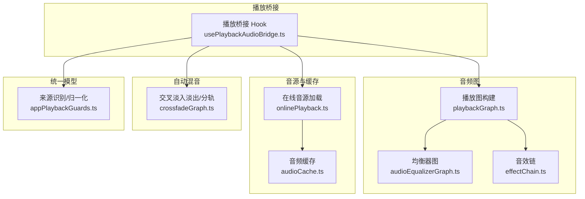
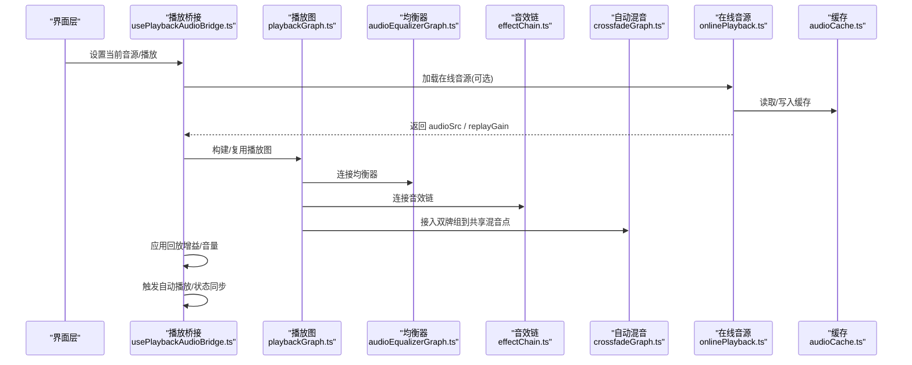
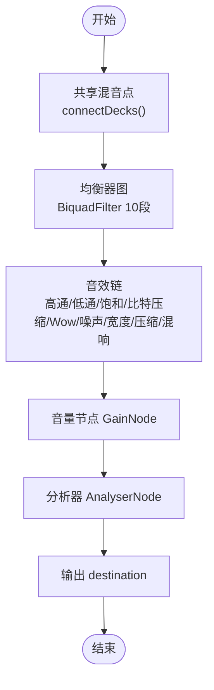
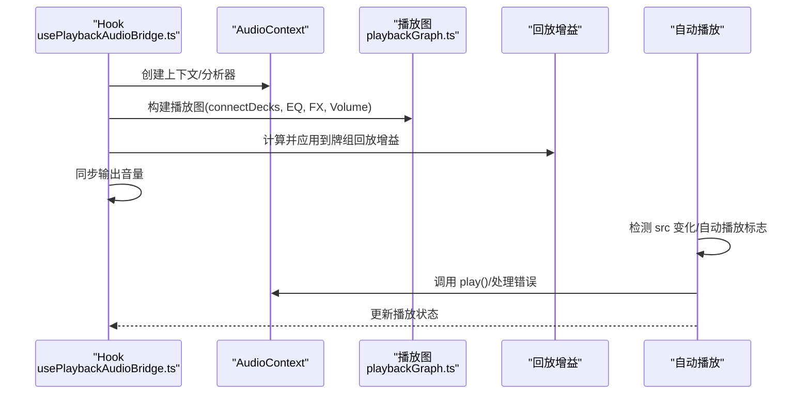
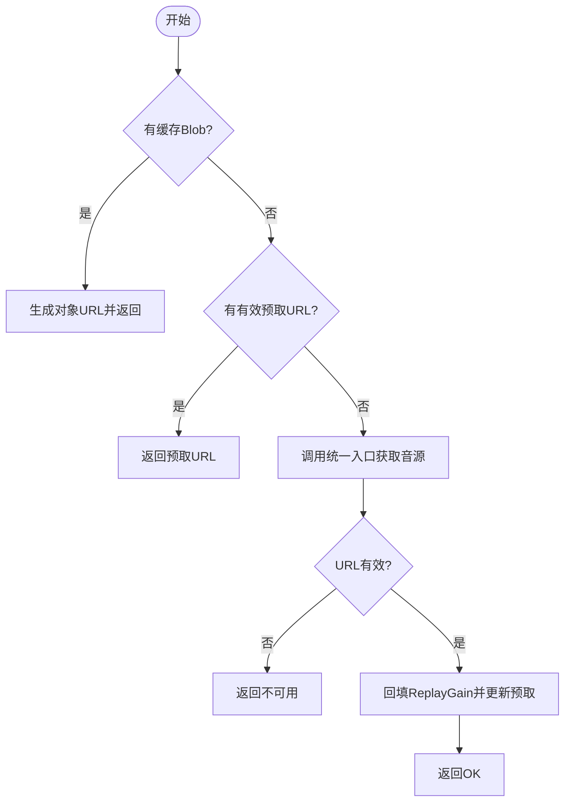
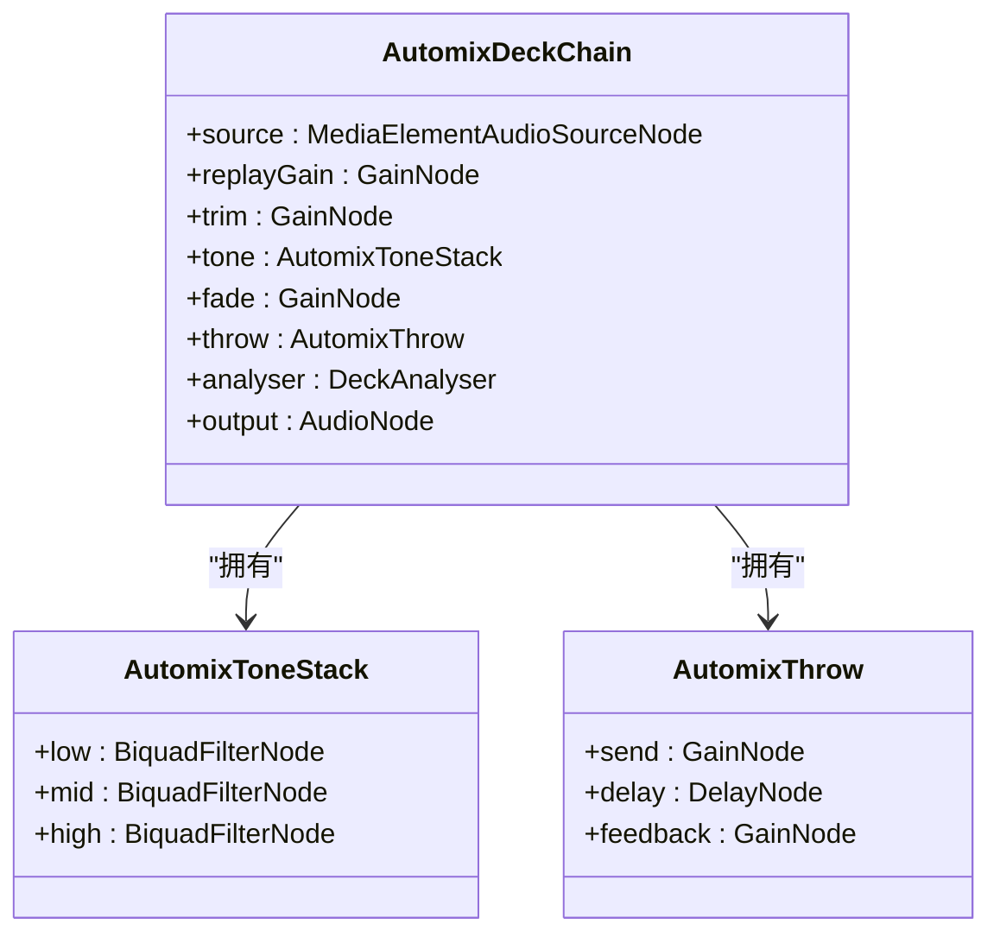
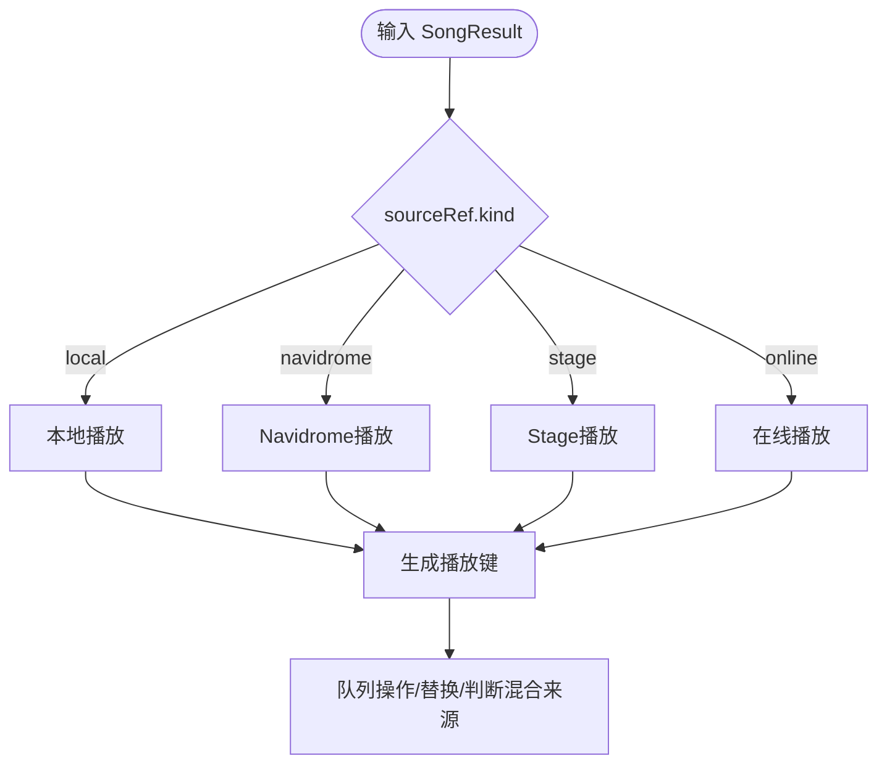
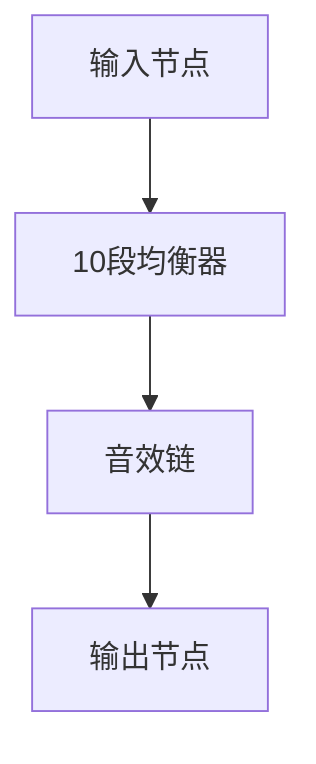
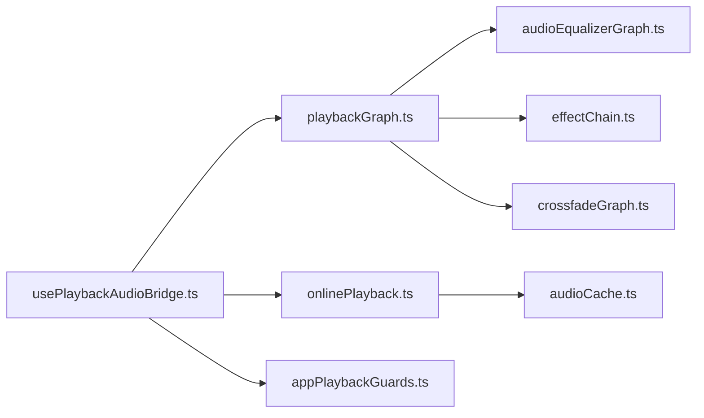

# 播放引擎

<cite>
**本文引用的文件**
- [playbackGraph.ts](file://src/services/playbackGraph.ts)
- [usePlaybackAudioBridge.ts](file://src/hooks/usePlaybackAudioBridge.ts)
- [audioEqualizerGraph.ts](file://src/services/audioEqualizerGraph.ts)
- [effectChain.ts](file://src/services/audioEffects/effectChain.ts)
- [onlinePlayback.ts](file://src/services/onlinePlayback.ts)
- [audioCache.ts](file://src/services/audioCache.ts)
- [crossfadeGraph.ts](file://src/services/automix/crossfadeGraph.ts)
- [appPlaybackGuards.ts](file://src/utils/appPlaybackGuards.ts)
- [audioEqualizer.ts](file://src/utils/audioEqualizer.ts)
</cite>

## 目录
1. [简介](#简介)
2. [项目结构](#项目结构)
3. [核心组件](#核心组件)
4. [架构总览](#架构总览)
5. [详细组件分析](#详细组件分析)
6. [依赖关系分析](#依赖关系分析)
7. [性能考量](#性能考量)
8. [故障排查指南](#故障排查指南)
9. [结论](#结论)
10. [附录](#附录)

## 简介
本技术文档聚焦 Folia Player 的播放引擎，围绕 Web Audio API 的节点图构建、音频流处理管道、实时处理能力与跨源播放适配进行系统化解析。内容涵盖：
- 统一播放适配器设计：本地文件、在线流媒体、Stage 播放器等来源的统一接入与调度
- 音频缓冲策略与错误恢复机制
- 跨平台音频设备兼容性与采样率安全边界
- 均衡器、音效链、音量控制、回放增益（ReplayGain）等核心功能实现细节
- 扩展新音频源适配器的方法与性能优化建议

## 项目结构
播放引擎相关代码主要分布在以下模块：
- 音频图构建与输出：playbackGraph.ts、audioEqualizerGraph.ts、effectChain.ts
- 播放桥接与自动播放控制：usePlaybackAudioBridge.ts
- 在线音源加载与歌词：onlinePlayback.ts
- 缓存与预取：audioCache.ts
- 自动混音与交叉淡入淡出：crossfadeGraph.ts
- 统一歌曲模型与来源识别：appPlaybackGuards.ts
- 均衡器配置与预设：audioEqualizer.ts

图表来源
- [playbackGraph.ts:31-98](file://src/services/playbackGraph.ts#L31-L98)
- [audioEqualizerGraph.ts:20-45](file://src/services/audioEqualizerGraph.ts#L20-L45)
- [effectChain.ts:31-93](file://src/services/audioEffects/effectChain.ts#L31-L93)
- [usePlaybackAudioBridge.ts:136-167](file://src/hooks/usePlaybackAudioBridge.ts#L136-L167)
- [onlinePlayback.ts:17-63](file://src/services/onlinePlayback.ts#L17-L63)
- [audioCache.ts:39-67](file://src/services/audioCache.ts#L39-L67)
- [crossfadeGraph.ts:100-151](file://src/services/automix/crossfadeGraph.ts#L100-L151)
- [appPlaybackGuards.ts:49-70](file://src/utils/appPlaybackGuards.ts#L49-L70)

章节来源
- [playbackGraph.ts:31-98](file://src/services/playbackGraph.ts#L31-L98)
- [usePlaybackAudioBridge.ts:136-167](file://src/hooks/usePlaybackAudioBridge.ts#L136-L167)
- [audioEqualizerGraph.ts:20-45](file://src/services/audioEqualizerGraph.ts#L20-L45)
- [effectChain.ts:31-93](file://src/services/audioEffects/effectChain.ts#L31-L93)
- [onlinePlayback.ts:17-63](file://src/services/onlinePlayback.ts#L17-L63)
- [audioCache.ts:39-67](file://src/services/audioCache.ts#L39-L67)
- [crossfadeGraph.ts:100-151](file://src/services/automix/crossfadeGraph.ts#L100-L151)
- [appPlaybackGuards.ts:49-70](file://src/utils/appPlaybackGuards.ts#L49-L70)

## 核心组件
- 播放图构建（playbackGraph.ts）：将两个自动混音牌组接入共享混音点，串联均衡器、音效链、音量节点、分析器与输出，确保可视化与分析器看到的是最终可听信号。
- 播放桥接（usePlaybackAudioBridge.ts）：负责创建 AudioContext、AnalyserNode、连接播放图、应用回放增益、自动播放控制、媒体缓存写入与状态同步。
- 均衡器图（audioEqualizerGraph.ts）：基于十段 BiquadFilter 构建稳定滤波链，支持平滑参数更新，避免 React 渲染路径进入音频线程。
- 音效链（effectChain.ts）：在均衡器之后接入高通/低通、饱和失真、比特压缩、Wow/Flutter、黑胶噪声、立体声宽度、动态压缩与混响，提供 apply/dispose 接口。
- 在线音源加载（onlinePlayback.ts）：优先从缓存或预取结果获取音频 URL，否则通过统一入口获取音源并回填 ReplayGain。
- 音频缓存（audioCache.ts）：Electron 文件缓存与 IndexedDB 回退，支持迁移与容量限制，提供写后事件通知。
- 自动混音（crossfadeGraph.ts）：双牌组接入共享混音点，按频段进行音色过渡、回声抛掷、软限幅、分轨窗口切换与交叉淡入淡出。
- 统一来源识别（appPlaybackGuards.ts）：识别本地、Navidrome、Stage、在线来源，并提供队列键与替换逻辑。

章节来源
- [playbackGraph.ts:31-98](file://src/services/playbackGraph.ts#L31-L98)
- [usePlaybackAudioBridge.ts:136-167](file://src/hooks/usePlaybackAudioBridge.ts#L136-L167)
- [audioEqualizerGraph.ts:20-45](file://src/services/audioEqualizerGraph.ts#L20-L45)
- [effectChain.ts:31-93](file://src/services/audioEffects/effectChain.ts#L31-L93)
- [onlinePlayback.ts:17-63](file://src/services/onlinePlayback.ts#L17-L63)
- [audioCache.ts:39-67](file://src/services/audioCache.ts#L39-L67)
- [crossfadeGraph.ts:100-151](file://src/services/automix/crossfadeGraph.ts#L100-L151)
- [appPlaybackGuards.ts:49-70](file://src/utils/appPlaybackGuards.ts#L49-L70)

## 架构总览
播放引擎以“统一播放图 + 多源适配”为核心：
- 统一播放图：mix -> 均衡器 -> 音效链 -> 音量 -> 分析器 -> 输出
- 多源适配：本地文件、在线流媒体、Stage 播放器通过统一的 SongResult 与 sourceRef 标识接入
- 自动混音：双牌组共享混音点，支持频段级过渡、分轨窗口与交叉淡入淡出
- 缓存与预取：在线音源优先走缓存/预取，失败再请求远端
- 回放增益：按轨道/专辑元数据对每轨独立补偿，避免混音时相互干扰

图表来源
- [usePlaybackAudioBridge.ts:136-167](file://src/hooks/usePlaybackAudioBridge.ts#L136-L167)
- [playbackGraph.ts:31-98](file://src/services/playbackGraph.ts#L31-L98)
- [audioEqualizerGraph.ts:20-45](file://src/services/audioEqualizerGraph.ts#L20-L45)
- [effectChain.ts:31-93](file://src/services/audioEffects/effectChain.ts#L31-L93)
- [crossfadeGraph.ts:100-151](file://src/services/automix/crossfadeGraph.ts#L100-L151)
- [onlinePlayback.ts:17-63](file://src/services/onlinePlayback.ts#L17-L63)
- [audioCache.ts:39-67](file://src/services/audioCache.ts#L39-L67)

## 详细组件分析

### 播放图与音频处理管道
- 节点顺序：双牌组 -> 共享混音点 -> 均衡器 -> 音效链 -> 音量 -> 分析器 -> 输出
- 设计要点：
  - 音量位于音效链之后，避免绝对型效果（如黑胶噪声、比特压缩、压缩阈值）被上游音量改变其特性
  - 分析器置于最后，确保可视化反映实际听到的声音（含用户音量）
  - 均衡器使用稳定的十段滤波器链，频率上限受采样率约束，避免超奈奎斯特频率
  - 音效链支持平滑参数更新与资源释放

图表来源
- [playbackGraph.ts:31-98](file://src/services/playbackGraph.ts#L31-L98)
- [audioEqualizerGraph.ts:20-45](file://src/services/audioEqualizerGraph.ts#L20-L45)
- [effectChain.ts:31-93](file://src/services/audioEffects/effectChain.ts#L31-L93)

章节来源
- [playbackGraph.ts:31-98](file://src/services/playbackGraph.ts#L31-L98)
- [audioEqualizerGraph.ts:20-45](file://src/services/audioEqualizerGraph.ts#L20-L45)
- [effectChain.ts:31-93](file://src/services/audioEffects/effectChain.ts#L31-L93)

### 播放桥接与自动播放控制
- 职责：
  - 创建 AudioContext 与 AnalyserNode，构建播放图
  - 应用回放增益（按轨道/专辑元数据），区分本地、Navidrome、在线来源
  - 自动播放控制：处理浏览器策略、中止错误、暂停抢占、状态同步
  - 媒体缓存写入：完成播放后将音频与封面写入缓存
- 关键流程：
  - setupAudioAnalyzer：初始化上下文、构建图、应用回放增益、同步输出音量
  - 自动播放：根据 src 变化与状态标志决定是否调用 play()，捕获 NotAllowedError/AbortError 并恢复意图

图表来源
- [usePlaybackAudioBridge.ts:82-134](file://src/hooks/usePlaybackAudioBridge.ts#L82-L134)
- [usePlaybackAudioBridge.ts:136-167](file://src/hooks/usePlaybackAudioBridge.ts#L136-L167)
- [usePlaybackAudioBridge.ts:244-320](file://src/hooks/usePlaybackAudioBridge.ts#L244-L320)

章节来源
- [usePlaybackAudioBridge.ts:82-134](file://src/hooks/usePlaybackAudioBridge.ts#L82-L134)
- [usePlaybackAudioBridge.ts:136-167](file://src/hooks/usePlaybackAudioBridge.ts#L136-L167)
- [usePlaybackAudioBridge.ts:244-320](file://src/hooks/usePlaybackAudioBridge.ts#L244-L320)

### 在线音源加载与缓存策略
- 优先级：
  1) 已缓存 Blob -> 生成对象 URL 并返回
  2) 预取音频 URL -> 直接返回
  3) 调用统一入口获取音源 -> 回填 ReplayGain -> 更新预取信息
- 缓存写入：
  - Electron 环境优先写入文件缓存，IndexedDB 作为回退
  - 写后通知监听器，便于后续分析或 UI 刷新
- 错误恢复：
  - 远端不可用返回 unavailable，上层可降级或提示
  - 预取 URL 校验失败则跳过

图表来源
- [onlinePlayback.ts:17-63](file://src/services/onlinePlayback.ts#L17-L63)
- [audioCache.ts:39-67](file://src/services/audioCache.ts#L39-L67)
- [audioCache.ts:100-121](file://src/services/audioCache.ts#L100-L121)

章节来源
- [onlinePlayback.ts:17-63](file://src/services/onlinePlayback.ts#L17-L63)
- [audioCache.ts:39-67](file://src/services/audioCache.ts#L39-L67)
- [audioCache.ts:100-121](file://src/services/audioCache.ts#L100-L121)

### 自动混音与交叉淡入淡出
- 双牌组接入共享混音点，每个牌组包含：
  - 回放增益节点、平衡修正、三段频段滤波器（低/中/高）、淡入淡出、回声抛掷、分析器
- 能力：
  - 频段级过渡：为低频、中频、高频分别规划曲线，避免混音时的浑浊
  - 回声抛掷：在切出前将尾音送入延迟反馈，增强自然度
  - 软限幅：防止两轨叠加削波
  - 分轨窗口：在指定时间窗内用分轨替代元素播放，提升过渡精度
  - 交叉淡入淡出：按曲线调度 outgoing/incoming 增益，支持 hold/together 参数

图表来源
- [crossfadeGraph.ts:17-50](file://src/services/automix/crossfadeGraph.ts#L17-L50)
- [crossfadeGraph.ts:100-151](file://src/services/automix/crossfadeGraph.ts#L100-L151)

章节来源
- [crossfadeGraph.ts:100-151](file://src/services/automix/crossfadeGraph.ts#L100-L151)
- [crossfadeGraph.ts:213-263](file://src/services/automix/crossfadeGraph.ts#L213-L263)
- [crossfadeGraph.ts:277-304](file://src/services/automix/crossfadeGraph.ts#L277-L304)
- [crossfadeGraph.ts:381-402](file://src/services/automix/crossfadeGraph.ts#L381-L402)
- [crossfadeGraph.ts:427-487](file://src/services/automix/crossfadeGraph.ts#L427-L487)
- [crossfadeGraph.ts:538-603](file://src/services/automix/crossfadeGraph.ts#L538-L603)
- [crossfadeGraph.ts:622-651](file://src/services/automix/crossfadeGraph.ts#L622-L651)

### 统一播放适配器与来源识别
- 统一模型：SongResult 携带 sourceRef，标识来源类型与媒体 ID
- 来源识别：
  - 本地：isLocalPlaybackSong
  - Navidrome：isNavidromePlaybackSong
  - Stage：isStagePlaybackSong
  - 在线：isOnlinePlaybackSong
- 队列操作：
  - getPlaybackSongKey：生成跨来源唯一键
  - replacePlaybackSongInQueue：按 key 替换队列项
  - hasMixedPlaybackSources：检测混合来源

图表来源
- [appPlaybackGuards.ts:49-70](file://src/utils/appPlaybackGuards.ts#L49-L70)
- [appPlaybackGuards.ts:84-119](file://src/utils/appPlaybackGuards.ts#L84-L119)

章节来源
- [appPlaybackGuards.ts:49-70](file://src/utils/appPlaybackGuards.ts#L49-L70)
- [appPlaybackGuards.ts:84-119](file://src/utils/appPlaybackGuards.ts#L84-L119)

### 均衡器与音效链
- 均衡器：
  - 十段滤波器，首段 lowshelf、末段 highshelf，中间 peaking
  - 频率上限受采样率限制，避免失真
  - 支持平滑参数更新，避免音频路径抖动
- 音效链：
  - 高通/低通、饱和失真、比特压缩、Wow/Flutter、黑胶噪声、立体声宽度、动态压缩、混响
  - 支持 apply/dispose，按需启用/禁用
  - 参数映射到具体节点，避免主线程阻塞影响

图表来源
- [audioEqualizerGraph.ts:20-45](file://src/services/audioEqualizerGraph.ts#L20-L45)
- [effectChain.ts:31-93](file://src/services/audioEffects/effectChain.ts#L31-L93)

章节来源
- [audioEqualizerGraph.ts:20-45](file://src/services/audioEqualizerGraph.ts#L20-L45)
- [effectChain.ts:31-93](file://src/services/audioEffects/effectChain.ts#L31-L93)
- [audioEqualizer.ts:29-40](file://src/utils/audioEqualizer.ts#L29-L40)

## 依赖关系分析
- playbackGraph.ts 依赖 audioEqualizerGraph.ts 与 effectChain.ts，并通过 connectDecks 接入 crossfadeGraph.ts 的双牌组
- usePlaybackAudioBridge.ts 依赖 playbackGraph.ts、audioEqualizerGraph.ts、effectChain.ts、onlinePlayback.ts、audioCache.ts
- onlinePlayback.ts 依赖 audioCache.ts 与统一音源入口
- crossfadeGraph.ts 提供牌组连接、淡入淡出、分轨窗口等能力，供 playbackGraph.ts 接入
- appPlaybackGuards.ts 为所有播放路径提供来源识别与队列操作

图表来源
- [usePlaybackAudioBridge.ts:136-167](file://src/hooks/usePlaybackAudioBridge.ts#L136-L167)
- [playbackGraph.ts:31-98](file://src/services/playbackGraph.ts#L31-L98)
- [audioEqualizerGraph.ts:20-45](file://src/services/audioEqualizerGraph.ts#L20-L45)
- [effectChain.ts:31-93](file://src/services/audioEffects/effectChain.ts#L31-L93)
- [onlinePlayback.ts:17-63](file://src/services/onlinePlayback.ts#L17-L63)
- [audioCache.ts:39-67](file://src/services/audioCache.ts#L39-L67)
- [crossfadeGraph.ts:100-151](file://src/services/automix/crossfadeGraph.ts#L100-L151)
- [appPlaybackGuards.ts:49-70](file://src/utils/appPlaybackGuards.ts#L49-L70)

章节来源
- [usePlaybackAudioBridge.ts:136-167](file://src/hooks/usePlaybackAudioBridge.ts#L136-L167)
- [playbackGraph.ts:31-98](file://src/services/playbackGraph.ts#L31-L98)
- [audioEqualizerGraph.ts:20-45](file://src/services/audioEqualizerGraph.ts#L20-L45)
- [effectChain.ts:31-93](file://src/services/audioEffects/effectChain.ts#L31-L93)
- [onlinePlayback.ts:17-63](file://src/services/onlinePlayback.ts#L17-L63)
- [audioCache.ts:39-67](file://src/services/audioCache.ts#L39-L67)
- [crossfadeGraph.ts:100-151](file://src/services/automix/crossfadeGraph.ts#L100-L151)
- [appPlaybackGuards.ts:49-70](file://src/utils/appPlaybackGuards.ts#L49-L70)

## 性能考量
- 音频线程隔离：均衡器与音效链的参数更新使用 setTargetAtTime/rampParam，避免在音频回调中执行重计算
- 采样率安全：均衡器频率上限限制为 sampleRate * 0.475，避免超奈奎斯特频率导致的失真
- 音量位置：音量节点置于音效链之后，保证绝对型效果的线性响应与一致性
- 自动混音曲线：所有过渡曲线在音频时钟上调度，不受主线程卡顿影响
- 缓存命中：在线音源优先走缓存/预取，减少网络开销与解码延迟
- 资源释放：音效链 dispose 时断开节点并停止子节点，避免内存泄漏

[本节为通用性能指导，不直接分析具体文件]

## 故障排查指南
- 自动播放被阻止：
  - 现象：播放失败并显示提示信息
  - 原因：浏览器策略不允许自动播放
  - 处理：捕获 NotAllowedError，提示用户点击播放
  - 参考路径：[usePlaybackAudioBridge.ts:244-320](file://src/hooks/usePlaybackAudioBridge.ts#L244-L320)
- 播放中断导致意图丢失：
  - 现象：多次切换后无声音
  - 原因：load() 与 play() 竞态导致 AbortError
  - 处理：恢复自动播放标志，等待下一次提交
  - 参考路径：[usePlaybackAudioBridge.ts:244-320](file://src/hooks/usePlaybackAudioBridge.ts#L244-L320)
- 在线音源不可用：
  - 现象：返回 unavailable
  - 原因：远端暂时不可用或 URL 无效
  - 处理：降级或提示重试
  - 参考路径：[onlinePlayback.ts:17-63](file://src/services/onlinePlayback.ts#L17-L63)
- 均衡器参数异常：
  - 现象：声音异常或无声
  - 原因：频率超出采样率限制或参数未平滑
  - 处理：检查频率上限与 setTargetAtTime 使用
  - 参考路径：[audioEqualizerGraph.ts:20-45](file://src/services/audioEqualizerGraph.ts#L20-L45)
- 自动混音曲线被拒绝：
  - 现象：过渡退化为硬切
  - 原因：音频引擎拒绝曲线调度
  - 处理：回退到普通交叉淡入淡出并重置状态
  - 参考路径：[crossfadeGraph.ts:213-263](file://src/services/automix/crossfadeGraph.ts#L213-L263), [crossfadeGraph.ts:622-651](file://src/services/automix/crossfadeGraph.ts#L622-L651)

章节来源
- [usePlaybackAudioBridge.ts:244-320](file://src/hooks/usePlaybackAudioBridge.ts#L244-L320)
- [onlinePlayback.ts:17-63](file://src/services/onlinePlayback.ts#L17-L63)
- [audioEqualizerGraph.ts:20-45](file://src/services/audioEqualizerGraph.ts#L20-L45)
- [crossfadeGraph.ts:213-263](file://src/services/automix/crossfadeGraph.ts#L213-L263)
- [crossfadeGraph.ts:622-651](file://src/services/automix/crossfadeGraph.ts#L622-L651)

## 结论
Folia Player 的播放引擎以统一的播放图与多源适配为核心，结合均衡器、音效链、自动混音与缓存策略，实现了高性能、可扩展且鲁棒的音频播放能力。通过严格的音频线程隔离、采样率安全边界与错误恢复机制，确保了在不同平台与设备上的稳定表现。扩展新音频源适配器时，只需遵循统一模型与来源识别规范，即可无缝接入现有播放管道。

[本节为总结性内容，不直接分析具体文件]

## 附录

### 如何扩展新的音频源适配器
- 步骤概览：
  1) 定义新的 sourceRef.kind 与 mediaId，确保与 appPlaybackGuards.ts 的识别逻辑兼容
  2) 在播放桥接中，当检测到新来源时，调用对应的加载函数获取 audioSrc 与 replayGain
  3) 若需要缓存，遵循 audioCache.ts 的写入接口，并在写后监听中处理后续逻辑
  4) 如需特殊处理（如分轨、转码），可在 playbackGraph.ts 的 connectDecks 中接入额外节点
- 参考路径：
  - 来源识别与队列键：[appPlaybackGuards.ts:49-70](file://src/utils/appPlaybackGuards.ts#L49-L70), [appPlaybackGuards.ts:84-119](file://src/utils/appPlaybackGuards.ts#L84-L119)
  - 在线音源加载模式：[onlinePlayback.ts:17-63](file://src/services/onlinePlayback.ts#L17-L63)
  - 缓存写入与监听：[audioCache.ts:100-121](file://src/services/audioCache.ts#L100-L121)
  - 播放图接入点：[playbackGraph.ts:31-98](file://src/services/playbackGraph.ts#L31-L98)

章节来源
- [appPlaybackGuards.ts:49-70](file://src/utils/appPlaybackGuards.ts#L49-L70)
- [appPlaybackGuards.ts:84-119](file://src/utils/appPlaybackGuards.ts#L84-L119)
- [onlinePlayback.ts:17-63](file://src/services/onlinePlayback.ts#L17-L63)
- [audioCache.ts:100-121](file://src/services/audioCache.ts#L100-L121)
- [playbackGraph.ts:31-98](file://src/services/playbackGraph.ts#L31-L98)

### 音频格式支持与采样率转换
- 格式支持：
  - 浏览器原生支持的音频格式（如 MP3、AAC、OGG、WAV）由 HTMLMediaElement 与 Web Audio API 共同决定
  - 在线音源 URL 需经 toSafePlaybackUrl 校验，确保可被浏览器解码
- 采样率转换：
  - 均衡器频率上限受 context.sampleRate 限制，避免超奈奎斯特频率
  - 自动混音的分轨与缓冲区创建使用目标采样率，确保对齐与相位一致
- 参考路径：
  - 均衡器频率限制：[audioEqualizerGraph.ts:15-17](file://src/services/audioEqualizerGraph.ts#L15-L17)
  - 分轨缓冲区创建：[crossfadeGraph.ts:427-487](file://src/services/automix/crossfadeGraph.ts#L427-L487)

章节来源
- [audioEqualizerGraph.ts:15-17](file://src/services/audioEqualizerGraph.ts#L15-L17)
- [crossfadeGraph.ts:427-487](file://src/services/automix/crossfadeGraph.ts#L427-L487)

### 音量控制与回放增益
- 音量控制：
  - 音量节点位于音效链之后，确保绝对型效果不受上游音量影响
  - 输出音量通过 syncOutputGain 平滑调整，避免点击声
- 回放增益：
  - 按轨道/专辑元数据计算线性增益，应用于牌组的 replayGain 节点
  - 不同来源（本地、Navidrome、在线）的元数据合并与优先级处理
- 参考路径：
  - 音量位置与日志：[playbackGraph.ts:54-95](file://src/services/playbackGraph.ts#L54-L95)
  - 回放增益计算与应用：[usePlaybackAudioBridge.ts:82-134](file://src/hooks/usePlaybackAudioBridge.ts#L82-L134)

章节来源
- [playbackGraph.ts:54-95](file://src/services/playbackGraph.ts#L54-L95)
- [usePlaybackAudioBridge.ts:82-134](file://src/hooks/usePlaybackAudioBridge.ts#L82-L134)