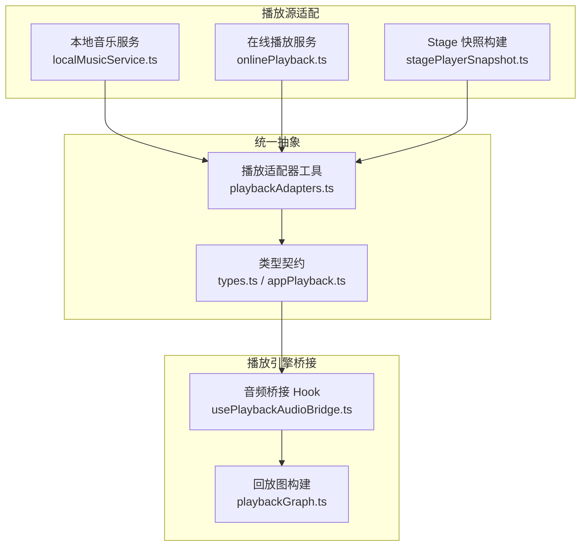
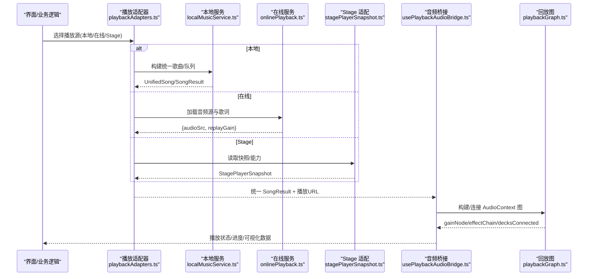
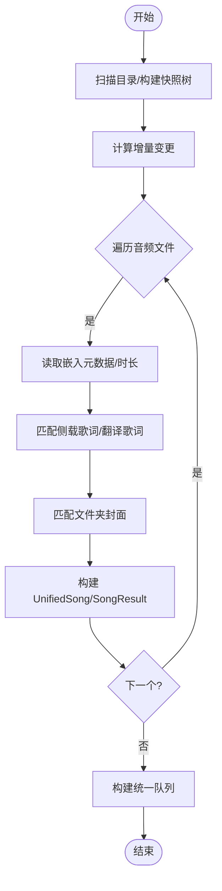
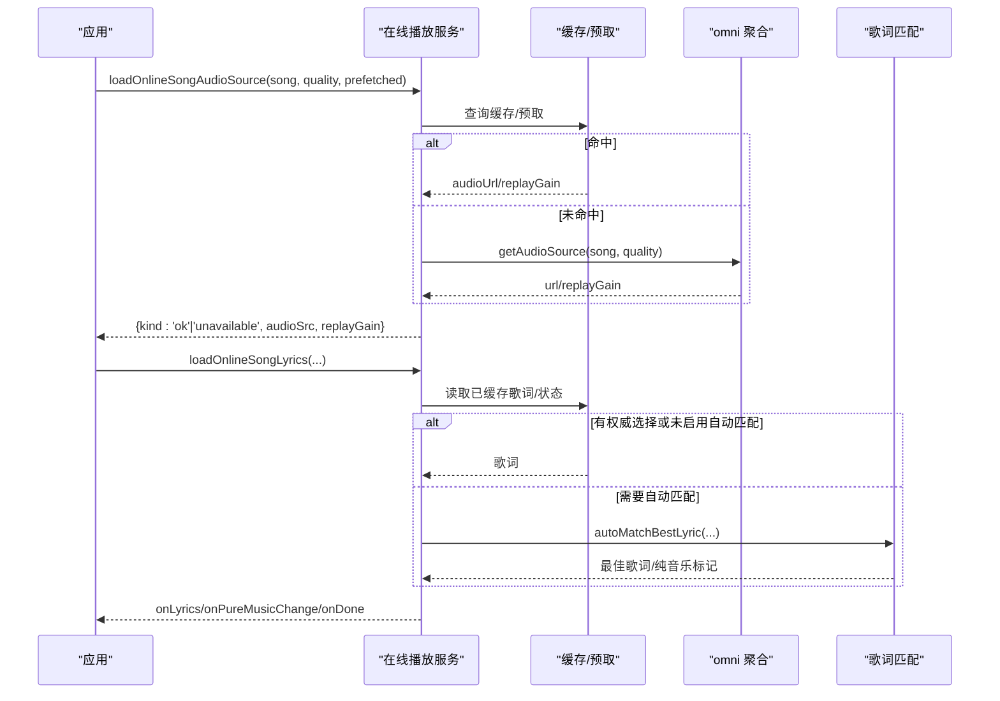
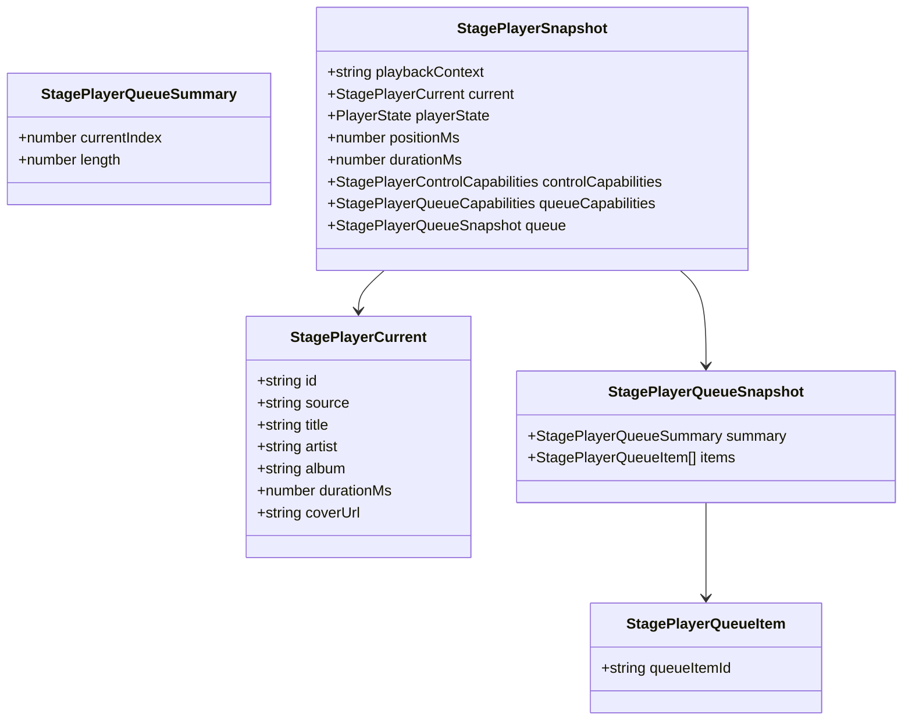
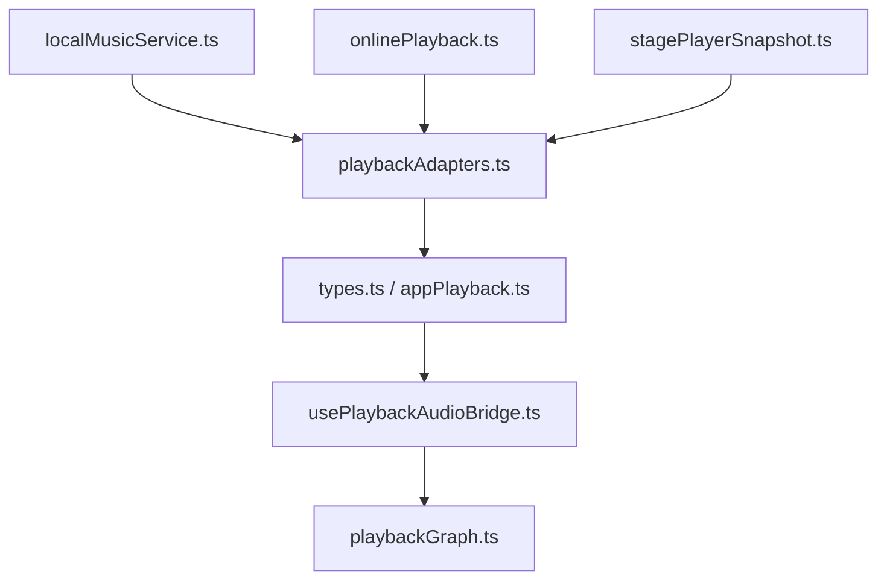

# 播放适配器

<cite>
**本文引用的文件**
- [src/services/playbackAdapters.ts](file://src/services/playbackAdapters.ts)
- [src/services/onlinePlayback.ts](file://src/services/onlinePlayback.ts)
- [src/services/localMusicService.ts](file://src/services/localMusicService.ts)
- [src/services/playbackGraph.ts](file://src/services/playbackGraph.ts)
- [src/hooks/usePlaybackAudioBridge.ts](file://src/hooks/usePlaybackAudioBridge.ts)
- [src/utils/stagePlayerSnapshot.ts](file://src/utils/stagePlayerSnapshot.ts)
- [src/types.ts](file://src/types.ts)
- [src/types/appPlayback.ts](file://src/types/appPlayback.ts)
- [src/services/playerCapProvider.ts](file://src/services/playerCapProvider.ts)
</cite>

## 目录
1. [简介](#简介)
2. [项目结构](#项目结构)
3. [核心组件](#核心组件)
4. [架构总览](#架构总览)
5. [详细组件分析](#详细组件分析)
6. [依赖关系分析](#依赖关系分析)
7. [性能考量](#性能考量)
8. [故障排查指南](#故障排查指南)
9. [结论](#结论)
10. [附录](#附录)

## 简介
本技术文档围绕 Folia Player 的“播放适配器”体系展开，聚焦于如何通过适配器模式统一不同来源的音频播放接口（本地文件、在线流媒体、Stage 外部播放器等），并说明与播放引擎的交互协议、数据交换格式、状态同步与错误处理。同时提供扩展新适配器的实践指引，涵盖音频格式兼容性、跨平台差异适配与性能优化策略。

## 项目结构
Folia 的播放子系统以“服务层 + Hook 桥接 + 类型契约”的方式组织：
- 服务层负责具体播放源的数据获取与转换（本地、在线、Stage）。
- Hook 层将浏览器原生 AudioElement 与 Web Audio API 图连接起来，完成音量、均衡器、效果链、可视化等。
- 类型层定义统一的 SongResult、队列、Stage 快照与控制能力等契约，屏蔽来源差异。

图表来源
- [src/services/localMusicService.ts:1-120](file://src/services/localMusicService.ts#L1-L120)
- [src/services/onlinePlayback.ts:17-63](file://src/services/onlinePlayback.ts#L17-L63)
- [src/utils/stagePlayerSnapshot.ts:1-34](file://src/utils/stagePlayerSnapshot.ts#L1-L34)
- [src/services/playbackAdapters.ts:138-216](file://src/services/playbackAdapters.ts#L138-L216)
- [src/types.ts:251-354](file://src/types.ts#L251-L354)
- [src/types/appPlayback.ts:47-105](file://src/types/appPlayback.ts#L47-L105)
- [src/hooks/usePlaybackAudioBridge.ts:150-167](file://src/hooks/usePlaybackAudioBridge.ts#L150-L167)
- [src/services/playbackGraph.ts:31-98](file://src/services/playbackGraph.ts#L31-L98)

章节来源
- [src/services/localMusicService.ts:1-120](file://src/services/localMusicService.ts#L1-L120)
- [src/services/onlinePlayback.ts:17-63](file://src/services/onlinePlayback.ts#L17-L63)
- [src/utils/stagePlayerSnapshot.ts:1-34](file://src/utils/stagePlayerSnapshot.ts#L1-L34)
- [src/services/playbackAdapters.ts:138-216](file://src/services/playbackAdapters.ts#L138-L216)
- [src/types.ts:251-354](file://src/types.ts#L251-L354)
- [src/types/appPlayback.ts:47-105](file://src/types/appPlayback.ts#L47-L105)
- [src/hooks/usePlaybackAudioBridge.ts:150-167](file://src/hooks/usePlaybackAudioBridge.ts#L150-L167)
- [src/services/playbackGraph.ts:31-98](file://src/services/playbackGraph.ts#L31-L98)

## 核心组件
- 本地音乐服务：扫描本地库、解析元数据与歌词、生成可播放 URL，并将本地歌曲映射为统一模型。
- 在线播放服务：通过 omni 聚合多个在线提供商，优先走缓存/预取，失败时回退到网络请求，返回安全播放 URL 与响度信息。
- Stage 适配：将主窗口或外部 Stage 的播放上下文转换为统一快照，供 UI 与第三方集成消费。
- 播放适配器工具：将本地/Navidrome 等异构数据结构转换为统一的 SongResult，并注入封面、艺术家实体等显示信息。
- 音频桥接 Hook：管理 AudioContext、均衡器、效果链、ReplayGain、自动播放、媒体缓存等。
- 回放图：按固定顺序连接节点，确保可视化与音量控制作用于最终输出。

章节来源
- [src/services/localMusicService.ts:1-120](file://src/services/localMusicService.ts#L1-L120)
- [src/services/onlinePlayback.ts:17-63](file://src/services/onlinePlayback.ts#L17-L63)
- [src/utils/stagePlayerSnapshot.ts:1-34](file://src/utils/stagePlayerSnapshot.ts#L1-L34)
- [src/services/playbackAdapters.ts:138-216](file://src/services/playbackAdapters.ts#L138-L216)
- [src/hooks/usePlaybackAudioBridge.ts:81-167](file://src/hooks/usePlaybackAudioBridge.ts#L81-L167)
- [src/services/playbackGraph.ts:31-98](file://src/services/playbackGraph.ts#L31-L98)

## 架构总览
下图展示了从“播放源”到“播放引擎”的完整链路：适配层产出统一 SongResult，Hook 将其转为可播放资源并接入 Web Audio 图，最终驱动渲染与可视化。

图表来源
- [src/services/playbackAdapters.ts:138-216](file://src/services/playbackAdapters.ts#L138-L216)
- [src/services/onlinePlayback.ts:17-63](file://src/services/onlinePlayback.ts#L17-L63)
- [src/utils/stagePlayerSnapshot.ts:1-34](file://src/utils/stagePlayerSnapshot.ts#L1-L34)
- [src/hooks/usePlaybackAudioBridge.ts:150-167](file://src/hooks/usePlaybackAudioBridge.ts#L150-L167)
- [src/services/playbackGraph.ts:31-98](file://src/services/playbackGraph.ts#L31-L98)

## 详细组件分析

### 本地文件播放器适配器
- 职责
  - 扫描本地目录，识别音频与侧载歌词、封面。
  - 解析嵌入元数据与文件名启发式信息，计算时长。
  - 将本地歌曲转换为统一模型 UnifiedSong/SongResult，并注入封面与艺术家实体。
- 关键流程
  - 构建快照树，增量更新变更项。
  - 对每个音频文件读取歌词/封面，合并元数据。
  - 生成稳定的本地 ID 与统一队列。
- 兼容性与优化
  - 支持多种音频与歌词后缀，优先级排序。
  - 并发导入与批处理，减少 I/O 阻塞。
  - 使用对象 URL 与 Blob 缓存封面与歌词。

图表来源
- [src/services/localMusicService.ts:413-530](file://src/services/localMusicService.ts#L413-L530)
- [src/services/localMusicService.ts:560-728](file://src/services/localMusicService.ts#L560-L728)
- [src/services/playbackAdapters.ts:138-216](file://src/services/playbackAdapters.ts#L138-L216)

章节来源
- [src/services/localMusicService.ts:413-728](file://src/services/localMusicService.ts#L413-L728)
- [src/services/playbackAdapters.ts:138-216](file://src/services/playbackAdapters.ts#L138-L216)

### 在线流媒体播放器适配器
- 职责
  - 通过 omni 统一获取音频源与歌词，优先使用缓存/预取结果。
  - 校验并规范化播放 URL，附加 ReplayGain 信息。
  - 处理纯音乐判定与最佳歌词自动匹配。
- 关键流程
  - 尝试从缓存/预取中恢复音频 URL；失败则调用 omni 获取。
  - 若歌词未就绪且允许自动匹配，后台搜索更优歌词并在可用时替换。
- 错误处理
  - 提供者不可用时返回 unavailable，避免阻塞播放。
  - 歌词匹配失败时降级到已有歌词或无歌词。

图表来源
- [src/services/onlinePlayback.ts:17-63](file://src/services/onlinePlayback.ts#L17-L63)
- [src/services/onlinePlayback.ts:72-254](file://src/services/onlinePlayback.ts#L72-L254)

章节来源
- [src/services/onlinePlayback.ts:17-254](file://src/services/onlinePlayback.ts#L17-L254)

### Stage 播放器适配器
- 职责
  - 将主窗口或外部 Stage 的播放上下文转换为统一快照，暴露控制与队列能力。
  - 计算当前曲目、位置、持续时间、能力集，供上层 UI 与集成方消费。
- 关键点
  - 区分 normal-playback、stage-session、external-playback-source 三种上下文。
  - 对外仅暴露最小必要字段，隐藏内部实现细节。

图表来源
- [src/types.ts:251-354](file://src/types.ts#L251-L354)
- [src/utils/stagePlayerSnapshot.ts:1-34](file://src/utils/stagePlayerSnapshot.ts#L1-L34)

章节来源
- [src/types.ts:251-354](file://src/types.ts#L251-L354)
- [src/utils/stagePlayerSnapshot.ts:1-34](file://src/utils/stagePlayerSnapshot.ts#L1-L34)

### 播放引擎与音频图
- 职责
  - 构建稳定的 Web Audio 图：输入 -> 混音点 -> 均衡器 -> 效果链 -> 音量 -> 分析器 -> 输出。
  - 保证可视化与分析器看到的是最终输出，避免效果链顺序导致的音量感知不一致。
- 关键点
  - 双 Deck 接入共享混音点，便于自动化混音。
  - 音量节点置于效果链之后，确保效果行为稳定。

图表来源
- [src/services/playbackGraph.ts:31-98](file://src/services/playbackGraph.ts#L31-L98)
- [src/hooks/usePlaybackAudioBridge.ts:150-167](file://src/hooks/usePlaybackAudioBridge.ts#L150-L167)

章节来源
- [src/services/playbackGraph.ts:31-98](file://src/services/playbackGraph.ts#L31-L98)
- [src/hooks/usePlaybackAudioBridge.ts:150-167](file://src/hooks/usePlaybackAudioBridge.ts#L150-L167)

### 统一播放控制与状态同步
- 职责
  - 将不同来源的播放状态（主窗口、Stage、OBS PlayerCap）统一为一致的模型，驱动 UI 与系统媒体会话。
  - 处理跨上下文的时间对齐（如 Stage 合成时间 vs 实际音频时间）。
- 关键点
  - 通过 PlaybackSyncBridgeModel 聚合当前曲目、队列、能力、透明模式等。
  - 在 Electron 环境下订阅桥接状态变化，保持任务栏与系统媒体会话一致。

章节来源
- [src/hooks/useElectronPlaybackBridge.ts:240-254](file://src/hooks/useElectronPlaybackBridge.ts#L240-L254)
- [src/utils/playbackSyncBridge.ts:112-151](file://src/utils/playbackSyncBridge.ts#L112-L151)
- [src/services/playerCapProvider.ts:107-150](file://src/services/playerCapProvider.ts#L107-L150)

## 依赖关系分析
- 耦合与内聚
  - 适配器层（本地/在线/Stage）与统一类型强耦合，但彼此解耦，易于扩展。
  - 音频桥接 Hook 与回放图松耦合，通过参数注入 connectDecks 与设置项。
- 外部依赖
  - Web Audio API（AudioContext、AnalyserNode、GainNode、BiquadFilterNode）。
  - 浏览器媒体会话与 Electron IPC（可选）。
  - 在线提供商聚合 omni（封装多平台鉴权与拉流）。
- 循环依赖
  - 未发现直接循环引用；类型与工具函数被多处复用，保持单向依赖。

图表来源
- [src/services/localMusicService.ts:1-120](file://src/services/localMusicService.ts#L1-L120)
- [src/services/onlinePlayback.ts:17-63](file://src/services/onlinePlayback.ts#L17-L63)
- [src/utils/stagePlayerSnapshot.ts:1-34](file://src/utils/stagePlayerSnapshot.ts#L1-L34)
- [src/services/playbackAdapters.ts:138-216](file://src/services/playbackAdapters.ts#L138-L216)
- [src/types.ts:251-354](file://src/types.ts#L251-L354)
- [src/types/appPlayback.ts:47-105](file://src/types/appPlayback.ts#L47-L105)
- [src/hooks/usePlaybackAudioBridge.ts:150-167](file://src/hooks/usePlaybackAudioBridge.ts#L150-L167)
- [src/services/playbackGraph.ts:31-98](file://src/services/playbackGraph.ts#L31-L98)

章节来源
- [src/services/localMusicService.ts:1-120](file://src/services/localMusicService.ts#L1-L120)
- [src/services/onlinePlayback.ts:17-63](file://src/services/onlinePlayback.ts#L17-L63)
- [src/utils/stagePlayerSnapshot.ts:1-34](file://src/utils/stagePlayerSnapshot.ts#L1-L34)
- [src/services/playbackAdapters.ts:138-216](file://src/services/playbackAdapters.ts#L138-L216)
- [src/types.ts:251-354](file://src/types.ts#L251-L354)
- [src/types/appPlayback.ts:47-105](file://src/types/appPlayback.ts#L47-L105)
- [src/hooks/usePlaybackAudioBridge.ts:150-167](file://src/hooks/usePlaybackAudioBridge.ts#L150-L167)
- [src/services/playbackGraph.ts:31-98](file://src/services/playbackGraph.ts#L31-L98)

## 性能考量
- 缓存与预取
  - 在线音频优先走缓存/预取，减少首开延迟与网络抖动影响。
  - 歌词缓存与自动匹配分离，避免阻塞播放启动。
- 并发与批处理
  - 本地导入采用并发限制与批量处理，降低 I/O 压力。
- 音频图顺序
  - 音量置于效果链之后，保证效果行为一致，避免相对增益失真。
- 内存与资源
  - 及时释放对象 URL，避免内存泄漏。
  - 效果链与均衡器按需重建与复用，减少重复创建开销。

[本节为通用指导，不直接分析具体文件]

## 故障排查指南
- 在线源不可用
  - 现象：loadOnlineSongAudioSource 返回 unavailable。
  - 排查：检查 omni 是否可用、URL 是否安全、缓存是否过期。
- 自动播放被阻止
  - 现象：play() 抛出 NotAllowedError。
  - 排查：用户手势触发播放，或在过渡期间被中断。
- 歌词匹配失败
  - 现象：onLyrics 为空或纯音乐标记不正确。
  - 排查：确认自动匹配开关、是否有权威选择、是否命中缓存。
- Stage 连接问题
  - 现象：无法建立 WebSocket 或频繁断开。
  - 排查：服务状态探测超时、重连策略、主机/端口配置。

章节来源
- [src/services/onlinePlayback.ts:17-63](file://src/services/onlinePlayback.ts#L17-L63)
- [src/hooks/usePlaybackAudioBridge.ts:288-317](file://src/hooks/usePlaybackAudioBridge.ts#L288-L317)
- [src/services/playerCapProvider.ts:107-150](file://src/services/playerCapProvider.ts#L107-L150)

## 结论
Folia 通过清晰的适配器分层与统一类型契约，将本地、在线与 Stage 等不同播放源整合到一致的播放体验中。配合稳健的音频图与状态同步机制，既保证了跨平台的兼容性，也为后续扩展新的音频源提供了低耦合、高内聚的扩展点。

[本节为总结性内容，不直接分析具体文件]

## 附录

### 如何开发新的音频源适配器
- 步骤
  - 定义数据来源与拉流协议（URL、鉴权、重试）。
  - 实现统一模型映射：将来源数据转换为 SongResult，包含 id、name、artists、album、durationMs、sourceRef 等。
  - 提供音频源加载方法：返回 { kind: 'ok'|'unavailable', audioSrc, replayGain? }。
  - 提供歌词加载方法：返回 LyricData 或 null，并支持纯音乐标记。
  - 注册到 omni 或适配器入口，以便上层统一调度。
- 参考路径
  - 在线源加载与歌词处理：[src/services/onlinePlayback.ts:17-254](file://src/services/onlinePlayback.ts#L17-L254)
  - 统一模型构建：[src/services/playbackAdapters.ts:138-216](file://src/services/playbackAdapters.ts#L138-L216)
  - 类型契约：[src/types.ts:251-354](file://src/types.ts#L251-L354)、[src/types/appPlayback.ts:47-105](file://src/types/appPlayback.ts#L47-L105)

### 如何注册与使用自定义适配器
- 注册
  - 将新适配器纳入 omni 或适配器工厂，使其能被统一调度。
- 使用
  - 上层调用统一接口获取 SongResult 与播放 URL，交由音频桥接 Hook 驱动播放。
- 参考路径
  - 统一调度入口（omni）：[src/services/onlinePlayback.ts:17-63](file://src/services/onlinePlayback.ts#L17-L63)
  - 音频桥接 Hook：[src/hooks/usePlaybackAudioBridge.ts:150-167](file://src/hooks/usePlaybackAudioBridge.ts#L150-L167)

### 音频格式兼容性处理
- 本地
  - 支持 mp3/flac/m4a/wav/ogg/opus/aac 等常见格式，并通过嵌入元数据与文件名启发式补充缺失信息。
- 在线
  - 通过提供商返回的安全 URL 与 ReplayGain 保障一致性。
- 参考路径
  - 本地格式识别与优先级：[src/services/localMusicService.ts:82-93](file://src/services/localMusicService.ts#L82-L93)
  - 在线 URL 安全化与响度：[src/services/onlinePlayback.ts:17-63](file://src/services/onlinePlayback.ts#L17-L63)

### 跨平台差异适配
- 浏览器环境
  - 使用 Web Audio API 与 MediaSession，注意自动播放策略。
- Electron 环境
  - 通过 IPC 与系统媒体会话、任务栏状态同步。
- 参考路径
  - Electron 桥接与状态同步：[src/hooks/useElectronPlaybackBridge.ts:240-254](file://src/hooks/useElectronPlaybackBridge.ts#L240-L254)
  - 媒体会话与播放控制：[src/hooks/usePlaybackInteractionBridge.ts:87-123](file://src/hooks/usePlaybackInteractionBridge.ts#L87-L123)

### 与播放引擎的交互协议与数据交换格式
- 输入
  - SongResult：统一曲目描述，包含来源标识与元数据。
  - 播放 URL：安全字符串，可能来自 Blob URL 或远程流。
- 输出
  - 播放状态：PlayerState、进度、持续时间、能力集。
  - 可视化数据：频谱/能量，由 AnalyserNode 提供。
- 参考路径
  - 类型契约：[src/types.ts:251-354](file://src/types.ts#L251-L354)、[src/types/appPlayback.ts:47-105](file://src/types/appPlayback.ts#L47-L105)
  - 回放图与可视化：[src/services/playbackGraph.ts:31-98](file://src/services/playbackGraph.ts#L31-L98)