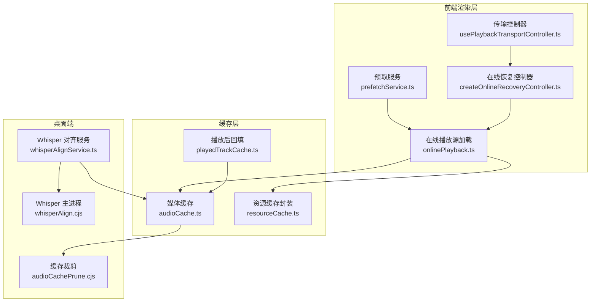
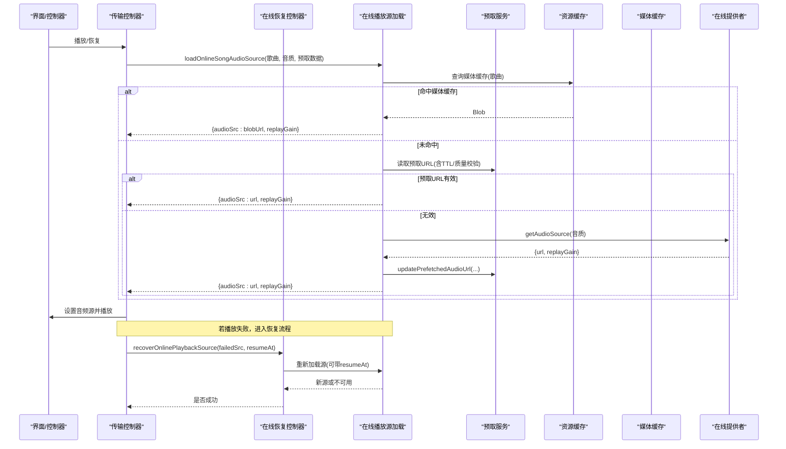
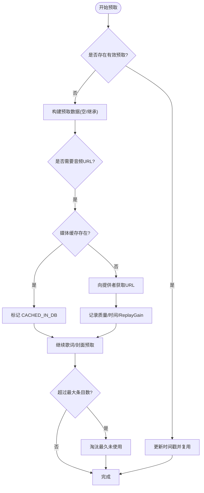
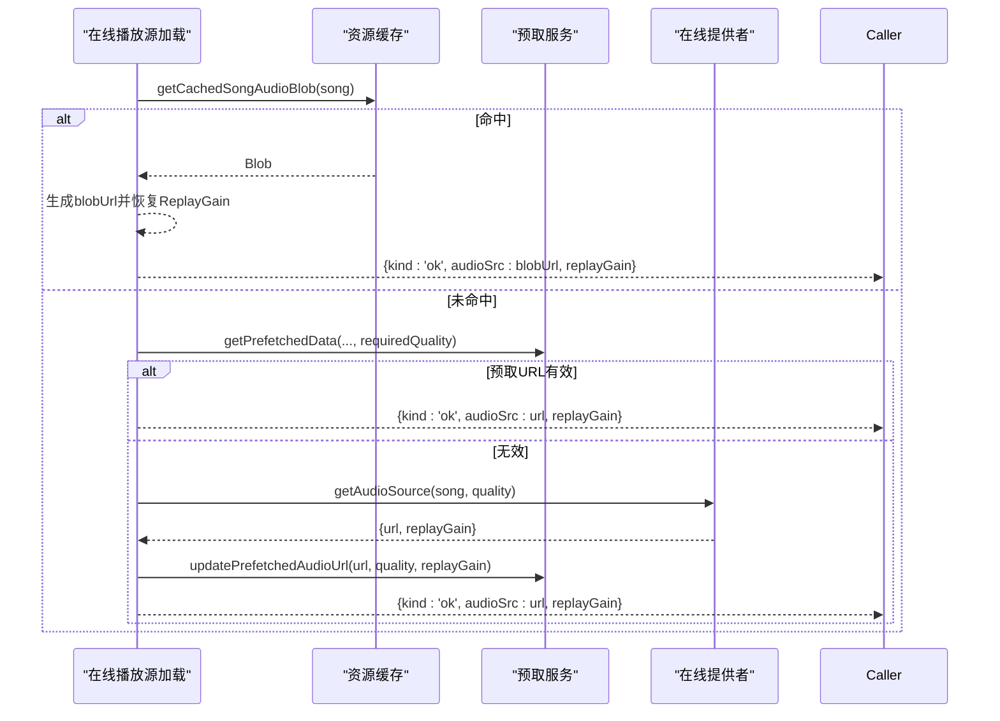
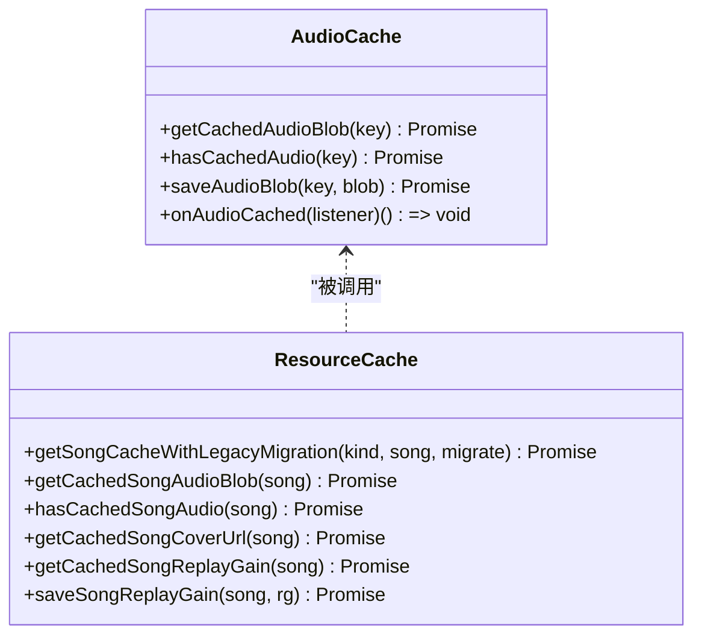
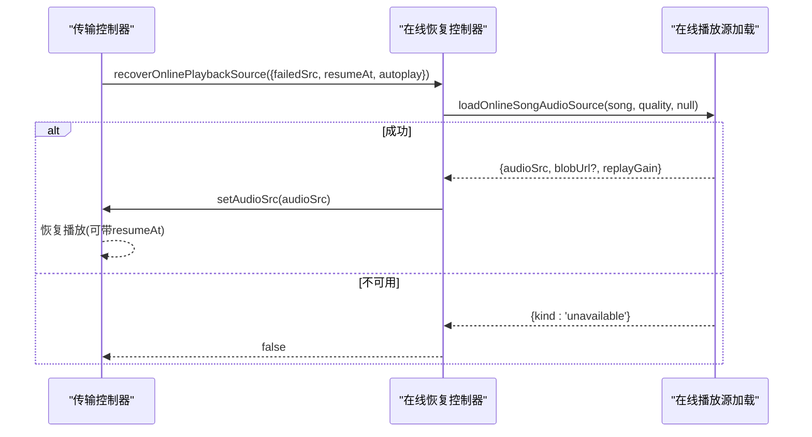
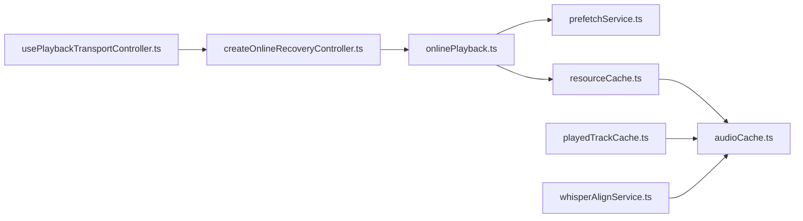

# 音频缓冲策略

<cite>
**本文引用的文件**
- [src/services/audioCache.ts](file://src/services/audioCache.ts)
- [src/services/onlineMusic/resourceCache.ts](file://src/services/onlineMusic/resourceCache.ts)
- [src/services/prefetchService.ts](file://src/services/prefetchService.ts)
- [src/services/onlinePlayback.ts](file://src/services/onlinePlayback.ts)
- [src/components/app/playback/createOnlineRecoveryController.ts](file://src/components/app/playback/createOnlineRecoveryController.ts)
- [src/hooks/usePlaybackTransportController.ts](file://src/hooks/usePlaybackTransportController.ts)
- [electron/audioCachePrune.cjs](file://electron/audioCachePrune.cjs)
- [src/services/playedTrackCache.ts](file://src/services/playedTrackCache.ts)
- [src/services/whisperAlignService.ts](file://src/services/whisperAlignService.ts)
- [electron/whisperAlign.cjs](file://electron/whisperAlign.cjs)
</cite>

## 目录
1. [简介](#简介)
2. [项目结构](#项目结构)
3. [核心组件](#核心组件)
4. [架构总览](#架构总览)
5. [详细组件分析](#详细组件分析)
6. [依赖关系分析](#依赖关系分析)
7. [性能考量](#性能考量)
8. [故障排查指南](#故障排查指南)
9. [结论](#结论)
10. [附录](#附录)

## 简介
本技术文档聚焦 Folia Player 的音频缓冲策略，系统阐述音频数据的预加载、缓存与流式处理机制。文档覆盖不同音频源的差异化缓冲策略（本地文件的随机访问、在线流媒体的顺序下载、网络音频的动态缓冲），并深入解析缓冲区大小管理、内存使用优化与垃圾回收策略。同时提供智能预加载算法的实现要点、按网络状况动态调整缓冲的策略、音频质量自适应、断点续播、错误恢复等高级功能的实现细节，以及缓存淘汰算法、存储空间管理与跨设备缓存同步机制。

## 项目结构
围绕音频缓冲的核心代码分布在以下模块：
- 媒体缓存与迁移：audioCache.ts、resourceCache.ts
- 预取服务：prefetchService.ts
- 在线播放与资源获取：onlinePlayback.ts
- 播放控制与恢复：usePlaybackTransportController.ts、createOnlineRecoveryController.ts
- 桌面端缓存裁剪：audioCachePrune.cjs
- 播放后资源回填：playedTrackCache.ts
- Whisper 对齐所需音频获取：whisperAlignService.ts、whisperAlign.cjs

图表来源
- [src/services/prefetchService.ts:1-544](file://src/services/prefetchService.ts#L1-L544)
- [src/services/onlinePlayback.ts:1-254](file://src/services/onlinePlayback.ts#L1-L254)
- [src/services/audioCache.ts:1-121](file://src/services/audioCache.ts#L1-L121)
- [src/services/onlineMusic/resourceCache.ts:1-114](file://src/services/onlineMusic/resourceCache.ts#L1-L114)
- [src/hooks/usePlaybackTransportController.ts:1-134](file://src/hooks/usePlaybackTransportController.ts#L1-L134)
- [src/components/app/playback/createOnlineRecoveryController.ts:102-183](file://src/components/app/playback/createOnlineRecoveryController.ts#L102-L183)
- [electron/audioCachePrune.cjs:1-43](file://electron/audioCachePrune.cjs#L1-L43)
- [src/services/playedTrackCache.ts:25-75](file://src/services/playedTrackCache.ts#L25-L75)
- [src/services/whisperAlignService.ts:30-481](file://src/services/whisperAlignService.ts#L30-L481)
- [electron/whisperAlign.cjs:777-842](file://electron/whisperAlign.cjs#L777-L842)

章节来源
- [src/services/prefetchService.ts:1-544](file://src/services/prefetchService.ts#L1-L544)
- [src/services/onlinePlayback.ts:1-254](file://src/services/onlinePlayback.ts#L1-L254)
- [src/services/audioCache.ts:1-121](file://src/services/audioCache.ts#L1-L121)
- [src/services/onlineMusic/resourceCache.ts:1-114](file://src/services/onlineMusic/resourceCache.ts#L1-L114)
- [src/hooks/usePlaybackTransportController.ts:1-134](file://src/hooks/usePlaybackTransportController.ts#L1-L134)
- [src/components/app/playback/createOnlineRecoveryController.ts:102-183](file://src/components/app/playback/createOnlineRecoveryController.ts#L102-L183)
- [electron/audioCachePrune.cjs:1-43](file://electron/audioCachePrune.cjs#L1-L43)
- [src/services/playedTrackCache.ts:25-75](file://src/services/playedTrackCache.ts#L25-L75)
- [src/services/whisperAlignService.ts:30-481](file://src/services/whisperAlignService.ts#L30-L481)
- [electron/whisperAlign.cjs:777-842](file://electron/whisperAlign.cjs#L777-L842)

## 核心组件
- 媒体缓存（audioCache.ts）
  - 统一读取 Electron 文件缓存或 IndexedDB 中的 Blob；支持从旧存储迁移到 Electron 缓存；写入时触发监听器通知下游（如自动混音模块）。
  - 通过设置项限制缓存上限，并在写入后调用裁剪逻辑。
- 资源缓存封装（resourceCache.ts）
  - 为歌曲维度组织“音频、歌词、封面、重放增益”等资源键；兼容历史键名迁移；提供 has/cached 查询与 ReplayGain 存取。
- 预取服务（prefetchService.ts）
  - 维护最近 N 首歌曲的轻量资源（URL、歌词、封面）内存缓存；URL 有效期 TTL；按队列前后窗口进行预取；将“已在媒体缓存”标记为特殊哨兵值以避免重复请求。
- 在线播放源加载（onlinePlayback.ts）
  - 优先命中媒体缓存（Blob URL），否则使用预取 URL（若有效），最后回退到提供者获取；合并 ReplayGain 元数据并更新预取缓存。
- 传输控制器（usePlaybackTransportController.ts）
  - 负责播放/暂停、上下文恢复、在线源刷新与恢复；在播放失败时触发恢复流程。
- 在线恢复控制器（createOnlineRecoveryController.ts）
  - 对当前在线曲目进行失败重试与切换，避免重复恢复任务；记录上次恢复源以去抖。
- 播放后回填（playedTrackCache.ts）
  - 播放完成后将完整音频与封面回填到媒体缓存；跳过 blob: 源的重下载；仅对远程封面执行 HTTPS 抓取。
- Whisper 对齐音频获取（whisperAlignService.ts、whisperAlign.cjs）
  - 多路尝试获取音频：Electron 缓存、资源缓存、在线提供者；失败收集原因；主进程侧处理重定向、超时与流式拼接。

章节来源
- [src/services/audioCache.ts:1-121](file://src/services/audioCache.ts#L1-L121)
- [src/services/onlineMusic/resourceCache.ts:1-114](file://src/services/onlineMusic/resourceCache.ts#L1-L114)
- [src/services/prefetchService.ts:1-544](file://src/services/prefetchService.ts#L1-L544)
- [src/services/onlinePlayback.ts:1-254](file://src/services/onlinePlayback.ts#L1-L254)
- [src/hooks/usePlaybackTransportController.ts:1-134](file://src/hooks/usePlaybackTransportController.ts#L1-L134)
- [src/components/app/playback/createOnlineRecoveryController.ts:102-183](file://src/components/app/playback/createOnlineRecoveryController.ts#L102-L183)
- [src/services/playedTrackCache.ts:25-75](file://src/services/playedTrackCache.ts#L25-L75)
- [src/services/whisperAlignService.ts:30-481](file://src/services/whisperAlignService.ts#L30-L481)
- [electron/whisperAlign.cjs:777-842](file://electron/whisperAlign.cjs#L777-L842)

## 架构总览
下图展示了从用户操作到音频数据到达播放器的完整链路，包括预取、缓存命中、在线获取、失败恢复与回放。

图表来源
- [src/hooks/usePlaybackTransportController.ts:71-134](file://src/hooks/usePlaybackTransportController.ts#L71-L134)
- [src/components/app/playback/createOnlineRecoveryController.ts:102-183](file://src/components/app/playback/createOnlineRecoveryController.ts#L102-L183)
- [src/services/onlinePlayback.ts:17-63](file://src/services/onlinePlayback.ts#L17-L63)
- [src/services/prefetchService.ts:117-154](file://src/services/prefetchService.ts#L117-L154)
- [src/services/onlineMusic/resourceCache.ts:36-58](file://src/services/onlineMusic/resourceCache.ts#L36-L58)
- [src/services/audioCache.ts:39-67](file://src/services/audioCache.ts#L39-L67)

## 详细组件分析

### 预加载与预取策略（prefetchService.ts）
- 预取窗口：向前两首、向后一首，保证切歌与回退的即时性。
- 资源类型：仅预取轻量资源（URL、歌词、封面），不在此阶段解码或跑模型，避免内存压力。
- URL 生命周期：TTL 为 20 分钟；过期则丢弃并重取。
- 质量感知：缓存中记录 audioUrlQuality；当请求质量变化时，丢弃旧 URL 并重新获取。
- 哨兵值：当检测到音频已在媒体缓存时，使用“CACHED_IN_DB”标记，避免重复请求且不影响后续分析。
- 自动混音分析：在合适时机将已解析的 URL 交给分析管线，但受开关与范围限制。

图表来源
- [src/services/prefetchService.ts:24-39](file://src/services/prefetchService.ts#L24-L39)
- [src/services/prefetchService.ts:117-154](file://src/services/prefetchService.ts#L117-L154)
- [src/services/prefetchService.ts:159-234](file://src/services/prefetchService.ts#L159-L234)
- [src/services/prefetchService.ts:355-373](file://src/services/prefetchService.ts#L355-L373)

章节来源
- [src/services/prefetchService.ts:1-544](file://src/services/prefetchService.ts#L1-L544)

### 在线播放源加载与缓存命中（onlinePlayback.ts）
- 优先级：媒体缓存 Blob > 预取 URL（有效）> 提供者实时获取。
- 重放增益：从歌曲、预取或存储恢复，确保缓存曲目音量一致性。
- 元数据更新：将获取到的 URL 与 ReplayGain 写回预取缓存，供后续快速命中。

图表来源
- [src/services/onlinePlayback.ts:17-63](file://src/services/onlinePlayback.ts#L17-L63)
- [src/services/prefetchService.ts:117-154](file://src/services/prefetchService.ts#L117-L154)
- [src/services/onlineMusic/resourceCache.ts:36-58](file://src/services/onlineMusic/resourceCache.ts#L36-L58)

章节来源
- [src/services/onlinePlayback.ts:1-254](file://src/services/onlinePlayback.ts#L1-L254)

### 媒体缓存与迁移（audioCache.ts、resourceCache.ts）
- 读取路径：优先 Electron 文件缓存，其次 IndexedDB；读取后尝试迁移至 Electron 缓存。
- 写入路径：统一 saveAudioBlob，根据设置决定是否裁剪；写入后广播事件，供自动混音等模块消费。
- 资源键：按歌曲维度组织“音频/歌词/封面/重放增益”，兼容历史键名迁移。
- 容量管理：通过设置项决定上限；零表示无上限（交由主进程默认策略）。

图表来源
- [src/services/audioCache.ts:1-121](file://src/services/audioCache.ts#L1-L121)
- [src/services/onlineMusic/resourceCache.ts:1-114](file://src/services/onlineMusic/resourceCache.ts#L1-L114)

章节来源
- [src/services/audioCache.ts:1-121](file://src/services/audioCache.ts#L1-L121)
- [src/services/onlineMusic/resourceCache.ts:1-114](file://src/services/onlineMusic/resourceCache.ts#L1-L114)

### 播放后回填与封面缓存（playedTrackCache.ts）
- 音频回填：仅在非 blob: 源且尚未缓存时拉取并保存；避免重复下载。
- 封面回填：仅对远程 https 封面执行抓取；本地歌曲封面由库路径管理。
- 结果报告：返回 audio/cover 是否写入，便于上层统计与调试。

章节来源
- [src/services/playedTrackCache.ts:25-75](file://src/services/playedTrackCache.ts#L25-L75)

### 在线恢复与断点续播（createOnlineRecoveryController.ts、usePlaybackTransportController.ts）
- 恢复入口：播放失败或需要刷新在线源时触发；记录 lastAudioRecoverySourceRef 防止重复恢复。
- 断点续播：携带 resumeAt 参数，在新源上恢复播放位置。
- 状态同步：成功后更新当前在线源时间与状态，驱动 UI 刷新。

图表来源
- [src/components/app/playback/createOnlineRecoveryController.ts:102-183](file://src/components/app/playback/createOnlineRecoveryController.ts#L102-L183)
- [src/hooks/usePlaybackTransportController.ts:71-134](file://src/hooks/usePlaybackTransportController.ts#L71-L134)
- [src/services/onlinePlayback.ts:17-63](file://src/services/onlinePlayback.ts#L17-L63)

章节来源
- [src/components/app/playback/createOnlineRecoveryController.ts:102-183](file://src/components/app/playback/createOnlineRecoveryController.ts#L102-L183)
- [src/hooks/usePlaybackTransportController.ts:1-134](file://src/hooks/usePlaybackTransportController.ts#L1-L134)

### Whisper 对齐音频获取（whisperAlignService.ts、whisperAlign.cjs）
- 多路尝试：Electron 缓存 → 资源缓存 → 在线提供者；每次失败记录原因，最终汇总返回。
- 主进程处理：处理 HTTP 重定向、流式拼接、超时与错误；必要时进行格式转换。
- 失败诊断：返回 reason 与 failures 列表，便于 UI 展示具体失败原因。

章节来源
- [src/services/whisperAlignService.ts:30-481](file://src/services/whisperAlignService.ts#L30-L481)
- [electron/whisperAlign.cjs:777-842](file://electron/whisperAlign.cjs#L777-L842)

## 依赖关系分析
- 耦合关系
  - onlinePlayback.ts 依赖 prefetchService.ts 与 resourceCache.ts，形成“预取→缓存→提供者”的三级回退链。
  - audioCache.ts 作为底层存储抽象，被 resourceCache.ts、playedTrackCache.ts、whisperAlignService.ts 共同使用。
  - 传输控制器与恢复控制器解耦了播放与恢复逻辑，降低耦合度。
- 外部依赖
  - Electron IPC：用于文件级缓存读写与裁剪。
  - 在线提供者：通过 omni 接口获取音频源与歌词。
- 循环依赖
  - 未发现直接循环依赖；各模块职责清晰，通过函数式调用与回调通信。

图表来源
- [src/services/onlinePlayback.ts:1-254](file://src/services/onlinePlayback.ts#L1-L254)
- [src/services/prefetchService.ts:1-544](file://src/services/prefetchService.ts#L1-L544)
- [src/services/onlineMusic/resourceCache.ts:1-114](file://src/services/onlineMusic/resourceCache.ts#L1-L114)
- [src/services/audioCache.ts:1-121](file://src/services/audioCache.ts#L1-L121)
- [src/services/playedTrackCache.ts:25-75](file://src/services/playedTrackCache.ts#L25-L75)
- [src/services/whisperAlignService.ts:30-481](file://src/services/whisperAlignService.ts#L30-L481)
- [src/hooks/usePlaybackTransportController.ts:1-134](file://src/hooks/usePlaybackTransportController.ts#L1-L134)
- [src/components/app/playback/createOnlineRecoveryController.ts:102-183](file://src/components/app/playback/createOnlineRecoveryController.ts#L102-L183)

章节来源
- [src/services/onlinePlayback.ts:1-254](file://src/services/onlinePlayback.ts#L1-L254)
- [src/services/prefetchService.ts:1-544](file://src/services/prefetchService.ts#L1-L544)
- [src/services/onlineMusic/resourceCache.ts:1-114](file://src/services/onlineMusic/resourceCache.ts#L1-L114)
- [src/services/audioCache.ts:1-121](file://src/services/audioCache.ts#L1-L121)
- [src/services/playedTrackCache.ts:25-75](file://src/services/playedTrackCache.ts#L25-L75)
- [src/services/whisperAlignService.ts:30-481](file://src/services/whisperAlignService.ts#L30-L481)
- [src/hooks/usePlaybackTransportController.ts:1-134](file://src/hooks/usePlaybackTransportController.ts#L1-L134)
- [src/components/app/playback/createOnlineRecoveryController.ts:102-183](file://src/components/app/playback/createOnlineRecoveryController.ts#L102-L183)

## 性能考量
- 预取窗口与内存
  - 预取仅包含轻量资源（URL、歌词、封面），避免解码与模型推理带来的内存峰值。
  - 内存缓存有最大条目限制，采用 LRU 淘汰策略，超出阈值时清理最久未使用的条目。
- 网络 I/O 优化
  - URL 有效期 20 分钟，减少重复鉴权与重定向开销。
  - 质量匹配：当音质变化时丢弃旧 URL，避免低质/高质误用。
- 缓存命中率
  - 媒体缓存优先命中，显著降低网络请求与解码成本。
  - 播放后回填策略确保热门曲目快速命中。
- 垃圾回收
  - 预取缓存为内存 Map，随队列变更清理；媒体缓存落盘，由 Electron 裁剪。
  - 避免长时间持有大对象引用，及时释放 Blob URL。

[本节为通用性能讨论，无需特定文件引用]

## 故障排查指南
- 常见问题定位
  - 预取 URL 失效：检查 TTL 与质量匹配；确认 isUrlValid 与 requiredQuality 分支行为。
  - 媒体缓存未命中：确认 key 生成与迁移逻辑；检查 Electron 缓存可用性。
  - 在线恢复失败：查看 lastAudioRecoverySourceRef 去抖；确认 resumeAt 传递正确。
  - Whisper 对齐失败：查看 failures 列表，定位 electron-cache/resourceCache/omni 哪一路失败。
- 日志与诊断
  - 预取与在线播放均输出关键步骤日志；恢复控制器记录失败与成功路径。
  - Whisper 对齐服务聚合多路失败原因，便于 UI 展示。

章节来源
- [src/services/prefetchService.ts:117-154](file://src/services/prefetchService.ts#L117-L154)
- [src/services/onlinePlayback.ts:17-63](file://src/services/onlinePlayback.ts#L17-L63)
- [src/components/app/playback/createOnlineRecoveryController.ts:102-183](file://src/components/app/playback/createOnlineRecoveryController.ts#L102-L183)
- [src/services/whisperAlignService.ts:129-154](file://src/services/whisperAlignService.ts#L129-L154)

## 结论
Folia Player 的音频缓冲策略通过“预取—缓存—在线获取”的三级回退链，结合严格的 URL 生命周期与质量感知，实现了高效、稳定的播放体验。媒体缓存与 Electron 文件缓存协同工作，配合 LRU 淘汰与播放后回填，显著提升命中率并控制内存与磁盘占用。在线恢复与断点续播保障了弱网与抖动场景下的连续性。Whisper 对齐的多路音频获取与详细失败诊断，进一步提升了整体鲁棒性。

[本节为总结性内容，无需特定文件引用]

## 附录
- 缓存淘汰算法
  - 基于“最近使用时间”排序，逐步删除直到总大小低于上限；默认上限约 5GB，可通过设置项调整。
- 存储空间管理
  - 写入后触发裁剪；IndexedDB 与 Electron 缓存之间自动迁移，确保长期稳定性。
- 跨设备缓存同步
  - 当前实现以本地缓存为主；如需跨设备同步，可在资源键层面引入设备标识与版本哈希，并结合云端索引进行增量同步（需额外设计）。

章节来源
- [electron/audioCachePrune.cjs:1-43](file://electron/audioCachePrune.cjs#L1-L43)
- [src/services/audioCache.ts:1-121](file://src/services/audioCache.ts#L1-L121)
- [src/services/onlineMusic/resourceCache.ts:1-114](file://src/services/onlineMusic/resourceCache.ts#L1-L114)