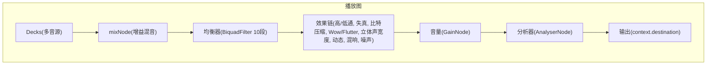
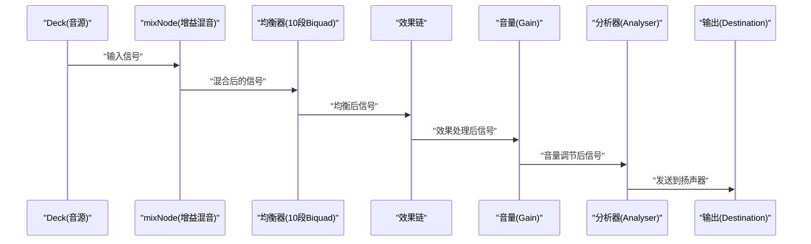
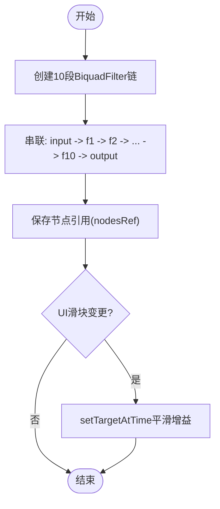
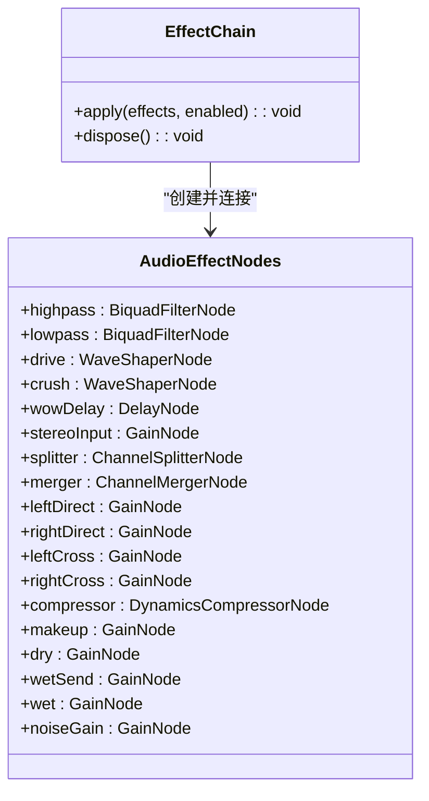
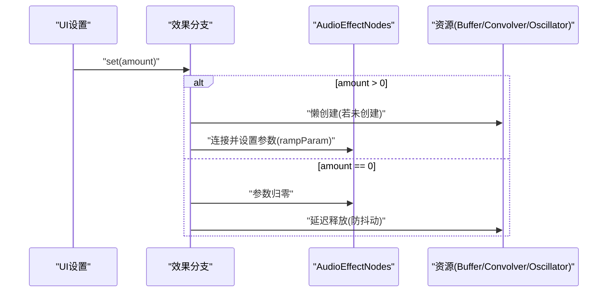
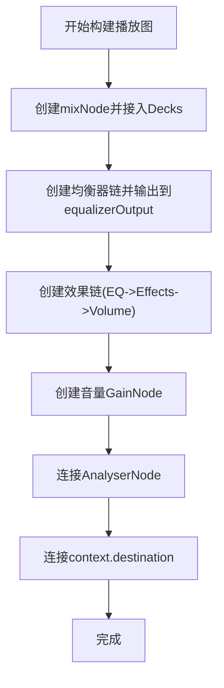
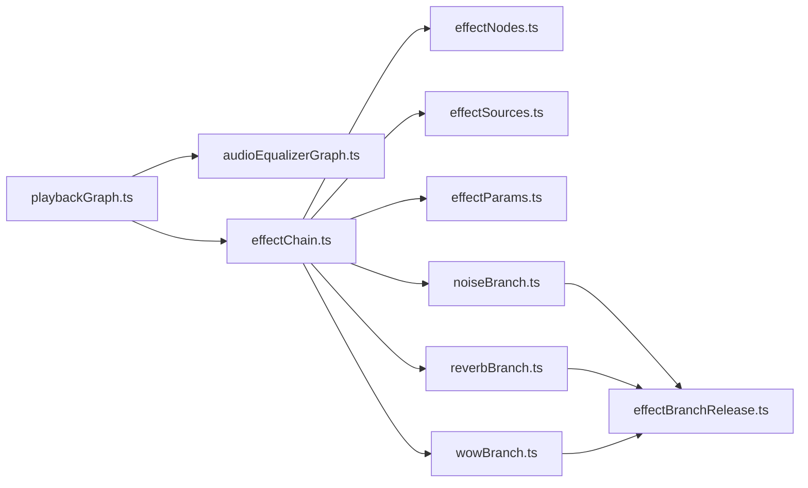

# 音频节点图管理

<cite>
**本文引用的文件**
- [playbackGraph.ts](file://src/services/playbackGraph.ts)
- [audioEqualizerGraph.ts](file://src/services/audioEqualizerGraph.ts)
- [effectChain.ts](file://src/services/audioEffects/effectChain.ts)
- [effectNodes.ts](file://src/services/audioEffects/effectNodes.ts)
- [effectParams.ts](file://src/services/audioEffects/effectParams.ts)
- [noiseBranch.ts](file://src/services/audioEffects/noiseBranch.ts)
- [reverbBranch.ts](file://src/services/audioEffects/reverbBranch.ts)
- [wowBranch.ts](file://src/services/audioEffects/wowBranch.ts)
- [effectSources.ts](file://src/services/audioEffects/effectSources.ts)
- [audioEffects.ts](file://src/utils/audioEffects.ts)
- [audioEqualizer.ts](file://src/utils/audioEqualizer.ts)
</cite>

## 目录
1. [简介](#简介)
2. [项目结构](#项目结构)
3. [核心组件](#核心组件)
4. [架构总览](#架构总览)
5. [详细组件分析](#详细组件分析)
6. [依赖关系分析](#依赖关系分析)
7. [性能考量](#性能考量)
8. [故障排查指南](#故障排查指南)
9. [结论](#结论)
10. [附录](#附录)

## 简介
本技术文档聚焦 Folia Player 的音频节点图管理，围绕 Web Audio API 的 AudioContext 使用展开，系统阐述播放图的构建流程与数据流：decks -> mix -> equaliser -> effects -> volume -> analyser -> out。重点解析混音节点（mixNode）的设计原理、均衡器节点图的集成方式、音频效果链的连接机制，并提供扩展新效果节点的方法与优化建议。同时覆盖节点生命周期管理、内存泄漏防护与错误处理策略。

## 项目结构
本项目将音频处理逻辑集中在 services 与 utils 两个层次：
- services/playbackGraph.ts：负责构建整体播放图，串联 decks、mix、equaliser、effects、volume、analyser、out。
- services/audioEqualizerGraph.ts：创建并连接十段均衡器滤波器链，提供平滑参数更新。
- services/audioEffects/*：实现效果链的节点创建、连接、分支（混响、噪声、Wow/Flutter）、参数缓动与释放。
- utils/audioEffects.ts / audioEqualizer.ts：定义效果与均衡器的配置模型、默认值、归一化与持久化。

图表来源
- [playbackGraph.ts:31-98](file://src/services/playbackGraph.ts#L31-L98)
- [audioEqualizerGraph.ts:20-45](file://src/services/audioEqualizerGraph.ts#L20-L45)
- [effectChain.ts:31-93](file://src/services/audioEffects/effectChain.ts#L31-L93)

章节来源
- [playbackGraph.ts:31-98](file://src/services/playbackGraph.ts#L31-L98)
- [audioEqualizerGraph.ts:20-45](file://src/services/audioEqualizerGraph.ts#L20-L45)
- [effectChain.ts:31-93](file://src/services/audioEffects/effectChain.ts#L31-L93)

## 核心组件
- 播放图构建器 buildPlaybackGraph：创建共享混音点 mixNode，接入均衡器与效果链，设置最终音量与分析器，确保可视化与听感一致。
- 均衡器图 connectAudioEqualizerGraph：创建稳定的十段滤波器链（lowshelf、peaking、highshelf），通过 ref 暴露节点以便后续平滑调整。
- 效果链 createAudioEffectChain：封装效果节点创建、连接与参数应用；提供 apply 与 dispose 接口，支持按需启用/禁用效果。
- 效果节点 effectNodes：集中创建“常开”的基础节点（高/低通、WaveShaper、延迟、立体声拆分合并、压缩、干湿路等）。
- 效果分支 noiseBranch/reverbBranch/wowBranch：懒加载资源（噪声缓冲、卷积混响、调制振荡器），在需要时建立连接，并在关闭后延迟释放以节省开销。
- 工具 effectParams：统一参数缓动 rampParam 与分贝线性转换 dbToLinear，避免参数跳变。
- 配置模型 audioEffects.ts / audioEqualizer.ts：定义效果与均衡器的参数域、默认值、归一化与持久化。

章节来源
- [playbackGraph.ts:31-98](file://src/services/playbackGraph.ts#L31-L98)
- [audioEqualizerGraph.ts:20-59](file://src/services/audioEqualizerGraph.ts#L20-L59)
- [effectChain.ts:17-93](file://src/services/audioEffects/effectChain.ts#L17-L93)
- [effectNodes.ts:28-126](file://src/services/audioEffects/effectNodes.ts#L28-L126)
- [effectParams.ts:6-17](file://src/services/audioEffects/effectParams.ts#L6-L17)
- [audioEffects.ts:4-122](file://src/utils/audioEffects.ts#L4-L122)
- [audioEqualizer.ts:14-228](file://src/utils/audioEqualizer.ts#L14-L228)

## 架构总览
播放图的数据流严格遵循：decks -> mix -> equaliser -> effects -> volume -> analyser -> out。该顺序保证：
- 所有音源先混音，再进入统一的均衡器与效果链，避免每轨重复处理。
- 音量位于效果之后，使绝对型效果（如噪声、比特压缩、压缩阈值）按预期工作。
- 分析器置于最后，可视化反映实际输出电平。

图表来源
- [playbackGraph.ts:31-98](file://src/services/playbackGraph.ts#L31-L98)

章节来源
- [playbackGraph.ts:31-98](file://src/services/playbackGraph.ts#L31-L98)

## 详细组件分析

### 混音节点（mixNode）设计原理
- 作用：作为共享混音点，将所有 deck 的输出汇聚到单一节点，确保均衡器与分析器仅存在一次，所见即所听。
- 优势：避免 mid-blend 时的音色突变，减少重复处理开销，简化可视化与监听路径。
- 接入方式：由外部 connectDecks 回调将多个 deck 连接到 mixNode。

章节来源
- [playbackGraph.ts:31-43](file://src/services/playbackGraph.ts#L31-L43)

### 均衡器节点图集成
- 滤波器类型：首尾为 lowshelf/highshelf，中间为 peaking，Q 固定为 1.4，频率上限受限于采样率。
- 稳定链路：一次性创建并串联 10 个 BiquadFilter，通过 nodesRef 暴露节点，供 UI 平滑调整增益。
- 平滑更新：applyAudioEqualizerSettings 使用 setTargetAtTime 避免参数跳变。

图表来源
- [audioEqualizerGraph.ts:20-59](file://src/services/audioEqualizerGraph.ts#L20-L59)

章节来源
- [audioEqualizerGraph.ts:20-59](file://src/services/audioEqualizerGraph.ts#L20-L59)

### 音频效果链连接机制
- 基础节点：高/低通滤波、WaveShaper（失真/比特压缩）、延迟（Wow/Flutter）、立体声拆分/合并、压缩、干湿路、噪声注入。
- 串行路径：input -> highpass -> lowpass -> drive -> crush -> wowDelay -> stereoInput -> splitter -> merger -> compressor -> makeup -> dry/wet/noiseGain -> output。
- 并行分支：
  - 混响：wetSend -> convolver -> wet，干路保持直通路径。
  - 噪声：BufferSource -> bandpass -> noiseGain，直接注入输出。
  - Wow/Flutter：Oscillators 调制 delayTime，模拟磁带/黑胶抖动。
- 参数缓动：rampParam 统一控制 AudioParam 变化，避免爆音。

图表来源
- [effectNodes.ts:28-126](file://src/services/audioEffects/effectNodes.ts#L28-L126)
- [effectChain.ts:31-93](file://src/services/audioEffects/effectChain.ts#L31-L93)

章节来源
- [effectChain.ts:31-93](file://src/services/audioEffects/effectChain.ts#L31-L93)
- [effectNodes.ts:28-126](file://src/services/audioEffects/effectNodes.ts#L28-L126)

### 效果分支详解
- 噪声分支（noiseBranch）：懒创建 BufferSource 与带通滤波器，仅在 amount > 0 时启动，关闭后延迟释放。
- 混响分支（reverbBranch）：懒创建 ConvolverNode 与脉冲响应，湿路与干路按比例切换，关闭后延迟释放。
- Wow/Flutter 分支（wowBranch）：懒创建 LFO 振荡器与深度增益，调制 delayTime，关闭后延迟释放。

图表来源
- [noiseBranch.ts:10-60](file://src/services/audioEffects/noiseBranch.ts#L10-L60)
- [reverbBranch.ts:10-49](file://src/services/audioEffects/reverbBranch.ts#L10-L49)
- [wowBranch.ts:9-76](file://src/services/audioEffects/wowBranch.ts#L9-L76)
- [effectBranchRelease.ts:1-29](file://src/services/audioEffects/effectBranchRelease.ts#L1-L29)

章节来源
- [noiseBranch.ts:10-60](file://src/services/audioEffects/noiseBranch.ts#L10-L60)
- [reverbBranch.ts:10-49](file://src/services/audioEffects/reverbBranch.ts#L10-L49)
- [wowBranch.ts:9-76](file://src/services/audioEffects/wowBranch.ts#L9-L76)
- [effectBranchRelease.ts:1-29](file://src/services/audioEffects/effectBranchRelease.ts#L1-L29)

### 播放图构建流程（完整数据流）
- 步骤：
  1) 创建 mixNode，connectDecks 将多 deck 接入。
  2) 创建均衡器输出 equalizerOutput，连接 mixNode -> 均衡器 -> equalizerOutput。
  3) 创建效果链，输入 equalizerOutput，输出 gainNode。
  4) 创建 gainNode（音量），连接效果链 -> gainNode。
  5) 连接 gainNode -> analyser -> context.destination。
- 日志打印确认顺序：decks -> mix -> equaliser -> effects -> volume -> analyser -> out。

图表来源
- [playbackGraph.ts:31-98](file://src/services/playbackGraph.ts#L31-L98)

章节来源
- [playbackGraph.ts:31-98](file://src/services/playbackGraph.ts#L31-L98)

### 扩展新的音频效果节点
- 目标：在不破坏现有链路的前提下，插入新的处理阶段（例如新增一个滤波器或调制器）。
- 步骤：
  1) 在 effectNodes.ts 中声明新节点类型并初始化默认值（中性状态）。
  2) 在 connectAudioEffectNodes 中将新节点串入串行路径或并联支路，确保输入/输出正确。
  3) 在 effectChain.ts 的 apply 中增加对新参数的 rampParam 控制，必要时懒创建资源（参考 noiseBranch/reverbBranch/wowBranch）。
  4) 在 effectBranchRelease.ts 的分支模式中考虑延迟释放，避免频繁开关导致的资源抖动。
  5) 在 audioEffects.ts 中注册新效果的控件定义（范围、步长、单位、是否引入底噪）。
  6) 在 playbackGraph.ts 中确保新效果处于正确的顺序位置（通常在均衡器之后、音量之前）。
- 注意事项：
  - 使用 oversample 提升 WaveShaper 质量（如 drive/crush）。
  - 对频率类参数进行 Nyquist 限制（sampleRate * 0.475）。
  - 所有参数变化使用 rampParam 避免爆音。

章节来源
- [effectNodes.ts:28-126](file://src/services/audioEffects/effectNodes.ts#L28-L126)
- [effectChain.ts:31-93](file://src/services/audioEffects/effectChain.ts#L31-L93)
- [effectParams.ts:6-17](file://src/services/audioEffects/effectParams.ts#L6-L17)
- [audioEffects.ts:4-122](file://src/utils/audioEffects.ts#L4-L122)
- [playbackGraph.ts:31-98](file://src/services/playbackGraph.ts#L31-L98)

### 性能优化建议
- 复用节点：均衡器与效果链一次性创建，避免每次播放重建。
- 懒加载资源：噪声缓冲、卷积脉冲、振荡器仅在需要时创建，关闭后延迟释放。
- 参数缓动：统一使用 rampParam，避免 AudioParam 跳变导致爆音与额外计算。
- 限制频率：低通截止不超过 sampleRate * 0.475，防止混叠。
- 降低重绘：UI 与音频路径解耦，通过 nodesRef 直接操作节点，不触发 React 更新。
- 合理顺序：音量置于效果之后，确保绝对型效果行为一致，减少不必要的重放与补偿。

章节来源
- [audioEqualizerGraph.ts:20-59](file://src/services/audioEqualizerGraph.ts#L20-L59)
- [effectChain.ts:31-93](file://src/services/audioEffects/effectChain.ts#L31-L93)
- [effectParams.ts:6-17](file://src/services/audioEffects/effectParams.ts#L6-L17)
- [effectNodes.ts:28-126](file://src/services/audioEffects/effectNodes.ts#L28-L126)

## 依赖关系分析
- playbackGraph.ts 依赖：
  - audioEqualizerGraph.ts：均衡器图创建与连接。
  - audioEffects/effectChain.ts：效果链创建与应用。
  - utils/audioEqualizer.ts：均衡器设置与模式。
- effectChain.ts 依赖：
  - effectNodes.ts：基础节点创建与连接。
  - effectSources.ts：曲线与缓冲生成。
  - effectParams.ts：参数缓动与单位转换。
  - noiseBranch/reverbBranch/wowBranch：可选效果分支。
- 各分支依赖 effectBranchRelease.ts：延迟释放定时器。

图表来源
- [playbackGraph.ts:1-98](file://src/services/playbackGraph.ts#L1-L98)
- [effectChain.ts:1-94](file://src/services/audioEffects/effectChain.ts#L1-L94)
- [effectNodes.ts:1-126](file://src/services/audioEffects/effectNodes.ts#L1-L126)
- [effectSources.ts:1-95](file://src/services/audioEffects/effectSources.ts#L1-L95)
- [effectParams.ts:1-17](file://src/services/audioEffects/effectParams.ts#L1-L17)
- [noiseBranch.ts:1-60](file://src/services/audioEffects/noiseBranch.ts#L1-L60)
- [reverbBranch.ts:1-49](file://src/services/audioEffects/reverbBranch.ts#L1-L49)
- [wowBranch.ts:1-76](file://src/services/audioEffects/wowBranch.ts#L1-L76)
- [effectBranchRelease.ts:1-29](file://src/services/audioEffects/effectBranchRelease.ts#L1-L29)

章节来源
- [playbackGraph.ts:1-98](file://src/services/playbackGraph.ts#L1-L98)
- [effectChain.ts:1-94](file://src/services/audioEffects/effectChain.ts#L1-L94)

## 性能考量
- 节点复用与懒加载：均衡器与效果链常驻，分支资源按需创建与延迟释放，降低 CPU 与内存占用。
- 参数平滑：rampParam 避免瞬态跳变，减少爆音与额外计算。
- 频率限制：低通截止限制在 Nyquist 以下，避免混叠带来的失真与计算浪费。
- 顺序优化：音量在效果之后，确保绝对型效果行为一致，减少补偿与重放。
- UI 解耦：通过 nodesRef 直接操作节点，避免 React 更新进入音频路径。

[本节为通用指导，无需具体文件来源]

## 故障排查指南
- 常见问题：
  - 音量无效：检查音量是否在效果之后；确认 gainNode 已连接至 analyser 与 destination。
  - 效果无响应：确认 effectChain.apply 被调用且参数范围正确；检查分支是否已懒创建。
  - 爆音/杂音：检查参数变化是否使用 rampParam；确认频率限制与 oversample 设置。
  - 内存泄漏：确保 effectChain.dispose 与分支 dispose 被调用；检查 disconnect 是否正确执行。
- 调试方法：
  - 查看控制台日志确认播放图顺序。
  - 逐步断开节点定位问题链路。
  - 使用浏览器开发者工具的 Performance 面板分析音频线程负载。

章节来源
- [playbackGraph.ts:83-98](file://src/services/playbackGraph.ts#L83-L98)
- [effectChain.ts:84-93](file://src/services/audioEffects/effectChain.ts#L84-L93)
- [effectNodes.ts:118-126](file://src/services/audioEffects/effectNodes.ts#L118-L126)
- [noiseBranch.ts:15-27](file://src/services/audioEffects/noiseBranch.ts#L15-L27)
- [reverbBranch.ts:14-19](file://src/services/audioEffects/reverbBranch.ts#L14-L19)
- [wowBranch.ts:16-32](file://src/services/audioEffects/wowBranch.ts#L16-L32)

## 结论
Folia Player 的音频节点图管理通过清晰的层级与严格的顺序设计，实现了高效、可维护且可扩展的音频处理管线。mixNode 作为共享混音点，结合稳定的均衡器链与模块化效果链，确保了音质与性能平衡。通过懒加载、参数缓动与延迟释放，系统在复杂效果场景下仍保持低开销与稳定性。遵循本文的扩展与优化建议，可安全地添加新效果并持续提升用户体验。

[本节为总结性内容，无需具体文件来源]

## 附录
- 关键数据结构与类型：
  - PlaybackGraph：包含 gainNode、effectChain、decksConnected。
  - AudioEffectNodes：效果链中的基础节点集合。
  - AudioEffectSettings / AudioEqualizerSettings：效果与均衡器的配置模型。
- 常用工具函数：
  - rampParam：参数缓动。
  - dbToLinear：分贝转线性。
  - createSaturationCurve/createBitCrushCurve：波形整形曲线。
  - createVinylNoiseBuffer/createReverbImpulse：噪声与混响脉冲生成。

章节来源
- [playbackGraph.ts:23-29](file://src/services/playbackGraph.ts#L23-L29)
- [effectNodes.ts:4-23](file://src/services/audioEffects/effectNodes.ts#L4-L23)
- [audioEffects.ts:4-122](file://src/utils/audioEffects.ts#L4-L122)
- [audioEqualizer.ts:14-228](file://src/utils/audioEqualizer.ts#L14-L228)
- [effectParams.ts:6-17](file://src/services/audioEffects/effectParams.ts#L6-L17)
- [effectSources.ts:24-95](file://src/services/audioEffects/effectSources.ts#L24-L95)