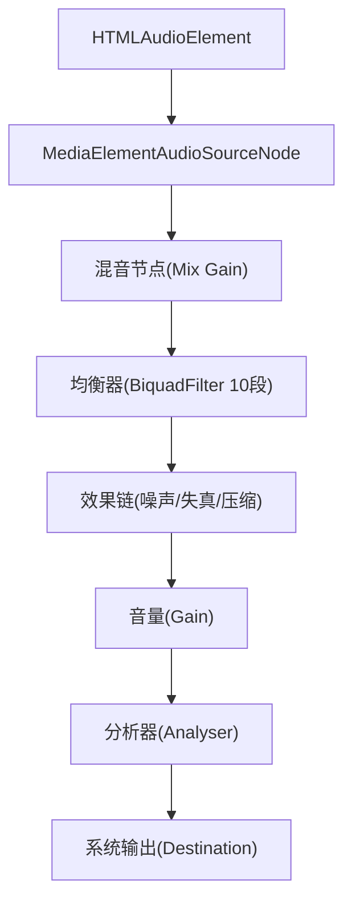
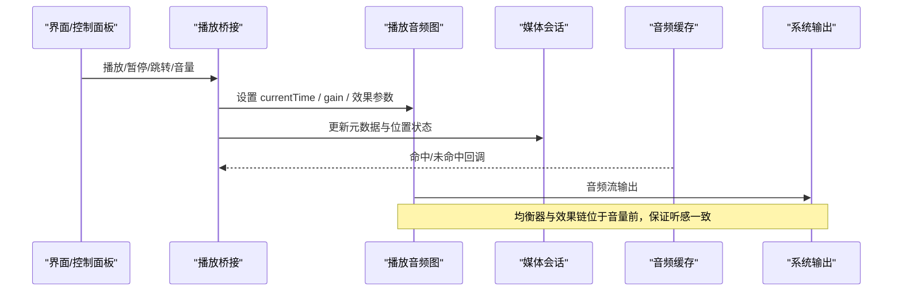
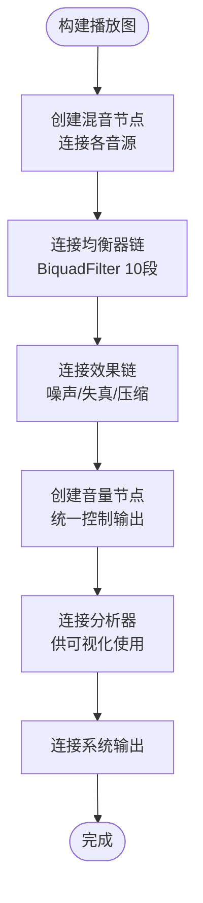
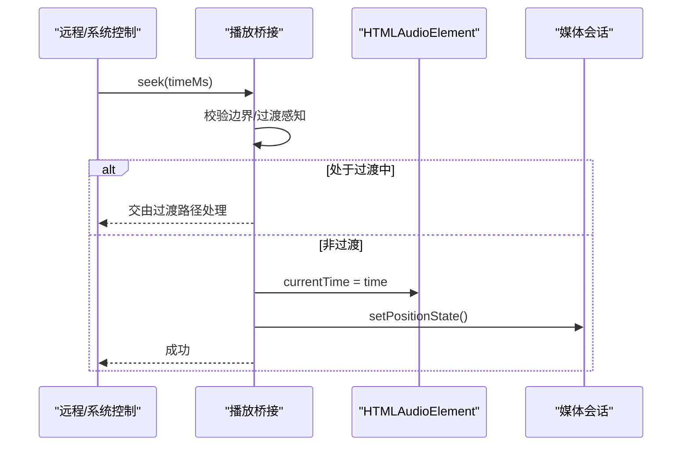
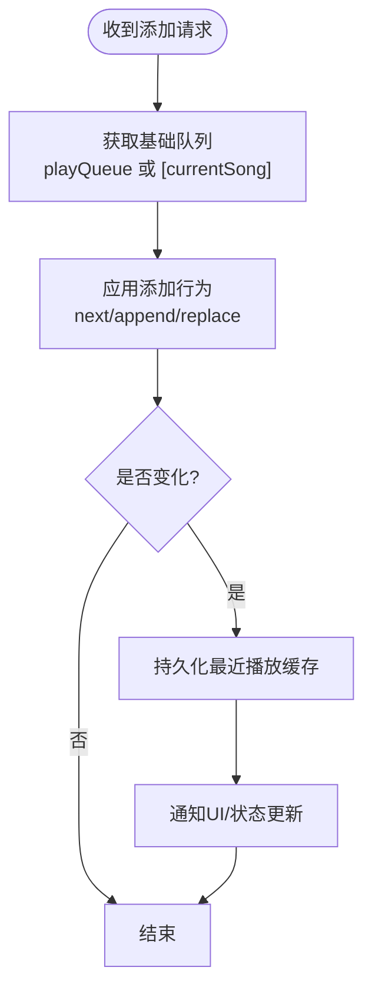
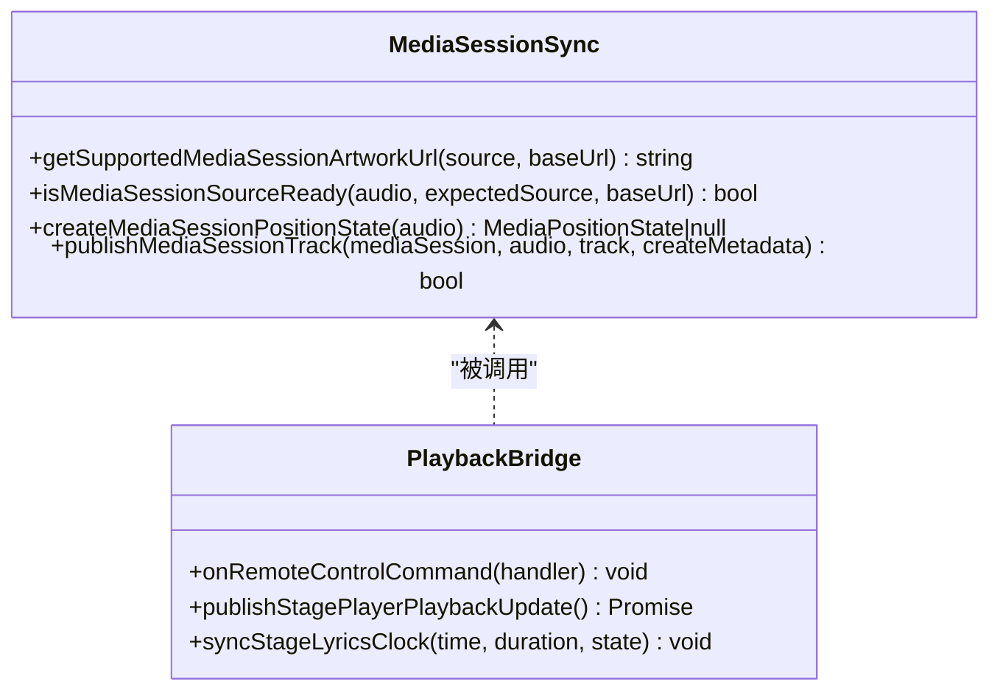
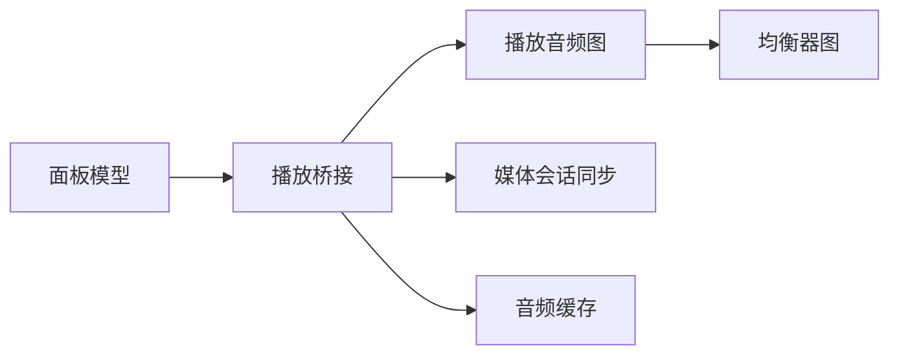

# 播放系统

<cite>
**本文引用的文件**
- [playbackGraph.ts](file://src/services/playbackGraph.ts)
- [audioEqualizerGraph.ts](file://src/services/audioEqualizerGraph.ts)
- [mediaSessionSync.ts](file://src/utils/mediaSessionSync.ts)
- [audioCache.ts](file://src/services/audioCache.ts)
- [useElectronPlaybackBridge.ts](file://src/hooks/useElectronPlaybackBridge.ts)
- [buildPlayerPanelModel.ts](file://src/components/app/player-panel/buildPlayerPanelModel.ts)
- [createOnlineRecoveryController.ts](file://src/components/app/playback/createOnlineRecoveryController.ts)
- [queueAddBehavior.ts](file://src/utils/queueAddBehavior.ts)
</cite>

## 目录
1. [简介](#简介)
2. [项目结构](#项目结构)
3. [核心组件](#核心组件)
4. [架构总览](#架构总览)
5. [详细组件分析](#详细组件分析)
6. [依赖关系分析](#依赖关系分析)
7. [性能考量](#性能考量)
8. [故障排查指南](#故障排查指南)
9. [结论](#结论)
10. [附录](#附录)

## 简介
本技术文档聚焦 Folia Player 的播放系统，围绕 Web Audio API 音频节点图构建、实时处理能力、播放状态管理（播放/暂停/跳转/音量）、播放队列算法（顺序/随机/循环）、跨平台适配层（设备差异、媒体会话集成、系统级控制）以及性能优化（预加载、内存与 CPU 优化）展开。文档以代码级为依据，提供可视化图表与可操作的调试建议，帮助开发者理解并扩展播放能力。

## 项目结构
播放系统由“音频图构建”“均衡器链”“媒体会话同步”“缓存策略”“桥接与状态同步”“面板模型与交互”等模块组成：
- 音频图构建：统一混音点、效果链、音量控制与分析器输出
- 均衡器：十段滤波器链，平滑参数更新
- 媒体会话：系统级元数据与位置状态同步
- 缓存：IndexedDB 与 Electron 文件缓存双通道，写后通知
- 桥接：Electron/浏览器环境下的播放控制、远程命令、状态发布
- 面板模型：UI 与播放控制的映射（播放/暂停/音量/队列）

图示来源
- [playbackGraph.ts:31-98](file://src/services/playbackGraph.ts#L31-L98)
- [audioEqualizerGraph.ts:20-45](file://src/services/audioEqualizerGraph.ts#L20-L45)

章节来源
- [playbackGraph.ts:31-98](file://src/services/playbackGraph.ts#L31-L98)
- [audioEqualizerGraph.ts:20-45](file://src/services/audioEqualizerGraph.ts#L20-L45)

## 核心组件
- 播放音频图：负责将多个音源（如自动混音的双甲板）接入共享混音点，串联均衡器、效果链、音量、分析器与输出，确保视觉与听觉一致。
- 均衡器图：创建稳定的十段滤波器链，支持平滑增益调整，避免在音频路径触发 React 重渲染。
- 媒体会话同步：封装媒体元数据与位置状态发布，过滤无效或过期的事件，保证系统与 UI 的一致性。
- 音频缓存：IndexedDB 与 Electron 文件缓存双通道，支持容量限制与迁移，写后回调通知下游消费。
- 播放桥接：统一处理远程命令（播放/暂停/跳转/循环模式切换）、任务栏/媒体会话联动、舞台模式时间同步。
- 面板模型：将 UI 操作映射到播放控制（播放/暂停、音量、静音、队列操作）。

章节来源
- [playbackGraph.ts:31-98](file://src/services/playbackGraph.ts#L31-L98)
- [audioEqualizerGraph.ts:20-59](file://src/services/audioEqualizerGraph.ts#L20-L59)
- [mediaSessionSync.ts:22-97](file://src/utils/mediaSessionSync.ts#L22-L97)
- [audioCache.ts:39-121](file://src/services/audioCache.ts#L39-L121)
- [useElectronPlaybackBridge.ts:30-150](file://src/hooks/useElectronPlaybackBridge.ts#L30-L150)
- [buildPlayerPanelModel.ts:69-301](file://src/components/app/player-panel/buildPlayerPanelModel.ts#L69-L301)

## 架构总览
播放系统的整体流程如下：
- 输入：HTMLAudioElement 或外部音源
- 处理：Web Audio 节点图（混音→均衡器→效果链→音量→分析器）
- 输出：系统扬声器/耳机
- 同步：媒体会话、任务栏、OBS/Stage 等外部订阅者
- 控制：UI 面板、远程命令、系统媒体键
- 缓存：在线/本地资源预取与命中

图示来源
- [useElectronPlaybackBridge.ts:613-710](file://src/hooks/useElectronPlaybackBridge.ts#L613-L710)
- [playbackGraph.ts:31-98](file://src/services/playbackGraph.ts#L31-L98)
- [mediaSessionSync.ts:54-97](file://src/utils/mediaSessionSync.ts#L54-L97)
- [audioCache.ts:92-121](file://src/services/audioCache.ts#L92-L121)

## 详细组件分析

### 播放音频图与实时处理
- 设计要点：
  - 共享混音点：多音源（含自动混音）汇聚至单一 Gain，确保均衡器与分析器看到的是最终混合信号。
  - 效果链顺序：均衡器之后、音量之前接入效果链，避免绝对型效果（如黑胶噪声、比特粉碎、压缩阈值）受上游音量影响而改变特性。
  - 分析器位置：置于音量之后，使可视化反映实际听到的音量。
- 复杂度与性能：
  - 节点创建一次复用，参数变更使用 setTargetAtTime 平滑过渡，降低抖动与卡顿。
  - 日志打印节点顺序，便于回归验证连接顺序正确性。

图示来源
- [playbackGraph.ts:31-98](file://src/services/playbackGraph.ts#L31-L98)
- [audioEqualizerGraph.ts:20-59](file://src/services/audioEqualizerGraph.ts#L20-L59)

章节来源
- [playbackGraph.ts:31-98](file://src/services/playbackGraph.ts#L31-L98)
- [audioEqualizerGraph.ts:20-59](file://src/services/audioEqualizerGraph.ts#L20-L59)

### 播放状态管理与控制
- 播放/暂停：通过 HTMLAudioElement 控制，同时同步媒体会话与任务栏状态；在自动混音过渡期间，需区分“显示轨道”和“实际音轨”，避免误操作隐藏音轨。
- 跳转：对远端/系统命令进行边界校验（0~duration），优先走过渡感知路径，再回退到直接设置 currentTime。
- 音量：统一在效果链之后的 Gain 节点控制，确保效果特性不受音量影响。
- 循环模式：通过桥接暴露给远程/系统控制，支持关闭/单曲/全部循环。

图示来源
- [useElectronPlaybackBridge.ts:613-710](file://src/hooks/useElectronPlaybackBridge.ts#L613-L710)
- [mediaSessionSync.ts:54-97](file://src/utils/mediaSessionSync.ts#L54-L97)

章节来源
- [useElectronPlaybackBridge.ts:613-710](file://src/hooks/useElectronPlaybackBridge.ts#L613-L710)
- [mediaSessionSync.ts:54-97](file://src/utils/mediaSessionSync.ts#L54-L97)

### 播放队列算法（顺序/随机/循环）
- 行为模型：基于“添加行为”决定插入位置（追加/下一首/替换等），结合当前队列与当前曲目计算新队列。
- 模式实现：
  - 顺序播放：默认追加到末尾，按序推进。
  - 随机播放：在队列评估/查询阶段打乱或选择随机项（具体逻辑在队列相关工具中）。
  - 循环播放：通过有效循环模式（off/all/one）控制下一曲选择与重复行为。
- 持久化：队列变更后持久化最近播放缓存，保障恢复一致性。

图示来源
- [queueAddBehavior.ts](file://src/utils/queueAddBehavior.ts)
- [useLibraryPlaybackController.ts:508-537](file://src/hooks/useLibraryPlaybackController.ts#L508-L537)

章节来源
- [queueAddBehavior.ts](file://src/utils/queueAddBehavior.ts)
- [useLibraryPlaybackController.ts:508-537](file://src/hooks/useLibraryPlaybackController.ts#L508-L537)

### 跨平台播放适配层
- 设备差异：
  - 浏览器：通过 MediaElementAudioSourceNode 与 Web Audio API 工作。
  - Electron：利用 IPC 访问底层缓存、任务栏、窗口控制等能力。
- 媒体会话集成：
  - 元数据：标题、艺人、专辑、封面 URL（仅允许 http/https/data/blob）。
  - 位置状态：仅在 duration 有效且 currentSrc 匹配时更新，避免过时事件污染。
- 系统级控制：
  - 任务栏/媒体键：播放/暂停/上一首/下一首/跳转/循环模式切换。
  - OBS/Stage：发布时钟与音频频谱，供外部渲染或录制。

图示来源
- [mediaSessionSync.ts:22-97](file://src/utils/mediaSessionSync.ts#L22-L97)
- [useElectronPlaybackBridge.ts:30-150](file://src/hooks/useElectronPlaybackBridge.ts#L30-L150)

章节来源
- [mediaSessionSync.ts:22-97](file://src/utils/mediaSessionSync.ts#L22-L97)
- [useElectronPlaybackBridge.ts:30-150](file://src/hooks/useElectronPlaybackBridge.ts#L30-L150)

### 在线流恢复与容错
- 问题背景：部分提供商每次请求生成新的 token（如 vkey/guid），导致 URL 比较永远不命中，错误→刷新→错误循环无界。
- 解决思路：以 origin+path 作为恢复键，忽略查询参数，避免重复刷新；成功后清除恢复标记。
- 集成点：在线恢复控制器用于播放源恢复与重试策略。

章节来源
- [createOnlineRecoveryController.ts:29-61](file://src/components/app/playback/createOnlineRecoveryController.ts#L29-L61)

### 面板模型与交互映射
- 将 UI 控件（播放/暂停、音量滑块、静音按钮、队列操作）映射到播放控制函数。
- 支持舞台上下文切换、命令面板集成、设置页打开等。

章节来源
- [buildPlayerPanelModel.ts:69-301](file://src/components/app/player-panel/buildPlayerPanelModel.ts#L69-L301)

## 依赖关系分析
- 播放图依赖均衡器与效果链，均衡器依赖 BiquadFilter 配置与采样率上限。
- 桥接依赖媒体会话同步、缓存写入监听、远程命令处理。
- 面板模型依赖桥接提供的控制函数与状态。

图示来源
- [playbackGraph.ts:31-98](file://src/services/playbackGraph.ts#L31-L98)
- [audioEqualizerGraph.ts:20-59](file://src/services/audioEqualizerGraph.ts#L20-L59)
- [mediaSessionSync.ts:22-97](file://src/utils/mediaSessionSync.ts#L22-L97)
- [audioCache.ts:92-121](file://src/services/audioCache.ts#L92-L121)
- [useElectronPlaybackBridge.ts:30-150](file://src/hooks/useElectronPlaybackBridge.ts#L30-L150)
- [buildPlayerPanelModel.ts:69-301](file://src/components/app/player-panel/buildPlayerPanelModel.ts#L69-L301)

章节来源
- [playbackGraph.ts:31-98](file://src/services/playbackGraph.ts#L31-L98)
- [audioEqualizerGraph.ts:20-59](file://src/services/audioEqualizerGraph.ts#L20-L59)
- [mediaSessionSync.ts:22-97](file://src/utils/mediaSessionSync.ts#L22-L97)
- [audioCache.ts:92-121](file://src/services/audioCache.ts#L92-L121)
- [useElectronPlaybackBridge.ts:30-150](file://src/hooks/useElectronPlaybackBridge.ts#L30-L150)
- [buildPlayerPanelModel.ts:69-301](file://src/components/app/player-panel/buildPlayerPanelModel.ts#L69-L301)

## 性能考量
- 预加载机制：
  - 使用缓存先读 IndexedDB/Electron 文件缓存，命中则直接构造 Blob，减少网络延迟。
  - 写后通知下游（如自动混音分析）及时消费已落盘字节，避免等待空缓存导致的降级。
- 内存管理：
  - 均衡器与效果链一次性创建，参数变更采用平滑调度，避免频繁节点重建。
  - 封面与二进制资产清理接口，防止长期运行内存膨胀。
- CPU 使用优化：
  - 将均衡器参数更新放在音频线程外，使用 setTargetAtTime 平滑过渡，减少主线程压力。
  - 分析器仅在需要时读取，避免高频采样造成 UI 卡顿。
- 体积与质量：
  - 根据音质设置选择不同码率/格式，平衡带宽与音质。
  - 在线恢复控制器避免无界重试，降低无效请求带来的 CPU/网络开销。

章节来源
- [audioCache.ts:39-121](file://src/services/audioCache.ts#L39-L121)
- [audioEqualizerGraph.ts:47-59](file://src/services/audioEqualizerGraph.ts#L47-L59)
- [binaryAssetStore.ts:140-173](file://src/services/binaryAssetStore.ts#L140-L173)
- [createOnlineRecoveryController.ts:29-61](file://src/components/app/playback/createOnlineRecoveryController.ts#L29-L61)

## 故障排查指南
- 媒体会话位置异常：
  - 检查 isMediaSessionSourceReady 条件：duration 必须有效，currentSrc 必须匹配预期源。
  - 若 positionState 为 null，说明无法构建位置状态，需等待媒体就绪。
- 跳转无效：
  - 确认边界校验（0~duration）与过渡感知路径是否正确路由。
  - 在自动混音过渡期间，优先走过渡路径，避免移动不可见音轨。
- 音量与效果不一致：
  - 确认音量节点位于效果链之后，否则绝对型效果会受上游音量影响。
  - 查看控制台日志中的节点顺序，确保连接顺序未退化。
- 缓存未命中：
  - 检查 Electron 缓存可用性、IndexedDB 迁移是否成功。
  - 关注 onAudioCached 回调，确认下游是否及时消费。

章节来源
- [mediaSessionSync.ts:37-97](file://src/utils/mediaSessionSync.ts#L37-L97)
- [useElectronPlaybackBridge.ts:613-710](file://src/hooks/useElectronPlaybackBridge.ts#L613-L710)
- [playbackGraph.ts:88-95](file://src/services/playbackGraph.ts#L88-L95)
- [audioCache.ts:92-121](file://src/services/audioCache.ts#L92-L121)

## 结论
Folia Player 的播放系统以 Web Audio API 为核心，构建了稳定高效的音频节点图，并通过均衡器与效果链提升音质表现。播放状态管理兼顾了浏览器与 Electron 环境的差异，媒体会话与系统控制保持一致。队列算法灵活支持多种播放模式，缓存策略显著提升响应速度与稳定性。通过合理的性能优化与完善的故障排查手段，系统能够在复杂场景下保持高可用与低延迟。

## 附录
- 关键路径参考：
  - 播放图构建与顺序：[playbackGraph.ts:31-98](file://src/services/playbackGraph.ts#L31-L98)
  - 均衡器链与平滑更新：[audioEqualizerGraph.ts:20-59](file://src/services/audioEqualizerGraph.ts#L20-L59)
  - 媒体会话同步：[mediaSessionSync.ts:22-97](file://src/utils/mediaSessionSync.ts#L22-L97)
  - 音频缓存与写后通知：[audioCache.ts:39-121](file://src/services/audioCache.ts#L39-L121)
  - 播放桥接与远程控制：[useElectronPlaybackBridge.ts:30-150](file://src/hooks/useElectronPlaybackBridge.ts#L30-L150), [useElectronPlaybackBridge.ts:613-710](file://src/hooks/useElectronPlaybackBridge.ts#L613-L710)
  - 面板模型与交互映射：[buildPlayerPanelModel.ts:69-301](file://src/components/app/player-panel/buildPlayerPanelModel.ts#L69-L301)
  - 在线流恢复：[createOnlineRecoveryController.ts:29-61](file://src/components/app/playback/createOnlineRecoveryController.ts#L29-L61)
  - 队列添加行为：[queueAddBehavior.ts](file://src/utils/queueAddBehavior.ts)