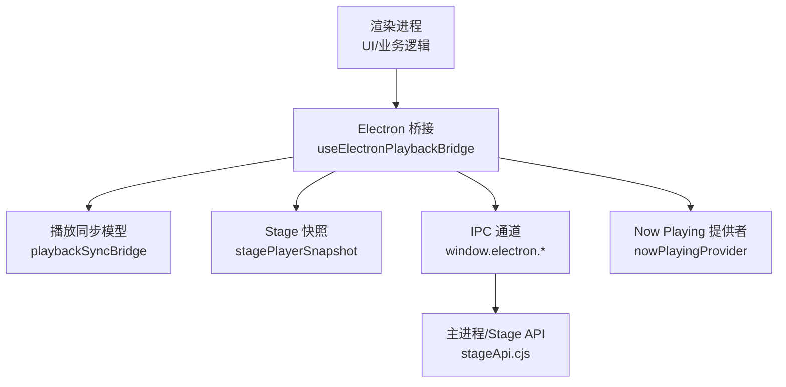
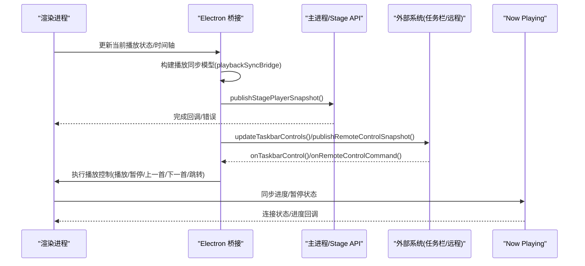
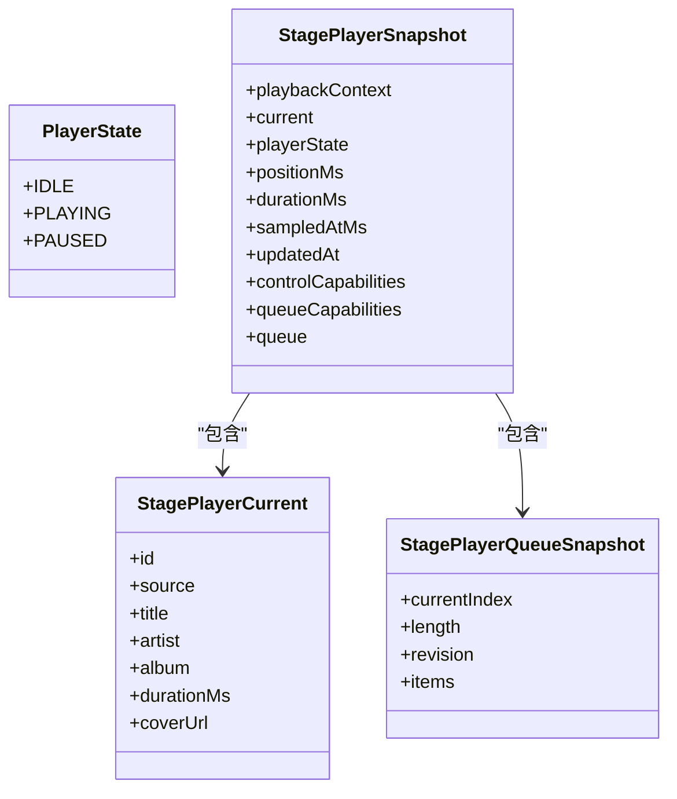
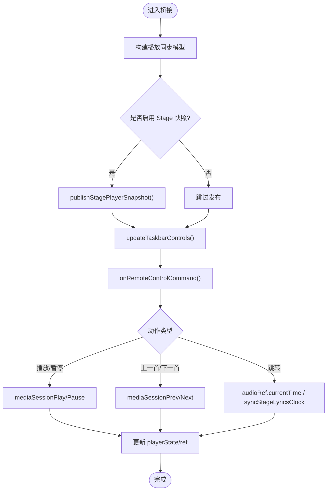
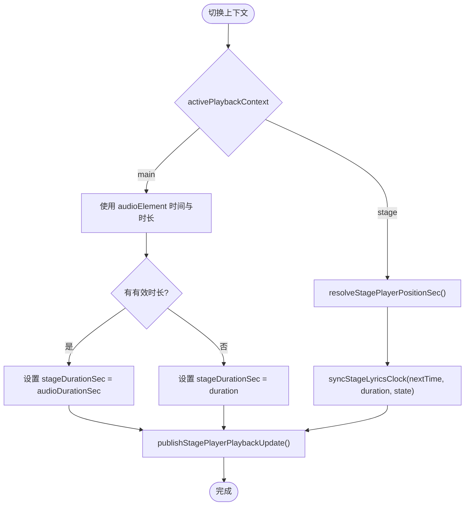
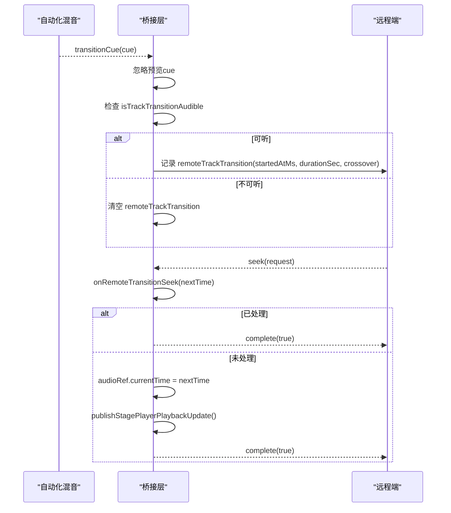
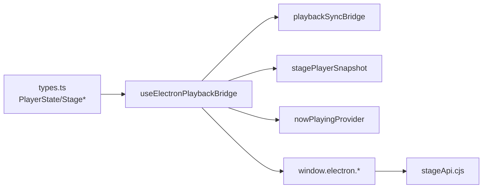

# 状态管理

<cite>
**本文引用的文件**
- [src/types.ts](file://src/types.ts)
- [src/hooks/useElectronPlaybackBridge.ts](file://src/hooks/useElectronPlaybackBridge.ts)
- [src/utils/playbackSyncBridge.ts](file://src/utils/playbackSyncBridge.ts)
- [src/utils/stagePlayerSnapshot.ts](file://src/utils/stagePlayerSnapshot.ts)
- [electron/stageApi.cjs](file://electron/stageApi.cjs)
- [src/services/nowPlayingProvider.ts](file://src/services/nowPlayingProvider.ts)
- [test/manual/stage-client/API_SCHEMA.md](file://test/manual/stage-client/API_SCHEMA.md)
</cite>

## 目录
1. [简介](#简介)
2. [项目结构](#项目结构)
3. [核心组件](#核心组件)
4. [架构总览](#架构总览)
5. [详细组件分析](#详细组件分析)
6. [依赖关系分析](#依赖关系分析)
7. [性能考量](#性能考量)
8. [故障排查指南](#故障排查指南)
9. [结论](#结论)
10. [附录](#附录)

## 简介
本技术文档聚焦 Folia Player 的播放状态管理，覆盖以下关键主题：
- 播放状态层次结构与枚举定义（IDLE、PLAYING、PAUSED）
- 状态转换规则与触发点（用户交互、系统事件、自动化混音过渡）
- 状态持久化与快照机制（主进程/渲染进程一致性、Stage 播放器快照）
- Electron 桥接层的状态同步（任务栏控制、远程遥控、Discord 状态、窗口点击穿透）
- 播放上下文切换（main/stage）时的状态协调策略
- 自动化混音过程中的状态协调（交接 cue、静音/可听性判断、seek 路由）
- 状态调试工具（快照、变更追踪、验证）
- 最佳实践与常见问题解决方案

## 项目结构
围绕播放状态管理的代码主要分布在以下模块：
- 类型与模型：src/types.ts（PlayerState、StagePlayer* 等）
- 渲染侧桥接：src/hooks/useElectronPlaybackBridge.ts（IPC 订阅、状态发布、远程控制处理）
- 同步模型构建：src/utils/playbackSyncBridge.ts（将当前播放状态建模为统一快照）
- Stage 位置解析：src/utils/stagePlayerSnapshot.ts（计算 stage 播放位置）
- 外部 API 适配：electron/stageApi.cjs（Stage API 状态规范化）
- Now Playing 集成：src/services/nowPlayingProvider.ts（外部播放器状态接入）
- 协议约定：test/manual/stage-client/API_SCHEMA.md（Stage 客户端接口约定）

图表来源
- [src/hooks/useElectronPlaybackBridge.ts:240-270](file://src/hooks/useElectronPlaybackBridge.ts#L240-L270)
- [src/utils/playbackSyncBridge.ts:1-200](file://src/utils/playbackSyncBridge.ts#L1-L200)
- [src/utils/stagePlayerSnapshot.ts:1-200](file://src/utils/stagePlayerSnapshot.ts#L1-L200)
- [electron/stageApi.cjs:300-330](file://electron/stageApi.cjs#L300-L330)
- [src/services/nowPlayingProvider.ts:377-472](file://src/services/nowPlayingProvider.ts#L377-L472)

章节来源
- [src/types.ts:1020-1025](file://src/types.ts#L1020-L1025)
- [src/hooks/useElectronPlaybackBridge.ts:240-270](file://src/hooks/useElectronPlaybackBridge.ts#L240-L270)
- [src/utils/playbackSyncBridge.ts:1-200](file://src/utils/playbackSyncBridge.ts#L1-L200)
- [src/utils/stagePlayerSnapshot.ts:1-200](file://src/utils/stagePlayerSnapshot.ts#L1-L200)
- [electron/stageApi.cjs:300-330](file://electron/stageApi.cjs#L300-L330)
- [src/services/nowPlayingProvider.ts:377-472](file://src/services/nowPlayingProvider.ts#L377-L472)

## 核心组件
- 播放状态枚举：PlayerState（IDLE、PLAYING、PAUSED），用于统一表达播放器的运行态。
- 播放同步模型：通过 playbackSyncBridge 将当前播放上下文、曲目、队列、时间轴、状态等聚合为可序列化的快照。
- Stage 快照：stagePlayerSnapshot 提供 Stage 播放器所需的精确位置与能力描述，供外部客户端消费。
- Electron 桥接：useElectronPlaybackBridge 负责监听系统事件（任务栏、语音输入）、发布远程快照、处理远程控制命令。
- Now Playing 提供者：对接外部播放器或系统媒体会话，维护连接状态、进度与歌词同步。

章节来源
- [src/types.ts:1020-1025](file://src/types.ts#L1020-L1025)
- [src/hooks/useElectronPlaybackBridge.ts:240-270](file://src/hooks/useElectronPlaybackBridge.ts#L240-L270)
- [src/utils/playbackSyncBridge.ts:1-200](file://src/utils/playbackSyncBridge.ts#L1-L200)
- [src/utils/stagePlayerSnapshot.ts:1-200](file://src/utils/stagePlayerSnapshot.ts#L1-L200)
- [src/services/nowPlayingProvider.ts:377-472](file://src/services/nowPlayingProvider.ts#L377-L472)

## 架构总览
下图展示了从渲染进程到主进程的播放状态同步路径，以及外部系统（任务栏、远程控件、Now Playing）如何与状态保持一致。

图表来源
- [src/hooks/useElectronPlaybackBridge.ts:425-436](file://src/hooks/useElectronPlaybackBridge.ts#L425-L436)
- [src/hooks/useElectronPlaybackBridge.ts:558-652](file://src/hooks/useElectronPlaybackBridge.ts#L558-L652)
- [src/utils/playbackSyncBridge.ts:1-200](file://src/utils/playbackSyncBridge.ts#L1-L200)
- [electron/stageApi.cjs:300-330](file://electron/stageApi.cjs#L300-L330)
- [src/services/nowPlayingProvider.ts:377-472](file://src/services/nowPlayingProvider.ts#L377-L472)

## 详细组件分析

### 播放状态枚举与数据结构
- PlayerState 定义了三种基本状态：IDLE、PLAYING、PAUSED。所有上层组件与外部系统均基于此枚举进行状态判断与展示。
- StagePlayerSnapshot 包含播放上下文、当前曲目、状态、位置、时长、采样时间、更新时间、控制与队列能力、队列快照等，是跨进程/跨端共享的核心数据模型。

图表来源
- [src/types.ts:1020-1025](file://src/types.ts#L1020-L1025)
- [src/types.ts:320-331](file://src/types.ts#L320-L331)
- [src/types.ts:255-263](file://src/types.ts#L255-L263)
- [src/types.ts:293-295](file://src/types.ts#L293-L295)

章节来源
- [src/types.ts:1020-1025](file://src/types.ts#L1020-L1025)
- [src/types.ts:320-331](file://src/types.ts#L320-L331)

### Electron 桥接层的状态同步机制
- 构建播放同步模型：使用 playbackSyncBridge 将 activePlaybackContext、currentSong、playQueue、currentTimeSec、stagePositionSec、durationSec、playerState、coverUrl、cachedCoverUrl、effectiveLoopMode、isFmMode、isStageActive、controlsDisabled、transparentModeEnabled 等字段聚合为统一快照。
- 发布 Stage 快照：当启用 isStagePlayerSnapshotEnabled 时，定期调用 publishStagePlayerSnapshot，并附带 forcePlaybackEvent 以驱动外部系统刷新。
- 任务栏控制：updateTaskbarControls 根据当前状态更新 Windows 任务栏按钮；onTaskbarControl 接收任务栏动作并转发到 mediaSession 控制。
- 远程控制：onRemoteControlCommand 处理来自主进程/远程端的播放控制指令（播放/暂停/上一首/下一首/循环模式切换/导出等）。
- 语音输入联动：系统/IME 语音输入激活时暂停播放，结束后恢复，避免误触。

图表来源
- [src/hooks/useElectronPlaybackBridge.ts:240-270](file://src/hooks/useElectronPlaybackBridge.ts#L240-L270)
- [src/hooks/useElectronPlaybackBridge.ts:425-436](file://src/hooks/useElectronPlaybackBridge.ts#L425-L436)
- [src/hooks/useElectronPlaybackBridge.ts:558-652](file://src/hooks/useElectronPlaybackBridge.ts#L558-L652)
- [src/hooks/useElectronPlaybackBridge.ts:687-710](file://src/hooks/useElectronPlaybackBridge.ts#L687-L710)

章节来源
- [src/hooks/useElectronPlaybackBridge.ts:240-270](file://src/hooks/useElectronPlaybackBridge.ts#L240-L270)
- [src/hooks/useElectronPlaybackBridge.ts:425-436](file://src/hooks/useElectronPlaybackBridge.ts#L425-L436)
- [src/hooks/useElectronPlaybackBridge.ts:558-652](file://src/hooks/useElectronPlaybackBridge.ts#L558-L652)
- [src/hooks/useElectronPlaybackBridge.ts:687-710](file://src/hooks/useElectronPlaybackBridge.ts#L687-L710)

### 播放上下文切换（main/stage）状态管理策略
- 上下文识别：activePlaybackContext 决定当前播放源是 main 还是 stage。
- 时间轴解析：resolveStagePlayerPositionSec 综合 audioElement.currentTime、motion currentTime、合成歌词时间，计算 stage 播放位置。
- 持续时间选择：当 activePlaybackContext === 'main' 或存在有效音频时长时，优先使用 audioDurationSec；否则回退到 duration。
- 歌词时钟同步：在 stage 上下文中，若 seek 发生在自动化混音过渡期间，通过 syncStageLyricsClock 保持歌词与播放进度一致。

图表来源
- [src/hooks/useElectronPlaybackBridge.ts:240-270](file://src/hooks/useElectronPlaybackBridge.ts#L240-L270)
- [src/hooks/useElectronPlaybackBridge.ts:687-710](file://src/hooks/useElectronPlaybackBridge.ts#L687-L710)

章节来源
- [src/hooks/useElectronPlaybackBridge.ts:240-270](file://src/hooks/useElectronPlaybackBridge.ts#L240-L270)
- [src/hooks/useElectronPlaybackBridge.ts:687-710](file://src/hooks/useElectronPlaybackBridge.ts#L687-L710)

### 自动化混音过程中的状态协调
- 交接 cue 订阅：subscribeToTransitionCue 监听自动化混音的过渡提示，忽略预览 cue，仅在可听性满足时记录 remoteTrackTransition。
- 可听性判断：isTrackTransitionAudibleRef.current() 确保在真实混音过程中才向远程端报告交接。
- 跳转路由：onRemoteTransitionSeek 处理在混音过渡期间的 seek，避免对正在静音的 incoming deck 操作，转而 seek 当前可见 track。
- 状态发布：在 seek 完成后调用 publishStagePlayerPlaybackUpdate 以刷新外部系统状态。

图表来源
- [src/hooks/useElectronPlaybackBridge.ts:177-198](file://src/hooks/useElectronPlaybackBridge.ts#L177-L198)
- [src/hooks/useElectronPlaybackBridge.ts:687-710](file://src/hooks/useElectronPlaybackBridge.ts#L687-L710)

章节来源
- [src/hooks/useElectronPlaybackBridge.ts:177-198](file://src/hooks/useElectronPlaybackBridge.ts#L177-L198)
- [src/hooks/useElectronPlaybackBridge.ts:687-710](file://src/hooks/useElectronPlaybackBridge.ts#L687-L710)

### 状态持久化与快照机制
- 播放同步模型：buildPlaybackSyncBridgeModel 将当前状态序列化，便于跨进程/跨端传输。
- Stage 快照缓存：stageSnapshotCacheRef 缓存 playQueue、currentSong、activePlaybackContext、isStageActive、canGoPrevious/Next、coverUrl 及 snapshot，减少重复计算。
- 外部系统同步：publishDiscordPresenceSnapshot、publishRemoteControlSnapshot、updateTaskbarControls 保证多端状态一致。
- Now Playing 提供者：维护连接状态、曲目、歌词、暂停状态与进度，支持重连与精确/粗略进度融合。

章节来源
- [src/hooks/useElectronPlaybackBridge.ts:325-347](file://src/hooks/useElectronPlaybackBridge.ts#L325-L347)
- [src/hooks/useElectronPlaybackBridge.ts:350-371](file://src/hooks/useElectronPlaybackBridge.ts#L350-L371)
- [src/services/nowPlayingProvider.ts:377-472](file://src/services/nowPlayingProvider.ts#L377-L472)

### 状态调试工具使用方法
- 状态快照：
  - 获取 Stage 播放器快照：publishStagePlayerPlaybackUpdate 会调用 window.electron.publishStagePlayerSnapshot，返回完整快照对象。
  - 读取桥接状态：getPlaybackSyncBridgeStatus 与 onPlaybackSyncBridgeStatusChanged 提供桥接层健康状态。
- 状态变更追踪：
  - 订阅 transition cue：subscribeToTransitionCue 跟踪自动化混音的交接开始/结束。
  - 监听远程控制命令：onRemoteControlCommand 记录每次控制动作与结果。
- 状态验证机制：
  - Stage API 规范：test/manual/stage-client/API_SCHEMA.md 定义了 PlayerState 与时间补偿行为，可用于端到端验证。
  - 单元测试参考：stageApi.test.ts 验证 PLAYING/PAUSED 下的 positionMs 精度与补偿逻辑。

章节来源
- [src/hooks/useElectronPlaybackBridge.ts:471-486](file://src/hooks/useElectronPlaybackBridge.ts#L471-L486)
- [src/hooks/useElectronPlaybackBridge.ts:540-556](file://src/hooks/useElectronPlaybackBridge.ts#L540-L556)
- [test/manual/stage-client/API_SCHEMA.md:17-20](file://test/manual/stage-client/API_SCHEMA.md#L17-L20)

## 依赖关系分析
- 类型依赖：PlayerState 被多处引用，作为状态判断的基础。
- 桥接依赖：useElectronPlaybackBridge 依赖 playbackSyncBridge、stagePlayerSnapshot、nowPlayingProvider。
- 主进程依赖：stageApi.cjs 提供 Stage API 的状态规范化与处理能力。
- 外部系统依赖：任务栏、远程控件、Discord、Now Playing 通过 IPC 与桥接层交互。

图表来源
- [src/types.ts:1020-1025](file://src/types.ts#L1020-L1025)
- [src/hooks/useElectronPlaybackBridge.ts:240-270](file://src/hooks/useElectronPlaybackBridge.ts#L240-L270)
- [electron/stageApi.cjs:300-330](file://electron/stageApi.cjs#L300-L330)

章节来源
- [src/types.ts:1020-1025](file://src/types.ts#L1020-L1025)
- [src/hooks/useElectronPlaybackBridge.ts:240-270](file://src/hooks/useElectronPlaybackBridge.ts#L240-L270)
- [electron/stageApi.cjs:300-330](file://electron/stageApi.cjs#L300-L330)

## 性能考量
- 快照缓存：stageSnapshotCacheRef 避免重复构建快照，降低 IPC 开销。
- 节流与去抖：publishRemoteControlSnapshot 每 500ms 发布一次，减少频繁 IPC。
- 条件发布：仅当 isStagePlayerSnapshotEnabled 为真时才发布 Stage 快照。
- 精确时间补偿：Stage API 在 PLAYING 状态下提供带补偿的位置，提升外部系统显示精度。

[本节为通用指导，不直接分析具体文件]

## 故障排查指南
- 任务栏控制无效：
  - 检查 taskbarHasTrackRef 与 isNowPlayingControlDisabledRef，确认当前上下文允许控制。
  - 确认 updateTaskbarControls 成功调用且无异常。
- 远程控制命令未生效：
  - 检查 onRemoteControlCommand 是否正确注册与处理。
  - 确认 mediaSession 控制函数可用且无阻塞。
- 语音输入导致播放异常：
  - 检查 onVoiceInputStateChanged 回调逻辑，确保 pausedByVoiceInputRef 正确标记与恢复。
- Now Playing 连接不稳定：
  - 关注 connectionStatus 变化与重连逻辑，必要时重置快照与进度。

章节来源
- [src/hooks/useElectronPlaybackBridge.ts:425-436](file://src/hooks/useElectronPlaybackBridge.ts#L425-L436)
- [src/hooks/useElectronPlaybackBridge.ts:558-652](file://src/hooks/useElectronPlaybackBridge.ts#L558-L652)
- [src/hooks/useElectronPlaybackBridge.ts:438-469](file://src/hooks/useElectronPlaybackBridge.ts#L438-L469)
- [src/services/nowPlayingProvider.ts:463-488](file://src/services/nowPlayingProvider.ts#L463-L488)

## 结论
Folia Player 的播放状态管理通过清晰的枚举定义、统一的同步模型、健壮的 Electron 桥接层与外部系统集成，实现了主进程与渲染进程之间的高度一致性。自动化混音与上下文切换场景下，状态协调策略确保了用户体验的连贯性与准确性。借助快照与调试工具，开发者可以高效定位与解决问题，遵循最佳实践可进一步提升系统的稳定性与可维护性。

[本节为总结性内容，不直接分析具体文件]

## 附录
- 状态枚举参考：PlayerState（IDLE、PLAYING、PAUSED）
- 快照模型参考：StagePlayerSnapshot、StagePlayerCurrent、StagePlayerQueueSnapshot
- 协议参考：Stage 客户端 API 约定（test/manual/stage-client/API_SCHEMA.md）

[本节为补充信息，不直接分析具体文件]