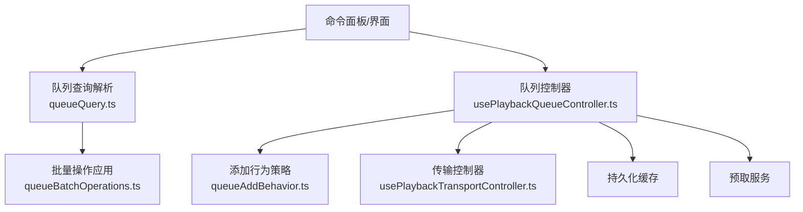
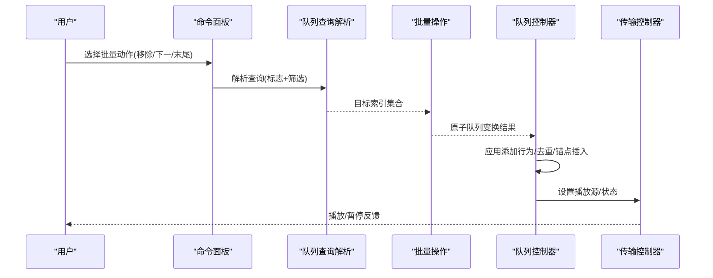
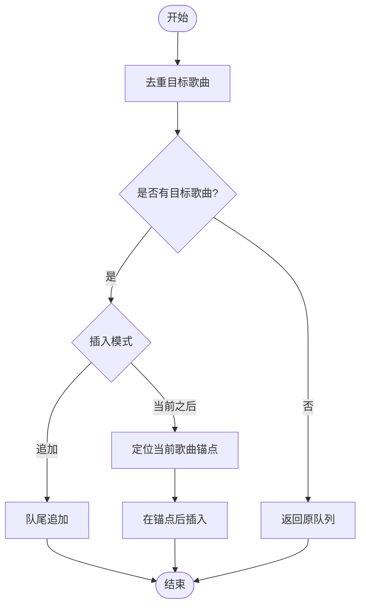
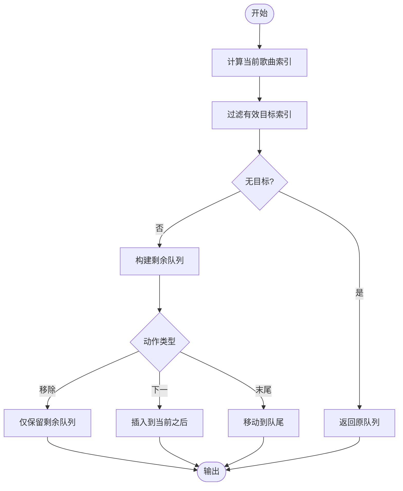
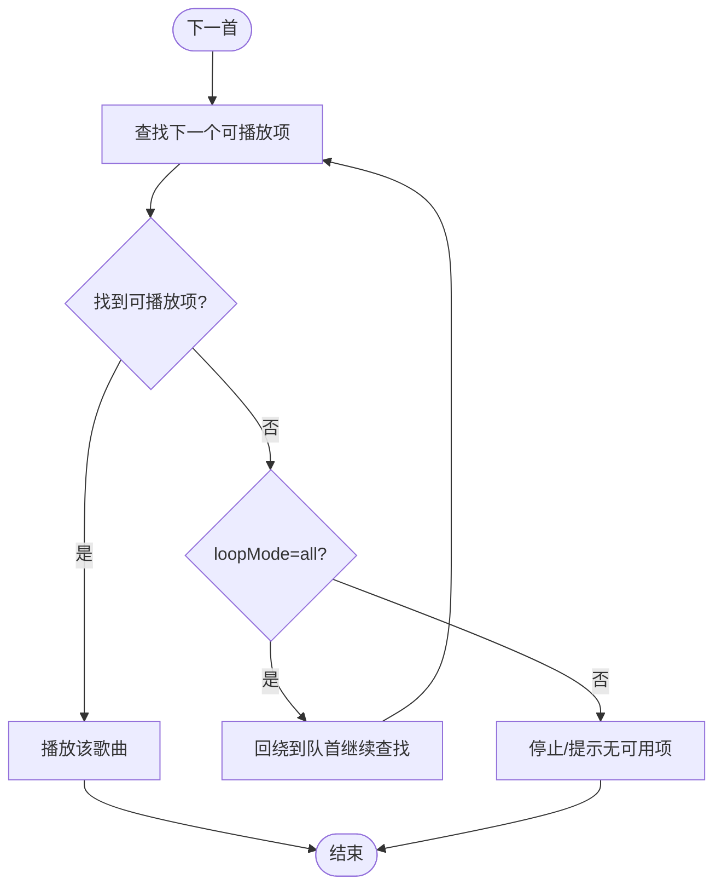
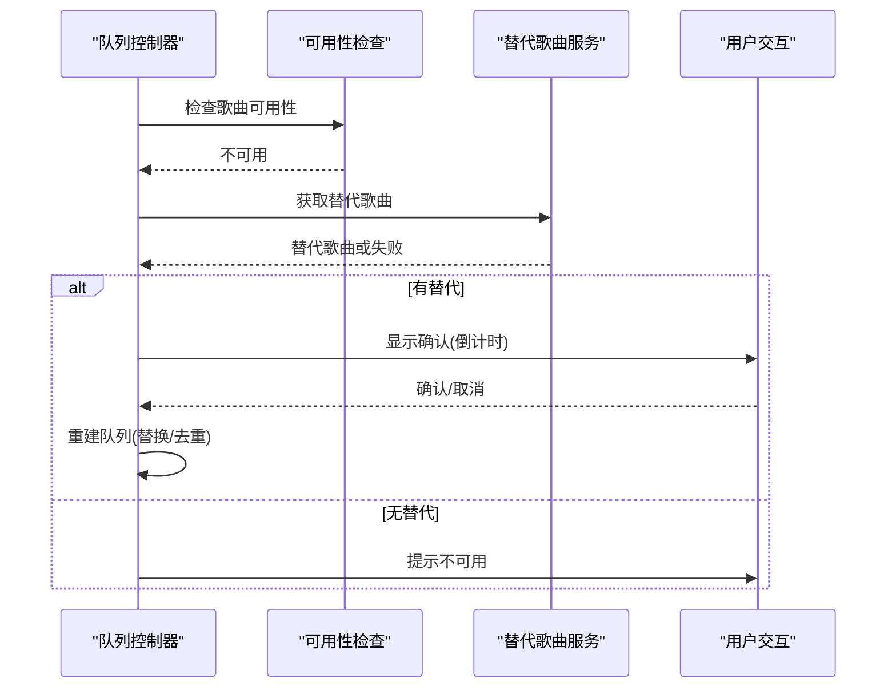
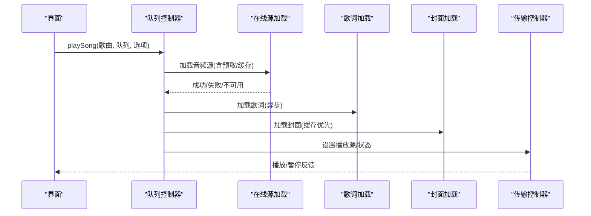
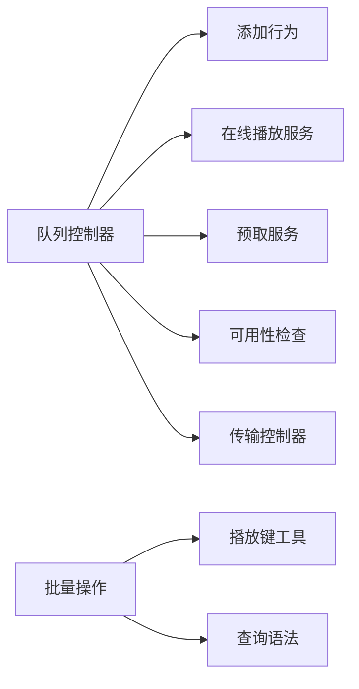

# 队列控制

<cite>
**本文引用的文件**
- [usePlaybackQueueController.ts](file://src/hooks/usePlaybackQueueController.ts)
- [queueAddBehavior.ts](file://src/utils/queueAddBehavior.ts)
- [queueBatchOperations.ts](file://src/utils/queueBatchOperations.ts)
- [queueQuery.ts](file://src/components/command-palette/queueQuery.ts)
- [usePlaybackTransportController.ts](file://src/hooks/usePlaybackTransportController.ts)
</cite>

## 目录
1. [简介](#简介)
2. [项目结构](#项目结构)
3. [核心组件](#核心组件)
4. [架构总览](#架构总览)
5. [详细组件分析](#详细组件分析)
6. [依赖关系分析](#依赖关系分析)
7. [性能考量](#性能考量)
8. [故障排查指南](#故障排查指南)
9. [结论](#结论)
10. [附录](#附录)

## 简介
本技术文档聚焦 Folia Player 的播放队列控制能力，围绕以下目标展开：
- 解析队列数据结构与模型（队列项、当前歌曲、播放模式等）
- 说明队列操作接口与状态管理（添加、移除、批量操作、排序、搜索、导出）
- 详解播放模式算法（顺序、随机、单曲循环、列表循环）
- 解释原子性保证、批量优化与持久化机制
- 提供 API 使用示例（动态添加、排序、搜索、导出）
- 给出大队列处理、内存管理与异步优化的最佳实践

## 项目结构
与队列控制直接相关的代码主要分布在 hooks、utils 与 command-palette 三个层次：
- hooks：编排播放流程与队列导航（如 usePlaybackQueueController）
- utils：实现队列行为策略与批量操作（如 queueAddBehavior、queueBatchOperations）
- command-palette：提供队列查询语法与批量动作（如 queueQuery）

图表来源
- [usePlaybackQueueController.ts:159-275](file://src/hooks/usePlaybackQueueController.ts#L159-L275)
- [queueAddBehavior.ts:14-83](file://src/utils/queueAddBehavior.ts#L14-L83)
- [queueBatchOperations.ts:23-68](file://src/utils/queueBatchOperations.ts#L23-L68)
- [queueQuery.ts:12-67](file://src/components/command-palette/queueQuery.ts#L12-L67)
- [usePlaybackTransportController.ts:71-166](file://src/hooks/usePlaybackTransportController.ts#L71-L166)

章节来源
- [usePlaybackQueueController.ts:159-275](file://src/hooks/usePlaybackQueueController.ts#L159-L275)
- [queueAddBehavior.ts:14-83](file://src/utils/queueAddBehavior.ts#L14-L83)
- [queueBatchOperations.ts:23-68](file://src/utils/queueBatchOperations.ts#L23-L68)
- [queueQuery.ts:12-67](file://src/components/command-palette/queueQuery.ts#L12-L67)
- [usePlaybackTransportController.ts:71-166](file://src/hooks/usePlaybackTransportController.ts#L71-L166)

## 核心组件
- 队列控制器（usePlaybackQueueController）
  - 负责播放请求的统一入口、在线资源加载、歌词与封面预取、不可用歌曲替换、队列导航与状态更新。
  - 关键职责：playSong、appendOnlineSongsToMainQueue、getNextPlayableQueueSong、buildQueueWithReplacementSong、handleMarkedUnavailableSong。
- 队列添加行为（queueAddBehavior）
  - 根据用户偏好将新歌曲插入到队列中，支持“追加”或“在当前歌曲之后插入”，并去重。
- 批量操作（queueBatchOperations）
  - 对选中的多首歌曲执行“移除/移至下一首/移至末尾”的原子变换，保持重复项与相对顺序。
- 队列查询（queueQuery）
  - 定义队列操作的查询语法（标志位 remove/next/end 与 facet artist/album），用于命令面板的批量操作。
- 传输控制器（usePlaybackTransportController）
  - 负责播放/暂停、音频上下文恢复、过渡期暂停处理、状态同步。

章节来源
- [usePlaybackQueueController.ts:159-728](file://src/hooks/usePlaybackQueueController.ts#L159-L728)
- [queueAddBehavior.ts:14-83](file://src/utils/queueAddBehavior.ts#L14-L83)
- [queueBatchOperations.ts:23-68](file://src/utils/queueBatchOperations.ts#L23-L68)
- [queueQuery.ts:12-67](file://src/components/command-palette/queueQuery.ts#L12-L67)
- [usePlaybackTransportController.ts:71-166](file://src/hooks/usePlaybackTransportController.ts#L71-L166)

## 架构总览
队列控制的总体流程如下：
- 用户通过命令面板或界面触发队列操作（添加、移除、排序、搜索）。
- 队列查询解析为具体动作与筛选条件。
- 批量操作在单步内完成队列变换，确保原子性与一致性。
- 队列控制器协调在线资源加载、歌词/封面预取、不可用歌曲替换与播放。
- 传输控制器负责实际的播放/暂停与状态同步。

图表来源
- [queueQuery.ts:12-67](file://src/components/command-palette/queueQuery.ts#L12-L67)
- [queueBatchOperations.ts:23-68](file://src/utils/queueBatchOperations.ts#L23-L68)
- [usePlaybackQueueController.ts:159-275](file://src/hooks/usePlaybackQueueController.ts#L159-L275)
- [usePlaybackTransportController.ts:71-166](file://src/hooks/usePlaybackTransportController.ts#L71-L166)

## 详细组件分析

### 队列数据模型与状态
- 队列项模型
  - 统一歌曲类型 SongResult，包含本地、在线、Navidrome 等多种来源；通过 getPlaybackSongKey 进行唯一标识。
- 队列状态
  - currentSong：当前播放歌曲
  - playQueue：播放队列
  - loopMode：循环模式（off/all/one）
  - isFmMode：是否处于个性化电台模式
  - playerState：播放器状态（IDLE/PLAYING/PAUSED）
  - 其他：歌词、封面、时间轴、错误消息等

章节来源
- [usePlaybackQueueController.ts:57-143](file://src/hooks/usePlaybackQueueController.ts#L57-L143)
- [usePlaybackQueueController.ts:159-214](file://src/hooks/usePlaybackQueueController.ts#L159-L214)

### 队列添加行为（append/after-current）
- 去重：基于播放键去重，避免重复加入同一歌曲。
- 插入策略：
  - append：将新歌曲追加到队尾（去除已存在项后追加）。
  - after-current：在当前歌曲之后插入（以当前歌曲为锚点定位插入位置）。
- 返回变更：affectedSongs、changed 指示是否发生实际变化。

图表来源
- [queueAddBehavior.ts:14-83](file://src/utils/queueAddBehavior.ts#L14-L83)

章节来源
- [queueAddBehavior.ts:14-83](file://src/utils/queueAddBehavior.ts#L14-L83)

### 批量操作（remove/next/end）
- 输入：队列、目标索引集合、当前歌曲、动作类型。
- 行为：
  - remove：从队列中移除选中项。
  - next：将选中项移动到当前歌曲之后。
  - end：将选中项移动到队尾。
- 原子性：单次调用内完成过滤与重组，保持重复项与相对顺序不变。
- 输出：nextQueue、affectedCount、skippedCurrentCount、changed。

图表来源
- [queueBatchOperations.ts:23-68](file://src/utils/queueBatchOperations.ts#L23-L68)

章节来源
- [queueBatchOperations.ts:23-68](file://src/utils/queueBatchOperations.ts#L23-L68)

### 播放模式算法（顺序/随机/单曲循环/列表循环）
- 顺序播放：按队列顺序前进，遇到不可用歌曲时尝试跳过至下一个可播放项。
- 列表循环：当到达队尾且 loopMode=all 时，回绕到队首继续播放。
- 单曲循环：由上层播放器状态控制单曲循环逻辑（此处队列层不改变顺序）。
- 随机播放：队列层未实现随机算法；可在上层扩展或使用外部随机策略。

图表来源
- [usePlaybackQueueController.ts:313-337](file://src/hooks/usePlaybackQueueController.ts#L313-L337)

章节来源
- [usePlaybackQueueController.ts:313-337](file://src/hooks/usePlaybackQueueController.ts#L313-L337)

### 不可用歌曲处理与替换
- 检测不可用：isSongUnavailable 与 omni.canPlaySong 判断。
- 替换流程：
  - 获取替代歌曲（getSongReplacement）。
  - 若无可替代或仍不可用，提示错误。
  - 否则进入确认流程（倒计时自动跳过或手动取消）。
  - 成功后重建队列（替换对应项并去重）。

图表来源
- [usePlaybackQueueController.ts:374-406](file://src/hooks/usePlaybackQueueController.ts#L374-L406)
- [usePlaybackQueueController.ts:408-455](file://src/hooks/usePlaybackQueueController.ts#L408-L455)
- [usePlaybackQueueController.ts:339-372](file://src/hooks/usePlaybackQueueController.ts#L339-L372)

章节来源
- [usePlaybackQueueController.ts:374-455](file://src/hooks/usePlaybackQueueController.ts#L374-L455)
- [usePlaybackQueueController.ts:339-372](file://src/hooks/usePlaybackQueueController.ts#L339-L372)

### 播放入口与状态同步
- playSong：统一入口，处理本地/在线/Navidrome 三种来源，预取歌词与封面，设置播放源与状态。
- 传输控制：resumePlayback/pausePlayback 负责音频上下文恢复、过渡期暂停、状态同步。

图表来源
- [usePlaybackQueueController.ts:458-687](file://src/hooks/usePlaybackQueueController.ts#L458-L687)
- [usePlaybackTransportController.ts:71-166](file://src/hooks/usePlaybackTransportController.ts#L71-L166)

章节来源
- [usePlaybackQueueController.ts:458-687](file://src/hooks/usePlaybackQueueController.ts#L458-L687)
- [usePlaybackTransportController.ts:71-166](file://src/hooks/usePlaybackTransportController.ts#L71-L166)

### 队列查询与批量动作
- 查询语法：支持标志位 remove/next/end 与 facet artist/album。
- 解析与格式化：parseQueueQuery/formatQueueQuery/replaceQueueAction/replaceQueueFacet。
- 用途：命令面板中快速筛选并批量操作队列项。

章节来源
- [queueQuery.ts:12-67](file://src/components/command-palette/queueQuery.ts#L12-L67)

## 依赖关系分析
- 队列控制器依赖：
  - 在线播放服务（加载音频、歌词、封面）
  - 预取服务（prefetchNearbySongs）
  - 可用性检查（isSongUnavailable、omni.canPlaySong）
  - 添加行为策略（applyQueueAddBehavior）
  - 传输控制器（播放/暂停）
- 批量操作依赖：
  - 播放键工具（getPlaybackSongKey）
  - 命令面板查询语法（parseCommandQuery）

图表来源
- [usePlaybackQueueController.ts:159-275](file://src/hooks/usePlaybackQueueController.ts#L159-L275)
- [queueBatchOperations.ts:23-68](file://src/utils/queueBatchOperations.ts#L23-L68)
- [queueQuery.ts:12-67](file://src/components/command-palette/queueQuery.ts#L12-L67)

章节来源
- [usePlaybackQueueController.ts:159-275](file://src/hooks/usePlaybackQueueController.ts#L159-L275)
- [queueBatchOperations.ts:23-68](file://src/utils/queueBatchOperations.ts#L23-L68)
- [queueQuery.ts:12-67](file://src/components/command-palette/queueQuery.ts#L12-L67)

## 性能考量
- 大队列处理
  - 使用 Set 进行去重与索引过滤，降低 O(n^2) 风险。
  - 批量操作一次性构建剩余队列与插入片段，减少多次渲染。
- 内存管理
  - 及时回收 Blob URL（retireBlobUrl），避免内存泄漏。
  - 预取与缓存结合，减少重复网络请求。
- 异步优化
  - 歌词与封面异步加载，避免阻塞主线程。
  - 使用请求 ID 防止竞态（playbackRequestIdRef）。
- 预取邻近歌曲
  - 在队列长度大于 1 时预取相邻歌曲，提升切换流畅度。

章节来源
- [usePlaybackQueueController.ts:548-687](file://src/hooks/usePlaybackQueueController.ts#L548-L687)
- [queueBatchOperations.ts:23-68](file://src/utils/queueBatchOperations.ts#L23-L68)

## 故障排查指南
- 不可用歌曲
  - 现象：提示“歌曲不可用”或自动跳过。
  - 排查：检查可用性判断与替代歌曲服务；确认网络与权限。
  - 参考：[usePlaybackQueueController.ts:374-455](file://src/hooks/usePlaybackQueueController.ts#L374-L455)
- 播放失败
  - 现象：播放错误提示或状态停留在 PAUSED。
  - 排查：检查音频上下文状态、URL 有效性、重试恢复逻辑。
  - 参考：[usePlaybackTransportController.ts:71-166](file://src/hooks/usePlaybackTransportController.ts#L71-L166)
- 队列异常
  - 现象：批量操作无效或顺序错乱。
  - 排查：确认目标索引范围、当前歌曲锚点定位、去重逻辑。
  - 参考：[queueBatchOperations.ts:23-68](file://src/utils/queueBatchOperations.ts#L23-L68)

章节来源
- [usePlaybackQueueController.ts:374-455](file://src/hooks/usePlaybackQueueController.ts#L374-L455)
- [usePlaybackTransportController.ts:71-166](file://src/hooks/usePlaybackTransportController.ts#L71-L166)
- [queueBatchOperations.ts:23-68](file://src/utils/queueBatchOperations.ts#L23-L68)

## 结论
Folia Player 的队列控制通过清晰的职责分层与原子化操作，实现了稳健的队列管理与播放体验：
- 队列控制器统一入口，协调资源加载与状态同步
- 添加行为与批量操作保证一致性与性能
- 不可用歌曲处理增强鲁棒性
- 传输控制器保障播放/暂停的正确性
建议在上层扩展随机播放与更多排序策略，并结合预取与缓存进一步优化大队列场景下的性能。

## 附录
- 队列 API 使用示例（概念性）
  - 动态添加歌曲：调用 applyQueueAddBehavior，选择 append 或 after-current。
  - 队列排序：在队列层可按需实现排序函数，注意保持重复项与相对顺序。
  - 队列搜索：使用 parseQueueQuery 解析 artist/album 等 facet，配合批量操作筛选。
  - 队列导出：遍历 playQueue 并序列化，注意敏感信息脱敏。
- 最佳实践
  - 使用批量操作减少多次渲染
  - 利用预取与缓存降低延迟
  - 合理管理 Blob URL 与异步任务，避免内存泄漏与竞态