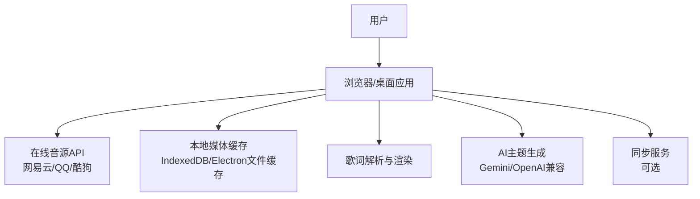
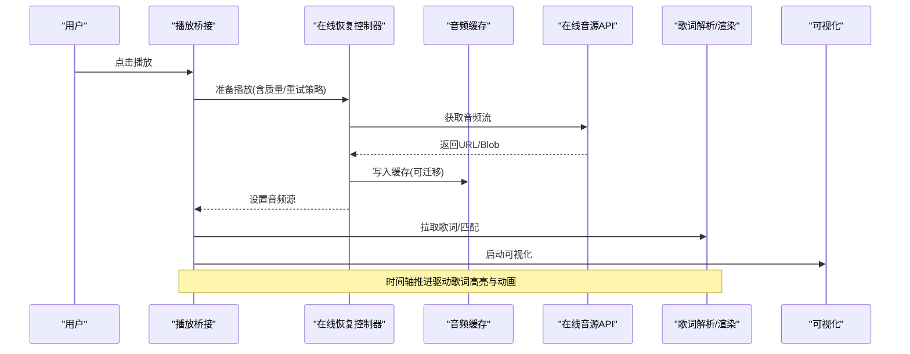
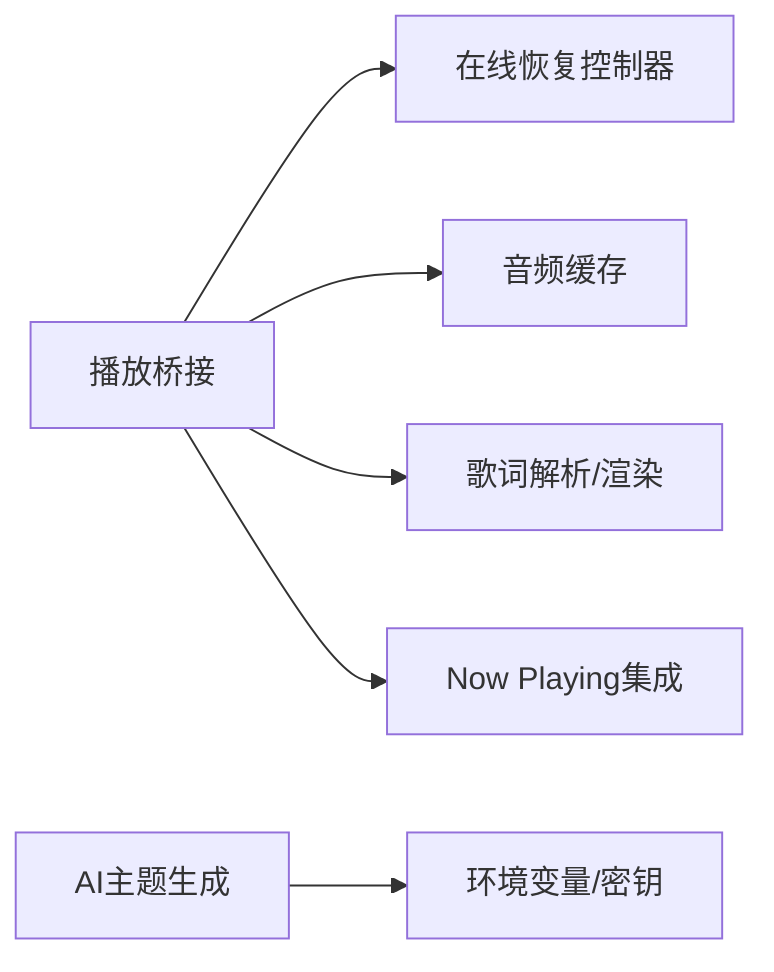

# 常见问题

<cite>
**本文引用的文件**
- [README.md](file://README.md)
- [known-non-bug-issues.md](file://docs/chore/known-non-bug-issues.md)
- [technical.md](file://docs/technical.md)
- [local-library-management.md](file://docs/local-library-management.md)
- [runtimeConfig.ts](file://src/services/runtimeConfig.ts)
- [audioCache.ts](file://src/services/audioCache.ts)
- [ErrorBoundary.tsx](file://src/components/shared/ErrorBoundary.tsx)
- [createOnlineRecoveryController.ts](file://src/components/app/playback/createOnlineRecoveryController.ts)
- [useElectronPlaybackBridge.ts](file://src/hooks/useElectronPlaybackBridge.ts)
- [modelPaths.cjs](file://electron/analysis/modelPaths.cjs)
- [generate-theme_openai.ts](file://worker/generate-theme_openai.ts)
- [nowPlayingProvider.ts](file://src/services/nowPlayingProvider.ts)
</cite>

## 目录
1. [简介](#简介)
2. [项目结构](#项目结构)
3. [核心组件](#核心组件)
4. [架构总览](#架构总览)
5. [详细组件分析](#详细组件分析)
6. [依赖关系分析](#依赖关系分析)
7. [性能注意事项](#性能注意事项)
8. [故障排查指南](#故障排查指南)
9. [结论](#结论)
10. [附录：快速检查清单](#附录快速检查清单)

## 简介
本章节面向Folia Player用户，汇总安装、播放、网络、音频格式、歌词显示等常见问题的症状、原因与解决步骤。文档同时收录“已知但非Bug”的问题说明，帮助你区分真正的代码缺陷与环境配置问题。文末提供自助排查清单，便于快速定位问题。

## 项目结构
Folia包含Web前端、Electron桌面端、可选的同步服务与多平台部署脚本。本地音乐库管理、技术栈与部署要点在仓库文档中均有详细说明。

**节来源**
- [README.md:66-185](file://README.md#L66-L185)
- [technical.md:74-121](file://docs/technical.md#L74-L121)

## 核心组件
- 播放桥接层：负责播放器状态、时间轴、媒体会话、任务栏状态与外部控制命令的统一处理。
- 在线恢复控制器：当在线音频加载失败或中断时，尝试重新获取并恢复播放。
- 音频缓存：优先使用Electron文件缓存，回退到IndexedDB；支持迁移与容量限制。
- 运行时配置：读取Docker注入或构建期环境变量，决定AI提供商等运行时行为。
- 模型路径解析：用于本地分离模型的查找与可用性判断。
- AI主题生成：调用OpenAI兼容接口生成主题，包含错误格式化与参数校验。
- Now Playing集成：通过WebSocket连接外部播放器，具备重连机制与连接状态上报。

**节来源**
- [useElectronPlaybackBridge.ts:52-154](file://src/hooks/useElectronPlaybackBridge.ts#L52-L154)
- [createOnlineRecoveryController.ts:1-136](file://src/components/app/playback/createOnlineRecoveryController.ts#L1-L136)
- [audioCache.ts:1-121](file://src/services/audioCache.ts#L1-L121)
- [runtimeConfig.ts:1-17](file://src/services/runtimeConfig.ts#L1-L17)
- [modelPaths.cjs:1-118](file://electron/analysis/modelPaths.cjs#L1-L118)
- [generate-theme_openai.ts:344-412](file://worker/generate-theme_openai.ts#L344-L412)
- [nowPlayingProvider.ts:435-488](file://src/services/nowPlayingProvider.ts#L435-L488)

## 架构总览
下图展示一次在线歌曲播放从请求到渲染的关键链路，包括缓存、恢复、歌词与可视化联动。

**图表来源**
- [createOnlineRecoveryController.ts:102-136](file://src/components/app/playback/createOnlineRecoveryController.ts#L102-L136)
- [audioCache.ts:39-67](file://src/services/audioCache.ts#L39-L67)
- [useElectronPlaybackBridge.ts:52-154](file://src/hooks/useElectronPlaybackBridge.ts#L52-L154)

## 详细组件分析

### 安装与部署类问题
- 症状
  - Web版无法访问在线音源或登录失败。
  - Electron版某些功能不可用（如壁纸模式、分离模型）。
  - Docker/Cloudflare/Vercel部署后QQ音乐相关功能异常。
- 可能原因
  - 缺少必要的环境变量或后端API未部署。
  - 运行环境不支持某特性（如File System Access API）。
  - 平台/架构不支持特定模型或二进制。
- 解决步骤
  - 核对环境变量：确保已配置网易云、QQ、酷狗API地址及AI密钥；参考技术文档中的变量表与示例。
  - 确认后端服务可用：本地开发时分别启动网易云API、QQ API与前端服务，避免端口冲突。
  - 桌面端特性：Linux壁纸模式需先构建windowtolayer；Windows壁纸助手需在Windows主机构建。
  - 模型与运行时：若分离模型不可用，检查平台支持与运行时是否下载完整。
- 预防措施
  - 部署前执行最小化连通性测试（API可达、HTTPS安全上下文、CDN响应正常）。
  - 使用官方一键部署入口或Compose模板，减少手工配置遗漏。

**节来源**
- [technical.md:74-121](file://docs/technical.md#L74-L121)
- [technical.md:123-217](file://docs/technical.md#L123-L217)
- [technical.md:225-243](file://docs/technical.md#L225-L243)
- [modelPaths.cjs:16-118](file://electron/analysis/modelPaths.cjs#L16-L118)

### 播放异常与卡顿
- 症状
  - 在线歌曲seek后短暂停顿，界面看似卡死。
  - 切换曲目或队列时出现黑屏/无声音。
  - 本地歌曲播放正常，在线歌曲不稳定。
- 可能原因
  - 在线音频远端CDN延迟或Range请求慢，导致媒体恢复等待。
  - 音频源不可用或临时失效。
  - 缓存缺失或迁移失败。
- 解决步骤
  - 观察是否在DevTools下更明显；优先检查CDN与网络链路的响应速度。
  - 触发在线恢复：应用内置了在线音频恢复控制器，会自动尝试重新获取并恢复播放。
  - 清理并重建缓存：必要时清除媒体缓存，让下次播放重新落盘。
  - 降低音质或切换音源：在账户面板调整音质偏好，或切换到其他可用音源。
- 预防措施
  - 选择就近CDN或更快的镜像。
  - 保持应用更新以获得最新的恢复与容错逻辑。

**节来源**
- [known-non-bug-issues.md:11-69](file://docs/chore/known-non-bug-issues.md#L11-L69)
- [createOnlineRecoveryController.ts:102-136](file://src/components/app/playback/createOnlineRecoveryController.ts#L102-L136)
- [audioCache.ts:39-67](file://src/services/audioCache.ts#L39-L67)

### 网络连接问题
- 症状
  - 登录二维码不刷新或扫码后无响应。
  - 搜索/播放列表加载失败。
  - 歌词或封面不显示。
- 可能原因
  - 后端API未正确部署或域名/CORS受限。
  - 代理/防火墙拦截。
  - 服务器证书或TLS握手失败。
- 解决步骤
  - 验证API可达：在浏览器控制台直接请求API地址，确认返回正常。
  - 检查环境变量：确保各API Base URL正确，且服务端密钥已配置。
  - 企业代理：如需绕过SSL校验，使用提供的构建脚本进行打包。
  - 本地多服务联调：注意端口分配，避免冲突。
- 预防措施
  - 使用稳定可靠的API实例，定期轮换密钥并记录变更。
  - 为关键服务添加健康检查与告警。

**节来源**
- [technical.md:74-121](file://docs/technical.md#L74-L121)
- [technical.md:170-195](file://docs/technical.md#L170-L195)
- [generate-theme_openai.ts:344-412](file://worker/generate-theme_openai.ts#L344-L412)

### 音频格式支持
- 症状
  - 导入本地音乐后部分文件无法播放或无法识别元数据。
  - 歌词不同步或无法匹配。
- 可能原因
  - 文件格式不在支持列表中。
  - 元数据标签缺失或不规范。
  - 同目录歌词命名不规范。
- 解决步骤
  - 仅支持MP3、FLAC、M4A、WAV、OGG、Opus、AAC；将其他格式转码为上述格式。
  - 补全ID3/容器元数据，确保标题、艺术家、专辑字段存在。
  - 将歌词文件命名为与音频同名，或使用翻译后缀.t。
- 预防措施
  - 统一入库前的转码与打标流程。
  - 使用批量自动匹配修正错误信息。

**节来源**
- [local-library-management.md:7-34](file://docs/local-library-management.md#L7-L34)

### 歌词显示异常
- 症状
  - 歌词不显示、错位、逐字不同步。
  - 翻译/罗马音缺失。
  - 时间轴偏移不正确。
- 可能原因
  - 歌词格式不被识别或解析失败。
  - 行级/词级时间戳不完整。
  - 时间轴偏移设置不当。
- 解决步骤
  - 检查歌词格式：支持LRC、VTT、TTML、QRC、YRC、KRC；优先顺序按系统规则。
  - 使用“本地”选项卡切换歌词来源，或手动上传/匹配歌词。
  - 调整当前播放的歌词时间轴偏移以对齐。
  - 若启用Whisper自动对齐，确保模型与环境可用。
- 预防措施
  - 尽量使用带精确词级时间的增强格式。
  - 入库时进行批量自动匹配与人工复核。

**节来源**
- [local-library-management.md:21-34](file://docs/local-library-management.md#L21-L34)
- [local-library-management.md:166-180](file://docs/local-library-management.md#L166-L180)
- [useWhisperAutoAlign.ts:35-72](file://src/hooks/useWhisperAutoAlign.ts#L35-L72)

### 已知但非Bug的问题
- 现象
  - 在线歌曲点击时间轴跳转后，播放与可视化短暂停顿。
- 根因
  - 在线音频在远距离seek后的恢复受CDN/网络影响，媒体恢复阶段会暂停currentTime推进，从而带动UI“停住”。
- 建议
  - 优先检查CDN与区域延迟，不要误判为视觉器回归。
  - 可在未来优化中加入轻量提示，区分“媒体恢复等待”和“前端渲染卡顿”。

**节来源**
- [known-non-bug-issues.md:11-69](file://docs/chore/known-non-bug-issues.md#L11-L69)

## 依赖关系分析
- 播放桥接依赖在线恢复控制器与音频缓存，二者共同保障播放连续性。
- 歌词解析与渲染依赖歌词来源优先级与时间轴偏移。
- AI主题生成依赖环境变量与外部API可用性。
- Now Playing集成依赖WebSocket稳定性与重连策略。

**图表来源**
- [useElectronPlaybackBridge.ts:52-154](file://src/hooks/useElectronPlaybackBridge.ts#L52-L154)
- [createOnlineRecoveryController.ts:102-136](file://src/components/app/playback/createOnlineRecoveryController.ts#L102-L136)
- [audioCache.ts:39-67](file://src/services/audioCache.ts#L39-L67)
- [generate-theme_openai.ts:344-412](file://worker/generate-theme_openai.ts#L344-L412)
- [nowPlayingProvider.ts:435-488](file://src/services/nowPlayingProvider.ts#L435-L488)

## 性能注意事项
- 在线seek卡顿通常由网络/CDN引起，而非前端渲染瓶颈。
- 媒体缓存可显著减少重复下载；Electron环境下优先使用文件缓存，支持容量限制与迁移。
- 大型歌词/可视化资源应分片加载，避免主线程阻塞。
- 合理设置音质与缓存上限，平衡体验与磁盘占用。

[本节为通用指导，无需具体文件引用]

## 故障排查指南
- 快速定位
  - 打开开发者工具，查看网络请求与错误日志。
  - 检查环境变量与API可达性。
  - 确认本地文件夹权限与路径有效性。
- 分类处理
  - 安装/部署：核对环境变量、后端服务、平台特性。
  - 播放：检查在线恢复、缓存、CDN与音质设置。
  - 网络：验证API、代理、证书与CORS。
  - 音频格式：确认支持范围与元数据完整性。
  - 歌词：检查格式、命名、时间轴偏移与自动对齐。
- 常见错误边界
  - React渲染错误会被ErrorBoundary捕获并记录堆栈，便于定位。
  - 在线恢复控制器会在失败时尝试重试与恢复。
  - Now Playing连接断开后会自动重连。

**节来源**
- [ErrorBoundary.tsx:1-38](file://src/components/shared/ErrorBoundary.tsx#L1-L38)
- [createOnlineRecoveryController.ts:102-136](file://src/components/app/playback/createOnlineRecoveryController.ts#L102-L136)
- [nowPlayingProvider.ts:463-488](file://src/services/nowPlayingProvider.ts#L463-L488)

## 结论
大多数“异常”来自环境配置、网络链路或资源可用性，而非代码缺陷。通过核对环境变量、API可达性、缓存与CDN表现，并结合内置的在线恢复与重连机制，通常可以快速定位并解决问题。对于歌词与本地库问题，遵循支持格式与命名规范，配合自动匹配与手动微调，可获得稳定体验。

[本节为总结，无需具体文件引用]

## 附录：快速检查清单
- 安装与部署
  - 已配置所有必需环境变量（API地址、密钥）。
  - 后端服务已启动并可访问。
  - 桌面端所需二进制已构建（如windowtolayer、wallpaper-helper）。
- 播放
  - 在线音频CDN响应正常，Region延迟低。
  - 媒体缓存可用，必要时清理重建。
  - 音质设置合理，必要时降级。
- 网络
  - API地址正确，无CORS/代理拦截。
  - 企业环境必要时使用专用构建脚本。
- 音频格式
  - 文件类型在支持列表内。
  - 元数据完整，歌词命名规范。
- 歌词
  - 使用支持的歌词格式。
  - 时间轴偏移合适，必要时启用自动对齐。
- 已知非Bug
  - 在线seek卡顿属网络/CDN问题，优先检查链路。

[本节为通用清单，无需具体文件引用]