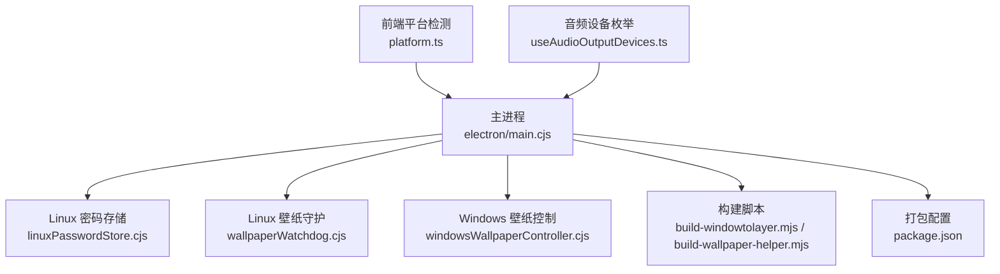
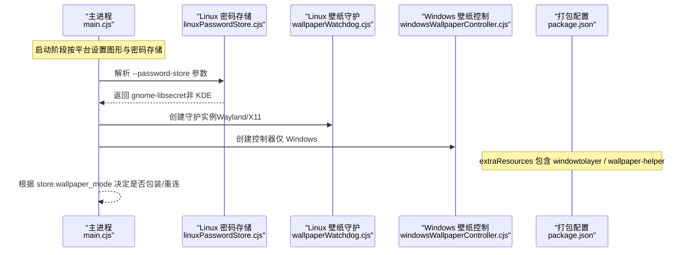
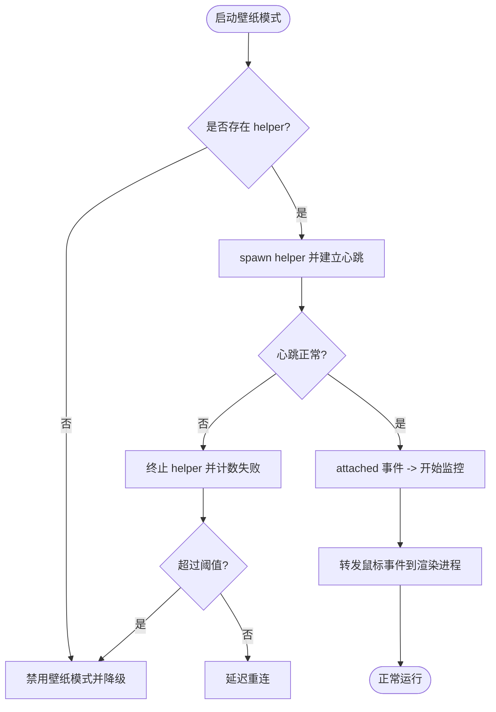
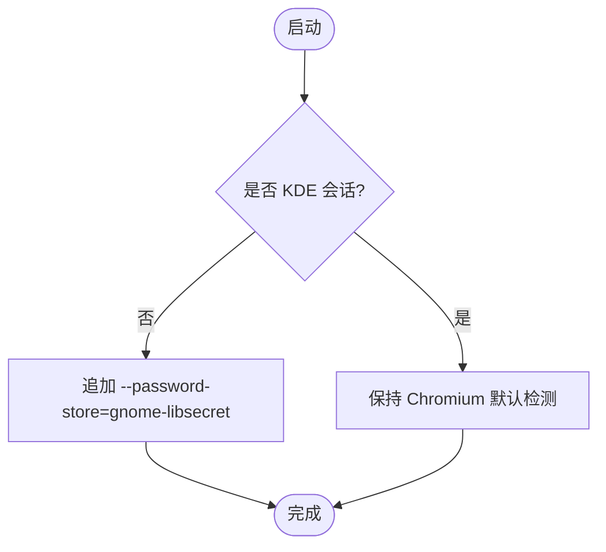
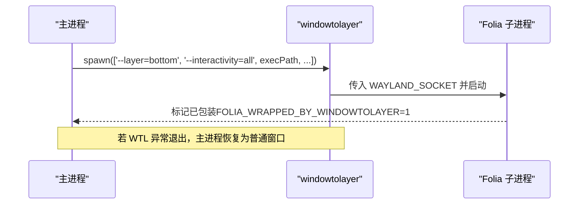
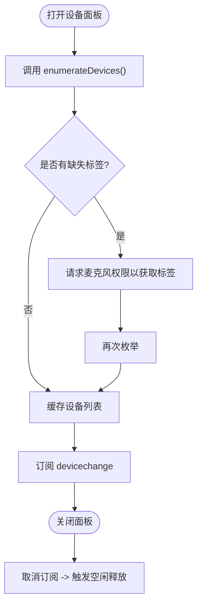
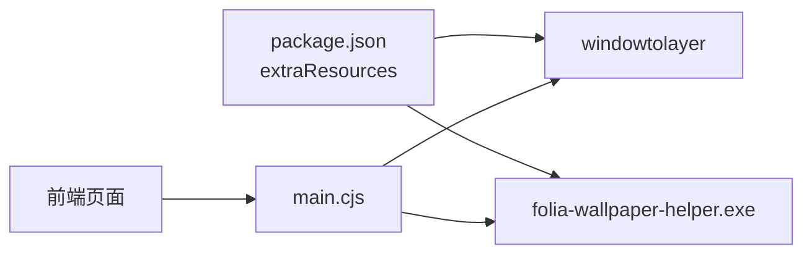

# 平台特定问题

<cite>
**本文引用的文件**
- [electron/main.cjs](file://electron/main.cjs)
- [electron/windowsWallpaperController.cjs](file://electron/windowsWallpaperController.cjs)
- [electron/wallpaperWatchdog.cjs](file://electron/wallpaperWatchdog.cjs)
- [electron/linuxPasswordStore.cjs](file://electron/linuxPasswordStore.cjs)
- [packaging/linux/build-windowtolayer.mjs](file://packaging/linux/build-windowtolayer.mjs)
- [packaging/windows/build-wallpaper-helper.mjs](file://packaging/windows/build-wallpaper-helper.mjs)
- [src/utils/platform.ts](file://src/utils/platform.ts)
- [src/hooks/useAudioOutputDevices.ts](file://src/hooks/useAudioOutputDevices.ts)
- [package.json](file://package.json)
</cite>

## 目录
1. [简介](#简介)
2. [项目结构](#项目结构)
3. [核心组件](#核心组件)
4. [架构总览](#架构总览)
5. [详细组件分析](#详细组件分析)
6. [依赖关系分析](#依赖关系分析)
7. [性能考虑](#性能考虑)
8. [故障排查指南](#故障排查指南)
9. [结论](#结论)
10. [附录](#附录)

## 简介
本文件聚焦 Folia Player 在 Windows、macOS、Linux 三大平台的已知问题与解决方案，覆盖系统权限、文件路径、音频设备、窗口管理与壁纸模式等关键差异。文档基于仓库中的 Electron 主进程实现、平台构建脚本与前端钩子，提供可操作的配置建议、错误诊断步骤与打包注意事项，帮助在不同操作系统上稳定部署与运行。

## 项目结构
围绕平台差异的关键代码分布在以下位置：
- 主进程初始化与平台开关：electron/main.cjs
- Linux 密码存储后端选择：electron/linuxPasswordStore.cjs
- Linux 桌面壁纸模式守护与重启：electron/wallpaperWatchdog.cjs
- Windows 壁纸模式控制器（WorkerW 父子窗口）：electron/windowsWallpaperController.cjs
- Linux/Windows 平台二进制构建脚本：packaging/linux/build-windowtolayer.mjs、packaging/windows/build-wallpaper-helper.mjs
- 前端平台检测与快捷键修饰键映射：src/utils/platform.ts
- 音频输出设备枚举与释放策略：src/hooks/useAudioOutputDevices.ts
- 打包产物与 extraResources 配置：package.json

**图示来源**
- [electron/main.cjs:78-137](file://electron/main.cjs#L78-L137)
- [electron/linuxPasswordStore.cjs:34-47](file://electron/linuxPasswordStore.cjs#L34-L47)
- [electron/wallpaperWatchdog.cjs:15-25](file://electron/wallpaperWatchdog.cjs#L15-L25)
- [electron/windowsWallpaperController.cjs:41-70](file://electron/windowsWallpaperController.cjs#L41-L70)
- [packaging/linux/build-windowtolayer.mjs:53-95](file://packaging/linux/build-windowtolayer.mjs#L53-L95)
- [packaging/windows/build-wallpaper-helper.mjs:25-33](file://packaging/windows/build-wallpaper-helper.mjs#L25-L33)
- [src/utils/platform.ts:6-24](file://src/utils/platform.ts#L6-L24)
- [src/hooks/useAudioOutputDevices.ts:71-85](file://src/hooks/useAudioOutputDevices.ts#L71-L85)
- [package.json:131-179](file://package.json#L131-L179)

**章节来源**
- [electron/main.cjs:78-137](file://electron/main.cjs#L78-L137)
- [package.json:131-179](file://package.json#L131-L179)

## 核心组件
- 主进程平台初始化：根据平台设置图形后端、禁用 Vulkan、启用 Wayland 装饰、为 macOS x64 开启 GPU 光栅化等。
- Linux 密码存储：在非 KDE 桌面强制使用 gnome-libsecret，避免明文 basic_text 导致登录态丢失。
- Linux 壁纸模式：通过 windowtolayer 包装进程，Wayland 下以 wlr-layer-shell 进入桌面层；X11 下以 _NET_WM_WINDOW_TYPE_DESKTOP 类型窗口呈现。
- Windows 壁纸模式：通过 folia-wallpaper-helper.exe 将主窗口父化到 WorkerW 层，支持鼠标输入转发与崩溃循环保护。
- 构建与打包：Linux 侧拉取并编译 windowtolayer 二进制；Windows 侧编译 wallpaper-helper 二进制；两者均作为 extraResources 随应用分发。
- 音频设备枚举：仅在用户打开设备面板时触发 enumerateDevices，并在面板关闭后尽快释放视频捕获服务，减少后台资源占用。

**章节来源**
- [electron/main.cjs:78-137](file://electron/main.cjs#L78-L137)
- [electron/linuxPasswordStore.cjs:34-47](file://electron/linuxPasswordStore.cjs#L34-L47)
- [electron/wallpaperWatchdog.cjs:15-25](file://electron/wallpaperWatchdog.cjs#L15-L25)
- [electron/windowsWallpaperController.cjs:41-70](file://electron/windowsWallpaperController.cjs#L41-L70)
- [packaging/linux/build-windowtolayer.mjs:53-95](file://packaging/linux/build-windowtolayer.mjs#L53-L95)
- [packaging/windows/build-wallpaper-helper.mjs:25-33](file://packaging/windows/build-wallpaper-helper.mjs#L25-L33)
- [src/hooks/useAudioOutputDevices.ts:71-85](file://src/hooks/useAudioOutputDevices.ts#L71-L85)

## 架构总览
下图展示主进程如何根据平台选择不同的壁纸模式与辅助二进制，并与前端交互进行状态同步。

**图示来源**
- [electron/main.cjs:78-137](file://electron/main.cjs#L78-L137)
- [electron/linuxPasswordStore.cjs:34-47](file://electron/linuxPasswordStore.cjs#L34-L47)
- [electron/wallpaperWatchdog.cjs:15-25](file://electron/wallpaperWatchdog.cjs#L15-L25)
- [electron/windowsWallpaperController.cjs:41-70](file://electron/windowsWallpaperController.cjs#L41-L70)
- [package.json:148-156](file://package.json#L148-L156)

## 详细组件分析

### Windows 壁纸模式（WorkerW 父子窗口）
- 问题背景
  - 需要将主窗口嵌入桌面层（WorkerW），以实现“壁纸模式”的点击穿透与层级管理。
  - 不同 Windows 版本存在两种架构：“classic”（Win10/早期 Win11）与“raised”（Win11 24H2+ 分层视图）。
  - 经典模式下透明窗口会丢失渲染表面，需重建为不透明窗口。
- 实现要点
  - 通过外部 Rust 二进制 folia-wallpaper-helper.exe 完成父子窗口操作与事件上报。
  - 主进程维护心跳监控、崩溃循环保护、自动重连与降级逻辑。
  - 鼠标事件由 helper 上报 JSONL 事件，主进程转换为 sendInputEvent 注入 Chromium 输入管线。
- 故障定位
  - 若出现重复失败，模块会记录失败次数并持久化，达到阈值后禁用壁纸模式并通知前端。
  - 当检测到窗口被销毁或 WorkerW 重建，需要重建主窗口并重新 attach。
- 修复与调优
  - 确保额外资源中包含 folia-wallpaper-helper.exe（打包配置）。
  - 开发时可设置环境变量 FOLIA_WALLPAPER_HELPER_PATH 指向自定义二进制。
  - 若透明背景失效，根据 attach 模式重建窗口透明度。

**图示来源**
- [electron/windowsWallpaperController.cjs:106-128](file://electron/windowsWallpaperController.cjs#L106-L128)
- [electron/windowsWallpaperController.cjs:162-172](file://electron/windowsWallpaperController.cjs#L162-L172)
- [electron/windowsWallpaperController.cjs:207-257](file://electron/windowsWallpaperController.cjs#L207-L257)
- [electron/windowsWallpaperController.cjs:259-353](file://electron/windowsWallpaperController.cjs#L259-L353)
- [electron/main.cjs:422-451](file://electron/main.cjs#L422-L451)

**章节来源**
- [electron/windowsWallpaperController.cjs:106-128](file://electron/windowsWallpaperController.cjs#L106-L128)
- [electron/windowsWallpaperController.cjs:162-172](file://electron/windowsWallpaperController.cjs#L162-L172)
- [electron/windowsWallpaperController.cjs:207-257](file://electron/windowsWallpaperController.cjs#L207-L257)
- [electron/windowsWallpaperController.cjs:259-353](file://electron/windowsWallpaperController.cjs#L259-L353)
- [electron/main.cjs:422-451](file://electron/main.cjs#L422-L451)

### Linux 密码存储（libsecret 后端）
- 问题背景
  - Chromium 在未识别的桌面环境（如 Hyprland、sway、i3）会回退到明文 basic_text 存储，导致 KuGou/QQ 等仓库拒绝保存凭据，重启后登录态丢失。
- 解决方案
  - 在主进程启动前，根据 XDG_CURRENT_DESKTOP 判断是否为 KDE 会话；若非 KDE，则显式追加 --password-store=gnome-libsecret。
  - 允许通过环境变量 FOLIA_PASSWORD_STORE 覆盖行为，支持 auto 或不支持的字符串时保持默认检测。
- 兼容性说明
  - KDE 会话保留 Chromium 自身检测，避免 kwallet 中已有凭据被孤立。
  - 若无 Secret Service 响应，Chromium 会报告加密不可用，应用按现有降级逻辑处理。

**图示来源**
- [electron/linuxPasswordStore.cjs:26-47](file://electron/linuxPasswordStore.cjs#L26-L47)
- [electron/main.cjs:78-85](file://electron/main.cjs#L78-L85)

**章节来源**
- [electron/linuxPasswordStore.cjs:26-47](file://electron/linuxPasswordStore.cjs#L26-L47)
- [electron/main.cjs:78-85](file://electron/main.cjs#L78-L85)

### Linux 壁纸模式（windowtolayer 包装）
- 问题背景
  - Wayland 下需要通过 windowtolayer 包装 Folia 子进程，使其进入 wlr-layer-shell 桌面层；X11 下则以 desktop 类型窗口呈现。
  - 若包装进程异常退出，Chromium 可能快速崩溃，需通过守护进程恢复至普通窗口。
- 实现要点
  - 构建脚本在 Linux 主机上拉取 pinned 版本的 windowtolayer 源码，应用补丁并编译二进制。
  - 主进程负责检测是否已包装、是否应禁用壁纸模式、以及何时 relaunch 为普通窗口。
- 故障定位
  - 若连续多次包装启动失败，守护进程会禁用壁纸模式以避免循环。
  - 可通过环境变量 FOLIA_WINDOWTOLAYER_PATH 指定开发路径的二进制。

**图示来源**
- [electron/main.cjs:196-226](file://electron/main.cjs#L196-L226)
- [electron/wallpaperWatchdog.cjs:1-31](file://electron/wallpaperWatchdog.cjs#L1-L31)
- [packaging/linux/build-windowtolayer.mjs:53-95](file://packaging/linux/build-windowtolayer.mjs#L53-L95)

**章节来源**
- [electron/main.cjs:196-226](file://electron/main.cjs#L196-L226)
- [electron/wallpaperWatchdog.cjs:1-31](file://electron/wallpaperWatchdog.cjs#L1-L31)
- [packaging/linux/build-windowtolayer.mjs:53-95](file://packaging/linux/build-windowtolayer.mjs#L53-L95)

### macOS 图形加速与兼容优化
- 问题背景
  - Intel Mac + AMD 独显在 Retina 屏幕下可能出现渲染卡顿。
- 解决方案
  - 针对 macOS x64 架构，启用 ignore-gpu-blocklist、use-angle=gl、enable-gpu-rasterization 以提升渲染性能。
- 注意事项
  - 该优化仅对 macOS x64 生效；其他平台不受影响。

**章节来源**
- [electron/main.cjs:132-137](file://electron/main.cjs#L132-L137)

### 音频设备枚举与释放策略（跨平台）
- 问题背景
  - enumerateDevices() 会同时枚举视频输入并启动视频捕获服务，且不会自动释放，导致后台资源占用与隐私指示器残留。
- 解决方案
  - 仅在用户打开设备面板时执行枚举；面板显示期间订阅 devicechange 以便热插拔刷新，面板卸载时取消订阅以触发空闲释放。
  - 在 Windows/macOS 上启用 ReleaseVideoSourceProviderIfNotInUse 特性，使 Chromium 能在空闲时关闭视频源提供者。
- 平台差异
  - Linux 浏览器无此逃逸机制，因此更强调“按需枚举 + 及时取消订阅”。

**图示来源**
- [src/hooks/useAudioOutputDevices.ts:71-85](file://src/hooks/useAudioOutputDevices.ts#L71-L85)
- [src/hooks/useAudioOutputDevices.ts:112-144](file://src/hooks/useAudioOutputDevices.ts#L112-L144)
- [src/hooks/useAudioOutputDevices.ts:180-204](file://src/hooks/useAudioOutputDevices.ts#L180-L204)
- [electron/main.cjs:118-130](file://electron/main.cjs#L118-L130)

**章节来源**
- [src/hooks/useAudioOutputDevices.ts:71-85](file://src/hooks/useAudioOutputDevices.ts#L71-L85)
- [src/hooks/useAudioOutputDevices.ts:112-144](file://src/hooks/useAudioOutputDevices.ts#L112-L144)
- [src/hooks/useAudioOutputDevices.ts:180-204](file://src/hooks/useAudioOutputDevices.ts#L180-L204)
- [electron/main.cjs:118-130](file://electron/main.cjs#L118-L130)

### 前端平台检测与快捷键修饰键
- 作用
  - 统一判断是否为 macOS，并将声明的 ctrl 快捷键翻译为 Cmd（macOS）或 Ctrl（其他平台），保证 UI 提示与行为一致。
- 使用场景
  - 快捷键提示、组合键判定、跨平台一致性。

**章节来源**
- [src/utils/platform.ts:6-24](file://src/utils/platform.ts#L6-L24)

## 依赖关系分析
- 主进程依赖平台构建产物：
  - Linux：windowtolayer（Rust 二进制）
  - Windows：folia-wallpaper-helper.exe（Rust 二进制）
- 打包配置将上述二进制作为 extraResources 分发，运行时通过环境变量或 resourcesPath 解析路径。
- 前端通过 Electron IPC 与主进程交互，读取设置、切换壁纸模式、获取更新状态等。

**图示来源**
- [package.json:148-156](file://package.json#L148-L156)
- [electron/main.cjs:183-194](file://electron/main.cjs#L183-L194)
- [electron/main.cjs:282-293](file://electron/main.cjs#L282-L293)

**章节来源**
- [package.json:148-156](file://package.json#L148-L156)
- [electron/main.cjs:183-194](file://electron/main.cjs#L183-L194)
- [electron/main.cjs:282-293](file://electron/main.cjs#L282-L293)

## 性能考虑
- Linux 图形模式
  - AppImage 环境下优先使用 SwiftShader 以避免 GPU 崩溃与模糊/透明度问题。
  - 可选择软件渲染（disableHardwareAcceleration）以获得最安全但较慢的体验。
- macOS 图形优化
  - 针对 Intel Mac + AMD 独显启用 GPU 光栅化与 ANGLE GL 后端，缓解 Retina 渲染卡顿。
- 音频设备释放
  - 通过 ReleaseVideoSourceProviderIfNotInUse 与及时取消订阅，降低后台资源占用。

[本节为通用指导，无需具体文件引用]

## 故障排查指南
- Windows 壁纸模式
  - 现象：壁纸模式反复失败或窗口黑屏。
  - 排查：检查心跳超时、helper 进程是否存活、是否达到崩溃循环阈值；查看 attach 模式（classic/raised）是否与当前窗口透明度匹配。
  - 修复：等待自动重连；若持续失败，模块会禁用壁纸模式并降级为普通窗口；必要时重建窗口。
  - 参考路径：[electron/windowsWallpaperController.cjs:106-128](file://electron/windowsWallpaperController.cjs#L106-L128)、[electron/windowsWallpaperController.cjs:162-172](file://electron/windowsWallpaperController.cjs#L162-L172)、[electron/main.cjs:422-451](file://electron/main.cjs#L422-L451)
- Linux 密码存储
  - 现象：KuGou/QQ 登录态每次重启丢失。
  - 排查：确认 XDG_CURRENT_DESKTOP 是否为 KDE；检查是否已追加 --password-store=gnome-libsecret。
  - 修复：在非 KDE 会话强制 libsecret；KDE 会话保持默认检测。
  - 参考路径：[electron/linuxPasswordStore.cjs:26-47](file://electron/linuxPasswordStore.cjs#L26-L47)、[electron/main.cjs:78-85](file://electron/main.cjs#L78-L85)
- Linux 壁纸模式
  - 现象：Wayland 下无法进入壁纸模式或频繁崩溃。
  - 排查：检查 windowtolayer 二进制是否存在、是否成功包装子进程；观察守护进程的包装崩溃计数。
  - 修复：若连续失败，会自动禁用壁纸模式；可设置 FOLIA_WINDOWTOLAYER_PATH 指向开发二进制验证。
  - 参考路径：[electron/main.cjs:196-226](file://electron/main.cjs#L196-L226)、[electron/wallpaperWatchdog.cjs:1-31](file://electron/wallpaperWatchdog.cjs#L1-L31)、[packaging/linux/build-windowtolayer.mjs:53-95](file://packaging/linux/build-windowtolayer.mjs#L53-L95)
- 音频设备
  - 现象：设备列表为空或名称缺失；后台进程未释放。
  - 排查：确认是否在打开面板时才枚举；检查是否已订阅 devicechange；确认 ReleaseVideoSourceProviderIfNotInUse 是否启用。
  - 修复：按需枚举、及时取消订阅；在 Windows/macOS 启用特性以释放视频源。
  - 参考路径：[src/hooks/useAudioOutputDevices.ts:71-85](file://src/hooks/useAudioOutputDevices.ts#L71-L85)、[src/hooks/useAudioOutputDevices.ts:112-144](file://src/hooks/useAudioOutputDevices.ts#L112-L144)、[electron/main.cjs:118-130](file://electron/main.cjs#L118-L130)

**章节来源**
- [electron/windowsWallpaperController.cjs:106-128](file://electron/windowsWallpaperController.cjs#L106-L128)
- [electron/linuxPasswordStore.cjs:26-47](file://electron/linuxPasswordStore.cjs#L26-L47)
- [electron/main.cjs:196-226](file://electron/main.cjs#L196-L226)
- [electron/wallpaperWatchdog.cjs:1-31](file://electron/wallpaperWatchdog.cjs#L1-L31)
- [packaging/linux/build-windowtolayer.mjs:53-95](file://packaging/linux/build-windowtolayer.mjs#L53-L95)
- [src/hooks/useAudioOutputDevices.ts:71-85](file://src/hooks/useAudioOutputDevices.ts#L71-L85)
- [electron/main.cjs:118-130](file://electron/main.cjs#L118-L130)

## 结论
Folia Player 针对不同平台提供了精细化的适配方案：Windows 通过 helper 进程实现壁纸模式与鼠标事件转发；Linux 通过 windowtolayer 包装与 libsecret 后端解决壁纸与密码存储问题；macOS 通过图形后端优化提升渲染性能。结合按需枚举音频设备与守护进程的重启保护，可在多平台上获得稳定体验。部署时应确保额外资源包含必要二进制，并根据平台特性调整图形与密码存储选项。

[本节为总结性内容，无需具体文件引用]

## 附录
- 环境变量与命令开关
  - FOLIA_PASSWORD_STORE：覆盖 Linux 密码存储后端（支持 auto 或受支持的后端名）。
  - FOLIA_WINDOWTOLAYER_PATH：指定 Linux 壁纸包装二进制路径。
  - FOLIA_WALLPAPER_HELPER_PATH：指定 Windows 壁纸 helper 二进制路径。
  - ELECTRON_LINUX_PACKAGED_GRAPHICS：用于 Linux 图形调试模式。
  - FOLIA_LINUX_GRAPHICS_MODE：选择 software/swiftshader/system。
- 打包注意事项
  - Windows：确保 extraResources 包含 folia-wallpaper-helper.exe。
  - Linux：确保构建脚本生成 windowtolayer 二进制并复制到 build 目录。
  - 参考路径：[package.json:148-156](file://package.json#L148-L156)、[packaging/linux/build-windowtolayer.mjs:53-95](file://packaging/linux/build-windowtolayer.mjs#L53-L95)、[packaging/windows/build-wallpaper-helper.mjs:25-33](file://packaging/windows/build-wallpaper-helper.mjs#L25-L33)

**章节来源**
- [package.json:148-156](file://package.json#L148-L156)
- [packaging/linux/build-windowtolayer.mjs:53-95](file://packaging/linux/build-windowtolayer.mjs#L53-L95)
- [packaging/windows/build-wallpaper-helper.mjs:25-33](file://packaging/windows/build-wallpaper-helper.mjs#L25-L33)