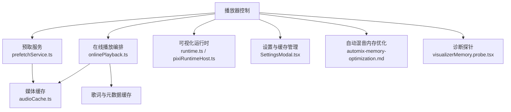
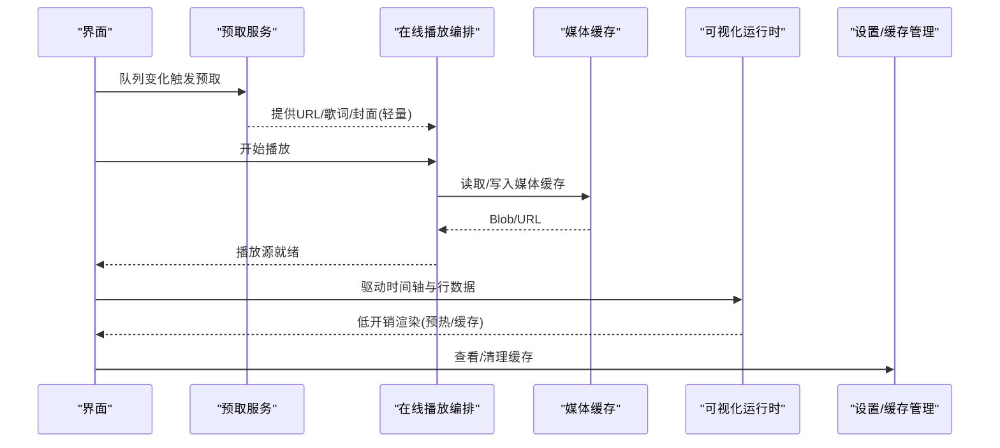
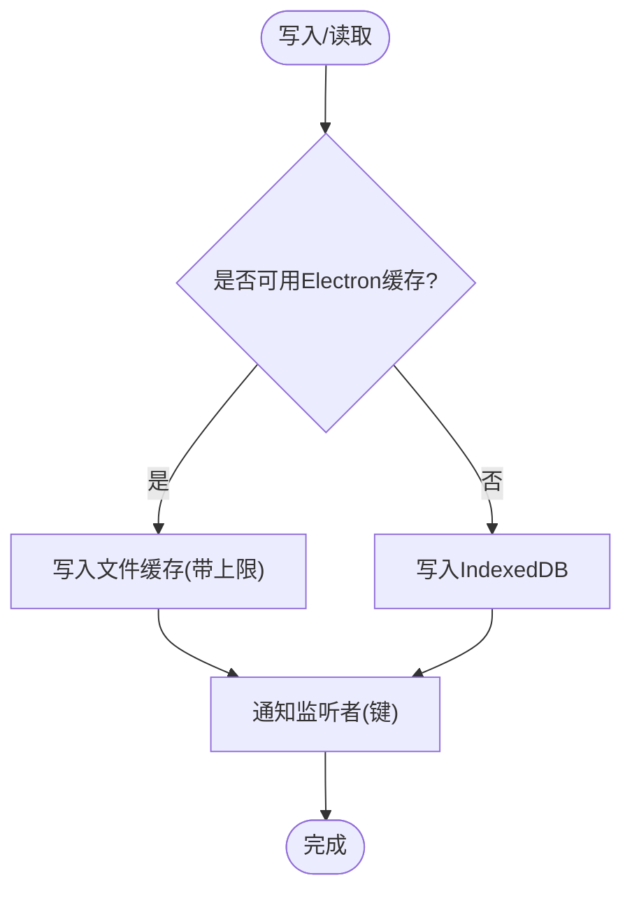
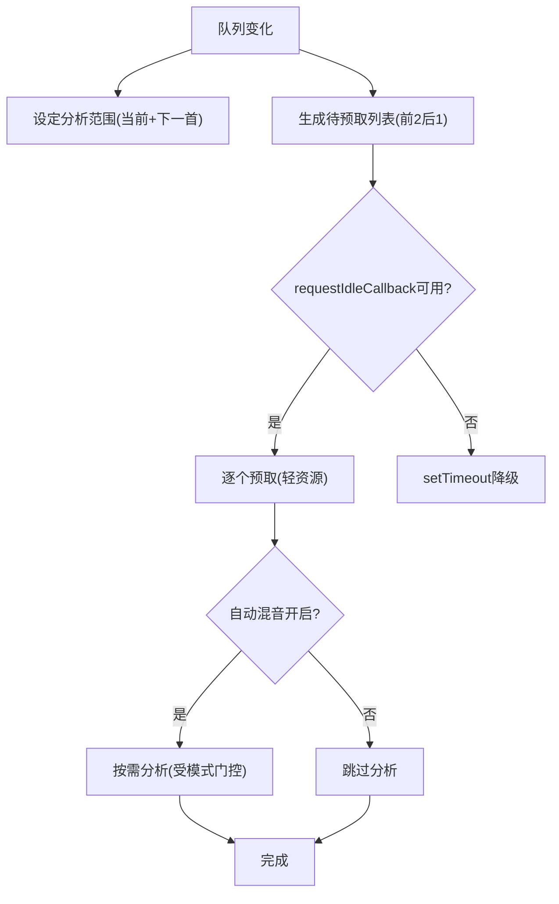
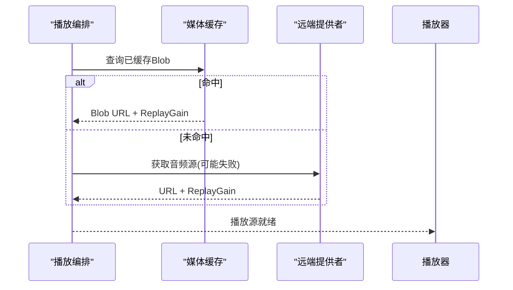
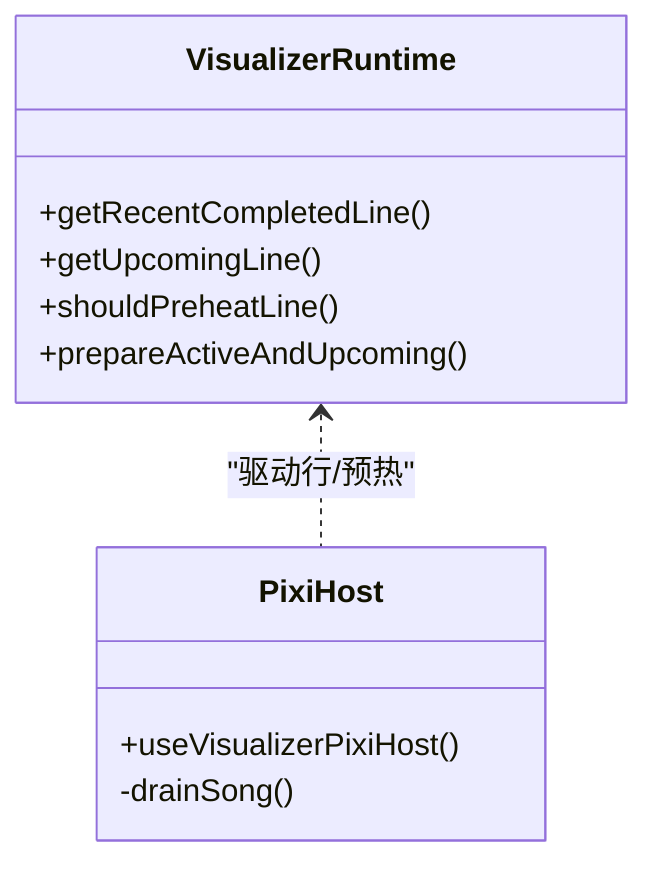
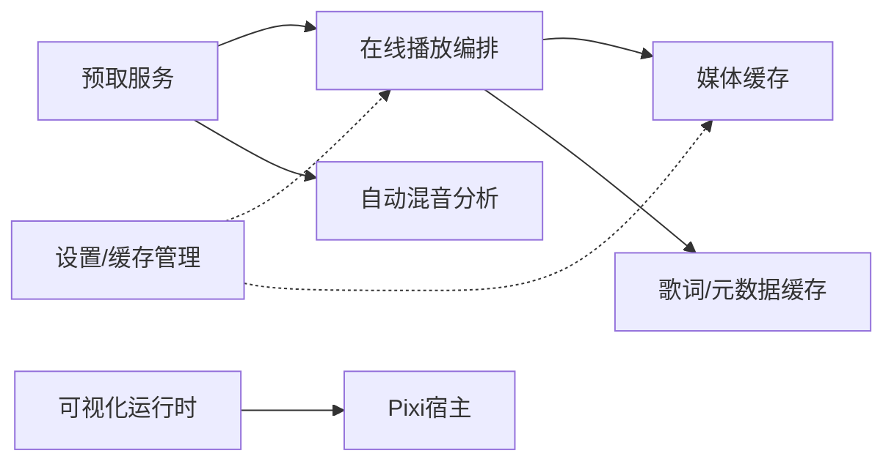

# 性能优化

<cite>
**本文引用的文件**
- [audioCache.ts](file://src/services/audioCache.ts)
- [prefetchService.ts](file://src/services/prefetchService.ts)
- [onlinePlayback.ts](file://src/services/onlinePlayback.ts)
- [runtime.ts](file://src/components/visualizer/runtime.ts)
- [pixiRuntimeHost.ts](file://src/components/visualizer/pixiRuntimeHost.ts)
- [SettingsModal.tsx](file://src/components/modal/SettingsModal.tsx)
- [automix-memory-optimization.md](file://docs/automix-memory-optimization.md)
- [package.json](file://package.json)
- [visualizerMemory.probe.tsx](file://dev/probes/visualizerMemory.probe.tsx)
- [useElectronWindowPlaybackHandoff.ts](file://src/hooks/useElectronWindowPlaybackHandoff.ts)
- [wallpaperWatchdog.cjs](file://electron/wallpaperWatchdog.cjs)
</cite>

## 目录
1. [简介](#简介)
2. [项目结构](#项目结构)
3. [核心组件](#核心组件)
4. [架构总览](#架构总览)
5. [详细组件分析](#详细组件分析)
6. [依赖关系分析](#依赖关系分析)
7. [性能考量](#性能考量)
8. [故障排查指南](#故障排查指南)
9. [结论](#结论)
10. [附录](#附录)

## 简介
本指南面向 Folia Player 的性能优化，聚焦应用性能监控与改进策略：内存泄漏检测、CPU 使用率优化、网络请求优化等关键指标；深入解释音频缓存机制、预加载策略、可视化渲染优化等技术细节；提供性能瓶颈识别工具与调试技巧（浏览器开发者工具、性能分析器、内存快照对比）；给出针对不同硬件配置的优化建议；并解释已知性能问题的根因与解决方案（例如在线歌曲 seek 卡顿）。

## 项目结构
Folia Player 在播放链路中采用“预取 + 缓存 + 按需分析”的分层设计：
- 预取层：提前为前后曲目准备轻量资源（URL、歌词、封面），避免切换时的冷启动。
- 缓存层：媒体与歌词落盘（IndexedDB/Electron 文件缓存），支持迁移与容量限制。
- 播放层：优先命中缓存或预取结果，必要时再走远端获取。
- 可视化层：Pixi/Canvas 运行时复用、行级预热、布局缓存，降低重绘与重建成本。
- 诊断与配置：内置探针、设置页缓存用量展示与清理入口、自动化混音内存优化文档。

图表来源
- [prefetchService.ts:1-544](file://src/services/prefetchService.ts#L1-L544)
- [onlinePlayback.ts:1-254](file://src/services/onlinePlayback.ts#L1-L254)
- [audioCache.ts:1-121](file://src/services/audioCache.ts#L1-L121)
- [runtime.ts:1-158](file://src/components/visualizer/runtime.ts#L1-L158)
- [pixiRuntimeHost.ts:1-144](file://src/components/visualizer/pixiRuntimeHost.ts#L1-L144)
- [SettingsModal.tsx:703-786](file://src/components/modal/SettingsModal.tsx#L703-L786)
- [automix-memory-optimization.md:1-140](file://docs/automix-memory-optimization.md#L1-L140)
- [visualizerMemory.probe.tsx:1-181](file://dev/probes/visualizerMemory.probe.tsx#L1-L181)

章节来源
- [prefetchService.ts:1-544](file://src/services/prefetchService.ts#L1-L544)
- [onlinePlayback.ts:1-254](file://src/services/onlinePlayback.ts#L1-L254)
- [audioCache.ts:1-121](file://src/services/audioCache.ts#L1-L121)
- [runtime.ts:1-158](file://src/components/visualizer/runtime.ts#L1-L158)
- [pixiRuntimeHost.ts:1-144](file://src/components/visualizer/pixiRuntimeHost.ts#L1-L144)
- [SettingsModal.tsx:703-786](file://src/components/modal/SettingsModal.tsx#L703-L786)
- [automix-memory-optimization.md:1-140](file://docs/automix-memory-optimization.md#L1-L140)
- [visualizerMemory.probe.tsx:1-181](file://dev/probes/visualizerMemory.probe.tsx#L1-L181)

## 核心组件
- 预取服务：维护“前2后1”的轻量资源窗口，URL 有效期 20 分钟，按队列变化触发空闲回调执行，避免阻塞主线程。
- 在线播放编排：优先从媒体缓存/预取结果获取 URL，否则走远端；回填 ReplayGain 并更新预取缓存。
- 媒体缓存：Electron 优先写入文件缓存（可设上限），回退到 IndexedDB；写后通知监听者用于后续分析。
- 可视化运行时：计算当前/下一行、预热窗口、最近完成行；Pixi 宿主将运行时创建与换歌解耦，避免频繁销毁 WebGL。
- 设置与缓存管理：展示分类缓存占用，支持按类清理与全部清理，支持选择缓存目录（桌面端）。
- 自动混音内存优化：通过 Python sidecar 运行 htdemucs，关闭 ORT 内存复用，峰值显著下降且输出一致。

章节来源
- [prefetchService.ts:24-39](file://src/services/prefetchService.ts#L24-L39)
- [prefetchService.ts:108-154](file://src/services/prefetchService.ts#L108-L154)
- [prefetchService.ts:405-493](file://src/services/prefetchService.ts#L405-L493)
- [onlinePlayback.ts:17-63](file://src/services/onlinePlayback.ts#L17-L63)
- [audioCache.ts:5-13](file://src/services/audioCache.ts#L5-L13)
- [audioCache.ts:39-81](file://src/services/audioCache.ts#L39-L81)
- [audioCache.ts:100-121](file://src/services/audioCache.ts#L100-L121)
- [runtime.ts:35-120](file://src/components/visualizer/runtime.ts#L35-L120)
- [pixiRuntimeHost.ts:37-144](file://src/components/visualizer/pixiRuntimeHost.ts#L37-L144)
- [SettingsModal.tsx:737-786](file://src/components/modal/SettingsModal.tsx#L737-L786)
- [automix-memory-optimization.md:21-85](file://docs/automix-memory-optimization.md#L21-L85)

## 架构总览
下图展示了播放时关键路径：预取 → 在线播放 → 媒体缓存 → 可视化渲染，以及设置与诊断的支撑作用。

图表来源
- [prefetchService.ts:405-493](file://src/services/prefetchService.ts#L405-L493)
- [onlinePlayback.ts:17-63](file://src/services/onlinePlayback.ts#L17-L63)
- [audioCache.ts:39-81](file://src/services/audioCache.ts#L39-L81)
- [runtime.ts:103-120](file://src/components/visualizer/runtime.ts#L103-L120)
- [SettingsModal.tsx:737-786](file://src/components/modal/SettingsModal.tsx#L737-L786)

## 详细组件分析

### 音频缓存机制（媒体缓存）
- 优先级：Electron 文件缓存 > IndexedDB；写后统一通知监听者，供后续分析流程消费。
- 容量控制：可从设置读取 GB 级上限，写入时传入以触发修剪。
- 迁移：首次读取 IndexedDB 成功后尝试迁移至 Electron 缓存并清理旧条目。
- 兼容性：非 Electron 环境直接回退到 IndexedDB。

图表来源
- [audioCache.ts:5-13](file://src/services/audioCache.ts#L5-L13)
- [audioCache.ts:39-81](file://src/services/audioCache.ts#L39-L81)
- [audioCache.ts:100-121](file://src/services/audioCache.ts#L100-L121)

章节来源
- [audioCache.ts:5-13](file://src/services/audioCache.ts#L5-L13)
- [audioCache.ts:39-81](file://src/services/audioCache.ts#L39-L81)
- [audioCache.ts:100-121](file://src/services/audioCache.ts#L100-L121)

### 预加载策略（预取服务）
- 窗口大小：向前2首、向后1首，仅预取轻量资源（URL、歌词、封面）。
- URL 过期：默认 20 分钟 TTL，过期则标记失效并在下次读取时重新解析。
- 质量匹配：若指定音质不匹配，丢弃缓存 URL，保留歌词/封面。
- 非阻塞调度：使用 requestIdleCallback 串行执行，队列变化时取消并重置分析范围。
- 自动混音分析：仅在开启时进行，且受“模式是否需要节拍网格”门控，避免无谓解码。

图表来源
- [prefetchService.ts:24-39](file://src/services/prefetchService.ts#L24-L39)
- [prefetchService.ts:108-154](file://src/services/prefetchService.ts#L108-L154)
- [prefetchService.ts:405-493](file://src/services/prefetchService.ts#L405-L493)
- [prefetchService.ts:46-72](file://src/services/prefetchService.ts#L46-L72)

章节来源
- [prefetchService.ts:24-39](file://src/services/prefetchService.ts#L24-L39)
- [prefetchService.ts:108-154](file://src/services/prefetchService.ts#L108-L154)
- [prefetchService.ts:405-493](file://src/services/prefetchService.ts#L405-L493)
- [prefetchService.ts:46-72](file://src/services/prefetchService.ts#L46-L72)

### 在线播放编排（seek 卡顿治理）
- 播放源选择：优先媒体缓存 Blob URL → 预取有效 URL → 远端获取。
- ReplayGain：从缓存恢复或远端返回，确保音量一致性。
- 歌词加载：优先本地/预取，必要时异步最佳匹配，但不会阻塞音频释放，避免切歌静音。
- 失败处理：远端不可用时快速降级，减少卡顿。

图表来源
- [onlinePlayback.ts:17-63](file://src/services/onlinePlayback.ts#L17-L63)
- [onlinePlayback.ts:72-158](file://src/services/onlinePlayback.ts#L72-L158)
- [onlinePlayback.ts:159-254](file://src/services/onlinePlayback.ts#L159-L254)

章节来源
- [onlinePlayback.ts:17-63](file://src/services/onlinePlayback.ts#L17-L63)
- [onlinePlayback.ts:72-158](file://src/services/onlinePlayback.ts#L72-L158)
- [onlinePlayback.ts:159-254](file://src/services/onlinePlayback.ts#L159-L254)

### 可视化渲染优化
- 行级预热：根据“领先时间窗口”决定是否预热下一行，减少首帧延迟。
- 最近完成行：在无活跃行时显示最后一行翻译，提升观感连续性。
- Pixi 宿主：运行时一次创建，换歌通过 swap 原地替换，避免销毁重建 WebGL 上下文导致的掉帧。
- 布局缓存：歌词排版结果缓存并按 LRU 限制大小，降低重复计算。

图表来源
- [runtime.ts:35-120](file://src/components/visualizer/runtime.ts#L35-L120)
- [pixiRuntimeHost.ts:37-144](file://src/components/visualizer/pixiRuntimeHost.ts#L37-L144)

章节来源
- [runtime.ts:35-120](file://src/components/visualizer/runtime.ts#L35-L120)
- [pixiRuntimeHost.ts:37-144](file://src/components/visualizer/pixiRuntimeHost.ts#L37-L144)

### 自动混音内存优化
- 根因：htdemucs 单次推理期间 ONNX Runtime 内存复用池导致峰值过高。
- 方案：切换到 Python sidecar 运行 htdemucs，关闭 enable_mem_reuse，峰值降至 ~1GB 以下，输出逐比特一致。
- 影响面：仅影响人声分离路径，beat_this 仍走 WebGPU，不受影响。

章节来源
- [automix-memory-optimization.md:21-85](file://docs/automix-memory-optimization.md#L21-L85)
- [automix-memory-optimization.md:108-118](file://docs/automix-memory-optimization.md#L108-L118)

### 设置与缓存管理
- 缓存用量：按类别（播放列表、歌词、封面、媒体、分析）统计并格式化显示。
- 清理能力：按类清理与一键清理，清理后刷新用量。
- 桌面端扩展：可选择缓存目录，便于放置到高速磁盘。

章节来源
- [SettingsModal.tsx:737-786](file://src/components/modal/SettingsModal.tsx#L737-L786)

## 依赖关系分析
- 预取服务依赖在线播放编排提供的“安全 URL”转换与“资源键”生成，同时向自动混音模块暴露“分析范围”。
- 在线播放编排依赖媒体缓存与预取结果，形成“缓存优先、远端兜底”的播放路径。
- 可视化运行时与 Pixi 宿主解耦：运行时负责行计算与预热，宿主负责生命周期与场景交换。
- 设置与缓存管理独立于播放链路，通过 IPC 与 Electron 交互，提供用户可控的容量与清理能力。

图表来源
- [prefetchService.ts:405-493](file://src/services/prefetchService.ts#L405-L493)
- [onlinePlayback.ts:17-63](file://src/services/onlinePlayback.ts#L17-L63)
- [audioCache.ts:39-81](file://src/services/audioCache.ts#L39-L81)
- [runtime.ts:103-120](file://src/components/visualizer/runtime.ts#L103-L120)
- [pixiRuntimeHost.ts:37-144](file://src/components/visualizer/pixiRuntimeHost.ts#L37-L144)
- [SettingsModal.tsx:737-786](file://src/components/modal/SettingsModal.tsx#L737-L786)

章节来源
- [prefetchService.ts:405-493](file://src/services/prefetchService.ts#L405-L493)
- [onlinePlayback.ts:17-63](file://src/services/onlinePlayback.ts#L17-L63)
- [audioCache.ts:39-81](file://src/services/audioCache.ts#L39-L81)
- [runtime.ts:103-120](file://src/components/visualizer/runtime.ts#L103-L120)
- [pixiRuntimeHost.ts:37-144](file://src/components/visualizer/pixiRuntimeHost.ts#L37-L144)
- [SettingsModal.tsx:737-786](file://src/components/modal/SettingsModal.tsx#L737-L786)

## 性能考量
- 内存
  - 自动混音：通过 Python sidecar 关闭 ORT 内存复用，峰值显著下降且输出一致。
  - 可视化：Pixi 宿主避免频繁销毁重建；歌词布局缓存限制大小；探针可用于长测稳态占用。
  - 媒体缓存：设置上限并定期清理，避免 IndexedDB 膨胀。
- CPU
  - 预取：使用空闲回调串行执行，避免阻塞主线程；队列变化时及时中止旧任务。
  - 自动混音：仅在需要时分析，且受模式门控；分析范围限定在当前与下一首。
- 网络
  - 预取：URL 有效期 20 分钟，避免重复解析；音质不匹配时只丢弃 URL，保留其他资源。
  - 播放：优先缓存与预取，失败快速降级，减少重试风暴。
- 渲染
  - 行级预热与最近完成行显示，减少首帧等待与空白。
  - 背景色/封面颜色预读，避免切换时的色彩跳变。
- 设备差异
  - 弱机：降低可视化特效、关闭自动混音或限制分析范围。
  - 强机：可开启更重的视觉效果与更大预取窗口。

[本节为通用指导，不直接分析具体文件]

## 故障排查指南
- 在线歌曲 seek 卡顿
  - 现象：拖动进度条时出现卡顿或短暂停顿。
  - 根因：seek 可能触发新的缓冲与解码；若未命中缓存/预取，需重新拉取与解析。
  - 解决：
    - 启用媒体缓存与合理上限，确保常用曲目命中。
    - 保持预取窗口打开，使前后曲目资源就绪。
    - 检查远端可用性，必要时降级或提示。
  - 参考实现路径：
    - [onlinePlayback.ts:17-63](file://src/services/onlinePlayback.ts#L17-L63)
    - [prefetchService.ts:108-154](file://src/services/prefetchService.ts#L108-L154)
    - [audioCache.ts:39-81](file://src/services/audioCache.ts#L39-L81)
- 内存泄漏检测
  - 方法：使用浏览器“性能”面板录制 + “内存”快照对比（Heap Snapshot），关注 DOM 节点、事件监听器、定时器与 Worker 对象。
  - 结合探针：使用可视化内存探针长时间运行，观察稳态占用与增长趋势。
  - 参考：
    - [visualizerMemory.probe.tsx:1-181](file://dev/probes/visualizerMemory.probe.tsx#L1-L181)
    - [package.json:35-42](file://package.json#L35-L42)
- CPU 使用率优化
  - 方法：性能面板火焰图定位热点函数；检查是否有密集同步计算阻塞主线程。
  - 实践：预取使用空闲回调；动画与渲染尽量走合成层；避免每帧大对象分配。
- 网络请求优化
  - 方法：网络面板查看请求耗时与失败率；对远端错误做退避与降级。
  - 实践：预取 URL 带 TTL；音质不匹配时只丢弃 URL；失败快速回退。
- 进程稳定性（Electron）
  - 方法：观察子进程存活与健康检查；异常时恢复窗口状态。
  - 参考：
    - [wallpaperWatchdog.cjs:95-134](file://electron/wallpaperWatchdog.cjs#L95-L134)

章节来源
- [onlinePlayback.ts:17-63](file://src/services/onlinePlayback.ts#L17-L63)
- [prefetchService.ts:108-154](file://src/services/prefetchService.ts#L108-L154)
- [audioCache.ts:39-81](file://src/services/audioCache.ts#L39-L81)
- [visualizerMemory.probe.tsx:1-181](file://dev/probes/visualizerMemory.probe.tsx#L1-L181)
- [package.json:35-42](file://package.json#L35-L42)
- [wallpaperWatchdog.cjs:95-134](file://electron/wallpaperWatchdog.cjs#L95-L134)

## 结论
Folia Player 通过“预取 + 缓存 + 可视化优化 + 自动混音内存优化”的组合策略，显著降低了切换卡顿与内存峰值。实践中应：
- 始终启用媒体缓存并设置合理上限；
- 保持预取窗口与 URL 有效期策略；
- 针对设备能力调整可视化与自动混音强度；
- 使用内置探针与开发者工具持续观测与回归验证。

[本节为总结性内容，不直接分析具体文件]

## 附录
- 常用命令
  - 可视化内存探针：npm run manual:visualizer-memory
  - 参考脚本定义：
    - [package.json:35-42](file://package.json#L35-L42)
- 会话恢复与状态复位
  - 窗口切换/恢复时清空临时状态，避免残留引用导致内存增长。
  - 参考：
    - [useElectronWindowPlaybackHandoff.ts:260-291](file://src/hooks/useElectronWindowPlaybackHandoff.ts#L260-L291)

章节来源
- [package.json:35-42](file://package.json#L35-L42)
- [useElectronWindowPlaybackHandoff.ts:260-291](file://src/hooks/useElectronWindowPlaybackHandoff.ts#L260-L291)