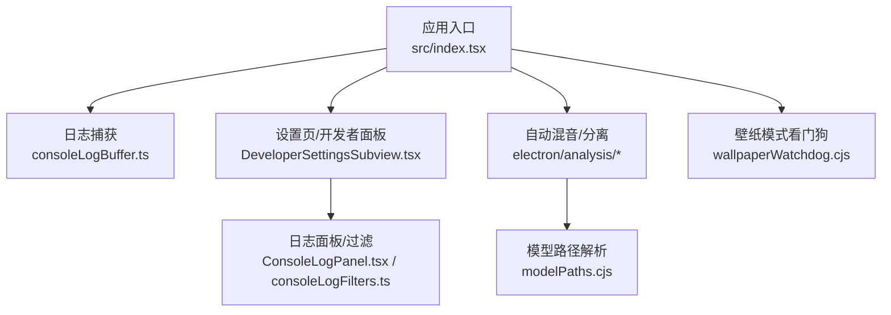
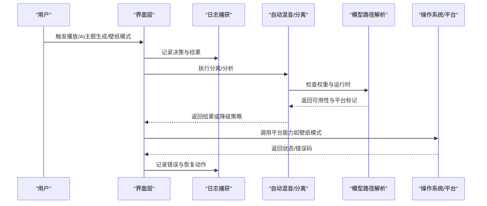
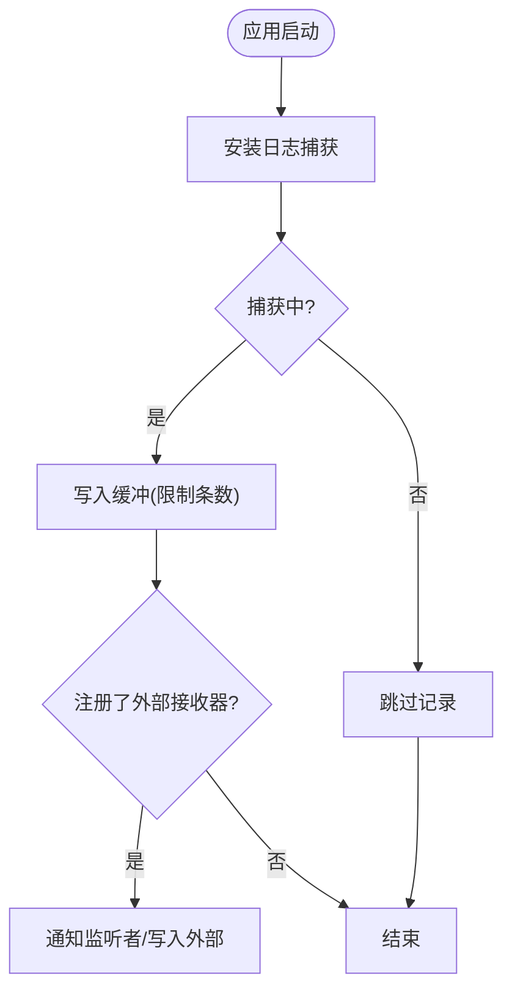
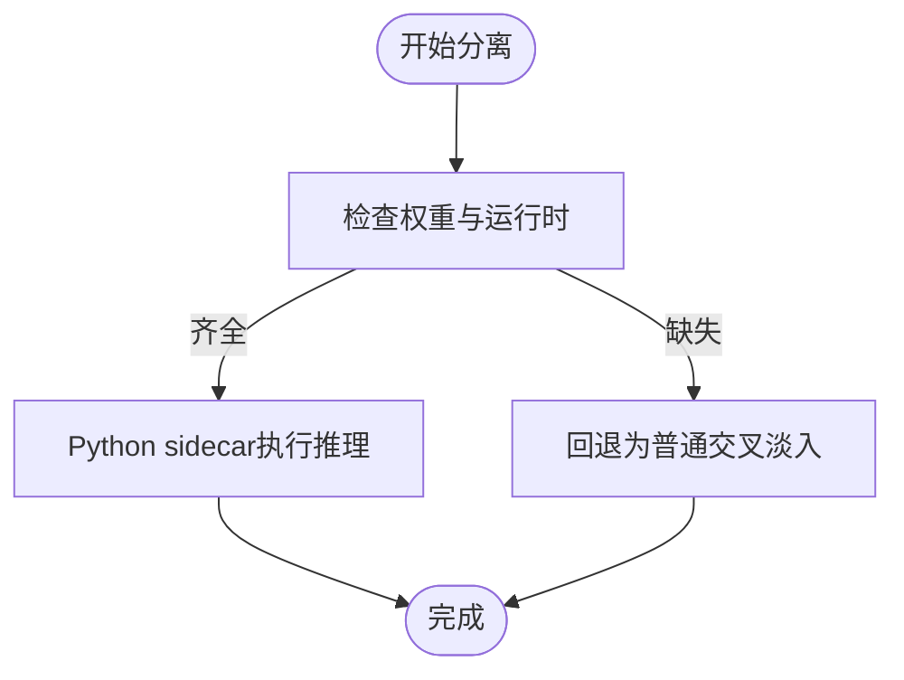
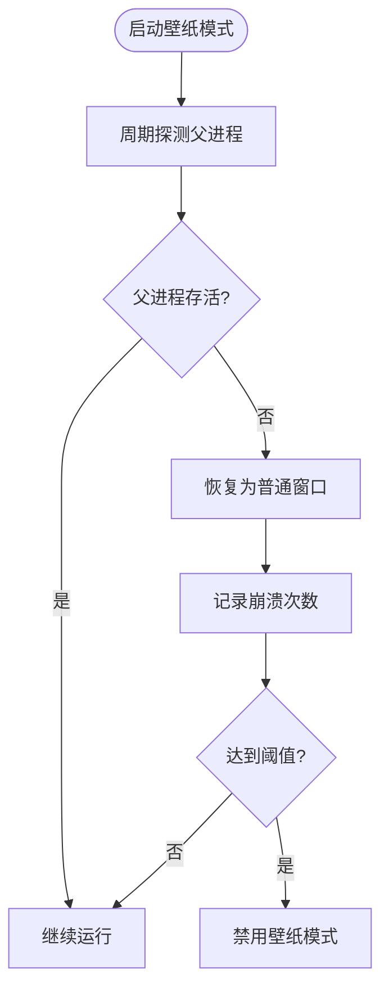
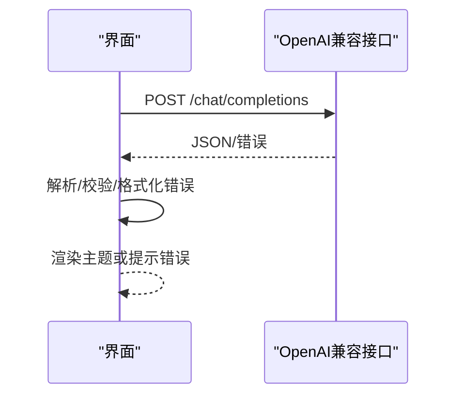
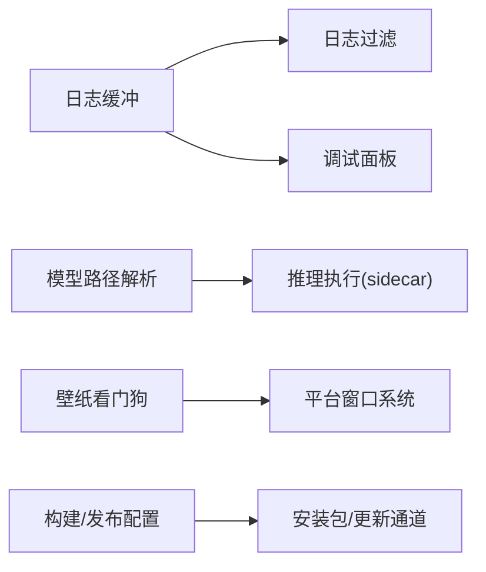

# 故障排除

<cite>
**本文引用的文件**
- [README.md](file://README.md)
- [docs/client-logging.md](file://docs/client-logging.md)
- [src/utils/consoleLogBuffer.ts](file://src/utils/consoleLogBuffer.ts)
- [src/utils/consoleLogFilters.ts](file://src/utils/consoleLogFilters.ts)
- [docs/automix-memory-optimization.md](file://docs/automix-memory-optimization.md)
- [electron/analysis/modelPaths.cjs](file://electron/analysis/modelPaths.cjs)
- [electron/wallpaperWatchdog.cjs](file://electron/wallpaperWatchdog.cjs)
- [docs/technical.md](file://docs/technical.md)
- [package.json](file://package.json)
- [worker/generate-theme_openai.ts](file://worker/generate-theme_openai.ts)
- [src/services/binaryAssetStore.ts](file://src/services/binaryAssetStore.ts)
</cite>

## 目录
1. [简介](#简介)
2. [项目结构](#项目结构)
3. [核心组件](#核心组件)
4. [架构总览](#架构总览)
5. [详细组件分析](#详细组件分析)
6. [依赖关系分析](#依赖关系分析)
7. [性能注意事项](#性能注意事项)
8. [故障排除指南](#故障排除指南)
9. [结论](#结论)
10. [附录](#附录)

## 简介
本指南面向Folia Player用户与技术支持人员，聚焦安装失败、播放异常、网络连接、性能问题等典型故障的诊断与修复；系统说明日志收集与分析工具（控制台日志缓冲、错误过滤、调试信息输出）；给出内存泄漏检测、CPU使用优化、网络请求优化的排查与改进建议；提供Windows、macOS、Linux平台特定问题的定位与修复方法；解释常见错误代码与异常信息的含义；并汇总社区支持资源。

## 项目结构
Folia Player采用Electron桌面端与Web端双形态，前端基于React/Vite，后端通过可选的同步服务与第三方音乐API集成。关键排障相关能力集中在：
- 客户端日志采集与面板：用于记录并展示运行期日志，便于复现与上报
- 自动混音（Automix）内存优化：针对人声分离推理的内存峰值治理
- 模型与运行时路径解析：确保AI分离功能在可用平台上正确加载
- 壁纸模式看门狗：Linux下窗口包装进程崩溃恢复机制
- 平台构建与发布脚本：打包产物与更新通道配置

**图示来源**
- [src/utils/consoleLogBuffer.ts:1-178](file://src/utils/consoleLogBuffer.ts#L1-L178)
- [src/utils/consoleLogFilters.ts:1-60](file://src/utils/consoleLogFilters.ts#L1-L60)
- [electron/analysis/modelPaths.cjs:1-118](file://electron/analysis/modelPaths.cjs#L1-L118)
- [electron/wallpaperWatchdog.cjs:95-186](file://electron/wallpaperWatchdog.cjs#L95-L186)

**章节来源**
- [docs/client-logging.md:1-83](file://docs/client-logging.md#L1-L83)
- [docs/technical.md:1-273](file://docs/technical.md#L1-L273)

## 核心组件
- 客户端日志系统：在应用启动早期安装日志捕获，拦截console与未处理异常，保留最近约1000行，支持按模块/级别过滤与复制导出，便于问题复现与上报。
- 自动混音内存优化：将htdemucs人声分离推理迁移到Python sidecar，关闭ORT内存复用，显著降低峰值内存占用并保持输出一致。
- 模型与运行时管理：按平台解析模型权重与运行时可用性，避免在不支持的平台暴露不可用能力。
- 壁纸模式看门狗：在Linux下监控父进程存活，异常时回退为普通窗口，防止壁纸模式死循环。
- 封面缓存清理：提供跨环境（Electron桥或OPFS）的封面缓存用量查询与清理接口，辅助释放磁盘空间。

**章节来源**
- [docs/client-logging.md:1-83](file://docs/client-logging.md#L1-L83)
- [docs/automix-memory-optimization.md:1-140](file://docs/automix-memory-optimization.md#L1-L140)
- [electron/analysis/modelPaths.cjs:1-118](file://electron/analysis/modelPaths.cjs#L1-L118)
- [electron/wallpaperWatchdog.cjs:95-186](file://electron/wallpaperWatchdog.cjs#L95-L186)
- [src/services/binaryAssetStore.ts:140-173](file://src/services/binaryAssetStore.ts#L140-L173)

## 架构总览
下图展示了从用户操作到日志、AI推理、平台适配的关键路径，以及错误与恢复机制。

**图示来源**
- [src/utils/consoleLogBuffer.ts:1-178](file://src/utils/consoleLogBuffer.ts#L1-L178)
- [electron/analysis/modelPaths.cjs:1-118](file://electron/analysis/modelPaths.cjs#L1-L118)
- [electron/wallpaperWatchdog.cjs:95-186](file://electron/wallpaperWatchdog.cjs#L95-L186)

## 详细组件分析

### 客户端日志系统
- 作用：在桌面打包环境下无控制台时，仍可通过内置面板查看日志；默认开启，支持全局开关与持久化过滤。
- 关键点：
  - 安装时机：应用尽早安装，否则早期日志无法记录
  - 格式规范：以[模块名]前缀标注来源，便于分组与屏蔽
  - 错误捕获：同时捕获window error与unhandledrejection
  - 面板能力：搜索、按级别/模块筛选、选择复制、清空
- 常见问题：
  - 看不到日志：确认已启用日志捕获；检查是否过早退出导致未安装
  - 日志过多：使用模块/级别过滤，屏蔽高频噪声
  - 无法复制：仅复制可见范围，先缩小视图再复制

**图示来源**
- [src/utils/consoleLogBuffer.ts:1-178](file://src/utils/consoleLogBuffer.ts#L1-L178)
- [src/utils/consoleLogFilters.ts:1-60](file://src/utils/consoleLogFilters.ts#L1-L60)

**章节来源**
- [docs/client-logging.md:1-83](file://docs/client-logging.md#L1-L83)
- [src/utils/consoleLogBuffer.ts:1-178](file://src/utils/consoleLogBuffer.ts#L1-L178)
- [src/utils/consoleLogFilters.ts:1-60](file://src/utils/consoleLogFilters.ts#L1-L60)

### 自动混音内存优化（htdemucs）
- 背景：htdemucs单次推理存在较大内存峰值，主要来源于ORT内存复用池。
- 方案：关闭enable_mem_reuse，并将推理迁移至Python sidecar，保持输出逐比特一致。
- 效果：峰值内存显著下降，且不影响质量；对弱机更友好。
- 验收要点：分离质量不降、beat_this截止期不受影响、换歌不掉帧、弱机兼容。

**图示来源**
- [docs/automix-memory-optimization.md:1-140](file://docs/automix-memory-optimization.md#L1-L140)
- [electron/analysis/modelPaths.cjs:1-118](file://electron/analysis/modelPaths.cjs#L1-L118)

**章节来源**
- [docs/automix-memory-optimization.md:1-140](file://docs/automix-memory-optimization.md#L1-L140)
- [electron/analysis/modelPaths.cjs:1-118](file://electron/analysis/modelPaths.cjs#L1-L118)

### 壁纸模式看门狗（Linux）
- 作用：当包装进程（wtl）崩溃或父进程变化时，自动回退为普通窗口，避免壁纸模式死循环。
- 机制：周期性探测父进程存活；统计连续包装崩溃次数，超过阈值则禁用壁纸模式。
- 适用场景：Linux Wayland/Hyprland等环境下窗口包装不稳定时的自愈。

**图示来源**
- [electron/wallpaperWatchdog.cjs:95-186](file://electron/wallpaperWatchdog.cjs#L95-L186)

**章节来源**
- [electron/wallpaperWatchdog.cjs:95-186](file://electron/wallpaperWatchdog.cjs#L95-L186)

### AI主题生成（OpenAI兼容接口）
- 流程：构造请求体（含schema），发送POST请求，解析响应内容，必要时格式化错误信息。
- 错误处理：非JSON响应保留原样；结构化输出失败时抛出明确错误；服务端错误包含状态码与摘要。
- 调优：温度参数校验与默认值；根据提供商选择结构化输出或json_object。

**图示来源**
- [worker/generate-theme_openai.ts:70-314](file://worker/generate-theme_openai.ts#L70-L314)
- [worker/generate-theme_openai.ts:344-412](file://worker/generate-theme_openai.ts#L344-L412)

**章节来源**
- [worker/generate-theme_openai.ts:70-314](file://worker/generate-theme_openai.ts#L70-L314)
- [worker/generate-theme_openai.ts:344-412](file://worker/generate-theme_openai.ts#L344-L412)

## 依赖关系分析
- 日志系统依赖：consoleLogBuffer负责捕获与存储，consoleLogFilters负责持久化过滤策略，两者共同支撑调试面板。
- 自动混音依赖：modelPaths决定权重与运行时可用性，sidecar实现推理执行，保证平台差异下的稳定回退。
- 平台能力依赖：壁纸模式依赖Linux窗口系统行为，看门狗保障异常恢复。
- 构建与发布：package.json定义构建目标与发布渠道，影响安装包内容与更新行为。

**图示来源**
- [src/utils/consoleLogBuffer.ts:1-178](file://src/utils/consoleLogBuffer.ts#L1-L178)
- [src/utils/consoleLogFilters.ts:1-60](file://src/utils/consoleLogFilters.ts#L1-L60)
- [electron/analysis/modelPaths.cjs:1-118](file://electron/analysis/modelPaths.cjs#L1-L118)
- [electron/wallpaperWatchdog.cjs:95-186](file://electron/wallpaperWatchdog.cjs#L95-L186)
- [package.json:43-74](file://package.json#L43-L74)

**章节来源**
- [package.json:43-74](file://package.json#L43-L74)

## 性能注意事项
- 内存峰值治理：优先关闭ORT内存复用并迁移至Python sidecar，避免单段推理造成的高峰值。
- CPU使用优化：合理调度分离任务，避免与可视化器争抢GPU/CPU；必要时降低并发或分段长度。
- 网络请求优化：对AI主题生成等远程调用增加超时与重试策略；对音乐API进行缓存与去重。
- 缓存清理：定期清理封面缓存，减少磁盘占用；在Electron桥或OPFS环境下统一清理逻辑。

[本节为通用指导，无需具体文件引用]

## 故障排除指南

### 安装失败
- 现象：安装包无法安装、更新失败、构建产物不完整。
- 可能原因：
  - 平台不支持或权限不足
  - 网络代理/证书问题导致下载失败
  - 构建脚本依赖缺失（如Linux壁纸模式二进制）
- 诊断步骤：
  - 检查包管理器日志与系统权限
  - 确认网络可达与代理配置
  - 重新执行构建脚本，关注报错输出
- 处理建议：
  - 使用官方Releases安装包
  - 企业代理环境可参考构建脚本绕过SSL验证
  - Linux首次联调壁纸模式需先构建windowtolayer

**章节来源**
- [docs/technical.md:1-273](file://docs/technical.md#L1-L273)
- [package.json:43-74](file://package.json#L43-L74)

### 播放异常
- 现象：无法播放、卡顿、歌词不同步、封面缺失。
- 可能原因：
  - 本地文件访问受限（Blob URL失效）
  - 在线源不可用或鉴权失败
  - 封面缓存损坏或过大
- 诊断步骤：
  - 打开开发者日志面板，搜索“播放”“封面”“本地文件”等关键词
  - 检查网络请求状态码与错误信息
  - 清理封面缓存后重试
- 处理建议：
  - 重新导入本地库或修复文件路径
  - 切换音源或检查登录态
  - 使用封面缓存清理接口释放空间

**章节来源**
- [src/hooks/useLibraryPlaybackController.ts:567-599](file://src/hooks/useLibraryPlaybackController.ts#L567-L599)
- [src/services/binaryAssetStore.ts:140-173](file://src/services/binaryAssetStore.ts#L140-L173)
- [docs/client-logging.md:1-83](file://docs/client-logging.md#L1-L83)

### 网络连接问题
- 现象：AI主题生成失败、音乐API请求超时、扫码登录异常。
- 可能原因：
  - API地址/密钥配置错误
  - 网络不通或被防火墙拦截
  - 服务端限流或拒绝访问
- 诊断步骤：
  - 检查环境变量（VITE_NETEASE_API_BASE、OPENAI_API_URL等）
  - 在日志面板中查看HTTP状态码与错误摘要
  - 使用浏览器或curl测试API连通性
- 处理建议：
  - 修正API地址与密钥，确保HTTPS与安全上下文
  - 调整超时与重试策略
  - 对serverless部署，确认QQ_SESSION_SECRET等必需变量

**章节来源**
- [docs/technical.md:1-273](file://docs/technical.md#L1-L273)
- [worker/generate-theme_openai.ts:344-412](file://worker/generate-theme_openai.ts#L344-L412)

### 性能问题（内存/CPU/网络）
- 内存尖峰：
  - 现象：切换歌曲或执行分离时内存飙升
  - 诊断：观察日志与系统监视器，确认htdemucs推理阶段
  - 处理：确认Python sidecar可用，关闭ORT内存复用
- CPU占用高：
  - 现象：界面卡顿、动画掉帧
  - 诊断：查看可视化器与分离任务是否并发过高
  - 处理：降低并发、分段执行、避开游戏/渲染高峰
- 网络慢/失败：
  - 现象：主题生成耗时过长或失败
  - 诊断：查看请求时间与错误码
  - 处理：优化超时、重试与缓存策略

**章节来源**
- [docs/automix-memory-optimization.md:1-140](file://docs/automix-memory-optimization.md#L1-L140)
- [docs/client-logging.md:1-83](file://docs/client-logging.md#L1-L83)

### 平台特定问题

#### Windows
- 已知问题：
  - 企业代理环境SSL证书验证失败
  - 壁纸模式需要额外助手程序
- 处理方法：
  - 使用构建脚本绕过SSL验证
  - 确保wallpaper-helper已构建并位于预期路径

**章节来源**
- [README.md:35-59](file://README.md#L35-L59)
- [package.json:43-74](file://package.json#L43-L74)

#### macOS
- 已知问题：
  - 模型运行时平台变体缺失导致能力不可用
- 处理方法：
  - 检查modelPaths解析结果，确认supported标志
  - 下载对应平台的运行时与权重

**章节来源**
- [electron/analysis/modelPaths.cjs:1-118](file://electron/analysis/modelPaths.cjs#L1-L118)

#### Linux
- 已知问题：
  - Wayland/Hyprland下窗口包装不稳定
  - 壁纸模式二进制缺失导致开关自动关闭
- 处理方法：
  - 使用看门狗自动恢复为普通窗口
  - 先构建windowtolayer后再启用壁纸模式

**章节来源**
- [electron/wallpaperWatchdog.cjs:95-186](file://electron/wallpaperWatchdog.cjs#L95-L186)
- [docs/technical.md:1-273](file://docs/technical.md#L1-L273)

### 错误代码与异常信息
- OpenAI兼容接口错误：
  - 格式：OpenAI compatible API error (状态码): 详情
  - 含义：网络错误、鉴权失败、模型拒绝、JSON解析失败
  - 处理：检查密钥、URL、模型名称与温度参数
- Linux进程错误：
  - ESRCH：父进程不存在，触发恢复为普通窗口
  - EPERM：进程存在但非当前用户所有，视为存活忽略
- 封面缓存错误：
  - OPFS删除失败：并发移除或权限问题，视为已清理

**章节来源**
- [worker/generate-theme_openai.ts:344-412](file://worker/generate-theme_openai.ts#L344-L412)
- [electron/wallpaperWatchdog.cjs:95-186](file://electron/wallpaperWatchdog.cjs#L95-L186)
- [src/services/binaryAssetStore.ts:140-173](file://src/services/binaryAssetStore.ts#L140-L173)

### 社区支持资源
- Discord社群：加入Discord获取帮助与交流
- GitHub Issues：提交问题与反馈
- 文档站点：使用指南与技术说明

**章节来源**
- [README.md:1-249](file://README.md#L1-L249)

## 结论
通过内置日志系统、自动混音内存优化、平台适配与看门狗机制，Folia Player在复杂环境下具备较强的可观测性与自愈能力。遇到问题时，优先使用日志面板定位根因，结合平台特性与性能优化策略进行处理；必要时借助社区资源获取进一步支持。

## 附录
- 快速定位清单：
  - 打开开发者日志面板，搜索关键词
  - 检查网络请求状态与错误信息
  - 清理封面缓存并重启应用
  - 确认模型权重与运行时可用性
  - 在Linux下检查壁纸模式二进制是否存在

[本节为补充信息，无需具体文件引用]