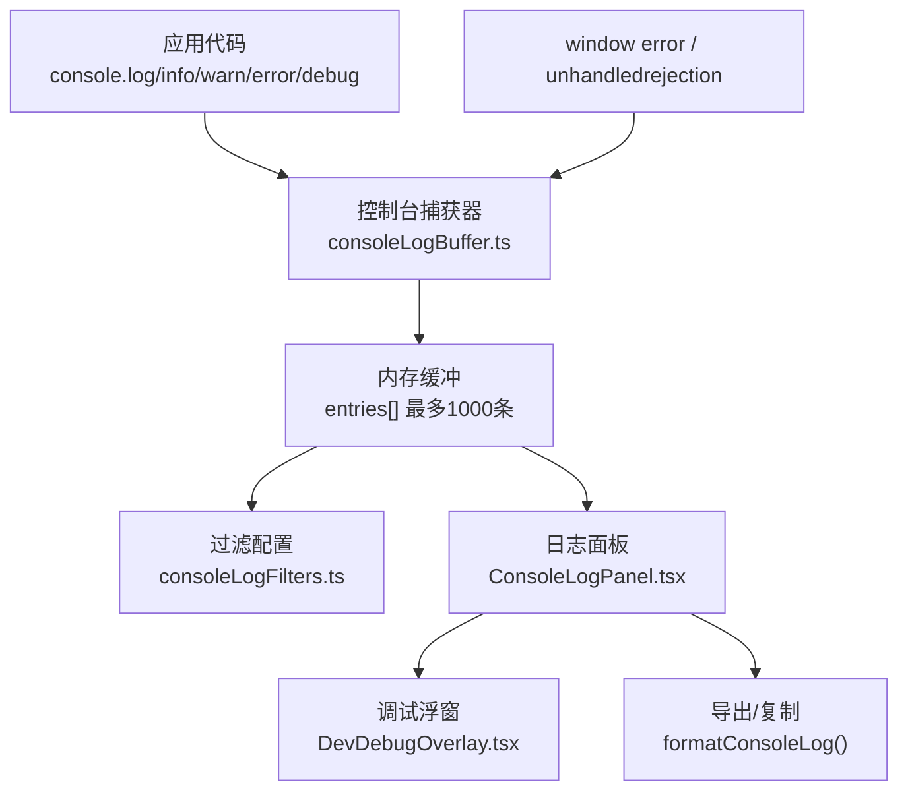
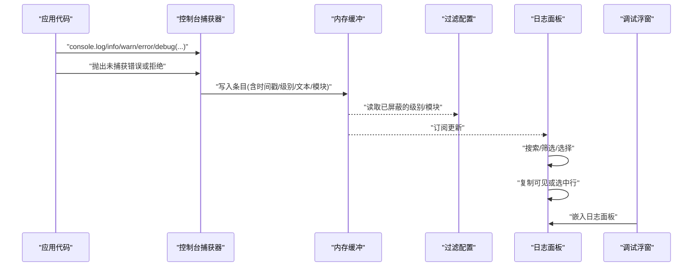
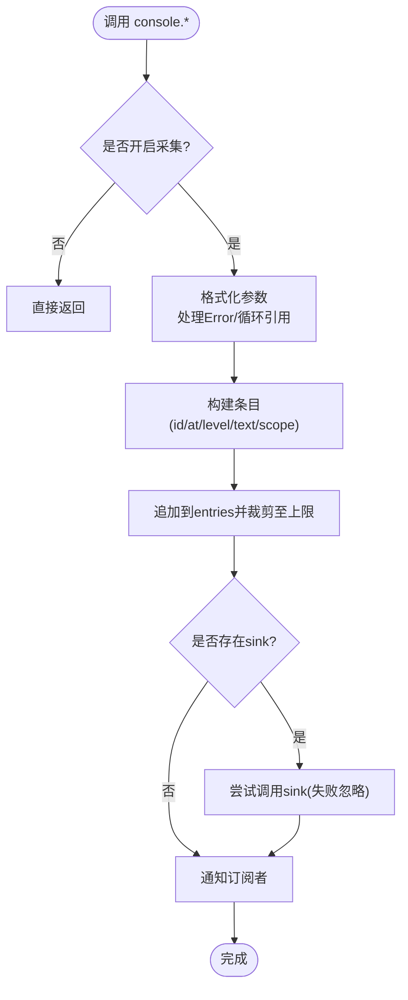
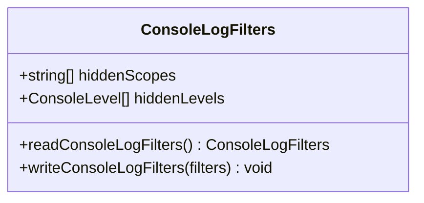
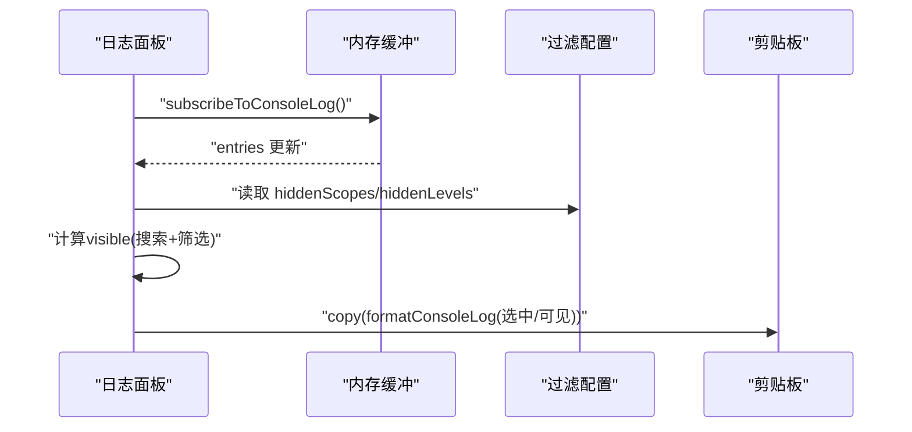
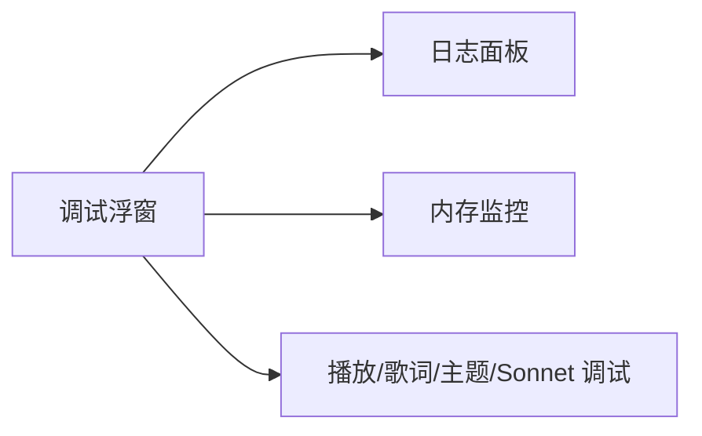
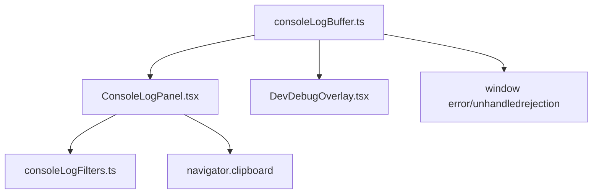

# 日志分析

<cite>
**本文引用的文件**
- [consoleLogBuffer.ts](file://src/utils/consoleLogBuffer.ts)
- [consoleLogFilters.ts](file://src/utils/consoleLogFilters.ts)
- [ConsoleLogPanel.tsx](file://src/components/shared/ConsoleLogPanel.tsx)
- [DevDebugOverlay.tsx](file://src/components/DevDebugOverlay.tsx)
- [client-logging.md](file://docs/client-logging.md)
</cite>

## 目录
1. [简介](#简介)
2. [项目结构](#项目结构)
3. [核心组件](#核心组件)
4. [架构总览](#架构总览)
5. [详细组件分析](#详细组件分析)
6. [依赖关系分析](#依赖关系分析)
7. [性能考量](#性能考量)
8. [故障排查指南](#故障排查指南)
9. [结论](#结论)
10. [附录](#附录)

## 简介
本指南面向 Folia Player 的日志分析与调试，聚焦控制台日志缓冲机制的工作原理与使用方法。内容涵盖：
- 日志收集、存储、过滤与导出
- 如何启用调试模式、查看实时日志、过滤特定错误类型
- 日志面板使用技巧（级别设置、关键词搜索、错误堆栈分析）
- 常见错误日志含义解读与解决方案
- 性能监控日志分析方法与优化建议

## 项目结构
Folia Player 的日志系统由“采集层 + 存储层 + 过滤层 + 展示层”构成，分别位于以下模块：
- 采集层：拦截 console 输出与全局异常事件，统一写入内存缓冲
- 存储层：维护最近若干条日志条目，提供订阅与格式化能力
- 过滤层：持久化用户屏蔽的模块与级别，跨会话生效
- 展示层：在开发者设置页与调试浮窗中提供可视化面板，支持搜索、选择与复制

图表来源
- [consoleLogBuffer.ts:1-178](file://src/utils/consoleLogBuffer.ts#L1-L178)
- [consoleLogFilters.ts:1-60](file://src/utils/consoleLogFilters.ts#L1-L60)
- [ConsoleLogPanel.tsx:1-420](file://src/components/shared/ConsoleLogPanel.tsx#L1-L420)
- [DevDebugOverlay.tsx:1-800](file://src/components/DevDebugOverlay.tsx#L1-L800)

章节来源
- [client-logging.md:1-83](file://docs/client-logging.md#L1-L83)

## 核心组件
- 控制台捕获与缓冲
  - 拦截所有 console 级别并记录为结构化条目
  - 捕获 window error 与 unhandledrejection，确保未通过 console 的错误也能被记录
  - 限制缓冲大小，避免长期运行导致内存膨胀
- 过滤与持久化
  - 按模块前缀（如 [Prefetch]）和日志级别进行屏蔽
  - 将“已屏蔽项”持久化到本地存储，跨会话保留
- 日志面板
  - 实时显示、关键词搜索、级别/模块筛选
  - 支持多选行复制、清空缓冲、显示隐藏计数
- 调试浮窗
  - 集成日志面板，并提供内存监控等调试信息

章节来源
- [consoleLogBuffer.ts:1-178](file://src/utils/consoleLogBuffer.ts#L1-L178)
- [consoleLogFilters.ts:1-60](file://src/utils/consoleLogFilters.ts#L1-L60)
- [ConsoleLogPanel.tsx:1-420](file://src/components/shared/ConsoleLogPanel.tsx#L1-L420)
- [DevDebugOverlay.tsx:1-800](file://src/components/DevDebugOverlay.tsx#L1-L800)

## 架构总览
下图展示了从日志产生到最终可复制导出的完整流程，以及关键控制点（开关、过滤、导出）。

图表来源
- [consoleLogBuffer.ts:100-178](file://src/utils/consoleLogBuffer.ts#L100-L178)
- [consoleLogFilters.ts:12-60](file://src/utils/consoleLogFilters.ts#L12-L60)
- [ConsoleLogPanel.tsx:172-420](file://src/components/shared/ConsoleLogPanel.tsx#L172-L420)
- [DevDebugOverlay.tsx:603-771](file://src/components/DevDebugOverlay.tsx#L603-L771)

## 详细组件分析

### 控制台捕获与缓冲（consoleLogBuffer.ts）
- 功能要点
  - 安装时替换 console 各方法，统一进入 push 流程
  - 解析每行开头的 [Module] 前缀作为 scope，便于分组与屏蔽
  - 维护 entries 数组，超过上限后裁剪，保证内存可控
  - 暴露订阅接口，供 UI 组件响应式更新
  - 捕获 window error 与 unhandledrejection，补全未走 console 的错误路径
- 复杂度与性能
  - 格式化阶段对对象进行循环引用检测，避免 JSON.stringify 抛错
  - 仅在 capturing 开启时执行序列化与入队，减少开销
  - sink 回调失败不影响主流程，防止日志写入影响业务逻辑
- 关键行为
  - 可通过 setConsoleCaptureEnabled 关闭采集；关闭时会清空缓冲
  - formatConsoleLog 用于导出纯文本，适合粘贴分享

图表来源
- [consoleLogBuffer.ts:48-132](file://src/utils/consoleLogBuffer.ts#L48-L132)
- [consoleLogBuffer.ts:157-178](file://src/utils/consoleLogBuffer.ts#L157-L178)

章节来源
- [consoleLogBuffer.ts:1-178](file://src/utils/consoleLogBuffer.ts#L1-L178)

### 过滤与持久化（consoleLogFilters.ts）
- 设计原则
  - 持久化“已屏蔽项”，而非“已显示项”，确保新增模块默认可见
  - 读写 localStorage，容错处理损坏或被阻止的存储
- 数据结构
  - hiddenScopes：屏蔽的模块列表
  - hiddenLevels：屏蔽的日志级别列表
- 使用方式
  - 面板内切换级别/模块时写入配置
  - 面板初始化时读取配置恢复上次状态

图表来源
- [consoleLogFilters.ts:11-60](file://src/utils/consoleLogFilters.ts#L11-L60)

章节来源
- [consoleLogFilters.ts:1-60](file://src/utils/consoleLogFilters.ts#L1-L60)

### 日志面板（ConsoleLogPanel.tsx）
- 核心能力
  - 实时订阅缓冲更新，渲染可见条目
  - 关键词搜索：全文子串匹配
  - 级别/模块筛选：下拉菜单，带计数提示
  - 选择与复制：单选/多选/范围选择，复制可见或选中部分
  - 清空缓冲：便于复现问题时的干净环境
- 交互细节
  - 显示隐藏数量，避免“静默丢失答案”
  - 当采集关闭时，面板显示“未记录”状态
- 数据流
  - 从缓冲获取 entries 与 capturing 状态
  - 根据 filters 计算 visible 列表
  - 复制时使用 formatConsoleLog 生成纯文本

图表来源
- [ConsoleLogPanel.tsx:172-420](file://src/components/shared/ConsoleLogPanel.tsx#L172-L420)
- [consoleLogBuffer.ts:146-155](file://src/utils/consoleLogBuffer.ts#L146-L155)

章节来源
- [ConsoleLogPanel.tsx:1-420](file://src/components/shared/ConsoleLogPanel.tsx#L1-L420)

### 调试浮窗（DevDebugOverlay.tsx）
- 角色定位
  - 集成日志面板于玩家页面浮窗，提供快捷键入口
  - 同时提供内存监控等调试视图
- 与日志系统的关系
  - 通过 isConsoleCaptureEnabled 判断是否显示日志标签
  - 若采集关闭，则不打开包含日志的浮窗

图表来源
- [DevDebugOverlay.tsx:603-771](file://src/components/DevDebugOverlay.tsx#L603-L771)

章节来源
- [DevDebugOverlay.tsx:1-800](file://src/components/DevDebugOverlay.tsx#L1-L800)

## 依赖关系分析
- 松耦合设计
  - 缓冲层不依赖 UI，仅通过订阅与 sink 扩展
  - 面板依赖缓冲与过滤，但不反向影响底层
- 外部依赖
  - 浏览器 API：localStorage、navigator.clipboard、performance.memory（可选）
  - 全局事件：window error、unhandledrejection

图表来源
- [consoleLogBuffer.ts:100-178](file://src/utils/consoleLogBuffer.ts#L100-L178)
- [ConsoleLogPanel.tsx:1-420](file://src/components/shared/ConsoleLogPanel.tsx#L1-L420)
- [consoleLogFilters.ts:1-60](file://src/utils/consoleLogFilters.ts#L1-L60)

章节来源
- [consoleLogBuffer.ts:1-178](file://src/utils/consoleLogBuffer.ts#L1-L178)
- [ConsoleLogPanel.tsx:1-420](file://src/components/shared/ConsoleLogPanel.tsx#L1-L420)
- [consoleLogFilters.ts:1-60](file://src/utils/consoleLogFilters.ts#L1-L60)

## 性能考量
- 采集开关
  - 默认开启，但可随时关闭；关闭后立即停止序列化与入队，并清空缓冲
- 缓冲上限
  - 固定上限（例如最近1000条），避免长会话无限增长
- 序列化成本
  - 对复杂对象采用 WeakSet 检测循环引用，避免 JSON.stringify 失败
- 事件监听
  - 全局错误与拒绝事件统一接入，确保关键错误不被遗漏
- 内存监控（调试浮窗）
  - 周期性采样 usedHeap、DOM 节点数，辅助识别泄漏与抖动

章节来源
- [consoleLogBuffer.ts:33-96](file://src/utils/consoleLogBuffer.ts#L33-L96)
- [consoleLogBuffer.ts:111-132](file://src/utils/consoleLogBuffer.ts#L111-L132)
- [DevDebugOverlay.tsx:641-691](file://src/components/DevDebugOverlay.tsx#L641-L691)

## 故障排查指南
- 常见问题与解决
  - 看不到日志：确认采集开关已开启；若关闭，面板会提示“未记录”
  - 日志太多难以定位：使用“模块”筛选快速静音高频噪音源；使用“级别”屏蔽 info/debug
  - 找不到某次错误：用关键词搜索定位；必要时清空缓冲后复现
  - 复制内容不完整：先选择相关行再复制，避免复制整屏
- 错误堆栈分析
  - Error 对象会被序列化为 stack 或 name/message，便于定位
  - 未捕获异常与 Promise 拒绝也会被记录，便于发现隐式失败
- 常见日志含义与建议
  - 网络请求失败：关注 warn/error 级别，结合模块名定位上游服务
  - 资源加载失败：检查对应模块的前缀，确认缓存或路径是否正确
  - 播放异常：优先查看 error 级别，结合时间戳与上下文定位
- 性能问题定位
  - 观察内存监控中的 usedHeap 与 DOM 节点变化，识别持续增长
  - 结合 GC 次数与峰值，评估是否存在频繁分配与回收

章节来源
- [ConsoleLogPanel.tsx:287-321](file://src/components/shared/ConsoleLogPanel.tsx#L287-L321)
- [consoleLogBuffer.ts:48-62](file://src/utils/consoleLogBuffer.ts#L48-L62)
- [consoleLogBuffer.ts:172-177](file://src/utils/consoleLogBuffer.ts#L172-L177)
- [DevDebugOverlay.tsx:774-800](file://src/components/DevDebugOverlay.tsx#L774-L800)

## 结论
Folia Player 的日志系统以“轻量采集 + 灵活过滤 + 便捷导出”为核心，既满足日常排障，又兼顾性能与可用性。通过调试浮窗与开发者设置页的双入口，用户可以快速定位问题、缩小范围、导出证据，并结合内存监控进一步优化体验。

## 附录
- 快速上手
  - 打开“设置 → 开发者”，启用日志采集
  - 在播放器页面按下快捷键打开调试浮窗，切换到“Console”标签
  - 使用“级别/模块”筛选与“关键词搜索”快速定位
  - 选择相关行后点击“复制”，将日志粘贴到问题报告
- 最佳实践
  - 日志前缀遵循 [模块] 约定，便于分组与屏蔽
  - 只记录决策与关键指标，避免冗余刷屏
  - 定期清空缓冲，保持问题复现环境的清洁

章节来源
- [client-logging.md:8-83](file://docs/client-logging.md#L8-L83)