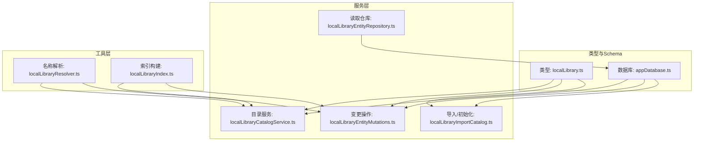
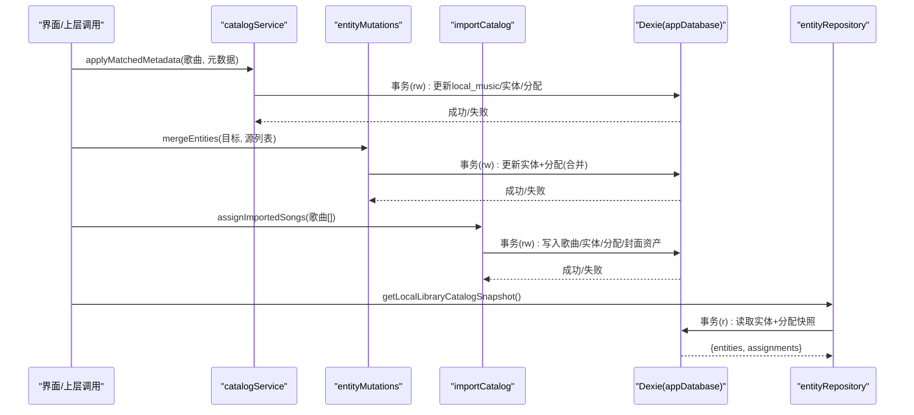
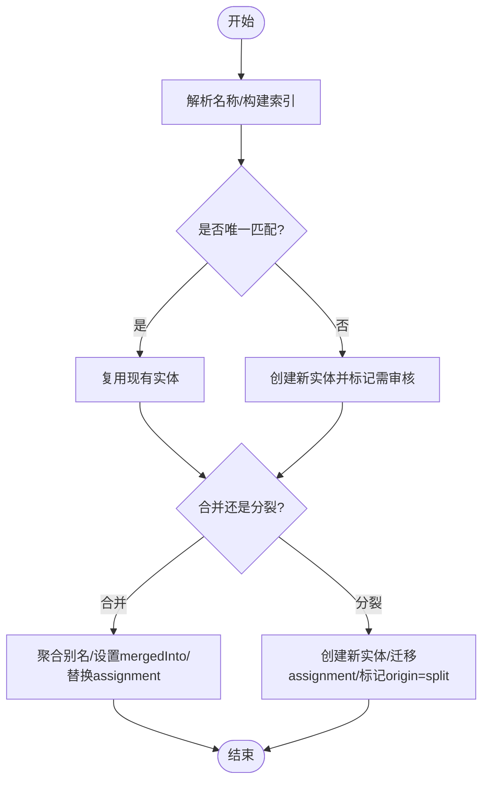
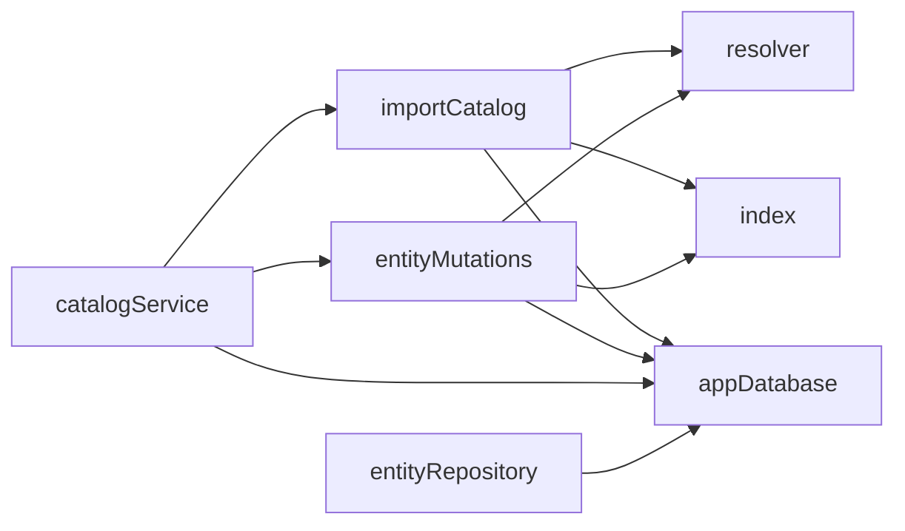

# 实体管理与关系映射

<cite>
**本文引用的文件**
- [appDatabase.ts](file://src/services/appDatabase.ts)
- [localLibrary.ts](file://src/types/localLibrary.ts)
- [localLibraryCatalogService.ts](file://src/services/localLibraryCatalogService.ts)
- [localLibraryEntityMutations.ts](file://src/services/localLibraryEntityMutations.ts)
- [localLibraryImportCatalog.ts](file://src/services/localLibraryImportCatalog.ts)
- [localLibraryResolver.ts](file://src/utils/localLibraryResolver.ts)
- [localLibraryIndex.ts](file://src/utils/localLibraryIndex.ts)
- [db.ts](file://src/services/db.ts)
- [localLibraryEntityRepository.ts](file://src/services/localLibraryEntityRepository.ts)
</cite>

## 目录
1. [简介](#简介)
2. [项目结构](#项目结构)
3. [核心组件](#核心组件)
4. [架构总览](#架构总览)
5. [详细组件分析](#详细组件分析)
6. [依赖分析](#依赖分析)
7. [性能考虑](#性能考虑)
8. [故障排查指南](#故障排查指南)
9. [结论](#结论)
10. [附录](#附录)

## 简介
本技术文档聚焦 Folia Player 本地音乐实体管理系统，围绕歌曲、专辑、艺术家三类实体的数据模型、关系映射、生命周期管理（创建/更新/删除的原子性与一致性）、实体合并与分裂算法、查询优化与索引设计、以及数据库迁移与版本管理进行系统化说明。目标是帮助开发者快速理解并安全扩展本地库的实体管理能力。

## 项目结构
本地库实体管理由“类型定义 + 数据库 Schema + 服务层事务 + 工具索引/解析”构成：
- 类型定义集中描述实体与分配关系
- Dexie 数据库定义表结构与索引，并提供版本升级能力
- 服务层以 Dexie 事务保证跨表操作的原子性
- 工具层提供别名索引、名称解析、重定向跟随等通用能力

图表来源
- [appDatabase.ts:26-113](file://src/services/appDatabase.ts#L26-L113)
- [localLibrary.ts:1-62](file://src/types/localLibrary.ts#L1-L62)
- [localLibraryCatalogService.ts:21-111](file://src/services/localLibraryCatalogService.ts#L21-L111)
- [localLibraryEntityMutations.ts:15-104](file://src/services/localLibraryEntityMutations.ts#L15-L104)
- [localLibraryImportCatalog.ts:21-147](file://src/services/localLibraryImportCatalog.ts#L21-L147)
- [localLibraryResolver.ts:1-69](file://src/utils/localLibraryResolver.ts#L1-L69)
- [localLibraryIndex.ts:1-48](file://src/utils/localLibraryIndex.ts#L1-L48)
- [localLibraryEntityRepository.ts:1-44](file://src/services/localLibraryEntityRepository.ts#L1-L44)

章节来源
- [appDatabase.ts:26-113](file://src/services/appDatabase.ts#L26-L113)
- [localLibrary.ts:1-62](file://src/types/localLibrary.ts#L1-L62)

## 核心组件
- 实体模型与约束
  - 实体：LocalLibraryEntity（kind=artist|album；displayName/aliases/normalizedAliases；mergedInto 用于合并；createdAt/updatedAt）
  - 分配：LocalLibraryAssignment（songId；artistEntityIds[]；albumEntityId?；origin 标记来源；updatedAt）
  - 标题/元数据来源：LocalSongTitleOrigin、LocalSongMetadataSource、LocalSongOnlineMetadata、LocalSongImportedMetadata
- 数据库表与索引
  - local_music、local_library_entities、local_library_assignments、local_cover_assets
  - 关键索引：entities.kind、*normalizedAliases、mergedInto、needsReview、createdAt；assignments.songId、*artistEntityIds、albumEntityId、artistOrigin、albumOrigin
- 服务与事务
  - applyMatchedMetadata / applyManualMetadata / restoreImportedMetadata：在单一 Dexie 事务中同时更新歌曲、实体、分配
  - mergeEntities / splitEntity / moveEntityMembersToExistingEntity / splitArtistEntityToTargets：合并/分裂/移动成员，均使用事务保证一致性
  - assignImportedSongs / ensureLocalLibraryInitialized：导入时批量建立或修复分配，支持幂等与回滚清理
- 工具与解析
  - resolveLocalLibraryEntity：基于规范化别名与上下文选择唯一实体，歧义时标记 needsReview
  - buildLocalLibraryIndex / followEntityRedirect：构建别名到实体ID的索引，并跟随 mergedInto 链获取最终实体

章节来源
- [localLibrary.ts:1-62](file://src/types/localLibrary.ts#L1-L62)
- [appDatabase.ts:41-98](file://src/services/appDatabase.ts#L41-L98)
- [localLibraryCatalogService.ts:42-139](file://src/services/localLibraryCatalogService.ts#L42-L139)
- [localLibraryEntityMutations.ts:15-249](file://src/services/localLibraryEntityMutations.ts#L15-L249)
- [localLibraryImportCatalog.ts:21-147](file://src/services/localLibraryImportCatalog.ts#L21-L147)
- [localLibraryResolver.ts:1-69](file://src/utils/localLibraryResolver.ts#L1-L69)
- [localLibraryIndex.ts:1-48](file://src/utils/localLibraryIndex.ts#L1-L48)

## 架构总览
下图展示从应用入口到数据库的关键调用路径与事务边界：

图表来源
- [localLibraryCatalogService.ts:42-139](file://src/services/localLibraryCatalogService.ts#L42-L139)
- [localLibraryEntityMutations.ts:15-104](file://src/services/localLibraryEntityMutations.ts#L15-L104)
- [localLibraryImportCatalog.ts:111-147](file://src/services/localLibraryImportCatalog.ts#L111-L147)
- [localLibraryEntityRepository.ts:21-32](file://src/services/localLibraryEntityRepository.ts#L21-L32)
- [appDatabase.ts:26-113](file://src/services/appDatabase.ts#L26-L113)

## 详细组件分析

### 实体模型与字段约束
- LocalLibraryEntity
  - id: 稳定标识（UUID），不可变
  - kind: 'artist' | 'album'
  - displayName: 显示名，非空
  - aliases/normalizedAliases: 别名与规范化别名数组，用于模糊匹配与去重
  - mergedInto?: 指向被合并到的实体ID，形成有向无环的重定向链
  - needsReview?: 当存在歧义时标记需人工审核
  - createdAt/updatedAt: 时间戳
- LocalLibraryAssignment
  - songId: 关联的歌曲ID
  - artistEntityIds: 多对多（一首歌可对应多个艺术家）
  - albumEntityId?: 一对多（一首歌对应一张专辑）
  - artistOrigin/albumOrigin: 来源枚举（import/auto-match/manual-match/manual/split）
  - updatedAt: 更新时间戳
- 约束要点
  - 所有写操作通过 Dexie 事务执行，避免并发导致的中间态
  - 名称统一经 clean/normalize 处理，确保别名一致性与可检索性
  - 合并后旧实体保留 mergedInto 指向，查询一律走 followEntityRedirect

章节来源
- [localLibrary.ts:1-62](file://src/types/localLibrary.ts#L1-L62)
- [localLibraryIndex.ts:30-41](file://src/utils/localLibraryIndex.ts#L30-L41)

### 实体关系映射与数据库设计
- 多对多：歌曲 ↔ 艺术家（assignment.artistEntityIds[]）
- 一对多：歌曲 → 专辑（assignment.albumEntityId?）
- 外键语义：通过业务逻辑与事务保证引用完整性；删除歌曲时计算孤儿实体并清理
- 级联策略：
  - 删除歌曲：删除 local_music 与 assignment，若实体不再被任何分配引用则删除实体
  - 合并实体：将源实体标记 mergedInto，并批量替换 assignment 中的引用
- 索引设计：
  - entities: kind、*normalizedAliases、mergedInto、needsReview、createdAt
  - assignments: songId、*artistEntityIds、albumEntityId、artistOrigin、albumOrigin

章节来源
- [appDatabase.ts:41-98](file://src/services/appDatabase.ts#L41-L98)
- [localLibraryCatalogService.ts:187-245](file://src/services/localLibraryCatalogService.ts#L187-L245)

### 实体生命周期管理（创建/更新/删除）
- 创建
  - 导入时通过 assignImportedSongs 批量写入歌曲、实体、分配，并准备/迁移封面资产
  - 手动/自动匹配通过 applyMatchedMetadata/applyManualMetadata 在单事务内完成
- 更新
  - 设置显示名 setEntityDisplayName：追加别名并更新时间戳
  - 合并 mergeEntities：聚合别名、更新 source 为 mergedInto、批量替换 assignment 引用
  - 分裂 splitEntity：从源实体拆分出子实体，并将相关 assignment 的引用迁移到新实体
  - 移动成员 moveEntityMembersToExistingEntity：仅调整 selected 成员的 assignment 引用
  - 艺术家分裂 splitArtistEntityToTargets：按 append/replace 模式将歌曲的艺术家集合重定向至一个或多个目标
- 删除
  - deleteSongAssignment(s)：在事务中删除歌曲与分配，并清理孤儿实体与未引用封面资产
- 一致性保障
  - 所有跨表写操作均在 Dexie 事务中进行
  - 错误路径会清理临时资源（如封面资产），避免脏数据残留

章节来源
- [localLibraryImportCatalog.ts:21-147](file://src/services/localLibraryImportCatalog.ts#L21-L147)
- [localLibraryCatalogService.ts:42-139](file://src/services/localLibraryCatalogService.ts#L42-L139)
- [localLibraryEntityMutations.ts:15-249](file://src/services/localLibraryEntityMutations.ts#L15-L249)
- [localLibraryCatalogService.ts:209-245](file://src/services/localLibraryCatalogService.ts#L209-L245)

### 实体合并与分裂算法
- 重复检测与歧义处理
  - 名称解析 resolveLocalLibraryEntity：基于规范化别名查找候选；若唯一则直接返回；若有多个候选且无上下文优先，则创建新实体并标记 needsReview
- 智能合并策略
  - mergeEntities：聚合别名与规范化别名；将源实体 mergedInto 指向目标；批量替换 assignment 中的引用（艺术家或专辑）
- 手动分割功能
  - splitEntity：基于选中歌曲集创建新实体，并将这些歌曲的 assignment 指向新实体，标记 origin='split'
  - moveEntityMembersToExistingEntity：将部分成员从一个实体移动到另一个已有实体
  - splitArtistEntityToTargets：支持 append/replace 两种模式，将歌曲的艺术家集合重定向到一个或多个目标（可新建或复用现有）

图表来源
- [localLibraryResolver.ts:29-67](file://src/utils/localLibraryResolver.ts#L29-L67)
- [localLibraryEntityMutations.ts:15-104](file://src/services/localLibraryEntityMutations.ts#L15-L104)
- [localLibraryEntityMutations.ts:155-235](file://src/services/localLibraryEntityMutations.ts#L155-L235)

章节来源
- [localLibraryResolver.ts:1-69](file://src/utils/localLibraryResolver.ts#L1-L69)
- [localLibraryEntityMutations.ts:15-249](file://src/services/localLibraryEntityMutations.ts#L15-L249)

### 实体查询优化方案
- 索引利用
  - 通过 *normalizedAliases 实现别名前缀/精确匹配
  - 通过 *artistEntityIds 快速定位包含某艺术家的歌曲
  - 通过 songId 直接定位分配记录
- 快照读取
  - getLocalLibraryCatalogSnapshot：在单次读事务中同时读取实体与分配，避免不一致视图
- 大数据量处理
  - 批量 bulkGet/bulkPut/bulkDelete 减少往返
  - 使用 buildLocalLibraryIndex 在内存中构建 Map 加速查找
  - 删除时先收集孤儿实体再批量清理，降低碎片化

章节来源
- [localLibraryEntityRepository.ts:7-32](file://src/services/localLibraryEntityRepository.ts#L7-L32)
- [localLibraryIndex.ts:12-28](file://src/utils/localLibraryIndex.ts#L12-L28)
- [appDatabase.ts:41-98](file://src/services/appDatabase.ts#L41-L98)

### 实体迁移与版本管理
- 版本演进
  - v0.7：引入 local_library_entities 与 local_library_assignments 表及索引
  - v0.8：迁移历史 local_music 记录，重建实体与分配，清空并回填
  - v0.9：增加 local_cover_assets 表与 local_music.localCoverAssetId 字段
- 兼容性处理
  - 迁移脚本负责将旧数据结构转换为新结构
  - 运行时 ensureLocalLibraryInitialized 修复缺失的分配记录
  - 数据库版本变更事件触发页面重载，确保新旧版本一致性

章节来源
- [appDatabase.ts:41-108](file://src/services/appDatabase.ts#L41-L108)
- [localLibraryImportCatalog.ts:137-147](file://src/services/localLibraryImportCatalog.ts#L137-L147)

## 依赖分析
- 模块耦合
  - catalogService 依赖 mutations/importCatalog 暴露的统一接口，屏蔽底层事务细节
  - mutations 依赖 resolver/index 进行名称解析与索引构建
  - importCatalog 负责导入流程与幂等性，必要时清理临时资源
  - repository 提供只读快照与重定向解析
- 外部依赖
  - Dexie 作为 IndexedDB 抽象层，提供事务与索引能力
  - 浏览器/环境 API（crypto.randomUUID）用于生成稳定ID

图表来源
- [localLibraryEntityRepository.ts:1-44](file://src/services/localLibraryEntityRepository.ts#L1-L44)
- [localLibraryCatalogService.ts:21-139](file://src/services/localLibraryCatalogService.ts#L21-L139)
- [localLibraryEntityMutations.ts:15-249](file://src/services/localLibraryEntityMutations.ts#L15-L249)
- [localLibraryImportCatalog.ts:21-147](file://src/services/localLibraryImportCatalog.ts#L21-L147)
- [localLibraryResolver.ts:1-69](file://src/utils/localLibraryResolver.ts#L1-L69)
- [localLibraryIndex.ts:1-48](file://src/utils/localLibraryIndex.ts#L1-L48)
- [appDatabase.ts:26-113](file://src/services/appDatabase.ts#L26-L113)

章节来源
- [localLibraryEntityRepository.ts:1-44](file://src/services/localLibraryEntityRepository.ts#L1-L44)
- [localLibraryCatalogService.ts:21-139](file://src/services/localLibraryCatalogService.ts#L21-L139)
- [localLibraryEntityMutations.ts:15-249](file://src/services/localLibraryEntityMutations.ts#L15-L249)
- [localLibraryImportCatalog.ts:21-147](file://src/services/localLibraryImportCatalog.ts#L21-L147)
- [localLibraryResolver.ts:1-69](file://src/utils/localLibraryResolver.ts#L1-L69)
- [localLibraryIndex.ts:1-48](file://src/utils/localLibraryIndex.ts#L1-L48)
- [appDatabase.ts:26-113](file://src/services/appDatabase.ts#L26-L113)

## 性能考虑
- 事务粒度控制：尽量将相关写操作放入同一事务，减少锁竞争与不一致窗口
- 批量操作：bulkPut/bulkDelete 替代逐条写入，降低 I/O 次数
- 索引命中：充分利用 normalizedAliases 与 *artistEntityIds 等复合索引
- 内存索引：buildLocalLibraryIndex 将实体与分配加载到 Map，避免重复扫描
- 异步与并行：Promise.all 并行读取/写入不同表，提升吞吐
- 资源清理：删除歌曲后及时清理未引用的封面资产，防止存储膨胀

[本节为通用性能建议，不直接分析具体文件]

## 故障排查指南
- 常见问题
  - 合并后查询不到实体：确认是否通过 followEntityRedirect 或 resolveEntityRedirect 获取最终实体
  - 分裂后分配未更新：检查 split 或 move 的事务是否成功，确认 assignment.origin 是否为 'split'
  - 导入后缺少分配：运行 ensureLocalLibraryInitialized 修复缺失记录
  - 封面资产泄漏：删除歌曲后未清理，检查异常路径是否调用清理函数
- 调试建议
  - 使用 getLocalLibraryCatalogSnapshot 获取一致快照进行比对
  - 打印 entitiesById 与 entityIdsByAlias 索引，验证别名映射是否正确
  - 关注数据库版本变更事件，确保页面已重载以加载新 Schema

章节来源
- [localLibraryEntityRepository.ts:34-42](file://src/services/localLibraryEntityRepository.ts#L34-L42)
- [localLibraryImportCatalog.ts:137-147](file://src/services/localLibraryImportCatalog.ts#L137-L147)
- [localLibraryCatalogService.ts:209-245](file://src/services/localLibraryCatalogService.ts#L209-L245)
- [appDatabase.ts:100-108](file://src/services/appDatabase.ts#L100-L108)

## 结论
Folia Player 的本地音乐实体管理通过清晰的数据模型、严格的 Dexie 事务边界、完善的别名索引与名称解析机制，实现了高一致性的实体合并/分裂与分配管理。配合版本迁移与初始化修复，系统具备良好的可扩展性与鲁棒性。建议在新增功能时遵循“事务内完成跨表写”“利用索引与批量操作”“显式处理歧义与孤儿资源”的原则。

## 附录
- 常用入口
  - 保存本地歌曲：saveLocalSong(s)
  - 删除本地歌曲：deleteLocalSong(s)
  - 获取本地歌曲：getLocalSongs()
  - 清除全部数据：clearAllData()
- 关键常量
  - 数据库名：KineticPlayerDB
  - 版本变更事件：folia-database-version-change
  - 本地库引导标记：local_library_entities_bootstrap_v1

章节来源
- [db.ts:186-264](file://src/services/db.ts#L186-L264)
- [appDatabase.ts:10-14](file://src/services/appDatabase.ts#L10-L14)