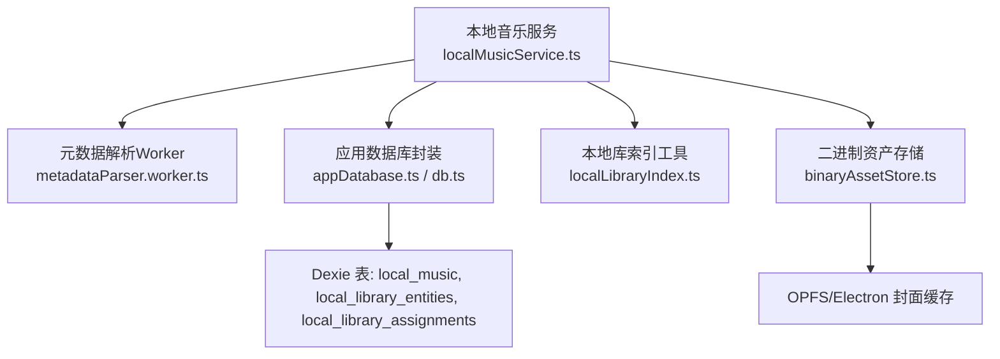
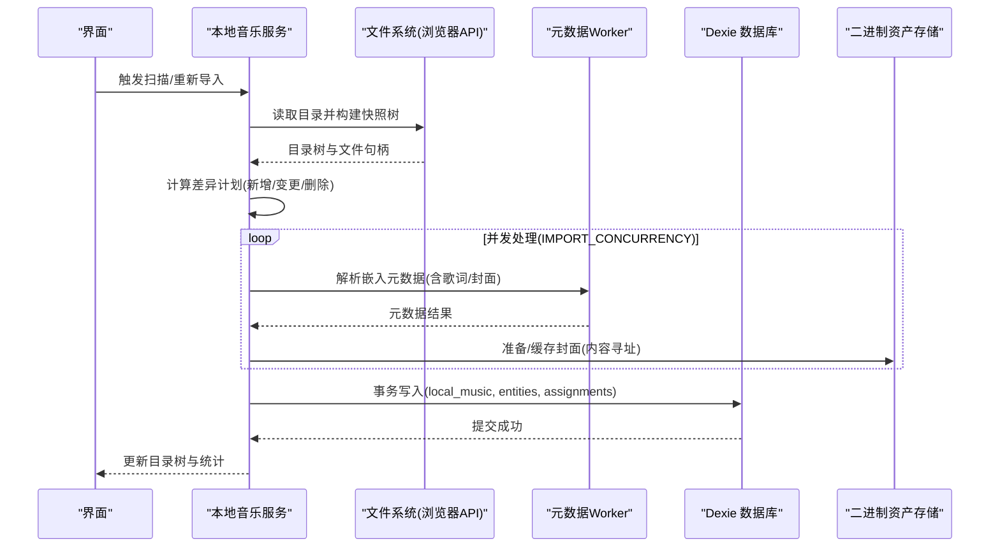
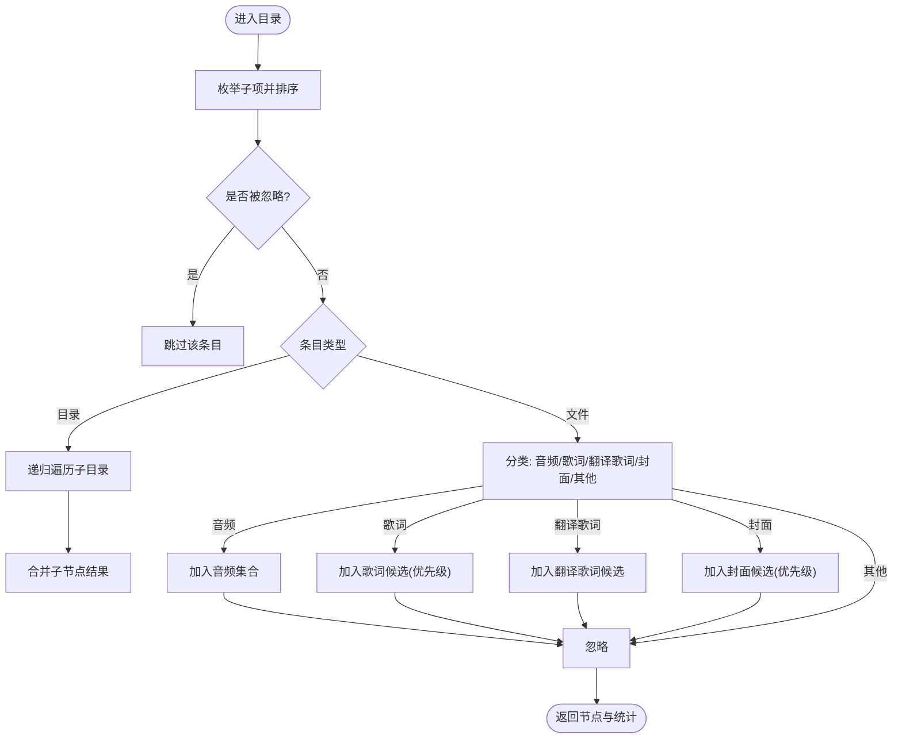
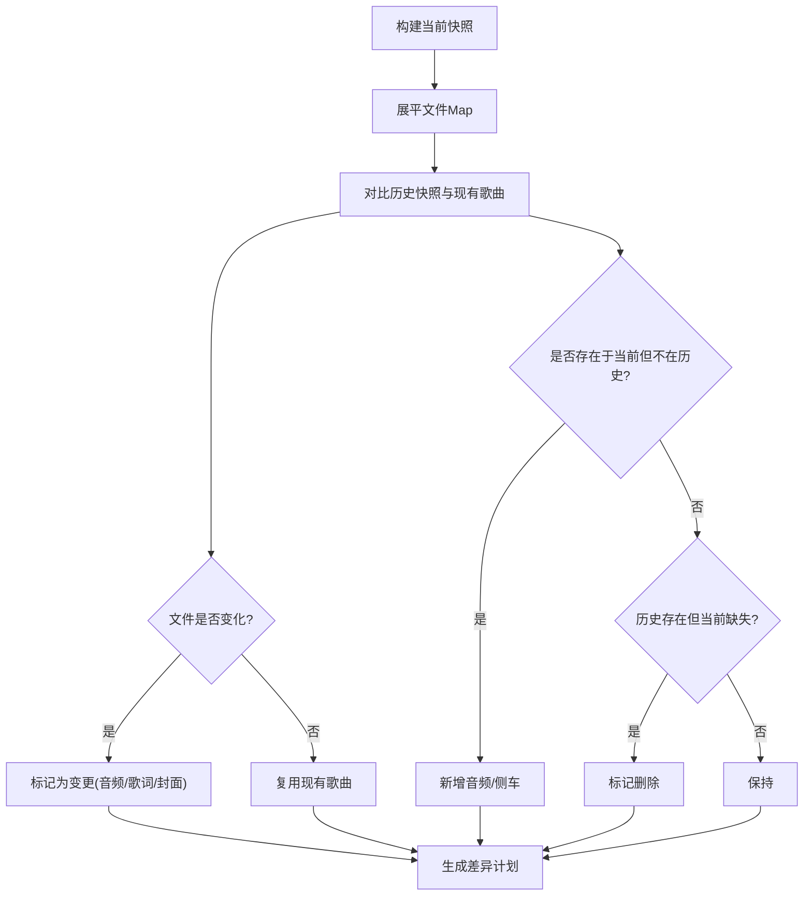
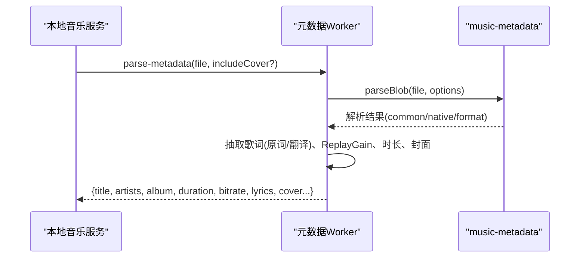
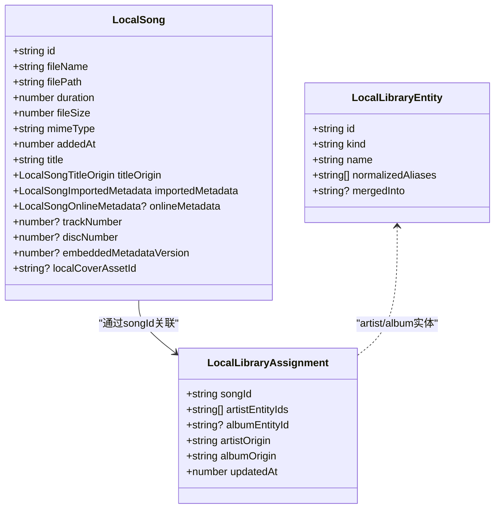
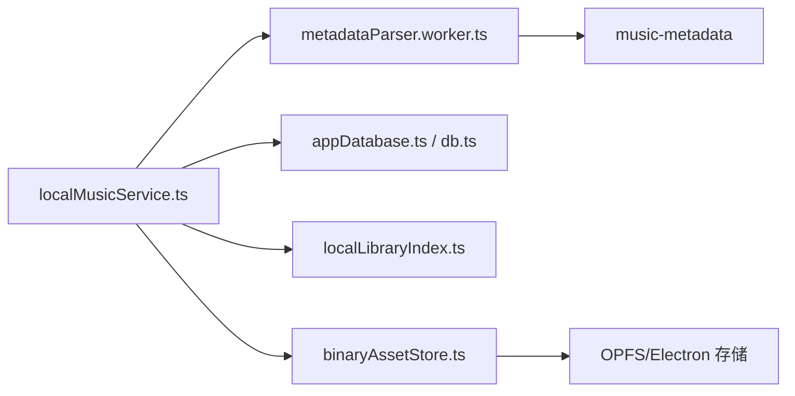

# 文件扫描与索引

<cite>
**本文引用的文件**
- [localMusicService.ts](file://src/services/localMusicService.ts)
- [metadataParser.worker.ts](file://src/workers/metadataParser.worker.ts)
- [localLibraryCatalogService.ts](file://src/services/localLibraryCatalogService.ts)
- [localLibraryIndex.ts](file://src/utils/localLibraryIndex.ts)
- [db.ts](file://src/services/db.ts)
- [appDatabase.ts](file://src/services/appDatabase.ts)
- [binaryAssetStore.ts](file://src/services/binaryAssetStore.ts)
- [types.ts](file://src/types.ts)
</cite>

## 目录
1. [简介](#简介)
2. [项目结构](#项目结构)
3. [核心组件](#核心组件)
4. [架构总览](#架构总览)
5. [详细组件分析](#详细组件分析)
6. [依赖关系分析](#依赖关系分析)
7. [性能考量](#性能考量)
8. [故障排除指南](#故障排除指南)
9. [结论](#结论)
10. [附录](#附录)

## 简介
本技术文档聚焦 Folia Player 的本地音乐文件扫描与索引系统，系统性解析递归目录遍历、大目录处理策略、增量扫描机制、音频格式识别与元数据提取、索引建立（数据库表结构与并发）、文件变更检测（哈希与差异同步）以及性能优化方案（多线程、内存管理、缓存）。同时提供常见问题的排查指引。

## 项目结构
本地音乐扫描与索引由以下关键模块协作完成：
- 服务层：负责目录遍历、增量差异计算、导入流程编排、数据库事务写入等
- Worker 层：在独立线程中解析嵌入元数据与歌词，避免阻塞主线程
- 工具层：构建本地库索引、实体别名映射、重定向追踪等
- 存储层：IndexedDB（Dexie）持久化歌曲、实体、分配关系；OPFS/Electron 二进制资产存储封面
- 类型定义：统一描述本地歌曲、本地库快照、实体与分配等数据结构

图表来源
- [localMusicService.ts:413-530](file://src/services/localMusicService.ts#L413-L530)
- [metadataParser.worker.ts:153-253](file://src/workers/metadataParser.worker.ts#L153-L253)
- [localLibraryCatalogService.ts:52-110](file://src/services/localLibraryCatalogService.ts#L52-L110)
- [localLibraryIndex.ts:12-28](file://src/utils/localLibraryIndex.ts#L12-L28)
- [binaryAssetStore.ts:41-67](file://src/services/binaryAssetStore.ts#L41-L67)

章节来源
- [localMusicService.ts:1-120](file://src/services/localMusicService.ts#L1-L120)
- [types.ts:1157-1179](file://src/types.ts#L1157-L1179)

## 核心组件
- 目录遍历与快照构建：递归遍历文件系统，生成包含文件签名与子节点哈希的目录树快照，支持 .foliaignore 忽略规则
- 增量差异计划：对比当前快照与上次快照及已入库歌曲，计算新增/变更/删除的歌曲与侧车资源（歌词、翻译歌词、封面）
- 元数据解析：通过 Worker 调用 music-metadata 解析 MP3/FLAC/WAV/AAC/OGG/Opus/M4A 等格式的标题、艺术家、专辑、音轨号、时长、比特率、ReplayGain、内嵌歌词与封面
- 索引与实体分配：将歌曲与艺术家/专辑实体关联，维护别名与合并重定向，保证查询与展示一致性
- 持久化与事务：使用 Dexie 事务批量写入歌曲、实体与分配，确保原子性与一致性
- 封面与二进制资产：对封面进行内容寻址哈希并缓存至 OPFS 或 Electron 缓存

章节来源
- [localMusicService.ts:413-728](file://src/services/localMusicService.ts#L413-L728)
- [metadataParser.worker.ts:153-253](file://src/workers/metadataParser.worker.ts#L153-L253)
- [localLibraryCatalogService.ts:52-110](file://src/services/localLibraryCatalogService.ts#L52-L110)
- [localLibraryIndex.ts:12-48](file://src/utils/localLibraryIndex.ts#L12-L48)
- [binaryAssetStore.ts:41-67](file://src/services/binaryAssetStore.ts#L41-L67)

## 架构总览
扫描与索引的整体流程如下：
- 选择根目录并获取权限，构建目录树快照
- 基于快照与历史快照计算差异，确定需要处理的音频与侧车资源
- 并发解析元数据与歌词，准备封面资产
- 在单个 Dexie 事务中写入歌曲、实体与分配，清理孤儿实体与未引用封面
- 更新本地库目录树视图与计数

图表来源
- [localMusicService.ts:413-728](file://src/services/localMusicService.ts#L413-L728)
- [metadataParser.worker.ts:255-287](file://src/workers/metadataParser.worker.ts#L255-L287)
- [localLibraryCatalogService.ts:52-110](file://src/services/localLibraryCatalogService.ts#L52-L110)
- [binaryAssetStore.ts:41-67](file://src/services/binaryAssetStore.ts#L41-L67)

## 详细组件分析

### 递归目录遍历与大目录处理
- 递归遍历：从根目录开始，逐层枚举条目，按名称排序，跳过 .foliaignore 控制文件
- 忽略规则：加载 .foliaignore 规则，结合继承规则过滤路径，减少无关文件参与扫描
- 权限与错误隔离：对不可读目录捕获异常并记录警告，继续扫描其他分支，提升鲁棒性
- 大目录策略：
  - 仅收集“相关”文件（音频、歌词、翻译歌词、封面），降低内存占用
  - 使用 Map 缓存文件句柄与相对路径，避免重复 getFile()
  - 为每个节点计算稳定哈希，便于后续增量比较
  - 限制并发度 IMPORT_CONCURRENCY=6，平衡吞吐与稳定性

图表来源
- [localMusicService.ts:413-530](file://src/services/localMusicService.ts#L413-L530)
- [localMusicService.ts:532-550](file://src/services/localMusicService.ts#L532-L550)

章节来源
- [localMusicService.ts:413-530](file://src/services/localMusicService.ts#L413-L530)
- [localMusicService.ts:532-550](file://src/services/localMusicService.ts#L532-L550)

### 增量扫描机制与文件变更检测
- 文件签名：基于相对路径、文件大小、最后修改时间构建轻量签名，用于快速判断文件是否变化
- 快照哈希：对每个节点的文件列表与子节点哈希进行规范化拼接后计算哈希，用于整棵树的变更检测
- 差异计划：
  - 音频：若签名变化或不存在于现有歌曲，则标记为变更；若从历史存在变为缺失，则标记为删除
  - 歌词/翻译歌词：若侧车文件变化，则将其对应音频基路径加入变更集
  - 封面：若封面变化或删除，则将该文件夹下所有音频加入变更集以刷新封面
- 去重与复用：未变更且元数据版本一致的歌曲直接复用，减少解析开销

图表来源
- [localMusicService.ts:560-728](file://src/services/localMusicService.ts#L560-L728)

章节来源
- [localMusicService.ts:560-728](file://src/services/localMusicService.ts#L560-L728)

### 音频文件格式识别与元数据提取
- 格式识别：支持 MP3、FLAC、WAV、AAC、M4A、OGG、Opus 等扩展名与 MIME 类型检测
- 元数据提取：
  - 标题、艺术家、专辑、音轨号、碟号、时长、比特率
  - ReplayGain（轨道/专辑增益与峰值）
  - 内嵌歌词：优先选择带时间戳的增强词级时间线，区分原词与翻译歌词
  - 内嵌封面：可选提取并计算内容哈希作为资产ID
- 并发解析：通过 mapWithConcurrency 控制并发度，避免过多 I/O 与解析压力

图表来源
- [metadataParser.worker.ts:153-253](file://src/workers/metadataParser.worker.ts#L153-L253)
- [localMusicService.ts:377-411](file://src/services/localMusicService.ts#L377-L411)

章节来源
- [metadataParser.worker.ts:153-253](file://src/workers/metadataParser.worker.ts#L153-L253)
- [localMusicService.ts:377-411](file://src/services/localMusicService.ts#L377-L411)

### 索引建立与数据库设计
- 表结构（Dexie）：
  - local_music：本地歌曲记录（id、文件名、路径、时长、大小、签名、MIME、比特率、添加时间、标题、来源、导入元数据、在线元数据、音轨/碟号、封面资产ID等）
  - local_library_entities：实体（艺术家/专辑等），含归一化别名与合并重定向
  - local_library_assignments：歌曲到实体的分配关系（艺术家ID数组、专辑ID、来源、更新时间）
- 索引优化：
  - 构建本地库索引：entitiesById、entityIdsByAlias、assignmentsBySongId，加速查找与展示
  - 实体合并重定向：followEntityRedirect 确保查询一致
- 并发与事务：
  - 批量写入 bulkPut/bulkDelete，减少事务次数
  - 单事务内写入歌曲、实体与分配，保证一致性
  - 删除歌曲时清理孤儿实体与未引用封面资产

图表来源
- [types.ts:1157-1179](file://src/types.ts#L1157-L1179)
- [localLibraryCatalogService.ts:52-110](file://src/services/localLibraryCatalogService.ts#L52-L110)
- [localLibraryIndex.ts:12-28](file://src/utils/localLibraryIndex.ts#L12-L28)

章节来源
- [types.ts:1157-1179](file://src/types.ts#L1157-L1179)
- [localLibraryCatalogService.ts:52-110](file://src/services/localLibraryCatalogService.ts#L52-L110)
- [localLibraryIndex.ts:12-28](file://src/utils/localLibraryIndex.ts#L12-L28)

### 封面与二进制资产缓存
- 内容寻址：对封面字节计算 SHA-256，生成唯一 assetId，避免重复存储
- 存储后端：优先使用 Electron 桥接覆盖缓存；否则回退到 OPFS 目录
- 容量与清理：可查询缓存占用并清空，防止无限增长

章节来源
- [binaryAssetStore.ts:41-67](file://src/services/binaryAssetStore.ts#L41-L67)
- [binaryAssetStore.ts:140-173](file://src/services/binaryAssetStore.ts#L140-L173)

## 依赖关系分析
- 本地音乐服务依赖：
  - 文件系统 API（showDirectoryPicker、FileSystemHandle）
  - 元数据解析 Worker（music-metadata 在 worker 中运行）
  - Dexie 数据库（appDatabase/db）
  - 本地库索引工具（别名与重定向）
  - 二进制资产存储（封面缓存）
- 外部依赖：
  - music-metadata：解析多种音频容器与标签
  - Web Crypto：SHA-256 哈希（封面与键）
  - OPFS/Electron：持久化二进制资产

图表来源
- [localMusicService.ts:1-30](file://src/services/localMusicService.ts#L1-L30)
- [metadataParser.worker.ts:1-5](file://src/workers/metadataParser.worker.ts#L1-L5)
- [binaryAssetStore.ts:41-67](file://src/services/binaryAssetStore.ts#L41-L67)

章节来源
- [localMusicService.ts:1-30](file://src/services/localMusicService.ts#L1-L30)
- [metadataParser.worker.ts:1-5](file://src/workers/metadataParser.worker.ts#L1-L5)
- [binaryAssetStore.ts:41-67](file://src/services/binaryAssetStore.ts#L41-L67)

## 性能考量
- 并发控制：IMPORT_CONCURRENCY=6，mapWithConcurrency 控制解析与处理并发，避免过载
- 批处理：bulkPut/bulkDelete 减少事务次数，提高写入效率
- 内存管理：
  - 仅收集相关类型文件，减少 Map 与数组规模
  - 复用未变更歌曲对象，避免重复解析
  - 封面 Blob 缓存与异步准备，避免重复 IO
- 缓存策略：
  - 文件句柄缓存（fileHandleMap）
  - 封面资产内容寻址缓存（OPFS/Electron）
  - 本地库索引（entitiesById、alias 映射）加速查询
- 大目录优化：
  - .foliaignore 提前过滤
  - 节点哈希与签名快速比较，减少全量重扫
  - 分阶段处理（差异计划→解析→写入），降低峰值内存

[本节为通用性能建议，不直接分析具体文件]

## 故障排除指南
- 权限错误：
  - 现象：无法读取目录或文件
  - 处理：检查 showDirectoryPicker 授权；对已持久化的目录句柄请求 read 权限；不可读目录会被跳过并记录警告
  - 参考：[localMusicService.ts:143-174](file://src/services/localMusicService.ts#L143-L174)
- 编码问题：
  - 现象：歌词或元数据乱码
  - 处理：确认 music-metadata 解析结果；必要时在 Worker 中统一文本编码；检查内嵌歌词标签语言与描述
  - 参考：[metadataParser.worker.ts:153-253](file://src/workers/metadataParser.worker.ts#L153-L253)
- 损坏文件：
  - 现象：解析失败或时长为0
  - 处理：捕获异常并跳过；使用 fallback 时长（如 Audio 元素 loadedmetadata）；记录日志以便审计
  - 参考：[localMusicService.ts:243-266](file://src/services/localMusicService.ts#L243-L266)
- 增量失效：
  - 现象：误判文件或漏扫
  - 处理：检查文件签名（路径/大小/修改时间）与节点哈希逻辑；确保 .foliaignore 正确；验证差异计划生成
  - 参考：[localMusicService.ts:338-367](file://src/services/localMusicService.ts#L338-L367), [localMusicService.ts:560-728](file://src/services/localMusicService.ts#L560-L728)
- 封面缓存异常：
  - 现象：封面不显示或占用过大
  - 处理：检查 OPFS/Electron 缓存可用性；清理缓存；验证内容寻址哈希
  - 参考：[binaryAssetStore.ts:41-67](file://src/services/binaryAssetStore.ts#L41-L67), [binaryAssetStore.ts:140-173](file://src/services/binaryAssetStore.ts#L140-L173)

章节来源
- [localMusicService.ts:143-174](file://src/services/localMusicService.ts#L143-L174)
- [metadataParser.worker.ts:153-253](file://src/workers/metadataParser.worker.ts#L153-L253)
- [localMusicService.ts:243-266](file://src/services/localMusicService.ts#L243-L266)
- [localMusicService.ts:338-367](file://src/services/localMusicService.ts#L338-L367)
- [localMusicService.ts:560-728](file://src/services/localMusicService.ts#L560-L728)
- [binaryAssetStore.ts:41-67](file://src/services/binaryAssetStore.ts#L41-L67)
- [binaryAssetStore.ts:140-173](file://src/services/binaryAssetStore.ts#L140-L173)

## 结论
Folia Player 的本地音乐扫描与索引系统通过递归遍历、忽略规则、增量差异、Worker 并行解析、Dexie 事务写入与内容寻址封面缓存，实现了高效、稳健的大规模本地音乐库管理能力。其设计兼顾了性能与可维护性，适合复杂目录结构与大量文件的场景。

[本节为总结，不直接分析具体文件]

## 附录
- 支持的音频扩展名：mp3、flac、m4a、wav、ogg、opus、aac
- 支持的歌词扩展名：lrc、vtt、ttml、qrc、yrc、krc（含翻译歌词 .t.lrc/.t.vtt）
- 关键常量：IMPORT_CONCURRENCY=6、HYDRATION_BATCH_SIZE=25、EMBEDDED_METADATA_VERSION=5

章节来源
- [localMusicService.ts:82-92](file://src/services/localMusicService.ts#L82-L92)