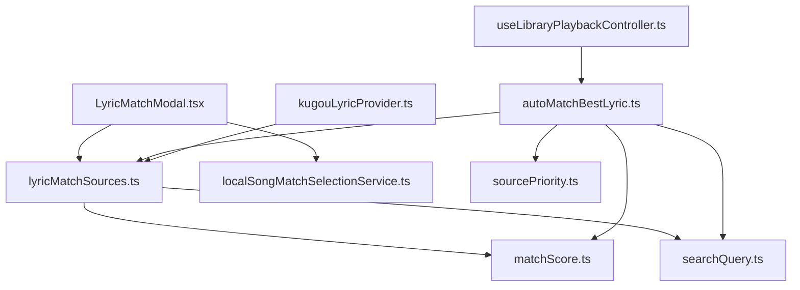
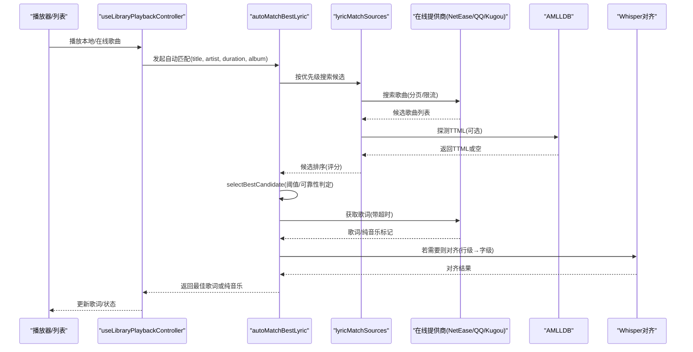
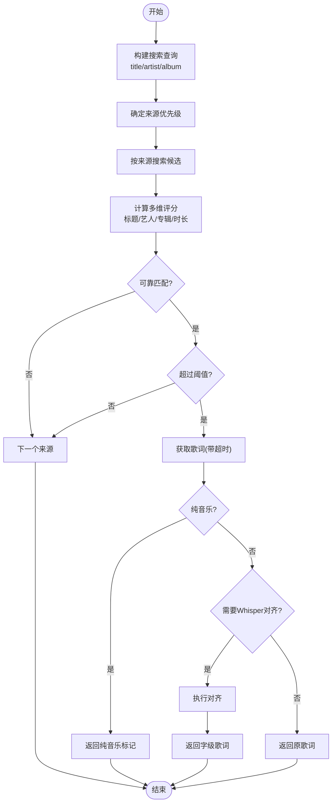
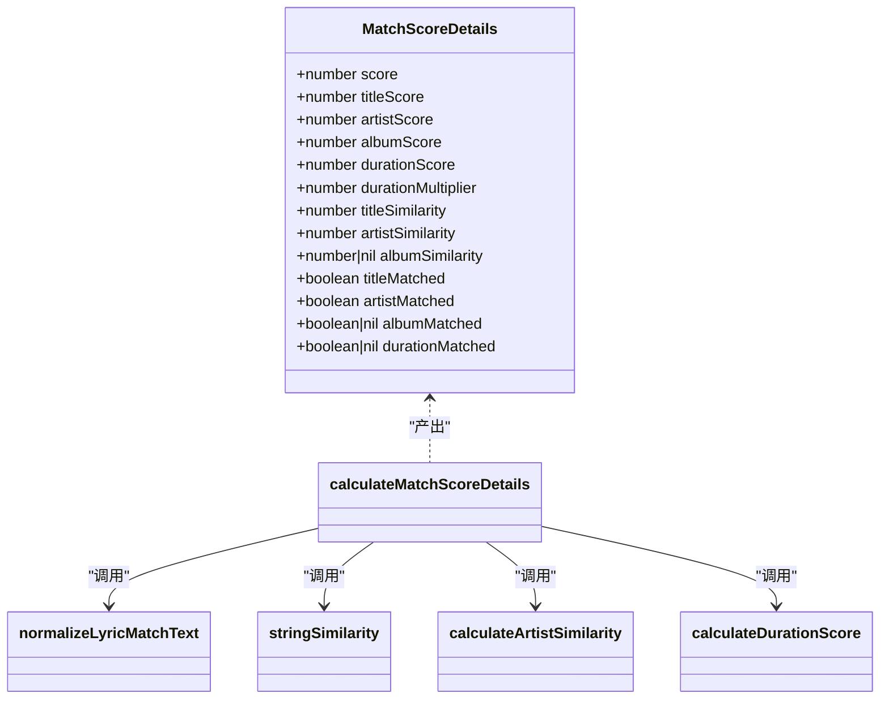
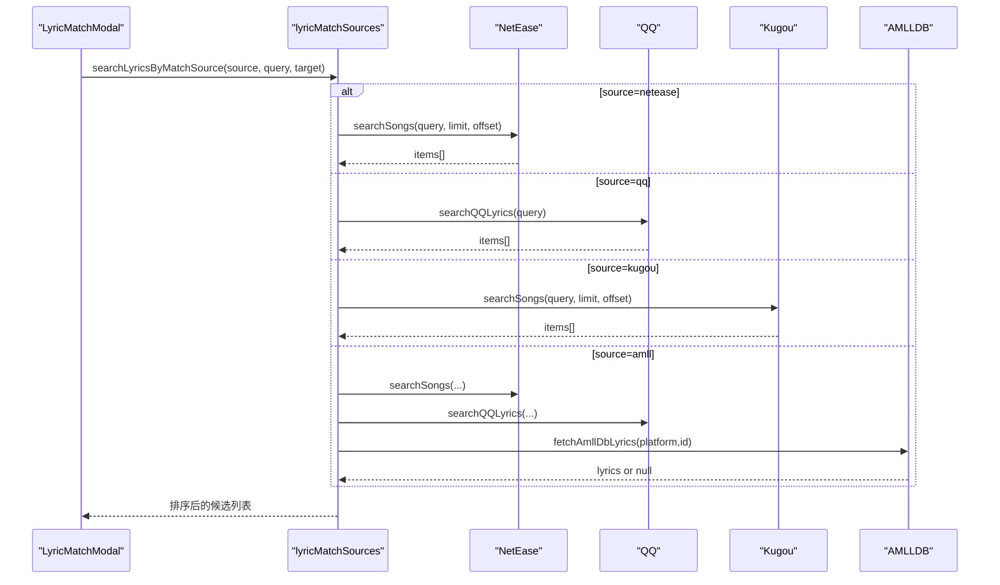
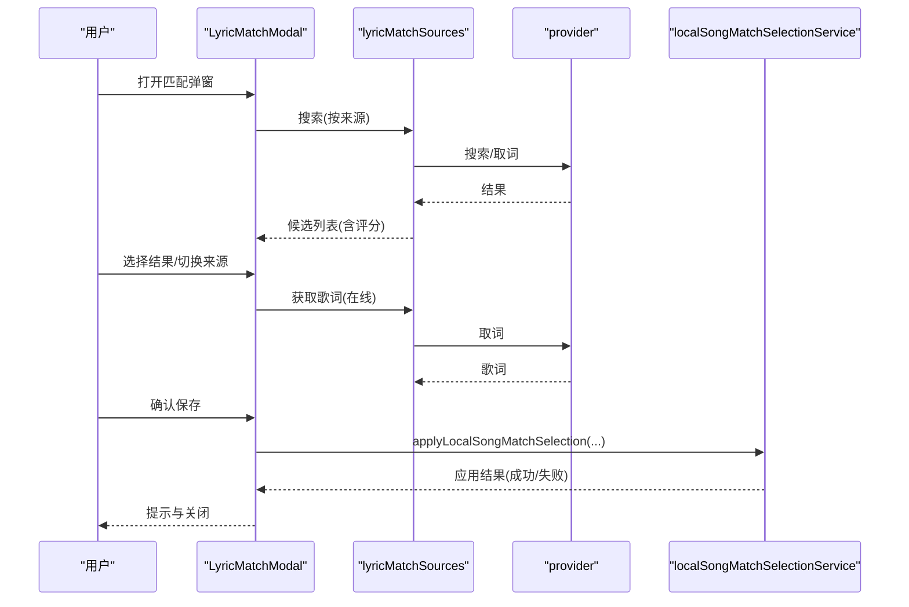
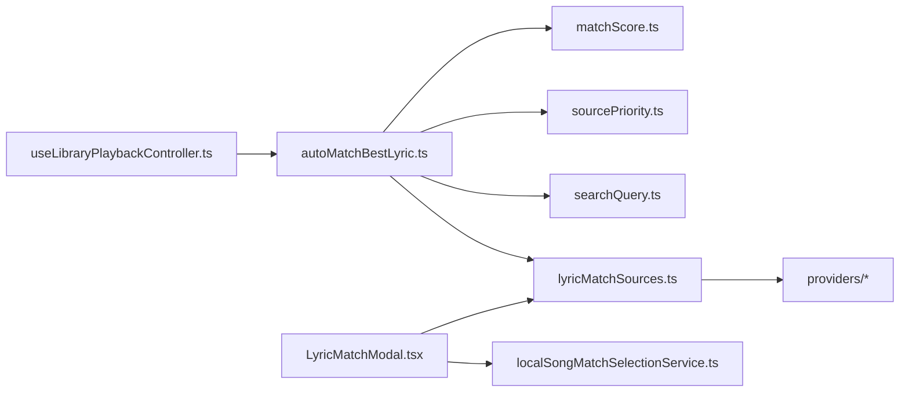

# 智能歌词匹配

<cite>
**本文引用的文件**
- [autoMatchBestLyric.ts](file://src/utils/lyrics/autoMatchBestLyric.ts)
- [matchScore.ts](file://src/utils/lyrics/matchScore.ts)
- [sourcePriority.ts](file://src/utils/lyrics/sourcePriority.ts)
- [lyricMatchSources.ts](file://src/utils/lyrics/lyricMatchSources.ts)
- [searchQuery.ts](file://src/utils/lyrics/searchQuery.ts)
- [LyricMatchModal.tsx](file://src/components/modal/LyricMatchModal.tsx)
- [localSongMatchSelectionService.ts](file://src/services/localSongMatchSelectionService.ts)
- [useLibraryPlaybackController.ts](file://src/hooks/useLibraryPlaybackController.ts)
- [kugouLyricProvider.ts](file://src/utils/lyrics/providers/kugouLyricProvider.ts)
</cite>

## 目录
1. [简介](#简介)
2. [项目结构](#项目结构)
3. [核心组件](#核心组件)
4. [架构总览](#架构总览)
5. [详细组件分析](#详细组件分析)
6. [依赖关系分析](#依赖关系分析)
7. [性能考量](#性能考量)
8. [故障排查指南](#故障排查指南)
9. [结论](#结论)
10. [附录](#附录)

## 简介
本技术文档聚焦 Folia Player 的智能歌词匹配系统，系统性解析自动匹配算法、多维度评分与置信度评估、手动修正界面交互、歌词来源优先级管理、模糊匹配与多语言兼容优化，以及批量处理与异步进度监控能力。目标是帮助开发者快速理解并扩展该子系统，同时为产品与测试提供可操作的参考。

## 项目结构
歌词匹配相关代码主要分布在以下模块：
- 自动匹配编排与超时控制：autoMatchBestLyric.ts
- 相似度计算与评分：matchScore.ts
- 来源优先级与迁移：sourcePriority.ts
- 搜索与取词入口（含 AMLLDB）：lyricMatchSources.ts
- 查询构建与归一化：searchQuery.ts
- 手动修正弹窗与交互：LyricMatchModal.tsx
- 选择应用与持久化：localSongMatchSelectionService.ts
- 播放链路中的自动匹配触发：useLibraryPlaybackController.ts
- 在线源适配示例：kugouLyricProvider.ts

图表来源
- [LyricMatchModal.tsx:1-200](file://src/components/modal/LyricMatchModal.tsx#L1-L200)
- [lyricMatchSources.ts:1-176](file://src/utils/lyrics/lyricMatchSources.ts#L1-L176)
- [matchScore.ts:1-219](file://src/utils/lyrics/matchScore.ts#L1-L219)
- [searchQuery.ts:1-72](file://src/utils/lyrics/searchQuery.ts#L1-L72)
- [autoMatchBestLyric.ts:1-582](file://src/utils/lyrics/autoMatchBestLyric.ts#L1-L582)
- [sourcePriority.ts:1-31](file://src/utils/lyrics/sourcePriority.ts#L1-L31)
- [useLibraryPlaybackController.ts:723-784](file://src/hooks/useLibraryPlaybackController.ts#L723-L784)
- [kugouLyricProvider.ts:158-202](file://src/utils/lyrics/providers/kugouLyricProvider.ts#L158-L202)

章节来源
- [LyricMatchModal.tsx:1-200](file://src/components/modal/LyricMatchModal.tsx#L1-L200)
- [autoMatchBestLyric.ts:1-582](file://src/utils/lyrics/autoMatchBestLyric.ts#L1-L582)
- [matchScore.ts:1-219](file://src/utils/lyrics/matchScore.ts#L1-L219)
- [sourcePriority.ts:1-31](file://src/utils/lyrics/sourcePriority.ts#L1-L31)
- [lyricMatchSources.ts:1-176](file://src/utils/lyrics/lyricMatchSources.ts#L1-L176)
- [searchQuery.ts:1-72](file://src/utils/lyrics/searchQuery.ts#L1-L72)
- [useLibraryPlaybackController.ts:723-784](file://src/hooks/useLibraryPlaybackController.ts#L723-L784)
- [kugouLyricProvider.ts:158-202](file://src/utils/lyrics/providers/kugouLyricProvider.ts#L158-L202)

## 核心组件
- 自动匹配编排器：按用户偏好顺序遍历来源，并行/串行获取候选歌曲，基于评分筛选最佳候选，必要时进行 Whisper 对齐。
- 评分与相似度：标题、艺术家、专辑、时长等多维度加权评分；支持罗马音转换、繁简转换、标点符号过滤、版本标记清洗等。
- 来源优先级：默认 netease > amlldb > qq > kugou > whisper，支持用户偏好前置。
- 搜索与取词：统一封装各来源搜索与歌词获取，包含 AMLLDB TTML 探测与合唱段落注入。
- 手动修正界面：展示搜索结果、评分详情、封面/艺人/专辑信息，支持在线/本地/内嵌歌词切换与保存。
- 选择应用服务：将用户选择写入本地歌曲元数据与歌词状态，支持封面缓存与来源标记。
- 播放控制器集成：在播放前预取/匹配歌词，支持纯音乐识别与自动回退策略。

章节来源
- [autoMatchBestLyric.ts:1-582](file://src/utils/lyrics/autoMatchBestLyric.ts#L1-L582)
- [matchScore.ts:1-219](file://src/utils/lyrics/matchScore.ts#L1-L219)
- [sourcePriority.ts:1-31](file://src/utils/lyrics/sourcePriority.ts#L1-L31)
- [lyricMatchSources.ts:1-176](file://src/utils/lyrics/lyricMatchSources.ts#L1-L176)
- [LyricMatchModal.tsx:1-200](file://src/components/modal/LyricMatchModal.tsx#L1-L200)
- [localSongMatchSelectionService.ts:1-118](file://src/services/localSongMatchSelectionService.ts#L1-L118)
- [useLibraryPlaybackController.ts:723-784](file://src/hooks/useLibraryPlaybackController.ts#L723-L784)

## 架构总览
下图展示了从播放到自动匹配的完整调用链路与数据来源。

图表来源
- [useLibraryPlaybackController.ts:723-784](file://src/hooks/useLibraryPlaybackController.ts#L723-L784)
- [autoMatchBestLyric.ts:170-582](file://src/utils/lyrics/autoMatchBestLyric.ts#L170-L582)
- [lyricMatchSources.ts:60-176](file://src/utils/lyrics/lyricMatchSources.ts#L60-L176)
- [kugouLyricProvider.ts:158-202](file://src/utils/lyrics/providers/kugouLyricProvider.ts#L158-L202)

## 详细组件分析

### 自动匹配算法与流程
- 输入：标题、艺术家、时长、专辑（可选）、用户偏好来源、是否仅精确匹配、是否启用 Whisper 对齐。
- 候选发现：按优先级顺序对 NetEase、AMLLDB、QQ、Kugou 进行搜索与取词，每个来源具备独立超时保护。
- 候选评分：使用多维度相似度与权重计算综合得分，并进行“可靠匹配”判定（标题命中且至少艺术家或专辑身份匹配）。
- 阈值与置信度：最低分数阈值（例如 75%），低于阈值的候选被丢弃；当标题或身份字段未命中时，对总分进行封顶以抑制误匹配。
- 纯音乐识别：任一来源返回纯音乐即短路返回，避免继续匹配。
- Whisper 对齐：若存在行级歌词但无字级时间戳，且设置开启，则尝试通过音频转录对齐为字级歌词。

图表来源
- [autoMatchBestLyric.ts:170-582](file://src/utils/lyrics/autoMatchBestLyric.ts#L170-L582)
- [matchScore.ts:155-219](file://src/utils/lyrics/matchScore.ts#L155-L219)
- [sourcePriority.ts:1-31](file://src/utils/lyrics/sourcePriority.ts#L1-L31)

章节来源
- [autoMatchBestLyric.ts:170-582](file://src/utils/lyrics/autoMatchBestLyric.ts#L170-L582)
- [matchScore.ts:155-219](file://src/utils/lyrics/matchScore.ts#L155-L219)
- [sourcePriority.ts:1-31](file://src/utils/lyrics/sourcePriority.ts#L1-L31)

### 评分系统与置信度评估
- 权重分配：标题 45%，艺术家 25%，专辑 30%；时长作为乘数因子影响最终得分。
- 文本归一化：罗马音转换、繁转简、去除标点与多余空格、版本标记清洗（如 instrumental/remix/live 等）。
- 相似度计算：采用字符集 Jaccard 相似度，并对包含关系做长度比例补偿。
- 艺术家匹配：拆分多艺人组合，主艺人命中给予额外加分；整体 token 匹配率与字符串相似度取高值。
- 专辑匹配：仅在双方均存在专辑名时计算；未知专辑视为空。
- 时长匹配：差值≤1s 完全匹配，≤3s 强匹配，≤5s 中等，≤10s 弱匹配，>10s 极低；无时长信息时给予保守乘数。
- 置信度控制：当标题或身份字段未命中时，对身份分封顶，防止低质量候选进入后续流程。

图表来源
- [matchScore.ts:1-219](file://src/utils/lyrics/matchScore.ts#L1-L219)

章节来源
- [matchScore.ts:1-219](file://src/utils/lyrics/matchScore.ts#L1-L219)

### 歌词来源优先级与数据获取机制
- 默认顺序：netease → amlldb → qq → kugou → whisper。
- 用户偏好：可将某一来源置前，其余保持原有顺序且不重复。
- 搜索与取词：
  - NetEase/QQ/Kugou：通过各自 provider 搜索歌曲，再取歌词。
  - AMLLDB：先搜索 NetEase/QQ 候选，筛选满足标题与身份匹配且时长不冲突的候选，再探测是否存在 TTML；NCM 平台缺失合唱标记时会回退至 NetEase 合唱区间注入。
  - Whisper：非搜索来源，用于对齐已有行级歌词。
- 超时与容错：每个来源搜索与取词均有独立超时，失败不影响其他来源。

图表来源
- [lyricMatchSources.ts:60-176](file://src/utils/lyrics/lyricMatchSources.ts#L60-L176)
- [kugouLyricProvider.ts:158-202](file://src/utils/lyrics/providers/kugouLyricProvider.ts#L158-L202)

章节来源
- [sourcePriority.ts:1-31](file://src/utils/lyrics/sourcePriority.ts#L1-L31)
- [lyricMatchSources.ts:1-176](file://src/utils/lyrics/lyricMatchSources.ts#L1-L176)
- [kugouLyricProvider.ts:158-202](file://src/utils/lyrics/providers/kugouLyricProvider.ts#L158-L202)

### 手动修正界面设计与交互
- 搜索与展示：根据当前歌曲元数据构建查询，按所选来源搜索并展示结果；每条结果展示评分百分比、时长匹配徽章、艺人/专辑信息与封面。
- 来源切换：支持 netease/amll/qq/kugou/whisper（whisper 需功能可用）。
- 歌词来源选择：在线/本地/内嵌/自动，选择在线歌词时自动拉取对应来源歌词。
- 元数据覆盖保护：当覆盖受保护的艺人/专辑元数据时弹出确认。
- 保存与反馈：保存后更新本地歌曲元数据与歌词状态，提示部分失败或封面缓存失败情况。

图表来源
- [LyricMatchModal.tsx:1-200](file://src/components/modal/LyricMatchModal.tsx#L1-L200)
- [localSongMatchSelectionService.ts:1-118](file://src/services/localSongMatchSelectionService.ts#L1-L118)

章节来源
- [LyricMatchModal.tsx:1-200](file://src/components/modal/LyricMatchModal.tsx#L1-L200)
- [localSongMatchSelectionService.ts:1-118](file://src/services/localSongMatchSelectionService.ts#L1-L118)

### 播放链路中的自动匹配集成
- 播放前预取：优先使用已匹配歌词，否则尝试在线优先或本地/内嵌歌词；若无则触发自动匹配。
- 自动匹配：构造目标信息（标题、艺人、时长、专辑），调用 autoMatchBestLyric，支持首选来源与 Whisper 对齐开关。
- 纯音乐处理：若检测到纯音乐，跳过歌词并标记。
- 结果回填：将匹配到的歌词、来源、平台等信息写回歌曲对象，便于后续渲染与缓存。

章节来源
- [useLibraryPlaybackController.ts:723-784](file://src/hooks/useLibraryPlaybackController.ts#L723-L784)
- [useLibraryPlaybackController.ts:407-484](file://src/hooks/useLibraryPlaybackController.ts#L407-L484)

### 模糊匹配与多语言兼容优化
- 多语言归一化：罗马音转换、繁转简、全角半角统一、标点与特殊符号移除。
- 版本标记清洗：自动剔除 instrumental/remix/live/cover 等后缀与括号内容，提升标题匹配鲁棒性。
- 艺人拆分与主艺人加分：支持多种分隔符拆分艺人，主艺人命中给予保底相似度。
- 专辑名称压缩：超长专辑名裁剪与注释清理，提高搜索命中率。

章节来源
- [matchScore.ts:38-81](file://src/utils/lyrics/matchScore.ts#L38-L81)
- [matchScore.ts:119-153](file://src/utils/lyrics/matchScore.ts#L119-L153)
- [searchQuery.ts:8-61](file://src/utils/lyrics/searchQuery.ts#L8-L61)

### 批量处理与异步进度监控
- 批量搜索：lyricMatchSources 支持对多个来源并发搜索与探测（如 AMLLDB 多候选并行探测），并通过评分排序输出。
- 超时隔离：每个来源搜索/取词独立超时，避免单点阻塞。
- 进度反馈：Whisper 对齐提供 onProgress 回调，前端实时更新进度条与状态标签；错误路径保证最小可见时长以提升体验。
- 批量保存：LyricMatchModal 支持一次选择后保存，后续可扩展为多选批量应用（当前实现为单首保存，批量逻辑可在上层队列中复用 applyLocalSongMatchSelection）。

章节来源
- [lyricMatchSources.ts:60-105](file://src/utils/lyrics/lyricMatchSources.ts#L60-L105)
- [autoMatchBestLyric.ts:144-162](file://src/utils/lyrics/autoMatchBestLyric.ts#L144-L162)
- [LyricMatchModal.tsx:171-232](file://src/components/modal/LyricMatchModal.tsx#L171-L232)
- [WhisperSettingsPanel.tsx:63-120](file://src/components/shared/WhisperSettingsPanel.tsx#L63-L120)

## 依赖关系分析
- 耦合与内聚：
  - autoMatchBestLyric 高度内聚于评分、来源优先级与取词流程，职责清晰。
  - lyricMatchSources 聚合各来源搜索与取词，屏蔽差异，降低上层复杂度。
  - matchScore 独立于来源，专注相似度与评分，易于单元测试与调优。
- 外部依赖：
  - 在线提供商（NetEase/QQ/Kugou）通过 providerRegistry 接入。
  - AMLLDB 作为 TTML 补充来源，依赖 NetEase/QQ 候选 ID。
  - Whisper 对齐依赖音频与模型可用性。
- 循环依赖：未发现直接循环依赖；模块间通过接口与类型解耦。

图表来源
- [autoMatchBestLyric.ts:1-582](file://src/utils/lyrics/autoMatchBestLyric.ts#L1-L582)
- [lyricMatchSources.ts:1-176](file://src/utils/lyrics/lyricMatchSources.ts#L1-L176)
- [matchScore.ts:1-219](file://src/utils/lyrics/matchScore.ts#L1-L219)
- [sourcePriority.ts:1-31](file://src/utils/lyrics/sourcePriority.ts#L1-L31)
- [searchQuery.ts:1-72](file://src/utils/lyrics/searchQuery.ts#L1-L72)
- [LyricMatchModal.tsx:1-200](file://src/components/modal/LyricMatchModal.tsx#L1-L200)
- [localSongMatchSelectionService.ts:1-118](file://src/services/localSongMatchSelectionService.ts#L1-L118)
- [useLibraryPlaybackController.ts:723-784](file://src/hooks/useLibraryPlaybackController.ts#L723-L784)

章节来源
- [autoMatchBestLyric.ts:1-582](file://src/utils/lyrics/autoMatchBestLyric.ts#L1-L582)
- [lyricMatchSources.ts:1-176](file://src/utils/lyrics/lyricMatchSources.ts#L1-L176)
- [matchScore.ts:1-219](file://src/utils/lyrics/matchScore.ts#L1-L219)
- [sourcePriority.ts:1-31](file://src/utils/lyrics/sourcePriority.ts#L1-L31)
- [searchQuery.ts:1-72](file://src/utils/lyrics/searchQuery.ts#L1-L72)
- [LyricMatchModal.tsx:1-200](file://src/components/modal/LyricMatchModal.tsx#L1-L200)
- [localSongMatchSelectionService.ts:1-118](file://src/services/localSongMatchSelectionService.ts#L1-L118)
- [useLibraryPlaybackController.ts:723-784](file://src/hooks/useLibraryPlaybackController.ts#L723-L784)

## 性能考量
- 超时控制：搜索与取词分别设置超时，避免慢源拖垮整体匹配。
- 候选限制：每来源限制候选数量，减少不必要的网络请求与计算。
- 评分开销：Jaccard 相似度与字符串归一化成本较低，适合实时匹配。
- 并发探测：AMLLDB 多候选并行探测，缩短 TTML 查找时间。
- 缓存策略：在线歌词与封面缓存可减少重复请求；本地歌词与内嵌歌词优先读取。
- Whisper 对齐：仅在必要时触发，避免不必要的音频处理开销。

[本节为通用性能建议，无需特定文件引用]

## 故障排查指南
- 无匹配结果：
  - 检查标题/艺人/专辑是否有效，必要时手动修正。
  - 查看各来源是否超时或返回空；调整首选来源或放宽阈值。
- 匹配质量不佳：
  - 检查评分细节（标题/艺人/专辑/时长），针对性优化元数据。
  - 启用或禁用 Whisper 对齐，对比效果。
- 纯音乐误判：
  - 确认来源返回的纯音乐标记是否正确；必要时关闭自动匹配或切换来源。
- 保存失败：
  - 检查在线歌词获取是否失败；查看封面缓存是否成功。
  - 确认受保护元数据覆盖是否获得用户确认。

章节来源
- [LyricMatchModal.tsx:171-232](file://src/components/modal/LyricMatchModal.tsx#L171-L232)
- [localSongMatchSelectionService.ts:80-118](file://src/services/localSongMatchSelectionService.ts#L80-L118)
- [autoMatchBestLyric.ts:144-162](file://src/utils/lyrics/autoMatchBestLyric.ts#L144-L162)

## 结论
Folia Player 的智能歌词匹配系统通过多维度评分、严格阈值与置信度控制、灵活的来源优先级与超时隔离，实现了高鲁棒性的自动匹配。手动修正界面提供了直观的交互与保护机制，确保用户可控性与数据一致性。结合 Whisper 对齐与 AMLLDB TTML 探测，系统在多语言与复杂场景下仍能提供高质量的字级歌词。未来可在批量处理、更多来源接入与更细粒度的评分调优方面持续演进。

[本节为总结，无需特定文件引用]

## 附录
- 关键常量与阈值：
  - 自动匹配最低分数阈值：约 75%
  - 搜索限制：每来源最多 10 个候选
  - 超时：搜索 3.5s，取词 5s
- 推荐实践：
  - 优先完善本地元数据（标题、艺人、专辑、时长）
  - 合理设置首选来源，兼顾稳定性与质量
  - 在需要时启用 Whisper 对齐以获得更精准的字级时间戳

[本节为补充信息，无需特定文件引用]