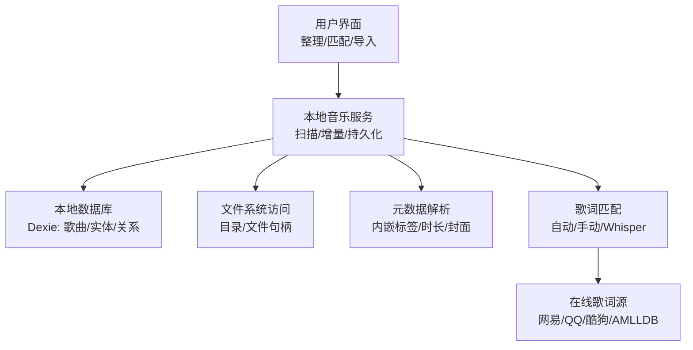
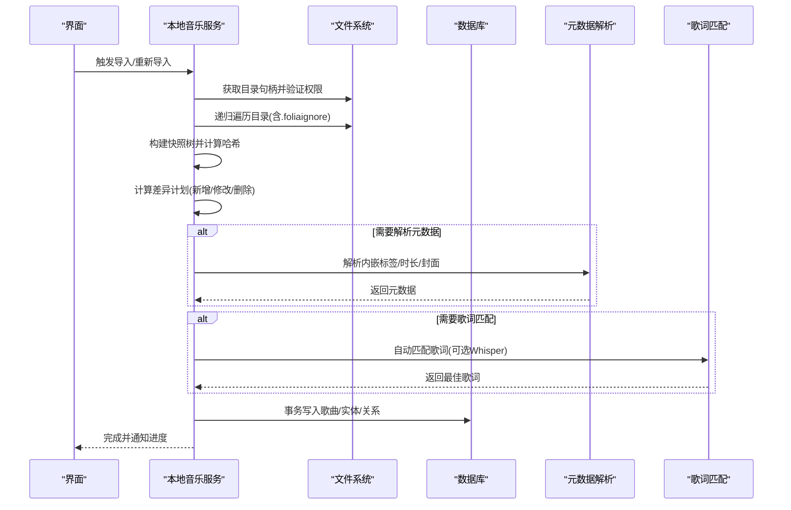
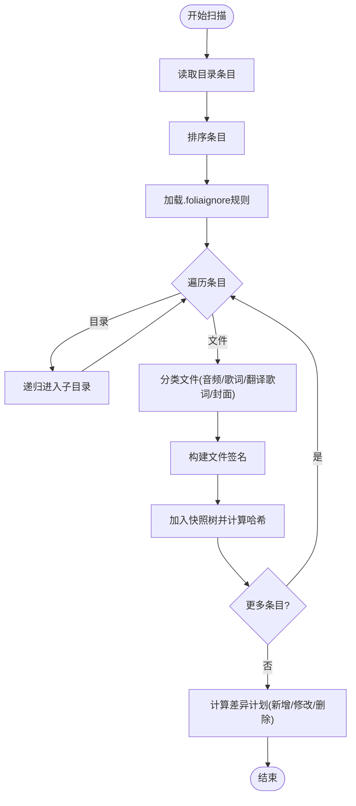
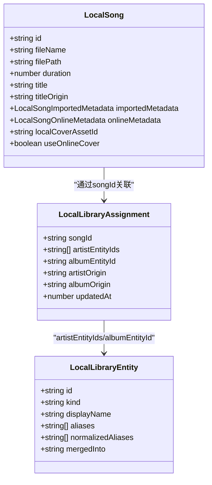
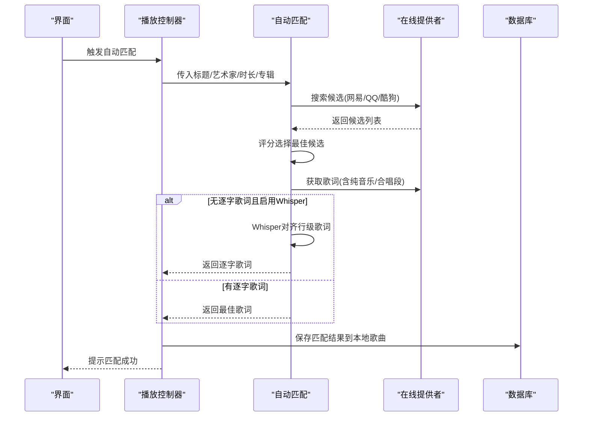
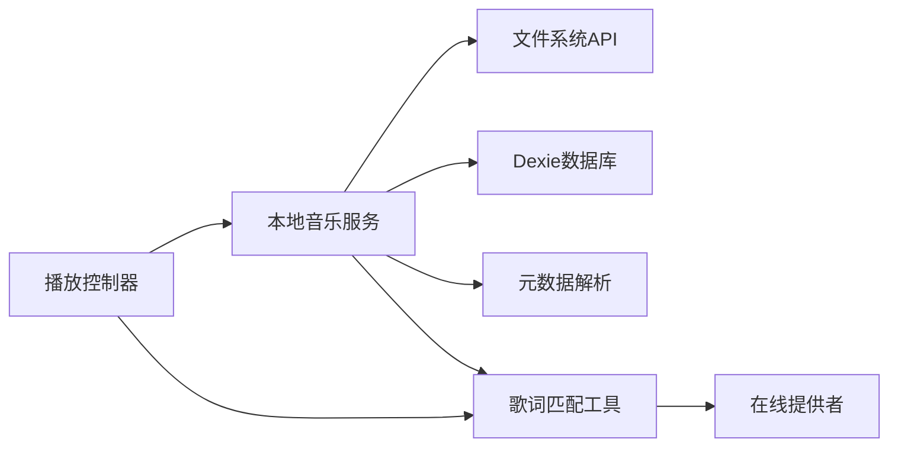

# 本地音乐库管理

<cite>
**本文引用的文件**
- [local-library-management.md](file://docs/local-library-management.md)
- [localMusicService.ts](file://src/services/localMusicService.ts)
- [localLibraryCatalogService.ts](file://src/services/localLibraryCatalogService.ts)
- [localLibrary.ts](file://src/types/localLibrary.ts)
- [types.ts](file://src/types.ts)
- [autoMatchBestLyric.ts](file://src/utils/lyrics/autoMatchBestLyric.ts)
- [useLibraryPlaybackController.ts](file://src/hooks/useLibraryPlaybackController.ts)
- [LocalFolderSongInfoPanel.tsx](file://src/components/modal/LocalFolderSongInfoPanel.tsx)
</cite>

## 目录
1. [简介](#简介)
2. [项目结构](#项目结构)
3. [核心组件](#核心组件)
4. [架构总览](#架构总览)
5. [详细组件分析](#详细组件分析)
6. [依赖关系分析](#依赖关系分析)
7. [性能考虑](#性能考虑)
8. [故障排除指南](#故障排除指南)
9. [结论](#结论)
10. [附录](#附录)

## 简介
本技术文档聚焦 Folia Player 的本地音乐库管理能力，覆盖以下关键主题：
- 本地文件扫描算法：递归目录遍历、音频格式识别、歌词与封面关联、增量扫描。
- 音乐实体模型设计：歌曲、专辑、艺术家之间的关系映射与持久化策略。
- 智能歌词匹配系统：自动匹配、手动修正界面、批量处理流程。
- 歌单系统：动态/静态歌单、导入导出 M3U/M3U8。
- 性能优化：索引建立、增量扫描、缓存策略。
- 故障排除：权限、编码、元数据缺失等常见问题。

## 项目结构
本地音乐库相关能力主要分布在服务层、类型定义、工具层与 UI 层：
- 服务层：负责目录扫描、增量差异计算、元数据解析、实体与关系变更、歌词匹配触发。
- 类型层：定义本地歌曲、实体、分配关系、在线元数据等稳定数据结构。
- 工具层：歌词自动匹配、搜索查询构建、时长归一化、来源优先级等。
- UI 层：提供“整理歌曲信息”、“手动匹配”、“批量自动匹配”等操作入口。

图表来源
- [localMusicService.ts:413-530](file://src/services/localMusicService.ts#L413-L530)
- [localLibraryCatalogService.ts:42-111](file://src/services/localLibraryCatalogService.ts#L42-L111)
- [autoMatchBestLyric.ts:170-582](file://src/utils/lyrics/autoMatchBestLyric.ts#L170-L582)

章节来源
- [local-library-management.md:1-270](file://docs/local-library-management.md#L1-L270)

## 核心组件
- 本地音乐服务（扫描与增量）：实现递归目录遍历、忽略规则、文件签名、增量差异计划、并发导入、歌词与封面候选收集。
- 目录树与快照：构建目录快照树并计算哈希，用于快速对比前后版本变化。
- 实体与关系：维护艺术家/专辑实体及歌曲分配关系，支持合并、拆分、展示名修改。
- 歌词自动匹配：跨多平台搜索与取词，评分选择最佳候选，必要时启用 Whisper 对齐。
- 播放控制器集成：在播放时按需触发自动匹配，更新本地歌曲记录与歌词状态。
- 歌单导入导出：M3U/M3U8 兼容路径解析与相对路径生成。

章节来源
- [localMusicService.ts:35-92](file://src/services/localMusicService.ts#L35-L92)
- [localMusicService.ts:413-530](file://src/services/localMusicService.ts#L413-L530)
- [localLibraryCatalogService.ts:42-111](file://src/services/localLibraryCatalogService.ts#L42-L111)
- [autoMatchBestLyric.ts:170-582](file://src/utils/lyrics/autoMatchBestLyric.ts#L170-L582)
- [useLibraryPlaybackController.ts:380-402](file://src/hooks/useLibraryPlaybackController.ts#L380-L402)
- [local-library-management.md:219-229](file://docs/local-library-management.md#L219-L229)

## 架构总览
本地音乐库采用“扫描-快照-差异-应用”的分层架构：
- 扫描阶段：递归遍历目录，读取 .foliaignore，分类文件为音频、歌词、翻译歌词、封面等。
- 快照阶段：构建目录树节点，计算文件与子节点的哈希，形成可比较的快照。
- 差异阶段：对比新旧快照，识别新增、修改、删除的文件，生成导入差异计划。
- 应用阶段：按差异计划解析元数据、关联歌词与封面、写入数据库事务，保证一致性。

图表来源
- [localMusicService.ts:413-530](file://src/services/localMusicService.ts#L413-L530)
- [localMusicService.ts:560-728](file://src/services/localMusicService.ts#L560-L728)
- [localLibraryCatalogService.ts:42-111](file://src/services/localLibraryCatalogService.ts#L42-L111)
- [autoMatchBestLyric.ts:170-582](file://src/utils/lyrics/autoMatchBestLyric.ts#L170-L582)

## 详细组件分析

### 本地文件扫描与增量算法
- 递归目录遍历：使用异步迭代器遍历目录条目，排序后逐条处理；遇到不可读目录或文件时记录警告并跳过。
- 忽略规则：加载当前目录的 .foliaignore，继承父级规则，支持通配符、否定规则与层级匹配。
- 文件分类与优先级：
  - 音频：mp3/flac/m4a/wav/ogg/opus/aac。
  - 歌词：lrc/vtt/ttml/qrc/yrc/krc，优先顺序由文件名决定。
  - 翻译歌词：.t.lrc/.t.vtt。
  - 文件夹封面：cover.png/jpg/jpeg，优先级高于内嵌封面。
- 增量扫描：通过文件签名（相对路径+大小+修改时间）与快照哈希对比，仅对变化的音频/歌词/封面执行重解析。
- 并发控制：导入阶段使用固定并发度处理文件，避免阻塞主线程。

图表来源
- [localMusicService.ts:413-530](file://src/services/localMusicService.ts#L413-L530)
- [localMusicService.ts:560-728](file://src/services/localMusicService.ts#L560-L728)

章节来源
- [localMusicService.ts:413-530](file://src/services/localMusicService.ts#L413-L530)
- [localMusicService.ts:560-728](file://src/services/localMusicService.ts#L560-L728)
- [local-library-management.md:59-93](file://docs/local-library-management.md#L59-L93)

### 元数据提取与歌词/封面关联
- 元数据提取：调用元数据解析客户端，从音频文件中提取标题、艺术家、专辑、曲号、碟号、时长、ReplayGain、内嵌歌词与内嵌封面。
- 歌词关联：根据音频基础路径匹配同目录歌词文件，支持 track.lrc 与 track.mp3.lrc 两种命名方式；翻译歌词使用 .t 后缀。
- 封面关联：优先使用文件夹封面，其次回退到每首歌的第一张内嵌图片；相同内容图片去重存储。
- 增量策略：当歌词或封面文件发生变化时，标记对应音频需重新处理；若封面被移除，则重新读取内嵌封面。

章节来源
- [localMusicService.ts:730-800](file://src/services/localMusicService.ts#L730-L800)
- [local-library-management.md:21-47](file://docs/local-library-management.md#L21-L47)

### 音乐实体模型与持久化
- 实体类型：艺术家与专辑作为稳定的本地实体，包含显示名、别名、归一化别名、合并目标等字段。
- 歌曲分配：每首歌曲与一个或多个艺术家实体关联，并可归属一个专辑实体；分配来源包括导入、自动匹配、手动匹配、手工拆分。
- 持久化策略：所有变更在 Dexie 事务中批量提交，确保歌曲、实体、关系的一致性；删除歌曲时清理孤儿实体与未引用封面资产。
- 名称清洗与解析：对艺术家与专辑名称进行清洗与标准化，支持多艺术家拆分与合并。

图表来源
- [types.ts:1157-1201](file://src/types.ts#L1157-L1201)
- [localLibrary.ts:6-16](file://src/types/localLibrary.ts#L6-L16)
- [localLibrary.ts:46-53](file://src/types/localLibrary.ts#L46-L53)

章节来源
- [localLibrary.ts:6-16](file://src/types/localLibrary.ts#L6-L16)
- [localLibrary.ts:46-53](file://src/types/localLibrary.ts#L46-L53)
- [localLibraryCatalogService.ts:42-111](file://src/services/localLibraryCatalogService.ts#L42-L111)
- [localLibraryCatalogService.ts:209-245](file://src/services/localLibraryCatalogService.ts#L209-L245)

### 智能歌词匹配系统
- 自动匹配流程：
  - 构建搜索查询：基于标题、艺术家、专辑组合。
  - 多源搜索：网易云优先，其次 QQ 音乐，最后酷狗音乐；支持精确匹配模式。
  - 评分选择：根据标题、艺术家、专辑、时长匹配度计算分数，筛选可靠候选。
  - 歌词获取：获取候选歌曲的歌词，支持纯音乐检测与合唱段标记。
  - Whisper 对齐：若无逐字歌词但存在行级歌词，且启用设置，则尝试 AI 对齐生成逐字歌词。
- 手动修正界面：
  - 提供“整理歌曲信息”入口，支持修改检索文字、切换来源、预览应用效果。
  - 支持分别决定是否使用在线元数据与在线封面。
- 批量处理：
  - 批量自动匹配会保护已手工调整的关系，避免被普通重扫覆盖。
  - 运行过程中可随时取消任务。

图表来源
- [autoMatchBestLyric.ts:170-582](file://src/utils/lyrics/autoMatchBestLyric.ts#L170-L582)
- [useLibraryPlaybackController.ts:1185-1300](file://src/hooks/useLibraryPlaybackController.ts#L1185-L1300)
- [LocalFolderSongInfoPanel.tsx:39-59](file://src/components/modal/LocalFolderSongInfoPanel.tsx#L39-L59)

章节来源
- [autoMatchBestLyric.ts:170-582](file://src/utils/lyrics/autoMatchBestLyric.ts#L170-L582)
- [useLibraryPlaybackController.ts:380-402](file://src/hooks/useLibraryPlaybackController.ts#L380-L402)
- [useLibraryPlaybackController.ts:1185-1300](file://src/hooks/useLibraryPlaybackController.ts#L1185-L1300)
- [LocalFolderSongInfoPanel.tsx:39-59](file://src/components/modal/LocalFolderSongInfoPanel.tsx#L39-L59)
- [local-library-management.md:127-179](file://docs/local-library-management.md#L127-L179)

### 歌单系统架构
- 动态歌单：由用户在 Folia 中创建，仅保存歌曲引用，不复制音频文件。
- 静态歌单：从队列保存或导入 M3U/M3U8 文件，导入时匹配已导入根目录中的路径。
- 导入导出：
  - 导入：兼容绝对路径、相对路径、file:// 地址与斜杠分隔；无法匹配的路径会被跳过并统计数量。
  - 导出：UTF-8 编码，保留顺序；同一根目录时使用相对路径，多根目录时保留根目录名称以便移植。
- 删除同步：从曲库删除歌曲或文件夹时，对应歌曲也会从本地歌单中移除。

章节来源
- [local-library-management.md:213-229](file://docs/local-library-management.md#L213-L229)

## 依赖关系分析
- 本地音乐服务依赖：
  - 文件系统访问 API：用于目录选择、权限检查与递归遍历。
  - 元数据解析客户端：用于内嵌标签与时长解析。
  - 数据库：Dexie 事务写入歌曲、实体、关系。
  - 歌词匹配工具：自动匹配、搜索查询、时长归一化、来源优先级。
  - 在线提供者注册表：访问网易/QQ/酷狗等平台接口。
- 播放控制器依赖：
  - 本地音乐服务：触发自动匹配与更新本地歌曲。
  - 歌词匹配工具：构建匹配上下文并执行自动匹配。
  - 数据库：持久化匹配结果与歌词来源偏好。

图表来源
- [localMusicService.ts:1-29](file://src/services/localMusicService.ts#L1-L29)
- [autoMatchBestLyric.ts:1-14](file://src/utils/lyrics/autoMatchBestLyric.ts#L1-L14)
- [useLibraryPlaybackController.ts:380-402](file://src/hooks/useLibraryPlaybackController.ts#L380-L402)

章节来源
- [localMusicService.ts:1-29](file://src/services/localMusicService.ts#L1-L29)
- [autoMatchBestLyric.ts:1-14](file://src/utils/lyrics/autoMatchBestLyric.ts#L1-L14)
- [useLibraryPlaybackController.ts:380-402](file://src/hooks/useLibraryPlaybackController.ts#L380-L402)

## 性能考虑
- 索引建立：
  - 目录快照树与哈希用于快速对比，避免全量重扫。
  - 文件签名（路径+大小+修改时间）用于增量判断。
- 增量扫描：
  - 仅对变化的音频、歌词、封面执行重解析。
  - 已应用的在线匹配与手工关系不会被普通重扫覆盖。
- 缓存策略：
  - 封面二进制按内容标识去重存储，减少重复写入。
  - 在线封面缓存仅保存地址与轻量描述，可重建。
  - 导入阶段对文件夹封面进行 Promise 缓存，避免重复读取。
- 并发控制：
  - 导入阶段使用固定并发度处理文件，平衡 I/O 与 UI 响应。
  - 歌词匹配对各平台搜索与取词设置超时，防止阻塞。

章节来源
- [localMusicService.ts:377-403](file://src/services/localMusicService.ts#L377-L403)
- [localMusicService.ts:784-798](file://src/services/localMusicService.ts#L784-L798)
- [autoMatchBestLyric.ts:18-22](file://src/utils/lyrics/autoMatchBestLyric.ts#L18-L22)
- [local-library-management.md:236-248](file://docs/local-library-management.md#L236-L248)

## 故障排除指南
- 导入按钮不可用：浏览器不支持 File System Access API，建议使用桌面版或支持目录选择的浏览器。
- 重启后无法播放本地歌曲：恢复目录访问权限；若目录移动或改名，重新导入该目录。
- 自动匹配选错歌曲：进入“整理歌曲信息”，修改检索文字并切换来源后手动选择；或选择“使用本地信息”恢复导入快照。
- 艺术家或专辑错误合并：打开对应集合，进入实体信息面板，拆分成员到新实体或已有实体。
- 删除曲库不会删除磁盘文件：删除操作仅影响 Folia 的本地记录。
- 权限问题：重新授权目录访问；若权限被操作系统收回，按界面提示恢复。
- 编码格式：歌词文件支持多种格式，若出现乱码，检查文件编码与命名是否符合规范。
- 元数据缺失：缺少标题或艺术家时，会从文件名提取基础信息；必要时手动修正。

章节来源
- [local-library-management.md:249-270](file://docs/local-library-management.md#L249-L270)

## 结论
Folia 的本地音乐库管理通过递归扫描、增量差异、实体关系与智能歌词匹配，实现了高效、可靠的本地音乐组织能力。其架构清晰、扩展性强，支持多平台歌词匹配与 AI 对齐，同时提供完善的歌单导入导出与性能优化策略。对于常见故障，提供了明确的排查与修复指引，确保用户体验稳定。

## 附录
- 支持的音频格式：MP3、FLAC、M4A、WAV、OGG、Opus、AAC。
- 支持的歌词格式：LRC、VTT、TTML、QRC、YRC、KRC，以及翻译歌词 .t.lrc/.t.vtt。
- 文件夹封面优先级：cover.png > cover.jpg > cover.jpeg。
- 忽略规则语法：参考 .gitignore 风格，支持通配符、否定规则与层级匹配。

章节来源
- [local-library-management.md:7-47](file://docs/local-library-management.md#L7-L47)
- [local-library-management.md:59-93](file://docs/local-library-management.md#L59-L93)