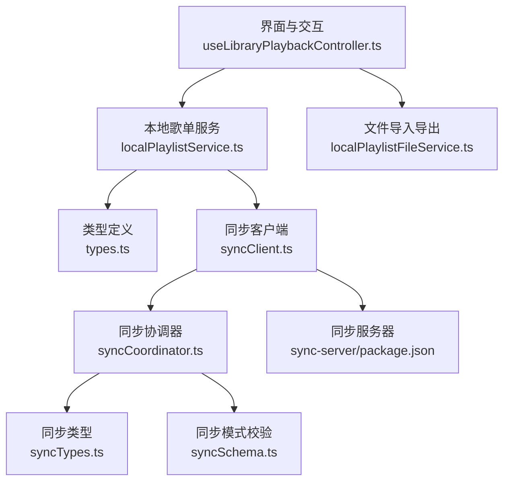
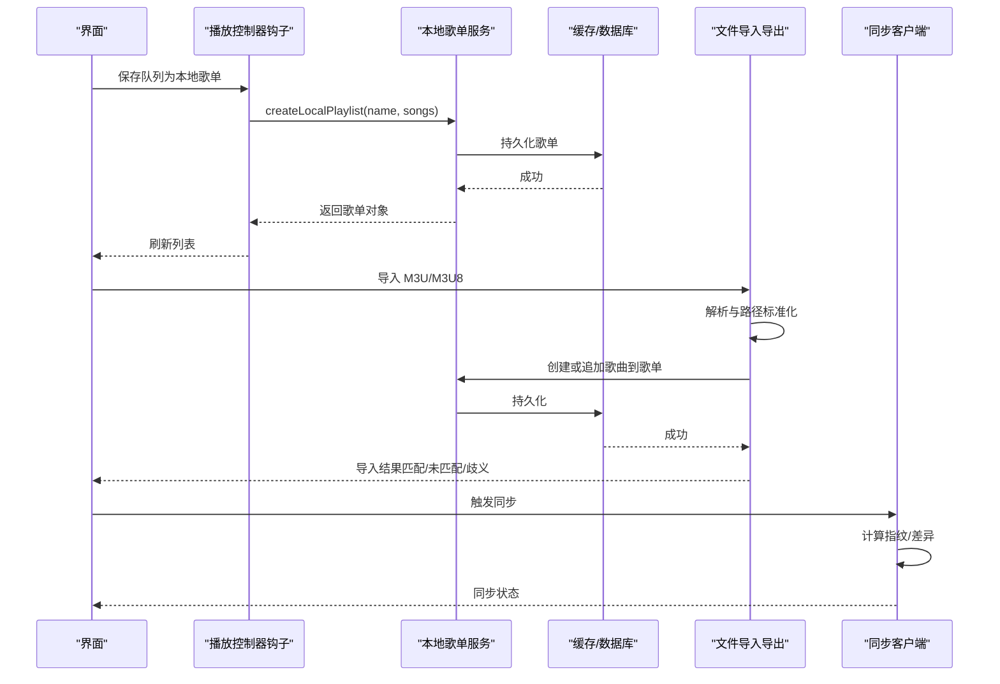
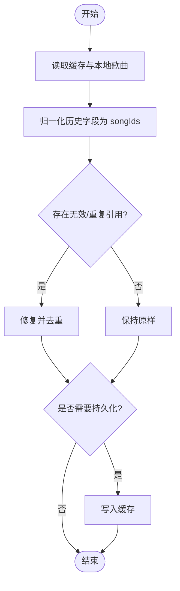
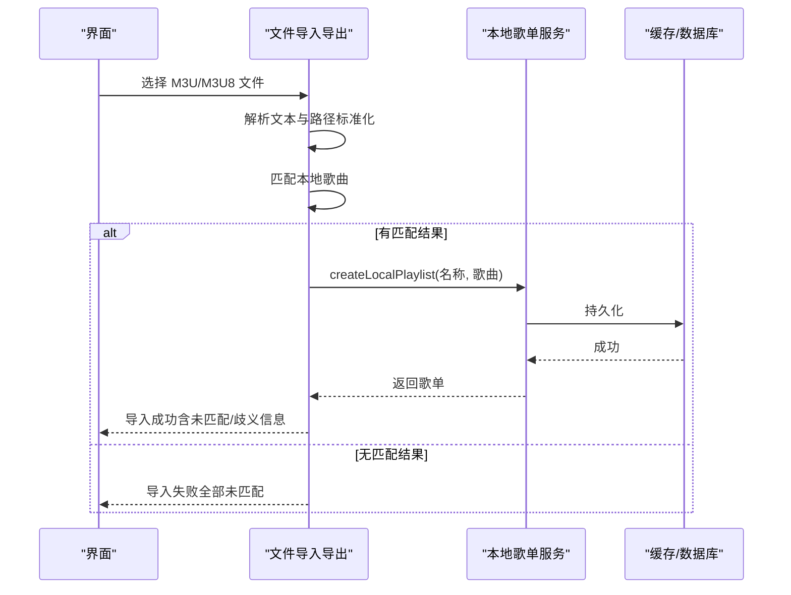
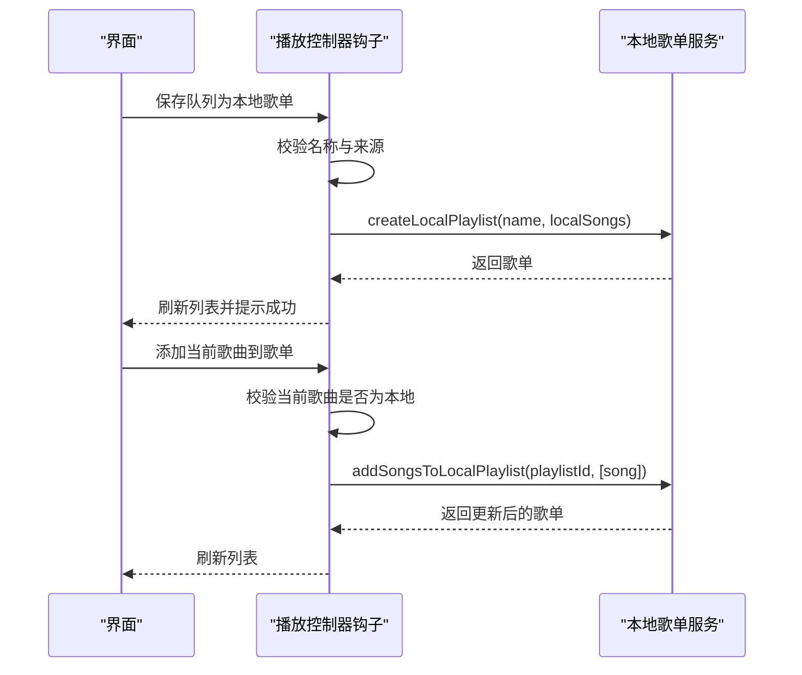
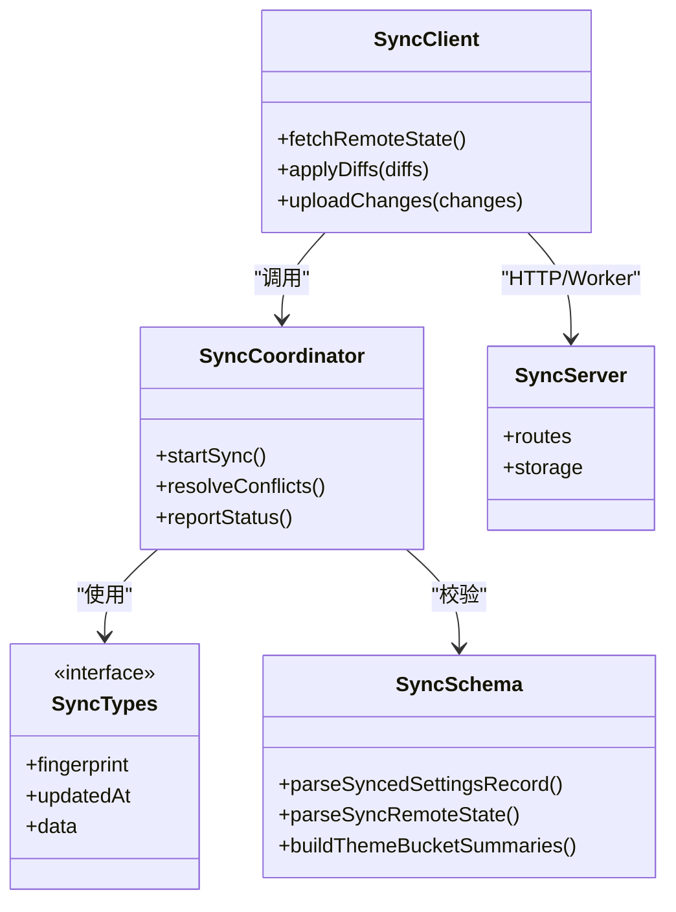
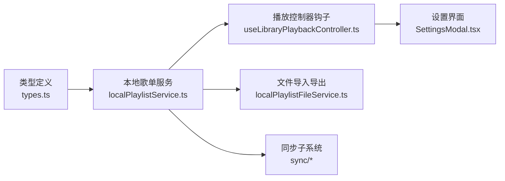

# 歌单系统

<cite>
**本文引用的文件**
- [src/services/localPlaylistService.ts](file://src/services/localPlaylistService.ts)
- [src/services/localPlaylistFileService.ts](file://src/services/localPlaylistFileService.ts)
- [src/hooks/useLibraryPlaybackController.ts](file://src/hooks/useLibraryPlaybackController.ts)
- [src/types.ts](file://src/types.ts)
- [src/services/sync/syncClient.ts](file://src/services/sync/syncClient.ts)
- [src/services/sync/syncCoordinator.ts](file://src/services/sync/syncCoordinator.ts)
- [src/services/sync/syncTypes.ts](file://src/services/sync/syncTypes.ts)
- [src/services/sync/syncSchema.ts](file://src/services/sync/syncSchema.ts)
- [sync-server/package.json](file://sync-server/package.json)
- [src/components/modal/SettingsModal.tsx](file://src/components/modal/SettingsModal.tsx)
</cite>

## 目录
1. [简介](#简介)
2. [项目结构](#项目结构)
3. [核心组件](#核心组件)
4. [架构总览](#架构总览)
5. [详细组件分析](#详细组件分析)
6. [依赖关系分析](#依赖关系分析)
7. [性能考虑](#性能考虑)
8. [故障排查指南](#故障排查指南)
9. [结论](#结论)
10. [附录](#附录)

## 简介
本技术文档聚焦 Folia Player 的歌单系统，覆盖以下主题：
- 动态歌单与静态歌单的差异、数据模型定义与存储策略
- 歌单操作接口（创建、编辑、删除、排序）的实现细节
- 导入导出能力（M3U/M3U8、PLS、XSPF 等格式支持现状、编码与兼容性处理）
- 歌单同步机制（本地文件同步、云存储集成、冲突解决策略）
- 性能优化方案（大量歌曲处理、懒加载、缓存策略）
- 分享功能（生成分享链接、二维码、社交媒体集成的实现建议）

## 项目结构
歌单相关代码主要分布在 services、hooks、types 以及 sync 子模块中：
- 本地歌单服务：负责歌单的增删改查、去重、修复历史数据结构、收藏歌单管理
- 文件导入导出：解析 M3U/M3U8 并匹配本地库歌曲，序列化导出为 M3U8
- 播放控制器钩子：将队列保存为本地歌单、添加当前歌曲到歌单等交互入口
- 类型定义：LocalPlaylist、LocalSong 等核心数据结构
- 同步子系统：客户端与服务端协议、协调器、指纹与模式校验、服务端运行环境

图表来源
- [src/hooks/useLibraryPlaybackController.ts:275-332](file://src/hooks/useLibraryPlaybackController.ts#L275-L332)
- [src/services/localPlaylistService.ts:216-370](file://src/services/localPlaylistService.ts#L216-L370)
- [src/services/localPlaylistFileService.ts:74-236](file://src/services/localPlaylistFileService.ts#L74-L236)
- [src/types.ts:1239-1246](file://src/types.ts#L1239-L1246)
- [src/services/sync/syncClient.ts:1-200](file://src/services/sync/syncClient.ts#L1-L200)
- [src/services/sync/syncCoordinator.ts:1-200](file://src/services/sync/syncCoordinator.ts#L1-L200)
- [src/services/sync/syncTypes.ts:1-200](file://src/services/sync/syncTypes.ts#L1-L200)
- [src/services/sync/syncSchema.ts:1-200](file://src/services/sync/syncSchema.ts#L1-L200)
- [sync-server/package.json:1-33](file://sync-server/package.json#L1-L33)

章节来源
- [src/services/localPlaylistService.ts:1-370](file://src/services/localPlaylistService.ts#L1-L370)
- [src/services/localPlaylistFileService.ts:1-236](file://src/services/localPlaylistFileService.ts#L1-L236)
- [src/hooks/useLibraryPlaybackController.ts:202-332](file://src/hooks/useLibraryPlaybackController.ts#L202-L332)
- [src/types.ts:1239-1246](file://src/types.ts#L1239-L1246)
- [src/services/sync/syncClient.ts:1-200](file://src/services/sync/syncClient.ts#L1-L200)
- [src/services/sync/syncCoordinator.ts:1-200](file://src/services/sync/syncCoordinator.ts#L1-L200)
- [src/services/sync/syncTypes.ts:1-200](file://src/services/sync/syncTypes.ts#L1-L200)
- [src/services/sync/syncSchema.ts:1-200](file://src/services/sync/syncSchema.ts#L1-L200)
- [sync-server/package.json:1-33](file://sync-server/package.json#L1-L33)

## 核心组件
- 本地歌单服务（localPlaylistService.ts）
  - 提供歌单读取、创建、更新、删除、排序、收藏管理等能力
  - 内置历史数据兼容与修复（songIds/tracks/songs/trackIds 多形态归一化）
  - 重复导入场景下的主键选择与去重策略
- 文件导入导出（localPlaylistFileService.ts）
  - 解析 M3U/M3U8，标准化路径，匹配本地库歌曲
  - 导出为 M3U8，附带 EXTINF 元信息与相对路径优化
- 播放控制器钩子（useLibraryPlaybackController.ts）
  - 将当前队列保存为本地歌单、添加当前歌曲到指定歌单
  - 对混合来源队列的约束提示
- 类型定义（types.ts）
  - LocalPlaylist、LocalSong 等核心数据结构
- 同步子系统（sync/*）
  - 客户端与服务端通信、协调器、模式校验、指纹计算
  - 服务端运行环境与依赖

章节来源
- [src/services/localPlaylistService.ts:1-370](file://src/services/localPlaylistService.ts#L1-L370)
- [src/services/localPlaylistFileService.ts:1-236](file://src/services/localPlaylistFileService.ts#L1-L236)
- [src/hooks/useLibraryPlaybackController.ts:275-332](file://src/hooks/useLibraryPlaybackController.ts#L275-L332)
- [src/types.ts:1239-1246](file://src/types.ts#L1239-L1246)
- [src/services/sync/syncClient.ts:1-200](file://src/services/sync/syncClient.ts#L1-L200)
- [src/services/sync/syncCoordinator.ts:1-200](file://src/services/sync/syncCoordinator.ts#L1-L200)
- [src/services/sync/syncTypes.ts:1-200](file://src/services/sync/syncTypes.ts#L1-L200)
- [src/services/sync/syncSchema.ts:1-200](file://src/services/sync/syncSchema.ts#L1-L200)

## 架构总览
歌单系统采用“服务层 + 文件 I/O + 同步”的分层设计：
- 服务层：封装歌单业务逻辑，保证数据一致性与兼容性
- 文件 I/O：提供跨设备可移植的导入导出能力（M3U/M3U8）
- 同步：通过客户端协调器与服务端进行增量同步，使用指纹与模式校验确保一致性

图表来源
- [src/hooks/useLibraryPlaybackController.ts:275-332](file://src/hooks/useLibraryPlaybackController.ts#L275-L332)
- [src/services/localPlaylistService.ts:266-344](file://src/services/localPlaylistService.ts#L266-L344)
- [src/services/localPlaylistFileService.ts:74-186](file://src/services/localPlaylistFileService.ts#L74-L186)
- [src/services/sync/syncClient.ts:1-200](file://src/services/sync/syncClient.ts#L1-L200)
- [src/services/sync/syncCoordinator.ts:1-200](file://src/services/sync/syncCoordinator.ts#L1-L200)

## 详细组件分析

### 本地歌单服务（localPlaylistService.ts）
- 数据模型
  - LocalPlaylist：包含 id、name、songIds、时间戳与 isFavorite 标记
  - 历史兼容：支持 legacy 字段（songs/tracks/trackIds），自动归一化为 songIds
- 核心能力
  - 读取与规范化：getLocalPlaylists 读取缓存、修复无效引用、合并重复导入的主键映射
  - 创建与更新：createLocalPlaylist、updateLocalPlaylist、saveLocalPlaylists
  - 删除与权限：deleteLocalPlaylist 保护收藏歌单不可删除
  - 排序与去重：reorderLocalPlaylistSongs、dedupeSongIds
  - 收藏管理：getFavoriteLocalPlaylist、setLocalSongFavorite
- 复杂逻辑
  - 重复导入主键选择：基于根目录后缀、添加时间与 ID 比较确定 canonical songId
  - 路径修复：repairPlaylistSongIds 将旧引用替换为 canonical 并去重

图表来源
- [src/services/localPlaylistService.ts:145-214](file://src/services/localPlaylistService.ts#L145-L214)
- [src/services/localPlaylistService.ts:216-258](file://src/services/localPlaylistService.ts#L216-L258)
- [src/services/localPlaylistService.ts:266-344](file://src/services/localPlaylistService.ts#L266-L344)

章节来源
- [src/services/localPlaylistService.ts:1-370](file://src/services/localPlaylistService.ts#L1-L370)
- [src/types.ts:1239-1246](file://src/types.ts#L1239-L1246)

### 文件导入导出（localPlaylistFileService.ts）
- 解析与匹配
  - parseM3uPlaylist：提取 #PLAYLIST 名称与路径列表
  - normalizeM3uPath：统一 file URL、Windows 路径与相对路径
  - matchM3uPathsToLocalSongs：精确匹配与后缀匹配，返回 matched/unmatched/ambiguous
- 导入流程
  - importLocalPlaylistFile：解析文本 -> 匹配歌曲 -> 创建歌单（若匹配成功）
- 导出流程
  - serializeLocalPlaylistToM3u8：输出 #EXTM3U、#PLAYLIST、#EXTINF 与相对路径
  - downloadLocalPlaylistM3u8：生成 Blob 并触发下载

图表来源
- [src/services/localPlaylistFileService.ts:74-186](file://src/services/localPlaylistFileService.ts#L74-L186)
- [src/services/localPlaylistFileService.ts:195-236](file://src/services/localPlaylistFileService.ts#L195-L236)
- [src/services/localPlaylistService.ts:266-279](file://src/services/localPlaylistService.ts#L266-L279)

章节来源
- [src/services/localPlaylistFileService.ts:1-236](file://src/services/localPlaylistFileService.ts#L1-L236)

### 播放控制器钩子（useLibraryPlaybackController.ts）
- 将当前队列保存为本地歌单：validate 名称、检查混合来源、提取本地歌曲、调用 createLocalPlaylist
- 添加当前歌曲到本地歌单：校验当前歌曲是否为本地、调用 addSongsToLocalPlaylist
- 创建当前本地歌单：从当前歌曲创建新歌单
- 在线歌单添加：提示当前平台是否支持在线歌单变更

图表来源
- [src/hooks/useLibraryPlaybackController.ts:275-332](file://src/hooks/useLibraryPlaybackController.ts#L275-L332)
- [src/services/localPlaylistService.ts:322-344](file://src/services/localPlaylistService.ts#L322-L344)

章节来源
- [src/hooks/useLibraryPlaybackController.ts:202-332](file://src/hooks/useLibraryPlaybackController.ts#L202-L332)

### 同步机制（sync/*）
- 客户端协调器（syncCoordinator.ts）与客户端（syncClient.ts）
  - 负责发起同步、拉取远端状态、应用差异
- 类型与模式（syncTypes.ts、syncSchema.ts）
  - 定义同步记录结构与模式校验，防止非法远程响应
- 服务端（sync-server/package.json）
  - 基于 Hono/Better-SQLite3 的运行环境，支持 Node/Cloudflare Workers

图表来源
- [src/services/sync/syncClient.ts:1-200](file://src/services/sync/syncClient.ts#L1-L200)
- [src/services/sync/syncCoordinator.ts:1-200](file://src/services/sync/syncCoordinator.ts#L1-L200)
- [src/services/sync/syncTypes.ts:1-200](file://src/services/sync/syncTypes.ts#L1-L200)
- [src/services/sync/syncSchema.ts:1-200](file://src/services/sync/syncSchema.ts#L1-L200)
- [sync-server/package.json:1-33](file://sync-server/package.json#L1-L33)

章节来源
- [src/services/sync/syncClient.ts:1-200](file://src/services/sync/syncClient.ts#L1-L200)
- [src/services/sync/syncCoordinator.ts:1-200](file://src/services/sync/syncCoordinator.ts#L1-L200)
- [src/services/sync/syncTypes.ts:1-200](file://src/services/sync/syncTypes.ts#L1-L200)
- [src/services/sync/syncSchema.ts:1-200](file://src/services/sync/syncSchema.ts#L1-L200)
- [sync-server/package.json:1-33](file://sync-server/package.json#L1-L33)

## 依赖关系分析
- 耦合与内聚
  - 本地歌单服务与类型定义强耦合，保证数据结构稳定
  - 文件导入导出依赖本地歌单服务进行持久化
  - 播放控制器钩子作为 UI 与服务的桥梁，职责清晰
- 外部依赖
  - 同步子系统依赖服务端运行环境（Node/Workers）
  - 设置界面提供缓存清理与容量查看能力

图表来源
- [src/types.ts:1239-1246](file://src/types.ts#L1239-L1246)
- [src/services/localPlaylistService.ts:1-370](file://src/services/localPlaylistService.ts#L1-L370)
- [src/hooks/useLibraryPlaybackController.ts:202-332](file://src/hooks/useLibraryPlaybackController.ts#L202-L332)
- [src/services/localPlaylistFileService.ts:1-236](file://src/services/localPlaylistFileService.ts#L1-L236)
- [src/components/modal/SettingsModal.tsx:703-786](file://src/components/modal/SettingsModal.tsx#L703-L786)
- [src/services/sync/syncClient.ts:1-200](file://src/services/sync/syncClient.ts#L1-L200)

章节来源
- [src/services/localPlaylistService.ts:1-370](file://src/services/localPlaylistService.ts#L1-L370)
- [src/services/localPlaylistFileService.ts:1-236](file://src/services/localPlaylistFileService.ts#L1-L236)
- [src/hooks/useLibraryPlaybackController.ts:202-332](file://src/hooks/useLibraryPlaybackController.ts#L202-L332)
- [src/components/modal/SettingsModal.tsx:703-786](file://src/components/modal/SettingsModal.tsx#L703-L786)
- [src/services/sync/syncClient.ts:1-200](file://src/services/sync/syncClient.ts#L1-L200)

## 性能考虑
- 大量歌曲处理
  - 去重与主键选择：避免重复导入导致的数据膨胀
  - 批量持久化：saveLocalPlaylists 集中写入减少 IO 次数
- 懒加载与缓存
  - 歌单读取优先从缓存获取，必要时再扫描本地歌曲
  - 设置界面支持按类别清理缓存（playlist/lyrics/cover/media/analysis）
- 资源释放
  - 封面与媒体资源在切换时及时释放 ObjectURL，避免内存泄漏

[本节为通用指导，不直接分析具体文件]

## 故障排查指南
- 导入失败或未匹配
  - 检查 M3U 路径格式与编码，确认 normalizeM3uPath 能正确解析
  - 查看 unmatchedPaths 与 ambiguousPaths，修正路径或消除歧义
- 歌单无法删除
  - 收藏歌单受保护，需先取消收藏标记再删除
- 同步异常
  - 检查 syncSchema 解析是否通过，确认远端响应字段合法
  - 核对服务端运行环境与依赖（Hono/Better-SQLite3）

章节来源
- [src/services/localPlaylistFileService.ts:74-186](file://src/services/localPlaylistFileService.ts#L74-L186)
- [src/services/localPlaylistService.ts:308-320](file://src/services/localPlaylistService.ts#L308-L320)
- [src/services/sync/syncSchema.ts:1-200](file://src/services/sync/syncSchema.ts#L1-L200)
- [sync-server/package.json:1-33](file://sync-server/package.json#L1-L33)

## 结论
Folia Player 的歌单系统以本地歌单服务为核心，结合文件导入导出与同步子系统，提供了稳健的增删改查、排序与收藏管理能力。M3U/M3U8 的导入导出满足跨设备共享需求；同步机制通过指纹与模式校验保障一致性。未来可在 PLS/XSPF 导入、分享链接与二维码生成方面进一步扩展。

[本节为总结性内容，不直接分析具体文件]

## 附录
- 歌单数据模型（LocalPlaylist）
  - id：唯一标识
  - name：歌单名称
  - songIds：歌曲 ID 列表（已去重）
  - createdAt/updatedAt：创建与更新时间
  - isFavorite：是否收藏

章节来源
- [src/types.ts:1239-1246](file://src/types.ts#L1239-L1246)