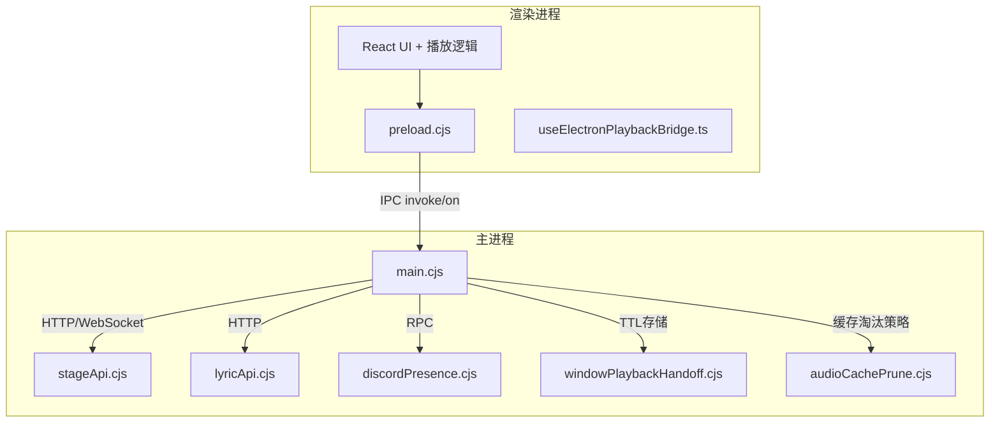
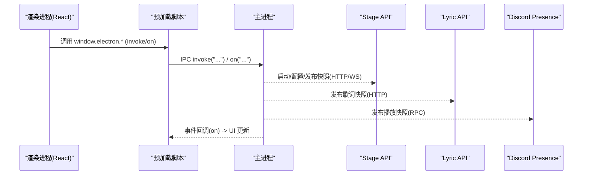
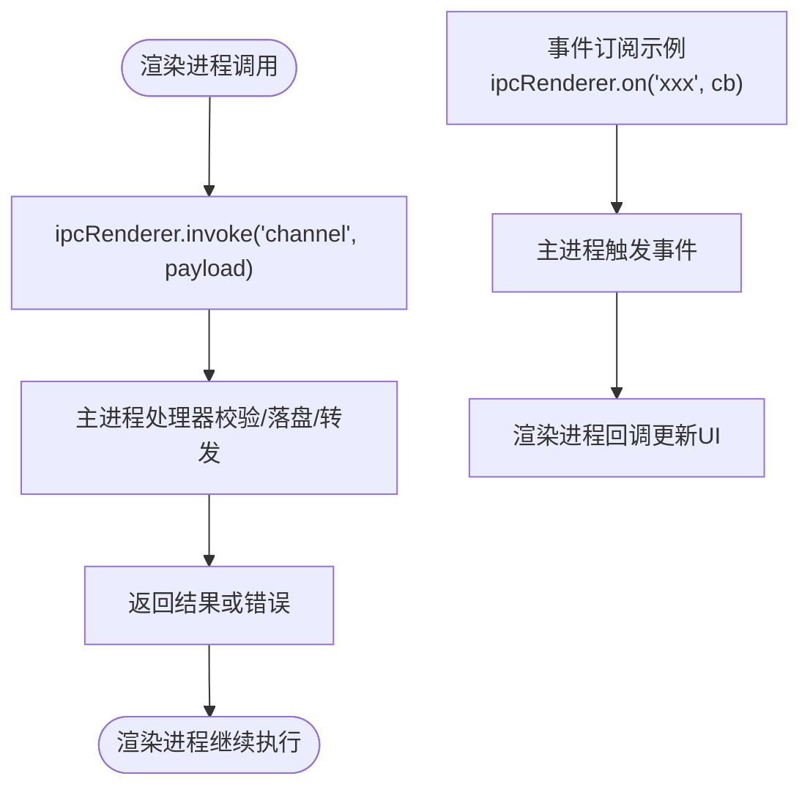
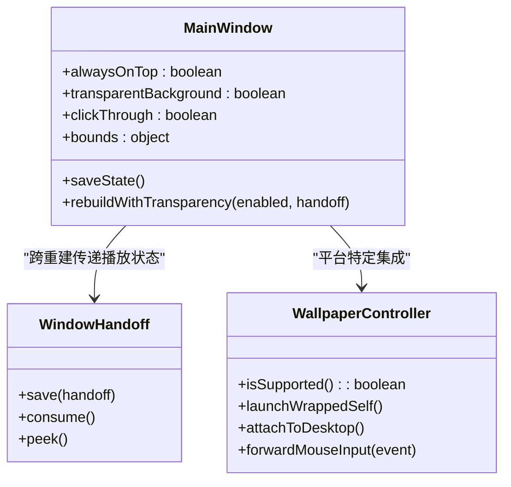
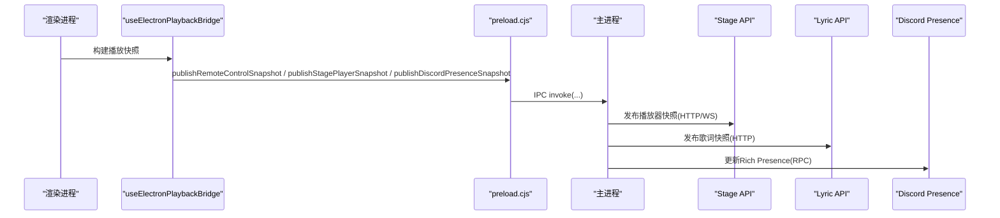
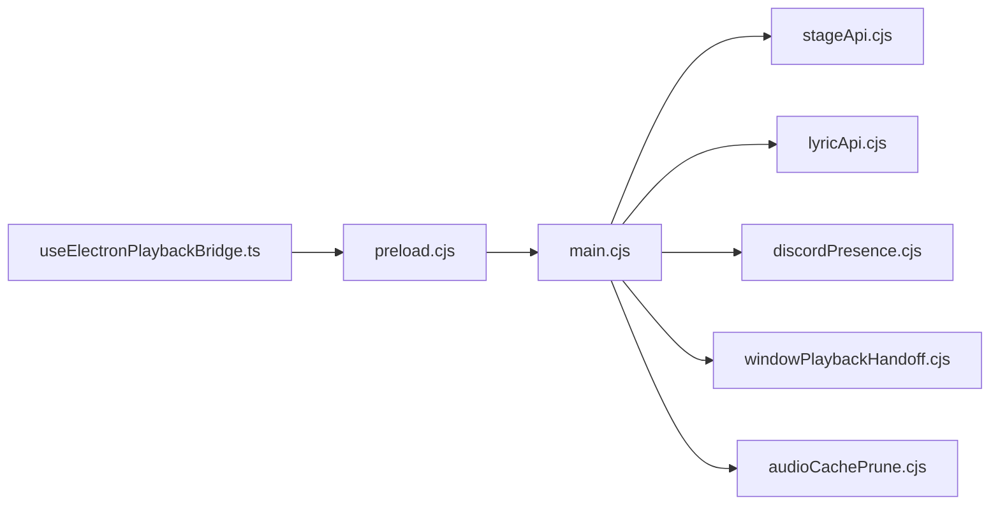

# Electron架构设计

<cite>
**本文引用的文件**
- [electron/main.cjs](file://electron/main.cjs)
- [electron/preload.cjs](file://electron/preload.cjs)
- [electron/stageApi.cjs](file://electron/stageApi.cjs)
- [electron/lyricApi.cjs](file://electron/lyricApi.cjs)
- [electron/discordPresence.cjs](file://electron/discordPresence.cjs)
- [electron/windowPlaybackHandoff.cjs](file://electron/windowPlaybackHandoff.cjs)
- [electron/audioCachePrune.cjs](file://electron/audioCachePrune.cjs)
- [src/hooks/useElectronPlaybackBridge.ts](file://src/hooks/useElectronPlaybackBridge.ts)
</cite>

## 目录
1. [简介](#简介)
2. [项目结构](#项目结构)
3. [核心组件](#核心组件)
4. [架构总览](#架构总览)
5. [详细组件分析](#详细组件分析)
6. [依赖关系分析](#依赖关系分析)
7. [性能考量](#性能考量)
8. [故障排查指南](#故障排查指南)
9. [结论](#结论)
10. [附录](#附录)

## 简介
本技术文档聚焦 Folia Player 的 Electron 架构，围绕主进程与渲染进程的通信机制（IPC 消息、事件系统、数据序列化）、窗口管理系统（多窗口、生命周期、屏幕适配）、预加载脚本的安全模型与 API 暴露机制，以及播放桥接层如何桥接 Web Audio API 与原生能力进行系统化说明。同时提供进程架构图、IPC 通信流程图与安全边界说明，并给出错误处理策略、调试技巧与性能监控方案。

## 项目结构
Folia Player 采用典型的 Electron 多进程架构：
- 主进程负责应用生命周期、窗口管理、本地服务（Stage/Lyric API）、系统集成（托盘、任务栏、壁纸模式等）与 IPC 路由。
- 渲染进程承载 React UI 与播放逻辑，通过预加载脚本暴露最小必要 API 到 window.electron。
- 辅助模块提供本地 HTTP/WebSocket 服务、Discord Rich Presence、音频缓存清理、窗口播放交接等能力。

图表来源
- [electron/main.cjs:1-800](file://electron/main.cjs#L1-L800)
- [electron/stageApi.cjs:1-800](file://electron/stageApi.cjs#L1-L800)
- [electron/lyricApi.cjs:1-202](file://electron/lyricApi.cjs#L1-L202)
- [electron/discordPresence.cjs:1-285](file://electron/discordPresence.cjs#L1-L285)
- [electron/windowPlaybackHandoff.cjs:1-102](file://electron/windowPlaybackHandoff.cjs#L1-L102)
- [electron/audioCachePrune.cjs:1-43](file://electron/audioCachePrune.cjs#L1-L43)
- [src/hooks/useElectronPlaybackBridge.ts:424-543](file://src/hooks/useElectronPlaybackBridge.ts#L424-L543)

章节来源
- [electron/main.cjs:1-800](file://electron/main.cjs#L1-L800)
- [electron/preload.cjs:1-320](file://electron/preload.cjs#L1-L320)

## 核心组件
- 主进程入口与全局初始化：注册协议、平台特性开关、单实例锁、托盘、更新检查、本地服务启动、壁纸模式、窗口创建与状态持久化。
- 预加载脚本：以 contextBridge 暴露最小 API 集合，封装 ipcRenderer.invoke/on，屏蔽底层细节并提供类型安全的调用点。
- Stage API：本地 HTTP+WebSocket 服务，供外部工具推送歌词/媒体会话或请求播放控制；具备鉴权、限流、会话管理与快照广播。
- Lyric API：仅本机可访问的歌词快照 HTTP 接口，输出清洗后的歌词数据。
- Discord Rich Presence：基于主进程快照定时更新 Discord 活动信息。
- 窗口播放交接：在窗口重建或进程重启时，跨渲染进程恢复播放状态（歌曲、位置、播放态）。
- 音频缓存清理：按最近使用策略淘汰旧缓存，避免磁盘膨胀。

章节来源
- [electron/main.cjs:1-800](file://electron/main.cjs#L1-L800)
- [electron/preload.cjs:1-320](file://electron/preload.cjs#L1-L320)
- [electron/stageApi.cjs:1-800](file://electron/stageApi.cjs#L1-L800)
- [electron/lyricApi.cjs:1-202](file://electron/lyricApi.cjs#L1-L202)
- [electron/discordPresence.cjs:1-285](file://electron/discordPresence.cjs#L1-L285)
- [electron/windowPlaybackHandoff.cjs:1-102](file://electron/windowPlaybackHandoff.cjs#L1-L102)
- [electron/audioCachePrune.cjs:1-43](file://electron/audioCachePrune.cjs#L1-L43)

## 架构总览
下图展示主进程与渲染进程之间的关键交互面：预加载脚本作为安全边界，将受控 API 暴露给渲染进程；主进程集中管理本地服务与系统能力；渲染进程通过桥接 Hook 统一上报播放快照与接收系统事件。

图表来源
- [electron/preload.cjs:1-320](file://electron/preload.cjs#L1-L320)
- [electron/stageApi.cjs:1-800](file://electron/stageApi.cjs#L1-L800)
- [electron/lyricApi.cjs:1-202](file://electron/lyricApi.cjs#L1-L202)
- [electron/discordPresence.cjs:1-285](file://electron/discordPresence.cjs#L1-L285)

## 详细组件分析

### 主进程与渲染进程通信（IPC 消息、事件系统、数据序列化）
- 预加载脚本通过 contextBridge.exposeInMainWorld 暴露一组方法，内部统一使用 ipcRenderer.invoke 和 ipcRenderer.on，实现请求-响应与单向事件两种模式。
- 事件系统覆盖设置变更、壁纸模式切换、更新状态、设备像素比、语音输入状态、远程遥控、Stage 会话、歌词 API 状态、Discord 状态等。
- 数据序列化遵循 JSON 传输，复杂对象在主进程侧做规范化与清洗（如 Stage 快照、歌词数据），保证渲染端消费稳定。

图表来源
- [electron/preload.cjs:1-320](file://electron/preload.cjs#L1-L320)
- [electron/main.cjs:1-800](file://electron/main.cjs#L1-L800)

章节来源
- [electron/preload.cjs:1-320](file://electron/preload.cjs#L1-L320)
- [electron/main.cjs:1-800](file://electron/main.cjs#L1-L800)

### 窗口管理系统（多窗口、生命周期、屏幕适配）
- 主进程维护主窗口、远程控制窗口、视频导出窗口等，支持置顶、透明背景、点击穿透、任务栏隐藏、全屏/最大化切换。
- 壁纸模式在不同平台采用不同实现：Wayland/X11 通过子进程包装，Windows 通过 WorkerW 重父级；支持鼠标事件注入与滚动校准。
- 窗口状态持久化与去抖保存，确保崩溃/重启后恢复布局；支持透明背景与层级模式的动态重建。
- 屏幕适配：报告 devicePixelRatio，OBS 源场景下缩放渲染尺寸，保障高分屏显示一致性。

图表来源
- [electron/main.cjs:1-800](file://electron/main.cjs#L1-L800)
- [electron/windowPlaybackHandoff.cjs:1-102](file://electron/windowPlaybackHandoff.cjs#L1-L102)

章节来源
- [electron/main.cjs:1-800](file://electron/main.cjs#L1-L800)
- [electron/windowPlaybackHandoff.cjs:1-102](file://electron/windowPlaybackHandoff.cjs#L1-L102)

### 预加载脚本的安全模型与 API 暴露机制
- 使用 contextBridge 仅暴露白名单方法，不直接暴露 ipcRenderer 或 Node API。
- 所有敏感操作（文件系统路径解析、设置读写、缓存、更新、窗口控制、本地服务控制）均经 IPC 路由至主进程处理。
- 事件订阅需显式取消监听，防止内存泄漏。
- 对平台差异（如 Linux X11/Wayland）进行抽象，向上层提供一致能力。

章节来源
- [electron/preload.cjs:1-320](file://electron/preload.cjs#L1-L320)

### 播放桥接层（Web Audio API 与原生集成的桥梁）
- 渲染进程通过 useElectronPlaybackBridge 聚合播放状态、队列、歌词、任务栏控件、DPR 上报、远程遥控快照、Discord 快照、Stage 快照等，并以固定频率或变化时通过 window.electron.* 推送到主进程。
- 主进程将播放快照分发到各子系统：Stage API（HTTP/WS）、Lyric API（HTTP）、Discord Rich Presence（RPC）。
- 音频设备枚举与选择由 Chromium 设备枚举驱动，配合释放策略减少后台进程残留；音频缓存由主进程按 LRU 策略清理。

图表来源
- [src/hooks/useElectronPlaybackBridge.ts:424-543](file://src/hooks/useElectronPlaybackBridge.ts#L424-L543)
- [electron/stageApi.cjs:1-800](file://electron/stageApi.cjs#L1-L800)
- [electron/lyricApi.cjs:1-202](file://electron/lyricApi.cjs#L1-L202)
- [electron/discordPresence.cjs:1-285](file://electron/discordPresence.cjs#L1-L285)

章节来源
- [src/hooks/useElectronPlaybackBridge.ts:424-543](file://src/hooks/useElectronPlaybackBridge.ts#L424-L543)
- [electron/stageApi.cjs:1-800](file://electron/stageApi.cjs#L1-L800)
- [electron/lyricApi.cjs:1-202](file://electron/lyricApi.cjs#L1-L202)
- [electron/discordPresence.cjs:1-285](file://electron/discordPresence.cjs#L1-L285)

### 本地服务与外部集成（Stage/Lyric API）
- Stage API：提供 HTTP 与 WebSocket 接口，支持令牌鉴权、媒体/歌词会话管理、播放控制能力协商、队列差分与快照广播。
- Lyric API：仅本机监听，输出清洗后的歌词数据，便于 OBS 或其他本地工具读取。
- 两者均在主进程内运行，通过 IPC 与渲染进程解耦，降低渲染端复杂度。

章节来源
- [electron/stageApi.cjs:1-800](file://electron/stageApi.cjs#L1-L800)
- [electron/lyricApi.cjs:1-202](file://electron/lyricApi.cjs#L1-L202)

### 音频缓存与资源管理
- 音频缓存上限默认约 5GB，按“最近使用”策略淘汰，避免无限增长。
- 主进程负责扫描与删除，渲染进程仅提交键值与限制参数，保持职责清晰。

章节来源
- [electron/audioCachePrune.cjs:1-43](file://electron/audioCachePrune.cjs#L1-L43)

## 依赖关系分析
- 主进程依赖：
  - electron 内置模块（app、BrowserWindow、ipcMain、session、screen、dialog、shell、nativeImage、desktopCapturer、Menu、Tray、nativeTheme、powerSaveBlocker、safeStorage、protocol、net）。
  - 本地服务：Stage API、Lyric API、Discord Presence。
  - 平台能力：壁纸模式（Linux Wayland/X11、Windows WorkerW）、单实例锁、更新检查、托盘、任务栏缩略图按钮。
- 渲染进程依赖：
  - React 生态与自定义 Hook（播放桥接、媒体会话、OBS 源、远程遥控等）。
  - 预加载脚本暴露的 window.electron API。

图表来源
- [electron/main.cjs:1-800](file://electron/main.cjs#L1-L800)
- [electron/stageApi.cjs:1-800](file://electron/stageApi.cjs#L1-L800)
- [electron/lyricApi.cjs:1-202](file://electron/lyricApi.cjs#L1-L202)
- [electron/discordPresence.cjs:1-285](file://electron/discordPresence.cjs#L1-L285)
- [electron/windowPlaybackHandoff.cjs:1-102](file://electron/windowPlaybackHandoff.cjs#L1-L102)
- [electron/audioCachePrune.cjs:1-43](file://electron/audioCachePrune.cjs#L1-L43)
- [src/hooks/useElectronPlaybackBridge.ts:424-543](file://src/hooks/useElectronPlaybackBridge.ts#L424-L543)

章节来源
- [electron/main.cjs:1-800](file://electron/main.cjs#L1-L800)
- [electron/preload.cjs:1-320](file://electron/preload.cjs#L1-L320)

## 性能考量
- 渲染端快照发布节流：远程遥控快照每 500ms 一次，DPR 仅在变化时上报，减少 IPC 开销。
- 音频缓存淘汰：按 mtime 近似“最近使用”，避免冷数据占用空间。
- 设备枚举优化：Chromium 视频捕获服务空闲释放，避免常驻后台进程。
- 窗口重建与透明模式：在壁纸模式下按需重建窗口以避免合成问题，减少黑屏/错位。
- Stage API 限流与会话保留：限制上传大小、会话数量与队列长度，保护主进程资源。

[本节为通用指导，无需具体文件引用]

## 故障排查指南
- 证书错误放行：针对特定 CDN 主机名允许证书错误，避免网络请求失败。
- 本地服务端口冲突：Stage/Lyric API 启动失败会记录错误并广播状态变更，可通过 preload 暴露的状态查询定位。
- 壁纸模式异常：子进程 spawn 失败或重复崩溃会降级回普通窗口，并通知渲染端。
- 播放状态丢失：利用窗口播放交接 TTL 存储，在进程重启后恢复播放位置与状态。
- 调试与日志：
  - 渲染端内存采样与上报（debugRendererMemory、onDebugMemorySample）。
  - 运行时日志写入（debugWriteRuntimeLines）。
  - 打开日志文件（debugOpenLogs）。

章节来源
- [electron/main.cjs:1-800](file://electron/main.cjs#L1-L800)
- [electron/preload.cjs:1-320](file://electron/preload.cjs#L1-L320)
- [electron/windowPlaybackHandoff.cjs:1-102](file://electron/windowPlaybackHandoff.cjs#L1-L102)

## 结论
Folia Player 的 Electron 架构通过清晰的进程边界与最小化预加载 API，实现了高内聚的主进程能力与低耦合的渲染进程业务。Stage/Lyric API 提供稳定的本地集成面，窗口管理与壁纸模式覆盖多平台需求，播放桥接层将 Web Audio API 与原生能力有效衔接。结合严格的错误处理、调试与性能优化策略，整体架构具备良好的可扩展性与可维护性。

## 附录
- 安全边界建议：
  - 始终通过 contextBridge 暴露最小 API，避免直接暴露 Node/Electron 对象。
  - 对所有 IPC 输入进行校验与白名单过滤。
  - 对外部服务（Stage/Lyric）启用令牌鉴权与速率限制。
- 最佳实践：
  - 渲染端批量/节流上报，避免频繁 IPC。
  - 主进程集中处理资源与状态，渲染端专注 UI 与交互。
  - 使用窗口播放交接保证关键状态跨重建存活。

[本节为通用指导，无需具体文件引用]