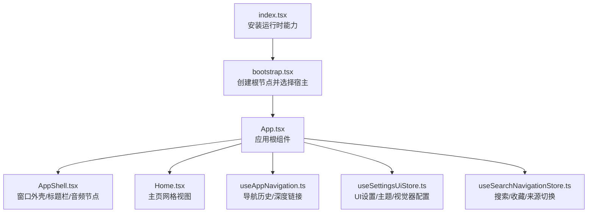
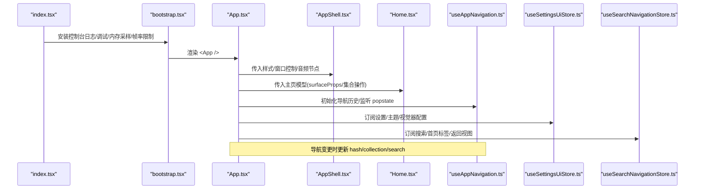
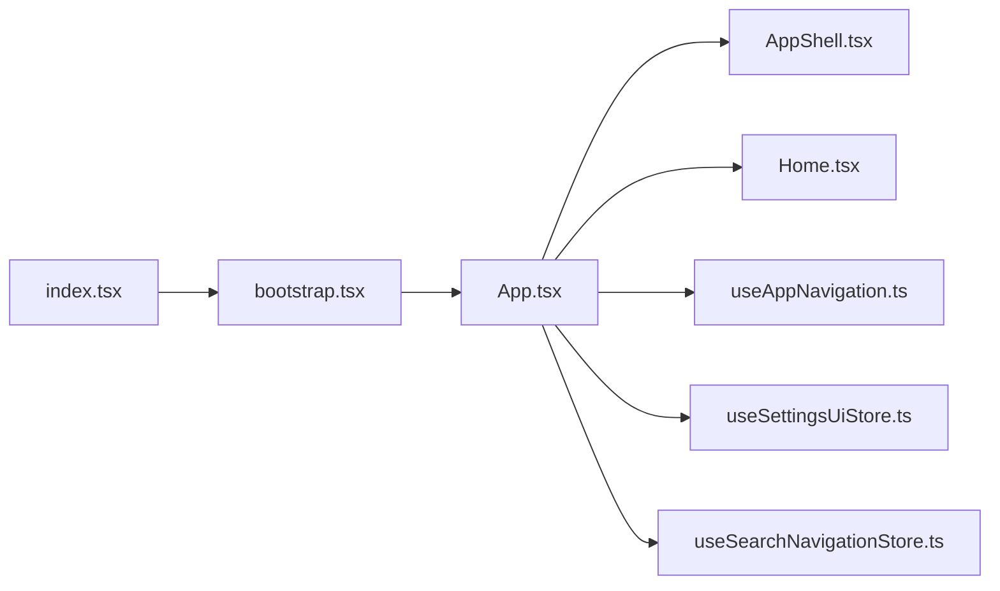
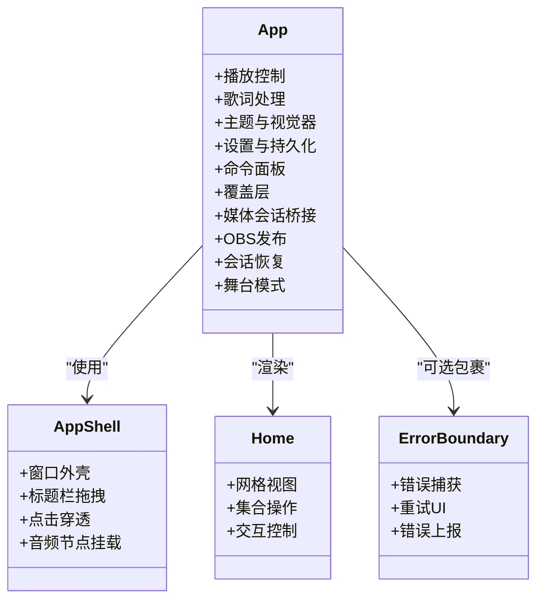
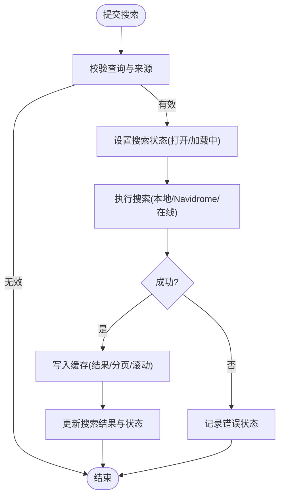
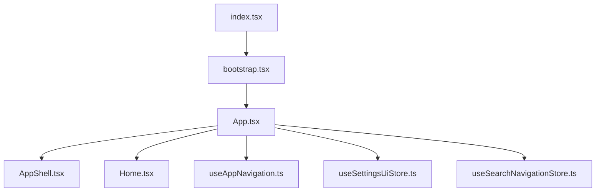

# React前端架构

<cite>
**本文引用的文件**
- [index.tsx](file://src/index.tsx)
- [bootstrap.tsx](file://src/bootstrap.tsx)
- [App.tsx](file://src/App.tsx)
- [AppShell.tsx](file://src/components/app/AppShell.tsx)
- [Home.tsx](file://src/components/app/Home.tsx)
- [useAppNavigation.ts](file://src/hooks/useAppNavigation.ts)
- [useSettingsUiStore.ts](file://src/stores/useSettingsUiStore.ts)
- [useSearchNavigationStore.ts](file://src/stores/useSearchNavigationStore.ts)
- [ErrorBoundary.tsx](file://src/components/shared/ErrorBoundary.tsx)
</cite>

## 目录
1. [简介](#简介)
2. [项目结构](#项目结构)
3. [核心组件与分层](#核心组件与分层)
4. [架构总览](#架构总览)
5. [详细组件分析](#详细组件分析)
6. [依赖关系分析](#依赖关系分析)
7. [性能与内存优化](#性能与内存优化)
8. [故障排查指南](#故障排查指南)
9. [结论](#结论)
10. [附录](#附录)

## 简介
本文件系统性梳理 Folia Player 的 React 前端架构，围绕以下目标展开：
- 组件层次结构设计：应用根组件、页面组件、通用组件的分层组织方式。
- 状态管理模式：基于 Zustand 的全局状态管理策略，包括状态切片设计、持久化存储、状态同步机制。
- 路由系统设计：导航历史管理、深度链接支持、权限控制（以视图/集合栈为核心的轻量路由）。
- Hooks 架构模式：自定义 Hooks 的组织方式与复用策略。
- 可视化表达：组件关系图、状态流转图、依赖关系图。
- 性能优化策略、内存管理与错误边界处理。

## 项目结构
Folia Player 的前端入口由 index.tsx 负责运行时初始化，随后在 bootstrap.tsx 中挂载 React 应用并根据 URL 参数选择渲染不同宿主（主应用、OBS 浏览器源、远程控制等）。应用根组件 App 聚合播放、主题、设置、命令面板、覆盖层、歌词、自动混音等能力；AppShell 提供窗口外壳、标题栏拖拽区与点击穿透控制；Home 作为主页网格视图的入口；useAppNavigation 实现基于 history API 的导航历史与深度链接；Zustand store 负责 UI 设置与搜索导航等全局状态。

图表来源
- [index.tsx:1-18](file://src/index.tsx#L1-L18)
- [bootstrap.tsx:1-72](file://src/bootstrap.tsx#L1-L72)
- [App.tsx:123-150](file://src/App.tsx#L123-L150)
- [AppShell.tsx:1-155](file://src/components/app/AppShell.tsx#L1-L155)
- [Home.tsx:1-39](file://src/components/app/Home.tsx#L1-L39)
- [useAppNavigation.ts:84-199](file://src/hooks/useAppNavigation.ts#L84-L199)
- [useSettingsUiStore.ts:1-120](file://src/stores/useSettingsUiStore.ts#L1-L120)
- [useSearchNavigationStore.ts:178-230](file://src/stores/useSearchNavigationStore.ts#L178-L230)

章节来源
- [index.tsx:1-18](file://src/index.tsx#L1-L18)
- [bootstrap.tsx:1-72](file://src/bootstrap.tsx#L1-L72)

## 核心组件与分层
- 应用根组件（App）
  - 职责：编排播放、歌词、主题、设置、命令面板、覆盖层、自动混音、媒体会话桥接、OBS 发布、会话恢复、舞台模式等。
  - 关键能力：通过多个自定义 Hook 组合播放生命周期、音量/设备切换、歌词偏移、随机视觉器模式、个人 FM 模式、队列/传输控制、UI 效果等。
  - 与 Store 交互：读取/写入设置、搜索导航、集合导航、在线账户等。
- 页面组件（Home）
  - 职责：承载主页网格视图，接收模型提供的 surfaceProps 与集合操作回调，渲染 Grid3D 并透传交互能力。
- 通用组件（AppShell）
  - 职责：统一窗口外壳、标题栏拖拽区域、窗口控制按钮、点击穿透开关、圆角与阴影样式、音频节点挂载位置。
- 错误边界（ErrorBoundary）
  - 职责：捕获子树渲染错误，提供可重试的错误界面，避免整棵组件树崩溃。

章节来源
- [App.tsx:123-150](file://src/App.tsx#L123-L150)
- [Home.tsx:1-39](file://src/components/app/Home.tsx#L1-L39)
- [AppShell.tsx:1-155](file://src/components/app/AppShell.tsx#L1-L155)
- [ErrorBoundary.tsx:1-88](file://src/components/shared/ErrorBoundary.tsx#L1-L88)

## 架构总览
下图展示从入口到应用根组件、再到页面与状态管理的整体流程，以及导航与搜索的状态协作。

图表来源
- [index.tsx:1-18](file://src/index.tsx#L1-L18)
- [bootstrap.tsx:1-72](file://src/bootstrap.tsx#L1-L72)
- [App.tsx:123-150](file://src/App.tsx#L123-L150)
- [AppShell.tsx:1-155](file://src/components/app/AppShell.tsx#L1-L155)
- [Home.tsx:1-39](file://src/components/app/Home.tsx#L1-L39)
- [useAppNavigation.ts:84-199](file://src/hooks/useAppNavigation.ts#L84-L199)
- [useSettingsUiStore.ts:1-120](file://src/stores/useSettingsUiStore.ts#L1-L120)
- [useSearchNavigationStore.ts:178-230](file://src/stores/useSearchNavigationStore.ts#L178-L230)

## 详细组件分析

### 应用根组件 App
- 角色定位：应用编排中心，集中管理播放上下文、歌词、队列、主题、设置、命令面板、覆盖层、自动混音、媒体会话桥接、OBS 发布、会话恢复、舞台模式等。
- 关键流程要点：
  - 启动阶段：初始化同步协调器、加载本地封面运行时、恢复用户引导版本提示。
  - 播放链路：维护当前歌曲、歌词、进度、频谱/频段数据、音量与输出设备切换、在线音频恢复控制器。
  - 歌词对齐：根据歌曲切换恢复手动偏移，结合全局时间轴偏移计算有效偏移。
  - 主题与视觉器：根据偏好与歌曲元数据生成主题，支持随机视觉器模式。
  - 设置与持久化：大量设置项通过 useSettingsUiStore 读写 localStorage，保证重启后一致。
  - 导航集成：与 useAppNavigation 配合，进入/离开播放器视图时关闭面板、保存/恢复集合与搜索快照。
- 性能考量：
  - 使用 useMemo/useCallback 减少重渲染与回调重建。
  - 将高频更新的 MotionValue 用于进度/频谱，降低 React 渲染压力。
  - 懒加载动画模块以减少首屏体积。

章节来源
- [App.tsx:123-150](file://src/App.tsx#L123-L150)
- [App.tsx:212-224](file://src/App.tsx#L212-L224)
- [App.tsx:557-605](file://src/App.tsx#L557-L605)
- [App.tsx:644-739](file://src/App.tsx#L644-L739)
- [App.tsx:786-800](file://src/App.tsx#L786-L800)

### 页面组件 Home
- 角色定位：主页网格视图的容器，接收模型提供的 surfaceProps 与集合操作回调，渲染 Grid3D 并传递交互能力。
- 交互契约：
  - onOpenCollection/onPushCollection/onBackCollection：驱动集合导航栈变化。
  - isInteractive：控制网格是否响应交互。
- 与导航协作：通过 useAppNavigation 的集合导航方法，将当前集合快照推入 history state，支持前进/后退与深度链接。

章节来源
- [Home.tsx:1-39](file://src/components/app/Home.tsx#L1-L39)
- [useAppNavigation.ts:286-332](file://src/hooks/useAppNavigation.ts#L286-L332)

### 通用组件 AppShell
- 角色定位：统一窗口外壳、标题栏拖拽区域、窗口控制按钮、点击穿透开关、圆角与阴影样式、音频节点挂载位置。
- 行为特性：
  - 根据 Electron 环境同步最大化状态，动态调整圆角。
  - 根据播放器视图与点击穿透模式决定是否渲染标题栏遮罩。
  - 暴露点击穿透切换按钮，便于远程/画中画场景。
- 与 App 协作：App 将音频元素与 children 注入 AppShell，确保音频节点始终存在且层级正确。

章节来源
- [AppShell.tsx:1-155](file://src/components/app/AppShell.tsx#L1-L155)

### 错误边界 ErrorBoundary
- 角色定位：捕获子树渲染错误，提供可重试的错误界面，避免整棵组件树崩溃。
- 使用建议：
  - 包裹高风险页面或复杂可视化组件。
  - 通过 onError 回调上报错误信息，便于诊断。
  - 提供 fallback 自定义错误 UI，提升用户体验。

章节来源
- [ErrorBoundary.tsx:1-88](file://src/components/shared/ErrorBoundary.tsx#L1-L88)

## 依赖关系分析
- 入口依赖链：
  - index.tsx 安装控制台日志、调试模块、内存采样、全局帧率限制，然后异步导入 bootstrap。
  - bootstrap 初始化 i18n、CSS、注册模块视觉器、本地封面运行时，最终渲染 App 或特定宿主（OBS/远程控制）。
- 组件依赖：
  - App 依赖 AppShell、Home、命令面板、覆盖层、设置、搜索导航、集合导航、播放桥接、媒体会话、OBS 发布、会话恢复、舞台模式等。
  - Home 依赖 Grid3D 与 GridViewOverlayHost，并通过模型提供 surfaceProps 与集合操作。
- 状态依赖：
  - useSettingsUiStore 提供 UI 设置、主题、视觉器配置、自动混音、字幕、字体、缓存等。
  - useSearchNavigationStore 提供搜索查询、结果、分页、缓存、来源切换与返回视图。
  - useAppNavigation 管理视图切换、集合栈、搜索快照与 history state。

图表来源
- [index.tsx:1-18](file://src/index.tsx#L1-L18)
- [bootstrap.tsx:1-72](file://src/bootstrap.tsx#L1-L72)
- [App.tsx:123-150](file://src/App.tsx#L123-L150)
- [AppShell.tsx:1-155](file://src/components/app/AppShell.tsx#L1-L155)
- [Home.tsx:1-39](file://src/components/app/Home.tsx#L1-L39)
- [useAppNavigation.ts:84-199](file://src/hooks/useAppNavigation.ts#L84-L199)
- [useSettingsUiStore.ts:1-120](file://src/stores/useSettingsUiStore.ts#L1-L120)
- [useSearchNavigationStore.ts:178-230](file://src/stores/useSearchNavigationStore.ts#L178-L230)

章节来源
- [index.tsx:1-18](file://src/index.tsx#L1-L18)
- [bootstrap.tsx:1-72](file://src/bootstrap.tsx#L1-L72)
- [App.tsx:123-150](file://src/App.tsx#L123-L150)

## 性能与内存优化
- 首屏与体积优化
  - 懒加载动画模块（如自动混音过渡动画），仅在启用且匹配模式时加载，减少初始包体。
  - 全局帧率限制器，避免视觉器在高刷新下过度渲染。
- 渲染性能
  - 使用 MotionValue 驱动进度/频谱等高频值，降低 React 重渲染成本。
  - 使用 useMemo/useCallback 稳定回调与派生值，避免不必要的重建。
- 内存管理
  - 音频 Blob URL 与本地资源映射通过 ref 管理生命周期，避免泄漏。
  - 在线音频 URL 带 TTL 与刷新缓冲，减少频繁请求与过期资源占用。
  - 搜索缓存按查询与来源键存储结果与滚动位置，避免重复请求与丢失滚动状态。
- 网络与缓存
  - 媒体缓存开关与容量限制通过设置持久化，平衡体验与磁盘占用。
  - 封面与主题等资源通过服务层缓存，减少重复下载。
- 错误与降级
  - 错误边界捕获渲染异常，提供重试入口，防止整页崩溃。
  - 在线恢复控制器在音频不可用时尝试恢复，保障播放连续性。

章节来源
- [App.tsx:20-23](file://src/App.tsx#L20-L23)
- [App.tsx:286-324](file://src/App.tsx#L286-L324)
- [App.tsx:786-800](file://src/App.tsx#L786-L800)
- [useSearchNavigationStore.ts:178-230](file://src/stores/useSearchNavigationStore.ts#L178-L230)
- [ErrorBoundary.tsx:1-88](file://src/components/shared/ErrorBoundary.tsx#L1-L88)

## 故障排查指南
- 常见问题定位
  - 渲染错误：检查 ErrorBoundary 捕获的错误信息与组件堆栈，必要时添加 onError 回调上报。
  - 播放异常：查看在线音频恢复控制器日志，确认 URL 有效性、TTL 与刷新缓冲策略。
  - 导航异常：验证 useAppNavigation 的 history state 是否正确写入与恢复，检查 popstate 事件监听。
  - 搜索失败：检查 useSearchNavigationStore 的请求 ID 防抖与错误状态，确认来源与依赖注入。
- 调试工具
  - 控制台日志捕获与调试模块已在全局安装，便于追踪启动与运行期问题。
  - 内存采样与帧率限制可用于定位性能瓶颈与卡顿。
- 修复建议
  - 对高风险组件包裹 ErrorBoundary，提供友好错误界面与重试逻辑。
  - 对高频更新路径使用 MotionValue 与 memoization，减少重渲染。
  - 对网络请求增加超时与重试策略，提升鲁棒性。

章节来源
- [ErrorBoundary.tsx:1-88](file://src/components/shared/ErrorBoundary.tsx#L1-L88)
- [index.tsx:1-18](file://src/index.tsx#L1-L18)
- [useAppNavigation.ts:175-199](file://src/hooks/useAppNavigation.ts#L175-L199)
- [useSearchNavigationStore.ts:245-301](file://src/stores/useSearchNavigationStore.ts#L245-L301)

## 结论
Folia Player 的 React 前端采用清晰的组件分层与基于 Zustand 的状态管理，结合 history API 实现轻量而强大的导航系统。App 作为编排中心，整合播放、歌词、主题、设置、命令面板、覆盖层、自动混音等能力；Home 与 AppShell 分别承担页面与外壳职责；ErrorBoundary 提供容错保障。通过懒加载、MotionValue、缓存与帧率限制等手段，项目在体验与性能之间取得良好平衡。后续可继续完善错误上报、监控指标与自动化测试，进一步提升稳定性与维护性。

## 附录

### 组件关系图

图表来源
- [App.tsx:123-150](file://src/App.tsx#L123-L150)
- [AppShell.tsx:1-155](file://src/components/app/AppShell.tsx#L1-L155)
- [Home.tsx:1-39](file://src/components/app/Home.tsx#L1-L39)
- [ErrorBoundary.tsx:1-88](file://src/components/shared/ErrorBoundary.tsx#L1-L88)

### 状态流转图（搜索）

图表来源
- [useSearchNavigationStore.ts:245-301](file://src/stores/useSearchNavigationStore.ts#L245-L301)
- [useSearchNavigationStore.ts:303-361](file://src/stores/useSearchNavigationStore.ts#L303-L361)

### 依赖关系图（入口到应用）

图表来源
- [index.tsx:1-18](file://src/index.tsx#L1-L18)
- [bootstrap.tsx:1-72](file://src/bootstrap.tsx#L1-L72)
- [App.tsx:123-150](file://src/App.tsx#L123-L150)
- [AppShell.tsx:1-155](file://src/components/app/AppShell.tsx#L1-L155)
- [Home.tsx:1-39](file://src/components/app/Home.tsx#L1-L39)
- [useAppNavigation.ts:84-199](file://src/hooks/useAppNavigation.ts#L84-L199)
- [useSettingsUiStore.ts:1-120](file://src/stores/useSettingsUiStore.ts#L1-L120)
- [useSearchNavigationStore.ts:178-230](file://src/stores/useSearchNavigationStore.ts#L178-L230)