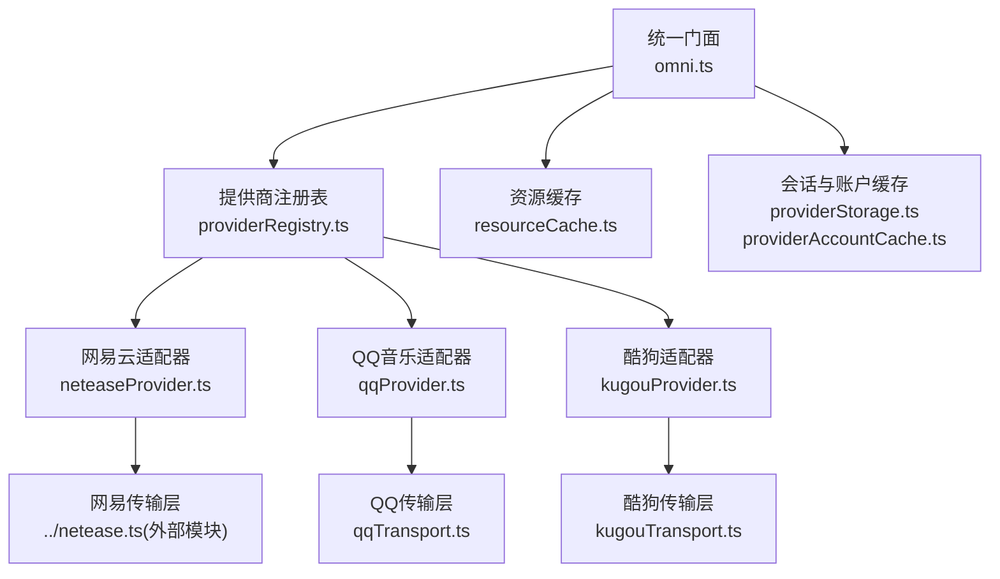
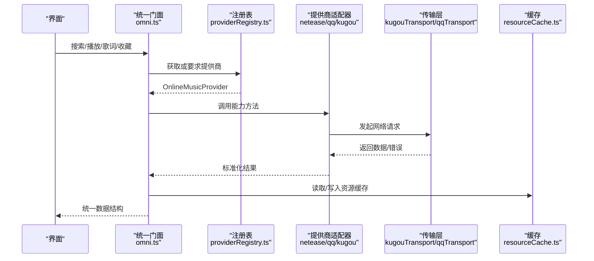
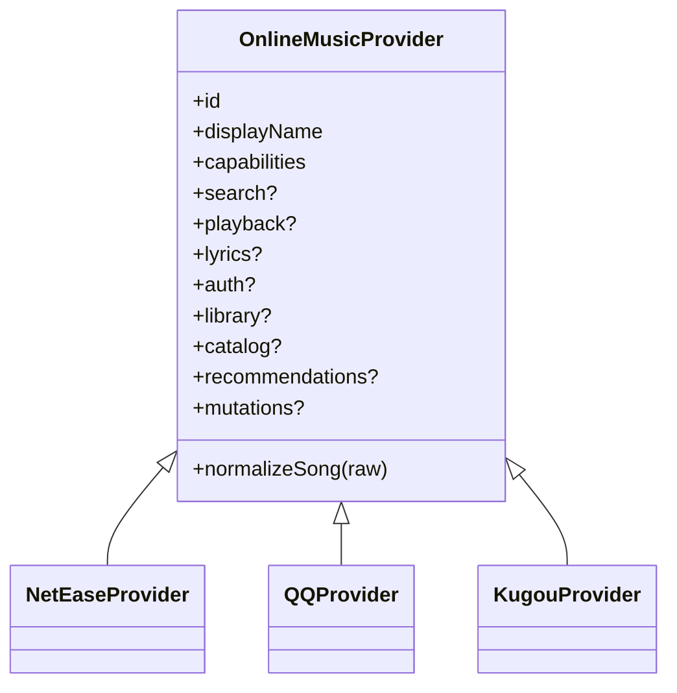
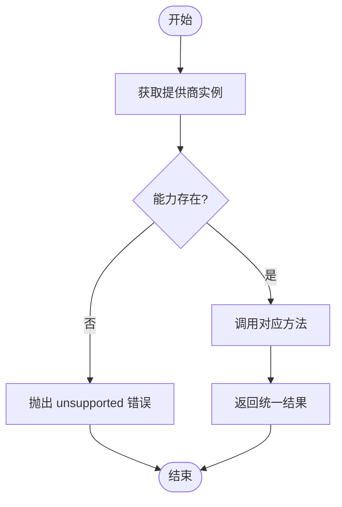
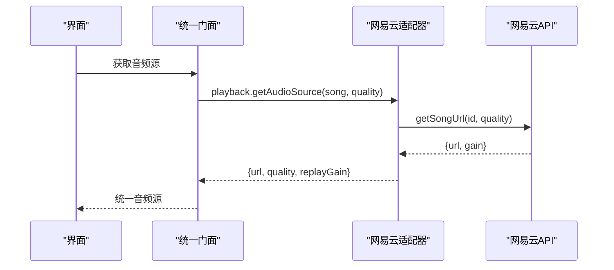
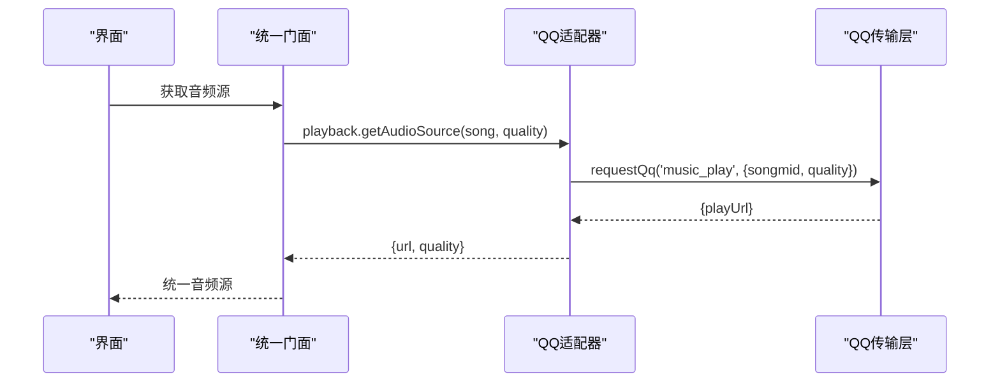
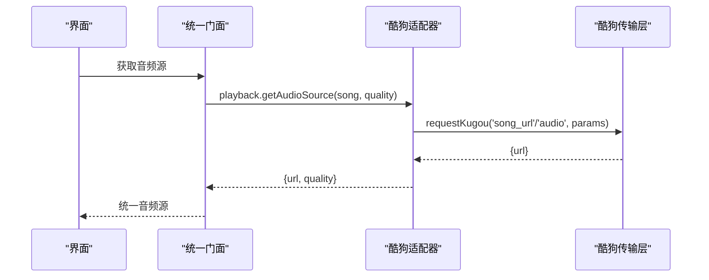
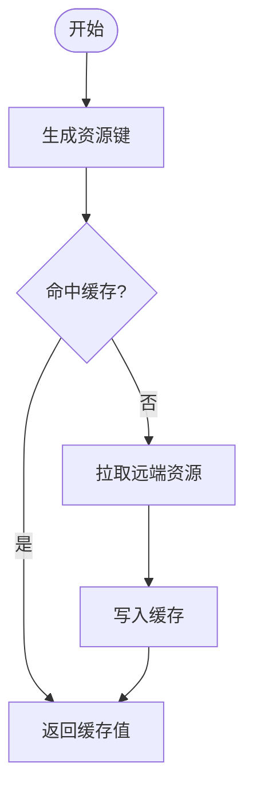
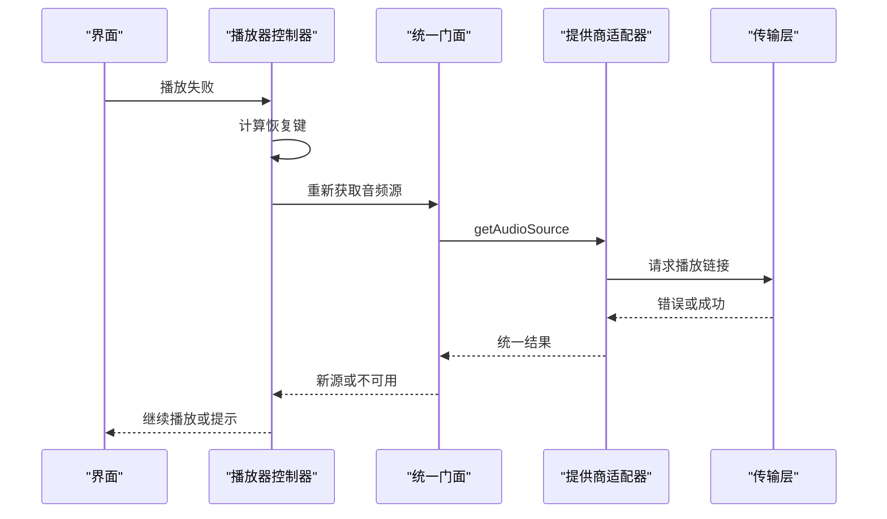
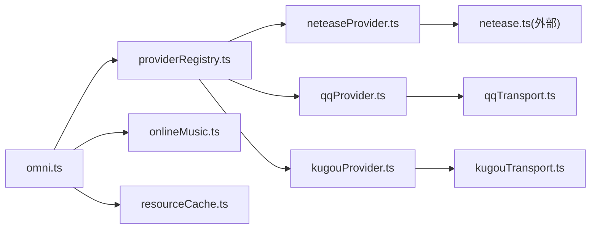

# 在线音乐统一接口

<cite>
**本文引用的文件**
- [providerRegistry.ts](file://src/services/onlineMusic/providerRegistry.ts)
- [omni.ts](file://src/services/onlineMusic/omni.ts)
- [neteaseProvider.ts](file://src/services/onlineMusic/neteaseProvider.ts)
- [qqProvider.ts](file://src/services/onlineMusic/qqProvider.ts)
- [kugouProvider.ts](file://src/services/onlineMusic/kugouProvider.ts)
- [resourceCache.ts](file://src/services/onlineMusic/resourceCache.ts)
- [resourceKeys.ts](file://src/services/onlineMusic/resourceKeys.ts)
- [providerStorage.ts](file://src/services/onlineMusic/providerStorage.ts)
- [providerAccountCache.ts](file://src/services/onlineMusic/providerAccountCache.ts)
- [kugouTransport.ts](file://src/services/onlineMusic/kugouTransport.ts)
- [qqTransport.ts](file://src/services/onlineMusic/qqTransport.ts)
- [onlineMusic.ts](file://src/types/onlineMusic.ts)
- [createOnlineRecoveryController.ts](file://src/components/app/playback/createOnlineRecoveryController.ts)
</cite>

## 目录
1. [简介](#简介)
2. [项目结构](#项目结构)
3. [核心组件](#核心组件)
4. [架构总览](#架构总览)
5. [详细组件分析](#详细组件分析)
6. [依赖关系分析](#依赖关系分析)
7. [性能考量](#性能考量)
8. [故障排查指南](#故障排查指南)
9. [结论](#结论)
10. [附录](#附录)

## 简介
本技术文档聚焦 Folia Player 的“在线音乐统一接口”（Omni）与抽象层设计，系统性阐述如何通过统一接口规范屏蔽网易云音乐、QQ音乐、酷狗音乐等提供商差异。文档覆盖：
- 抽象层与适配器模式
- 提供商注册表机制（动态加载、版本兼容、故障转移）
- 三大提供商适配器的认证流程、API封装、数据标准化
- 资源缓存策略、并发请求管理、错误重试与恢复
- 架构图、数据流图、协议映射表
- 新提供商接入指南、性能优化建议与调试工具使用

## 项目结构
在线音乐能力集中在 src/services/onlineMusic 目录，采用“统一门面 + 提供商适配器 + 传输层”的分层组织：
- 统一门面 omni.ts：对外暴露统一的搜索、播放、歌词、收藏、推荐、歌单等能力，屏蔽提供商差异
- 提供商适配器 neteaseProvider.ts / qqProvider.ts / kugouProvider.ts：实现具体提供商的认证、API调用、数据标准化
- 传输层 kugouTransport.ts / qqTransport.ts：封装网络请求、会话管理、错误归一化
- 注册表 providerRegistry.ts：维护提供商实例，提供能力探测与按歌曲路由到对应提供商
- 缓存与存储 resourceCache.ts / resourceKeys.ts / providerStorage.ts / providerAccountCache.ts：音频、封面、歌词、重放增益、账号快照等持久化
- 类型定义 onlineMusic.ts：统一的数据模型与能力声明

图表来源
- [omni.ts:74-564](file://src/services/onlineMusic/omni.ts#L74-L564)
- [providerRegistry.ts:11-60](file://src/services/onlineMusic/providerRegistry.ts#L11-L60)
- [neteaseProvider.ts:215-495](file://src/services/onlineMusic/neteaseProvider.ts#L215-L495)
- [qqProvider.ts:593-665](file://src/services/onlineMusic/qqProvider.ts#L593-L665)
- [kugouProvider.ts:222-800](file://src/services/onlineMusic/kugouProvider.ts#L222-L800)
- [kugouTransport.ts:224-267](file://src/services/onlineMusic/kugouTransport.ts#L224-L267)
- [qqTransport.ts:201-245](file://src/services/onlineMusic/qqTransport.ts#L201-L245)
- [resourceCache.ts:13-114](file://src/services/onlineMusic/resourceCache.ts#L13-L114)
- [providerStorage.ts:6-65](file://src/services/onlineMusic/providerStorage.ts#L6-L65)
- [providerAccountCache.ts:18-47](file://src/services/onlineMusic/providerAccountCache.ts#L18-L47)

章节来源
- [providerRegistry.ts:11-60](file://src/services/onlineMusic/providerRegistry.ts#L11-L60)
- [omni.ts:74-564](file://src/services/onlineMusic/omni.ts#L74-L564)

## 核心组件
- 统一门面（Omni）：集中处理搜索、登录、播放、歌词、收藏、推荐、歌单、订阅、替换、可用性检查等能力；通过 withActiveProvider 保证在账户切换时丢弃过期响应，避免竞态
- 提供商注册表：Map 维护 OnlineMusicProvider 实例，支持注册/注销/查询/能力判断/按歌曲路由
- 适配器：每个提供商实现 OnlineMusicProvider 接口，包含 search、playback、lyrics、auth、library、catalog、recommendations、mutations 等可选能力
- 传输层：封装 HTTP 请求、会话 Cookie/Token 管理、错误归一化为 OnlineProviderError，并处理设备验证、同源/跨源差异
- 缓存与存储：按歌曲维度缓存音频、封面、歌词、重放增益；按提供商命名空间缓存账号快照与会话值

章节来源
- [omni.ts:41-72](file://src/services/onlineMusic/omni.ts#L41-L72)
- [providerRegistry.ts:11-60](file://src/services/onlineMusic/providerRegistry.ts#L11-L60)
- [onlineMusic.ts:297-316](file://src/types/onlineMusic.ts#L297-L316)
- [resourceCache.ts:13-114](file://src/services/onlineMusic/resourceCache.ts#L13-L114)
- [providerStorage.ts:6-65](file://src/services/onlineMusic/providerStorage.ts#L6-L65)
- [providerAccountCache.ts:18-47](file://src/services/onlineMusic/providerAccountCache.ts#L18-L47)

## 架构总览
下图展示从 UI 到提供商的完整调用链，包括统一门面、注册表、适配器、传输层与缓存。

图表来源
- [omni.ts:74-564](file://src/services/onlineMusic/omni.ts#L74-L564)
- [providerRegistry.ts:11-60](file://src/services/onlineMusic/providerRegistry.ts#L11-L60)
- [kugouTransport.ts:224-267](file://src/services/onlineMusic/kugouTransport.ts#L224-L267)
- [qqTransport.ts:201-245](file://src/services/onlineMusic/qqTransport.ts#L201-L245)
- [resourceCache.ts:13-114](file://src/services/onlineMusic/resourceCache.ts#L13-L114)

## 详细组件分析

### 抽象层与适配器模式
- 抽象层：OnlineMusicProvider 接口定义了 id、displayName、capabilities、normalizeSong、search、playback、lyrics、auth、library、catalog、recommendations、mutations 等能力
- 适配器：网易云、QQ、酷狗各自实现这些能力，将上游 API 返回的结构标准化为 UnifiedSong、ProviderCollection、ProviderUser 等统一模型
- 能力探测：通过 ProviderCapabilities 字段声明是否支持某项能力，Omni 据此决定调用路径与降级策略

图表来源
- [onlineMusic.ts:297-316](file://src/types/onlineMusic.ts#L297-L316)
- [neteaseProvider.ts:215-495](file://src/services/onlineMusic/neteaseProvider.ts#L215-L495)
- [qqProvider.ts:593-665](file://src/services/onlineMusic/qqProvider.ts#L593-L665)
- [kugouProvider.ts:222-800](file://src/services/onlineMusic/kugouProvider.ts#L222-L800)

章节来源
- [onlineMusic.ts:31-51](file://src/types/onlineMusic.ts#L31-L51)
- [neteaseProvider.ts:215-495](file://src/services/onlineMusic/neteaseProvider.ts#L215-L495)
- [qqProvider.ts:593-665](file://src/services/onlineMusic/qqProvider.ts#L593-L665)
- [kugouProvider.ts:222-800](file://src/services/onlineMusic/kugouProvider.ts#L222-L800)

### 提供商注册表机制
- 动态加载：启动时自动注册网易云、QQ、酷狗三个提供商实例
- 版本兼容：通过 capabilities 字段声明能力，Omni 在调用前进行 capability 检查，未实现的能力返回空结果或抛出“unsupported”错误
- 故障转移：withActiveProvider 在账户切换时丢弃旧请求响应，避免竞态；getOnlineMusicProviderForSong 根据歌曲 sourceRef 路由到对应提供商

图表来源
- [providerRegistry.ts:11-60](file://src/services/onlineMusic/providerRegistry.ts#L11-L60)
- [omni.ts:41-72](file://src/services/onlineMusic/omni.ts#L41-L72)

章节来源
- [providerRegistry.ts:11-60](file://src/services/onlineMusic/providerRegistry.ts#L11-L60)
- [omni.ts:41-72](file://src/services/onlineMusic/omni.ts#L41-L72)

### 网易云音乐适配器
- 认证流程：getLoginStatus 调用登录状态与用户账户接口，必要时写回 cookie；二维码登录通过 getQrKey/createQr/checkQr 完成扫码确认
- API调用封装：cloudSearch/getSongDetail/getSongUrl/getLyric 等，统一转换为 UnifiedSong 与 ProviderAudioSource
- 数据标准化：normalizeNeteaseSong 将多种字段映射为标准结构；歌词解析 processNeteaseLyrics 支持主词、翻译、罗马音、逐字歌词与高潮区间

图表来源
- [neteaseProvider.ts:259-296](file://src/services/onlineMusic/neteaseProvider.ts#L259-L296)
- [neteaseProvider.ts:179-213](file://src/services/onlineMusic/neteaseProvider.ts#L179-L213)
- [neteaseProvider.ts:297-340](file://src/services/onlineMusic/neteaseProvider.ts#L297-L340)

章节来源
- [neteaseProvider.ts:215-495](file://src/services/onlineMusic/neteaseProvider.ts#L215-L495)

### QQ音乐适配器
- 认证流程：基于后端 qq-music-api，支持二维码登录通道发现（login_channels），checkQr 返回 waiting/scanned/confirmed/expired/error；会话以 cookie 形式持久化
- API调用封装：requestQq 统一封装登录、播放、曲库、歌手、专辑等端点；music_play 支持质量回退策略（standard/high/lossless/hires）
- 数据标准化：normalizeQqSong/normalizeQqUser/normalizeQqCollection 将上游响应映射为标准结构；resolveQqSongCatalogRefs 按需补全专辑/歌手 mid

图表来源
- [qqProvider.ts:171-222](file://src/services/onlineMusic/qqProvider.ts#L171-L222)
- [qqTransport.ts:201-245](file://src/services/onlineMusic/qqTransport.ts#L201-L245)
- [qqProvider.ts:240-276](file://src/services/onlineMusic/qqProvider.ts#L240-L276)

章节来源
- [qqProvider.ts:593-665](file://src/services/onlineMusic/qqProvider.ts#L593-L665)
- [qqTransport.ts:201-245](file://src/services/onlineMusic/qqTransport.ts#L201-L245)

### 酷狗音乐适配器
- 认证流程：支持二维码登录与设备验证（register_dev），会话以 cookie/token/dfid/userid 形式持久化；搜索可走匿名签名或已认证会话
- API调用封装：requestKugou 统一封装搜索、音频、歌词、曲库、推荐等端点；song_url/audio/krm_audio 等用于获取播放链接与元数据
- 数据标准化：normalizeKugouSong 处理多字段映射与标题/艺人拆分；歌词通过 search_lyric/lyric 获取 KRC 并解析；高潮区间 song_climax 转换为秒级范围

图表来源
- [kugouProvider.ts:659-671](file://src/services/onlineMusic/kugouProvider.ts#L659-L671)
- [kugouTransport.ts:224-267](file://src/services/onlineMusic/kugouTransport.ts#L224-L267)
- [kugouProvider.ts:725-757](file://src/services/onlineMusic/kugouProvider.ts#L725-L757)

章节来源
- [kugouProvider.ts:222-800](file://src/services/onlineMusic/kugouProvider.ts#L222-L800)
- [kugouTransport.ts:224-267](file://src/services/onlineMusic/kugouTransport.ts#L224-L267)

### 资源缓存策略
- 键生成：getSongResourceCacheKey 按歌曲 sourceRef 生成唯一键，区分不同提供商与资源类型（audio/cover/lyric/replayGain）
- 迁移兼容：getSongCacheWithLegacyMigration 读取旧键并迁移到新键，确保历史缓存可用
- 内容缓存：音频 Blob、封面 URL/Blob、重放增益信息分别持久化，避免重复下载与计算

图表来源
- [resourceKeys.ts:8-25](file://src/services/onlineMusic/resourceKeys.ts#L8-L25)
- [resourceCache.ts:13-114](file://src/services/onlineMusic/resourceCache.ts#L13-L114)

章节来源
- [resourceKeys.ts:8-25](file://src/services/onlineMusic/resourceKeys.ts#L8-L25)
- [resourceCache.ts:13-114](file://src/services/onlineMusic/resourceCache.ts#L13-L114)

### 并发请求管理与错误重试
- 并发去重：QQ 的 song detail 请求通过 Map 去重，避免同一首歌多次解析；酷狗的 catalog metadata 请求同样去重
- 质量回退：QQ 与酷狗在 getAudioSource 中按质量优先级尝试多个候选，失败则降级
- 错误重试与恢复：播放器侧 createOnlineRecoveryController 对失败源进行恢复，避免无限重试循环；传输层将错误归一化为 OnlineProviderError，便于上层处理

图表来源
- [createOnlineRecoveryController.ts:41-136](file://src/components/app/playback/createOnlineRecoveryController.ts#L41-L136)
- [qqProvider.ts:171-222](file://src/services/onlineMusic/qqProvider.ts#L171-L222)
- [kugouProvider.ts:659-671](file://src/services/onlineMusic/kugouProvider.ts#L659-L671)

章节来源
- [createOnlineRecoveryController.ts:41-136](file://src/components/app/playback/createOnlineRecoveryController.ts#L41-L136)
- [qqProvider.ts:171-222](file://src/services/onlineMusic/qqProvider.ts#L171-L222)
- [kugouProvider.ts:659-671](file://src/services/onlineMusic/kugouProvider.ts#L659-L671)

### 协议映射表
以下为各提供商关键 API 与统一接口的映射关系（示例）：

| 统一能力 | 网易云 | QQ音乐 | 酷狗 |
|---|---|---|---|
| 搜索歌曲 | cloudSearch | 复用歌词搜索 u.y.qq.com | search（匿名或认证） |
| 获取音频源 | getSongUrl | music_play | song_url/audio |
| 歌词 | getLyric/getCloudLyric | fetchQQLyrics | search_lyric + lyric(KRC) |
| 高潮区间 | getChorus | - | song_climax |
| 用户歌单 | getUserPlaylists | user_playlist | user_playlist |
| 用户专辑 | getFavoriteAlbums | user_albums | album_detail |
| 个人FM | getPersonalFm | - | personal_fm |
| 收藏/喜欢 | likeSong | - | 内置“我喜欢”歌单操作 |

章节来源
- [neteaseProvider.ts:251-495](file://src/services/onlineMusic/neteaseProvider.ts#L251-L495)
- [qqProvider.ts:28-33](file://src/services/onlineMusic/qqProvider.ts#L28-L33)
- [kugouProvider.ts:107-173](file://src/services/onlineMusic/kugouProvider.ts#L107-L173)

## 依赖关系分析
- 耦合度：Omni 与注册表低耦合，通过接口与能力探测解耦；适配器与传输层强耦合，但传输层内部封装了会话与错误
- 直接依赖：Omni 依赖注册表、类型定义、缓存与存储；适配器依赖传输层与标准化函数
- 间接依赖：传输层依赖环境变量与 Electron IPC；缓存依赖数据库与本地存储
- 外部集成：网易云通过外部模块 netease.ts；QQ/酷狗通过自建后端 qq-music-api/kugou-api

图表来源
- [omni.ts:74-564](file://src/services/onlineMusic/omni.ts#L74-L564)
- [providerRegistry.ts:11-60](file://src/services/onlineMusic/providerRegistry.ts#L11-L60)
- [onlineMusic.ts:297-316](file://src/types/onlineMusic.ts#L297-L316)

章节来源
- [omni.ts:74-564](file://src/services/onlineMusic/omni.ts#L74-L564)
- [providerRegistry.ts:11-60](file://src/services/onlineMusic/providerRegistry.ts#L11-L60)

## 性能考量
- 缓存命中：优先读取本地缓存（音频、封面、重放增益），减少网络请求与解码开销
- 并发控制：对重复请求进行去重（如 QQ 歌曲详情、酷狗 catalog 元数据），避免冗余网络负载
- 质量回退：按优先级尝试多种音质，提高成功率并降低失败重试次数
- 会话管理：Cookie/Token 持久化与迁移，减少重复登录与鉴权开销
- 资源键优化：按提供商与资源类型生成唯一键，避免冲突与误命中

[本节为通用指导，不直接分析具体文件]

## 故障排查指南
- 认证失败：检查传输层的会话持久化（cookie/token），确认后端端口与环境变量配置正确
- 播放失败：查看质量回退日志，确认上游是否拒绝播放链接；检查播放器恢复逻辑是否触发
- 歌词缺失：确认歌词搜索参数（hash/duration/album_audio_id）是否正确；检查 KRC 解析是否成功
- 缓存异常：检查资源键生成逻辑与迁移路径，确保旧键能迁移到新键
- 错误分类：通过 OnlineProviderError.code 区分 auth-required/network/invalid-response/unavailable 等错误类型

章节来源
- [qqTransport.ts:201-245](file://src/services/onlineMusic/qqTransport.ts#L201-L245)
- [kugouTransport.ts:224-267](file://src/services/onlineMusic/kugouTransport.ts#L224-L267)
- [createOnlineRecoveryController.ts:41-136](file://src/components/app/playback/createOnlineRecoveryController.ts#L41-L136)

## 结论
Folia Player 的在线音乐统一接口通过抽象层与适配器模式，成功屏蔽了网易云、QQ、酷狗等提供商的差异，提供了统一的搜索、播放、歌词、收藏、推荐等能力。注册表机制支持动态加载与能力探测，传输层封装了会话管理与错误归一化，缓存策略提升了性能与稳定性。未来可通过扩展更多提供商、优化缓存命中率与并发控制，进一步提升用户体验。

[本节为总结性内容，不直接分析具体文件]

## 附录

### 新提供商接入指南
- 实现 OnlineMusicProvider 接口，声明 capabilities 与必要的方法（search/playback/lyrics/auth/library/catalog/recommendations/mutations）
- 实现传输层封装，处理会话、签名、错误归一化
- 实现数据标准化函数，将上游响应映射为 UnifiedSong/ProviderCollection/ProviderUser
- 在 providerRegistry.ts 中注册新提供商实例
- 测试认证、播放、歌词、收藏等核心流程

章节来源
- [onlineMusic.ts:297-316](file://src/types/onlineMusic.ts#L297-L316)
- [providerRegistry.ts:58-60](file://src/services/onlineMusic/providerRegistry.ts#L58-L60)

### 性能优化建议
- 启用资源缓存，减少重复下载与解码
- 对高频请求进行去重与批量处理
- 合理设置质量回退策略，平衡音质与成功率
- 监控缓存命中率与错误率，持续优化键生成与迁移逻辑

[本节为通用指导，不直接分析具体文件]

### 调试工具使用
- 查看传输层日志，定位网络请求与错误
- 检查会话持久化，确认 cookie/token 是否正确写入
- 使用浏览器开发者工具监控缓存键与命中情况
- 通过控制台输出诊断信息，辅助定位问题

章节来源
- [qqTransport.ts:201-245](file://src/services/onlineMusic/qqTransport.ts#L201-L245)
- [kugouTransport.ts:224-267](file://src/services/onlineMusic/kugouTransport.ts#L224-L267)
- [resourceCache.ts:13-114](file://src/services/onlineMusic/resourceCache.ts#L13-L114)