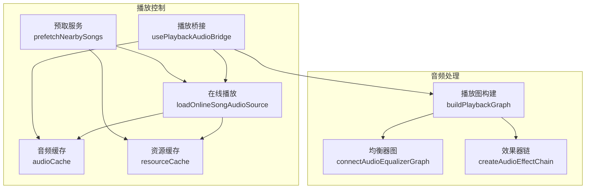
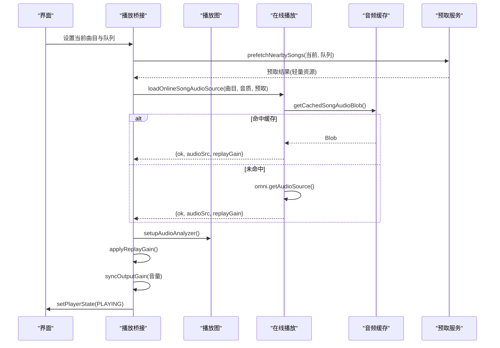
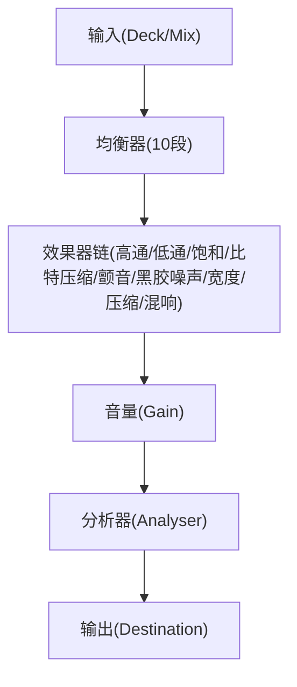
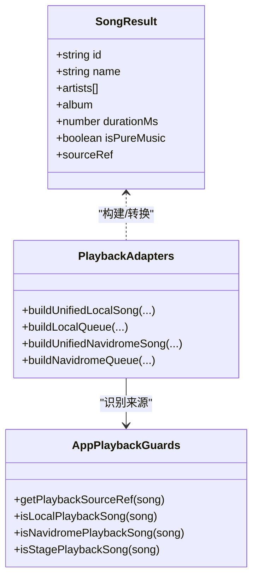
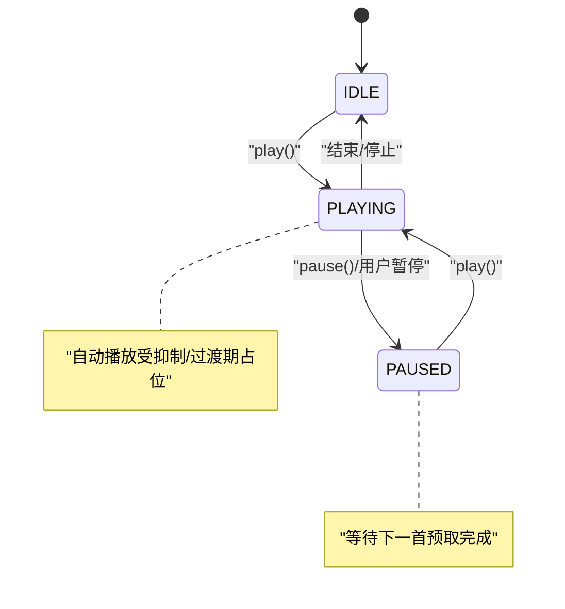
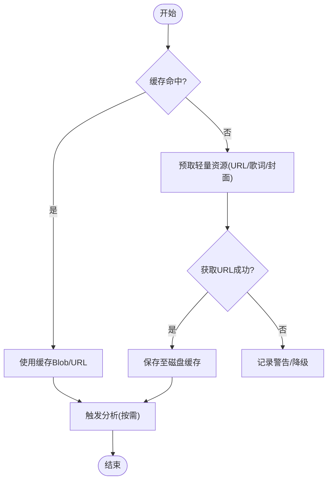
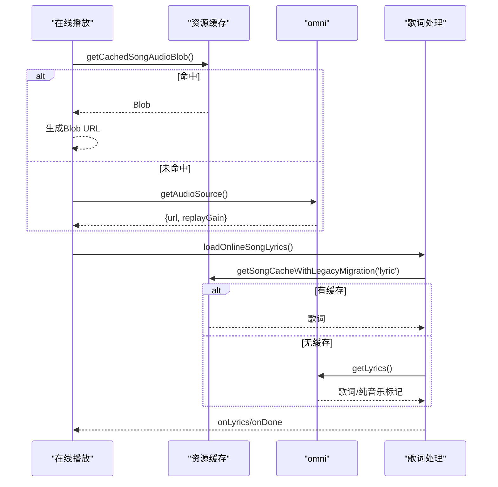
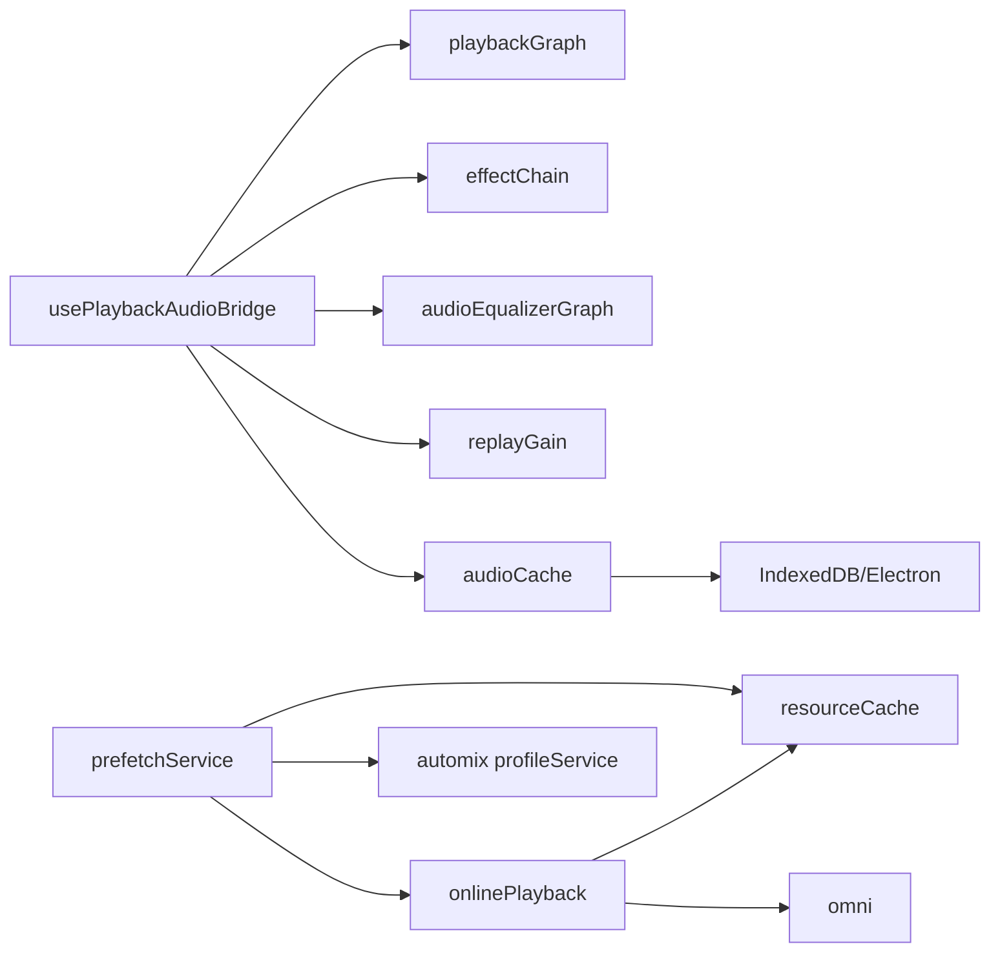

# 播放系统架构

<cite>
**本文引用的文件**
- [playbackGraph.ts](file://src/services/playbackGraph.ts)
- [effectChain.ts](file://src/services/audioEffects/effectChain.ts)
- [audioEqualizerGraph.ts](file://src/services/audioEqualizerGraph.ts)
- [usePlaybackAudioBridge.ts](file://src/hooks/usePlaybackAudioBridge.ts)
- [onlinePlayback.ts](file://src/services/onlinePlayback.ts)
- [prefetchService.ts](file://src/services/prefetchService.ts)
- [audioCache.ts](file://src/services/audioCache.ts)
- [resourceCache.ts](file://src/services/onlineMusic/resourceCache.ts)
- [appPlaybackGuards.ts](file://src/utils/appPlaybackGuards.ts)
- [appPlayback.ts](file://src/types/appPlayback.ts)
</cite>

## 目录
1. [简介](#简介)
2. [项目结构](#项目结构)
3. [核心组件](#核心组件)
4. [架构总览](#架构总览)
5. [详细组件分析](#详细组件分析)
6. [依赖关系分析](#依赖关系分析)
7. [性能考量](#性能考量)
8. [故障排查指南](#故障排查指南)
9. [结论](#结论)
10. [附录](#附录)

## 简介
本技术文档聚焦 Folia Player 的播放系统，围绕以下目标展开：
- 深入解析播放图（Playback Graph）设计：音频节点连接、效果器链、实时参数调节。
- 说明播放适配器模式：统一本地文件、在线流、网络 URL 的处理逻辑。
- 解释播放状态管理机制：状态机设计、状态同步、持久化恢复。
- 重点说明音频缓存策略：预加载算法、内存管理、磁盘缓存。
- 提供播放流程图、状态转换图和音频处理管道图。
- 包含性能监控、错误恢复和资源优化策略。

## 项目结构
播放系统的关键代码分布在服务层与钩子层：
- 服务层负责音频图构建、效果链、均衡器、在线播放、预取与缓存。
- 钩子层桥接 React 与底层音频上下文，协调自动播放、回放增益、媒体缓存等。

**图表来源**
- [playbackGraph.ts:31-97](file://src/services/playbackGraph.ts#L31-L97)
- [audioEqualizerGraph.ts:20-45](file://src/services/audioEqualizerGraph.ts#L20-L45)
- [effectChain.ts:31-93](file://src/services/audioEffects/effectChain.ts#L31-L93)
- [usePlaybackAudioBridge.ts:136-167](file://src/hooks/usePlaybackAudioBridge.ts#L136-L167)
- [onlinePlayback.ts:17-63](file://src/services/onlinePlayback.ts#L17-L63)
- [prefetchService.ts:405-493](file://src/services/prefetchService.ts#L405-L493)
- [audioCache.ts:39-121](file://src/services/audioCache.ts#L39-L121)
- [resourceCache.ts:13-94](file://src/services/onlineMusic/resourceCache.ts#L13-L94)

**章节来源**
- [playbackGraph.ts:31-97](file://src/services/playbackGraph.ts#L31-L97)
- [usePlaybackAudioBridge.ts:136-167](file://src/hooks/usePlaybackAudioBridge.ts#L136-L167)
- [onlinePlayback.ts:17-63](file://src/services/onlinePlayback.ts#L17-L63)
- [prefetchService.ts:405-493](file://src/services/prefetchService.ts#L405-L493)
- [audioCache.ts:39-121](file://src/services/audioCache.ts#L39-L121)
- [resourceCache.ts:13-94](file://src/services/onlineMusic/resourceCache.ts#L13-L94)

## 核心组件
- 播放图构建：将混音点、均衡器、效果链、音量、分析器按固定顺序连接，确保可视化与分析器看到的是最终输出。
- 效果器链：在均衡器之后接入高/低通、饱和、比特压缩、颤音、黑胶噪声、立体声宽度、动态压缩与混响，支持实时平滑参数调节。
- 均衡器图：创建稳定的十段滤波器链，避免 React 更新进入音频路径。
- 播放桥接：负责 AudioContext 初始化、自动播放、回放增益应用、媒体缓存写入、状态切换。
- 在线播放：优先从缓存或预取获取音频源，必要时通过统一入口获取 URL，并回填回放增益。
- 预取服务：提前为前后曲目预取轻量资源（URL、歌词、封面），支持 TTL 过期与 LRU 清理，并在空闲回调中执行以避免阻塞 UI。
- 音频缓存：跨 Electron 与浏览器环境，优先使用主进程文件缓存，回退到 IndexedDB；写后通知监听者以触发后续处理。
- 资源缓存：对歌曲音频、封面、回放增益进行键控存储与迁移兼容。

**章节来源**
- [playbackGraph.ts:31-97](file://src/services/playbackGraph.ts#L31-L97)
- [effectChain.ts:31-93](file://src/services/audioEffects/effectChain.ts#L31-L93)
- [audioEqualizerGraph.ts:20-59](file://src/services/audioEqualizerGraph.ts#L20-L59)
- [usePlaybackAudioBridge.ts:81-167](file://src/hooks/usePlaybackAudioBridge.ts#L81-L167)
- [onlinePlayback.ts:17-63](file://src/services/onlinePlayback.ts#L17-L63)
- [prefetchService.ts:24-72](file://src/services/prefetchService.ts#L24-L72)
- [audioCache.ts:39-121](file://src/services/audioCache.ts#L39-L121)
- [resourceCache.ts:13-94](file://src/services/onlineMusic/resourceCache.ts#L13-L94)

## 架构总览
播放系统采用“适配器 + 管道”的组合：
- 适配器层：通过统一的 SongResult 模型与 sourceRef，屏蔽本地、Navidrome、在线平台差异。
- 管道层：MediaElement -> 混音点 -> 均衡器 -> 效果链 -> 音量 -> 分析器 -> 输出。
- 预取与缓存：在播放前准备轻量资源，播放后落盘，减少重复网络请求与解码开销。
- 状态管理：由桥接钩子驱动状态机，结合自动播放、暂停抑制、过渡期占位等策略保证无缝切换。

**图表来源**
- [usePlaybackAudioBridge.ts:136-167](file://src/hooks/usePlaybackAudioBridge.ts#L136-L167)
- [onlinePlayback.ts:17-63](file://src/services/onlinePlayback.ts#L17-L63)
- [prefetchService.ts:405-493](file://src/services/prefetchService.ts#L405-L493)
- [resourceCache.ts:36-58](file://src/services/onlineMusic/resourceCache.ts#L36-L58)
- [audioCache.ts:39-67](file://src/services/audioCache.ts#L39-L67)

## 详细组件分析

### 播放图（Playback Graph）与效果器链
- 播放图顺序： decks -> mix -> equaliser -> effects -> volume -> analyser -> out。该顺序确保体积控制位于效果之后，避免绝对型效果被上游音量改变影响其特性。
- 效果器链：包含高通/低通、饱和失真、比特压缩、颤音、黑胶噪声、立体声宽度、动态压缩与混响。参数通过 rampParam 平滑过渡，避免突变。
- 均衡器图：稳定创建十段滤波器链，React 仅持有节点引用，更新时通过 setTargetAtTime 平滑调整增益。

**图表来源**
- [playbackGraph.ts:31-97](file://src/services/playbackGraph.ts#L31-L97)
- [effectChain.ts:31-93](file://src/services/audioEffects/effectChain.ts#L31-L93)
- [audioEqualizerGraph.ts:20-59](file://src/services/audioEqualizerGraph.ts#L20-L59)

**章节来源**
- [playbackGraph.ts:31-97](file://src/services/playbackGraph.ts#L31-L97)
- [effectChain.ts:31-93](file://src/services/audioEffects/effectChain.ts#L31-L93)
- [audioEqualizerGraph.ts:20-59](file://src/services/audioEqualizerGraph.ts#L20-L59)

### 播放适配器模式（统一不同音频源）
- 统一模型：所有曲目归一化为 SongResult，并通过 sourceRef 标识来源（local、navidrome、stage、online）。
- 适配函数：根据 sourceRef 决定如何获取音频源、歌词、封面与元数据。本地与 Navidrome 走本地库索引与映射；在线通过 omni 统一入口。
- 队列构建：本地与 Navidrome 分别提供 buildLocalQueue/buildNavidromeQueue，统一转换为展示模型。

**图表来源**
- [appPlaybackGuards.ts:49-87](file://src/utils/appPlaybackGuards.ts#L49-L87)
- [playbackAdapters.ts:138-271](file://src/services/playbackAdapters.ts#L138-L271)

**章节来源**
- [appPlaybackGuards.ts:49-87](file://src/utils/appPlaybackGuards.ts#L49-L87)
- [playbackAdapters.ts:138-271](file://src/services/playbackAdapters.ts#L138-L271)

### 播放状态管理与状态机
- 状态定义：使用 PlayerState 表示播放状态（如 PLAYING、PAUSED），由桥接钩子在 play() 成功或失败时更新。
- 自动播放与抑制：在过渡期间可能处于“已装载但未开始”，通过 suppressAutoplayRef 与 isAutoplayHeld 控制是否立即播放。
- 状态同步：与 MediaSession、任务栏、窗口间传递保持一致，捕获/恢复播放快照。

**图表来源**
- [usePlaybackAudioBridge.ts:244-320](file://src/hooks/usePlaybackAudioBridge.ts#L244-L320)
- [appPlayback.ts:47-58](file://src/types/appPlayback.ts#L47-L58)

**章节来源**
- [usePlaybackAudioBridge.ts:244-320](file://src/hooks/usePlaybackAudioBridge.ts#L244-L320)
- [appPlayback.ts:47-58](file://src/types/appPlayback.ts#L47-L58)

### 音频缓存策略（预加载、内存、磁盘）
- 预加载算法：
  - 窗口大小：向前两首、向后一首，覆盖普通播放窗口。
  - 轻量资源：URL、歌词、封面；重量的节拍模型仅在需要时运行，且受过渡模式门控。
  - TTL 与质量匹配：URL 有效期 1200s，质量不匹配则失效并重取。
  - LRU 清理：超过最大条目数时淘汰最久未用项。
- 内存管理：
  - 预取缓存为内存 Map，不在 IndexedDB 持久化以避免过期 URL。
  - 分析范围限制为当前与下一首，避免全队列解码。
- 磁盘缓存：
  - 优先 Electron 主进程文件缓存，回退到 IndexedDB。
  - 写后通知监听者，供后续流程（如分析、UI 容量刷新）使用。
  - 回放增益随音频一起缓存，避免缓存曲目丢失增益导致音量跳变。

**图表来源**
- [prefetchService.ts:159-373](file://src/services/prefetchService.ts#L159-L373)
- [audioCache.ts:39-121](file://src/services/audioCache.ts#L39-L121)
- [resourceCache.ts:36-94](file://src/services/onlineMusic/resourceCache.ts#L36-L94)

**章节来源**
- [prefetchService.ts:24-72](file://src/services/prefetchService.ts#L24-L72)
- [prefetchService.ts:159-373](file://src/services/prefetchService.ts#L159-L373)
- [audioCache.ts:39-121](file://src/services/audioCache.ts#L39-L121)
- [resourceCache.ts:36-94](file://src/services/onlineMusic/resourceCache.ts#L36-L94)

### 在线播放与歌词处理
- 音频源加载：优先缓存，其次预取 URL，最后通过 omni 获取；回填回放增益。
- 歌词加载：优先本地/预取歌词，必要时自动匹配最佳歌词；纯音乐检测与覆盖状态持久化。
- 状态回调：onLyrics/onDone 控制播放等待与释放，避免可选升级导致的卡顿。

**图表来源**
- [onlinePlayback.ts:17-63](file://src/services/onlinePlayback.ts#L17-L63)
- [onlinePlayback.ts:72-254](file://src/services/onlinePlayback.ts#L72-L254)
- [resourceCache.ts:13-34](file://src/services/onlineMusic/resourceCache.ts#L13-L34)

**章节来源**
- [onlinePlayback.ts:17-63](file://src/services/onlinePlayback.ts#L17-L63)
- [onlinePlayback.ts:72-254](file://src/services/onlinePlayback.ts#L72-L254)
- [resourceCache.ts:13-34](file://src/services/onlineMusic/resourceCache.ts#L13-L34)

## 依赖关系分析
- 播放桥接依赖播放图、效果链、均衡器、回放增益计算、媒体缓存与状态管理。
- 在线播放依赖资源缓存与 omni 统一入口，同时与预取服务协作以减少网络请求。
- 预取服务依赖资源缓存、歌词状态与自动匹配，以及分析服务（按模式门控）。
- 音频缓存依赖 Electron API 与 IndexedDB，并提供写事件通知。

**图表来源**
- [usePlaybackAudioBridge.ts:81-167](file://src/hooks/usePlaybackAudioBridge.ts#L81-L167)
- [onlinePlayback.ts:17-63](file://src/services/onlinePlayback.ts#L17-L63)
- [prefetchService.ts:405-493](file://src/services/prefetchService.ts#L405-L493)
- [audioCache.ts:39-121](file://src/services/audioCache.ts#L39-L121)

**章节来源**
- [usePlaybackAudioBridge.ts:81-167](file://src/hooks/usePlaybackAudioBridge.ts#L81-L167)
- [onlinePlayback.ts:17-63](file://src/services/onlinePlayback.ts#L17-L63)
- [prefetchService.ts:405-493](file://src/services/prefetchService.ts#L405-L493)
- [audioCache.ts:39-121](file://src/services/audioCache.ts#L39-L121)

## 性能考量
- 音频路径去 React：均衡器与效果链直接操作 AudioNode，避免频繁渲染带来的抖动。
- 平滑参数调节：使用 rampParam/setTargetAtTime 平滑变化，避免突变引起的听感与量化问题。
- 预取窗口与 TTL：合理窗口减少网络往返，TTL 防止过期 URL 导致无效读取。
- 分析门控：仅在需要时运行节拍模型，避免不必要的解码与推理开销。
- 缓存分层：Electron 文件缓存优先，IndexedDB 回退；写后通知监听者，避免阻塞主流程。
- 内存上限：预取缓存 LRU 清理，避免长期占用过多内存。

[本节为通用指导，无需具体文件引用]

## 故障排查指南
- 自动播放被阻止：当浏览器不允许自动播放时，桥接会提示点击播放并将状态置为暂停。检查用户交互与权限。
- 过渡期播放异常：若过渡期间发生 load() 与 play() 冲突，可能产生 AbortError；桥接会恢复自动播放意图。
- 缓存不可用：Electron 主进程缓存不可用时回退到 IndexedDB；迁移失败会记录警告但不中断流程。
- 歌词匹配失败：自动匹配失败时回退到已有歌词或空歌词；纯音乐标记可避免显示无效歌词。
- 回放增益缺失：缓存曲目若无回放增益，可能导致音量不一致；资源缓存会在首次获取时回填。

**章节来源**
- [usePlaybackAudioBridge.ts:288-316](file://src/hooks/usePlaybackAudioBridge.ts#L288-L316)
- [audioCache.ts:57-67](file://src/services/audioCache.ts#L57-L67)
- [onlinePlayback.ts:170-233](file://src/services/onlinePlayback.ts#L170-L233)
- [resourceCache.ts:76-94](file://src/services/onlineMusic/resourceCache.ts#L76-L94)

## 结论
Folia Player 的播放系统通过清晰的播放图、适配器模式、状态机与分层缓存策略，实现了多源音频的统一处理与高质量播放体验。效果器链与均衡器的分离保证了音频处理的灵活性与稳定性；预取与缓存显著降低了网络与解码成本；状态管理兼顾了自动播放、过渡期与跨端同步。整体架构具备良好的可扩展性与可维护性。

[本节为总结，无需具体文件引用]

## 附录
- 关键类型与快照：PlaybackSnapshot 用于跨窗口/阶段的状态传递，包含当前曲目、歌词、封面、音频源、队列、状态、时间与行索引。
- 来源识别：通过 appPlaybackGuards 提供的工具函数判断与标准化来源，确保队列与替换操作的正确性。

**章节来源**
- [appPlayback.ts:47-58](file://src/types/appPlayback.ts#L47-L58)
- [appPlaybackGuards.ts:49-87](file://src/utils/appPlaybackGuards.ts#L49-L87)