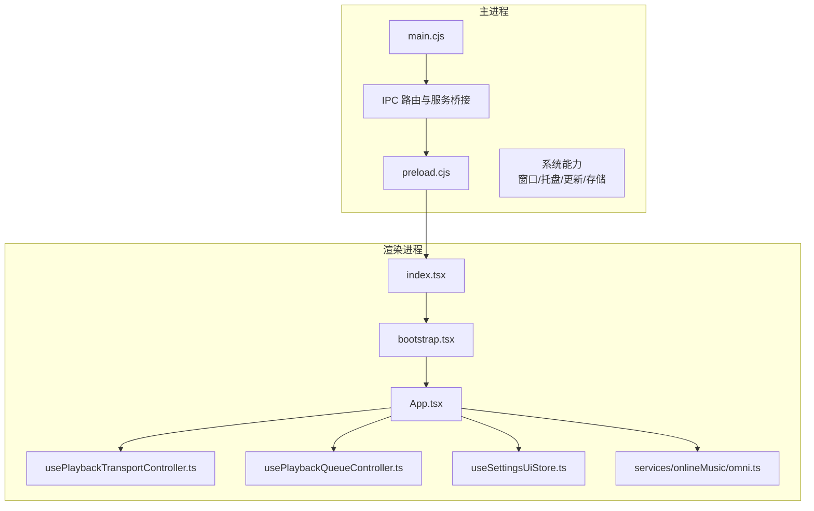
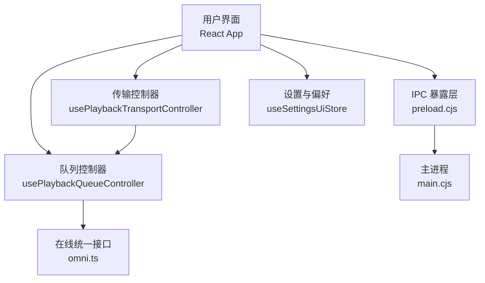
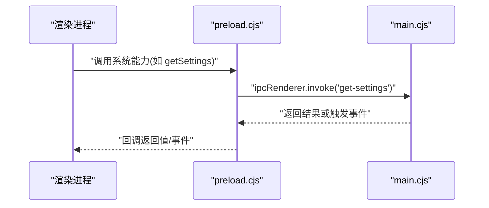
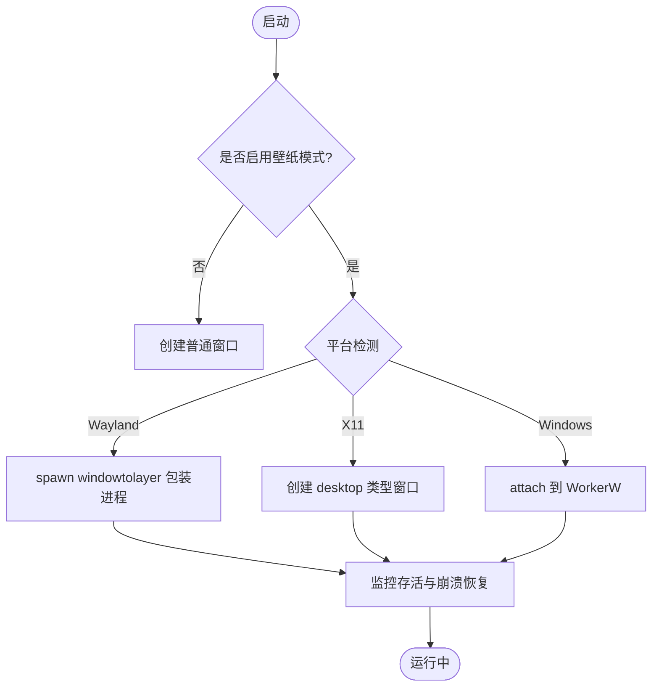
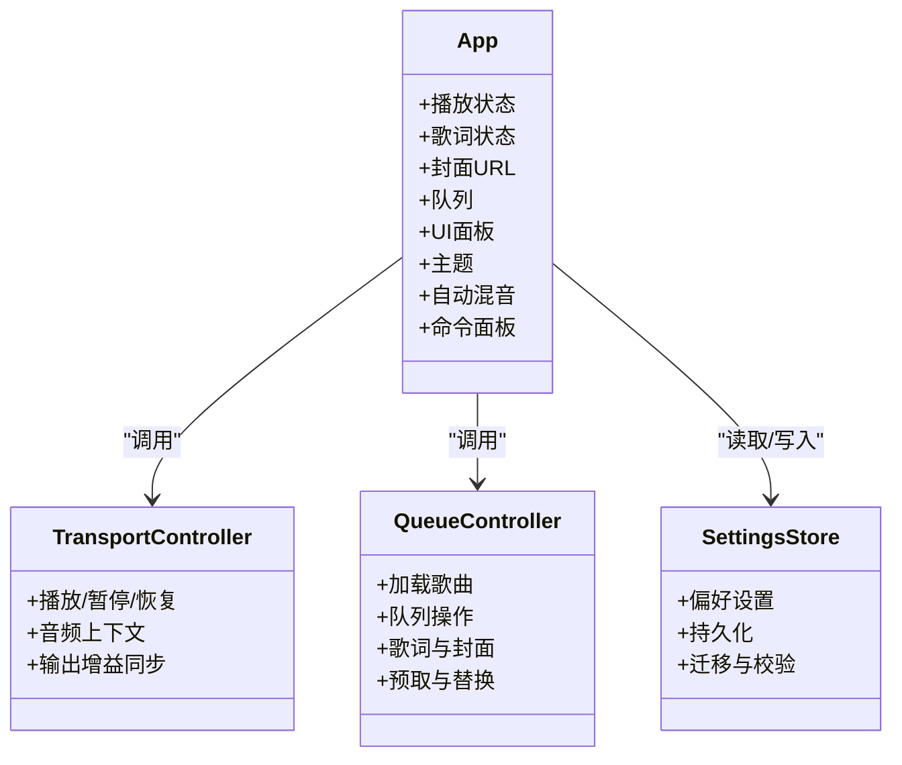
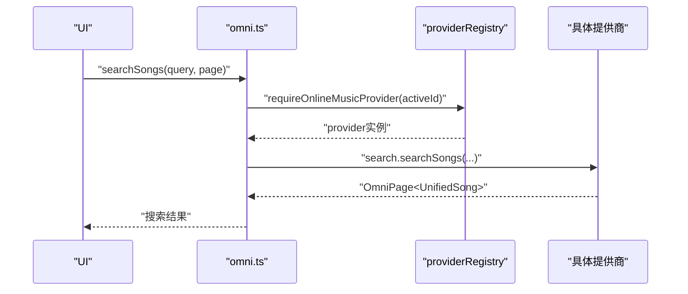
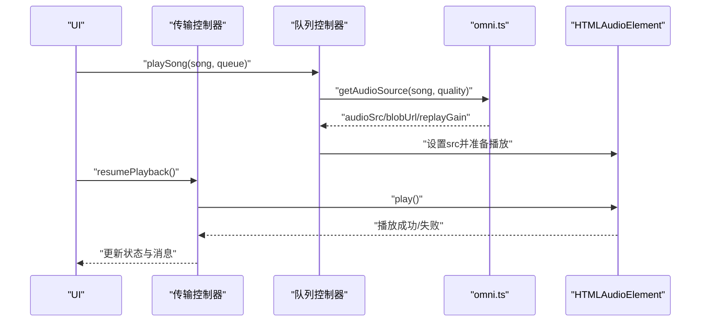
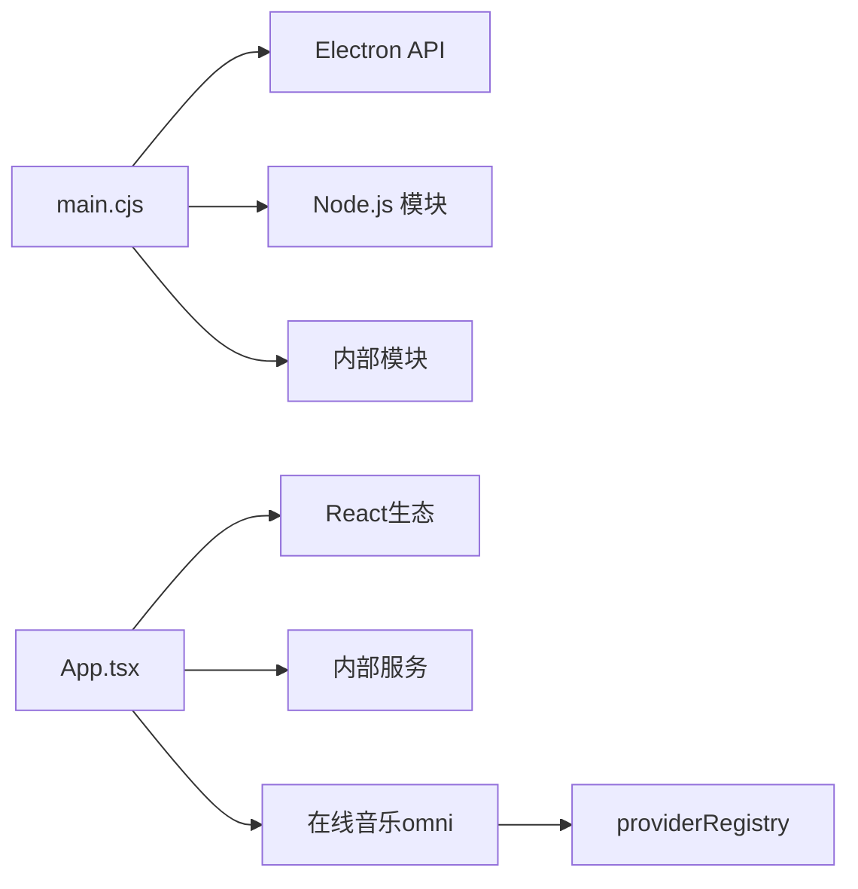

# 核心架构

<cite>
**本文引用的文件**
- [electron/main.cjs](file://electron/main.cjs)
- [electron/preload.cjs](file://electron/preload.cjs)
- [src/index.tsx](file://src/index.tsx)
- [src/bootstrap.tsx](file://src/bootstrap.tsx)
- [src/App.tsx](file://src/App.tsx)
- [src/hooks/usePlaybackTransportController.ts](file://src/hooks/usePlaybackTransportController.ts)
- [src/hooks/usePlaybackQueueController.ts](file://src/hooks/usePlaybackQueueController.ts)
- [src/stores/useSettingsUiStore.ts](file://src/stores/useSettingsUiStore.ts)
- [src/services/onlineMusic/omni.ts](file://src/services/onlineMusic/omni.ts)
</cite>

## 目录
1. [简介](#简介)
2. [项目结构](#项目结构)
3. [核心组件](#核心组件)
4. [架构总览](#架构总览)
5. [详细组件分析](#详细组件分析)
6. [依赖关系分析](#依赖关系分析)
7. [性能考量](#性能考量)
8. [故障排查指南](#故障排查指南)
9. [结论](#结论)
10. [附录](#附录)

## 简介
本技术文档聚焦 Folia Player 的核心架构，围绕基于 Electron 的桌面应用设计、主进程与渲染进程的通信机制、IPC 数据流、窗口管理系统，以及 React 前端架构（组件层次、Zustand 状态管理、路由）进行系统性解析。重点阐述在线音乐统一接口（Omni）如何通过抽象层屏蔽网易云、QQ 音乐、酷狗等提供商差异，实现统一的 API 访问；并深入说明播放系统的整体架构，包括音频处理管道、播放状态管理与队列控制机制。文末提供系统边界图、组件交互图和数据处理流程图，帮助开发者理解设计权衡与核心理念。

## 项目结构
Folia Player 采用“Electron 主进程 + React 渲染进程”的双进程架构：
- 主进程负责系统能力封装（窗口、托盘、更新、本地存储、第三方服务桥接）、壁纸模式、安全策略、IPC 路由等。
- 渲染进程承载 React UI、业务逻辑、状态管理（Zustand）、在线音乐统一接口、播放控制与可视化。

图表来源
- [electron/main.cjs:1-120](file://electron/main.cjs#L1-L120)
- [electron/preload.cjs:1-120](file://electron/preload.cjs#L1-L120)
- [src/index.tsx:1-18](file://src/index.tsx#L1-L18)
- [src/bootstrap.tsx:1-72](file://src/bootstrap.tsx#L1-L72)
- [src/App.tsx:1-120](file://src/App.tsx#L1-L120)

章节来源
- [electron/main.cjs:1-120](file://electron/main.cjs#L1-L120)
- [electron/preload.cjs:1-120](file://electron/preload.cjs#L1-L120)
- [src/index.tsx:1-18](file://src/index.tsx#L1-L18)
- [src/bootstrap.tsx:1-72](file://src/bootstrap.tsx#L1-L72)
- [src/App.tsx:1-120](file://src/App.tsx#L1-L120)

## 核心组件
- 主进程入口与系统能力：窗口生命周期、壁纸模式、托盘、更新、本地存储、协议注册、平台兼容开关、安全策略。
- IPC 暴露层：通过 contextBridge 向渲染进程暴露系统能力调用（设置、缓存、窗口控制、OBS/Stage/Lyric API、Whisper 对齐、模型管理等）。
- 渲染进程启动链：全局初始化（日志、调试、帧率限制）→ 挂载根组件 → 根据 URL 参数选择不同宿主（主应用、远程遥控、OBS 源）。
- 应用顶层组件：聚合播放、歌词、主题、命令面板、面板切换、自动混音、视觉化、偏好设置等。
- 播放控制钩子：传输控制（播放/暂停/恢复）、队列控制（加载、替换、跳过不可用曲目、预取、歌词与封面加载）。
- 设置与偏好：Zustand 集中管理 UI 与播放相关配置，持久化到 localStorage，支持迁移与校验。
- 在线音乐统一接口：Omni 抽象层，统一搜索、认证、收藏、歌单、推荐、播放源获取、歌词、可用性检查与替换等。

章节来源
- [electron/main.cjs:1-120](file://electron/main.cjs#L1-L120)
- [electron/preload.cjs:1-120](file://electron/preload.cjs#L1-L120)
- [src/index.tsx:1-18](file://src/index.tsx#L1-L18)
- [src/bootstrap.tsx:1-72](file://src/bootstrap.tsx#L1-L72)
- [src/App.tsx:1-120](file://src/App.tsx#L1-L120)
- [src/hooks/usePlaybackTransportController.ts:1-173](file://src/hooks/usePlaybackTransportController.ts#L1-L173)
- [src/hooks/usePlaybackQueueController.ts:1-200](file://src/hooks/usePlaybackQueueController.ts#L1-L200)
- [src/stores/useSettingsUiStore.ts:1-120](file://src/stores/useSettingsUiStore.ts#L1-L120)
- [src/services/onlineMusic/omni.ts:1-120](file://src/services/onlineMusic/omni.ts#L1-L120)

## 架构总览
下图展示系统边界与关键交互：主进程提供系统能力并通过 IPC 暴露给渲染进程；渲染进程通过 Omni 统一访问在线音乐提供商；播放控制由传输控制器与队列控制器协作完成；设置与偏好通过 Zustand 统一管理。

图表来源
- [src/App.tsx:1-120](file://src/App.tsx#L1-L120)
- [src/hooks/usePlaybackTransportController.ts:1-173](file://src/hooks/usePlaybackTransportController.ts#L1-L173)
- [src/hooks/usePlaybackQueueController.ts:1-200](file://src/hooks/usePlaybackQueueController.ts#L1-L200)
- [src/services/onlineMusic/omni.ts:1-120](file://src/services/onlineMusic/omni.ts#L1-L120)
- [electron/preload.cjs:1-120](file://electron/preload.cjs#L1-L120)
- [electron/main.cjs:1-120](file://electron/main.cjs#L1-L120)
- [src/stores/useSettingsUiStore.ts:1-120](file://src/stores/useSettingsUiStore.ts#L1-L120)

## 详细组件分析

### 主进程与 IPC 通信机制
- 主进程职责：
  - 注册自定义协议与安全策略，处理证书错误（如特定 CDN 域名放宽）。
  - 平台兼容性处理（Linux Wayland/Vulkan、macOS GPU 加速优化）。
  - 壁纸模式（Wayland/X11/Windows）的生命周期管理、鼠标事件注入、崩溃恢复与重建。
  - 托盘菜单、任务栏按钮、远程窗口、OBS/Stage/Lyric API、更新、缓存、模型管理、Whisper 对齐等。
- IPC 暴露层：
  - 通过 contextBridge 将系统能力以方法形式暴露给渲染进程，包括设置读写、窗口控制、缓存操作、API 状态查询与订阅、媒体会话同步、视频导出、Stage 会话等。
  - 使用 invoke 请求/响应与 on 事件订阅两种模式，保证低开销与高吞吐。

图表来源
- [electron/preload.cjs:1-120](file://electron/preload.cjs#L1-L120)
- [electron/main.cjs:1-120](file://electron/main.cjs#L1-L120)

章节来源
- [electron/main.cjs:1-120](file://electron/main.cjs#L1-L120)
- [electron/preload.cjs:1-120](file://electron/preload.cjs#L1-L120)

### 窗口管理系统
- 主进程维护主窗口、远程窗口、透明模式、点击穿透、置顶、任务栏隐藏、最小化到托盘等。
- 壁纸模式：
  - Wayland：通过外部工具包装进程进入桌面层，失败降级为普通窗口。
  - X11：直接创建 desktop 类型窗口，注意点击穿透限制。
  - Windows：借助 helper 将窗口父级设为 WorkerW，支持 raised/classic 两种附着模式，动态重建窗口以适配透明度。
- 鼠标事件注入：将辅助进程捕获的桌面输入转换为 Chromium 可识别的事件，保持拖拽与滚动的正确性。

图表来源
- [electron/main.cjs:145-560](file://electron/main.cjs#L145-L560)

章节来源
- [electron/main.cjs:145-560](file://electron/main.cjs#L145-L560)

### React 前端架构与状态管理
- 启动链：
  - index.tsx 安装全局能力（Buffer polyfill、日志捕获、调试模块、内存采样、帧率限制）。
  - bootstrap.tsx 根据 URL 参数选择宿主（主应用、远程遥控、OBS 源），初始化本地封面运行时与模组可视化器后挂载根组件。
- 顶层组件 App：
  - 聚合播放状态、歌词、封面、队列、UI 面板、主题、自动混音、命令面板、用户引导等。
  - 通过 hooks 集成播放传输控制、队列控制、偏好设置、媒体会话、OBS/Stage 发布、Whisper 对齐等。
- 状态管理（Zustand）：
  - useSettingsUiStore 集中管理 UI 与播放相关配置，持久化到 localStorage，提供读取、写入、迁移与校验。
  - 其他 store（如搜索导航、集合导航、在线账户、个人 FM 模式、主题快速编辑）按功能域划分，降低耦合。

图表来源
- [src/App.tsx:1-120](file://src/App.tsx#L1-L120)
- [src/stores/useSettingsUiStore.ts:1-120](file://src/stores/useSettingsUiStore.ts#L1-L120)
- [src/hooks/usePlaybackTransportController.ts:1-173](file://src/hooks/usePlaybackTransportController.ts#L1-L173)
- [src/hooks/usePlaybackQueueController.ts:1-200](file://src/hooks/usePlaybackQueueController.ts#L1-L200)

章节来源
- [src/index.tsx:1-18](file://src/index.tsx#L1-L18)
- [src/bootstrap.tsx:1-72](file://src/bootstrap.tsx#L1-L72)
- [src/App.tsx:1-120](file://src/App.tsx#L1-L120)
- [src/stores/useSettingsUiStore.ts:1-120](file://src/stores/useSettingsUiStore.ts#L1-L120)

### 在线音乐统一接口（Omni）
- 目标：屏蔽网易云、QQ 音乐、酷狗等提供商差异，提供统一 API。
- 能力：
  - 认证与登录状态、二维码登录流程。
  - 搜索、收藏、歌单、专辑、云盘、推荐、历史。
  - 播放源获取、可用性检查、替换建议。
  - 歌词获取与合唱段解析。
  - 收藏与歌单变更、订阅状态。
- 设计要点：
  - 通过 providerRegistry 获取具体提供商实例，按能力分支调用。
  - 使用 withActiveProvider 确保请求期间账号切换的一致性。
  - 对缺失能力返回空结果或抛出明确错误，避免 UI 误判。

图表来源
- [src/services/onlineMusic/omni.ts:1-120](file://src/services/onlineMusic/omni.ts#L1-L120)

章节来源
- [src/services/onlineMusic/omni.ts:1-120](file://src/services/onlineMusic/omni.ts#L1-L120)

### 播放系统整体架构
- 音频处理管道：
  - HTMLAudioElement 作为载体，AudioContext/GainNode 用于音量平滑与设备切换。
  - 分析器节点用于频谱与频段数据，驱动可视化。
  - 在线音频源支持 Blob URL 与直链，具备恢复与刷新机制。
- 播放状态管理：
  - 传输控制器负责播放/暂停/恢复，处理 Stage 歌词模式与过渡中的暂停。
  - 队列控制器负责加载、替换、跳过不可用曲目、预取、歌词与封面加载、主题恢复。
- 队列控制机制：
  - 支持循环模式（关闭/全部/单曲）。
  - 不可用歌曲提示与自动跳过确认。
  - 与 Omni 集成，获取播放源与可用性信息。

图表来源
- [src/hooks/usePlaybackQueueController.ts:450-700](file://src/hooks/usePlaybackQueueController.ts#L450-L700)
- [src/hooks/usePlaybackTransportController.ts:70-173](file://src/hooks/usePlaybackTransportController.ts#L70-L173)
- [src/services/onlineMusic/omni.ts:400-420](file://src/services/onlineMusic/omni.ts#L400-L420)

章节来源
- [src/hooks/usePlaybackQueueController.ts:450-700](file://src/hooks/usePlaybackQueueController.ts#L450-L700)
- [src/hooks/usePlaybackTransportController.ts:70-173](file://src/hooks/usePlaybackTransportController.ts#L70-L173)
- [src/services/onlineMusic/omni.ts:400-420](file://src/services/onlineMusic/omni.ts#L400-L420)

## 依赖关系分析
- 主进程依赖：
  - Electron API（app、BrowserWindow、ipcMain、session、screen、dialog、shell、nativeImage、desktopCapturer、Menu、Tray、nativeTheme、powerSaveBlocker、safeStorage、protocol、net）。
  - 文件系统、HTTP、子进程、加密、路径等 Node.js 模块。
  - 内部模块：stageApi、modSystem、windowPlaybackHandoff、wallpaperWatchdog、windowsWallpaperController、kugouApiBridge、qqAuthSessionRepository、discordPresence、voiceInputPause、displaySleepBlocker、lyricApi、localCoverAssets、updateChannels、audioCachePrune、analysis/host、debug/debugHost、modelStore、linuxPasswordStore、themeSanitizer、whisperAlign。
- 渲染进程依赖：
  - React、framer-motion、react-i18next、lucide-react。
  - 内部服务：coverCache、visualizer、command-palette、app shell、home、player panel、panel tabs、modal、remote、obs、shared、visualizer、hooks、stores、types、utils、workers。
  - 在线音乐：omni、providerRegistry、songMetadata、resourceCache、prefetchService、onlinePlayback、lyrics 工具集。

图表来源
- [electron/main.cjs:1-120](file://electron/main.cjs#L1-L120)
- [src/App.tsx:1-120](file://src/App.tsx#L1-L120)
- [src/services/onlineMusic/omni.ts:1-120](file://src/services/onlineMusic/omni.ts#L1-L120)

章节来源
- [electron/main.cjs:1-120](file://electron/main.cjs#L1-L120)
- [src/App.tsx:1-120](file://src/App.tsx#L1-L120)
- [src/services/onlineMusic/omni.ts:1-120](file://src/services/onlineMusic/omni.ts#L1-L120)

## 性能考量
- 音频与可视化：
  - 使用 AudioContext 平滑音量变化，避免突变导致的听感不适。
  - 分析器节点仅在高需求场景启用，减少 CPU 占用。
  - 帧率限制器防止可视化过度渲染。
- 网络与缓存：
  - 在线音频支持 Blob URL 与直链，结合预取与缓存减少重复下载。
  - 封面与歌词异步加载，优先显示缓存资源。
- 主进程资源：
  - 壁纸模式下的进程监控与崩溃恢复，避免长时间无响应。
  - 平台特性开关（如禁用 Vulkan、SwiftShader）提升稳定性。
- 状态与渲染：
  - Zustand 细粒度 store 降低重渲染范围。
  - 懒加载与 Suspense 减少首屏体积。

[本节为通用指导，不直接分析具体文件]

## 故障排查指南
- 播放失败：
  - 检查在线音频源是否可用，查看队列控制器中的不可用替换与自动跳过逻辑。
  - 确认传输控制器是否正确恢复音频上下文与输出增益。
- 歌词不同步：
  - 检查歌词时间轴偏移设置与 Whisper 自动对齐是否启用。
  - 验证歌词加载状态与纯音乐标记。
- 壁纸模式异常：
  - 查看主进程中的平台检测与辅助进程生命周期，确认是否触发降级或重建。
- IPC 调用失败：
  - 核对 preload.cjs 暴露的方法名与 main.cjs 的 IPC 路由是否一致。
  - 检查事件订阅是否正确移除，避免内存泄漏。

章节来源
- [src/hooks/usePlaybackQueueController.ts:370-460](file://src/hooks/usePlaybackQueueController.ts#L370-L460)
- [src/hooks/usePlaybackTransportController.ts:100-173](file://src/hooks/usePlaybackTransportController.ts#L100-L173)
- [electron/main.cjs:145-560](file://electron/main.cjs#L145-L560)
- [electron/preload.cjs:1-120](file://electron/preload.cjs#L1-L120)

## 结论
Folia Player 通过清晰的 Electron 双进程架构与 React 前端分层设计，实现了跨平台桌面应用的稳定运行与丰富功能。主进程专注系统能力与窗口管理，渲染进程聚焦用户体验与业务逻辑。在线音乐统一接口（Omni）有效屏蔽了多提供商差异，提升了扩展性与可维护性。播放系统以传输控制器与队列控制器为核心，配合 Zustand 状态管理与 IPC 通信，构建了高效可靠的音频处理管道。整体设计在性能、稳定性与可扩展性之间取得良好平衡，为后续功能演进奠定了坚实基础。

[本节为总结性内容，不直接分析具体文件]

## 附录
- 术语表：
  - Omni：在线音乐统一接口抽象层。
  - 传输控制器：负责播放/暂停/恢复等基础播放行为。
  - 队列控制器：负责歌曲加载、队列操作、歌词与封面加载。
  - 壁纸模式：将主窗口嵌入桌面层的特殊显示模式。
- 参考文件：
  - 主进程入口与系统能力：[electron/main.cjs](file://electron/main.cjs)
  - IPC 暴露层：[electron/preload.cjs](file://electron/preload.cjs)
  - 渲染进程启动链：[src/index.tsx](file://src/index.tsx)、[src/bootstrap.tsx](file://src/bootstrap.tsx)
  - 应用顶层组件：[src/App.tsx](file://src/App.tsx)
  - 播放控制钩子：[src/hooks/usePlaybackTransportController.ts](file://src/hooks/usePlaybackTransportController.ts)、[src/hooks/usePlaybackQueueController.ts](file://src/hooks/usePlaybackQueueController.ts)
  - 设置与偏好：[src/stores/useSettingsUiStore.ts](file://src/stores/useSettingsUiStore.ts)
  - 在线音乐统一接口：[src/services/onlineMusic/omni.ts](file://src/services/onlineMusic/omni.ts)

[本节为附录内容，不直接分析具体文件]