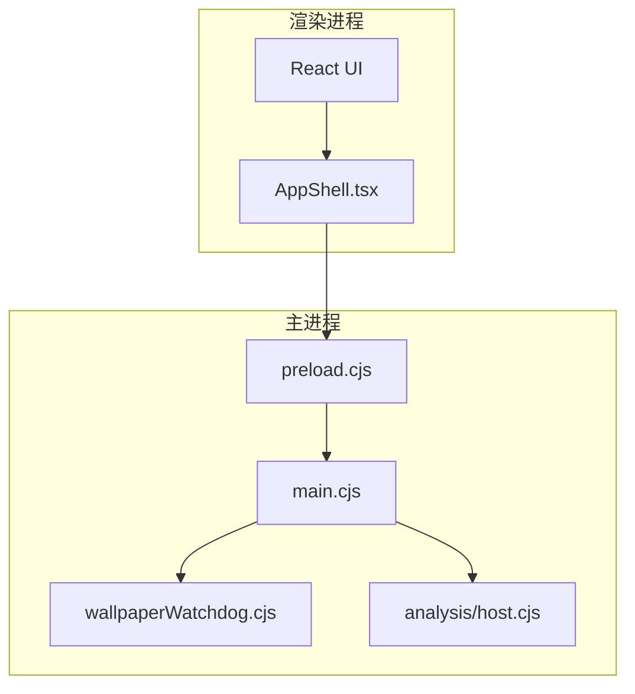
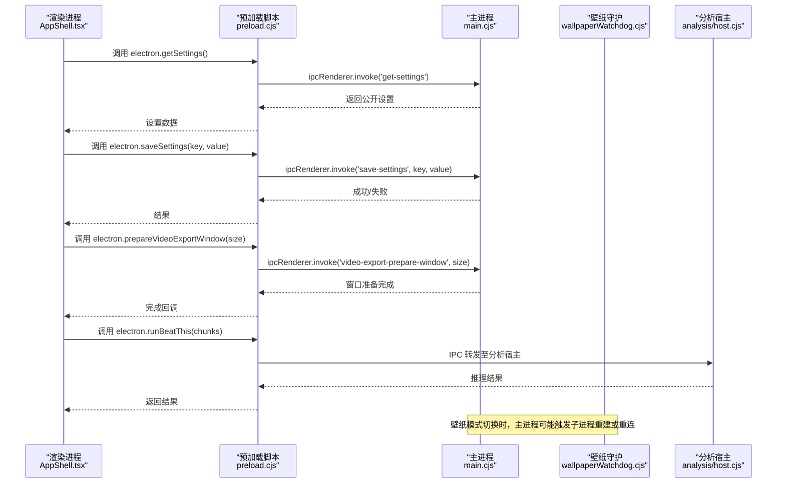
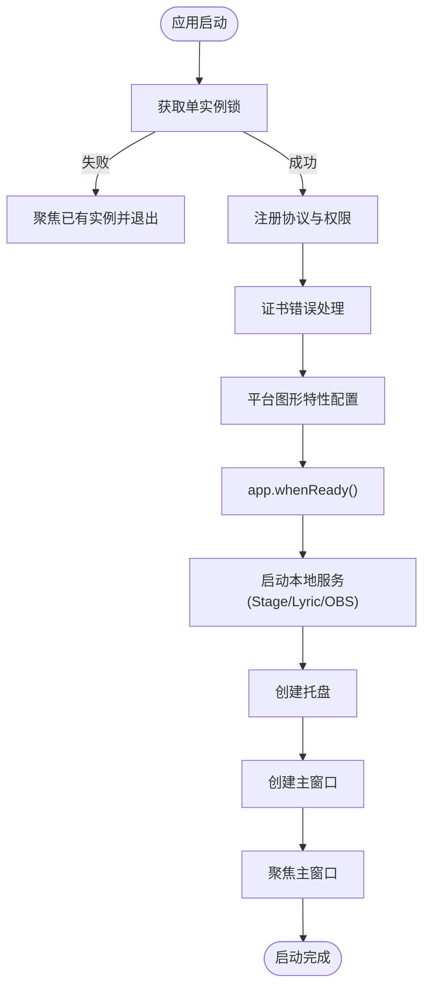
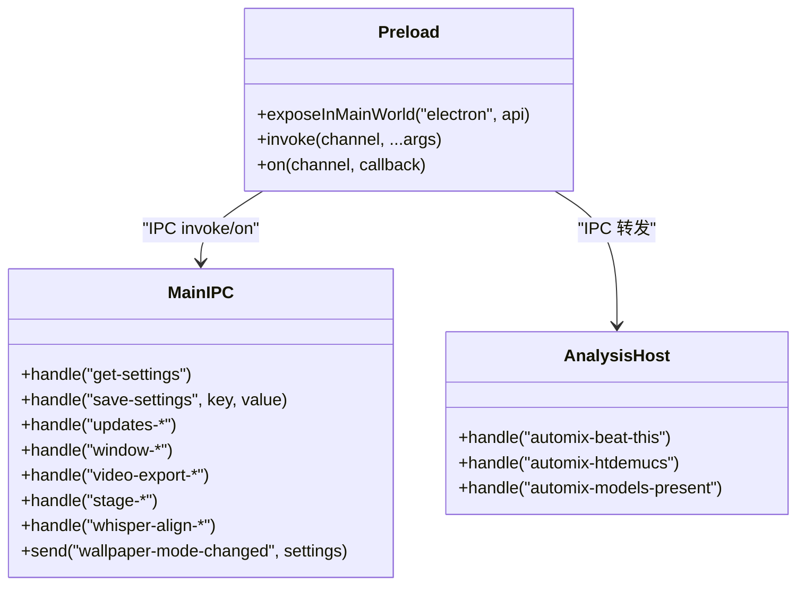
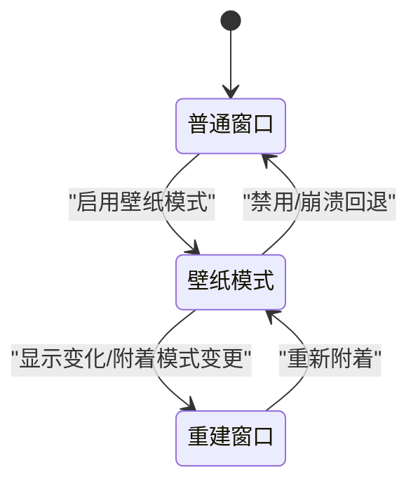
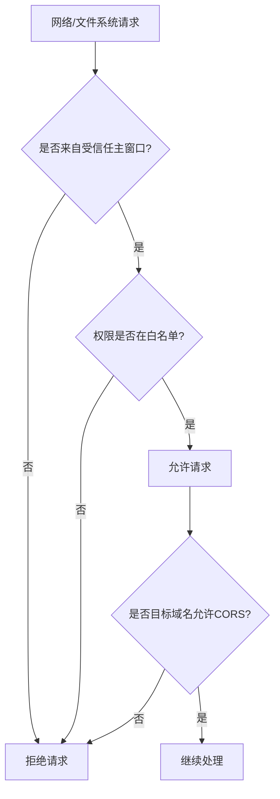
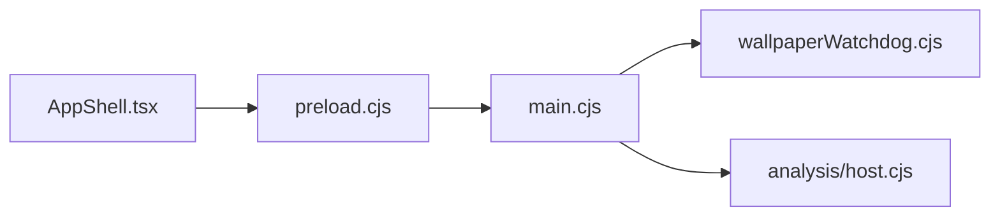

# Electron架构设计

<cite>
**本文引用的文件**
- [electron/main.cjs](file://electron/main.cjs)
- [electron/preload.cjs](file://electron/preload.cjs)
- [electron/wallpaperWatchdog.cjs](file://electron/wallpaperWatchdog.cjs)
- [electron/analysis/host.cjs](file://electron/analysis/host.cjs)
- [src/components/app/AppShell.tsx](file://src/components/app/AppShell.tsx)
</cite>

## 目录
1. [简介](#简介)
2. [项目结构](#项目结构)
3. [核心组件](#核心组件)
4. [架构总览](#架构总览)
5. [详细组件分析](#详细组件分析)
6. [依赖关系分析](#依赖关系分析)
7. [性能考量](#性能考量)
8. [故障排查指南](#故障排查指南)
9. [结论](#结论)
10. [附录](#附录)

## 简介
本技术文档聚焦 Folia Player 的 Electron 桌面端架构，围绕主进程与渲染进程的通信机制、应用启动流程、窗口生命周期管理、安全模型以及跨平台兼容性与性能优化展开。文档以代码级事实为依据，结合时序图、流程图和类图帮助读者理解系统设计与实现细节。

## 项目结构
Folia Player 采用典型的 Electron 多进程架构：
- 主进程（main.cjs）负责单实例锁、协议注册、权限控制、窗口管理、本地服务（Stage/Lyric/OBS）、更新检查、壁纸模式等。
- 预加载脚本（preload.cjs）通过 contextBridge 暴露最小化 API 给渲染进程，屏蔽底层 IPC 细节。
- 渲染进程（React/Vite 构建）通过 electron 全局对象调用能力，如设置、缓存、窗口控制、音视频导出、Whisper 对齐等。
- 辅助模块包括壁纸守护（wallpaperWatchdog.cjs）、分析宿主（analysis/host.cjs）等。

**图表来源**
- [electron/main.cjs:4073-4141](file://electron/main.cjs#L4073-L4141)
- [electron/preload.cjs:1-320](file://electron/preload.cjs#L1-L320)
- [electron/wallpaperWatchdog.cjs:25-186](file://electron/wallpaperWatchdog.cjs#L25-L186)
- [electron/analysis/host.cjs:173-194](file://electron/analysis/host.cjs#L173-L194)
- [src/components/app/AppShell.tsx:1-42](file://src/components/app/AppShell.tsx#L1-L42)

**章节来源**
- [electron/main.cjs:4073-4141](file://electron/main.cjs#L4073-L4141)
- [electron/preload.cjs:1-320](file://electron/preload.cjs#L1-L320)

## 核心组件
- 主进程入口与初始化：单实例锁、协议注册、证书错误处理、Linux/macOS图形加速开关、托盘、自动更新、本地服务启动、窗口创建与聚焦。
- 预加载桥接：将渲染进程需要的能力通过 contextBridge 暴露为受限 API，使用 ipcRenderer.invoke/on 与主进程通信。
- 壁纸模式守护：检测并重启子进程、健康探针、崩溃计数、回退到普通窗口。
- 分析宿主：提供 beat-this、htdemucs 等推理能力，并通过 IPC 暴露给渲染进程。

**章节来源**
- [electron/main.cjs:42-137](file://electron/main.cjs#L42-L137)
- [electron/main.cjs:4073-4141](file://electron/main.cjs#L4073-L4141)
- [electron/preload.cjs:1-320](file://electron/preload.cjs#L1-L320)
- [electron/wallpaperWatchdog.cjs:25-186](file://electron/wallpaperWatchdog.cjs#L25-L186)
- [electron/analysis/host.cjs:173-194](file://electron/analysis/host.cjs#L173-L194)

## 架构总览
下图展示了从渲染进程发起请求到主进程处理并返回结果的典型 IPC 调用链，涵盖设置读取、缓存操作、窗口控制、更新状态、视频导出、Stage 会话等。

**图表来源**
- [electron/preload.cjs:73-107](file://electron/preload.cjs#L73-L107)
- [electron/preload.cjs:223-227](file://electron/preload.cjs#L223-L227)
- [electron/preload.cjs:11-15](file://electron/preload.cjs#L11-L15)
- [electron/analysis/host.cjs:173-194](file://electron/analysis/host.cjs#L173-L194)
- [electron/main.cjs:4292-4311](file://electron/main.cjs#L4292-L4311)

## 详细组件分析

### 启动流程与单实例锁
- 单实例锁：在应用启动前尝试获取单实例锁；若已有实例运行则聚焦并退出当前进程；支持 FOLIA_RELAUNCH=1 的重入重试，避免竞态。
- 协议注册：注册自定义协议方案（如封面资源），启用标准、安全、CORS、流式访问等特权。
- 证书错误处理：针对特定 CDN 域名放宽证书校验，仅允许指定错误类型。
- 图形与平台特性：Linux 下根据环境变量选择软件渲染或 SwiftShader；macOS x64 开启 GPU 光栅化与忽略 GPU 黑名单。
- 就绪后初始化：设置代理、文件系统权限处理器、CORS 绕过策略、本地封面协议、托盘、自动更新、本地服务（Stage/Lyric/OBS）、创建主窗口并聚焦。

**图表来源**
- [electron/main.cjs:1527-1547](file://electron/main.cjs#L1527-L1547)
- [electron/main.cjs:42-76](file://electron/main.cjs#L42-L76)
- [electron/main.cjs:78-137](file://electron/main.cjs#L78-L137)
- [electron/main.cjs:4073-4141](file://electron/main.cjs#L4073-L4141)

**章节来源**
- [electron/main.cjs:1527-1547](file://electron/main.cjs#L1527-L1547)
- [electron/main.cjs:42-76](file://electron/main.cjs#L42-L76)
- [electron/main.cjs:78-137](file://electron/main.cjs#L78-L137)
- [electron/main.cjs:4073-4141](file://electron/main.cjs#L4073-L4141)

### IPC 消息传递与事件系统
- 预加载层：通过 contextBridge.exposeInMainWorld 暴露 electron 全局对象，封装所有 IPC 调用（invoke/on）。
- 主进程监听：使用 ipcMain.handle 处理请求型 IPC（如 get-settings、save-settings、updates-*、window-*、video-export-*、stage-*、whisper-align-*、mods.*）。
- 事件广播：主进程通过 webContents.send 向渲染进程推送状态变更（如 wallpaper-mode-changed、update-status-changed、obs-browser-source-status-changed、discord-presence-status-changed、playback-sync-bridge-status-changed）。
- 分析宿主：将重型计算（beat-this、htdemucs）隔离到分析宿主进程，通过 IPC 暴露能力，渲染进程按需调用。

**图表来源**
- [electron/preload.cjs:1-320](file://electron/preload.cjs#L1-L320)
- [electron/main.cjs:4284-4311](file://electron/main.cjs#L4284-L4311)
- [electron/analysis/host.cjs:173-194](file://electron/analysis/host.cjs#L173-L194)

**章节来源**
- [electron/preload.cjs:1-320](file://electron/preload.cjs#L1-L320)
- [electron/main.cjs:4284-4311](file://electron/main.cjs#L4284-L4311)
- [electron/analysis/host.cjs:173-194](file://electron/analysis/host.cjs#L173-L194)

### 窗口管理系统
- 主窗口：创建、聚焦、最大化/最小化、全屏、透明背景、点击穿透、置顶、任务栏隐藏、Windows 任务栏缩略按钮（Thumbar）。
- 远程窗口：独立窗口用于远程控制，支持置顶、跳过任务栏、快照发布与命令接收。
- 视频导出窗口：准备、恢复、写入导出文件，配合渲染进程进行媒体输出。
- 壁纸模式：
  - Linux Wayland：通过 windowtolayer 包装子进程进入桌面层，支持点击穿透与鼠标输入注入。
  - Windows：通过 folia-wallpaper-helper.exe 将窗口父化到 WorkerW，支持 raised/classic 两种附着模式，动态重建窗口以适配透明性。
  - 守护进程：健康探针、崩溃计数、自动回退到普通窗口。

**图表来源**
- [electron/main.cjs:1101-1129](file://electron/main.cjs#L1101-L1129)
- [electron/main.cjs:4046-4071](file://electron/main.cjs#L4046-L4071)
- [electron/main.cjs:4144-4200](file://electron/main.cjs#L4144-L4200)
- [electron/wallpaperWatchdog.cjs:25-186](file://electron/wallpaperWatchdog.cjs#L25-L186)

**章节来源**
- [electron/main.cjs:1101-1129](file://electron/main.cjs#L1101-L1129)
- [electron/main.cjs:4046-4071](file://electron/main.cjs#L4046-L4071)
- [electron/main.cjs:4144-4200](file://electron/main.cjs#L4144-L4200)
- [electron/wallpaperWatchdog.cjs:25-186](file://electron/wallpaperWatchdog.cjs#L25-L186)

### 安全模型
- 沙箱与上下文隔离：通过 preload 脚本暴露最小化 API，渲染进程无法直接访问 Node/Electron 内部。
- 权限控制：
  - 文件系统访问：仅信任主窗口来源的请求，白名单权限（文件系统、字体、剪贴板写、扬声器选择、音频媒体）。
  - 网络策略：对特定域名（QQ/Kugou）放宽 CORS 限制，仅针对媒体资源或特定主机名。
  - 证书错误：仅允许特定 CDN 的错误类型，其他一律拒绝。
- 网络安全：默认使用系统代理，必要时强制刷新代理配置并关闭连接。

**图表来源**
- [electron/main.cjs:1557-1671](file://electron/main.cjs#L1557-L1671)
- [electron/main.cjs:1674-1700](file://electron/main.cjs#L1674-L1700)
- [electron/main.cjs:56-76](file://electron/main.cjs#L56-L76)

**章节来源**
- [electron/main.cjs:1557-1671](file://electron/main.cjs#L1557-L1671)
- [electron/main.cjs:1674-1700](file://electron/main.cjs#L1674-L1700)
- [electron/main.cjs:56-76](file://electron/main.cjs#L56-L76)

### 跨平台兼容性
- Linux：
  - 密码存储后端选择（XDG 桌面环境），禁用 Vulkan，Ozone 平台提示，可选 SwiftShader。
  - 壁纸模式通过 windowtolayer 二进制进入桌面层，需存在可执行文件。
- macOS：
  - x64 架构下忽略 GPU 黑名单、启用 GL 后端与 GPU 光栅化。
  - 托盘图标使用模板图像与 Retina 资源。
- Windows：
  - 应用用户模型 ID 设置，任务栏缩略按钮（Thumbar）播放控制。
  - 壁纸模式通过 helper.exe 将窗口父化到 WorkerW，支持 raised/classic 附着模式，显示变化时重建几何。

**章节来源**
- [electron/main.cjs:78-137](file://electron/main.cjs#L78-L137)
- [electron/main.cjs:807-868](file://electron/main.cjs#L807-L868)
- [electron/main.cjs:1131-1188](file://electron/main.cjs#L1131-L1188)
- [electron/main.cjs:4144-4200](file://electron/main.cjs#L4144-L4200)

## 依赖关系分析
- 主进程依赖：
  - 预加载脚本：通过 contextBridge 暴露 API。
  - 壁纸守护：检测/重启子进程、健康探针。
  - 分析宿主：提供推理能力。
  - 本地服务：Stage、Lyric、OBS Browser Source。
- 渲染进程依赖：
  - 预加载脚本：统一 IPC 接口。
  - UI 组件：AppShell 等通过 electron 全局对象调用能力。

**图表来源**
- [electron/preload.cjs:1-320](file://electron/preload.cjs#L1-L320)
- [electron/main.cjs:4073-4141](file://electron/main.cjs#L4073-L4141)
- [electron/wallpaperWatchdog.cjs:25-186](file://electron/wallpaperWatchdog.cjs#L25-L186)
- [electron/analysis/host.cjs:173-194](file://electron/analysis/host.cjs#L173-L194)
- [src/components/app/AppShell.tsx:1-42](file://src/components/app/AppShell.tsx#L1-L42)

**章节来源**
- [electron/preload.cjs:1-320](file://electron/preload.cjs#L1-L320)
- [electron/main.cjs:4073-4141](file://electron/main.cjs#L4073-L4141)
- [electron/wallpaperWatchdog.cjs:25-186](file://electron/wallpaperWatchdog.cjs#L25-L186)
- [electron/analysis/host.cjs:173-194](file://electron/analysis/host.cjs#L173-L194)
- [src/components/app/AppShell.tsx:1-42](file://src/components/app/AppShell.tsx#L1-L42)

## 性能考量
- 内存管理：
  - 渲染进程内存采样通过 debugRendererMemory 上报，主进程周期性收集。
  - 音频/封面缓存提供统计与清理接口，避免无限增长。
- GPU 加速：
  - macOS x64 忽略 GPU 黑名单并使用 GL 后端与光栅化。
  - Linux 可选择 SwiftShader 或禁用硬件加速以规避驱动问题。
- 资源加载优化：
  - 自定义协议（folia-cover）启用流式访问与 CORS，提升封面加载效率。
  - 代理设置与连接关闭确保网络资源及时释放。

**章节来源**
- [electron/preload.cjs:34-47](file://electron/preload.cjs#L34-L47)
- [electron/preload.cjs:102-116](file://electron/preload.cjs#L102-L116)
- [electron/main.cjs:132-137](file://electron/main.cjs#L132-L137)
- [electron/main.cjs:42-54](file://electron/main.cjs#L42-L54)
- [electron/main.cjs:1549-1554](file://electron/main.cjs#L1549-L1554)

## 故障排查指南
- 壁纸模式异常：
  - 检查 windowtolayer/folia-wallpaper-helper 是否存在且可执行。
  - 观察健康探针与崩溃计数，必要时回退到普通窗口。
- 权限被拒：
  - 确认请求来源是否为主窗口，权限是否在白名单。
  - 查看 CORS 策略是否放行目标域名。
- 证书错误：
  - 仅允许特定 CDN 的错误类型，其他一律拒绝。
- 更新与服务：
  - 检查自动更新状态与本地服务（Stage/Lyric/OBS）启动日志。

**章节来源**
- [electron/wallpaperWatchdog.cjs:25-186](file://electron/wallpaperWatchdog.cjs#L25-L186)
- [electron/main.cjs:1557-1671](file://electron/main.cjs#L1557-L1671)
- [electron/main.cjs:56-76](file://electron/main.cjs#L56-L76)
- [electron/main.cjs:4125-4138](file://electron/main.cjs#L4125-L4138)

## 结论
Folia Player 的 Electron 架构通过严格的主进程控制、最小化的预加载桥接、细粒度的权限与安全策略，实现了跨平台的稳定桌面体验。壁纸模式、本地服务、分析宿主等功能在主进程中集中管理，渲染进程专注于 UI 与交互。性能优化与跨平台适配贯穿始终，确保在不同环境下均能提供一致的用户体验。

## 附录
- 关键 IPC 通道示例：
  - 设置：get-settings、save-settings
  - 更新：updates-get-status、updates-check、updates-mark-seen、updates-open-release-page、updates-download、updates-quit-and-install
  - 窗口：window-minimize、window-toggle-maximize、window-toggle-fullscreen、window-close、window-set-native-theme、window-get-click-through、window-set-click-through、window-get-always-on-top、window-set-always-on-top
  - 视频导出：video-export-choose-path、video-export-get-main-window-source、video-export-prepare-window、video-export-restore-window、video-export-write-file
  - Stage：stage-get-status、stage-set-enabled、stage-regenerate-token、stage-clear-state、stage-complete-external-play、stage-publish-player-snapshot、stage-complete-player-control、stage-complete-player-queue
  - Whisper 对齐：whisper-align-get-status、whisper-align-get-models、whisper-align-download-model、whisper-align-transcribe、whisper-align-cancel、whisper-align-prepare-audio、whisper-align-install-cli、whisper-align-install-ffmpeg、whisper-align-fetch-audio
  - 模块系统：folia-mods:list、folia-mods:set-enabled、folia-mods:reload、folia-mods:invoke、folia-mods:export-cancel、folia-mods:push-runtime-snapshot、folia-mods:ffmpeg-status、folia-mods:open-directory、folia-mods:install-zip

**章节来源**
- [electron/preload.cjs:73-107](file://electron/preload.cjs#L73-L107)
- [electron/preload.cjs:223-227](file://electron/preload.cjs#L223-L227)
- [electron/preload.cjs:229-246](file://electron/preload.cjs#L229-L246)
- [electron/preload.cjs:263-291](file://electron/preload.cjs#L263-L291)
- [electron/preload.cjs:293-318](file://electron/preload.cjs#L293-L318)