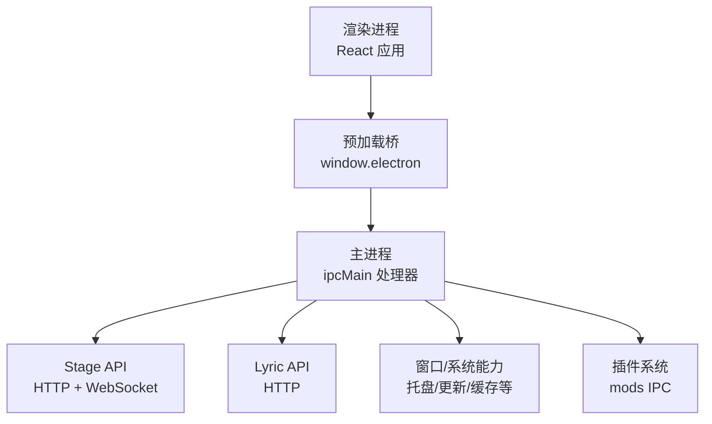
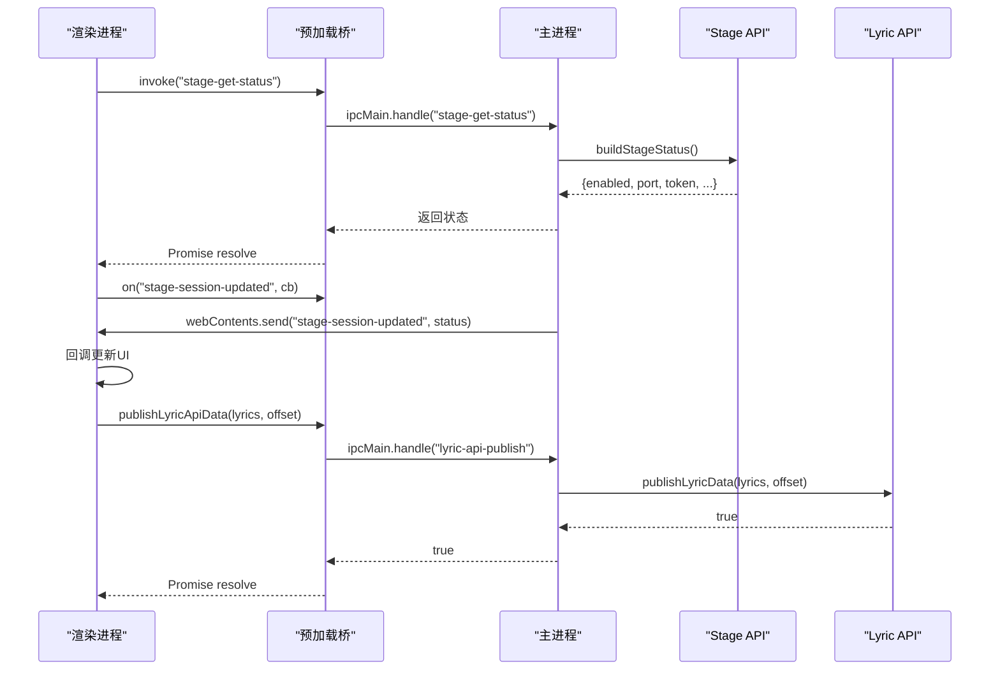
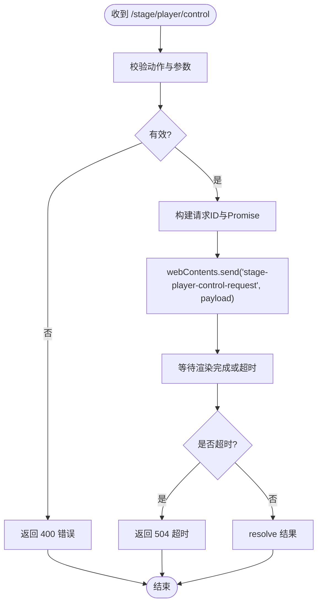
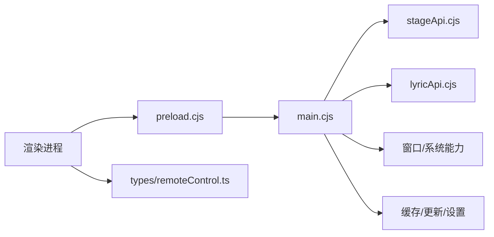

# IPC通信机制

<cite>
**本文引用的文件**
- [electron/main.cjs](file://electron/main.cjs)
- [electron/preload.cjs](file://electron/preload.cjs)
- [electron/stageApi.cjs](file://electron/stageApi.cjs)
- [electron/lyricApi.cjs](file://electron/lyricApi.cjs)
- [src/mods/ipc.ts](file://src/mods/ipc.ts)
- [src/types/remoteControl.ts](file://src/types/remoteControl.ts)
- [test/manual/stage-client/API_SCHEMA.md](file://test/manual/stage-client/API_SCHEMA.md)
</cite>

## 目录
1. [简介](#简介)
2. [项目结构](#项目结构)
3. [核心组件](#核心组件)
4. [架构总览](#架构总览)
5. [详细组件分析](#详细组件分析)
6. [依赖关系分析](#依赖关系分析)
7. [性能考量](#性能考量)
8. [故障排查指南](#故障排查指南)
9. [结论](#结论)
10. [附录](#附录)

## 简介
本技术文档聚焦 Folia Player 的主进程与渲染进程之间的 IPC 通信机制，系统性解析通道注册、消息路由、事件系统、安全模型、异步通信模式、错误处理与异常捕获，以及性能优化策略。重点覆盖 Stage API、Lyric API、远程控制（Remote Control）等外部接口在 IPC 层的设计与实现，帮助读者理解从渲染进程到主进程再到本地服务/子模块的完整调用链。

## 项目结构
Folia Player 采用 Electron 多进程架构：
- 主进程（main.cjs）：集中注册 ipcMain 处理器、管理窗口生命周期、集成 Stage/Lyric/Remote 等服务、维护设置与状态。
- 预加载脚本（preload.cjs）：通过 contextBridge 暴露安全的 window.electron API，封装 ipcRenderer.invoke/send/on，屏蔽底层细节。
- 渲染进程（React/Vite）：通过 window.electron.* 调用 IPC；使用 hooks 订阅事件并驱动 UI。
- 外部服务：Stage API（HTTP+WebSocket）、Lyric API（HTTP），由主进程启动并受设置开关控制。

**图示来源**
- [electron/main.cjs:4278-4999](file://electron/main.cjs#L4278-L4999)
- [electron/preload.cjs:1-320](file://electron/preload.cjs#L1-L320)
- [electron/stageApi.cjs:17-25](file://electron/stageApi.cjs#L17-L25)
- [electron/lyricApi.cjs:83-100](file://electron/lyricApi.cjs#L83-L100)

**章节来源**
- [electron/main.cjs:4278-4999](file://electron/main.cjs#L4278-L4999)
- [electron/preload.cjs:1-320](file://electron/preload.cjs#L1-L320)

## 核心组件
- 预加载桥（preload.cjs）：将 ipcRenderer 的能力以白名单形式暴露给渲染进程，包括设置读写、窗口控制、缓存、更新、Stage/Lyric/Remote 控制、调试、Whisper 对齐、插件系统等。
- 主进程 IPC 路由（main.cjs）：集中注册大量 ipcMain.handle/on 处理器，负责权限校验、参数归一化、持久化、跨进程事件广播、服务启停。
- Stage API（stageApi.cjs）：提供 HTTP 与 WebSocket 接口，支持歌词注入、媒体会话、播放控制、队列操作、状态查询，内置鉴权与限流。
- Lyric API（lyricApi.cjs）：提供只读 HTTP 接口，输出经过清洗的歌词快照，供可信本地客户端消费。
- 插件系统 IPC（src/mods/ipc.ts）：为渲染侧提供类型化的 mods 调用封装，统一降级与错误处理。
- 远程控制类型（src/types/remoteControl.ts）：定义远程窗口与主进程之间共享的快照与命令类型。

**章节来源**
- [electron/preload.cjs:1-320](file://electron/preload.cjs#L1-L320)
- [electron/main.cjs:4278-4999](file://electron/main.cjs#L4278-L4999)
- [electron/stageApi.cjs:17-25](file://electron/stageApi.cjs#L17-L25)
- [electron/lyricApi.cjs:83-100](file://electron/lyricApi.cjs#L83-L100)
- [src/mods/ipc.ts:1-119](file://src/mods/ipc.ts#L1-L119)
- [src/types/remoteControl.ts:1-80](file://src/types/remoteControl.ts#L1-L80)

## 架构总览
IPC 通信遵循“渲染进程 → 预加载桥 → 主进程处理器 → 业务模块/服务”的分层模型。关键特征：
- 通道注册：主进程集中注册 ipcMain.handle/on，预加载桥集中暴露方法。
- 消息路由：按字符串通道名分发到具体处理器，处理器内再委派到 Stage/Lyric/窗口/缓存等子系统。
- 事件系统：主进程通过 mainWindow.webContents.send 向渲染进程推送状态变更（如 stage-session-updated、lyric-api-status-changed）。
- 安全模型：敏感操作均进行发送者信任校验（isTrustedMainWindowContents/isTrustedRemoteControlContents），外部服务启用 Bearer Token 鉴权。
- 异步模式：Promise（invoke）与事件（on）并存；Stage 内部使用 Promise+超时管理请求；Lyric/Stage 对外提供 HTTP 接口。

**图示来源**
- [electron/preload.cjs:229-261](file://electron/preload.cjs#L229-L261)
- [electron/main.cjs:4975-4999](file://electron/main.cjs#L4975-L4999)
- [electron/stageApi.cjs:291-300](file://electron/stageApi.cjs#L291-L300)
- [electron/lyricApi.cjs:183-186](file://electron/lyricApi.cjs#L183-L186)

## 详细组件分析

### 预加载桥（preload.cjs）
- 职责：将 ipcRenderer 的 invoke/send/on 封装为 window.electron.* 方法，屏蔽底层 IPC 细节，提供统一的调用入口。
- 设计要点：
  - 所有方法均为 Promise 或带取消函数的订阅器，便于渲染侧组合。
  - 对事件监听提供返回的清理函数，避免内存泄漏。
  - 批量/节流：日志写入、DPR 上报等场景减少不必要往返。
- 典型通道：
  - 设置与系统：get-settings/save-settings、window-*、app-quit、updates-*
  - 缓存：audio-cache/cover-cache/local-cover-assets
  - 外部服务：stage-*、lyric-api-*、obs-browser-source-*、discord-presence-*
  - 调试与工具：debug-*、whisper-align-*、mods.*

**章节来源**
- [electron/preload.cjs:1-320](file://electron/preload.cjs#L1-L320)

### 主进程 IPC 路由（main.cjs）
- 职责：集中注册 ipcMain 处理器，执行权限校验、参数归一化、状态持久化、跨进程事件广播、服务启停。
- 安全校验：
  - isTrustedMainWindowContents/isTrustedRemoteControlContents 用于限制敏感操作仅来自可信渲染上下文。
  - 对窗口全屏、关闭、透明模式、点击穿透、置顶等能力进行严格校验。
- 设置联动：
  - save-settings 根据 key 触发不同副作用（如切换 Stage 源、刷新自动更新、重启辅助进程等）。
- 事件广播：
  - 通过 mainWindow.webContents.send 推送状态变化（如 lyric-api-status-changed、stage-session-updated）。

**章节来源**
- [electron/main.cjs:4278-4999](file://electron/main.cjs#L4278-L4999)

### Stage API（stageApi.cjs）
- 协议：
  - HTTP：/stage/status、/stage/lyrics、/stage/session、/stage/state、/stage/player/* 等
  - WebSocket：/stage/player/ws 推送播放状态与队列变更
- 鉴权：
  - HTTP 除健康检查外需 Authorization: Bearer <token>
  - WS 支持 Header 或 query token
- 功能：
  - 歌词注入（多种格式）、媒体会话、搜索、播放控制、队列增删改查、状态查询
  - 内部使用 Promise+Map 管理外部播放请求与播放器控制/队列请求，具备超时与取消逻辑
- 资源管理：
  - 会话工作目录、资产索引、保留数量限制、清理策略
- 事件：
  - 通过 mainWindow.webContents.send 广播 stage-session-updated/cleared 等事件

**图示来源**
- [electron/stageApi.cjs:1496-1533](file://electron/stageApi.cjs#L1496-L1533)

**章节来源**
- [electron/stageApi.cjs:17-25](file://electron/stageApi.cjs#L17-L25)
- [electron/stageApi.cjs:291-300](file://electron/stageApi.cjs#L291-L300)
- [electron/stageApi.cjs:572-619](file://electron/stageApi.cjs#L572-L619)
- [electron/stageApi.cjs:755-785](file://electron/stageApi.cjs#L755-L785)
- [electron/stageApi.cjs:1496-1533](file://electron/stageApi.cjs#L1496-L1533)
- [test/manual/stage-client/API_SCHEMA.md:1-370](file://test/manual/stage-client/API_SCHEMA.md#L1-L370)

### Lyric API（lyricApi.cjs）
- 协议：GET /v1/lyric，返回当前歌词快照（已清洗）
- 特性：
  - 仅当启用时监听端口，状态可查询
  - 数据清洗：字段裁剪、时间归一、背景人声规范化
  - CORS 允许本地跨域访问，适合 OBS 等本地客户端
- 集成：
  - 主进程通过 handle("lyric-api-publish") 接收渲染进程发布的歌词数据
  - 通过事件 "lyric-api-status-changed" 通知渲染进程状态变化

**章节来源**
- [electron/lyricApi.cjs:83-100](file://electron/lyricApi.cjs#L83-L100)
- [electron/lyricApi.cjs:118-139](file://electron/lyricApi.cjs#L118-L139)
- [electron/lyricApi.cjs:183-186](file://electron/lyricApi.cjs#L183-L186)
- [electron/main.cjs:4922-4941](file://electron/main.cjs#L4922-L4941)

### 插件系统 IPC（src/mods/ipc.ts）
- 职责：为渲染侧提供类型化的 mods 调用封装，统一降级与错误处理
- 能力：
  - 列出插件、启用/禁用、重载、导出、安装 ZIP、FFmpeg 状态、打开目录
  - 订阅插件状态、导出进度、日志
- 安全性：
  - 非 Electron 环境返回空载荷，保证 UI 可渲染
  - 调用失败时返回结构化错误信息

**章节来源**
- [src/mods/ipc.ts:1-119](file://src/mods/ipc.ts#L1-L119)

### 远程控制（Remote Control）
- 类型：src/types/remoteControl.ts 定义了 RemoteControlCommand 与 RemoteControlSnapshot
- 交互：
  - 渲染进程通过 preload 暴露的方法发布快照、发送命令
  - 主进程转发至目标窗口或全局控制器，必要时触发窗口行为（如透明模式、置顶、点击穿透）

**章节来源**
- [src/types/remoteControl.ts:1-80](file://src/types/remoteControl.ts#L1-L80)
- [electron/preload.cjs:205-222](file://electron/preload.cjs#L205-L222)

## 依赖关系分析
- 预加载桥依赖主进程的 ipcMain 处理器集合，形成稳定的契约面
- 主进程依赖 Stage/Lyric/窗口/缓存/更新等子系统，并通过事件总线协调
- Stage API 依赖本地文件系统、音乐元数据解析、WebSocket 服务器
- 渲染侧通过 hooks 订阅事件，驱动 UI 与业务逻辑

**图示来源**
- [electron/preload.cjs:1-320](file://electron/preload.cjs#L1-L320)
- [electron/main.cjs:4278-4999](file://electron/main.cjs#L4278-L4999)
- [electron/stageApi.cjs:17-25](file://electron/stageApi.cjs#L17-L25)
- [electron/lyricApi.cjs:83-100](file://electron/lyricApi.cjs#L83-L100)
- [src/types/remoteControl.ts:1-80](file://src/types/remoteControl.ts#L1-L80)

**章节来源**
- [electron/preload.cjs:1-320](file://electron/preload.cjs#L1-L320)
- [electron/main.cjs:4278-4999](file://electron/main.cjs#L4278-L4999)

## 性能考量
- 消息批处理与节流：
  - 渲染侧批量写入日志、间隔上报 DPR，减少 IPC 往返开销
- 连接池与会话管理：
  - Stage WebSocket 连接集合并优雅关闭，避免资源泄露
  - 会话资产索引与保留数量限制，定期清理工作目录
- 内存泄漏防护：
  - 事件监听返回清理函数，确保卸载时移除监听
  - 请求 Map 管理（外部播放、播放器控制/队列请求）并在超时或清理时释放
- I/O 与序列化：
  - 大文件上传使用 multipart/form-data，限制字段与文件大小
  - JSON 响应设置 no-store 与 Content-Type，避免浏览器缓存干扰

[本节为通用指导，不直接分析具体文件]

## 故障排查指南
- 常见错误码与原因：
  - 400/401/404/405：Stage API 输入校验失败、未授权、路由不存在、方法不允许
  - 503：服务不可用（Stage 未启用、主窗口不可用）
  - 504：请求超时（外部播放、播放器控制/队列请求）
- 定位步骤：
  - 检查 Stage/Lyric 服务是否启用与端口配置
  - 确认 Bearer Token 是否正确传递
  - 查看主进程日志与渲染侧控制台错误
  - 验证事件订阅是否正确清理
- 恢复策略：
  - 重置 Stage 状态、重新生成 Token
  - 重启相关服务（Lyric/Stage）
  - 清理会话与工作目录

**章节来源**
- [electron/stageApi.cjs:56-64](file://electron/stageApi.cjs#L56-L64)
- [electron/stageApi.cjs:643-676](file://electron/stageApi.cjs#L643-L676)
- [electron/stageApi.cjs:755-785](file://electron/stageApi.cjs#L755-L785)
- [electron/stageApi.cjs:1496-1533](file://electron/stageApi.cjs#L1496-L1533)
- [electron/lyricApi.cjs:118-139](file://electron/lyricApi.cjs#L118-L139)

## 结论
Folia Player 的 IPC 通信机制以预加载桥为中心，主进程为路由中枢，结合 Stage/Lyric 等外部服务，实现了稳定、安全、可扩展的跨进程通信。通过严格的权限校验、清晰的通道命名、完善的错误处理与事件系统，保障了应用的可靠性与可维护性。未来可在消息批处理、连接复用、监控埋点等方面进一步优化性能与可观测性。

## 附录
- 常用 IPC 通道速览（部分）：
  - 设置：get-settings、save-settings
  - 窗口：window-minimize、window-toggle-maximize、window-toggle-fullscreen、window-close、window-set-transparent-mode
  - 缓存：get-audio-cache、save-audio-cache、clear-audio-cache、get-cover-cache、remove-cover-cache、clear-cover-cache
  - 更新：updates-get-status、checkForUpdates、downloadUpdate、quitAndInstallUpdate
  - Stage：stage-get-status、stage-set-enabled、stage-regenerate-token、stage-clear-state、stage-complete-external-play、stage-publish-player-snapshot
  - Lyric：lyric-api-get-status、lyric-api-set-enabled、lyric-api-publish
  - 远程控制：openRemoteControl、toggleRemoteControl、closeRemoteControl、publishRemoteControlSnapshot、sendRemoteControlCommand
  - 插件：mods.listMods、mods.setEnabled、mods.reload、mods.invoke、mods.export-cancel、mods.open-directory、mods.install-zip

[本节为概念性汇总，不直接分析具体文件]