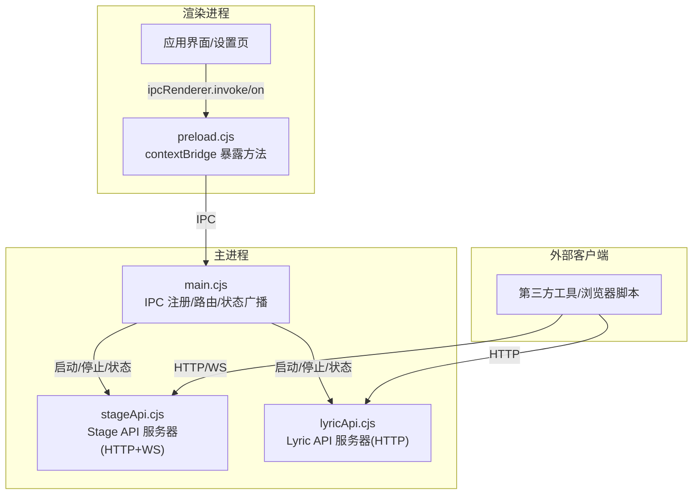
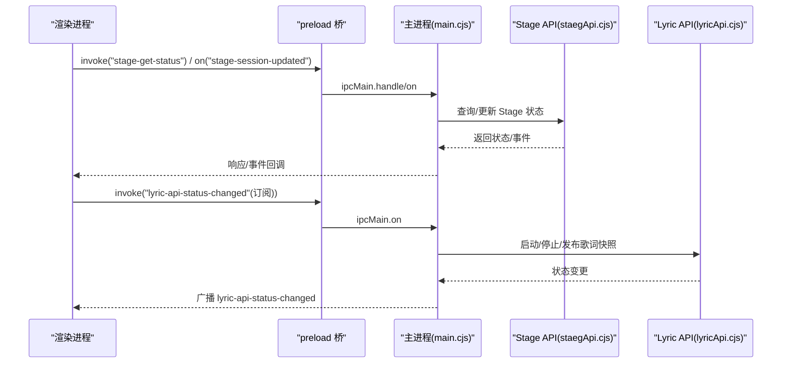
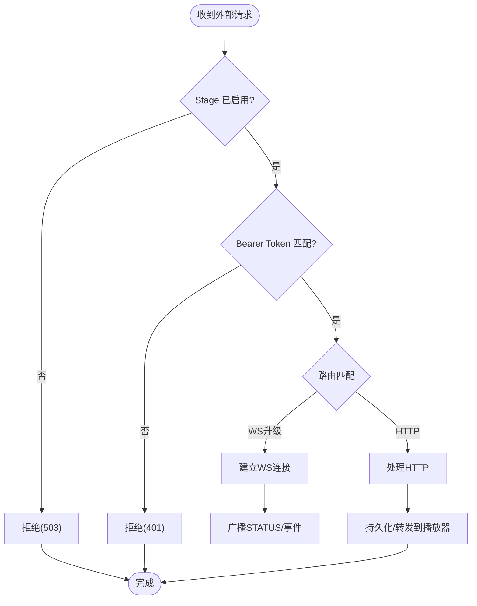
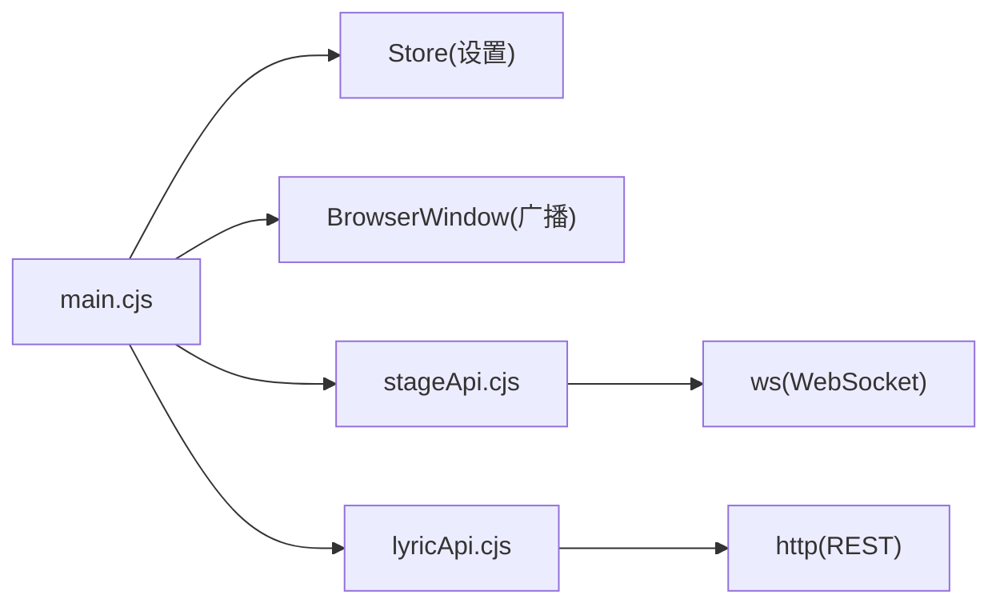

# IPC通道注册与管理

<cite>
**本文引用的文件**
- [electron/main.cjs](file://electron/main.cjs)
- [electron/stageApi.cjs](file://electron/stageApi.cjs)
- [electron/lyricApi.cjs](file://electron/lyricApi.cjs)
- [electron/preload.cjs](file://electron/preload.cjs)
- [src/mods/ipc.ts](file://src/mods/ipc.ts)
- [src/utils/stageClientDemo.ts](file://src/utils/stageClientDemo.ts)
</cite>

## 目录
1. [简介](#简介)
2. [项目结构](#项目结构)
3. [核心组件](#核心组件)
4. [架构总览](#架构总览)
5. [详细组件分析](#详细组件分析)
6. [依赖关系分析](#依赖关系分析)
7. [性能考量](#性能考量)
8. [故障排查指南](#故障排查指南)
9. [结论](#结论)
10. [附录](#附录)

## 简介
本文件聚焦 Folia Player 在主进程中的 IPC 通道注册与管理体系，围绕以下目标展开：
- 主进程中 IPC 通道的注册机制、命名规范、生命周期管理、事件监听器注册
- 外部接口通道（Stage API、Lyric API、远程控制等）的用途与配置方式
- 通道安全模型：权限验证、访问控制、沙箱隔离
- 通道复用与连接池管理，确保通信资源有效利用
- 错误处理与异常恢复，保证通道连接的稳定性与可靠性
- 性能优化策略：批量处理、连接复用、内存管理等最佳实践

## 项目结构
Folia Player 将 IPC 能力集中在 Electron 主进程，并通过 preload 桥接暴露给渲染进程；同时提供若干本地 HTTP/WebSocket 服务作为“外部接口通道”，供桌面端集成工具或浏览器侧客户端调用。

图示来源
- [electron/main.cjs:973-990](file://electron/main.cjs#L973-L990)
- [electron/stageApi.cjs:169-241](file://electron/stageApi.cjs#L169-L241)
- [electron/lyricApi.cjs:83-106](file://electron/lyricApi.cjs#L83-L106)
- [electron/preload.cjs:212-268](file://electron/preload.cjs#L212-L268)

章节来源
- [electron/main.cjs:973-990](file://electron/main.cjs#L973-L990)
- [electron/preload.cjs:212-268](file://electron/preload.cjs#L212-L268)

## 核心组件
- 主进程 IPC 中枢：负责注册 ipcMain 处理器、维护窗口与全局状态、广播事件、协调各子模块的生命周期
- Stage API：提供 HTTP + WebSocket 的外部接口，支持歌词推送、媒体会话、播放控制与队列操作，内置令牌鉴权与会话清理
- Lyric API：提供只读 HTTP 接口，输出当前歌词快照，便于 OBS/直播工具读取
- 预加载桥：在渲染进程暴露安全的 IPC 调用封装，统一事件订阅与取消订阅
- 插件系统 IPC：通过 preload 暴露 mods 相关 IPC，用于插件列表、启用/禁用、日志与导出进度

章节来源
- [electron/main.cjs:973-990](file://electron/main.cjs#L973-L990)
- [electron/stageApi.cjs:169-241](file://electron/stageApi.cjs#L169-L241)
- [electron/lyricApi.cjs:83-106](file://electron/lyricApi.cjs#L83-L106)
- [electron/preload.cjs:212-268](file://electron/preload.cjs#L212-L268)
- [src/mods/ipc.ts:1-119](file://src/mods/ipc.ts#L1-L119)

## 架构总览
下图展示了从渲染进程到主进程的 IPC 调用路径，以及主进程对外部 HTTP/WS 服务的编排。

图示来源
- [electron/preload.cjs:212-268](file://electron/preload.cjs#L212-L268)
- [electron/main.cjs:973-990](file://electron/main.cjs#L973-L990)
- [electron/stageApi.cjs:169-241](file://electron/stageApi.cjs#L169-L241)
- [electron/lyricApi.cjs:83-106](file://electron/lyricApi.cjs#L83-L106)

## 详细组件分析

### 主进程 IPC 通道注册与生命周期
- 通道命名规范
  - 请求类：以动词+名词形式组织，如 stage-get-status、stage-set-enabled、remote-control-send-command
  - 事件类：使用语义化事件名，如 stage-session-updated、stage-session-cleared、remote-control-command、remote-control-snapshot、lyric-api-status-changed
- 生命周期管理
  - 通过 createStageApi/createLyricApi 创建并持有实例，由 main.cjs 根据设置项决定是否启动/停止
  - 事件订阅在 preload 中统一封装，提供返回取消函数的订阅模式，避免内存泄漏
- 事件监听器注册
  - 渲染进程通过 ipcRenderer.on 注册事件，并在组件卸载时移除监听器
  - 主进程通过 mainWindow.webContents.send 向所有窗口广播状态变化

章节来源
- [electron/preload.cjs:212-268](file://electron/preload.cjs#L212-L268)
- [electron/main.cjs:973-990](file://electron/main.cjs#L973-L990)

### Stage API 通道（外部接口）
- 用途
  - 允许外部工具推送歌词、媒体会话，或触发搜索/播放
  - 提供播放器状态、控制能力、队列操作的 HTTP 与 WebSocket 接口
- 配置方式
  - 端口：默认端口常量，可通过设置覆盖
  - 令牌：自动生成并持久化，用于鉴权
  - 开关：通过设置项启用/禁用 Stage 模式与数据源
- 安全模型
  - 仅绑定 127.0.0.1，限制为本地访问
  - 所有写操作需携带 Bearer Token 校验
  - 会话资产按 session 隔离，保留最近 N 个会话，自动清理工作目录
- 连接复用与连接池
  - WebSocket 服务端按需创建，连接集合集中管理，断开时自动清理
  - 播放控制/队列请求采用 pending Map + 超时取消，避免悬挂请求
- 错误处理与恢复
  - 统一的 StageApiError，包含状态码与错误码
  - 清理未决请求、关闭 WS 与服务，广播状态变更

图示来源
- [electron/stageApi.cjs:169-241](file://electron/stageApi.cjs#L169-L241)
- [electron/stageApi.cjs:648-676](file://electron/stageApi.cjs#L648-L676)
- [electron/stageApi.cjs:678-778](file://electron/stageApi.cjs#L678-L778)

章节来源
- [electron/stageApi.cjs:169-241](file://electron/stageApi.cjs#L169-L241)
- [electron/stageApi.cjs:648-676](file://electron/stageApi.cjs#L648-L676)
- [electron/stageApi.cjs:678-778](file://electron/stageApi.cjs#L678-L778)

### Lyric API 通道（外部接口）
- 用途
  - 提供只读的当前歌词快照，供 OBS/直播工具拉取
- 配置方式
  - 端口固定默认值，可通过设置开启/关闭
  - 仅 GET /v1/lyric 可用，OPTIONS 预检支持
- 安全模型
  - 仅绑定 127.0.0.1，无鉴权（只读）
  - 响应头包含 CORS 与缓存控制
- 错误处理
  - 启动失败记录 lastError，状态广播通知前端
  - 停止时安全关闭服务器并广播状态

章节来源
- [electron/lyricApi.cjs:83-106](file://electron/lyricApi.cjs#L83-L106)
- [electron/lyricApi.cjs:107-139](file://electron/lyricApi.cjs#L107-L139)
- [electron/lyricApi.cjs:141-181](file://electron/lyricApi.cjs#L141-L181)

### 远程控制通道（IPC）
- 用途
  - 渲染进程向主进程发送远程控制命令，主进程广播命令与快照
- 通道与事件
  - 请求：remote-control-send-command
  - 事件：remote-control-command、remote-control-snapshot
- 安全模型
  - 通过 trusted renderer 检查，仅信任的主窗口内容可执行敏感操作
- 错误处理
  - 参数校验与权限校验失败直接拒绝

章节来源
- [electron/preload.cjs:212-222](file://electron/preload.cjs#L212-L222)
- [electron/main.cjs:1600-1609](file://electron/main.cjs#L1600-L1609)

### 插件系统 IPC（mods）
- 用途
  - 列出插件、启用/禁用、重载、导出、日志订阅等
- 通道与事件
  - 请求：listMods、setModEnabled、reloadMods、invokeModCommand 等
  - 事件：onModsStateChanged、onExportProgress、onModLog
- 安全模型
  - 通过 contextBridge 暴露，非 Electron 环境降级为空实现，保证 UI 可渲染
- 错误处理
  - 调用失败返回空结果或错误字段，UI 层做兜底

章节来源
- [src/mods/ipc.ts:1-119](file://src/mods/ipc.ts#L1-L119)

## 依赖关系分析
- 主进程依赖
  - 依赖 store 读取/写入设置项，驱动各通道启停
  - 依赖 BrowserWindow 进行跨进程事件广播
  - 依赖 fs/net/http/ws 等 Node 模块提供文件系统与网络能力
- 外部依赖
  - Stage API 依赖 ws 提供 WebSocket 服务
  - Lyric API 基于 http 提供 REST 接口
- 耦合与内聚
  - 各通道以工厂函数创建，主进程集中装配，降低耦合
  - 事件广播与状态构建解耦，便于扩展新通道

图示来源
- [electron/main.cjs:973-990](file://electron/main.cjs#L973-L990)
- [electron/stageApi.cjs:169-241](file://electron/stageApi.cjs#L169-L241)
- [electron/lyricApi.cjs:83-106](file://electron/lyricApi.cjs#L83-L106)

章节来源
- [electron/main.cjs:973-990](file://electron/main.cjs#L973-L990)

## 性能考量
- 批量处理
  - Stage 队列操作支持分页与 around=current 的窗口化查询，减少大对象传输
  - 音频/封面缓存写入后触发修剪，避免磁盘膨胀影响 IO
- 连接复用
  - WebSocket 服务端单例，连接集合管理，断线重连由客户端负责
  - HTTP 短连接按需创建，无长连接池开销
- 内存管理
  - 会话资产索引限制最近 N 个，定期清理工作目录
  - 未决请求 Map 带超时清理，防止内存泄漏
- 事件去抖
  - 窗口状态保存、壁纸模式切换等场景使用定时器合并快速操作

章节来源
- [electron/stageApi.cjs:538-559](file://electron/stageApi.cjs#L538-L559)
- [electron/stageApi.cjs:714-745](file://electron/stageApi.cjs#L714-L745)
- [electron/stageApi.cjs:678-688](file://electron/stageApi.cjs#L678-L688)
- [electron/main.cjs:1101-1129](file://electron/main.cjs#L1101-L1129)

## 故障排查指南
- 常见问题定位
  - Stage 无法连接：检查是否启用、端口占用、Token 是否正确
  - Lyric API 不可用：检查设置开关、端口冲突、lastError 信息
  - 远程控制无响应：确认 trusted renderer、事件订阅是否正确
- 诊断步骤
  - 查看主进程日志与状态广播事件
  - 使用浏览器或 curl 测试本地 HTTP 接口
  - 使用 WebSocket 客户端连接 /stage/player/ws 验证事件流
- 恢复策略
  - 重启对应服务（Stage/Lyric），清理未决请求与会话
  - 重置窗口状态或重新生成 Token

章节来源
- [electron/stageApi.cjs:648-676](file://electron/stageApi.cjs#L648-L676)
- [electron/lyricApi.cjs:141-181](file://electron/lyricApi.cjs#L141-L181)
- [electron/preload.cjs:212-268](file://electron/preload.cjs#L212-L268)

## 结论
Folia Player 的 IPC 通道体系以主进程为核心，结合轻量级本地 HTTP/WebSocket 服务，实现了内外一致的通信模型。通过严格的命名规范、令牌鉴权、会话隔离与资源清理，保障了安全性与稳定性。配合批量处理、连接复用与内存管理策略，系统在复杂场景下仍保持良好性能。未来可在通道层面引入更细粒度的权限模型与审计日志，进一步提升可扩展性与可观测性。

## 附录
- 外部接口契约参考
  - Stage API 客户端输入类型定义（歌词/搜索/播放/控制/队列）
  - 建议客户端遵循 Token 鉴权与错误码约定

章节来源
- [src/utils/stageClientDemo.ts:1-53](file://src/utils/stageClientDemo.ts#L1-L53)